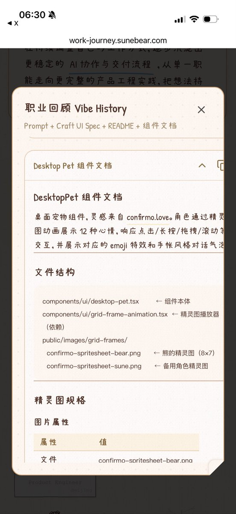
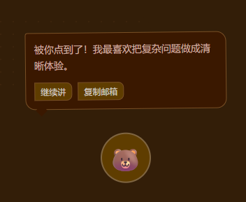
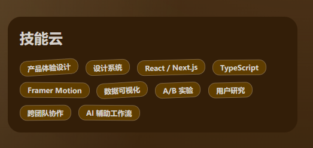

把自己 10 年码农生涯 Vibe 成了一个页面：
[work-journey.sunebear.com](https://work-journey.sunebear.com)
留给女儿长大看看，我以前是干嘛的
下一个 10 年，我先切到网约车分支了

## 💬 Replies

### 1 @HiSuneBear (舒乐熊 SuneBear 🐻) (Author)

*Sun Mar 22 11:42:15 +0000 2026*

顺便一提，这个页面的 Prompt 和 UI Spec 我都放在页脚公开了，可能比开源代码更有意义

### 2 @HiSuneBear (舒乐熊 SuneBear 🐻) (Author)

*Mon Mar 23 01:30:48 +0000 2026*

我给 UI Spec 做了个示例页面 [work-journey.sunebear.com/ui](https://work-journey.sunebear.com/ui) 目前代码都在一个文件，后面弄完组件化再开源出来

### 3 @aronhouyu (Aron厚玉)

*Sun Mar 22 13:42:16 +0000 2026*

@HiSuneBear 会前端真好 实名羡慕

### 4 @cheesetalk1997 (CheeseTalk 🧀️)

*Sun Mar 22 23:26:16 +0000 2026*

@HiSuneBear 好可爱！！

### 5 @HiSuneBear (舒乐熊 SuneBear 🐻) (Author)

*Mon Mar 23 01:18:30 +0000 2026*

@cheesetalk1997 哈哈，多谢 Yuqian，特别喜欢你绘画风格

### 6 @diowang (diowang)

*Sun Mar 22 13:16:38 +0000 2026*

@HiSuneBear 我觉得你把整个界面做出一个复古电脑的样子，然后所有的经历都做出icon的样子，每次点击就相当于打开一个游戏这样更有代入感。

### 7 @HiSuneBear (舒乐熊 SuneBear 🐻) (Author)

*Sun Mar 22 13:37:37 +0000 2026*

@diowang 多谢提议，模拟一个可交互的复古电脑工程量比较大，最近 CC 封号比较严重，Vibe 效率低……

### 8 @JingLW695 (Foucs)

*Sun Mar 22 22:33:56 +0000 2026*

@HiSuneBear 很棒 每个细节都看完了，那个熊我戳了好几次hh。然后这里有一个组件的盒子大小在展开后被撑开了，可以优化下。 

### 9 @HiSuneBear (舒乐熊 SuneBear 🐻) (Author)

*Mon Mar 23 02:23:18 +0000 2026*

@JingLW695 多谢反馈，应该是移动端宽度不够导致的，需要给部分文字强制换行

### 10 @abcfy2 (Feng Yu)

*Mon Mar 23 06:26:54 +0000 2026*

@HiSuneBear 界面特别炫，非常好看，不过总感觉动画不是太流畅，页面总感觉卡卡的，怀疑是DOM 性能问题，可以尝试用一些页面性能评估工具（page speed?）看看优化下

### 11 @HiSuneBear (舒乐熊 SuneBear 🐻) (Author)

*Tue Mar 24 05:40:08 +0000 2026*

@abcfy2 页面用到了 svg filter 动画，这个应该算是 anti pattern，会导致页面频繁重绘，我在 iOS 禁用了这类动画应该会好一些

### 12 @Friend_TuTuLiu (跑蛋蛋（刘二蛋） Eggs Liu)

*Sun Mar 22 14:48:15 +0000 2026*

@HiSuneBear 这个网约车
是真的去开网约车了么\~

### 13 @HiSuneBear (舒乐熊 SuneBear 🐻) (Author)

*Mon Mar 23 03:02:45 +0000 2026*

@Friend\_TuTuLiu 先用这个过渡，自动驾驶成熟了也会被取代，后面再掌握一个衣食住行相关的技能

### 14 @Ley1l1 (Ley1l1)

*Mon Mar 23 05:52:50 +0000 2026*

@HiSuneBear 你肯定有绝活,复刻不了一点,我这用codex复刻的像个shit😂R

### 15 @HiSuneBear (舒乐熊 SuneBear 🐻) (Author)

*Mon Mar 23 06:36:58 +0000 2026*

@Cli13146688 我第一版是用 v0 实现的，他底层模型应该是 Opus 4.5。现在 vibe designing 做得 UI 已经很不错了，可以先用 Variant 或 Stitch 出一版大概的 UI 然后再优化细节

### 16 @GeekCrafter (GeekCraft)

*Sun Mar 22 14:39:00 +0000 2026*

@HiSuneBear 最底部的动画是什么技术栈

### 17 @HiSuneBear (舒乐熊 SuneBear 🐻) (Author)

*Sun Mar 22 14:59:14 +0000 2026*

@GeekCrafter 纯 Canvas 渲染，AI 自己决定的，我感觉这个复杂度纯 DOM 也能实现

### 18 @yinmin1987 (尹珉)

*Mon Mar 23 01:22:02 +0000 2026*

@HiSuneBear 曾经是TB用户～哈哈

### 19 @wquguru (WquGuru)

*Sun Mar 22 15:39:55 +0000 2026*

@HiSuneBear 最接近设计师的coder😃

### 20 @zohanlin (佐哥 ZOHAN 🅿️)

*Sun Mar 22 13:13:47 +0000 2026*

@HiSuneBear @hwwaanng 可愛清新

### 21 @taowang1 (Tao)

*Sun Mar 22 16:50:42 +0000 2026*

@HiSuneBear 有审美

### 22 @blanplan (BlanPlan)

*Sun Mar 22 15:05:48 +0000 2026*

@HiSuneBear 有意思的网站，看到是深圳的小伙伴，加了一下你的微信

### 23 @charuint (悟明)

*Sun Mar 22 13:25:15 +0000 2026*

@HiSuneBear 羡慕一些前端写的好的

### 24 @sanbuphy (Sanbu 散步)

*Mon Mar 23 01:03:39 +0000 2026*

@HiSuneBear 太有品味了

### 25 @wenqin231 (ruok231)

*Sun Mar 22 16:54:56 +0000 2026*

@HiSuneBear @hwwaanng 页面真不错，但是网约车也不招人了

### 26 @limbopeng (LimboAI)

*Mon Mar 23 00:20:32 +0000 2026*

@HiSuneBear 页面非常精美，很有仪式感。

### 27 @srdrm (uuvioz)

*Sun Mar 22 17:14:59 +0000 2026*

@HiSuneBear 非常有趣的制作

### 28 @abei557832 (a bei)

*Sun Mar 22 12:56:28 +0000 2026*

@HiSuneBear @hwwaanng 很好看！感谢分享

### 29 @freeLifeFFF (CY.Sean)

*Sun Mar 22 17:08:57 +0000 2026*

@HiSuneBear 看了一眼，然后就关注了😌

### 30 @tcyeee (y c)

*Mon Mar 23 06:50:00 +0000 2026*

@HiSuneBear 好可爱的网站

### 31 @TonyLiu41092016 (TonyLiu)

*Mon Mar 23 04:16:31 +0000 2026*

@HiSuneBear 做的很不错。

### 32 @DustRealm_07 (DustRealm)

*Mon Mar 23 01:28:43 +0000 2026*

@HiSuneBear 好可爱的小熊🐻

### 33 @loadlin (loadlin)

*Sun Mar 22 14:15:26 +0000 2026*

@HiSuneBear 简直太棒了

