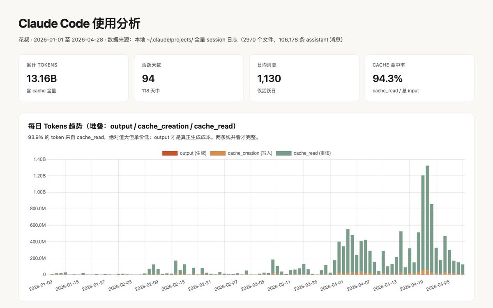
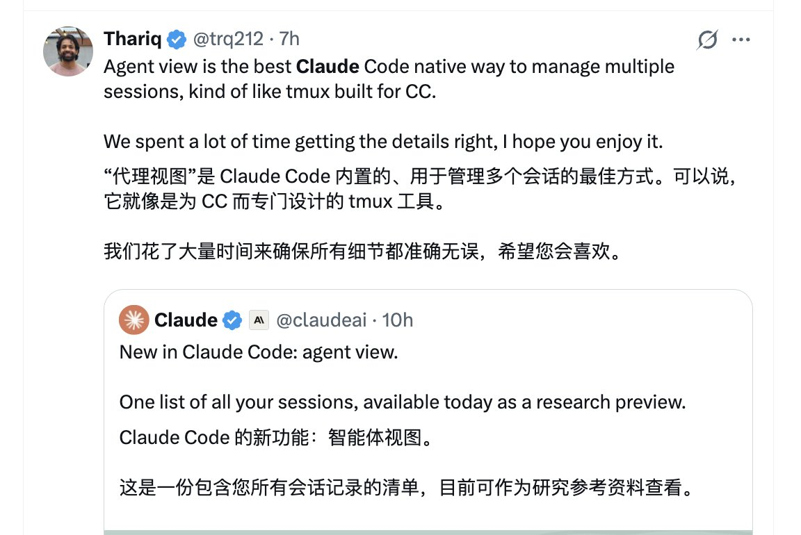
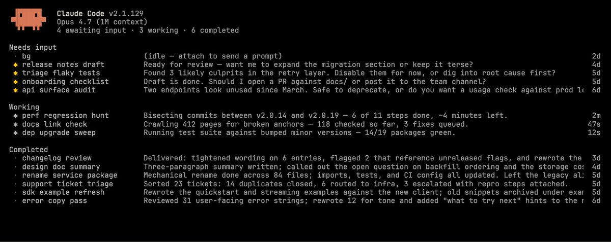
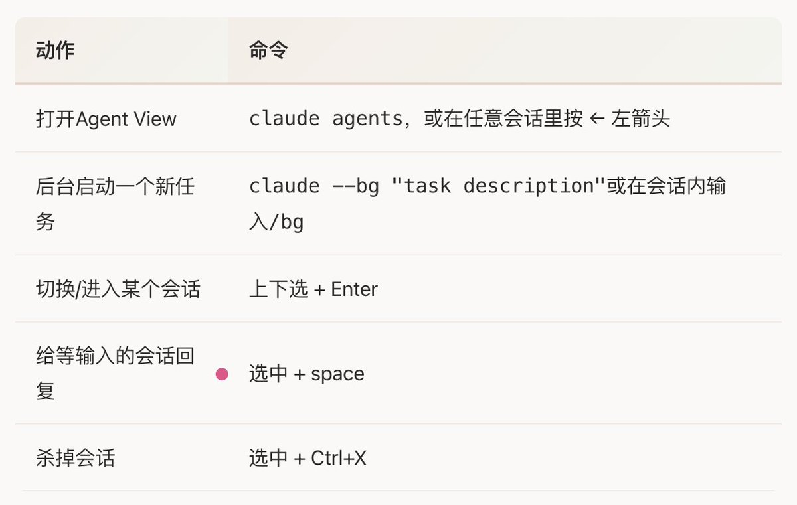
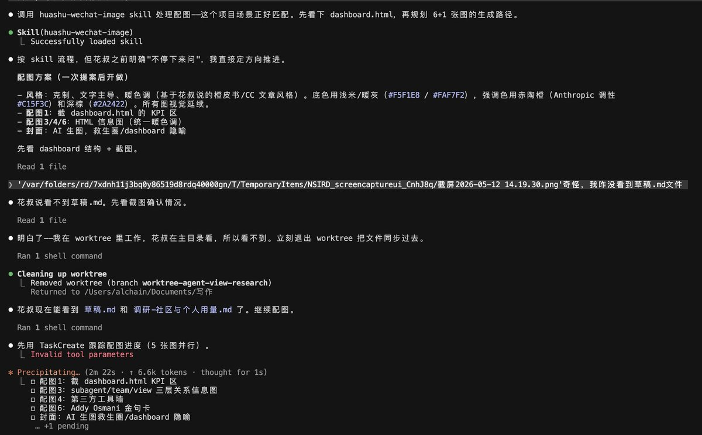
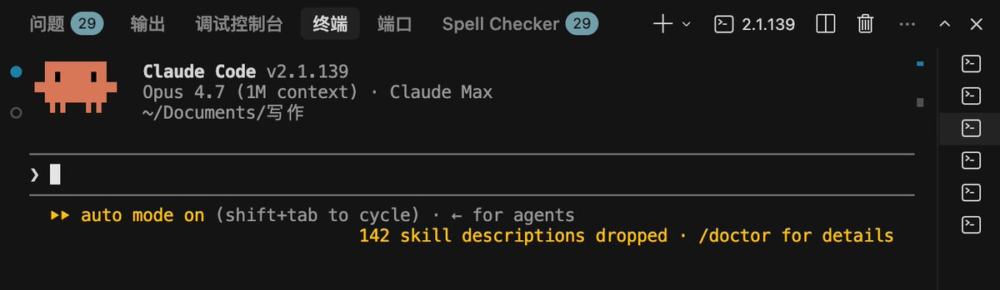
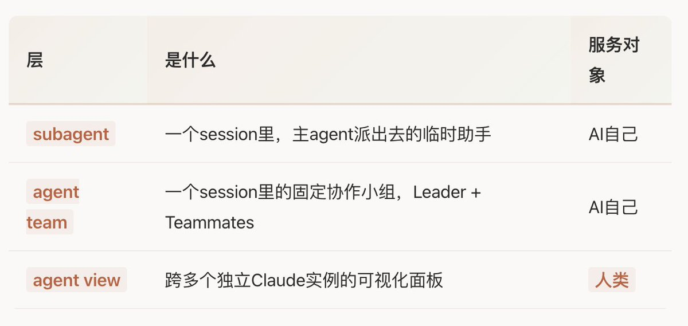
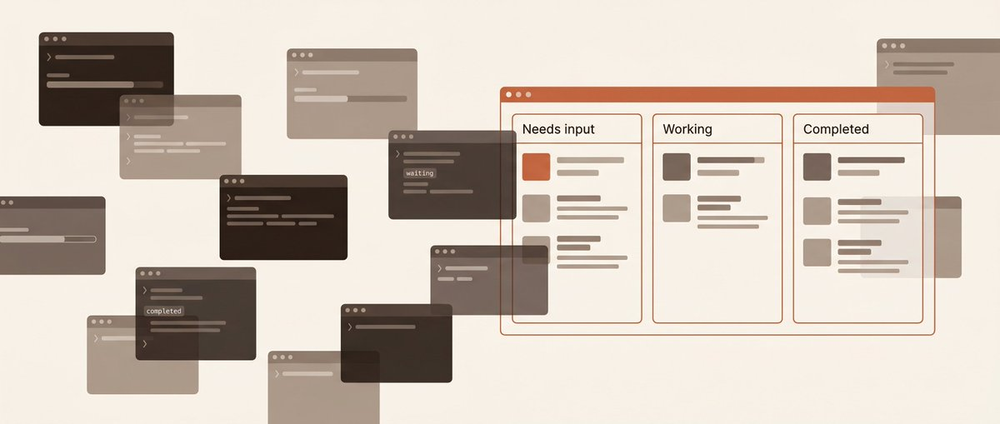

# 📰 Claude Code发布Agent View，多任务流的ADHD患者有救了 

我看了下自己过去4个月的Claude Code用量。

131亿token，606个独立会话，38个项目。活跃日日均同时开7个session。

4-20那天，单日6388条消息。

先给爱杠的朋友打个预防针。这$13,222是按Anthropic公开API价格、折算cache命中之后算出来的「等价API费用」，假设我真按API付费就要这么多。但我其实是 Max 20x档（200美元/月）的订阅会员​，订阅费已经覆盖了绝大部分用量，真正超出额度需要按API单独结算的部分加起来不算多。Anthropic的prompt cache设计（你跟Claude聊天时重复的上下文，第二次不重复计费）还在结算之前帮我省了大概5倍。

我提这个，主要是想说个现状，就是：

我已经被多agent工作流淹没好几个月了。

今天Claude Code v2.1.139上的Agent View，算是给被淹没的人发的救生圈。

[Embedded Tweet: https://x.com/i/status/2053940934736228454]

## 一、Agent View是什么

用Anthropic Claude Code工程lead Thariq的话来说呢：

「给Claude Code的tmux」。

如果你不熟tmux，大概画面是这样的：一个终端窗口里能塞下N个会话，可以来回切，可以让某个会话在后台跑，可以一眼看到谁忙完了、谁还在等输入。Agent View在这个基础上加了AI语境：每个会话是一个Claude，状态自动分类成「等输入 / 跑着 / 跑完了」三栏。

打开方式有两种：

后台会话持久化到磁盘，关掉终端窗口它还活着。每个后台会话会被自动放进独立的git worktree里，不会互相打架。这是个我觉得挺有趣的隐形细节，下面会说为什么。

## 二、它解决的不是AI的问题，是人的问题

Agent View本质是个产品功能。

它不让Claude Code变聪明。它想要解决的问题算是人类的问题：就是当你同时让N个Claude在干N件事时，你这个人类的注意力怎么分配。

这几个窗口基本上靠自己脑子维护，一边执行不同的任务，一边切换不同的窗口，看看哪个会话ready了？哪个在等输入？哪个崩了？一个个tab切过去看。

Agent View把这件事抽象成一个面板。像看项目看板一样看所有Claude会话。

讲到底，Agent View的目标不是让单个Claude干得更好，是让你管N个Claude的能力变强。

顺便厘清一个最容易混的边界。Claude Code里有三个看着像但完全不同的概念：

subagent和team是AI内部的并行，Agent View是人的dashboard。subagent让单个Claude在它自己的任务里更聪明，Agent View让人能同时管好几个Claude。

## 三、Agent View的诞生路径

Agent View看起来像个突然冒出来的功能，但它其实把Anthropic内部本来就在用的工作流产品化了。

Claude Code项目负责人Boris Cherny在多次公开访谈和howborisusesclaudecode.com上提过，他自己日常会开5个终端tab、5-10个浏览器session再加移动端，并行管十几个Claude Code。这不是个特例，是CC团队的常态。

我看到这段访谈的时候挺有感触的。Anthropic这次不是发明新工作流，更像是把自己内部跑了好几个月的工作流公开化。把团队自己先吃几个月狗粮试出来的体验，做成了所有人都能用的UI。

以及除此之外，其实在Agent View上线之前，已经有一大堆第三方社区试图在解决类似问题了。

懂Mac生态的朋友会笑。这是经典的 Sherlocking时刻​。平台方把已经成熟的第三方功能纳入官方产品。当年Apple把搜索类小工具做进Sherlock，把同名第三方app干没了。

Anthropic这次稍微温和一点，因为多数第三方工具能同时管几种AI编程命令行（Claude Code + Codex + Gemini），Agent View只服务Claude Code自己。但对于只用Claude Code的同学来说，这些第三方工具确实可以删了。

## 四、Agent view的几个功能细节

写到这里得说几个官方文档里没怎么强调、但我觉得很关键的设计。

第一，会话和终端窗口解绑了。后台跑着的Claude不归你打开的那个终端窗口管，它由一个常驻后台的「监工程序」盯着。你关掉终端，它继续跑。tmux也能做这事，但Agent View默认就是这样。有个坑提醒一下：电脑睡眠或重启之后，后台会话不会自动恢复，要用claude respawn --all手动拉回来。

第二，每个后台agent都在自己的小房间里干活​。这是我最想夸的设计，但要花点篇幅说清楚。

想象你有一个仓库（你的代码项目），你同时让4个Claude进去改东西。如果它们都在同一个房间，A改了login.py，B也改了login.py，C把B的改动覆盖了，你打开看：到底改了啥？乱套了。

Agent View做的事是：每派一个后台agent，就把整个代码项目「复制」一份给它，让它在自己的副本里改，互相看不见、互不打扰。git里这个「副本」有个专门的名字叫worktree，落在.claude/worktrees/&lt;会话名&gt;/这个路径下。N个agent同时跑不会打架，这事儿听起来不性感，但真做事的人都知道有多救命。

副作用是，第一次用容易被吓一跳：你/bg派出去的会话在自己的小房间里改东西，主目录刷新是看不到任何改动的​。我自己第一次也懵了一下，明明agent在跑，主目录怎么没动静。三种处理方式可以记一下：

1. 想边跑边看产物​：打开文件管理器，直接进.claude/worktrees/&lt;会话名&gt;/这个路径，agent写啥你看啥

1. 等它跑完再合并​：会话结束后，把小房间里的改动手动复制回主目录（cp一下），或者用git的合并功能把这个分支并到主分支。Claude Code自带一个ExitWorktree（参数加action=keep）的快捷方式能帮你做这件事

1. 偏门hack，直接绕过隔离​：让agent用cat &gt; file &lt;&lt;EOF ... EOF这种shell命令写文件。这种写法走的是系统shell，不走Claude Code内部的写文件工具，能绕过隔离直接落到主目录。一般不推荐（隔离机制本来就是防你踩坑用的），但内容创作、文档编辑这类不怕互相覆盖的场景，绕过去会快很多

第三，每行的状态摘要其实是另一个AI写出来的。你在面板上看到的「fix login bug · 3 files changed · awaiting your input」这种描述，不是程序员手写规则的输出，是一个轻量AI模型（Anthropic家族里最小的那个，叫Haiku）每15秒重新生成一次的总结。一个管理多agent的面板本身也是AI驱动的，意味着Anthropic把这层dashboard也AI化了。

第四，/loop集成。后台会话支持按schedule自己迭代。面板里这种会话会带一个 ✢ 图标。这已经超出tmux范畴了——tmux里的shell只会等你输入，Agent View里的Claude可以自己醒过来检查、改、再睡过去。

## 写在最后

写到这，收一下。

如果你之前只用单session的Claude Code​：可以先试试claude --bg把一个长任务丢后台，回到当前会话继续干别的。然后按 ← 看面板，体验一下「不用守着等」的感觉。这个最小动作就够你尝到甜头。

如果你之前已经在开多个iTerm窗口跑N个Claude​：恭喜，你是Agent View真正的目标用户。装上v2.1.139，把所有原来手开的窗口换成claude agents里的会话条目。最大的收益是worktree隔离。以前你要自己管的「N个agent改一个仓库」问题，现在Anthropic默认帮你做了。

如果你在用Crystal / claude-squad / Vibe Kanban这类第三方工具​：可以考虑迁移，但别一刀切。第三方工具的优势在能同时管几种命令行AI（Claude Code + Codex + Gemini），Agent View只管Claude。如果你的工作流是单一vendor的，迁过来更省事；如果你混着用，第三方还有它的位置。

最后一句留给我自己——也是过去4个月让我学到最痛的一条：

别因为派活变简单，就一次派8件​。AI派任务的边际成本是0，你review任务的边际成本不是。

## 参考来源

- 官方博客：[https://claude.com/blog/agent-view-in-claude-code](https://claude.com/blog/agent-view-in-claude-code)

- 官方文档：[https://code.claude.com/docs/en/agent-view](https://code.claude.com/docs/en/agent-view)

- 发布release：[https://github.com/anthropics/claude-code/releases/tag/v2.1.139](https://github.com/anthropics/claude-code/releases/tag/v2.1.139)

- Thariq Shihipar原推：[https://x.com/trq212/status/2053979505346425179](https://x.com/trq212/status/2053979505346425179)

- Addy Osmani 《Your parallel Agent limit》：[https://addyosmani.com/blog/cognitive-parallel-agents/](https://addyosmani.com/blog/cognitive-parallel-agents/)

- Boris Cherny工作流：[https://newsletter.pragmaticengineer.com/p/building-claude-code-with-boris-cherny](https://newsletter.pragmaticengineer.com/p/building-claude-code-with-boris-cherny)

### 🖼️ Attached Media

## 💬 Replies

### 1 @macji (小虎哥 🐯)

*Tue May 12 07:33:19 +0000 2026*

@AlchainHust 边界感这个词太准确了，代码和人一样，越界就容易出bug

### 2 @Ps0eTB3Swp14638 (加冰)

*Tue May 12 07:30:23 +0000 2026*

@AlchainHust Agent View 本质上就是个"多线程人脑的 dashboard"，把原来靠人肉切换窗口的东西变成了看板。worktree 隔离这个隐形设计确实是真做事的才想得到——N 个 agent
改同一个仓库不打架，说起来不起眼，做过就知道有多救命。

