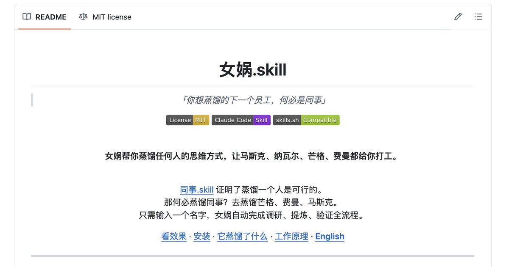
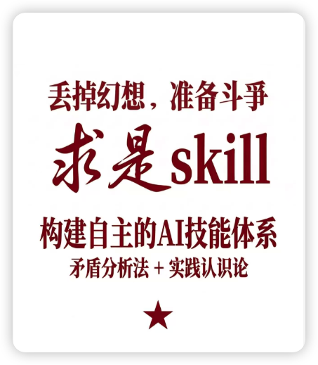
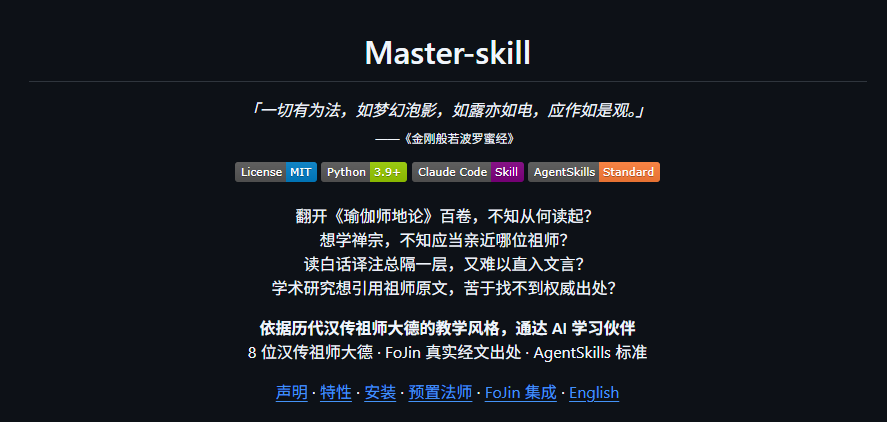
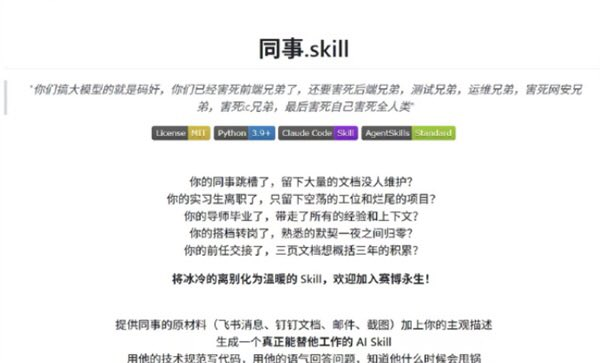
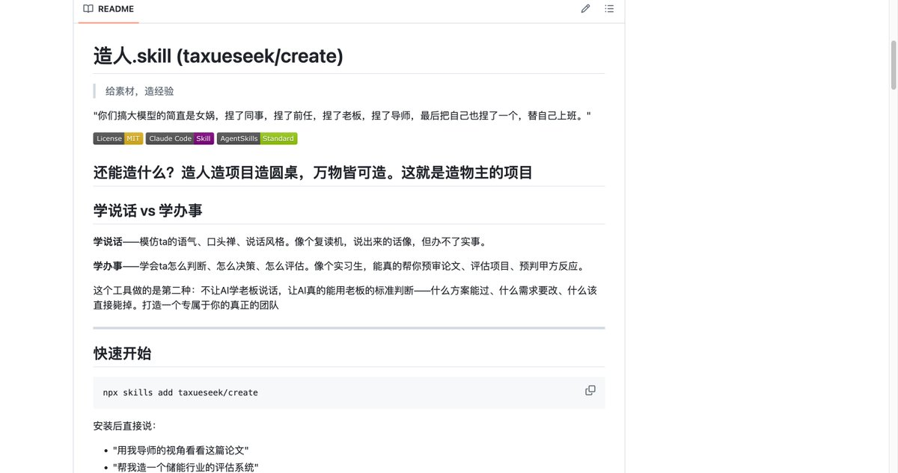
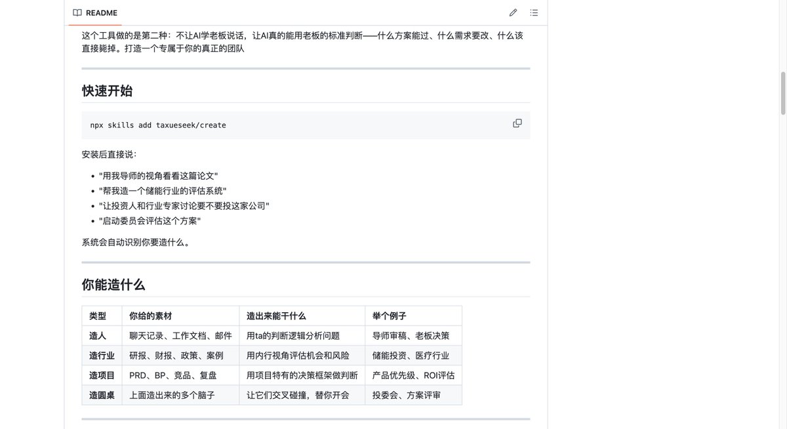

你的下一个员工，何必是同事。

同事.skill这几天火了，把同事蒸馏成AI Skill。这个项目证明了一件事：蒸馏一个人的能力，是可行的。

但我想问一个问题：既然我们已经有了蒸馏人的能力，为什么要蒸馏身边的同事？

去蒸馏各领域最强的人。

而且幸运的是，这些人留下了大量可以被蒸馏的材料。芒格有《穷查理宝典》和几十年的股东会演讲。费曼有全套讲义和自传。Naval有几百条推文和长篇播客。塔勒布有五本书和无数公开辩论。这些都是高纯度的思维原矿，等着被提炼。

我之前就一直在干这件事。今天把方法论开源了，叫女娲。

使用极其简单：输入一个名字就行。女娲自动启动6个Agent去找书、找播客、找推文、找批评者，自己调研、自己提炼、自己验证。你不需要准备任何材料。

6个Agent并行采集著作、播客、社交媒体、批评者视角、决策记录、时间线。然后三重验证：一个观点要被收录为心智模型，必须跨2个以上领域出现过、能预测新问题立场、不是所有聪明人都会这么想。三条全过才留。

决策前问芒格，写教程问费曼，评估风险问塔勒布。你想蒸馏谁就蒸馏谁。

GitHub: [github.com/alchaincyf/nuw…](https://github.com/alchaincyf/nuwa-skill)
安装: \`npx skills add alchaincyf/nuwa-skill\`

MIT协议，随便用，随便改，随便造。

### 🖼️ Attached Media

## 💬 Replies

### 1 @spectredxxx (spectredxxx)

*Sun Apr 05 05:19:27 +0000 2026*

@AlchainHust 虽然但是，为什么不是nvwa

### 2 @AlchainHust (花叔) (Author)

*Sun Apr 05 05:27:21 +0000 2026*

@spectredxxx 女娲公认的英文名确实就是nuwa，或者更准确的话会是Nüwa

### 3 @mylifcc (lifcc)

*Sun Apr 05 05:23:43 +0000 2026*

@AlchainHust 试过类似路子，最容易踩的坑是蒸出来的是「语气」而不是「判断力」——芒格的幽默AI学得很快，但「什么时候该果断说不」这种直觉藏在字缝里，文字材料抓不住。另外播客转录的信噪比比亲笔著作低太多，建议优先拿书当原矿

### 4 @AlchainHust (花叔) (Author)

*Sun Apr 05 05:27:59 +0000 2026*

@mylifcc 那肯定，不过自己出传记的人太少了，还是需要适配更多元的情况

### 5 @mimutsai (河沿)

*Sun Apr 05 06:29:25 +0000 2026*

@AlchainHust 入口除了名字，还可以有行业职位描述，然后提供人名选择。

### 6 @AlchainHust (花叔) (Author)

*Sun Apr 05 06:30:32 +0000 2026*

@mimutsai 好想法

### 7 @BeefJ125 (Beef Jerky)

*Sun Apr 05 07:24:56 +0000 2026*

@AlchainHust 生成的不同人的skill都在一个skill.md文件里吗？

### 8 @AlchainHust (花叔) (Author)

*Sun Apr 05 07:27:46 +0000 2026*

@BeefJ125 不是，每个人都会独立成为skill

### 9 @WangDadWithAI (又又（薄肌版）)

*Tue Apr 07 11:02:27 +0000 2026*

@AlchainHust 其实现在对大众更有用的不是这些超级名人，而是一些kol，如果这些kol的主要知识都在抖音上的大量切片或者长视频。是不是这个agent就无法提取来？

### 10 @AlchainHust (花叔) (Author)

*Tue Apr 07 11:05:30 +0000 2026*

@WangDadWithAI 差不多是的，kol有效性算是最高的。

内容是长视频也不要紧，都有很多转述的表达，大多数只要知名度高一些，都能采集到内容的。实在不行的就只能自己放内容了。

### 11 @Will_Yang_ (Will Yang)

*Mon Apr 06 02:25:45 +0000 2026*

@AlchainHust 花叔这个skill太强了[x.com/Will\_Yang\_/sta…](https://x.com/Will_Yang_/status/2040978397707526487?s=20)

### 12 @WEEXAILabs (WEEX AI Labs)

*Tue Apr 07 03:40:44 +0000 2026*

@AlchainHust 别蒸馏同事了，直接蒸馏人类天花板，赢麻了

### 13 @huhi471356 (花海)

*Sun Apr 05 06:34:10 +0000 2026*

@AlchainHust 花叔牛逼，感谢分享。

前任skills、同事skills、反蒸馏skills、求是skills、女娲skills。

感觉未来会出现更多更加符合人类的行为、举止，要求，更加针对性的skills。

比如把某一个领域的知识进行浓缩的skills，针对性某一个课程体系的skills。

从蒸馏和整合技能，到蒸馏和整合人类....属实有趣。 

### 14 @CuteDrBunny (小動物管理員)

*Sun Apr 05 20:27:04 +0000 2026*

@AlchainHust 换了个skill的名字而已，其实都是llm拟人玩剩下的东西。skill擅长的是保存下来有用的工作流程不用每次重新尝试生成，但是要拟人用skill这种本质为prompt的东西只会导致模型生硬地重复表面化的语气和词汇。

### 15 @Wenma_Daoren (Tim Ren)

*Sun Apr 05 05:59:02 +0000 2026*

@AlchainHust [github.com/xr843/Master-s…](https://github.com/xr843/Master-skill)😀p

### 16 @justlikemaki (何夕2077 (个板马版))

*Sun Apr 05 10:54:36 +0000 2026*

@AlchainHust 思路挺野的，不过蒸馏的上限取决于输入质量。

公开言论能捕捉风格，但真正值钱的是决策过程中没说出口的那部分。芒格的 mental model 公开课到处有，但他怎么在具体交易里做取舍，这才是 skill 该学的东西。

期待看到更结构化的 prompt engineering 方案。

### 17 @lala_oldtang (Mr Richard@AI+Crypto)

*Sun Apr 05 09:28:45 +0000 2026*

@AlchainHust 同事己被蒸馏，以后只有赛博牛马，不需要人类牛马了。☠️ 

### 18 @lymww1 (lymww)

*Sun Apr 05 16:31:37 +0000 2026*

@AlchainHust 好好好，我先蒸一个总书记的治国理政

### 19 @Jack56803 (外卖Lawyer)

*Sun Apr 05 06:42:49 +0000 2026*

@AlchainHust 我去，太牛掰了，最近两个月，我每天都在亢奋地体验各种不同的项目，起早贪黑。

### 20 @HolmesAmzish (Cacc)

*Sun Apr 05 16:38:59 +0000 2026*

@AlchainHust 名人留下的不仅是自己的文字，还有世人对他的评价、解读。换句话说难道名人不是已经被蒸馏过了吗

### 21 @haojm1 (回来)

*Mon Apr 06 00:58:00 +0000 2026*

@AlchainHust 蒸馏一个郭德纲一个于谦，让两个人在AI里说相声

### 22 @TaXue2025 (踏雪寻仙)

*Mon Apr 06 09:04:33 +0000 2026*

@AlchainHust 我也分享一个造人skill
给大家，造人造项目造团队都适用，造出来的不同角色还能开会讨论，不管是圆桌还是委员会都行： 

### 23 @xpg0970 (神奇小喷菇AIGC)

*Tue Apr 07 01:40:15 +0000 2026*

@AlchainHust 这个事情，像一个噱头，我们和AI打交道的人都知道AI还没那么聪明

### 24 @jialu1996 (Fishforever🔺🔥)

*Sun Apr 05 08:56:11 +0000 2026*

@AlchainHust 这个思路真是牛逼

### 25 @xiaozheliulei12 (jack)

*Mon Apr 06 17:13:22 +0000 2026*

@AlchainHust 太有意思啦

### 26 @Yangtze07 (Yangtze阳子江)

*Sun Apr 05 08:25:39 +0000 2026*

@AlchainHust 哈哈，像在拍电视剧了，这次观音，下钟馗

### 27 @0TFWx6o6w90NdiL (茜茜公主& Anthony)

*Sun Apr 05 08:50:06 +0000 2026*

@AlchainHust 可以加微信吗？求学习s kill，

### 28 @fengtui8 (呈诫元奘)

*Sun Apr 05 09:37:28 +0000 2026*

@AlchainHust 这么牛逼，先去蒸馏claude code 和claude code创始人和他们的团队，在蒸馏特朗普马斯克查理芒格巴菲特吧

### 29 @yrSohelpmeGod (Yeelan)

*Sun Apr 05 05:19:00 +0000 2026*

@AlchainHust 预计会火

### 30 @Jaden_riku (Jaden 抽象日志)

*Tue Apr 07 00:41:04 +0000 2026*

@AlchainHust @Grok，请分析一下这个 Skill 背后的底层逻辑，用第一性原理去拆解一下它的玩法，还有具体落地的商业场景，谢谢

### 31 @Gobi7777777 (Jimmy Strawberries🍓)

*Sun Apr 05 05:32:33 +0000 2026*

@AlchainHust 花神，我的偶像

### 32 @shifenglong2025 (史风龙)

*Sun Apr 05 23:59:52 +0000 2026*

@AlchainHust @grok 整理一下这篇文章内容，发给我

### 33 @ReyJudgementOS (Rey英语自由｜判断位)

*Mon Apr 06 02:15:14 +0000 2026*

提取判断结构，在真实世界、承担后果的情况下演练，
特别是识别高上限选项和归零风险这两项，
价值连城

### 34 @Liqui_Sniper (Liquidity Sniper)

*Mon Apr 06 07:17:38 +0000 2026*

@AlchainHust Hire the skill, not the body. Cuts payroll drama and way less hanging-by-the-fridge energy  -  humans for vibes, AI for the grind, ngl.

