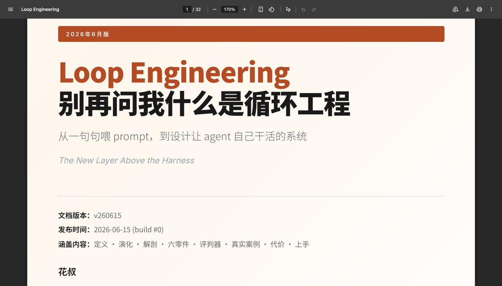

虽迟但到！一大堆人找我要的《Loop Engineering橙皮书📙》来了。

32页！老规矩：免费、开源、评论区自取！

以及，你需要知道的是，这当然是我的橙皮书skill自动写的，它收集整理了现在关于这个概念几乎所有的可靠信源的讨论，然后读取了我的写作风格和经验输出。

不是关于loop enginnering的圣经，也不是你借此就能精通了。它完全可以是，以及只是一份帮助你快速全方位理解loop engineering概念、来源、以及实践要点的一份参考资料。

enjoy～

### 🖼️ Attached Media

## 💬 Replies

### 1 @AlchainHust (花叔) (Author)

*Mon Jun 15 05:30:43 +0000 2026*

loop engineering橙皮书📙👉：[github.com/alchaincyf/loo…](https://github.com/alchaincyf/loop-engineering-orange-book)

### 2 @zalegzl (扎乐)

*Mon Jun 15 06:34:29 +0000 2026*

@AlchainHust 会上微信读书嘛

### 3 @AlchainHust (花叔) (Author)

*Mon Jun 15 06:45:43 +0000 2026*

@zalegzl 微信读书审批太久了，不一定

### 4 @drjingle (Dr.Jingle)

*Mon Jun 15 07:05:44 +0000 2026*

@AlchainHust 微信读书上正在看

### 5 @GeekCatX (知识猫AI实验室)

*Mon Jun 15 07:30:29 +0000 2026*

@AlchainHust 太快了

### 6 @ainewmeth (John Fan)

*Tue Jun 16 13:52:30 +0000 2026*

@AlchainHust 我理解这玩意在管理学里就是PDCA循环，是loop了，自动化了，Token扛不住吧？再有就是会不会陷入一种类医疗的困境，感冒也挂专家号，癌症也挂专家号？毕竟Vibe Coding很大群体不一定懂状态机和追日志？各位觉着呢？

### 7 @WukongNumber1 (Wukong)

*Tue Jun 16 14:33:30 +0000 2026*

@AlchainHust 点赞 收藏 评论 转发

### 8 @alexchou_x (Alex Chou)

*Mon Jun 15 11:38:54 +0000 2026*

@AlchainHust 花叔在写橙皮书这一块，独一档存在👍

### 9 @GOGEJessFU (大符)

*Mon Jun 15 07:02:12 +0000 2026*

@AlchainHust 先喂给我的豆包看看😋让她评价下

### 10 @xhzone (Felix)

*Tue Jun 16 03:19:44 +0000 2026*

@AlchainHust 新鲜的 学起来

### 11 @zhouluobo (zhouluobo)

*Mon Jun 15 08:51:16 +0000 2026*

@AlchainHust 哇趣，这就是花叔速度啊，太快了吧。赶紧拜读一下。

### 12 @fangzaoye1752 (仿造野)

*Mon Jun 15 15:46:59 +0000 2026*

@AlchainHust 太新了 花叔学不过来了

### 13 @realchendahuang (陈大黄)

*Mon Jun 15 09:45:03 +0000 2026*

@AlchainHust 花叔太牛了，点个 star。有空好好拜读拜读。

### 14 @czzzzzzJ_ (麦当mdldm)

*Mon Jun 15 10:06:40 +0000 2026*

别再手动一句句指挥 Agent 了。  看完花叔的橙皮书📙我认真研究了Loop Engineering。  它讨论的不是怎么写出更好的 Prompt，而是怎么设计一套系统，让 Agent 自己发现任务、执行、验收、记录，再自动进入下一轮。  未来真正拉开差距的，可能不是模型，而是谁先把自己的工作变成了一个能持续运转的 loop。  这篇是我目前最完整的一次拆解：📷 [x.com/czzzzzzJ\_/stat…](https://x.com/czzzzzzJ_/status/2066461731426115981?s=20)

### 15 @jonathanChan007 (Jonathan_AI)

*Tue Jun 16 16:38:45 +0000 2026*

@AlchainHust 先mark

### 16 @10x_Creators (Chenzo)

*Mon Jun 15 13:01:45 +0000 2026*

@AlchainHust loop  engineering，学不过来，真学不过来

### 17 @saveme881519 (狮子座的Leo)

*Tue Jun 16 15:04:43 +0000 2026*

@AlchainHust 橙皮书skill也开源下吧哈哈哈哈哈哈哈，pdf做的真好看啊这咋画的

### 18 @tangqingyue (唐清乐)

*Mon Jun 15 07:13:02 +0000 2026*

@AlchainHust 今天怎么全都开始发书了

### 19 @debug_my_soul (Benjamin Meng)

*Mon Jun 15 12:51:01 +0000 2026*

@AlchainHust 问个基础问题，现在我是让agent跑完一步人工看一眼再放行，这种半手动的流程算loop的范畴吗？还是说loop得是agent自己判断什么时候该停才算？

### 20 @dali51334388 (行者达达)

*Mon Jun 15 06:29:20 +0000 2026*

@AlchainHust 谢谢分享！

### 21 @Evante3 (Evan-te)

*Mon Jun 15 15:53:49 +0000 2026*

@AlchainHust 你。。速度 是不是太快了 我今天才看见loop

### 22 @DavisNc9527 (Davis.AI.Explorer)

*Mon Jun 15 15:48:46 +0000 2026*

@AlchainHust 正是时候，好好学习下

### 23 @Im4saken (Lord Andy™)

*Mon Jun 15 16:53:03 +0000 2026*

@AlchainHust 先点个赞。再提个小建议，能不能用markdown格式就好

### 24 @WooGabriel76263 (Gabrielle)

*Mon Jun 15 10:19:36 +0000 2026*

@AlchainHust 速度真的够快了，在和卡兹克比赛么

### 25 @kekebia89 (kekebia)

*Mon Jun 15 06:20:50 +0000 2026*

@AlchainHust 感谢花叔给的学习资料

### 26 @Lichongmac (为郎|AI|RAG)

*Tue Jun 16 05:42:36 +0000 2026*

@AlchainHust 学不过来了😂

### 27 @JACK4FUTURE (while True: print("Jack"))

*Mon Jun 15 10:36:27 +0000 2026*

@AlchainHust 马一个先。我自己跑长loop最大的坑就是跑着跑着它开始自作主张,上下文一漂就偏题,后来靠中途让它自己复盘一下进度+把"不准动什么"钉死才稳住。好奇橙皮书里对"怎么防止loop跑偏、及时止损"有没有展开?

### 28 @HeroMedCat (进击的医疗喵)

*Mon Jun 15 09:21:42 +0000 2026*

@AlchainHust 辛苦花叔，好好拜读一下😘

### 29 @mottiverse (mottiverse)

*Tue Jun 16 06:40:25 +0000 2026*

@AlchainHust 你们这些大佬
行动力就是快

### 30 @ralphlio (Ralph 拉尔夫)

*Mon Jun 15 08:47:59 +0000 2026*

@AlchainHust 发布到微信读书不需要版号吗？

### 31 @yizhou_md (奕舟 MD)

*Wed Jun 17 05:25:40 +0000 2026*

@AlchainHust 很好的大众读物。但仍有很多重要问题没有涉及：评判器如何评判？怎样算好？如何归因？有评判之后，如何修改 harness？如何评估修改的效果？如何复用历史评判和反馈？国内 AI 圈子很需要更深入的内容，才能更快地促进中国整体 AI 产业的发展。

### 32 @jackiesunh (Jackie)

*Mon Jun 15 23:18:09 +0000 2026*

@AlchainHust 几天不上推特，又出新词了

### 33 @AGI4human (charles)

*Tue Jun 16 06:01:44 +0000 2026*

@AlchainHust 概念层出不穷，贡献一个两个月前写的skill，算是某种程度上的loop engineering吧！[github.com/leoshan/gitdev](https://github.com/leoshan/gitdev)

### 34 @duckbb_xie (duck-bb)

*Sun Aug 09 16:51:33 +0000 2026*

@AlchainHust get

### 35 @YoungXuesong (xuesong young)

*Mon Jun 15 08:26:41 +0000 2026*

@AlchainHust 收藏学习学习

