# 📰 《OpenClaw 从入门到精通指南》正式发布，开源免费！

今天，我们打磨了很久的《OpenClaw 从入门到精通指南》终于正式和大家见面了。

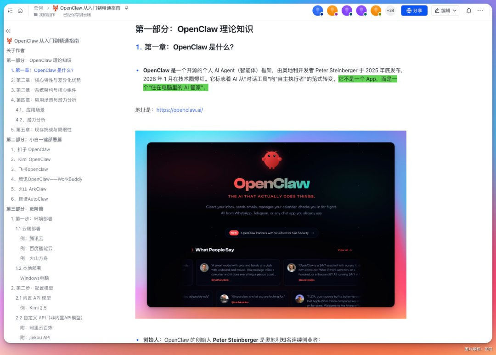

他是完全免费的，开源的。

从 OpenClaw 还没大火的时候，我们就开始写这份文档，那个时候在 X 上先推了第一个版本，收到了不少的喜欢。

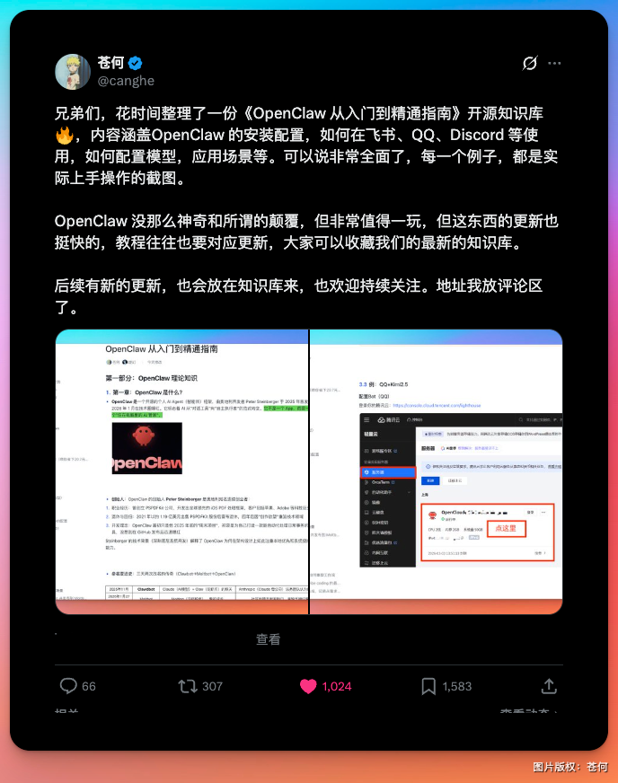

从 OpenClaw 还没改名的时候，就开始在整理了，甚至我们连自己都忘记了这个时间，只知道做了很久很久，至少对 AI 这个快速迭代的圈子来说，花一两个月打磨一个文档，不算短。

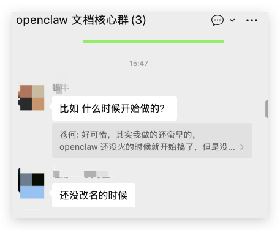

我们陆续补充了很多新的关于 OpenClaw 的使用教程及案例，甚至是 Skills。

说出来不怕你们笑话，教程中的很多字都是手动敲的。所以，堆叠的东西并不杂乱。

也难免会有一些错别字啊什么的，大家看到可以给我们反馈下。

最关键的，教程中的每一个步骤，全部是我们亲自部署实践后做的截图，可以说很细致了。

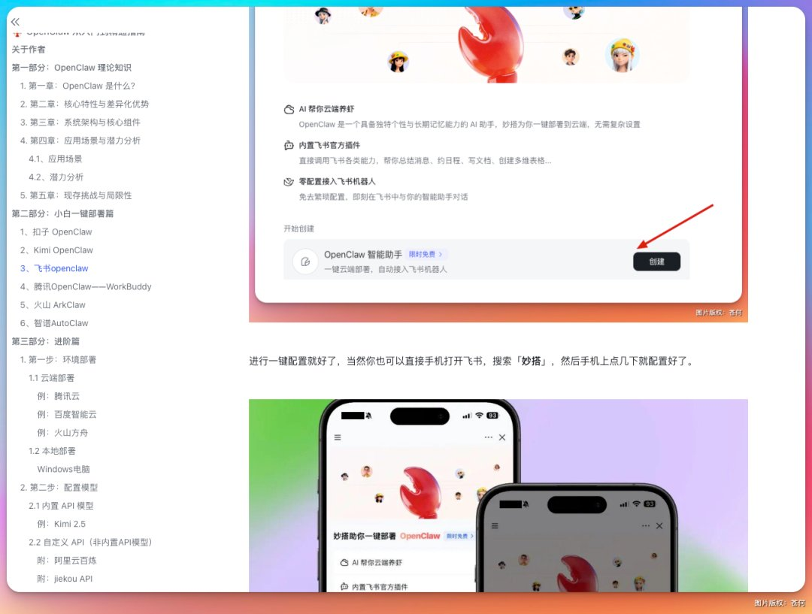

甚至 Windows 的本地部署，也是自己去部署了，然后把坑和难点给大家做分享，包括每一步的步骤：

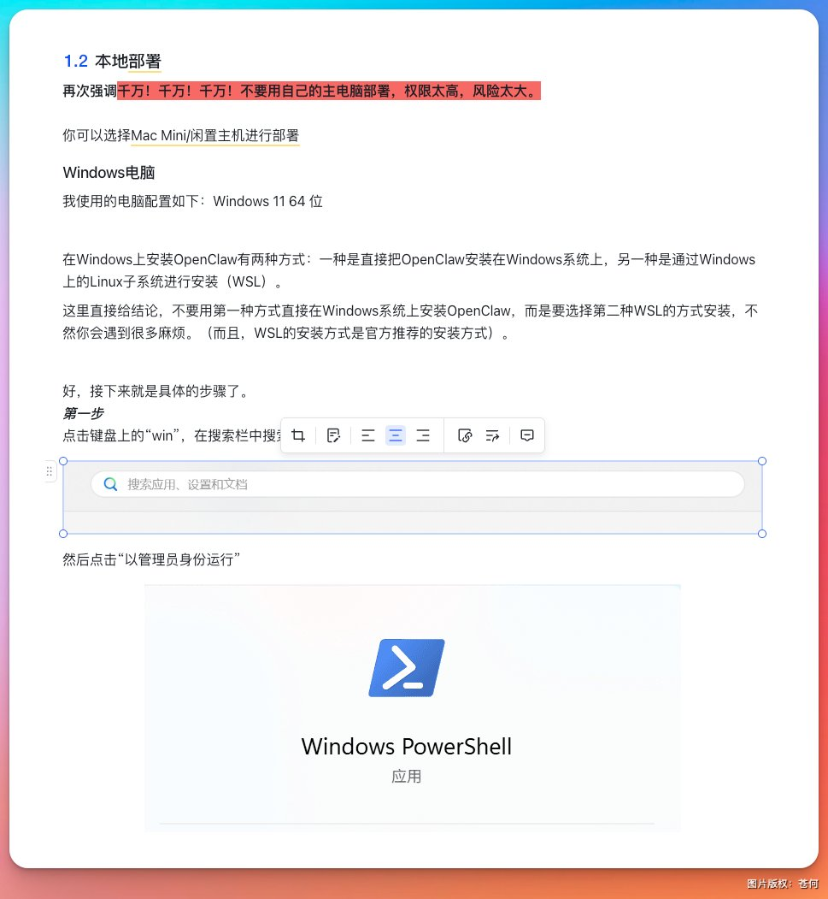

比如自己 Windows 安装 WSL 配置，该怎么配置，用哪个命令，开哪个权限，都仔细的写上去了。

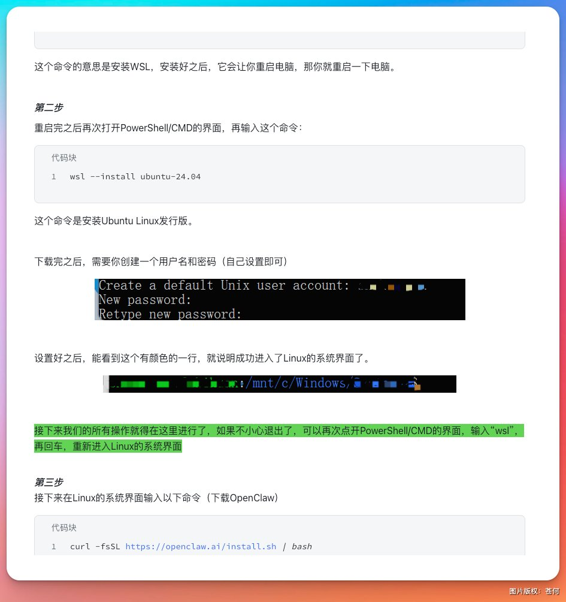

写的越是细致，我们反而变得有些慢了，所以迟迟还没推出。

对于小白，最痛苦的其实是各种配置和模型选择，现在 OpenClaw 已经火出圈了，经常有以前同事来问怎么安装啥的问题。

如果是程序员还好，你可以让他们参照这个教程直接配置部署，但如果是不懂代码的小白来说，就显得有些难受了。

我老婆就骂过我，说，你写的这什么 B 玩意，我照着做，都不知道怎么打开终端。

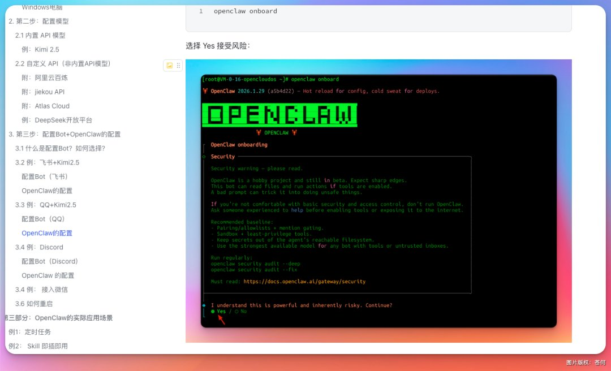

后面，我们又尝试做了优化，再后面，随着国内大厂的跟进，越来越多的针对小白的OpenClaw 小龙虾出现了。

于是又补充了很多的教程，专门针对小白一键部署使用。

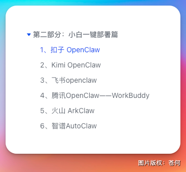

除此之外，除了说清楚了怎么部署，还把具体有什么好玩的也做了分享。

比如做数字人：

比如做小红书封面图：

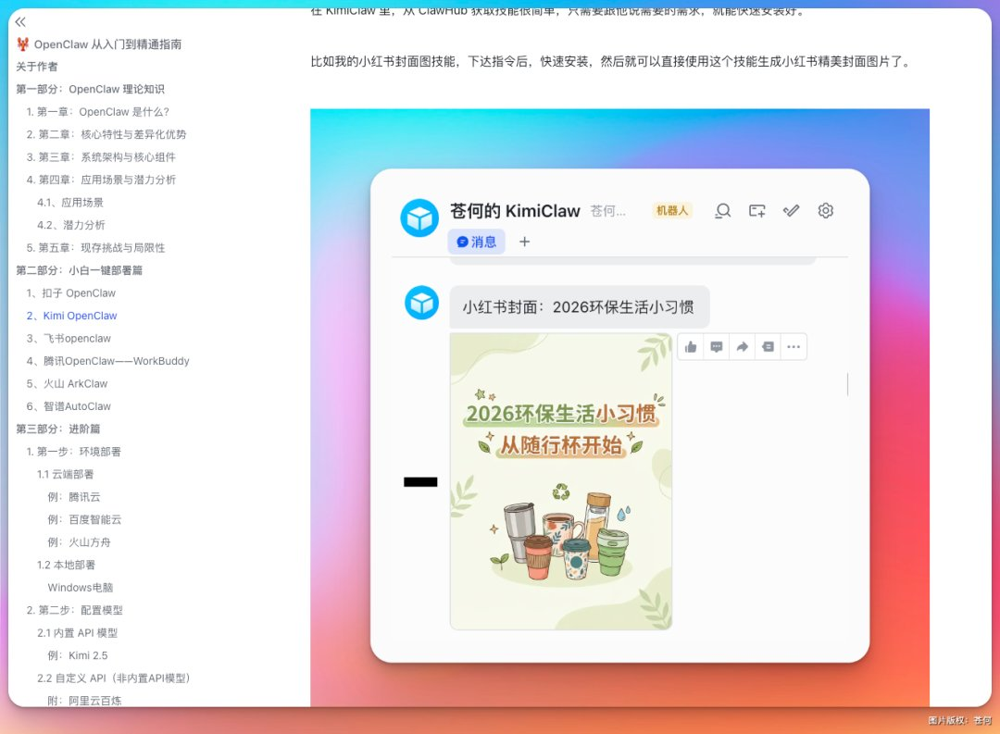

比如监控 X 信息：

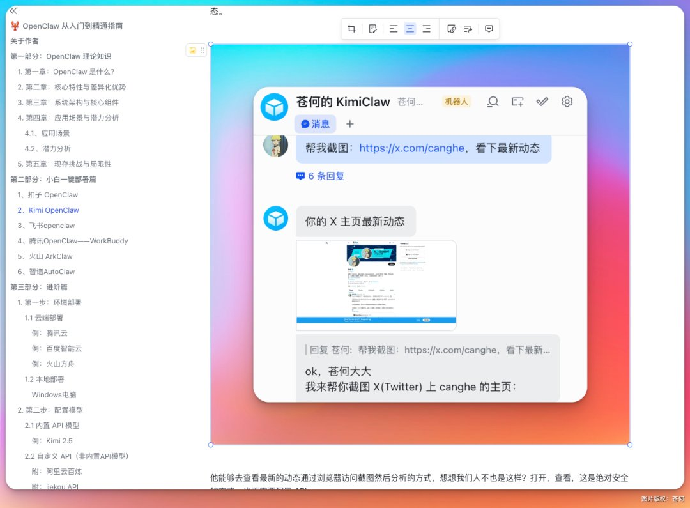

做第二大脑系统：

用 OpenClaw 做漫剧：

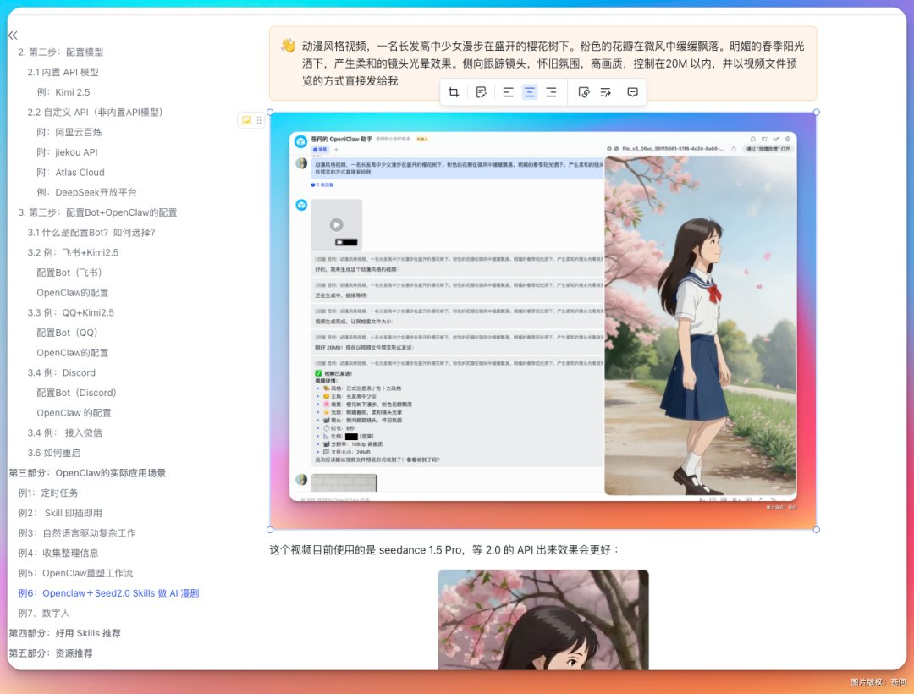

也搜集了很多不错的 case 直接放在了第三部分「OpenClaw的实际应用场景」：

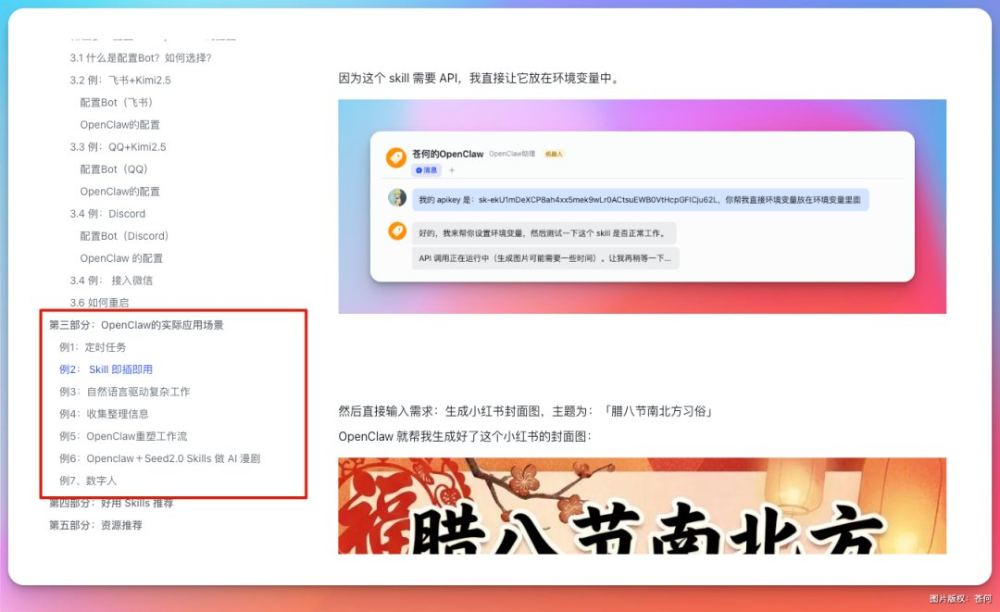

这些场景，不是简单的整理，而是实打实，我们去亲身实践的，并把教程和对应的 skill 也直接分享了。

OpenClaw 要想玩的好，还是需要了解不少的 Skills，虽然说在 Clawhub 这样的平台已经有非常多的 Skills 了，但给人一种眼花缭乱的感觉。

或者是给 Agent 一种烟花缭乱的感觉，究竟哪个好用，哪个又是最适合自己的。

我认为，亲身实践是检验真理的唯一标准。

所以，我们在第四部分放了好用的技能推荐。

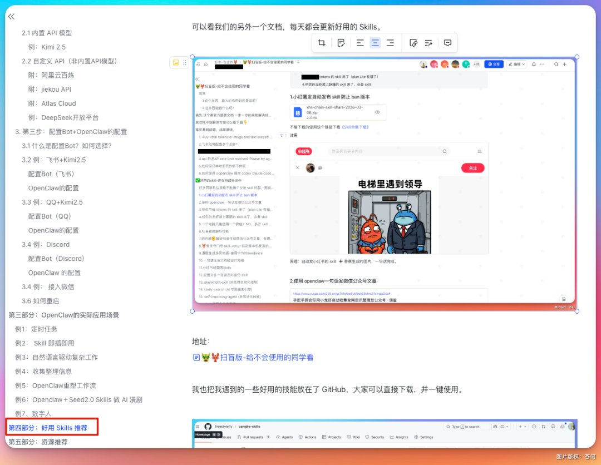

我也把所有用到的技能全部都打包放在了文档中。

甚至我们团队的蜗牛还单独拉出了一个文档专门分享好用的技能。

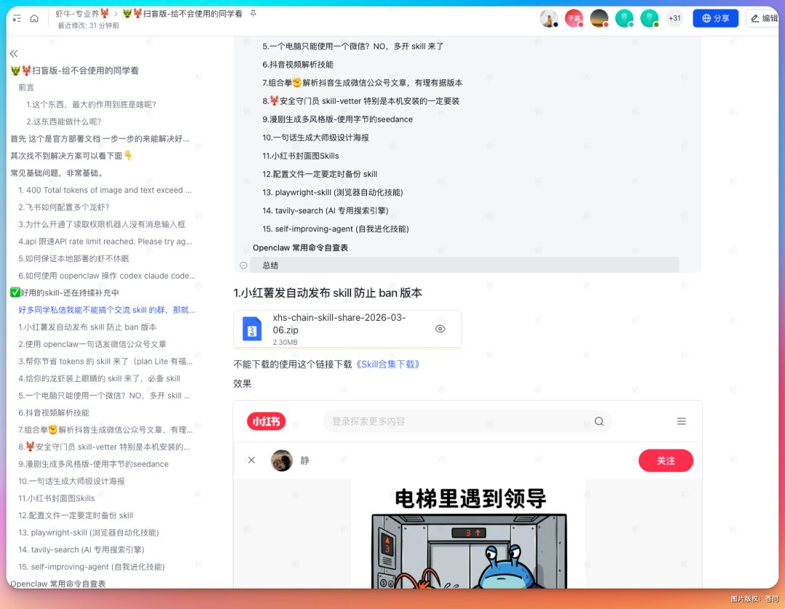

也受到了很多朋友的喜欢，每天的访问量很恐怖。

是那种细致到，技能压缩包都给你下载了，你只需要丢给小龙虾，让他自己去安装就好了。

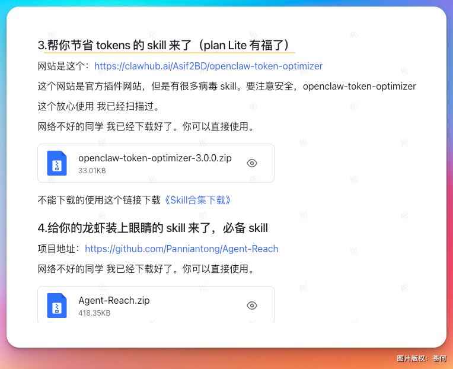

相对来说，我们的文档，偏向以我们的实践为主，理论偏少。

就像我本人的风格一样，不喜欢讲长篇大论，上来就是开干。

而我也觉得，至少现在，这个点还是 AI 无法做到的。

他没法带你去体验，去真真实实的感受 AI 带来的冲击。

这个过程，会有些痛苦，就是他会变得有些慢。

慢到我要花费更多的时间。

但，体验实践本身更为重要。

而，这也是我分享最大的价值所在。

我希望，分享给你的是基于我自己的体验，而非 AI 帮我体验的结果。

谢谢你喜欢我的文章。

最后要感谢我们团队的所有小伙伴（蜗牛和噬幻），为该文档做出了很大的贡献。

该开源文档地址如下：

\`\`\`
https://my.feishu.cn/docx/P6zsdsgYco6i4XxLeIccvlpvnQe
\`\`\`

飞书官方通道部署教程及实用 Skills 可参考：

\`\`\`
https://my.feishu.cn/wiki/THLNw1vWCiXJD6kvomlcYpu5nRe?from=from\_copylink
\`\`\`

你可以完全收藏或者在不时之需，分享给需要的小伙伴。

我们也会持续更新，感谢关注。

#OpenClaw

### 🖼️ Attached Media

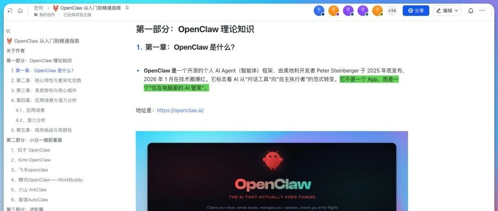

## 💬 Replies

### 1 @canghe (苍何) (Author)

*Thu Mar 12 12:48:51 +0000 2026*

地址：[my.feishu.cn/docx/P6zsdsgYc…](https://my.feishu.cn/docx/P6zsdsgYco6i4XxLeIccvlpvnQe?from=from_copylink)

### 2 @canghe (苍何) (Author)

*Thu Mar 12 15:47:01 +0000 2026*

配套好用的技能推荐：[my.feishu.cn/wiki/THLNw1vWC…](https://my.feishu.cn/wiki/THLNw1vWCiXJD6kvomlcYpu5nRe)

### 3 @AI_Jasonyu (鱼总聊AI)

*Thu Mar 12 10:45:15 +0000 2026*

@canghe 开源不错

### 4 @canghe (苍何) (Author)

*Thu Mar 12 12:49:13 +0000 2026*

@AI\_Jasonyu 谢谢鱼总

### 5 @MariRegina55109 (Ning)

*Fri Mar 13 01:41:52 +0000 2026*

@canghe 感谢苍何老师分享

### 6 @zstmfhy (AI奶爸)

*Thu Mar 12 10:46:19 +0000 2026*

@canghe 你也来，这开源精神，太厉害了，又要被人拿去做课程了

### 7 @canghe (苍何) (Author)

*Thu Mar 12 12:49:29 +0000 2026*

@zstmfhy 谢谢奶爸

### 8 @fanleiLex (范磊Lex)

*Thu Mar 12 11:54:10 +0000 2026*

@canghe 我现在还没有入门，还没有尝试，还没有安装，正好可以现在从入门到精通让我变成更厉害的人

### 9 @canghe (苍何) (Author)

*Thu Mar 12 12:50:10 +0000 2026*

@fanleiLex 拾起来

### 10 @shinwood (新木 Xin)

*Thu Mar 12 12:41:27 +0000 2026*

@canghe 感谢分享，不过地址好像贴错了？链接里的标题是：扫盲版，给不会使用的同学看.

### 11 @canghe (苍何) (Author)

*Thu Mar 12 12:49:58 +0000 2026*

@shinwood 评论区放了一个，那个也算是

### 12 @dannykkg (Kg)

*Thu Mar 12 10:56:22 +0000 2026*

@canghe 非常完整了

### 13 @canghe (苍何) (Author)

*Thu Mar 12 12:48:58 +0000 2026*

@langzihan 感谢

### 14 @Soranlan (Soran)

*Fri Mar 13 12:51:51 +0000 2026*

@canghe 你是团队运营吗

### 15 @canghe (苍何) (Author)

*Fri Mar 13 12:58:33 +0000 2026*

@Soranlan 负责人

### 16 @Seraphine_Moyao (Seraphine.墨遥)

*Thu Mar 12 14:38:57 +0000 2026*

@canghe 请问国产的套壳OpenClaw，哪个最接近原生？

### 17 @canghe (苍何) (Author)

*Thu Mar 12 14:50:47 +0000 2026*

@Seraphine\_Moyao 其实有些任务是看模型，国产的很多体验做的丝滑不少

### 18 @yirancrypto (亦然)

*Fri Mar 13 12:12:57 +0000 2026*

@canghe 老师用的付费版的Xnapper截图的吗

### 19 @canghe (苍何) (Author)

*Fri Mar 13 12:49:50 +0000 2026*

@Cooperseen 是的

### 20 @DADADAwindsky (WINDSKY)

*Fri Mar 13 14:31:24 +0000 2026*

@canghe 点开了一个公众号运营全流程，里面说给ai直接看的skill，内置了个人网站接口，这可靠吗我说 

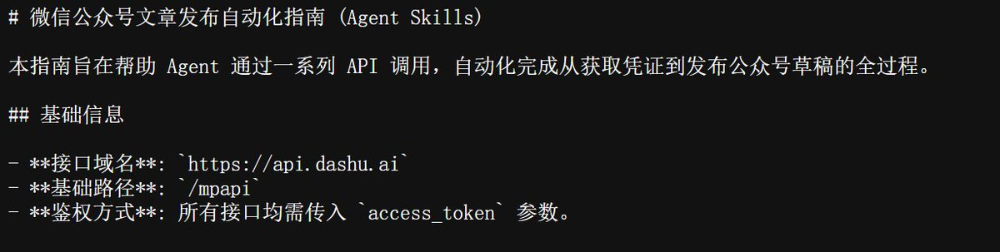

### 21 @canghe (苍何) (Author)

*Fri Mar 13 15:24:53 +0000 2026*

@DADADAwindsky 注意一下

### 22 @szjoshua (Orrrrz)

*Fri Mar 13 03:50:11 +0000 2026*

@canghe 有点过于小白了

### 23 @canghe (苍何) (Author)

*Fri Mar 13 03:51:58 +0000 2026*

@szjoshua 先是给小白用的，高阶的草稿已经写了，还没同步上来

### 24 @amore_cao62315 (Cao Amore)

*Tue Apr 07 15:07:41 +0000 2026*

@canghe 求进核心群

### 25 @canghe (苍何) (Author)

*Wed Apr 08 11:16:18 +0000 2026*

@amore\_cao62315 来私

### 26 @AI_jacksaku (阿川 | AI thinking)

*Thu Mar 12 12:49:51 +0000 2026*

@canghe 真心佩服

### 27 @isnail (蜗牛King 👑)

*Thu Mar 12 12:04:21 +0000 2026*

@canghe 苍老师牛逼，苍老师大爱

### 28 @Gate_luqingxiao (陆兄 @Gate)

*Fri Mar 13 08:00:11 +0000 2026*

@canghe 牛，真全面

### 29 @trycoinpilot (Coinpilot)

*Fri Mar 13 02:47:57 +0000 2026*

@canghe 跟单和地址追踪好用技能不要错过Coinpilot skill！7\*24小时追踪地址、智能复制交易策略跟单等功能！
下载链接：[x.com/trycoinpilot/s…](https://x.com/trycoinpilot/status/2023387587457790210?s=20)

### 30 @yyyole (沐阳)

*Thu Mar 12 14:29:58 +0000 2026*

@canghe 太全面了！！

### 31 @YueFeiSixGod (高赞GZan)

*Thu Mar 12 12:44:39 +0000 2026*

@canghe 牛蛙牛蛙

### 32 @Jackson58378166 (Jackson)

*Thu Mar 12 10:47:27 +0000 2026*

@canghe 牛逼克拉斯

### 33 @messier_57 (狗哥)

*Thu Mar 12 16:11:21 +0000 2026*

@canghe 感谢🥹

### 34 @X_ThreatHunting (Cyber_hunter)

*Fri Mar 13 01:07:34 +0000 2026*

@canghe 学习一下

### 35 @Web3_DadGOD (链上奶爸)

*Thu Mar 12 13:32:21 +0000 2026*

@canghe 好人呢，必须关注

