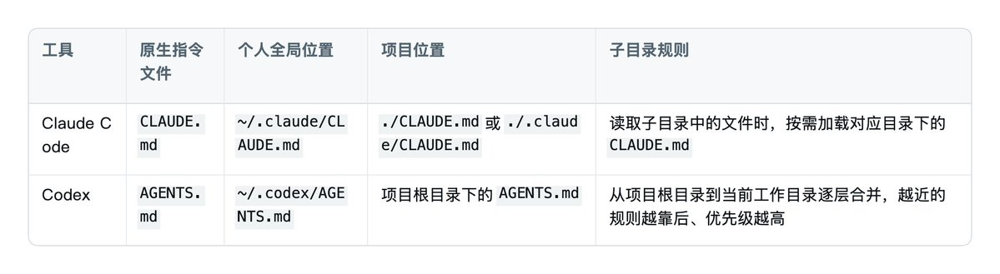
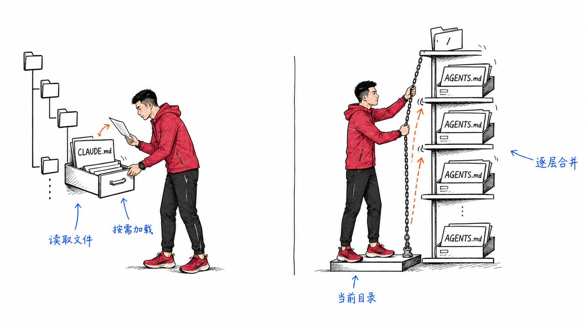
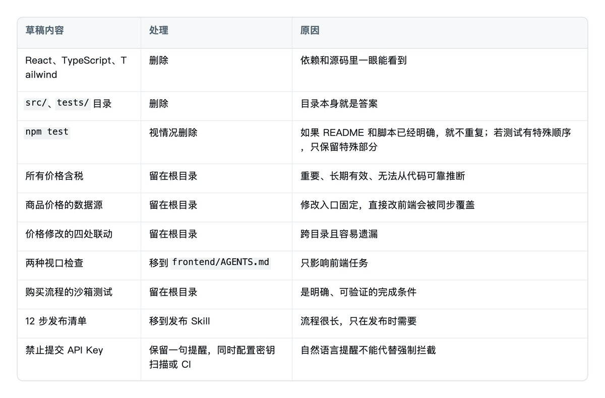
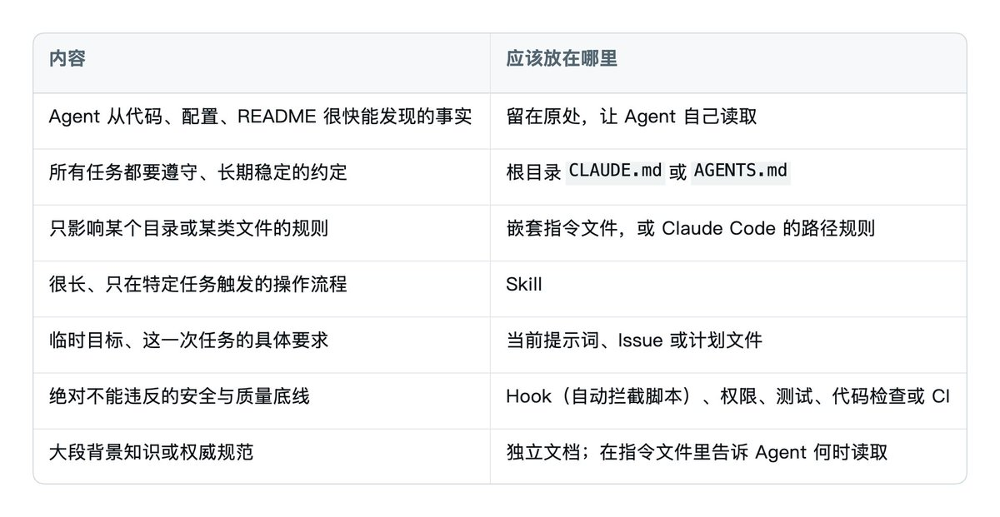
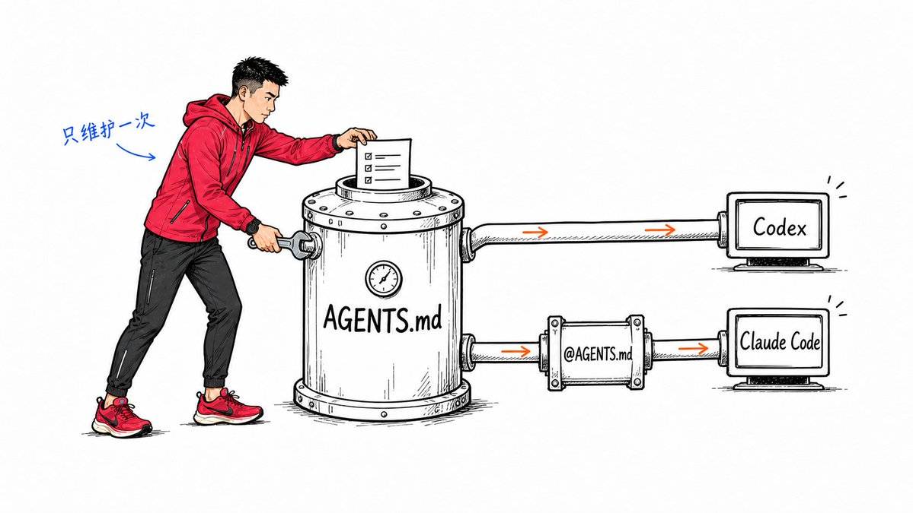
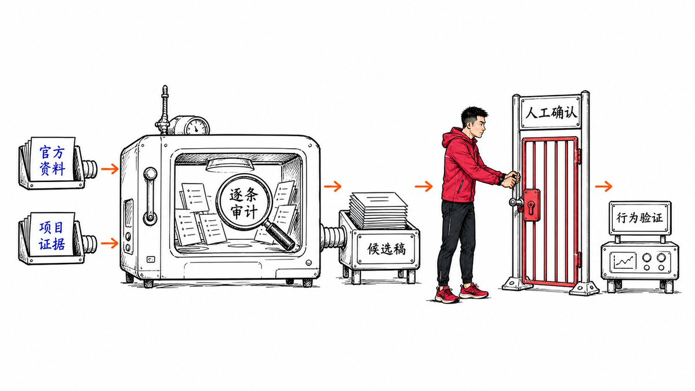

# 📰 10分钟学会CLAUDE.md: 从入门到精通

规则越多, Agent 反而更容易跑偏
该留？该删?  一套方法理清
CLAUDE.md 和 AGENTS.md
先收藏，整理项目时直接照着改

---

如果你长期使用 Claude Code、Codex 或其他编程 Agent，有一件事的回报率非常高：

把项目里的长期指令写好。

在 Claude Code 里，这个入口叫 CLAUDE.md；在 Codex 里，它叫 AGENTS.md。它们不是同一个文件，也不能简单理解成“换了个名字”，但解决的是同一类问题：在 Agent 开始工作前，先告诉它这个项目有哪些长期有效、不能靠读代码猜出来的约定。

写好之后，你不必每次开新对话都重新解释：这个项目为什么不能直接改数据库、价格应该从哪里更新、改完支付流程要检查哪些页面、什么条件才算完成。

但这里也有一个很常见的误区：很多人把它写成了项目百科全书。

教程只解决三个问题：

1. 哪些内容真的值得写进去？

1. 一条规则应该放在哪一层？

1. 文件越来越长以后，怎么持续维护？

最后我会用一份 /init 草稿做完整示范：哪些删除，哪些下沉到子目录，哪些移到 Skill，最后的文件长什么样。

# 先搞清楚：它们到底是什么

你可以把 CLAUDE.md 和 AGENTS.md 理解成“Agent 开工前要读的项目约定”。

它们适合保存会反复影响工作的长期信息，比如：

- 这个项目必须遵守的业务规则

- 团队固定的开发与验证方式

- 修改一处时容易漏掉的联动关系

- 完成任务前必须达到的验收标准

- 遇到特定问题时，应该去哪里找权威资料

它们不适合保存随手就能从代码里看到的事实，也不应该被当成强制安全机制。

这些文件会进入 Agent 的上下文，但它们仍然是“指令”，不是程序级约束。模型可能误解、忽略，或在规则冲突时选错。如果某件事绝对不能发生，例如密钥不能提交、生产数据库不能被误删，就应该用权限、Hook、测试、Lint 或 CI 来强制拦截，而不是只写一句“禁止这样做”。

> 需要 Agent 理解并判断的，写进指令文件；绝对不能违反的，用程序机制兜底。

# CLAUDE.md 和 AGENTS.md，不要混为一谈

两者概念相似，但原生加载方式不同。

Claude Code 还支持项目根目录下的 CLAUDE.local.md，适合保存只属于你、又不想提交给团队的项目偏好。记得把它加入 .gitignore。

Codex 则支持 AGENTS.override.md。在同一层目录里，只要存在非空的 AGENTS.override.md，Codex 就会优先使用它，而不是这一层的 AGENTS.md。它更像一个明确的覆盖文件。

> 局部规则应该放在对应目录，但还要确认当前工具会在这次任务中加载该目录的规则。

例如，一个仓库同时包含 React 前端和 Python 后端：

\`\`\`text
project/
├── AGENTS.md              # 全项目共同规则
├── frontend/
│   └── AGENTS.md          # 只管前端
└── backend/
    └── AGENTS.md          # 只管后端
\`\`\`

Claude Code 也可以用类似的嵌套方式放置 CLAUDE.md。如果某条规则只和前端有关，就不要塞在项目根目录里，让后端任务每次也跟着读。

两种工具的触发方式不同。Claude Code 读取子目录文件时，会按需加载嵌套的 CLAUDE.md；Codex 则按本次运行的当前工作目录构建 AGENTS.md 加载链。要让 frontend/AGENTS.md 生效，应从 frontend/ 启动任务，或把 Codex 的工作目录设到该目录。从仓库根目录启动 Codex，并不会因为它后来修改了前端文件就自动追加这份嵌套规则。

第一份文件怎么建

最省事的起点是 /init。

进入项目目录并启动对应工具后：

\`\`\`text
/init
\`\`\`

Claude Code 会生成一份初始 CLAUDE.md；Codex CLI 也可以用 /init 生成起始的 AGENTS.md。

自动生成的版本通常会包含项目用途、技术栈、目录结构、启动命令、测试命令和代码规范。它很适合作为草稿，但不适合不加检查地直接使用。

Agent 能读代码。如果框架名称就在 package.json，目录结构抬眼就能看到，测试命令已经写在 README，那么把这些内容再复制一遍，价值很低。它不仅占用上下文，还会制造第二份事实来源。半年后代码改了、指令文件没改，原本的“帮助”就会变成误导。

所以，/init 之后不要立刻开始加内容。先做减法。

# 做减法：每一条都问三个问题

检查自动生成的内容，或者清理一份已经很长的旧文件时，对每一条规则依次问：

## 1\. Agent 能不能很快从项目里找到？

能找到，就优先删掉。

技术栈、普通目录结构、已经写在 README 里的命令，通常都属于这一类。真正值得保留的，是无法仅凭代码可靠判断的隐性知识，例如数据的唯一来源、历史兼容字段的真实含义，或者指定的沙箱测试账号。

## 2\. 大多数任务都会用到吗？

不是，就往更近的目录放，或者改成按需加载的规则。

例如视口检查只和前端有关，就应该放进 frontend/ 下的指令文件，而不是让后端任务也处理它。

Claude Code 还支持 .claude/rules/ 下带 paths 的路径规则。规则只在匹配到相应文件时加载，适合按文件类型或目录精确生效。

## 3\. 三个月后它大概率还成立吗？

不稳定的信息不要伪装成长期规则。

“本周临时继续使用旧 API”更适合放在任务说明、Issue 或临时计划里；“所有对客价格必须含税”才适合进入长期指令。

如果确实需要保留临时约束，至少写清楚失效条件，而不是留一句没有期限的“暂时”。

经过这三问，/init 生成的内容通常会被删掉不少。这不是损失。指令文件的价值不取决于长度，而取决于剩下的每一条是否真的能改变 Agent 的行为。

# 做加法：用五个问题提取隐性知识

减法做完，接下来才轮到加法。

很多人卡在这里，是因为一上来就纠结该分几个章节。先别管格式，回答下面五个问题，内容自然会出来。

## 1\. 这个项目有什么绝对不能搞错的业务规则？

例如所有对客价格必须含税。Agent 单靠读组件未必知道这是业务要求，漏掉一次就会直接影响用户。

## 2\. 有没有固定的处理入口？

例如商品价格必须先改运营数据源，再由同步任务写入网站。直接改网页里的数字，下次同步就会被覆盖。

## 3\. 改完一个地方，还有哪些地方必须联动？

例如会员价格调整后，首页、结账页、FAQ 和通知邮件都要更新。这类关系散落在不同目录里，最容易漏。

## 4\. 做到什么程度才算完成？

不要只写“记得测试”，要写成可以验证的完成条件：检查哪些视口、跑哪条命令、走完哪段业务流程。

## 5\. 遇到不确定的问题，去哪里找答案？

指令文件不必装下所有知识，只要指出品牌、退款政策等权威资料在哪里，以及资料互相冲突时该怎么办。

# 从 /init 草稿到可用文件：完整走一遍

假设我们在整理一个电商项目。/init 先从项目里生成了三条技术信息：

\`\`\`md
\# Project Guide

\- 项目使用 React、TypeScript 和 Tailwind CSS。
\- 前端代码位于 \`src/\`，测试位于 \`tests/\`。
\- 使用 \`npm test\` 运行测试。
\`\`\`

团队过去踩坑后，又陆续往文件里补了这些内容：

\`\`\`md
\- 所有面向用户的价格必须含税。
\- 商品价格以 \`docs/pricing-source.md\` 记录的数据源为准，不要直接修改前端常量。
\- 修改会员价格时，同步更新首页、结账页、FAQ 和续费邮件。
\- 修改页面后检查 375px 和 1440px 两种视口。
\- 修改购买流程后，使用沙箱账号完成一次从下单到回调成功的完整流程。
\- 发布前按照 12 步清单依次检查、构建和部署。
\- 禁止把 API Key 提交到仓库。
\`\`\`

现在技术事实和隐性知识混在了一起。不要一上来润色，先逐条分流：

整理后，根目录 AGENTS.md 只剩：

\`\`\`md
\# 项目约定

\## 业务规则

\- 所有面向用户展示的价格必须含税。
\- 修改会员价格或权益时，同时检查首页价格卡、结账页、FAQ 与续费通知模板。

\## 数据来源

\- 商品价格以 \`docs/pricing-source.md\` 记录的数据源为准，不要直接修改前端常量。

\## 完成标准

\- 修改购买流程后，使用沙箱账号完成一次从下单到回调成功的完整流程。

\## 安全

\- 不要提交密钥；仓库的密钥扫描与 CI 检查必须通过。
\`\`\`

前端自己的 frontend/AGENTS.md 只放局部规则。对 Codex，记得从 frontend/ 启动任务或把工作目录设到这里：

\`\`\`md
\# 前端规则

\- 修改响应式页面后，至少检查 375px 与 1440px 两种视口。
\`\`\`

如果使用 Claude Code，把相同内容分别放进对应层级的 CLAUDE.md 即可。若两种工具都用，后面会讲怎么避免维护两份。

最后做两次小型行为测试：先让 Agent 调整会员价格，看它是否主动覆盖四个联动位置；再让它修改购买回调，看它是否完成沙箱流程，或明确说明为什么没做。测试任务一次只触发一两条规则，更容易判断是哪条规则生效。让 Agent 复述文件内容，证明不了这些规则真的改变了行为。

# 内容该放哪：一张表判断

写指令文件最实用的能力，不是文笔，而是分流。

发布的 12 步清单属于 Skill，只有发布时才加载；“API Key 不能提交”可以保留提醒，但还要用密钥扫描工具、权限、Hook 或 CI 兜底。

一份可直接复制的最小模板

下面这份模板故意很短。不要为了填满章节而填内容，没有就删掉。

\`\`\`md
\# 项目工作约定

\## 必须遵守的项目约定

\- \[写 Agent 无法从代码直接推断的业务或架构约束\]

\## 固定工作方式

\- \[写唯一数据源、固定修改入口或必须遵循的顺序\]

\## 联动修改

\- 修改 \[A\] 时，同时检查 \[B、C、D\]。

\## 完成标准

\- 完成后运行 \`\[验证命令\]\`。
\- 涉及 \[某类变更\] 时，额外验证 \[具体场景\]。
\- 结束任务前逐项核对完成标准；未完成的项目必须明确说明。

\## 权威资料

\- 遇到 \[某类问题\]，读取 \`\[文件路径\]\`。
\- 如果代码、本文档与权威资料冲突，先报告冲突，不要自行猜测。
\`\`\`

不要写“请高质量完成”“仔细思考”“遵循最佳实践”这种无法验证的话。它们听起来正确，却没有给 Agent 任何项目特有的信息。

# 同时使用 Claude Code 和 Codex，只维护一份

如果团队同时使用两种工具，维护两份内容相同的文件迟早会漂移。一种省维护的做法是把 AGENTS.md 设为公共规则的唯一事实来源，再让 Claude Code 导入它。这尤其适合团队已经使用 Codex 或其他读取 AGENTS.md 的工具时。

项目结构：

\`\`\`text
project/
├── AGENTS.md
└── CLAUDE.md
\`\`\`

CLAUDE.md 第一行写：

\`\`\`md
@AGENTS.md
\`\`\`

如果还有只适用于 Claude Code 的内容，可以继续写在下面：

\`\`\`md
@AGENTS.md

\## Claude Code 专用

\- \[只适用于 Claude Code 的规则\]
\`\`\`

这样，团队只维护 AGENTS.md 的公共内容。Claude Code 读取这份 CLAUDE.md 时会导入 AGENTS.md，Codex 则原生读取它。

也可以让 CLAUDE.md 成为指向 AGENTS.md 的符号链接，但跨平台和 Windows 权限会带来额外麻烦。对大多数团队来说，@AGENTS.md 更直观。

注意：导入只是避免重复维护，不会节省上下文。被导入的内容仍然会在启动时加载，所以唯一事实来源也必须保持精简。

# 写完以后，先验证它真的生效

很多问题不是规则写得差，而是文件根本没有被加载。

在 Claude Code 中：

- 运行 /context，查看 Memory files 里是否出现目标文件

- 用 /memory 查看和编辑各层级的记忆文件

在 Codex 中，可以让它复述当前看到的项目规则，作为辅助检查。不要只相信复述结果，最终仍要用具体任务验证行为。

加载来源只证明 Agent 看到了文件，不证明它会照做。用前面案例里的方式给它一个精确触发规则的小任务；真正的验证对象是行为，不是复述。

# 维护：别只增加，也要修剪

我自己的 CLAUDE.md 也走过这条路：一开始用 /init 建立，后来 Claude 每犯一次错，我就补一条规则。当时每一条都有理由，几个月后再看，里面已经同时出现重复规则、过期流程和彼此冲突的要求。

一份好的指令文件更像花园，不是档案馆。维护只有两个动作：新增与修剪。

什么时候新增

不要因为一次偶发失误就立刻加规则。更好的触发条件是：

- 同类错误重复出现

- 同一条评审意见反复被提出

- 某个隐性前提一旦漏掉，代价很高

- 某套固定流程已经重复执行多次

Claude Code 的 /insights 可以生成本机近期会话的 HTML 报告，帮助你查看常见失败点和使用模式。它适合寻找线索，但报告建议仍然需要人工判断，不能整批复制进 CLAUDE.md。

对 Codex，可以在同类错误第二次发生后，让它回顾两次失败的共同原因，并提出一条最小规则。先看规则是否真的具有普遍性，再决定是否写入。

## 什么时候删除

至少检查四类内容：

1. 代码或流程已经变化，规则与真实项目不一致

1. 两条规则表达同一件事，可以合并

1. 规则与其他层级、文档或工具配置冲突

1. Agent 已经能稳定从项目中发现，不值得继续常驻

Claude Code v2.1.206 及以上版本的 /doctor，可以检查已提交的 CLAUDE.md：建议删去可从代码推导出的目录、依赖和架构概述，保留陷阱、原因和非默认约定。工具建议仍然只是起点，最终要以项目事实为准。

你可以采用这样的维护节奏：

- 平时只记录重复出现的问题

- 每次重要流程或架构变化后，检查相关规则

- 例如每月或每个版本周期做一次合并、删除和冲突检查

- 工具或模型明显升级后，用真实任务重新验证旧规则，而不是默认它们永远有效

# 附赠：一段可以直接使用的“渐剪提示词”

原视频最后提到的，本质上是一段用来审计和修剪 CLAUDE.md 的提示词，并不是必须安装的 Skill。它需要执行的次数不算高，先保留成提示词反而更方便：进入项目根目录，启动 Claude Code 或 Codex，把下面整段复制进去即可。

这版提示词也支持 AGENTS.md，默认只做审计，不会直接改文件。你先看逐条建议和候选稿，确认没有误删项目知识后，再让 Agent 执行修改。

\`\`\`text
你现在是这个项目的长期指令审计员。请审计并精简项目中的 CLAUDE.md、AGENTS.md 及相关规则文件。

目标不是追求最短，而是在不丢失关键业务知识、团队约定和安全边界的前提下，得到一组短小、准确、没有冲突，并且能真正改变 Agent 行为的长期指令。

\## 权限边界

\- 本轮默认只读审计：可以读取项目文件、配置和官方文档，但不要修改、移动或删除任何项目文件。
\- 先输出完整审计报告与候选稿。只有我明确确认后，才能修改原文件。
\- 不要执行 git commit、push、reset、checkout 等写操作。
\- 不要为了缩短文件而改变原规则的业务含义。
\- 不确定的信息标记为“待确认”，不要猜测或自行补全。

\## 第一步：确认环境与加载范围

1\. 判断当前使用的是 Claude Code、Codex，还是两者共用的项目。
2\. 确认当前模型与版本；如果环境没有提供，就写“无法确认”，不要猜。
3\. 找出本次任务实际可能加载的全部长期指令文件，包括但不限于：
   \- CLAUDE.md
   \- CLAUDE.local.md
   \- .claude/CLAUDE.md
   \- .claude/rules/\*\*/\*.md
   \- AGENTS.md
   \- AGENTS.override.md
4\. 说明每个文件的作用范围、加载顺序，以及哪些嵌套文件本次不会加载。
5\. 如果项目同时使用 CLAUDE.md 和 AGENTS.md，检查它们是否重复、冲突或已经通过导入建立单一事实来源。

\## 第二步：核对当前官方实践

如果能够联网，只查对应工具的官方资料：

\- Claude Code：Anthropic 官方文档
\- Codex：OpenAI 官方文档

重点核对：

\- 指令文件当前的发现与加载规则
\- 官方对长度、结构、具体性和冲突的建议
\- 当前模型的官方提示词指南
\- 哪些内容更适合放进嵌套规则、Skill、Hook、权限、测试或 CI

记录实际查阅的页面标题和链接。不要引用搜索摘要、社区文章或凭记忆概括。若无法联网，明确写出“官方实践未在线核验”，然后继续完成项目事实审计。

\## 第三步：从项目中核验每条规则

读取必要的代码、README、配置、脚本和项目文档，判断每条指令是否与当前项目一致。只读取足以完成判断的材料，不要无目的扫描整个仓库。

对每条规则检查以下问题：

1\. Agent 能否从代码、配置、目录或 README 中快速发现？
2\. 它是否属于 Agent 无法仅凭项目可靠判断的隐性知识？
3\. 它是否会影响大多数任务，还是只影响某个目录、文件类型或特定流程？
4\. 它现在是否仍然成立？项目中有没有相反证据？
5\. 它是否与其他指令重复或冲突？
6\. 它是否足够具体，可以执行并验证？
7\. 它是自然语言提醒，还是必须由程序强制保证的底线？
8\. 删除或移动它，是否可能让 Agent 丢失关键背景？

不要仅凭“模型现在更强”就删除规则。只有项目证据、官方实践或真实行为测试支持时，才能建议删除。

\## 第四步：给每条规则分类

每条规则只能给出一个主要处理结论：

\- 保留：重要、稳定、难以自行发现，而且作用范围正确。
\- 改写：应该保留，但目前含糊、过长、不可验证或存在歧义。
\- 合并：与其他规则表达同一件事。
\- 下沉：只影响特定目录或文件，应移到嵌套 CLAUDE.md、AGENTS.md 或路径规则。
\- 移到文档：属于大段背景知识或权威规范；主指令只保留何时读取、去哪里读取。
\- 移到 Skill：属于很长、可重复、只在特定任务中触发的工作流。
\- 交给程序兜底：属于绝对不能违反的限制，应由 Hook、权限、测试、代码检查或 CI 强制执行；指令中可以保留一句提醒。
\- 删除：可快速自行发现、已经过期、纯属重复，或者是“仔细思考”“遵循最佳实践”一类无法验证的空泛要求。
\- 待确认：现有证据不足，必须由项目负责人决定。

每个结论必须提供理由和证据。不要只说“建议精简”。

\## 第五步：按以下格式输出

\### A. 审计摘要

\- 找到哪些指令文件
\- 本次实际加载哪些文件
\- 当前总行数
\- 保留、改写、合并、迁移、删除、待确认各有多少条
\- 最严重的三个问题

\### B. 官方核验

\- 当前工具与模型
\- 查阅的官方页面及链接
\- 哪些现有写法已经不符合当前官方实践
\- 哪些判断因为无法联网或无法确认模型而保留不确定性

\### C. 逐条审计表

表格至少包含：

\| 文件与位置 \| 原规则摘要 \| 结论 \| 项目证据 \| 原因 \| 建议去向或改写 \|

位置尽量精确到标题或行号。存在冲突时，同时列出冲突规则的位置。

\### D. 迁移清单

分别列出建议移到以下位置的内容：

\- 嵌套指令或路径规则
\- 独立项目文档
\- Skill
\- Hook、权限、测试、代码检查或 CI

只说明应该迁移什么和为什么，不要在本轮创建这些文件。

\### E. 完整候选稿

给出精简后的完整 CLAUDE.md 或 AGENTS.md，不要只给 diff。

要求：

\- 保留原文中仍有价值的具体信息
\- 使用清晰的 Markdown 标题和短条目
\- 同一件事只说一次
\- 规则必须具体、可执行、可验证
\- 不要加入没有项目证据的新规则
\- 如果两种工具共用规则，明确唯一事实来源以及导入方式

\### F. 待确认问题

只列出会实质影响删改结果的问题。每个问题说明：不同答案会导致哪条规则被保留、移动或删除。

\### G. 验证方案

设计 2—4 个真实的小任务，每个任务只触发一到两条关键规则，用来比较修改前后的实际行为。不要用“复述你读取了哪些规则”代替行为验证。

\## 完成条件

只有同时满足以下条件才算完成：

\- 每条现有规则都有明确去留结论
\- 所有删除和迁移建议都有项目证据
\- 已指出重复、冲突、过期和无法验证的内容
\- 候选稿可以直接复制使用
\- 没有修改任何文件

输出完毕后停止，等待我确认。不要主动执行候选稿。
\`\`\`

第一次运行时，我建议不要在提示词后面补一句“直接帮我改掉”。先看审计表，尤其检查“删除”和“待确认”两栏。Agent 可以发现重复和过期内容，但它无法替你决定没有写进代码的业务现实。

确认报告没有误判后，再发送：

\`\`\`text
按照刚才确认的候选稿执行修改。保留一份修改前副本，不要执行任何 git 写操作。修改后重新检查加载范围、重复、冲突和 Markdown 格式，并汇报实际改动与尚未处理的迁移项目。
\`\`\`

如果这段提示词以后需要频繁运行，再把它封装成 Skill。是否值得做成 Skill，不看流程有多长，只看它是不是已经成为一个反复发生、输入和输出都相对稳定的工作流。

# 最后，用这份清单检查你的文件

定稿前，检查这六件事：

- \[ \] 删除了能从代码、配置和 README 快速发现的事实

- \[ \] 根目录只保留大多数任务都会用到的规则

- \[ \] 局部规则和长流程已经移到对应目录或 Skill

- \[ \] 高风险禁令已经有权限、Hook、测试或 CI 兜底

- \[ \] 每条要求都具体、可执行、可验证

- \[ \] 没有重复、冲突或已经过期的规则，并已用具体任务验证行为

> 好的 CLAUDE.md 或 AGENTS.md，不是项目资料的总和，而是 Agent 无法自行发现、却会持续影响正确结果的最小规则集。

它不会真正“写完”。代码会变，团队流程会变，Agent 的能力也会变。你要做的不是不断往里加，而是让它始终只保留此刻仍然值得占用上下文的内容。

## 往期精彩文章

[海外注册接码验证？手把手教学美国紫卡 PayGo购买/激活/保号全流程](https://x.com/ai_suxiaole/status/2082296820781449243)

[2026 年最强Obsidian保姆级教程，10分钟打造你的第二大脑](https://x.com/ai_suxiaole/status/2080133894222057612)

[别人已经用 WorkBuddy 找工作拿了面试，你还在一份份手工改简历](https://x.com/ai_suxiaole/status/2078000025590731230)

[Workbuddy+微信读书最强联动，再也不怕“假”读书](https://x.com/ai_suxiaole/status/2077225803461566565)

[GPT-5.6 提示词大师课（OpenAI 出品）](https://x.com/ai_suxiaole/status/2076154810387341725)

[WorkBuddy + 好提示词 = 生产力。43 个场景，复制就能用](https://x.com/ai_suxiaole/status/2075425615264505958)

[摸鱼神器：0基础小白5分钟玩转workbuddy 指令教程](https://x.com/ai_suxiaole/status/2074055523024945321)

[WorkBuddy 从 0 到 1：一份让妈妈也能用的 AI 助手教程](https://x.com/ai_suxiaole/status/2072514519990223112)

[5岁小朋友都能看懂的Claude Code/Codex 安装部署指南](https://x.com/ai_suxiaole/status/2071427591211557079)

[你不需要时间管理，95%的人把它当作自己失败的安慰](https://x.com/ai_suxiaole/status/2070382714629591040)

[10年大厂HR告诉我，90%的简历都是没人看的垃圾](https://x.com/ai_suxiaole/status/2069669311187423691)

[普通人做小红书电商，从0-100万只需这5步（附2026最新教程）](https://x.com/ai_suxiaole/status/2066770808446619705)

[Claude Cowork 小白完整教程：12 个真实场景，不需要写一行代码](https://x.com/ai_suxiaole/status/2064234237788926039)

---

我是苏乐 @ai\_suxiaole XWise 插件作者，长期实践 AI，分享 AI 工具、赚钱案例、效率技巧和真实生活思考。关注我，一起把 AI 用到生活和工作里。

### 🖼️ Attached Media

## 💬 Replies

### 1 @diandianxian (点点鲜)

*Tue Aug 25 04:13:58 +0000 2026*

@ai\_suxiaole 大神必出精品  拜读

### 2 @Shukeplay (Shuke)

*Tue Aug 25 04:21:53 +0000 2026*

@ai\_suxiaole 真不错，从你这总能有新的思路去思考新的学习方向，码住啦！

### 3 @ai_suxiaole (苏乐) (Author)

*Tue Aug 25 05:20:31 +0000 2026*

@Shukeplay 学以致用

### 4 @isnail (蜗牛King 👑)

*Tue Aug 25 04:44:24 +0000 2026*

@ai\_suxiaole 我靠，这个真的是需要，我的文档写得超垃圾

### 5 @ai_suxiaole (苏乐) (Author)

*Tue Aug 25 05:17:21 +0000 2026*

@isnail 配置一确实有效果

### 6 @noahduck283 (诺鸭船长3)

*Tue Aug 25 04:00:25 +0000 2026*

@ai\_suxiaole 不想被ai一根筋的回答折磨，真是要不断打磨啊😭

### 7 @ai_suxiaole (苏乐) (Author)

*Tue Aug 25 05:18:39 +0000 2026*

@noahduck283 时不时调整下md
老的别一直用了

### 8 @OMOisomo (O MO)

*Tue Aug 25 05:26:15 +0000 2026*

@ai\_suxiaole 我一开始还真不知道claude.md和agents.md的区别😂

### 9 @ai_suxiaole (苏乐) (Author)

*Tue Aug 25 05:47:22 +0000 2026*

@OMOisomo 我也不知道 
自己学习了一遍有了认识

### 10 @KyrieCheungYep (Kyrie)

*Tue Aug 25 04:26:40 +0000 2026*

@ai\_suxiaole 这样做下来交互体验确实会好很多

### 11 @ai_suxiaole (苏乐) (Author)

*Tue Aug 25 05:17:58 +0000 2026*

@KyrieCheungYep 那肯定啊
有要求就跟ai提

### 12 @andy88988696 (迷思拆解_Panda🐼🐼)

*Tue Aug 25 03:40:47 +0000 2026*

@ai\_suxiaole 學起來了，之後感覺會更有效率了，感謝分享

### 13 @davinci_seven (达芬七Seven)

*Tue Aug 25 10:50:39 +0000 2026*

@ai\_suxiaole 感谢分享，确实抓到问题了

### 14 @yunbiyun (云比云)

*Tue Aug 25 05:23:22 +0000 2026*

@ai\_suxiaole CLAUDE.md 不是写得越多越好，真正该留下的，是 Agent 自己看代码看不出来，但每次做事又很容易踩坑的那些规则。

### 15 @JianEdge (Jian Edge)

*Tue Aug 25 15:03:08 +0000 2026*

@ai\_suxiaole 有用，哥，思路清晰，看完頓然開朗

### 16 @ai_Goge (Kelvin)

*Tue Aug 25 05:39:52 +0000 2026*

@ai\_suxiaole 我靠这是直接把饭喂到嘴里呀

### 17 @xilo2991 (xilo)

*Tue Aug 25 06:54:20 +0000 2026*

@ai\_suxiaole 好详细，学习了学习了，我这就去试试。

### 18 @woaicrypto00 (0x onepiece)

*Wed Aug 26 12:34:00 +0000 2026*

@ai\_suxiaole 太干了，在猛猛学习中.....

### 19 @Eejoylove (文子🔆)

*Tue Aug 25 15:47:27 +0000 2026*

@ai\_suxiaole 我总算知道这个是个啥了

### 20 @HytidelLegend (Hytidel聊商业（文章更多干货）)

*Tue Aug 25 03:40:37 +0000 2026*

@ai\_suxiaole 规则越多Agent越易跑偏。教你精简CLAUDE.md/AGENTS.md：删可推事实、留隐性业务规则，分层放置，持续修剪，让指令真正改变行为。

### 21 @Jason_WealthAI (JasonZ)

*Wed Aug 26 16:23:26 +0000 2026*

@ai\_suxiaole 对于计算机小白来说，这篇文章对我太有用了！5 分钟、10 分钟就能学会，从入门到精通，一步一步带着走。

