# 📰 RSS全网最全使用指南：从入门到榨干

每天早上，你可能先打开 X，看 AI 圈在聊什么；再去 YouTube，检查关注的频道；然后翻 Newsletter、Product Hunt、几家公司博客和科技媒体。半小时过去，有用的内容没读几篇，同一条新闻倒是看了四遍。

麻烦不只是信息太多，而是入口太散。你每天都要主动打开平台，先穿过推荐、热榜和广告，再确认自己关心的人有没有更新。平台决定你先看什么，也决定什么东西反复出现。

RSS 可以把这个关系倒过来。

它不是某款软件，也不要求你会写代码。普通用户可以把 RSS 理解成“网站更新的收件箱”：你把 OpenAI 博客、科技媒体、独立作者等来源订进去，它们一更新，新内容就按时间进入同一个阅读器。

你决定谁能进来，也可以随时退订。平台首页怎么改，都不影响你已经建立的信息源。

读完这篇，你会完成一套能真正用起来的系统：

- 先在免费阅读器里订进 3 个网站，看到第一条自己的信息流；

- 再扩成约 10 个来源，用 4 个文件夹控制阅读频率；

- 知道 Newsletter、YouTube 和播客怎样接进来，哪些功能需要付费；

- 导出第一份 OPML，保住以后更换工具的权利；

- 学会处理未读、过滤噪声和保存长文；

- 最后再判断自己是否需要 AI 摘要、全文归档或自托管。

目标很具体：重要信息不漏，低价值更新可以放心跳过；哪天平台或阅读器变了，信息源仍然能带走。

# 目录

- 一、RSS 到底是什么？

- 二、先搭出第一条信息流

- 三、网站之外，还能订什么？

- 四、10 个源怎样分才不乱？

- 五、用一周，再选阅读器

- 六、换阅读器，什么能带走？

- 七、未读爆炸，先砍哪里？

- 八、哪些文章值得长期留下？

- 九、什么时候才值得自托管？

- 十、GitHub 上有哪些现成 RSS 项目？

# 一、RSS 到底是什么？

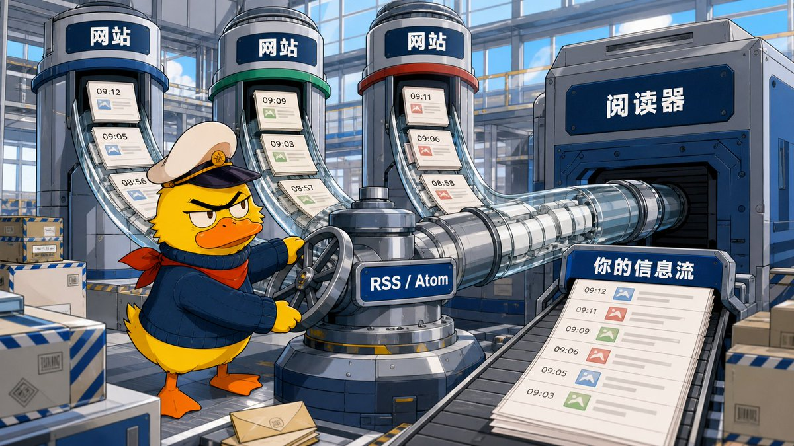

一套 RSS 系统只有三个角色：

- 内容发布者：网站、博客、播客或频道；

- 订阅源：发布者提供的一份更新清单，常见格式是 RSS 或 Atom；

- 阅读器：定时检查这些清单，把新内容集中展示给你。

你不需要理解 XML，也不用自己定时访问每个网站。只要把订阅地址交给阅读器，后面的检查和收取都由它完成。

可以把它和电子邮件类比：网站是发件人，RSS 地址像投递通道，阅读器就是收件箱。区别在于，订阅 RSS 通常不用把自己的邮箱交给网站，也不会顺手订上一串营销邮件。

和平台推荐流相比，差别更明显：

\| 你关心的问题 \| 平台推荐流 \| RSS \|
\| --- \| --- \| --- \|
\| 谁决定信息源 \| 平台和你的行为共同决定 \| 你主动订阅 \|
\| 默认顺序 \| 推荐权重、热度和广告混排 \| 通常按发布时间 \|
\| 漏看以后怎么办 \| 内容可能不再出现 \| 未读内容仍在阅读器里 \|
\| 换工具能否带走 \| 很难完整迁移关注关系 \| 多数阅读器可导出 OPML \|
\| 能否覆盖所有网站 \| 由平台生态决定 \| 取决于网站是否提供 Feed \|

RSS 也不是万能抓取器。它不保证提供全文，不会绕过登录或付费墙，也不一定包含评论、字幕和网页互动。它最稳定的工作，是告诉你：哪个来源，在什么时候，发布了什么。

一句话就能说清：

> RSS 把“每天去几十个网站检查更新”，改成“让这些网站把更新送进同一个收件箱”。

理解到这里就够了。先把第一条信息流跑起来，再谈分类、过滤和服务器。

# 二、先搭出第一条信息流

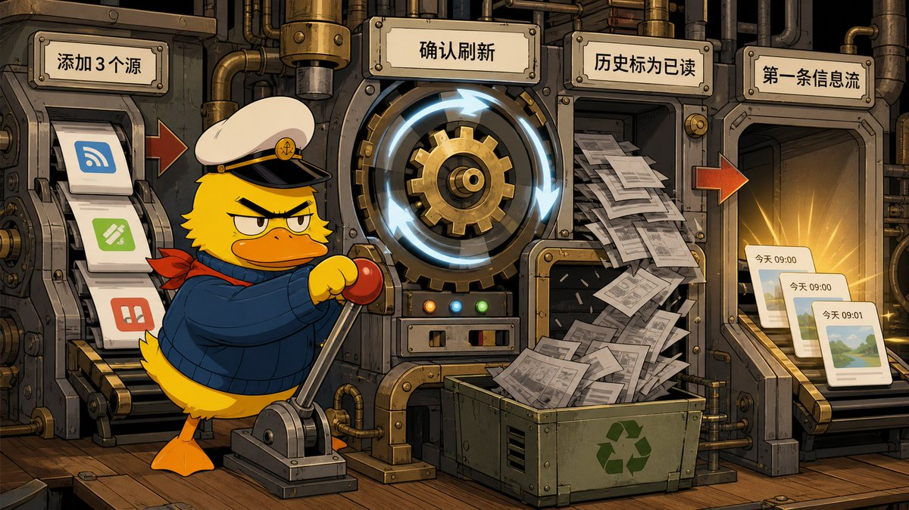

第一次不要比较十几款阅读器，也别先买服务器。拿一个有网页端的免费阅读器，订进三类来源：

1. 一个不能漏掉的官方源；

1. 一个更新较快的行业媒体；

1. 一个更新较慢的独立作者或周刊。

本文用 Inoreader 免费版演示公开 RSS 的基本操作。它有网页端和移动端，适合第一次把流程跑通。全部设备都在 Apple 生态的人，也可以用免费的 [NetNewsWire](https://netnewswire.com/)，核心操作相同。可先将语言设置为中文[⬇️](https://abs.twimg.com/emoji/v2/svg/2b07.svg)

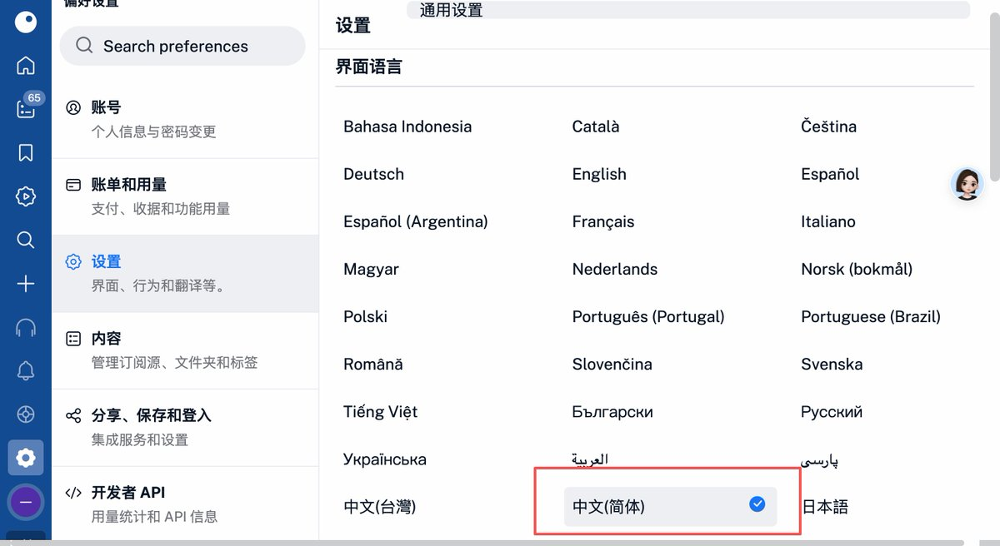

## 第一步：加入 3 个测试源

注册 Inoreader 后，按下面操作：

1. 点击左侧标签栏的 Add feed（+）；

1. 进入 Website / 网站，不要选 Web feed；

1. 在“搜索网站或粘贴 RSS 地址”中粘贴网站首页或 RSS 地址；

1. 看到正确的网站名称和近期文章后，点击订阅。

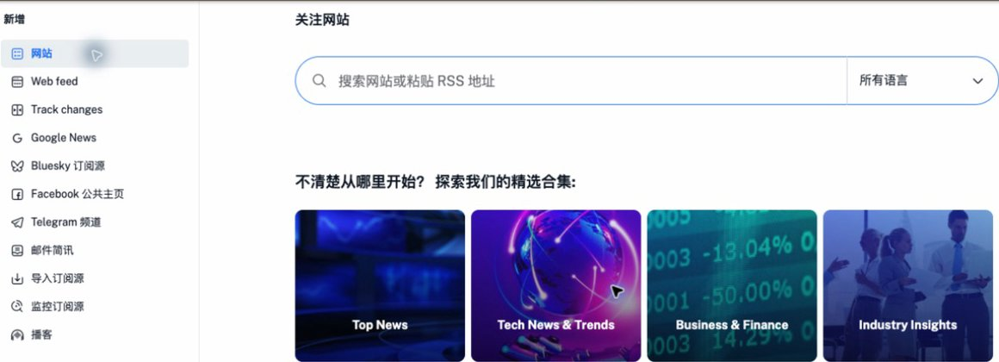

Website / 网站用于关注网站本来就提供的 RSS，免费账号可以使用。Web feed用于把没有 RSS 的普通网页转换成 Feed，属于 Pro 功能。如果页面标题显示“Create Web feed / 创建网页订阅源”，并出现升级提示，说明走错了入口，不代表普通 RSS 需要会员。

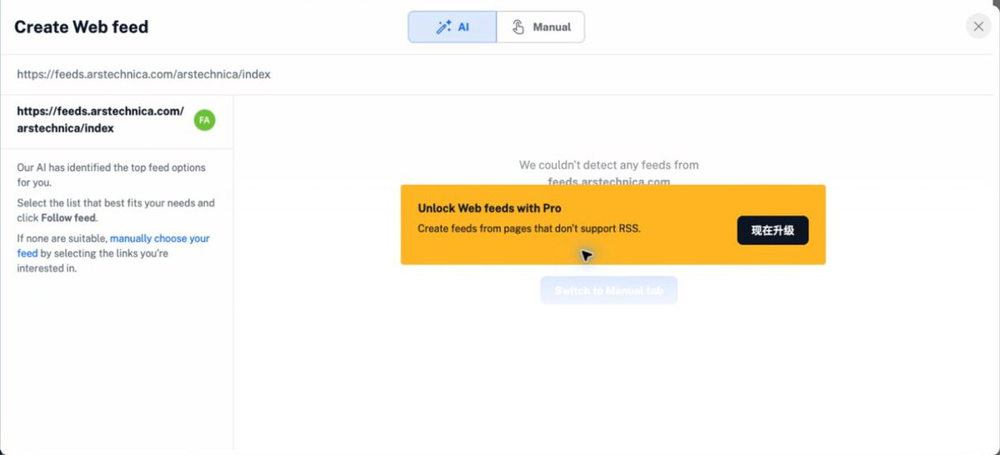

也不要进入设置里的“导入”页面。如果你看到“设备、URL、Feedly”三个选项，那是在导入整份订阅清单：其中的 URL 要求 OPML/XML 文件地址，不接受单条 RSS Feed。添加单个网站必须回到侧栏的 Add feed（+）。

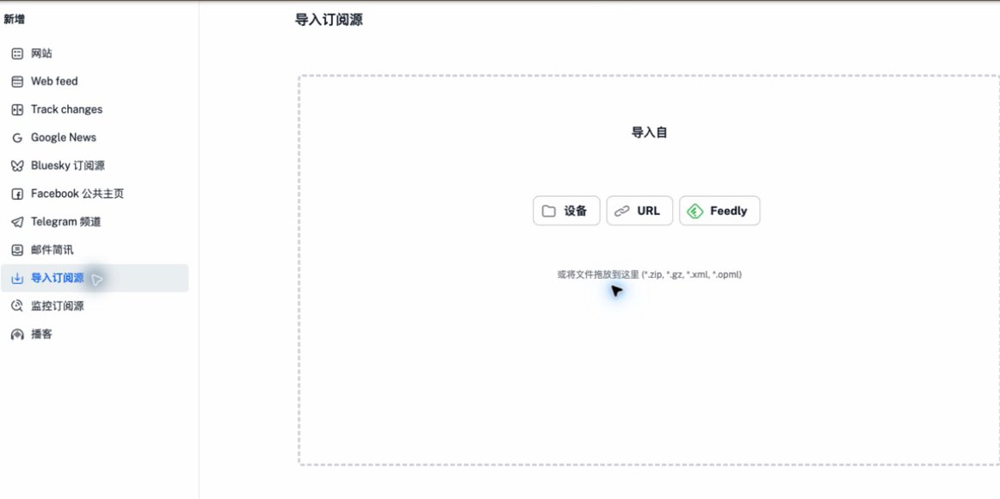

可以直接用这三条地址测试：

\`\`\`text
https://feeds.arstechnica.com/arstechnica/index
https://www.theverge.com/rss/index.xml
https://simonwillison.net/atom/everything/
\`\`\`

第一条是 RSS，后两条是 Atom，主流 RSS 阅读器都应该能够订阅。不要只看“添加成功”：能看到近期更新、文章标题和原文链接，才算真正可用。

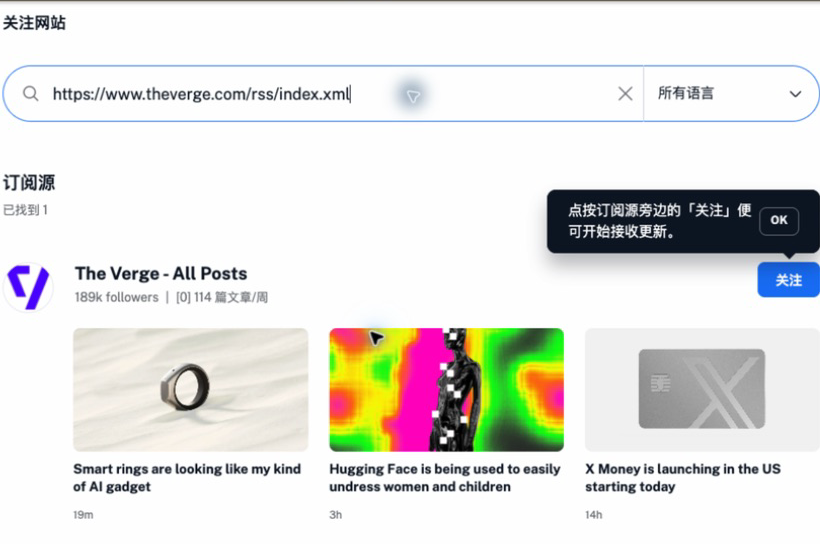

如果粘贴首页后出现多个结果，先看来源名称和最新文章，不要只认网站图标。

如果你已经进入“导入”页面，也可以选择“设备”，导入本文附带的 references/test-feeds.opml。这份 OPML 包含上面三个测试源。

## 第二步：确认信息真的进来了

回到 Feeds，打开总信息流 Newsfeed。三家网站的文章应该已经混合在同一条时间线上，并按发布时间排列。

随便点开三篇文章，检查：

- 标题和发布时间正常；

- 能看到摘要或正文；

- 点击原文链接能回到发布网站；

- 三个来源都有近期内容。

有些阅读器第一次订阅时会带回几百条历史文章。那不是你今天漏看的内容，只是第一次抓取的旧库存。

打开这三个 Feed，点击列表上方的对勾或更多菜单，选择 Mark all as read，把历史文章全部标为已读。不同端的图标位置可能略有差异，但名称通常不会差太多。

别从最早一篇开始补课。你建立的是未来的信息流，不是给自己补一笔历史债务。

## 第三步：用这四条验收

- 三个来源都能刷新；

- 新文章集中出现在同一条时间线；

- 原文链接能正常打开；

- 历史未读已经清空。

做到这里，RSS 最有价值的部分已经跑通了。后面的功能都只是在这条时间线上做三件事：增加来源、减少噪声、保存内容。

如果你只想快速完成，整篇文章可以先按这张清单走：

## 30 分钟完成清单

- 订进 3 个公开来源；

- 确认它们能正常刷新；

- 把导入的历史文章全部标为已读；

- 扩展到约 10 个高信号来源；

- 建立“必看、雷达、长读、休闲”四个文件夹；

- 导出第一份 OPML；

- 使用一周后，退订至少一个低价值源；

- 只有未读仍然失控，再考虑过滤、AI 或付费功能。

# 三、网站之外，还能订什么？

三个测试源跑通后，可以开始加入自己真正关心的来源。先别一口气订 100 个，目标是凑出第一批 10 个高信号源。

## 网站找不到 RSS，按这个顺序找

第一步，直接把网站首页、博客栏目页或作者主页交给阅读器。很多网站把 Feed 藏在网页代码里，页面上看不到，阅读器却能自动发现。

第二步，在页面中搜索这些词：

\`\`\`text
RSS
Atom
Feed
订阅
\`\`\`

重点看页脚、博客导航、作者页面和帮助页。有些网站只给某个栏目提供 Feed，订阅栏目通常比订阅全站更干净。

第三步，尝试常见路径：

\`\`\`text
/feed
/rss
/rss.xml
/feed.xml
/atom.xml
\`\`\`

不要因为地址能打开就认定它有效。把它放进阅读器，能识别出来源名称、标题、链接和发布时间，才算成功。

第四步，使用 RSSHub Radar 之类的自动发现工具，或者阅读器提供的 Web Feed、网页变化监控。前者寻找网站原本就有的 Feed；后者重新抓网页并判断变化，网站改版后更容易失效。

第五步，才考虑 RSSHub、RSS-Bridge 或自建抓取。它们能补足一部分没有公开 Feed 的网站，但稳定性取决于页面结构、登录要求和反爬策略。

如果一个来源必须登录、依赖 Cookie、频繁触发验证码，或者找了十分钟仍没有稳定入口，先放弃。RSS 应该减少维护，不是再给自己增加一个爬虫项目。

## Newsletter：先找公开 Feed

Newsletter 不一定非得进入邮箱。按这个顺序处理：

1. 先看作者是否公开 RSS；

1. 如果使用 Substack，尝试在主页后加 /feed；

1. 确实没有 Feed，再考虑阅读器提供的 Newsletter 专属邮箱。

专属邮箱的原理很简单：阅读器生成一个特殊邮箱地址，你用它订阅 Newsletter，来信会变成阅读器里的文章。

但这通常是付费功能。以 Inoreader 为例，官方把 Newsletter、YouTube、播客等扩展来源放在 Pro 方案中，入口是 Add feed &gt; Newsletter。创建名称和专属地址后，再用这个地址去订阅邮件即可。购买前应查看[当前方案说明](https://www.inoreader.com/pricing)。

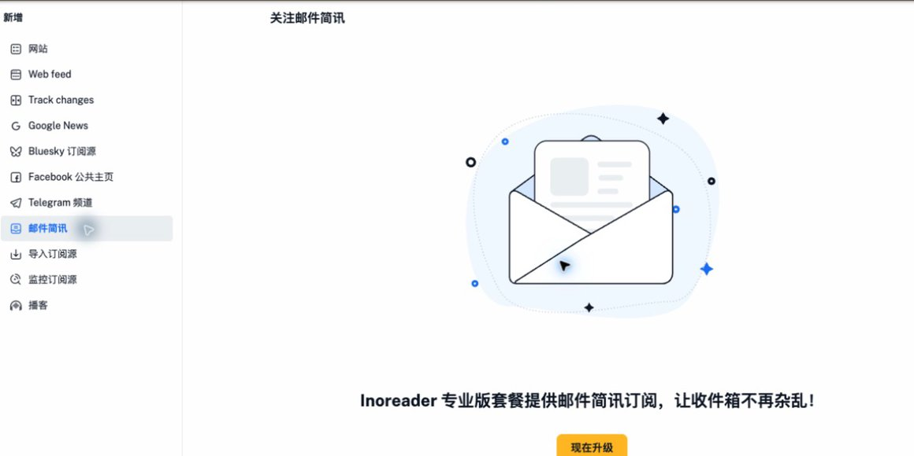

企业内部邮件、客户资料、个人账单和授权不清的付费 Newsletter，不要转发到第三方阅读器。

## YouTube：RSS 负责提醒，不负责替你看

先把公开频道页或播放列表地址粘贴进阅读器。支持 YouTube 的产品会自动识别；不支持时，不要急着手拼频道 ID。

Inoreader Pro 当前可以在 Add feed &gt; Website 中搜索或粘贴 YouTube 频道与播放列表，也可以连接账号同步订阅。其他阅读器的支持范围不同，先用一个频道测试再决定是否付费。

RSS 在这里解决的是“谁更新了”。评论、推荐、字幕、播放和视频摘要，仍由 YouTube 或阅读器的额外功能负责。

## 播客：它原本就建立在 Feed 上

绝大多数播客都有 RSS。可以从节目官网或托管页面复制地址，再交给支持音频的阅读器。

不过，RSS 阅读器适合统一发现和筛选；倍速、章节、车载体验和跨设备播放进度，专业播客客户端通常做得更好。入口可以统一，消费方式没必要统一。

# 四、10 个源怎样分才不乱？

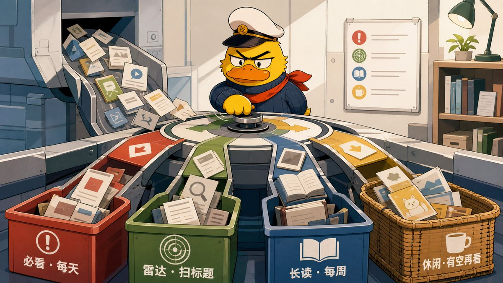

不要按“网站、Newsletter、YouTube”分类。内容格式不会告诉你多久看一次，阅读承诺才会。

先建立四个文件夹：

\| 文件夹 \| 放什么 \| 你的阅读承诺 \|
\| --- \| --- \| --- \|
\| 必看 \| 官方更新、客户、竞品、极少数核心作者 \| 每天检查一次 \|
\| 雷达 \| 高频媒体、社区和行业动态 \| 扫标题，允许整批标为已读 \|
\| 长读 \| 深度作者、研究和周刊 \| 每周集中处理 \|
\| 休闲 \| 灵感、边缘兴趣、视频和播客 \| 有空再看，不追未读 \|

在 Inoreader 网页端打开 Feeds，点击侧栏顶部的 Create folder，输入文件夹名称，再选中至少一个已经订阅的 Feed，最后保存。

这里有个很容易让新手困惑的细节：Inoreader 不允许先建立空文件夹。如果只填名称就保存，会提示“请添加至少一个订阅源到此文件夹”。因此可以先这样安排：

- 把最重要的作者放进“必看”；

- 把高频科技媒体放进“雷达”；

- 把适合周末阅读的作者放进“长读”；

- 把视频、播客或泛兴趣媒体放进“休闲”。

文件夹建好后，仍然可以继续增减 Feed；同一个来源也可以放进多个文件夹。

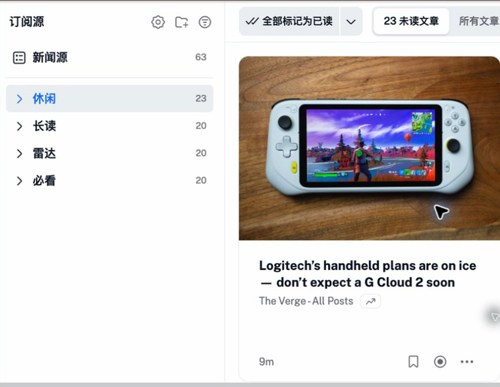

第一批 10 个源，可以先这样分：

- 必看：3 个；

- 雷达：4 个；

- 长读：2 个；

- 休闲：1 个。

每加入一个来源，只问两个问题：

1. 错过它，会造成什么具体损失？

1. 它的更新频率，配得上我对这个文件夹做出的阅读承诺吗？

如果一家媒体每天发 40 篇，而你只关心其中两篇，它就不该进入“必看”。把它放进“雷达”，只扫标题；或者寻找更窄的栏目 Feed。

同一个来源也不必永久待在同一层。某家公司正在发布你关注的产品，可以暂时升到“必看”；项目结束，再降回“雷达”。

分类不是为了把侧栏整理得漂亮。它要允许你采取不同动作：必看逐条处理，雷达批量跳过，长文留到周末，休闲内容不产生心理债务。

一开始就定好阅读节奏：

- 每天：只处理必看，雷达只扫标题；

- 每周：集中阅读长读和真正收藏的文章；

- 每月：退订、降级失去价值的来源，并导出一次 OPML。

# 五、用一周，再选阅读器

阅读器没有统一的“最好”。先免费用一周，记下真正让你难受的问题，再按问题换工具。

\| 你实际遇到的问题 \| 更值得看的路线 \|
\| --- \| --- \|
\| 只想集中看更新，跨设备同步 \| Inoreader \|
\| 全部设备都在 Apple 生态，只想清爽阅读 \| NetNewsWire \|
\| RSS、长文、PDF、标注和知识库想放在一起 \| Readwise Reader \|
\| 特别重视历史搜索和人工训练优先级 \| NewsBlur \|
\| 需要 API、复杂自定义或自己掌握数据 \| FreshRSS / Miniflux \|

选的时候，先看五件事：

1. 有没有你需要的网页端和移动端；

1. 已读、收藏和文件夹能否跨设备同步；

1. 能不能导入、导出 OPML；

1. 你需要的 Newsletter、YouTube、全文和过滤是否属于付费功能；

1. 订阅上限、历史保留和搜索范围是否够用。

不要因为某款阅读器有 AI、TTS、仪表盘或几十种集成，就提前付费。先记录问题：

- 找不到想订的源？

- 未读太多？

- 跨设备不同步？

- 文章只能看到摘要？

- 收藏以后搜不到？

- Newsletter 和 YouTube 仍散落在外面？

问题明确后，功能表才有意义。

如果只是想把公开网站集中起来，免费工具通常已经够用。等你明确需要规则、Newsletter、网页监控、全文、AI 或长期归档，再看[官方价格页](https://www.inoreader.com/pricing)，不要把高级功能误当成 RSS 入门门票。

# 六、换阅读器，什么能带走？

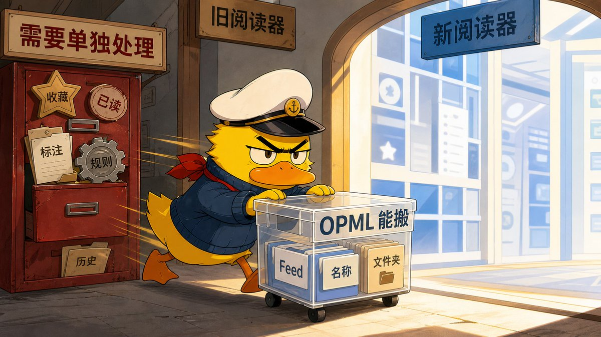

OPML 是一份订阅清单。它通常记录 Feed 地址、来源名称和文件夹，让你可以把订阅从一个阅读器搬到另一个。

它最重要的作用不是“备份设置”，而是保住迁移权。某个产品涨价、改版或停止服务，你仍能把信息源交给别的工具。

## 现在就导出第一份

在 Inoreader 网页端进入：

\`\`\`text
Preferences &gt; Import, export, backup
\`\`\`

找到 OPML 导出，下载文件。给文件名带上日期：

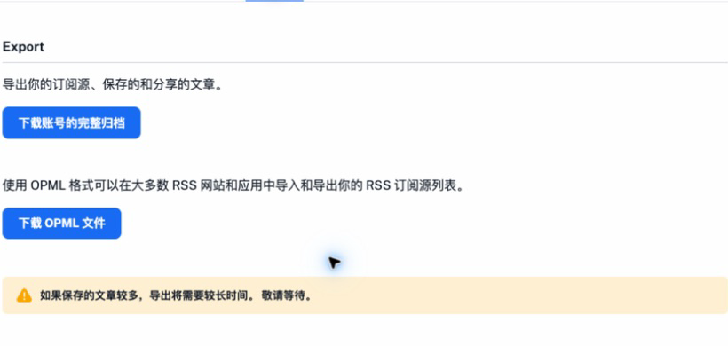

\`\`\`text
rss-subscriptions-2026-07-27.opml
\`\`\`

把它放进正常备份的位置，不要只留在下载文件夹。如果界面以后改版，直接在设置中搜索 OPML 或 Export。

## OPML 能搬什么，不能搬什么？

\| 通常能通过 OPML 搬走 \| 通常需要单独处理 \|
\| --- \| --- \|
\| Feed 地址 \| 收藏与稍后读 \|
\| 来源名称 \| 已读、未读状态 \|
\| 文件夹或分类 \| 标注和笔记 \|
\| 部分自定义标题 \| 过滤规则与通知 \|
\| 公开 RSS 清单 \| Newsletter 专属邮箱 \|
\|  \| 全文选择器、AI 提示词和历史归档 \|

不同产品的边界略有差异。以 Feedly 的官方说明为例，[OPML 导入](https://docs.feedly.com/article/51-how-to-import-opml-into-feedly)不会带入 Boards 或 Read Later，[OPML 导出](https://docs.feedly.com/article/52-how-can-i-export-my-sources-and-feeds-through-opml)也不会带走所有产品专属内容。

所以，真正换工具时按这个顺序走：

1. 从旧阅读器导出 OPML；

1. 单独导出或复制收藏、稍后读、标注和规则；

1. 把 OPML 导入新阅读器；

1. 对比订阅数和文件夹，再抽查 5 个“必看”来源能否刷新；

1. 重新建立 Newsletter 地址、过滤规则和通知；

1. 新工具稳定使用一周，再决定是否删除旧账号。

不要只看“导入成功”。它只能说明 OPML 文件读进去了，不能证明每个来源仍然有效。迁移是否完成，看三件事：订阅数对得上，重点来源能刷新，额外规则已经重建。

# 七、未读爆炸，先砍哪里？

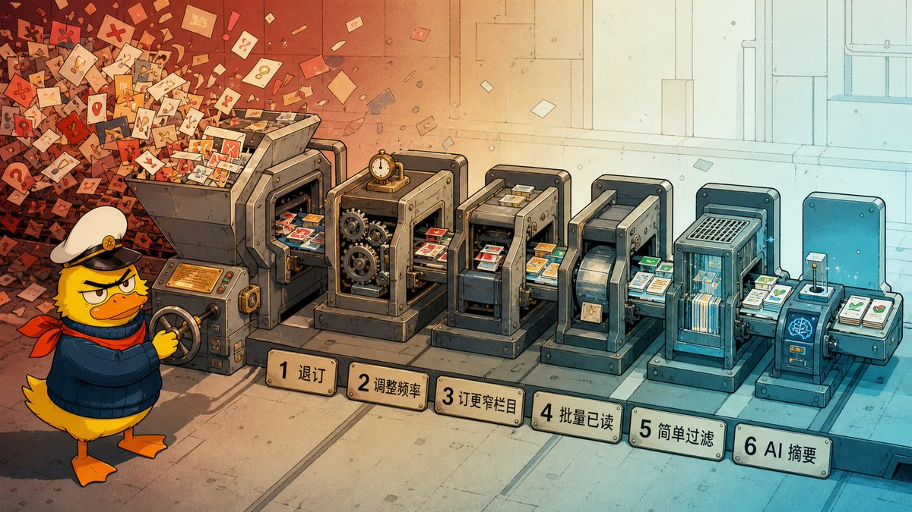

未读数失控时，很多人会先找更强的过滤器。第一步其实应该是退订。

按成本从低到高，降噪顺序是：

1. 删除低价值来源；

1. 调整文件夹和阅读频率；

1. 订阅更窄的栏目；

1. 批量标为已读；

1. 建立简单规则或过滤；

1. 最后才使用 AI 摘要。

一条 Feed 如果连续两周没有让你点开任何文章，就把它降到“雷达”或直接退订。RSS 不是收藏夹，订阅也不是对作者的永久承诺。

“雷达”和“休闲”应该允许整批标为已读，只有“必看”需要逐条确认。系统是否健康，不取决于未读数字是不是零，而取决于高优先级来源有没有被你看见。

## 规则和过滤是付费分支，不是入门必修课

当一个高频来源整体仍有价值，但你只关心其中少数主题时，自动过滤才开始有意义。

先把边界说清楚：Inoreader 的规则和过滤器属于 Pro。免费用户看不到完整的执行界面，也不需要为了完成这篇教程立刻付费。只要你已经会退订、分文件夹、寻找更窄的栏目 Feed 和批量标为已读，前面的免费系统就已经能够正常工作。

这里真正值得学的，不是某个付费按钮，而是一条任何工具都能复用的规则：

\`\`\`text
范围 → 条件 → 动作 → 复查
\`\`\`

例如，你仍想保留一家每天更新几十次的科技媒体，但只关心 OpenAI 和 Claude：

1. 范围：只选这一个高频 Feed；

1. 条件：标题包含 OpenAI 或 Claude；

1. 动作：先加上“AI”标签，或者把不相关内容标为已读；

1. 复查：运行一周，检查漏掉了什么、误伤了什么，再调整关键词。

不要一开始扫描全文，也不要直接删除文章。关键词写得太宽同样会误伤，例如只匹配 AI，可能把包含相同字母组合的英文单词也算进去。新手不必先学正则表达式，先把范围限制在一个来源，动作保持可撤销，就已经够用。

如果你决定购买 Inoreader Pro，再进入 Automate &gt; Rules 把上面的四步落地。Automate &gt; Filters 的力度更大，可以直接保留或移除符合条件的文章，更应该从一个来源开始测试。

如果不买 Pro，就继续使用三个免费替代动作：寻找更窄的栏目 Feed，把高频来源降到“雷达”，或者直接退订。你失去的是自动执行，不是 RSS 的核心能力。

## AI 摘要为什么放最后？

因为它不会修复错误订阅。给 100 个低价值来源自动生成摘要，只是把噪声压成更短的噪声。

这些情况先不用 AI：

- 订阅不到 30 个，未读主要来自源选得太多；

- 你只是扫描标题，判断有没有更新；

- 你需要准确引用、限定条件和作者原本的语气。

这些情况才值得试：

- 每周固定出现大量长报告、视频或播客，需要先判断是否值得投入时间；

- 需要跨语言初筛；

- 需要按固定模板提取公司、产品、融资、风险或行动项。

即使使用，也优先对“收藏”或“稍后读”运行，不要自动总结整条时间线。AI 摘要负责分诊，不负责替代原文。

# 八、哪些文章值得长期留下？

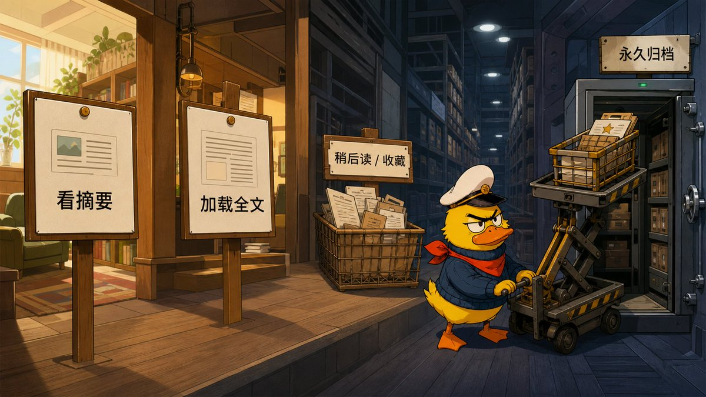

一篇文章出现在阅读器里，不代表它已经被永久保存。先把几个容易混淆的动作分开：

\| 动作 \| 解决什么问题 \| 不保证什么 \|
\| --- \| --- \| --- \|
\| 看摘要 \| 快速判断要不要点开 \| 不保证覆盖完整论证 \|
\| 加载全文 \| 在阅读器里完成阅读 \| 不一定永久保存网页 \|
\| 稍后读 \| 把待处理文章移出时间线 \| 不等于长期档案 \|
\| 收藏 \| 标记文章重要 \| 不一定保存原文内容 \|
\| 永久归档 \| 长期保留正文、链接和元数据 \| 需要导出、存储和备份 \|

普通用户先用三层就够：

1. 信息流：扫标题，决定看、留还是跳过；

1. 稍后读：只放本周确定要处理的内容；

1. 长期库：只保存以后需要搜索、引用或再次使用的文章。

如果只是“感觉以后可能有用”，不要直接送进知识库。收藏几千篇但从不复用，只是把未读焦虑换成归档焦虑。

## 全文阅读不等于永久归档

很多 Feed 只提供标题和摘要。阅读器的“加载全文”会再次访问网页，尝试提取正文。网站改版后，原有规则可能失效；登录、付费墙和内容授权也不会因此消失。

所以全文提取适合按来源开启，不适合全局一键抓取。某个网站提取失败，通常不是多刷新几次就能解决，而是页面结构已经变化；这类情况交给阅读器默认规则处理，或者直接回原网页看，比让新手维护提取代码更省事。

如果只是偶尔保存文章，用阅读器的稍后读，再把真正重要的内容导出为 PDF、Markdown 或同步到知识库就够了。只有“几年后还能搜索完整正文”本身就是任务，才值得为长期归档付费或自托管。

# 九、什么时候才值得自托管？

自托管不是 RSS 的毕业考试。它只是把阅读器后端放到自己的服务器，同时把维护责任也接过来。

只有下面四类需求持续存在，才值得认真考虑：

1. 不想把订阅图谱和阅读记录放在第三方云端；

1. 需要大量订阅、自定义规则或云端产品没有的全文处理；

1. 需要 API、Webhook、输出 RSS，或接入自己的自动化；

1. 已经有服务器、HTTPS、备份和更新习惯，新增服务的维护成本很低。

如果只是为了省几美元，通常不值得。服务器、域名、备份、监控和故障处理都会产生成本。自托管也不会自动降低噪声：订阅太多，只是把未读数字搬到自己的服务器。

两个常见选择取向不同：

\| 选择 \| 更适合什么需求 \|
\| --- \| --- \|
\| \[FreshRSS\](https://freshrss.github.io/FreshRSS/) \| 文件夹、统计、可视化过滤、多人使用、扩展和较完整的网页管理 \|
\| \[Miniflux\](https://miniflux.app/docs/rules.html) \| 最小界面、正则过滤、全文抓取、重写规则和 API \|

部署前，至少要能回答：

- 服务怎么更新，失败如何回滚？

- 数据库和配置备份到哪里？

- 服务器损坏后，能不能恢复？

- HTTPS 和登录入口由谁维护？

- 是否把服务直接暴露在公网？

- 第三方客户端用什么账号或令牌连接？

如果这些问题目前都没有答案，继续使用云端阅读器并定期导出 OPML，反而更省心。把数据放在自己的机器上，只是控制权的一部分；更新、备份和恢复也得自己负责。

# 十、GitHub 上有哪些现成 RSS 项目？

GitHub 上的 RSS 项目很多，但普通用户没必要按星标从高到低挨个试。先问自己缺的是阅读器、同步后端，还是一个网站原本没有的 Feed。

下面这些项目在本次核验时都没有归档，并且仍有近期代码提交或版本发布。它们解决的不是同一个问题：

\| 你要解决什么 \| 项目 \| 更适合谁 \| 先知道的边界 \|
\| --- \| --- \| --- \| --- \|
\| 在 Apple 设备上直接阅读 \| \[NetNewsWire\](https://github.com/Ranchero-Software/NetNewsWire) \| 使用 Mac、iPhone、iPad，重视简洁和原生体验 \| 主要服务 Apple 生态；跨平台要换别的客户端 \|
\| 在 Android 上直接阅读 \| \[Read You\](https://github.com/ReadYouApp/ReadYou) \| 想要 Material You 风格的本地阅读器 \| 它是客户端，不会替你托管一个公开的网页后端 \|
\| 多个平台使用一个开源客户端 \| \[FeedFlow\](https://github.com/prof18/feed-flow) \| 需要 Android、iOS、macOS、Windows 或 Linux \| 先确认你需要的同步服务是否受支持，不要只看平台数量 \|
\| 自己托管完整阅读器 \| \[FreshRSS\](https://github.com/FreshRSS/FreshRSS) \| 需要网页端、多用户、标签、扩展和客户端 API \| 功能完整，也意味着设置和维护项目更多 \|
\| 自己托管轻量后端 \| \[Miniflux\](https://github.com/miniflux/v2) \| 喜欢极简界面，需要规则、全文抓取和 API \| 依赖 PostgreSQL，部署前要准备更新和备份 \|
\| 给没有公开 Feed 的服务补路线 \| \[RSSHub\](https://github.com/DIYgod/RSSHub) \| 能在文档中找到现成路由，或者愿意自己部署 \| 路由会随平台改版失效；登录、验证码和反爬仍然存在 \|
\| 给特定网站生成 Feed \| \[RSS-Bridge\](https://github.com/RSS-Bridge/rss-bridge) \| 想使用现成 Bridge，或会用 CSS、XPath 补简单页面 \| 本质仍是网页抓取，公共实例可能限流，页面改版后需要修 \|

最简单的选择顺序是：

1. 只想开始阅读：安装 NetNewsWire、Read You 或 FeedFlow 中与你设备匹配的一个；

1. 公开 Feed 找不到：先用阅读器自动发现，再查 RSSHub 或 RSS-Bridge 是否已有现成路线；

1. 确认需要掌握数据、API 或大量自定义：再在 FreshRSS 和 Miniflux 中二选一；

1. 只有准备参与开发时，才需要克隆仓库、阅读 Issues 或自己写路由。

基础读者可以在这里停下。只要你已经订进第一批来源、建好四个文件夹并保存了一份 OPML，这套系统就能开始工作。

接下来只要坚持一个很轻的循环：

- 每天看一次必看；

- 每周处理一次长读；

- 每月退订低价值来源，并更新 OPML；

- 未读仍然失控，再逐级增加过滤、AI 或归档。

RSS 不会替你判断什么值得读，它只是把判断权交还给你。用久以后，你会越来越清楚哪些必须看，哪些扫过就行，哪些随时能删。哪天工具变了，再把订阅带走。

我是诺鸭船长，带你在信息的海洋里寻找陆地～

---

海外信息源系列（其他系列移步个人主页）

[GitHub 全网最全使用指南：从入门到榨干](https://x.com/noahduck283/status/2078803891274273276?s=20)

[Discord 全网最全使用指南：从入门到榨干](https://x.com/noahduck283/status/2072536246245826943?s=20)

[Product Hunt 全网最全使用指南：从入门到榨干](https://x.com/noahduck283/status/2071073057075331498?s=20)

[Conso 全网最全使用指南：从入门到榨干](https://x.com/noahduck283/status/2069934184626549090?s=20)

[Telegram 全网最全使用指南：从入门到榨干](https://x.com/noahduck283/status/2069570117445571061?s=20)

[Reddit 全网最全使用指南：从入门到榨干](https://x.com/noahduck283/status/2075035259872366786?s=20)

海外信息源系列（其他系列移步个人主页）

[Discord 全网最全使用指南：从入门到榨干](https://x.com/noahduck283/status/2072536246245826943?s=20)

[Product Hunt 全网最全使用指南：从入门到榨干](https://x.com/noahduck283/status/2071073057075331498?s=20)

[Conso 全网最全使用指南：从入门到榨干](https://x.com/noahduck283/status/2069934184626549090?s=20)

[Telegram 全网最全使用指南：从入门到榨干](https://x.com/noahduck283/status/2069570117445571061?s=20)

[Reddit 全网最全使用指南：从入门到榨干](https://x.com/noahduck283/status/2075035259872366786?s=20)

### 🖼️ Attached Media

## 💬 Replies

### 1 @isnail (蜗牛King 👑)

*Wed Jul 29 07:15:24 +0000 2026*

@noahduck283 船长太牛了，我用的是一个叫语鲸的，感觉还不错

### 2 @noahduck283 (诺鸭船长3) (Author)

*Wed Jul 29 07:17:04 +0000 2026*

@isnail 我去，我说蜗牛哥啥都懂还快，原来早有涉猎

### 3 @cgnot996 (铁柱AGI)

*Tue Jul 28 14:10:41 +0000 2026*

@noahduck283 船长真的要把互联网+AI基建全部给大家讲完了，太强了

### 4 @noahduck283 (诺鸭船长3) (Author)

*Tue Jul 28 14:12:30 +0000 2026*

@cgnot996 哈哈哈没错，大基建工程

### 5 @cryozerolabs (冰零)

*Wed Jul 29 02:20:22 +0000 2026*

@noahduck283 每日榨干系列之：榨干RSS

### 6 @noahduck283 (诺鸭船长3) (Author)

*Wed Jul 29 04:07:46 +0000 2026*

@cryozerolabs rss玩一玩挺香的😁

### 7 @ai_Goge (Kelvin)

*Tue Jul 28 14:10:51 +0000 2026*

@noahduck283 做流量就学船长，直接榨干

### 8 @noahduck283 (诺鸭船长3) (Author)

*Tue Jul 28 23:17:44 +0000 2026*

@ai\_Goge 必须狠狠地榨干！

### 9 @huxlab (Hux)

*Tue Jul 28 14:01:21 +0000 2026*

@noahduck283 我愿称之为全网最全信息源，你真是一点都不保留啊

### 10 @noahduck283 (诺鸭船长3) (Author)

*Tue Jul 28 23:17:25 +0000 2026*

@huxlab 抛砖引玉，多交流😁

### 11 @Yunn260414 (Yunn)

*Wed Jul 29 03:52:07 +0000 2026*

@noahduck283 妈妈再也不用担心我刷文章刷不过来了

### 12 @noahduck283 (诺鸭船长3) (Author)

*Wed Jul 29 04:29:10 +0000 2026*

@Yunn260414 妈妈:有这时间是不是能学会习哈哈哈

### 13 @OMOisomo (O MO)

*Wed Jul 29 02:03:52 +0000 2026*

@noahduck283 有一个统一的入口实在是太方便了。那我问一个小问题，微信公众号的文章能拿到吗

### 14 @noahduck283 (诺鸭船长3) (Author)

*Wed Jul 29 02:05:19 +0000 2026*

@OMOisomo 这个我没有测试，公众号倒是有好几种方法批量下载对标分析

### 15 @leaf_sanren (Leaf Yeah!)

*Tue Jul 28 14:23:53 +0000 2026*

@noahduck283 感觉每天的注意力都被船长榨干了，受不了，受不了，扛不住了呀。

### 16 @noahduck283 (诺鸭船长3) (Author)

*Tue Jul 28 14:37:06 +0000 2026*

@leaf\_sanren 嘘，这话关起门来再说

### 17 @ai_suxiaole (苏乐)

*Tue Jul 28 14:32:15 +0000 2026*

@noahduck283 看完我得把RSS安排上了 天天算法信息茧房了

### 18 @HytidelLegend (Hytidel聊商业（文章更多干货）)

*Tue Jul 28 15:00:43 +0000 2026*

@noahduck283 信息入口太散导致重复低效，RSS把更新主动送进统一收件箱。本文从零教你免费搭建可带走的高信号阅读系统，含分类、过滤与迁移。

### 19 @aipgh6 (彭根辉)

*Wed Jul 29 07:15:44 +0000 2026*

@noahduck283 船长牛逼啊，太全面了

### 20 @LiuyanW618 (柳儿的AI与Web3副业日记)

*Wed Jul 29 04:38:18 +0000 2026*

@noahduck283 学得真不错，已经用上了，谢谢！

### 21 @JackQi82772 (SakuAI)

*Wed Jul 29 07:33:26 +0000 2026*

@noahduck283 我还没用过rss……马上从第一步开始做

### 22 @EddaMikola12279 (dudu)

*Tue Jul 28 14:27:02 +0000 2026*

@noahduck283 老大，把你推文全扒下来都可以当维基百科了

