# 📰 Tailscale 全网最全使用指南：从入门到榨干

文件还躺在家里的电脑，人已经出门；家中的 AI 和影音库明明在运行，手机却打不开。明明都是自己的设备，传文件、远控和访问网页却各有一套入口——你买得越多，反而越难一起用。

Tailscale 不替你存文件，也不替你控制屏幕。它做的是更底层的一步：让你允许加入的电脑、手机和服务器，无论换 Wi-Fi 还是移动网络，都保留一个固定的私人名字，并且只在你自己的设备网里互相访问。

跟着本文，你会先用 Mac 和 Windows 为例跑通多设备的连接，传出第一个文件，再建好一个自动同步、误删可恢复的文件夹。掌握这条主线，你就能把手机、家用存储和服务器继续接进来，按需扩展远控、本地服务和上网出口。

# 目录（相关文章尾部跳转）

第一次使用：先完成一条主线

1. Tailscale 到底是什么，为什么技术圈总能看到它？

1. 先用 Mac 和 Windows 跑通第一条连接

1. 发文件、看文件、同步文件，原来是三回事

1. 真正的自动同步，需要另一块拼图

已经连通：按真实需求选一章

1. 设备已经连上，怎样真正控制另一台电脑？

1. 只给自己开放本地 AI 和家庭服务

1. 把 NAS、打印机和摄像头也接进来

1. 出门以后，从家里的网络上网

连接异常时再查

1. 显示在线，为什么还是连不上或很慢？

# 1\. Tailscale 到底是什么，为什么技术圈总能看到它？

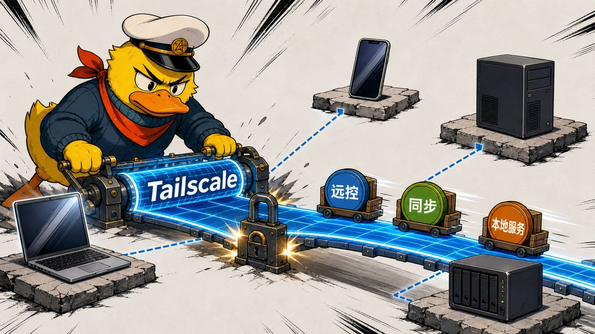

你可以把 Tailscale 理解成一个“私人网络搭建器”。在自己的电脑、手机、服务器或 NAS 上安装它，再登录同一个账号，这些原本分散在家里、公司和云端的设备，就有了固定的私人地址和名字。NAS 指的是长期联网、专门在家里存放和共享文件的设备。以后这些设备换了 Wi-Fi、改用手机流量或者去了另一个城市，你仍然可以用同一个名字找到它。

以前为了从外面访问家中设备，往往要先弄懂路由器和一串网络设置；Tailscale 把最常见的起点缩短成安装、登录和允许设备加入。系统有时会把它显示为 VPN，但这里先把 VPN 理解成一条只供自己设备使用的加密通道就够了。

一张 Tailscale 网络搭好以后，可以沿着四个方向扩展：

- 连接自己的设备：让电脑、手机、平板、树莓派、NAS 和云服务器互相找到；

- 使用设备上的东西：远程打开文件、控制另一台电脑，或者访问本地 AI、影音库、智能家居和开发环境；

- 进入设备后面的网络：通过一台常开设备，继续访问不能安装 Tailscale 的打印机、摄像头和其他家电；

- 选择从哪里上网：让手机或电脑的普通网络流量从家里或一台租来的云端电脑出去。

这些玩法共用同一条底层连接，这是 Tailscale 最省事的地方。远控、NAS、本地 AI 和云端电脑不用各自维护一套入口；设备加入私人网络以后，后面的工具都可以沿用各设备在 Tailscale 里的名字和地址。

在海外的家庭服务器、远程开发和自建 AI 内容里，Tailscale 的出现频率很高。技术频道 Level1Techs 展示过团队自己的用法；有开发者连续使用四年，把树莓派这类小电脑、家庭自动化、服务器和私人应用接在同一张网里；还有人用它连接手机、电脑、租来的云端服务器和 Claude Code 这类 AI 编程工具，让同一项开发任务能从不同设备继续。他们做的事不同，却都把 Tailscale 当成设备之间的连接底座。个人非商业使用可以直接从免费计划开始。

以后判断一个玩法是否需要 Tailscale，可以先分成两层：能不能到达另一台设备，由 Tailscale 解决；到达以后做什么，由具体工具解决。 第二章先验证第一层：让两台设备找到彼此，再送出一个文件。

# 2\. 先用 Mac 和 Windows 跑通第一条连接

下面把 Mac 当作设备 A、Windows 当作设备 B，完成第一条真实连接。这组设备已经实测并保留了截图；如果你手里是其他设备，先看懂“设备 A 和设备 B 怎样加入同一张网”，再换成自己系统的安装界面。

本章先做一件事：让 Mac 和 Windows 在 Tailscale 里看见彼此，并成功发送一个文件。同步和远程控制暂时不碰。

## 第一步：在两台电脑上安装

Mac 客户端目前支持 macOS Monterey 12 或更高版本。进入 [Tailscale 的 macOS 安装页](https://tailscale.com/docs/install/mac)，优先下载官方推荐的 Standalone 版本，也就是直接从官网安装的独立客户端。首次启动时，系统会询问是否允许添加 VPN 配置或启用 Tailscale Network Extension。这里的 VPN 配置只是 macOS 给这类网络连接使用的系统名称，点击允许即可；没有这项权限，设备不会真正接入 Tailscale。

第三步需要在 Mac 终端里输入 tailscale 命令。macOS Ventura 13 或更高版本可以在 Tailscale 的 Settings → CLI integration → Show me how → Install Now 中安装命令入口。现在先装好；否则第三步可能只会看到 command not found。这不是网络故障，只是终端还不知道去哪里找 Tailscale。macOS 12 看不到这个入口时，第三步另有一条完整写法。

Windows 目前要求 Windows 10 或更高版本。进入 [Windows 安装页](https://tailscale.com/docs/install/windows)，下载 .exe 安装包。安装完成后，Tailscale 图标会出现在右下角系统托盘；若没看到，先展开隐藏图标。

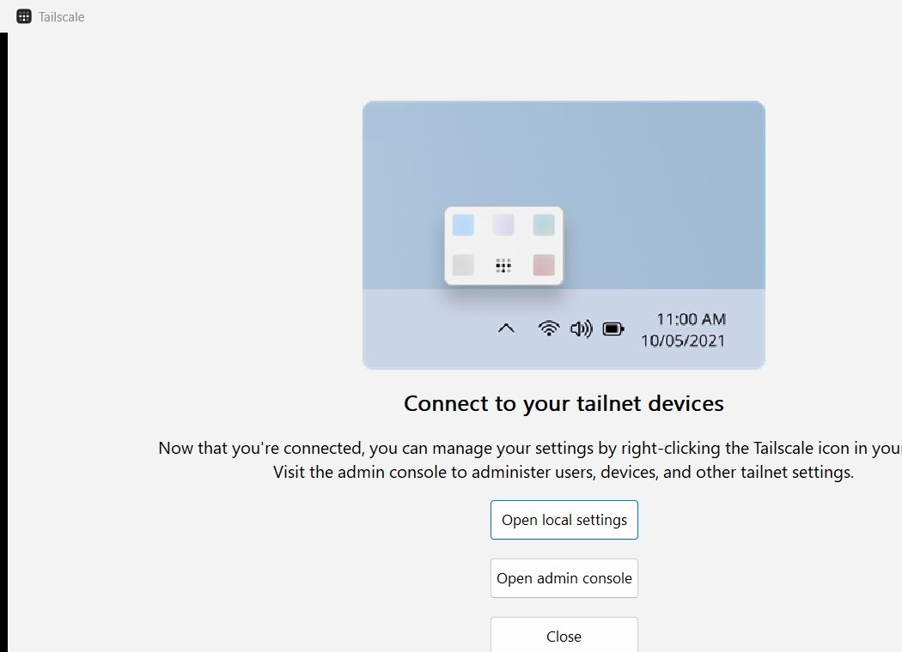

两台电脑务必使用同一种登录方式和同一个账号。例如 Mac 选择 Google 登录，Windows 也选择同一个 Google 账号。第一次登录后，Tailscale 会自动为这个账号建立一张私人设备网。后台把这张网叫作 tailnet，后文再看到这个词，就把它理解成“我的 Tailscale 设备列表”。若页面询问用途，个人非商业使用选择 Personal。

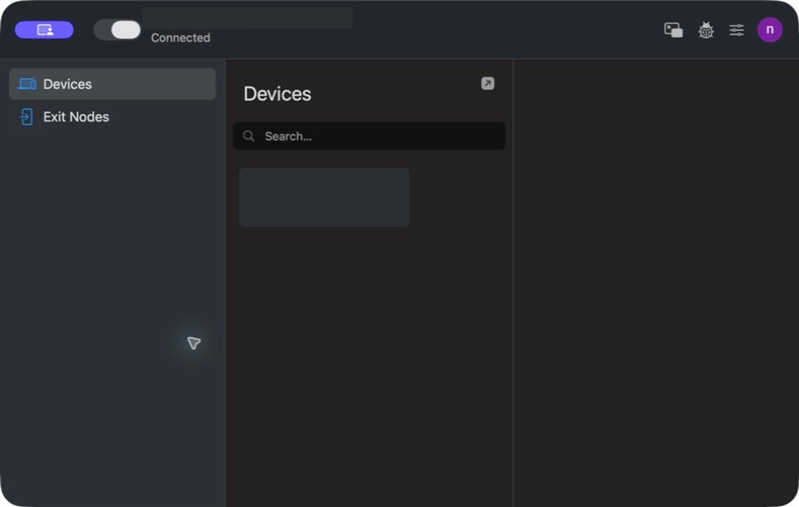

Mac 端出现 Connected，才算真正接入；截图中的账号和设备信息已遮挡。

## 第二步：确认两台设备属于同一张网

打开 [Machines 管理页面](https://login.tailscale.com/admin/machines)。Machines 就是“设备”页面。正常情况下，你会看到 Mac 和 Windows 都显示在线，每台设备旁边还有一个以 100. 开头的数字地址。这个地址由 Tailscale 分配，只在你的私人设备网里使用；它相当于这台电脑在网内的门牌号。

设备名最好现在就改清楚，例如：

\`\`\`text
noah-mac
home-windows
\`\`\`

这两个名字只是示例，不能不看设备就直接照抄。回到 Machines 设备页面，找到 Mac 那一行，点击最右侧的 …，选择 Edit machine name；取消勾选 Auto-generate from OS hostname，再填入 noah-mac。用同样的方法把 Windows 改成 home-windows。如果你使用了别的名字，后面的命令也要换成你的真实设备名。

不要保留 DESKTOP-8F3X... 这类半年后自己也认不出的默认名字。改名后，很多时候可以直接使用这个名字访问设备，不必记住那串 100. 地址。Tailscale 把这项“用名字代替数字地址”的功能叫作 MagicDNS，新创建的私人设备网通常已经默认开启。

## 第三步：不要只看“绿色在线”

在 Mac 打开系统自带的“终端”；在 Windows 右键开始菜单，打开“终端”或 PowerShell。它们都是系统自带的命令窗口。分别输入：

\`\`\`bash
tailscale status
\`\`\`

如果 macOS 12 提示 command not found，把 Mac 上的命令改成下面这条完整路径：

\`\`\`bash
TAILSCALE\_BE\_CLI=1 /Applications/Tailscale.app/Contents/MacOS/Tailscale status
\`\`\`

你应该能在列表中看到另一台设备。然后在 Mac 上测试 Windows：

\`\`\`bash
tailscale ping home-windows
\`\`\`

macOS 12 同样改用完整路径：

\`\`\`bash
TAILSCALE\_BE\_CLI=1 /Applications/Tailscale.app/Contents/MacOS/Tailscale ping home-windows
\`\`\`

再在 Windows 上测试 Mac：

\`\`\`powershell
tailscale ping noah-mac
\`\`\`

这条命令是在问：“我能找到这台电脑吗？”只要结果里出现 pong from 和对方设备名，就说明能找到。后面可能还会跟着 direct、peer-relay 或 DERP 等英文，现在不用理解；第九章排查速度时再解释。

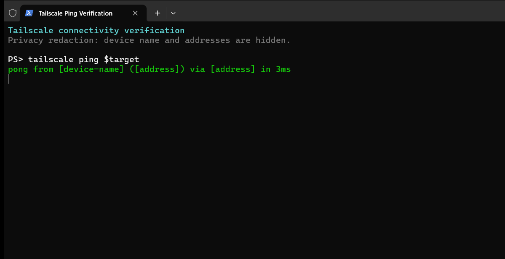

如果管理后台能看到两台设备，但 tailscale ping 失败，先确认两端客户端都处于 Connected 状态、没有登错账号，再临时暂停其他 VPN 或代理软件重试。不要为了省事关闭系统防火墙。

## 第四步：发送第一个文件

Tailscale 自带一个名叫 Taildrop 的传文件功能，用起来类似跨网络版的 AirDrop：选中一个文件，把副本送到自己的另一台设备。它不会持续同步后续修改。目前 Taildrop 仍标为 Alpha，也就是仍在测试、界面以后可能调整的功能，需要先在管理后台的 General 设置中打开 Send Files。

第一次从 Mac 发送前，还要进入：

\`\`\`text
系统设置 → 通用 → 登录项与扩展 → 共享
\`\`\`

找到 Tailscale 并允许它出现在共享菜单中。然后在 Finder 里右键一个小文件，选择“共享”中的 Tailscale，再选择 Windows 设备。

也可以反过来，在 Windows 中右键文件，选择 Send with Tailscale，再选择 Mac。当前客户端接收到的文件会进入各自的“下载”文件夹。

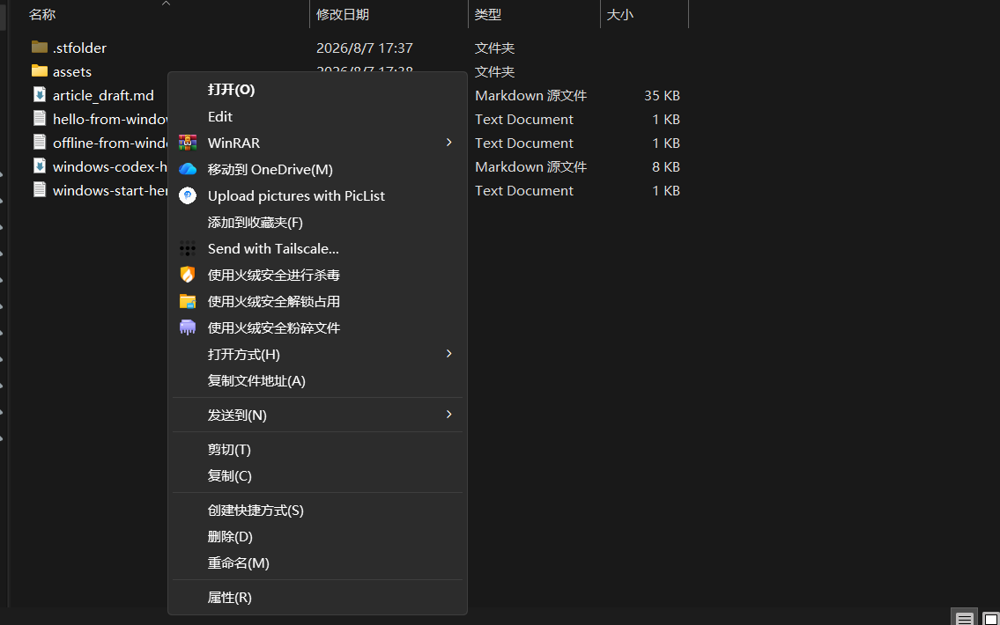

下面三处都对上，这一章就完成了：

1. 设备页面同时出现 Mac 和 Windows；

1. 双方运行 tailscale ping 都看到 pong from；

1. 接收端“下载”文件夹里出现刚发送的文件。

这说明两台设备已经互联。但如果你在 Mac 上修改刚收到的文件，Windows 上的原文件不会跟着变化——这不是故障，Taildrop 本来就只负责“发送”。

后面如果想用手机访问家中网页或选择出口节点，再从 [Tailscale 下载页](https://tailscale.com/download) 安装 iPhone 或 Android 客户端，并使用同一个账号登录。回到 Machines 页面看到手机名称，就说明它也加入了这张私人设备网。手机不参与当前的 Mac + Windows 同步主线，可以稍后再装。

# 3\. 发文件、看文件、同步文件，原来是三回事

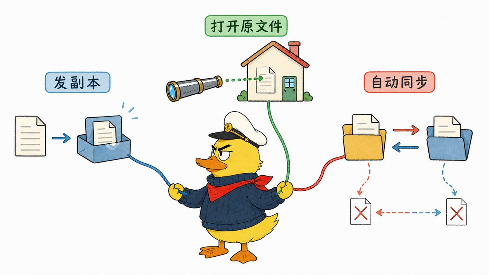

先不要记工具名。文件在多台设备之间使用，实际只有三种情况。

第一种，送过去一份副本。例如把 Mac 上的安装包发到 Windows。文件发完以后，两边各有一份；你再修改 Mac 上的原文件，Windows 收到的那份不会变化。这和在微信里发一个文件很像。

第二种，文件仍放在家里的电脑上，你在外面直接打开它。例如视频素材一直存放在家里的大硬盘里，Mac 只是隔着网络去读取。这样不用在两台设备各存一份，但家里的电脑一旦关机或断网，文件就打不开。

第三种，让两个文件夹自动保持一致。Mac 新建或修改文件，Windows 过一会儿自动收到；Windows 的修改也会传回 Mac。这样最接近大家口中的“多设备同步”，但删除和损坏也可能一起传过去，所以它仍然不能代替备份。

先分清这三个结果，再看对应的工具。

## 临时发送：用 Taildrop

截图、安装包、临时文档和一段视频，只想送过去一次，就用上一章已经操作过的 Taildrop。它是 Tailscale 内置的发送功能，不需要建立共享文件夹。

Taildrop 主要服务于同一个用户自己的设备。本文只处理自己的 Mac、Windows 和手机，不展开多人共享与权限管理。

## 文件留在家里：使用文件共享

如果你想让 Mac 随时打开 Windows 或家中存储设备里的大文件，可以在存文件的设备上开启“文件共享”，再通过 Tailscale 访问它。文件仍主要放在家里，适合大体积素材、照片库等不方便复制到每台电脑的内容。

Windows、macOS 和许多家用存储设备普遍支持一种名为 SMB 的文件共享方式。SMB 只是系统之间打开共享文件夹时使用的通信方法，不是另一款需要购买的软件。使用时，先在存文件的电脑上开启共享，再在另一台电脑中输入它的 Tailscale 设备名或 100. 地址。

例如 Windows 已经共享了 Tailscale-Share-Test 文件夹，Mac 可以在 Finder 中选择 前往 → 连接服务器，输入 smb://home-windows/Tailscale-Share-Test，再用 Windows 的账号和密码登录。看到文件夹，就说明你打开的是家里的原文件。这里先把三种方式分清，不展开完整的 Windows 共享权限配置；主线继续处理自动同步。

这种方式的限制很直观：存文件的设备关机、休眠或断网，文件就打不开；网络较慢时，直接编辑大型工程文件也可能卡顿。第一次使用时，先用系统已经支持的 SMB，不要再增加其他实验功能。

## 持续同步：交给 Syncthing

如果你要的是“Mac 改完，Windows 自动出现；Windows 新建文件，Mac 也能收到”，就需要一款专门盯着文件夹变化、再把变化复制到另一台电脑的软件。本文选用免费开源的 Syncthing。

Syncthing 安装在两台电脑上，只监看你指定的文件夹。Tailscale 负责让两台电脑在不同网络中互相找到，Syncthing 负责把新增、修改和删除复制过去。下一章把两个工具接起来。

如果只是偶尔发一个文件，停在 Taildrop；想读取家里唯一的一份文件，用文件共享；想让两个文件夹自动一致，继续下一章。

# 4\. 真正的自动同步，需要另一块拼图

现在用 Syncthing 盯住一个文件夹。里面出现新增、修改或删除时，它会把同样的变化传给另一台电脑。

先只让一个测试文件夹在 Mac 和 Windows 之间保持一致。不要上来就选桌面、整个“文档”目录或照片总库；新建一个可以随时删除的测试文件夹，配错了也不会伤到重要资料。

## 第一步：安装 Syncthing

打开 [Syncthing 官方下载页](https://syncthing.net/downloads/) 后，先看最上方的 Integrations，不要直接钻进下面一长串处理器版本。Mac 选择 syncthing-macos，Windows 选择 Syncthing Windows Setup。它们是 Syncthing 官网列给新用户的图形化安装包；安装后会有托盘或菜单栏图标，比只提供命令窗口的 Base Syncthing 更适合第一次使用。

在两台电脑分别安装并启动后，Syncthing 通常会自动在浏览器打开本机管理页面：

\`\`\`text
http://127.0.0.1:8384
\`\`\`

这个地址只在当前电脑上打开，用来管理当前电脑里的 Syncthing。第一次进入时，页面可能会提醒你设置管理用户名和密码。如果管理页面只绑定在 127.0.0.1，而且电脑只有自己使用，可以暂时不设；如果电脑多人共用，或者以后准备从其他设备打开这个管理页面，就先把密码设好。

## 第二步：让两台 Syncthing 认识彼此

每套 Syncthing 都有一串很长的设备 ID，可以把它理解成这套同步软件的身份证号码。在 Mac 的 Syncthing 页面点击 Actions → Show ID，复制这串号码。到 Windows 的 Syncthing 页面选择 Add Remote Device，粘贴 Mac 的设备 ID，并把设备名写成 noah-mac。

然后反过来，把 Windows 的设备 ID 添加到 Mac。两边都接受后，它们才会同意和对方同步。Tailscale 负责找到电脑，设备 ID 负责确认“我要和这套 Syncthing 同步”。

## 第三步：让同步流量只走 Tailscale 地址

现在还要告诉 Syncthing：以后通过 Tailscale 去找另一台电脑。编辑 Mac 页面中的 Windows 远程设备，找到地址栏。dynamic 表示让 Syncthing 自己寻找对方；这里把它换成 Windows 的 Tailscale 设备名或 100. 地址：

\`\`\`text
tcp://home-windows:22000
\`\`\`

或：

\`\`\`text
tcp://100.x.x.x:22000
\`\`\`

Windows 端同理，填写 Mac 的名称：

\`\`\`text
tcp://noah-mac:22000
\`\`\`

tcp:// 和末尾的 :22000 是 Syncthing 要求的固定写法，中间的 home-windows 才是你自己的设备名。保存后，远程设备状态应从 Disconnected（未连接）变成 Connected（已连接）。若设备名连不上，先换成 100. 地址；数字地址能连、设备名不能连时，再回第二章检查 MagicDNS。

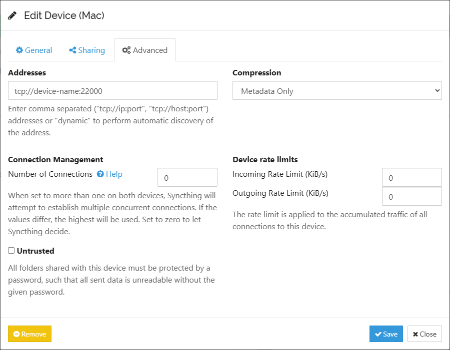

只安装两款软件然后等待它们自动找到彼此，并不总是可靠。手动填入 Tailscale 里的设备名，反而能明确告诉 Syncthing 应该去哪里连接。

## 第四步：只共享一个测试文件夹

在 Mac 新建一个文件夹，例如：

\`\`\`text
\~/Tailscale-Sync-Test
\`\`\`

回到 Syncthing 点击 Add Folder，选择这个目录，并把它共享给 Windows。Windows 会出现共享邀请，接受后选择一个本地目录，例如：

\`\`\`text
C:\\Users\\你的用户名\\Tailscale-Sync-Test
\`\`\`

两端文件夹类型先都使用默认的 Send & Receive，中文意思是“可以发送，也可以接收”。两边创建、修改和删除文件，变化都会传到另一边。

在 Mac 文件夹里新建 hello-from-mac.txt，等待 Windows 出现；再从 Windows 新建 hello-from-windows.txt，确认 Mac 收到。然后让一台设备离线，新增一个文件，再重新上线，观察它是否补同步。

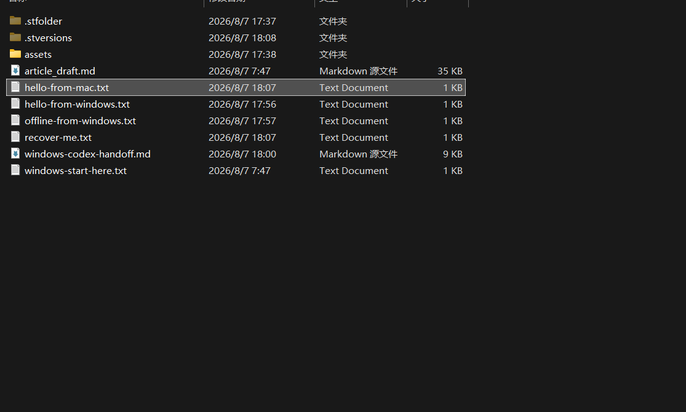

## 第五步：先给误删留一条退路

Syncthing 默认不等于备份。你在 Mac 删除文件，删除动作也可能同步到 Windows；勒索软件加密文件，密文同样可能被同步过去。

至少在接收端为这个文件夹启用 File Versioning，也就是“保留文件的旧版本”。在 Syncthing 首页展开目标文件夹，点击 Edit → File Versioning，选择 Simple File Versioning。它会在文件被另一台设备替换或删除前保留旧副本。把 Keep Versions 设为一个明确数量，例如 5，表示最多保留 5 个旧版本。更复杂的 Staggered Versioning 暂时不用碰。

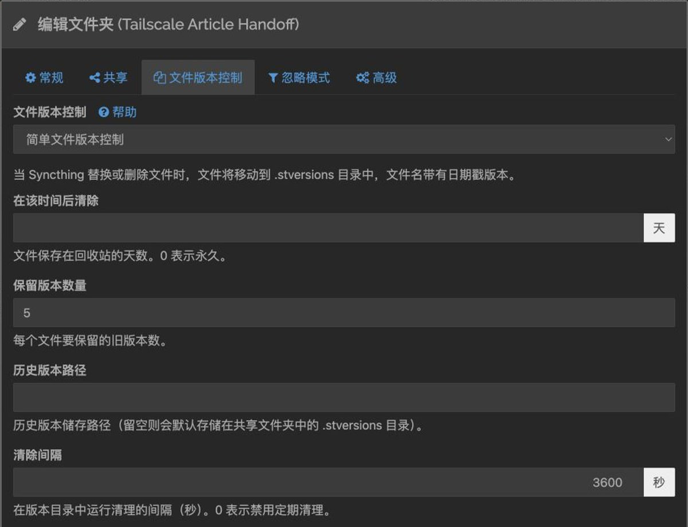

选择“简单文件版本控制”，把保留版本数量设为 5；历史版本路径留空时，旧版本默认进入 .stversions。

但版本控制也有边界：它主要保存“由另一台设备传来的替换或删除”之前的旧版本，不能替代一份与同步系统隔离的独立备份。真正重要的照片、合同和项目文件，仍要保留离线硬盘或不可被同步任务直接覆盖的备份。

不要只开启开关，还要做一次恢复演习：

1. 在 Mac 创建 recover-me.txt，等它同步到 Windows；

1. 从 Mac 删除它，确认删除也传播到 Windows；

1. 在 Windows 的同步目录中显示隐藏文件，打开 .stversions；这是 Syncthing 存放旧版本的文件夹；

1. 先暂停这个 Syncthing 文件夹，把旧版本复制到同步目录之外的临时恢复目录；

1. 确认内容正确后，再把它放回同步文件夹并恢复同步。

只有找回这个文件，才算完成“误删可恢复”。如果 .stversions 中没有它，先检查版本控制是否开在接收这次删除动作的那台设备上。

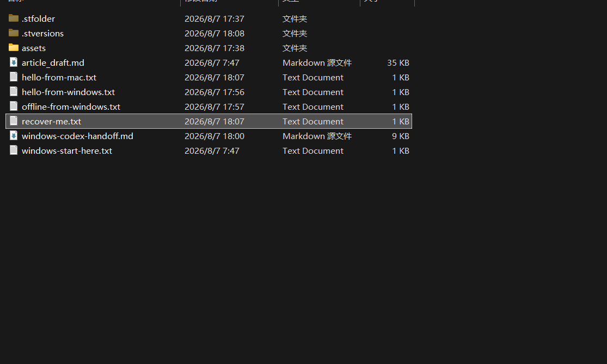

等双向同步稳定后，你才可能需要两种单向模式：Receive Only 表示这台设备只接收，Send Only 表示这台设备只发送。第一次配置不要使用它们，因为点错 “Override Changes” 或 “Revert Local Changes” 会用一端的文件状态强制覆盖另一端。

两端显示 Up to Date，新增和修改能双向出现，离线重连后能补齐，误删后也知道去哪里找历史版本，这条同步主线才算跑通。

## 跑通以后，平时只需要这样用

配置只做一次。以后确认两端的 Tailscale 和 Syncthing 都随系统启动，就不用每天打开管理页面。需要长期保持一致的文件，放进专门的同步文件夹；只想临时发一次的文件，继续用 Taildrop。

正式使用时，建议重新建一个名字清楚的目录，例如“跨设备同步”，不要把整个桌面、文档目录或照片库一股脑放进去。某台设备暂时离线没有关系，重新上线后 Syncthing 会补同步；设备关机期间，另一台当然收不到新变化。

平时最容易出事的是删除也会同步。误删后先到另一台设备的 .stversions 找旧版本；重要资料仍要另存一份不参与同步的备份。

---

同步主线到这里结束。 后面的章节不是必须连续操作，而是同一张 Tailscale 私人网络的可选玩法：

- 想操作另一台电脑，看第五章；

- 想在手机上打开家里的本地 AI 或网页，看第六章；

- 想访问不能安装 Tailscale 的打印机和摄像头，看第七章；

- 想让外出的设备从家里上网，看第八章。

没有对应需求，直接跳过。

# 5\. 设备已经连上，怎样真正控制另一台电脑？

如果你只想让文件自动同步，停在上一章就够了。只有需要打开另一台电脑上的软件、处理只能在那台电脑上完成的任务时，才需要远程控制。

远程控制就是在眼前这台电脑上看见另一台电脑的桌面，并用自己的鼠标和键盘操作它。Tailscale 不负责传输画面、鼠标和键盘，这部分由 Windows 远程桌面、macOS 屏幕共享或 RustDesk 完成。如果你只用 RustDesk，并且已经满意它自带的联网方式，Tailscale 不是必需品。这里搭配 Tailscale，是为了继续使用第二章建立的私人设备名和 100. 地址。

先看你要控制哪台电脑，再选工具，不需要同时研究所有方案：

\| 你要控制谁 \| 默认方案 \|
\| --- \| --- \|
\| Mac 控制 Windows Pro、Enterprise 或 Education \| Windows 远程桌面（RDP） \|
\| Mac 控制 Windows Home \| RustDesk \|
\| Windows 控制 Mac \| RustDesk \|
\| Mac 控制另一台 Mac \| macOS 屏幕共享 \|

表里更换的是远控工具，Tailscale 始终只负责连通。

无论控制哪台电脑，目标电脑都必须开机、联网，而且 Tailscale 与远控功能都在运行。电脑彻底断电或进入断网的深度睡眠后，Tailscale 也联系不到它。

## Mac 控制 Windows 专业版：使用系统远程桌面

先在 Windows 打开：

\`\`\`text
设置 → 系统 → 远程桌面
\`\`\`

启用“远程桌面”并确认。这里有一个硬限制：Windows Professional、Enterprise、Education 和 Server 可以作为 RDP 被控端；Windows Home 不能。控制端则不受这个版本限制。

为了让 Windows 重启后，即使还没人登录，也能自动启动 Tailscale，在系统托盘右键 Tailscale：

\`\`\`text
Preferences → Run Unattended
\`\`\`

在 Mac 上安装微软的 Windows App。新增一台电脑时，把 PC name 填成第二章设置的 Windows 设备名，例如 home-windows；若名称失败，再填它的 100. 地址。首次连接会要求输入被控 Windows 上的账号和密码。

判断成功不是“应用里出现了一张卡片”，而是你能看到 Windows 桌面、打开一个窗口，并在断开后重新连接。确认可用后，再测试一次 Windows 重启，避免真正出门时才发现必须有人现场登录。

## Windows Home 或跨平台控制：使用 RustDesk

如果被控电脑是 Windows Home，或者要从 Windows 控制 Mac，使用 [RustDesk](https://rustdesk.com/)。两端安装后，在被控电脑打开 Settings → Security → Security → Enable direct IP access。它的意思是不通过 RustDesk 的设备编号，而是直接使用这台电脑的网络地址连接。

回到控制端 RustDesk，在连接框中填写被控电脑的 Tailscale 100. 地址。第一次控制 Mac 时，macOS 还会要求给 RustDesk“屏幕录制”和“辅助功能”权限：前者允许它传出桌面画面，后者允许远端鼠标和键盘操作。RustDesk 的访问密码和权限确认仍要保留。

## Mac 控制 Mac：使用系统屏幕共享

在被控 Mac 打开：

\`\`\`text
系统设置 → 通用 → 共享 → 屏幕共享
\`\`\`

如果“远程管理”已经开启，需要先关闭它，因为 macOS 不允许屏幕共享与远程管理同时启用。打开屏幕共享后，在“允许访问”中选择仅这些用户，只加入确实需要远控的本地账号，不要直接开放给所有用户。

在另一台 Mac 打开“屏幕共享”应用，点击新建连接，输入被控 Mac 的 Tailscale 设备名或 100. 地址，再用被控 Mac 自己的账号和密码登录。成功后，你应该能看到并控制远端桌面。

如果控制端是 Windows，默认让两端使用 RustDesk。无论选哪种方式，都只填写 Tailscale 里的设备名或 100. 地址，不要为了远控去改家里路由器的开放设置。

## 出门前，必须做一次“无人值守演习”

把控制端切换到手机热点，让它不再和目标电脑处于同一个 Wi-Fi，然后依次测试：

1. tailscale ping 仍能到达目标电脑；

1. 远程桌面能够建立连接；

1. 锁屏后仍能重新进入；

1. 重启后是否还会自动上线；

1. 目标电脑休眠后还能否唤醒。

Windows 的 Run Unattended 可以让 Tailscale 在登录桌面前运行；普通 macOS 图形版目前做不到完全相同的效果。若家中的 Mac 必须长期无人照看，就要亲自测试重启后是否仍能连接，不能只测一次就出门。

有些电脑支持 Wake-on-LAN，也就是收到一条特殊网络消息后开机。但这条消息通常必须由家里同一网络中的另一台常开设备发出，例如路由器、家用存储设备或小主机。Tailscale 本身没有一个可以凭空开机的按钮；家里没有常开设备时，彻底关机后的电脑通常仍需要人到现场。

# 6\. 只给自己开放本地 AI 和家庭服务

如果家里没有正在运行的本地 AI、影音库、智能家居后台或个人网页，这一章可以直接跳过。这里的目标很明确：让自己的手机和电脑访问家中网页，但不把网页公开给整个互联网。

以 Open WebUI 为例。它是一个在浏览器里和本地 AI 对话的网页界面。假设它已经运行在家里的 Windows 或服务器上，地址是：

\`\`\`text
http://127.0.0.1:3000
\`\`\`

127.0.0.1 代表“当前这台电脑自己”，所以这个地址只能在运行 Open WebUI 的电脑上打开。末尾的 3000 是这个网页服务使用的入口编号，网络里把这种编号叫作端口。

Tailscale Serve 可以为这个本机网页增加一个只在私人设备网中可访问的地址。这样，你自己的手机能打开它，普通互联网用户却看不到。不要为了让手机访问，直接去路由器里把 3000 端口公开出去。

先把 Tailscale 客户端更新到最新版，然后在运行服务的设备上执行：

\`\`\`bash
tailscale serve 3000
\`\`\`

如果私人设备网尚未启用 HTTPS，命令会给出一个授权页面，引导你开启。HTTPS 表示浏览器和网页之间的内容会加密传输。成功后，终端会显示一个类似下面的地址：

\`\`\`text
https://你的设备名.你的-tailnet.ts.net
\`\`\`

用已经登录同一 Tailscale 账号的手机或 Mac 打开它。能看到 Open WebUI 页面，说明 Serve 已经把手机的访问请求送到了家中电脑上的 Open WebUI。按 Ctrl+C 可以立即停止这次共享。

同样的方法也能用于影音库 Jellyfin、智能家居后台 Home Assistant，以及自己开发的网页。无论入口是否只对私人设备开放，程序本身的账号和密码仍应保留。

Serve 和另一个名为 Funnel 的功能很容易看混：

- Serve 只让你的私人设备网访问；

- Funnel 会让互联网上的任何人都有机会访问。

这一章只使用 Serve。如果命令或后台明确出现 Funnel，先停下来确认自己是否真的需要公开服务。记住一句：Serve 是只给自己人开的门，Funnel 是面向整个互联网的大门。

# 7\. 把 NAS、打印机和摄像头也接进来

NAS 是专门放在家里存文件的小型设备，可以把它理解成一块长期联网的共享硬盘。有些 NAS 能直接安装 Tailscale，打印机、老摄像头和许多家电却不能。

设备不能安装 Tailscale 时，需要家里另一台能够安装 Tailscale、并且长期在线的设备替它“带路”。Tailscale 把这位带路人叫作子网路由器。它不一定是你家真正的路由器，也可以是一台 NAS、Linux 小主机、树莓派或支持这项功能的 Apple TV。

外面的 Mac 先找到这台带路设备，再由它访问打印机或摄像头。你平时在家看到的 192.168. 开头地址，只能在家庭网络内部使用；子网路由器的作用，就是让你在外面也能走到这些地址。

选择顺序很简单：设备能安装 Tailscale，就直接安装；不能安装，才找一台常开设备替它带路。

## 先判断是否真的需要子网路由

如果 NAS 本身支持安装 Tailscale，优先直接安装。只有不能安装客户端的设备，才需要子网路由器代为连接。

只有以下情况才值得建立子网路由：

- 目标设备不能安装 Tailscale；

- 你确实需要访问一组家庭局域网设备；

- 家里有 NAS、Linux 小主机、树莓派、支持该功能的路由器或 Apple TV 等常开节点。

## 以一台常开的 Linux 小主机为例

下面的操作比前几章更接近网络管理。如果你从未使用过 Linux 命令，可以先停在这里，等确实需要访问打印机或摄像头时再做。

第一步是确认家里的设备地址属于哪一段。在 Linux 设备上运行：

\`\`\`bash
ip route
\`\`\`

找到和家中设备使用同一组 192.168. 地址、并且含有 src 的那一行。src 后面的数字是这台 Linux 小主机自己的家庭地址。例如：

\`\`\`text
192.168.31.0/24 dev eth0 proto kernel scope link src 192.168.31.10
\`\`\`

示例中的 192.168.31.0/24 代表一整组以 192.168.31. 开头的家庭设备地址，网络里把这一组地址叫作“网段”。不要照抄示例，也不要只看打印机地址就猜。输出看不懂时，到路由器后台查找“LAN 地址”或“局域网地址范围”；仍无法确认就先停止，不要继续执行下面的命令。

下一步允许这台 Linux 设备替其他设备转送网络请求。这项能力叫 IPv4 转发。以常见 Linux 发行版为例：

\`\`\`bash
echo 'net.ipv4.ip\_forward = 1' \| sudo tee /etc/sysctl.d/99-tailscale.conf
sudo sysctl -p /etc/sysctl.d/99-tailscale.conf
\`\`\`

看到 net.ipv4.ip\_forward = 1，说明系统已经允许转送。然后把刚才确认的家庭网段告诉 Tailscale；下面示例仍需换成你自己的地址：

\`\`\`bash
sudo tailscale set --advertise-routes=192.168.31.0/24
\`\`\`

进入 Machines 设备页面，找到这台 Linux 小主机，打开设备菜单中的 Edit route settings，勾选并批准刚才填写的地址范围。这一步相当于确认：“允许这台设备带我进入这段家庭网络。”如果你以前改过 Tailscale 的访问权限，还要确认自己的账号没有被挡在外面。

Windows 和 macOS 通常会自动使用这条已批准的家庭网络入口；作为访问端的 Linux 设备，可能还要在自己的 Tailscale 设置中选择接受它。完成后，人在外面的 Mac 应该能直接打开打印机或摄像头原来的家庭地址，例如：

\`\`\`text
http://192.168.31.45
\`\`\`

把 Mac 切到手机热点后再测一次，避免它其实仍在家中 Wi-Fi 里直连设备。能在热点下打开目标设备，才证明子网路由生效。若能 ping 通网关，却打不开目标设备，先在家中局域网验证这个地址本来就能访问，再检查目标设备自身防火墙是否只允许特定来源。

要撤销时，回到同一设备的 Edit route settings，取消批准该网段。其他设备会立即停止使用这条入口；Linux 上的服务和家庭设备配置都不用删除。

还有一种少见情况：酒店 Wi-Fi 和家里恰好都使用同一组 192.168.1. 地址。电脑可能分不清你要访问眼前的酒店设备，还是家里的设备。反复重连通常无效；这时需要有网络经验的人调整家庭地址范围，普通读者不必在第一次配置时预先处理。

# 8\. 出门以后，从家里的网络上网

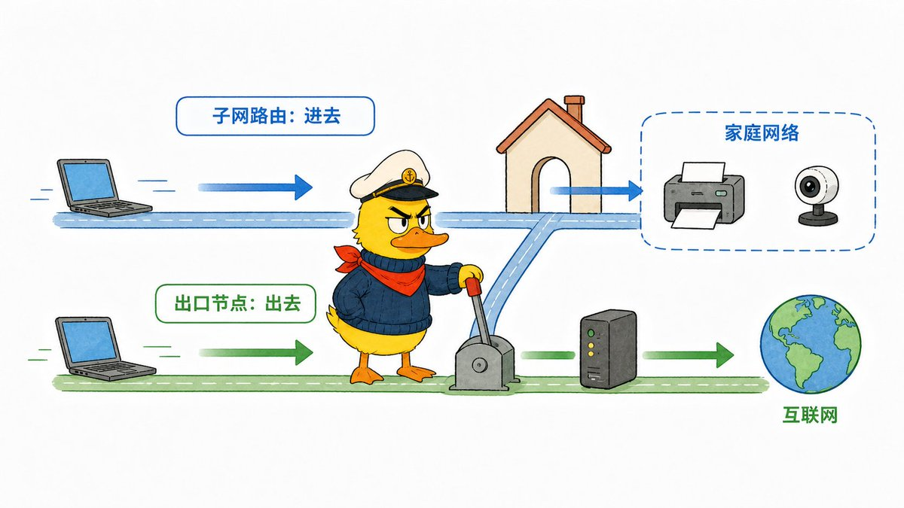

上一章是让你在外面进入家里的内部网络。这一章换一个方向：不再访问家中的某台设备，而是让另一台设备替你访问普通网站。

先看三条路线：

\`\`\`text
普通上网：Mac → 网站
家庭出口：Mac → 家里的电脑 → 网站
VPS 出口：Mac → 租来的远程电脑 → 网站
\`\`\`

后两条路线中，真正连接互联网的最后一台设备，就叫作出口节点。网站通常能看到访问者来自哪个网络，这个对外可见的网络地址叫作公网 IP。选择家里的电脑作为出口，网站看到的就是家里的公网 IP；选择一台远程服务器，网站看到的就是那台服务器的公网 IP。

如果你只想打开家里的文件、打印机或本地网页，就不需要出口节点：子网路由让你进入家里，出口节点替你从另一个地方上网。

## 家里的设备和 VPS，有什么区别？

VPS 就是一台按月租用、长期放在数据中心运行的远程电脑。它有自己的网络线路和公网 IP，也能像普通电脑一样安装 Tailscale。

家里的电脑和 VPS 都能成为出口节点，但用途不一样：

\| 你想得到什么 \| 选择什么出口 \|
\| --- \| --- \|
\| 出门后仍使用家里的公网 IP \| 家中常开的 Mac、Windows、NAS 或小主机 \|
\| 在公共 Wi-Fi 上先连接回自己的家庭网络，再访问网站 \| 家中常开的设备 \|
\| 让多台设备对外都使用同一个固定 IP \| 拥有固定公网 IP 的 VPS \|
\| 只想连接、同步或远控自己的 Mac 与 Windows \| 不需要出口节点，也不需要 VPS \|

一个海外公开案例中，有人把两台便宜的 VPS 放在不同国家。外出使用公共网络时，他可以直接选择从哪台服务器上网；切换 VPS，网站看到的出口位置和公网 IP 也会随之改变。

另一个公开案例解决的是完全不同的问题：工作服务器只允许提前登记的固定 IP 访问。使用者把一台带固定 IP 的 VPS 设成出口节点，此后无论使用哪台电脑、身处哪个网络，都可以先经过这台 VPS，再以同一个固定 IP 访问工作服务器。

这两个案例背后的方法相同：VPS 提供公网 IP 和实际线路，Tailscale 负责让自己的设备安全地连接到它。

## 把家里的 Mac 或 Windows 设为出口

先选择一台能够保持开机和联网的设备。在这台设备上打开 Tailscale 菜单，进入 Exit Node，选择 Run Exit Node。这一步是在告诉 Tailscale：“这台电脑愿意替其他设备上网。”

然后进入 Machines 管理页面，找到这台设备，打开最右侧的 …，进入 Edit route settings，勾选 Use as exit node 并保存。看到设备旁出现 Exit Node 标记，说明它已经可以被选择。

回到需要使用出口的 Mac、Windows 或手机，打开 Tailscale 的 Exit Nodes，选择刚才那台设备。访问一个能够显示公网 IP 的网站；如果看到的是出口设备所在网络的 IP，说明流量已经从那里出去。

准备把它留在家中长期使用时，再把控制端切换到手机热点，锁屏或重启出口设备后重新测试一次。Windows 还应打开前文介绍过的 Run Unattended。热点下仍能选择这台出口并正常打开网站，才证明它离开家庭 Wi-Fi 后依然可用。

要停止使用，回到 Exit Nodes 选择 None。出口设备仍留在列表中，但这台电脑或手机会立即恢复从眼前的网络上网。

## 已经有 VPS，也可以这样接入

如果你已经拥有一台 Linux VPS，先通过 SSH 进入服务器，安装并启动 Tailscale：

\`\`\`bash
curl -fsSL https://tailscale.com/install.sh \| sh
sudo tailscale up
\`\`\`

第二条命令会显示一个登录地址。在浏览器中打开它，登录前文使用的同一个账号，再回到 Machines 页面确认 VPS 已经出现。接着允许这台服务器替其他设备转送上网请求：

\`\`\`bash
echo 'net.ipv4.ip\_forward = 1' \| sudo tee -a /etc/sysctl.d/99-tailscale.conf
echo 'net.ipv6.conf.all.forwarding = 1' \| sudo tee -a /etc/sysctl.d/99-tailscale.conf
sudo sysctl -p /etc/sysctl.d/99-tailscale.conf
sudo tailscale set --advertise-exit-node
\`\`\`

运行完成后，仍然进入 Machines 页面批准 Use as exit node。随后在自己的 Mac、Windows 或手机中选择这台 VPS，检查公网 IP 是否变成 VPS 的地址。地址发生变化，这台 VPS 才真正成为可用的 Tailscale 出口。

---

遇到连接失败或速度慢，再读最后一章；这里不增加新玩法。

# 9\. 显示在线，为什么还是连不上或很慢？

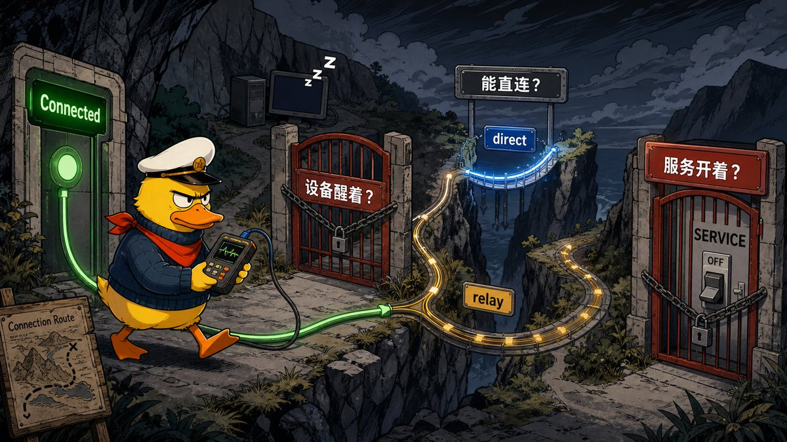

Tailscale 图标显示 Connected，只能证明当前设备已经成功登录 Tailscale。它不代表另一台电脑没有休眠，也不代表两台设备之间的速度足够快，更不代表你要打开的远程桌面或网页正在运行。

先不要重装。按三个问题逐层检查：目标电脑醒着吗？两台电脑能互相找到吗？你要用的程序开着吗？

## 第一步：目标设备真的在线吗？

运行：

\`\`\`bash
tailscale status
\`\`\`

确认目标设备出现在列表里，并留意它是否显示离线。如果设备关机、休眠、断网或 Tailscale 已退出，先恢复设备本身。电脑都没有上线时，修改其他网络设置不会有用。

Windows 若总在重启后离线，检查 Run Unattended。Mac 若重启后无人登录就消失，要接受普通图形版的运行边界，或重新设计常开节点，而不是把它误判成网络故障。

## 第二步：两台设备能互相找到吗？

运行：

\`\`\`bash
tailscale ping 目标设备名
\`\`\`

命令成功后，结果中还会显示这次连接是怎么走的：

- direct：两台设备直接通信，通常最快；

- peer relay：两台设备无法直接通信，并且你已经专门配置了可供双方使用的中转设备，流量就由它转送；

- DERP：先经过 Tailscale 提供的中转服务器再到达对方，通常能连上，但传大文件和远控可能更慢。

看到 DERP 不代表失败，只代表这次没有直接走到对方。偶尔传小文件通常没关系；经常传大文件、播放高码率视频或远控时，速度差异才会明显。

这里的 peer relay 和 DERP，是两台 Tailscale 设备无法直接通信时使用的中转路径；上一章的出口节点，则是你主动选择让普通上网流量从另一台设备出去。它们看起来都经过了中间设备，解决的却不是同一个问题。中转路径不会自动改变网站看到的公网 IP，出口节点才会。

如果能连但很慢，再运行：

\`\`\`bash
tailscale netcheck
\`\`\`

这条命令会列出更详细的网络检查结果。UDP 是网络传输数据的一种方式，Tailscale 通常依靠它建立更直接的连接；如果公司网络、路由器或安全软件阻止 UDP，就更容易改走中转。先换成手机热点再测试一次：热点下变成 direct，说明问题更可能出在原来的网络环境。

## 第三步：要用的程序开着吗？

若 tailscale ping 成功，但远程桌面、共享文件夹或网页打不开，说明两台电脑已经能互相找到，问题更可能出在具体程序上。继续检查：

- 远控或文件共享功能有没有启用；

- 这个程序使用的端口是否被目标电脑防火墙阻止；

- 网页是不是只允许当前电脑自己访问，却没有通过 Serve 提供给其他设备；

- 你填写的是目标设备的 Tailscale 地址，还是误填了只在家里可用的局域网地址；

- Tailscale 的访问权限是否允许当前账号访问这台设备。

这时不要通过关闭整个防火墙来“验证”。应只为真正使用的远控、文件共享或网页功能放行，不要让其他入口一起失去保护。

## 其他 VPN 和代理为什么经常打架

商业 VPN、公司安装的安全软件和代理工具都会尝试接管电脑的网络流量，手机上还常常只能同时运行一套 VPN 连接，因此它们可能和 Tailscale 冲突。

先记录当前状态，暂时退出另一款网络软件，再测试 tailscale ping。如果恢复正常，再单独研究两者能否共存。不要同时修改 Tailscale、代理、防火墙和名称解析设置，否则即使恢复，也不知道是哪一步起了作用。

连接结果还取决于真实网络环境。别人能直连，不等于你家宽带、公司网络或跨境线路也能直连。本文能教你判断路径，但不能承诺所有地区、运营商和时段都有相同速度。

现在只做一个下一动作。如果还没有跑通主线，就拿手边两台设备从第二章开始：让设备列表同时出现它们，双向测试都看到 pong from，再把一个小文件送到另一端。设备不必恰好是 Mac 和 Windows；换成 Windows、Linux、手机、NAS 或服务器时，安装界面会不同，但加入同一账号、确认设备出现、测试能否找到彼此的逻辑不变。

如果已经完成自动同步，不需要为了“榨干”而把后面的功能全部打开。先说出眼下最具体的需求：操作另一台电脑、打开家里的网页、访问不能安装 Tailscale 的设备，还是借用另一处网络上网；然后只读对应的一章。没有这些需求，就停在第四章。真正启用一项进阶能力后，再用手机热点测试一次，确认它离开家庭 Wi-Fi 仍然可用。

我是诺鸭船长，带你在信息的海洋里寻找陆地～

---

出海基建系列[⬇️](https://abs.twimg.com/emoji/v2/svg/2b07.svg)其他系列移步个人主页

[Starryblu 全网最全使用指南：从入门到榨干](https://x.com/noahduck283/status/2072149900247380294?s=20)

[Stripe 全网最全使用指南：从入门到榨干](https://x.com/noahduck283/status/2070718724282458257?s=20)

[PayPal 全网最全使用指南：从注册到榨干](https://x.com/noahduck283/status/2067798972744507755?s=20)

[giffgaff 全网最全使用指南：从入门到榨干](https://x.com/noahduck283/status/2063773625535385827?s=20)

[美国紫卡PayGo 全网最全使用指南：从入坑到榨干](https://x.com/noahduck283/status/2064147050816831758?s=20)

[Wise 全网最全使用指南：从开户到榨干](https://x.com/noahduck283/status/2064860443454423341?s=20)

[Gmail 全网最全使用指南：从注册到榨干](https://x.com/noahduck283/status/2065224312039330181?s=20)

### 🖼️ Attached Media

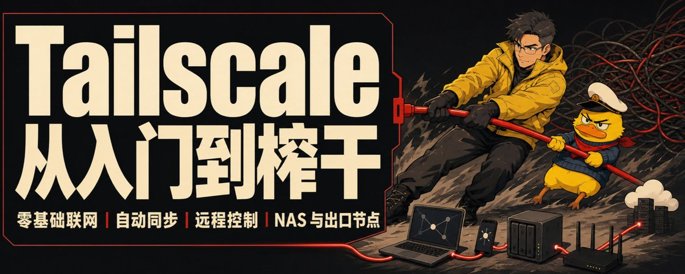

## 💬 Replies

### 1 @davinci_seven (达芬七Seven)

*Sun Aug 09 03:51:13 +0000 2026*

@noahduck283 太干货了，你咋昨天不发呢😭

### 2 @noahduck283 (诺鸭船长3) (Author)

*Sun Aug 09 04:20:23 +0000 2026*

@davinci\_seven 哈哈哈，本来昨天发，早上突发了个x新规

### 3 @isnail (蜗牛King 👑)

*Sun Aug 09 03:58:55 +0000 2026*

@noahduck283 我也想用啊，不过现在nas有点贵……

### 4 @noahduck283 (诺鸭船长3) (Author)

*Sun Aug 09 04:15:21 +0000 2026*

@isnail 这年头都在抢钱😭

### 5 @jiefuBTC (解夫🔶｜Crypto)

*Sun Aug 09 03:52:45 +0000 2026*

@noahduck283 这真的是全网最详细的逻辑了

### 6 @noahduck283 (诺鸭船长3) (Author)

*Sun Aug 09 05:50:54 +0000 2026*

@jiefuBTC 借花献佛嘿嘿

### 7 @cgnot996 (铁柱AGI)

*Sun Aug 09 04:38:23 +0000 2026*

@noahduck283 Tailscale 真乃神器啊，打算用它组个网，在公司也能访问家里的局域网

### 8 @noahduck283 (诺鸭船长3) (Author)

*Sun Aug 09 05:04:22 +0000 2026*

@cgnot996 感觉玩法太多了，还有待研究

### 9 @Yunn260414 (Yunn)

*Sun Aug 09 04:00:59 +0000 2026*

@noahduck283 有了这个东西，就不需要开网盘会员了，而且还可以把ai接进来进行一些操作，很详细的教程啊

### 10 @noahduck283 (诺鸭船长3) (Author)

*Sun Aug 09 04:14:35 +0000 2026*

@Yunn260414 这个折腾一下，后面还是很方便的

### 11 @qihang_zeng6688 (启航)

*Sun Aug 09 04:22:50 +0000 2026*

@noahduck283 很专业啊，狠狠收藏👍👍👍

### 12 @noahduck283 (诺鸭船长3) (Author)

*Sun Aug 09 06:08:35 +0000 2026*

@qihang\_zeng6688 谢谢航哥支持＾3＾

### 13 @HytidelLegend (Hytidel聊商业（文章更多干货）)

*Sun Aug 09 03:58:36 +0000 2026*

@noahduck283 Tailscale搭建私人设备网，让电脑手机NAS互通，传文件、自动同步、远控、访问本地AI服务全搞定，无需复杂路由器配置。

### 14 @noahduck283 (诺鸭船长3) (Author)

*Sun Aug 09 05:03:19 +0000 2026*

@HytidelLegend 神中神，夯中夯

### 15 @leaf_sanren (Leaf Yeah!)

*Sun Aug 09 03:56:56 +0000 2026*

我先收藏了。我这两天也在研究手机远程控制的事儿，还下载了 T3 Code。我看好多人讲，其实直接弄一个 Tailscale 和 SSH 就能搞定，根本不需要第三方工具。

看来确实如此，其实就是通过自己配置，把你和你的电脑都拉到一个局域网里面，哪怕你们可能相隔十几公里。

真的是太巧了，船长怎么正好你就写到这个话题呢？缘妙不可言。

### 16 @noahduck283 (诺鸭船长3) (Author)

*Sun Aug 09 04:12:07 +0000 2026*

@leaf\_sanren 我去，叶哥你这个评论也是信息量满满

### 17 @momoai_daily (momoai沫沫🫧)

*Sun Aug 09 04:03:29 +0000 2026*

@noahduck283 又触及到我的知识盲区了 船长涉猎好广

### 18 @noahduck283 (诺鸭船长3) (Author)

*Sun Aug 09 04:22:34 +0000 2026*

@momoai\_daily hh，ai时代，学啥都快

### 19 @cynicalmi (novi红猫)

*Tue Aug 25 02:21:39 +0000 2026*

@noahduck283 最主要要禁用 Tailscale DNS 要不然抢网

### 20 @MrYu_us (老愚Andy｜前金融人搞 AI)

*Mon Aug 24 13:43:05 +0000 2026*

@noahduck283 写得真挺好的！要能加入使用AI来控制Linux系统就更好了！😛

### 21 @james_chenerge (dgu)

*Thu Sep 03 07:02:24 +0000 2026*

@noahduck283 不同的 VPN 代理 打架, 最好的解决方法就是弄个软路由, 通过软路由进行翻墙

### 22 @deadseafu (大西瓜焚岚)

*Mon Aug 24 08:39:47 +0000 2026*

@noahduck283 太tm长了，都用上ai了干嘛不写简略点

### 23 @renjia188 (renjiaandy)

*Sun Aug 23 10:22:43 +0000 2026*

@noahduck283 收藏

