# 上帝之手Blender丨从入门到榨干

Astra 一出来，Blender 却成了最大的受益者，下载量激增，占满了时间线，它是什么？和普通人有关吗？我也没忍住，摸索了一下，跟着造了几样东西

这篇不打算一口气教会你 Blender。建模这行门槛不低，水也挺深，但 AI 把次元壁硬凿开了一条缝，外行也能借 Astra 的神力摸上一把，无法让你一夜变大神，但把原本锁在专业玩家手里的造物权，递到了普通人手上。

我想做的是，带你把软件装好、把 AI 接上，跟着做点东西出来，再看看别人都玩出了什么花样，打破点信息差，给你几分灵感，一次好奇心驱动的探索契机。

先玩起来，再琢磨哪些能搬进自己的创作和工作里。

# 目录

- 第一阶段：认识 Blender——装好软件，看懂基本界面
- 第二阶段：接入 AI——把配置交给 AI，连上就能开始
- 第三阶段：动手做作品——我的三个案例
- 第四阶段：打开思路——看看别人还做出了什么
# 第一阶段：认识 Blender——装好软件，看懂基本界面

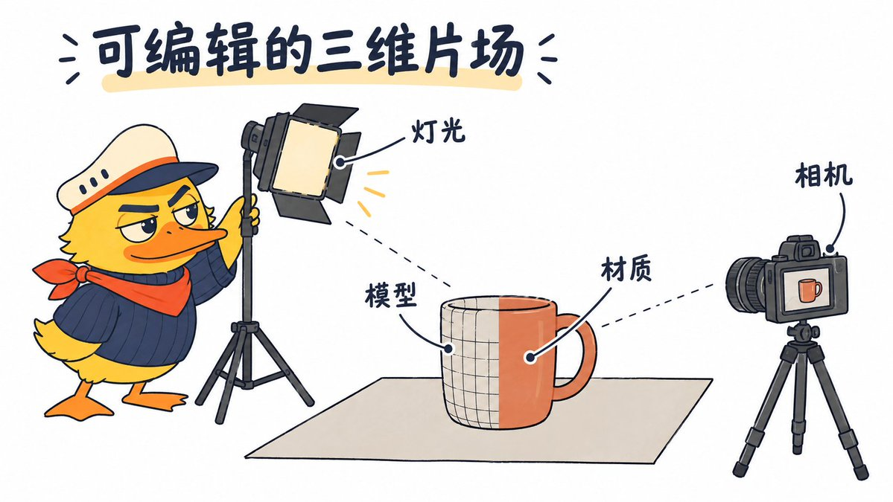

## 1. Blender 是什么，能拿来做什么

Blender 是免费、开源的 3D 创作软件，建模、材质、灯光、动画和渲染都能在里面完成。[官方介绍](https://www.blender.org/)

可以把它理解成一个虚拟摄影棚：模型是摆进去的物体，材质决定表面是什么样，灯光负责照明，相机决定拍到什么。按这些设置计算出最终图片，就叫“渲染”；让物体或相机随时间移动，就能制作动画。

它可以用来做产品展示图、角色和场景、空间预览、动画短片，也能为网页和游戏提供三维素材。

刚接触 3D，也可以用文字告诉 AI 想做什么，让它搭建、修改，自己看结果、提意见。工程里的物体、材质和机位会保留下来，下次还能换角度、改布置、出新图。

## 2. 安装、切中文，先认清四块界面

从 [Blender 官网](https://www.blender.org/download/) 下载与你的系统对应的版本。Mac 安装到“应用程序”，Windows 按安装程序完成安装即可。本文实测环境是 Mac 上的 Blender 5.2.1 LTS，后面的官方 MCP 插件 1.0.3 要求 Blender 5.1 或更新版本。

打开后，先切成中文：

Edit → Preferences → Interface → Language → Simplified Chinese（简体中文）。

如果菜单仍是英文，再勾选下方的 Interface（界面）翻译选项。中文界面不影响 AI 执行脚本，代码里的 bpy 等名称也不会变。

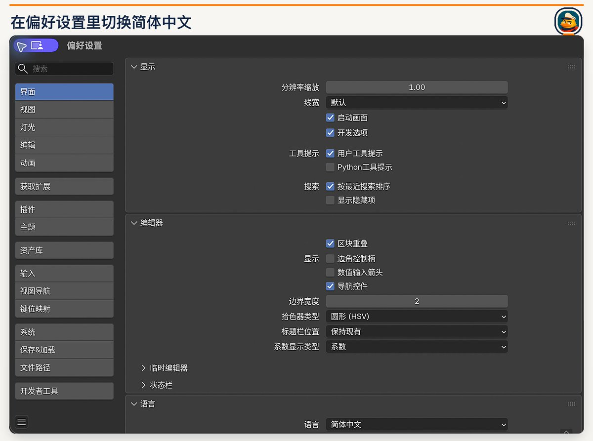

现在回到主窗口，先认四块。

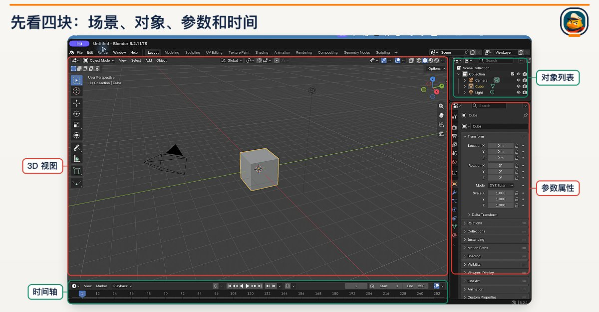

顶部的“布局、建模、着色、动画、渲染、脚本”是不同工作区，会按用途摆放面板。先留在“布局”就好；需要自己运行 AI 给的代码时，再去“脚本”。

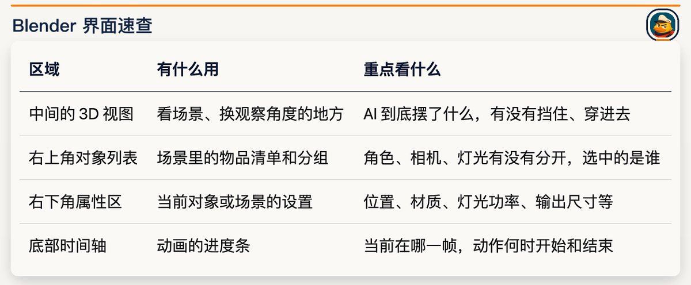

视图里的模型如果是灰色，先别急着让 AI 重做：它可能只是为了流畅而显示简化外观。看颜色和质感时切到“材质预览”，看最终出图则要看正式渲染。

# 第二阶段：接入 AI——把配置交给 AI，连上就能开始

## 3. 三种接入方式，怎么选

本文使用 Codex 中的 GPT-6 Astra。你向 Codex 描述需求，由它操作本机 Blender；不需要在 Blender 里寻找一个 GPT 聊天框。

三种方式的区别如下：

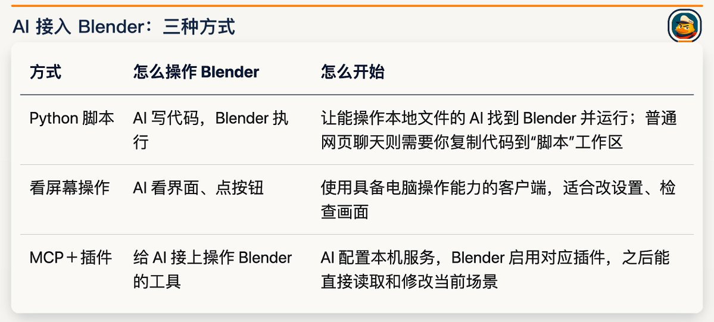

想先做东西，可以从脚本开始；经常要来回改正在打开的工程，再接 MCP。 看屏幕操作可以配合它们检查结果。三种方式不用全装，MCP 也不会自动提高作品的美术质量。

## 4. 让 AI 完成配置，确认已经连上

使用能操作本地文件的 Codex，可以直接说：

检查这台电脑的 Blender 安装位置，使用它的 Python 接口创建一个临时测试场景，保存并输出预览，验证你能调用它。不要覆盖我正在编辑的工程。

如果希望通过 MCP 接手当前界面，把 [Blender Lab 官方 MCP 项目](https://www.blender.org/lab/mcp-server/) 链接交给 Codex：

请按这个官方项目配置 Blender MCP 服务和匹配的插件，检查版本兼容性，保留已有配置和工程。连接只允许本机访问，不开放公网端口。配置后读取当前场景的对象和相机，告诉我实际读到了什么，以及下次打开 Blender 时如何启动连接。

本文实测的是 MCP 1.0.3。安装和配置交给 AI，自己核对两处：

- **Blender 里：**插件启用后，点击 Start MCP Bridge Server，看到 Server is running。本次地址为 127.0.0.1:9876，只连接本机。
- **Codex 里：**让它读出当前场景的对象、相机或文件名，与屏幕上实际打开的工程对应起来。
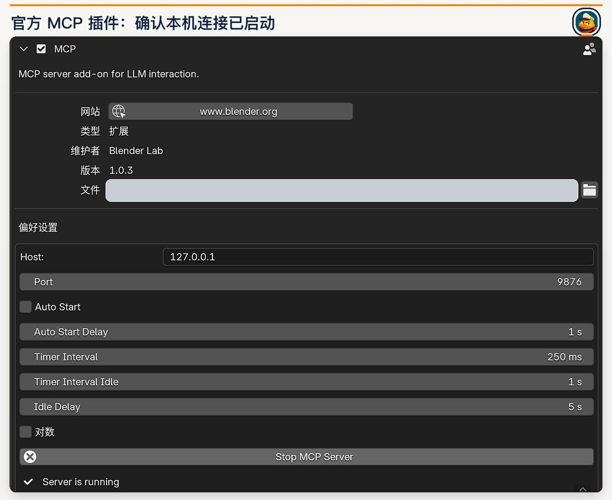

图中 Auto Start 没有勾选，下次打开 Blender 还要手动启动连接。遇到报错，把原文交给 AI 排查，不要关闭全部安全保护。

MCP 可以执行代码，只用可信项目，修改前另存副本；服务不向公网开放，不用时停止。

# 第三阶段：动手做作品——我的三个案例

## 5. 晚餐小游戏：让观众走进你的图片

我先做了一个鸭子版《最后的晚餐》，再把它变成一个可以打开网页玩的小游戏

悠纳的蛋糕不见了。你可以转动视角、点击角色问话、检查现场，决定相信谁。先看这段不剧透的预告。

[进入晚餐现场](https://sage-chebakia-2153e1.netlify.app/)

一切从这张参考图开始。

我把这张鸭子版《最后的晚餐》交给 Codex，让它在 Blender 里搭出餐厅：

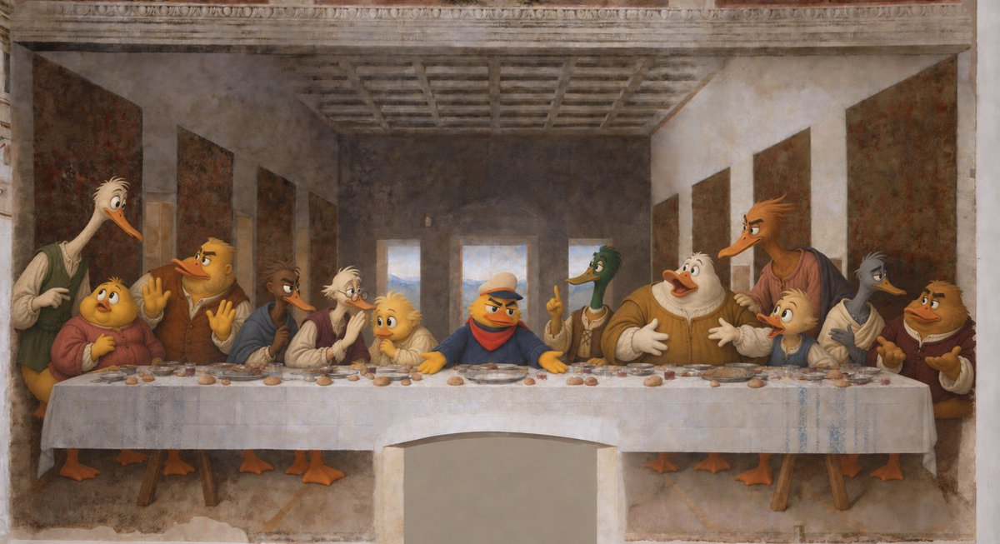

角色、餐桌、餐具分别保存，方便后续修改。中央主角用了已有的 Tripo 模型，其他角色做了简化重建；原图没画出的侧面和背面，需要补出来，无法准确还原。

换成自己的图片时，告诉 AI 要保留哪些角色和物品，先看预览里的比例、位置和遮挡，再继续加游戏。

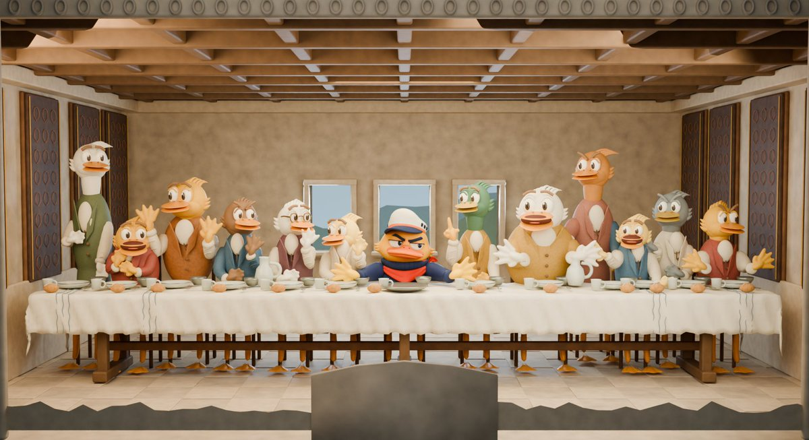

建完以后，能用提示词改什么？

有了可编辑的工程，就能反复换造型、改布置、调灯光、拍动画。把工程和参考图交给 AI，描述想看到的结果即可。

上面是可尝试的用法，未逐项实测。先让 AI 在副本上修改、给预览，再决定是否出正式文件。

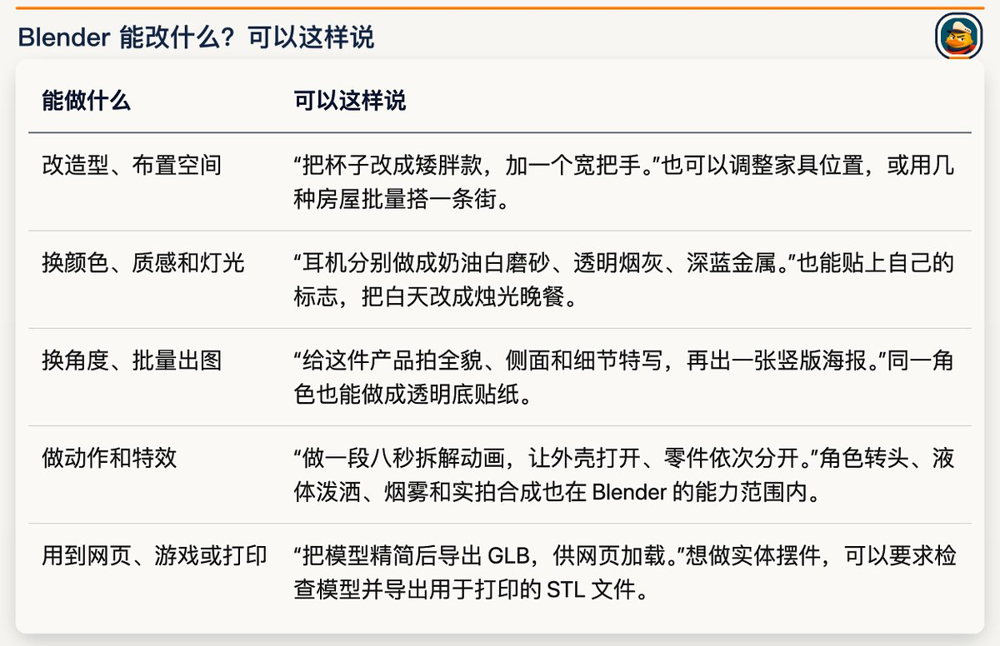

能改到什么程度，取决于模型本身。 这桌鸭子可以换座位、换照明，但想自然跳舞，还得先加上控制身体的“骨骼”。图片没画出的背面需要补建；复杂特效更耗时间，导出到网页后也可能要重做部分材质。AI 能帮你操作，成品仍要自己看。

比如最直观的一项：把暖光改成冷光。

让 AI 保留角色、座位、材质和拍摄角度，只调整灯光。暖光下，桌布和墙面偏黄；改后偏灰蓝，整个餐厅冷了下来。

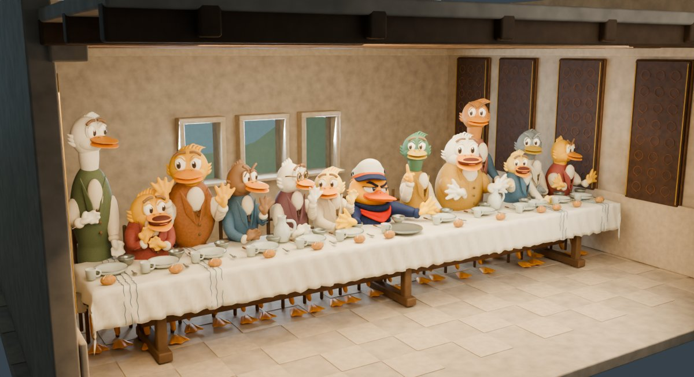

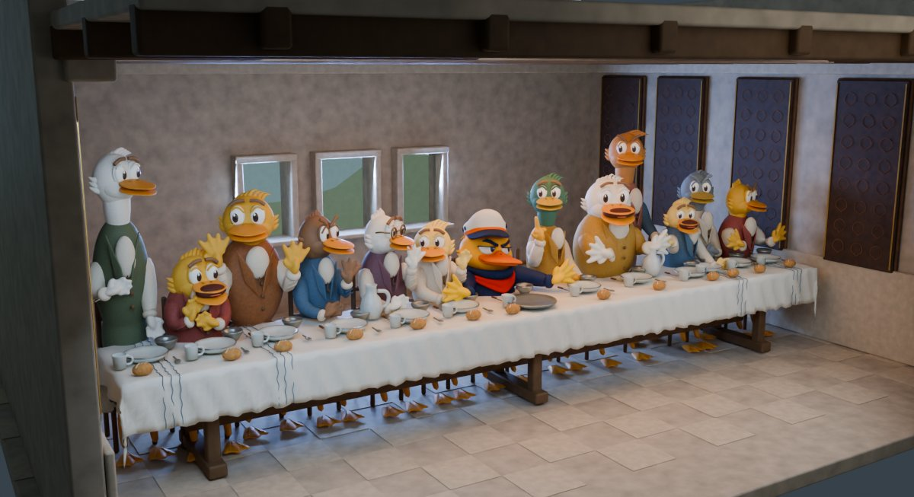

再加一个故事，就成了开头的晚餐小游戏。

把场景导出为 GLB——一种能装下模型和材质的文件，再让 Codex 用 Three.js 加上点击、对话、手记和指认。Three.js 负责让这些 3D 物体在网页里显示、响应操作。

图片与角色素材 → Blender 三维场景 → Three.js 网页小游戏。

观众转动视角，就能检查正面被挡住的物品。若线索只需要在一张图上点击，用二维网页也够；这里用 3D，是为了让人自己查看现场。

想做自己的版本，可以把工程交给 AI：

用这份场景做一个无需登录的网页探索小游戏。先和我确定故事，再设计点击角色、检查物件和记录线索的交互。保留自由观察，不提前标出答案。交付可编辑工程、网页源码和可部署目录，并打开网页实际检查。

也可以沿着这个思路做角色小剧场、活动解谜页或展览彩蛋。

## 6. 追逐短片：用白模安排空间，再交给视频模型

第二个案例是一只鸭子开吉普车逃离恐龙，最后飞越断桥。

我先用 Blender 搭简化场景，安排车怎么跑、恐龙从哪追、断桥何时出现。这种提前排好空间和动作的动画，叫“白模预演”。再把它交给 Seedance，让视频模型补上场景细节和角色表演。

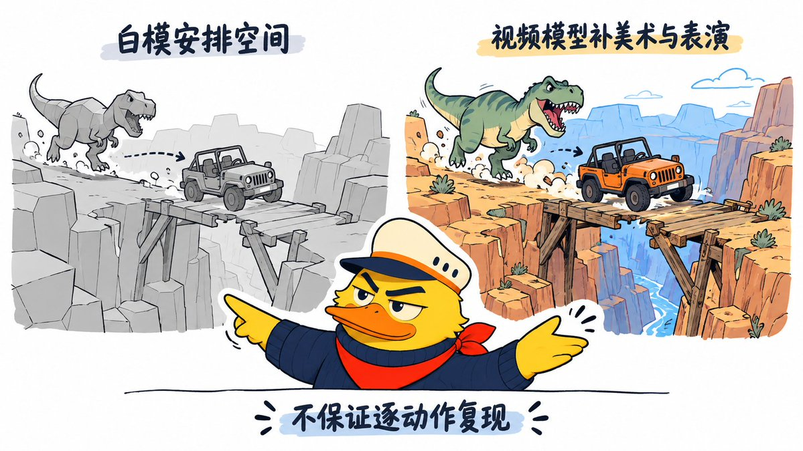

下面两段都是上方白模、下方 AI 成片。

最初版

第一版动作太机械死板沿用白模外观。后来学习了@Magncsans，@TanLuAI和@ponyodong的分享。

明白了白模只适合帮你安排自己设计的场景和路线，但不能让 AI 精确照做每个动作，我重做了这个案例，主要改了三处：

- 先让观众看清危险。 镜头提前露出断桥和对岸，再让车起跳。
- 白模把路线排清楚。 调整追逐、腾空和落地，再把 Tripo 角色模型放进驾驶位。
- 让视频模型补表演。 提示词写清回头受惊、落地前倾、脱险后扶帽子的反应，场景美术交给它重新设计。
升级版

给 Blender 的任务可以这样写：

制作一个 15 秒追逐预演：吉普车沿路逃跑，恐龙从后方追赶，车辆最终越过峡谷断桥。两岸要在起跳前进入画面，车、恐龙、桥分别可编辑。先给关键帧确认空间，再输出完整预演和工程。检查车轮落地、桥边接触、追逐方向和镜头是否看得见关键动作。

提示词的思路是：先说清参考什么、放开什么。提示词的开头是：

@视频1 中，保留彩色船长鸭的外形与服装配色，表情和身体动作重新演绎。其余灰白模型仅参考吉普、恐龙、断桥与峡谷的空间关系，以及追逐、发现断桥、飞跃、落地脱险的故事顺序；场景、车辆和恐龙的造型、配色、材质、光照与具体运镜全部重新设计。

后面按“追逐—发现断桥—飞跃—脱险”分段，写清镜头远近、角色反应和声音。

## 7. 悠纳闪卡：把角色做成能送出去的数字收藏卡

第三个案例轻一点：给悠纳做一张会反光、能转动和翻面的收藏卡，发个链接就能送给别人玩。

https://noah-captain-holo.netlify.app/

这张卡使用 EverettFish 的 [holo-card-studio](https://github.com/EverettFish/holo-card-studio)，作者注明实现教程来自小红书的“乌托邦的香蕉”。

主体、背景和文字各放一层。转动卡面时，各层移动的幅度不同，看起来就有了前后距离，再叠上随角度变化的镭射与星光。尤娜本身仍是图片，这种立体感来自图层。

我的制作过程是：准备角色图和背景 → 生成名字与编号字图 → 组装 Blender 卡片工程 → 制作 Three.js 交互网页。

角色、文字、材质、灯光和相机可以分别修改。比如改名字，只需重新生成文字层。网页里可以转动、翻面，调整镭射强度和图层深度；滑杆只影响网页，不会改写 Blender 工程。

想做自己的卡，可以把项目链接和图片一起交给 Codex：

使用 EverettFish/holo-card-studio，为这张角色图制作一张名为“尤娜”的航海收藏卡。保留角色形象，主体、背景和文字分层，支持转动、镭射和翻面。复用本机已有 Blender，保留可编辑工程和网页源码。先在本地检查正反面、标题与实际交互，确认后再部署；不要购买服务。

宠物纪念卡、生日礼物、个人 IP 收藏卡，都可以这样做。卡片也能放进其他 Blender 场景，继续拍海报或展示动画。

如果只想做网页闪卡，Blender 可以省。 可以看看 [LerSent001/holo-card](https://github.com/LerSent001/holo-card)。我保留 Blender 工程，是为了以后还能改灯光、材质和机位，继续出图或拍卡片镜头。

## 8. 意外惊喜

过程中发现了一个宝藏网站Netlify，支持快速免费上线：

只需让 Codex 打包好网页，在部署页选择 browse files to upload，上传发布包；完成后就会得到一个可以分享的 .netlify.app 地址。以后更新同一项目，可以沿用原链接。[部署说明](https://docs.netlify.com/deploy/create-deploys/)

这里上传的是整理好的网页文件，通常在 dist 目录里。不要把包含工程、个人路径和未公开素材的整个制作文件夹都传上去

# 第四阶段：打开思路——看看别人还做出了什么

## 9. 从房间漫游，到产品展示和城市动画

这三个案例之外，还有一些我很喜欢的玩法：

走进一张房屋照片。 [Tom Krcha](https://x.com/tomkrcha/status/2095598645190291775) 展示了按房屋参考搭建的场景，还放出了家具和厨房的几何结构图。可以借这个思路做房间展示、家具布局预览，看看换个位置会不会挡住动线。照片没提供的尺寸仍需要测量，不能拿概念场景直接施工。

让观众自己转着看产品。 [Kushal](https://x.com/Kushal_70/status/2098463865780765003) 用摩托车照片制作模型，再接到 Three.js 网页里，观众能切换机位、查看车身信息。[成品入口在这里](https://the-tech-adv.vercel.app/)。对想展示原创产品、零件和细节的人，这比一张固定角度的展示图多了一种表达方式。

把产品结构动起来。 [shapelayer 的折叠手机演示](https://x.com/shapelayer/status/2098485777298510119) 展示了开合模型和基础动画，作者也承认动画还比较粗糙。值得借鉴的是让产品“怎么打开、怎么折叠”直接演给人看，可用于概念展示和发布前预演。

拍一座慢慢长出来的城市。 [TJ16th](https://x.com/TJ16th/status/2096871490809643168) 用节点规则安排道路延伸、建筑错峰生长，最后还有局部变形下沉。这类方法适合做片头、音乐视觉或解释过程的动画，想修改节奏时可以调整规则，不必逐栋重新排动作。

先排三维镜头，再变成另一种画风。 [npaka 的制作记录](https://note.com/npaka/n/nab05d90f95b7) 把 VRoid Studio 角色、Blender 场景与分镜动画接到 Omni 1.1 Flash，尝试转成手绘风；[Leila 的天文台案例](https://x.com/leilamakes/status/2098450393277595841) 则让灰模提供结构和镜头，另用实景照片提供外观参考。值得借鉴的是分别交代“结构从哪来、美术从哪来”，不能把它们理解成只传一个粗白模，模型就会自动做好所有细节。

这些作品我没有全部复做，链接留下，感兴趣可以去看作者的原帖。

# 结语

这次折腾完，我更加珍惜 AI 给外行人的这个机会：对建模、动画、游戏感兴趣，完全可以先带着一个念头试起来，遇到问题再回头补知识。专业能力依然重要，但迈出第一步的门槛，确实在被一点点打碎。

这些年，AI 已经把不少次元壁凿穿过一遍：围棋、写作、音乐、导演，现在轮到了建模和游戏。每凿穿一道，就有一批本来被挡在门外的人，第一次有机会摸一摸自己曾经想过、又因为现实放弃的那条路。小时候想学画画、想拍电影、想做游戏的那个念头，很多人早就归档进"这辈子大概没机会了"的抽屉——现在这个抽屉，被 AI 悄悄拉开了一条缝。

我对一个行业的门槛和深度始终有敬畏，科班出身当然有它的价值和壁垒。

可我更相信，一件事只要认认真真喜欢了五年、十年，早晚能追上、甚至超过那些"正规军"。所以与其纠结自己是不是"这块料"，不如先给自己一次机会、一份热爱去试试看。

先玩先体验，不必追求有用，做着做着，也许就找到了适合形式，或者工作里用得上的东西。如果你也有点想试了，就挑一张喜欢的图片，或者一个一直想做的小场景，把 Blender 打开，和 AI 一起玩起来。

我是诺鸭船长🦆，带你在信息的海洋里寻找陆地～
