# 📰 个人提效，攒不成组织提效：货拉拉 AI Coding 落地实践

部门：技术中心-核心基础设施部

作者：万深高|后端架构师

|工具推广之后，我们发现，团队的交付效率并没有跟着明显提高。过去一年，我们围绕这个问题，统一了工具配置和使用规范，也把 AI 接入了日常研发流程。|
|------------------------------------------------------------------------|

读完你会知道

|**01　度量怎么算才不是自说自话**  AI 代码占比的三层签名、FPY 的公式与它的已知盲区  **02　三个踩过的坑**  工具边界、上下文该减不该加、对抗性审查的重要性  **03　SDD 五步产线**  怎么把初级工程师的产出下限兜住  **04　统一工作台**  怎么把散在个人手里的 AI 配置收成组织资产|
|------------------------------------------------------------------------------------------------------------------------------------------------------------------------------------------------------------------------|

## 一、先看全景

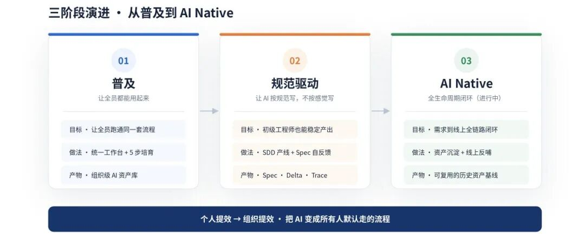

大家会用 AI 以后，产出质量还是很看个人，所以我们用规范来指导每个需求。再往后做 AI Native，就要把从需求到上线的过程接起来，把开发和线上发现的问题补进规范，供后续需求使用。

## 二、背景：个人提效 ≠ 组织提效

|1000+ 工程师，覆盖后端、移动端、前端、算法、测试；10+ 主流技术栈；数十个业务线。|
|---------------------------------------------|

这个体量下，靠自觉、靠个人配置的方案撑不住。工具铺开之后，很快冒出来五个问题：

|1. 每个人用法各自为政； ----------  2. 大家重复整理相同的项目资料； ----------  3. 不同人生成的代码风格不统一； ----------  4. 说不清 AI 到底提升了多少效率； ----------  5. 成本和风险没人管得住。 ----------  这些问题都凸显同一件事：个人提效攒不成组织提效。|
|--------------------------------------------------------------------------------------------------------------------------------------------------------------------------------------------------------------------------------------|

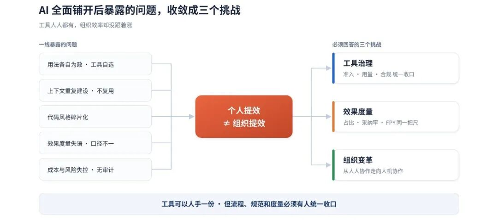

工具本身跑得很快。按人机分工和运行位置分，大致是三种形态：

|  形态   |     人机分工     |  运行位置   |                代表                |
|-------|--------------|---------|----------------------------------|
|  补全式  |  人主导，AI 补全   |  IDE 内  |      GitHub Copilot / 通义灵码       |
|  对话式  |人 prompt，AI 起草|  IDE 内  |    Cursor Chat / Qoder / Trae    |
|Agentic| 人定目标，AI 多步闭环 |IDE 或 CLI|Cursor Agent / Claude Code / Codex|

蓝色是本文所处的位置。

|异步云端 Agent 是另一种用法：派给它一个任务，它在沙箱里执行，完成后提交 PR。本文的实践主要围绕研发在 IDE 中使用 AI 展开。换成异步方式后，工作台和研发流程需要怎么调整，我们还在探索。|
|----------------------------------------------------------------------------------------------------|

但企业侧的卡点一直没变过：怎么把工具嵌进研发流程。

---

## 三、第一阶段 · 普及：把 80% 的下限抬起来

最先看到的是分化。同一套工具，20% 的人和 80% 的人，产出差距大到不像在用同一个东西。

|   场景   |   深度用户（20%）   |    普通用户（80%）     |
|--------|---------------|------------------|
|  接需求   |  自己整理上下文喂 AI  |   不知道从哪开始，直接干    |
| 写技术方案  |MCP + 模板 + 多轮对话| 让 AI 凭空想，不喂历史方案  |
|  改老代码  |用 Skill 自动定位入口 |翻代码摸位置，不知道怎么跟 AI 说|
|写单测 / CR|  Agent 批量补齐   |  AI 写完不跑，CR 走形式  |

|所以我们先把精力放在那 80% 的普通用户身上，帮助他们用好 AI。|
|----------------------------------|

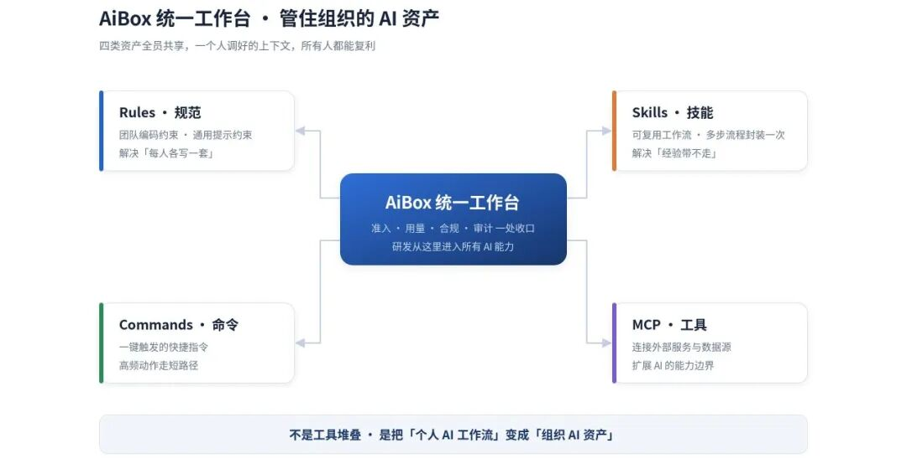

AiBox 是我们的统一工作台，主要管理四类配置：

|Rules　团队编码约束  Skills　可复用的多步工作流|Commands　高频动作的快捷指令  MCP　外部服务与数据源的接入|
|--------------------------------------|-------------------------------------------|

这些配置由平台统一维护，再下发到大家的 IDE。工具准入、用量统计、合规检查和审计也由平台统一管理。

除了提供工作台，我们还安排了培训，帮助大家熟悉工具和使用方法：

## 1. 建立 AI 编码常识 先校准预期：AI 在哪些任务上靠谱、什么时候会一本正经地编，别一上来就当搜索引擎用；

## 2. 讲清 IDE 的能力边界 补全、对话、Agent 三种模式各自能干什么、各自的代价是什么；

## 3. 统一开发环境配置 Rules、项目初始化、MCP 接入一次配好，不让每个人自己摸；

## 4. 整理新人培训流程 把前面的培训和配置步骤整理成新人入职流程，方便大家按步骤学习。

知道 AI 能干什么，跟知道手上这个活该怎么让 AI 干，中间还差一层。我们把日常研发拆成一批高频实战场景，按 BugFix、从 0 到 1 新项目、线上运维排障、重构优化、需求开发分类，每个场景配一个能照着跑的真实例子：

## 1. 阅读理解代码 ：以订单模块为例，让 AI 梳理核心逻辑、依赖关系和数据流向，输出分析报告；

## 2. 新增字段与查询接口 ：让 AI 一次完成改接口字段、加数据库列、新增查询接口三件事，且只改必要的代码；

## 3. 代码变更评审 ：把当前分支的变更交给 AI 做系统化 Code Review，输出结构化评审报告；

## 4. 单元测试生成 ：为指定方法的分支逻辑一次生成覆盖主干场景的测试类，不用启动容器和真实数据库。

|大家可以先找一个和手头任务接近的例子，跟着做一遍，再试着用到自己的项目里。|
|-------------------------------------|

## 四、第二阶段 · 规范驱动：让 AI 按规范写

普及解决了能用，没解决稳定可用。走 Spec 路线有两条理由：普通研发写不好方案，那就把方案结构化、模板化，让 AI 按规范生成；另一条是规模化之后最稀缺的东西变了：代码行数反而不缺，缺的是结构化的领域知识。

|先说清楚一点：Spec 驱动到今天已经不是新东西。GitHub 的 Spec Kit、AWS 的 Kiro、BMAD-METHOD 都在做同一件事，澄清、方案、拆任务、实现、审查这套五步流程是这个品类的通用形态，不是谁的独创。|
|-----------------------------------------------------------------------------------------------------------------|

我们参考的是 OpenSpec 的 spec / delta 结构和 Superpowers 的 Skill 化方法论。前者能把每次改动追溯到增量，适合我们这种有大量存量代码的老系统；后者把方法论固化成能让人照着跑的载体，适合在上千人里推开。

| 维度 |       OpenSpec（Fission-AI）        |      Superpowers（obra）       |
|----|-----------------------------------|------------------------------|
| 主张 |         先约定要造什么，再让 AI 写代码         |     把工程文化打包成一组 SKILL.md      |
|核心机制|每次变更一个 change 目录；Delta 标记记录对存量代码的增量|不澄清不写代码；任务拆到 2–5 分钟；红绿重构强制 TDD|
| 强项 |          变更可追溯，适合大型存量工程           |   方法论沉淀，Skill 即文化，适合规模化协作    |

|所以我们做的事情很朴素：把通用形态接到自己的研发系统上。属于我们自己的是四件事：需求系统接入、spec 自动召回、用完打分回写、全链路 trace。|
|--------------------------------------------------------------------------|

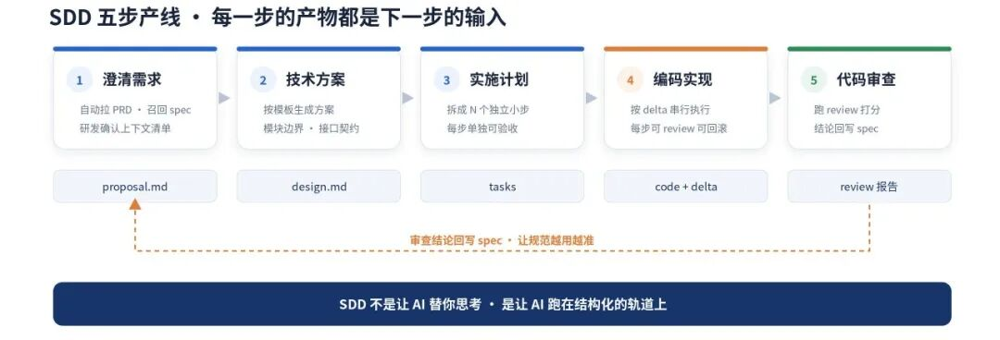

第一步最关键。传统流程里，该读哪些上下文全靠研发自己脑补，也最容易翻车。我们把它拆成四个动作：

## 1. 自动从 PMIS（我们内部的需求管理平台）拉需求，关联 PRD ；

## 2. AI 从 tech / domain / dev / cr\_spec 四个库里召回候选 spec；

## 3. 把 spec、代码片段、历史方案打包成一份上下文清单；

## 4. 研发勾掉无关的、补上漏的，输出 proposal.md。

第四步的麻烦在于，一次变更常牵动多个文件。AI 一口气写完，失败就全废，还不知道从哪步走偏。做法是拆成 N 个原子 delta，跑前跑后各校验一次，出问题只回退那一步。

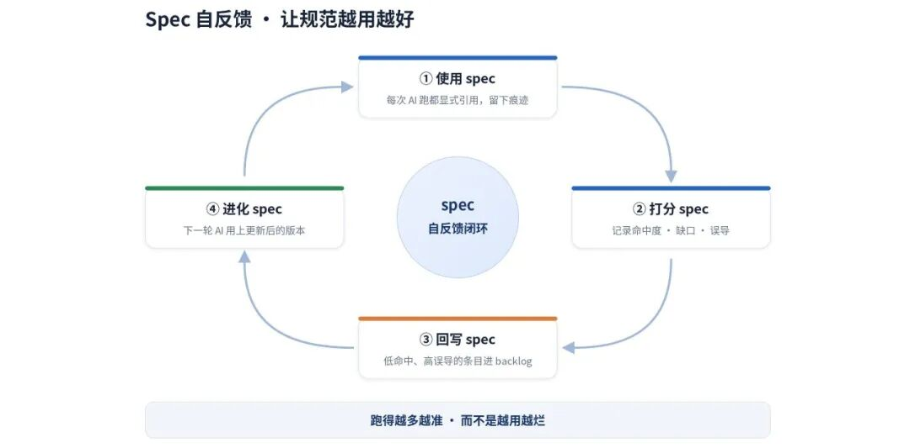

|spec 不是写完就摆在那儿。每次被召回使用后，审查环节会记录这条 spec 命中了没有、有没有误导，据此给它打分；命中率低、误导率高的进 backlog 修订，长期不命中的下架。|
|------------------------------------------------------------------------------------------|

每一步的产物既要方便人评审，也要保留下一步 AI 需要的信息：

| 阶段  |   供人评审的产物   |    下一步 AI 需要的信息     |
|-----|-------------|---------------------|
| 需求  |    需求文档     |     业务意图 · 边界约束     |
| PRD |   结构化 PRD   | 功能目标 · 业务规则 · 验收标准  |
|技术方案 | 方案 + API 契约 | 模块边界 · 接口约定 · 架构约束  |
|任务拆解 |   编码任务列表    |单任务的输入 / 输出 / 依赖 / 验收|
| 编码  |可交付代码 + CR 报告|  代码变更 · 新接口 · 新规则   |
|上下文回写|  更新后的知识资产   |    下一轮迭代的全量上下文基线    |

## 五、第三阶段 · AI Native：全生命周期闭环

一个需求交付后，开发中积累的经验和上线后发现的问题，还要用到后续需求里。这是第三阶段要继续做的事。

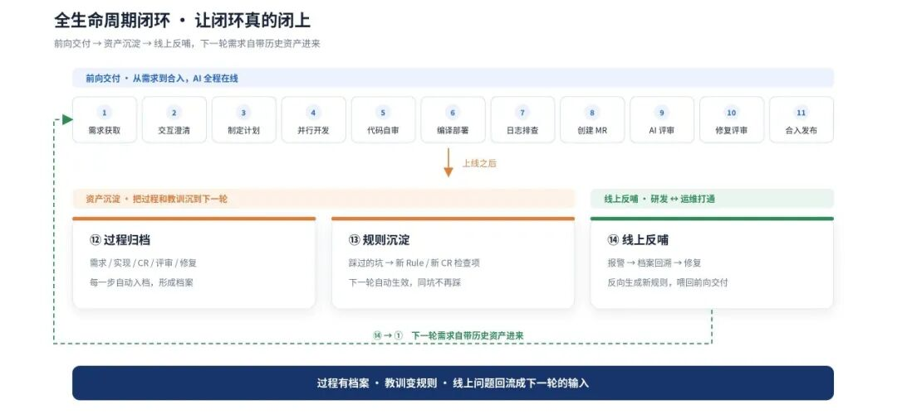

闭环能不能成立，看上线之后这两块：

||资产沉淀  过程每一步自动入档，踩过的坑变成新 Rule 和新 CR 检查项，下一轮自动生效。| |-------------------------------------------------------|||线上反哺  线上出了报警，回溯当初的过程档案，把根因反向生成一条规则，下次同类需求自动生效。| |------------------------------------------------------||
|-----------------------------------------------------------------------------------------------------------------------|---------------------------------------------------------------------------------------------------------------------|
|                                资产沉淀  过程每一步自动入档，踩过的坑变成新 Rule 和新 CR 检查项，下一轮自动生效。                                |                                                                                                                     |
|                                线上反哺  线上出了报警，回溯当初的过程档案，把根因反向生成一条规则，下次同类需求自动生效。                                 |                                                                                                                     |

这样下一轮需求进来时，自带历史资产。

走到这一步，只改流程不够，组织形态也得跟着变。下面是我们判断的目标形态，完成度不一，有的在做，有的还只是方向：

### 组织形态：按****业务****域重组

* 团队边界：前端 / 后端 / 客户端　→　按业务域切

* 域内人员：单栈个人　→　多栈 + AI 协作者

* 工程师角色：实现者　→　目标设定者 + 结果审计者

* 招聘标准：看编码熟练度　→　看上下文构建能力

### 研发流程：把** **AI** **需要的信息写清楚

* 文档：各写各的　→　全部按 spec 结构化

* 工作流：凭经验做　→　spec 全流程跑

* 评审：纯人类评审　→　Agent 一审 + 人复审

* 度量：行数 / 工时　→　FPY / 采纳率 / spec 覆盖度

需求、方案、任务和评审结论要按统一结构记录，写清楚边界条件和验收标准。原来靠团队默契才能理解的内容，也要补进文档里，方便 AI 读取和使用。

---

## 六、怎么把 AI 的效果变成可度量的东西

要回答三件事：AI 到底写了多少代码、中间过程能不能看见、第一次写得准不准。下面讲的是这套体系怎么搭。具体数值各家口径不同，彼此没有可比性，值钱的是算法本身能不能逐行对账。

AI 代码占比

AI 代码占比 ＝ AI 生成且最终合入主干的代码行 ÷ 主干新增代码总行

「最终合入主干」这六个字是关键。IDE 里看到的 AI 生成行数，跟最后留下来的完全不是一回事，中途删掉的、重写的、合并时被覆盖的，都不算。为了让这个分子经得起对账，我们做了三层采集：

## 1. IDE 遥测层 给每行 AI 生成的代码打 hash 签名；

## 2. 提交比对层 在 git commit 时检查每行是否还匹配签名；

## 3. 合入统计层 只认最终进主干的行；

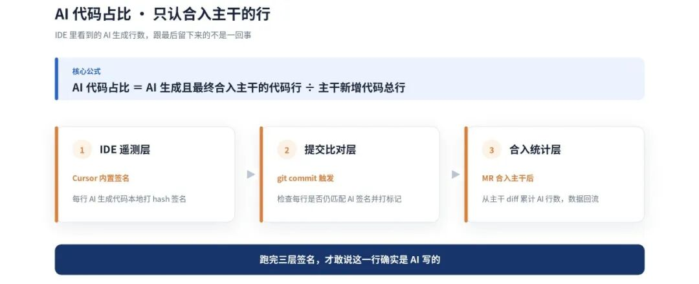

全链路 Trace

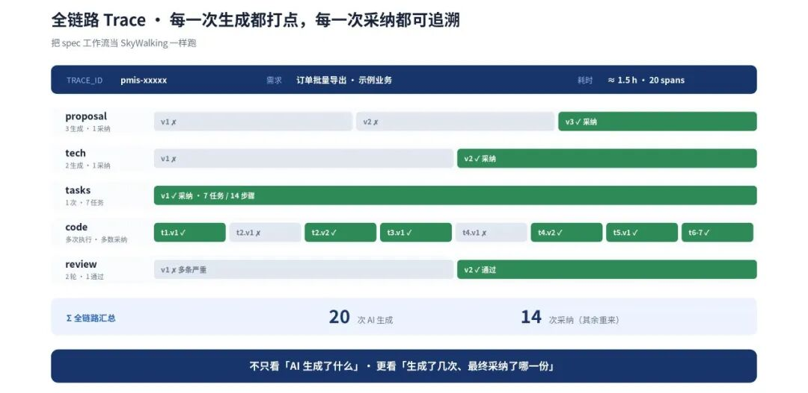

上面是一条脱敏后的真实 trace：一个订单批量导出的需求，全流程 1.5 小时、20 个 span。proposal 生成 3 次采纳 1 次，tech 生成 2 次采纳 1 次，tasks 一次拆出 7 个任务，review 跑了两轮才过。

|生成了几次、采纳了几次，这两个数之间的差，才是 AI 还有多大改进空间的信号。|
|---------------------------------------|

首次正确率 FPY

FPY ＝（commit 终版行数 − diff(v1, commit) 改动行数）÷ commit 终版行数

按 task 算，再按代码行数加权

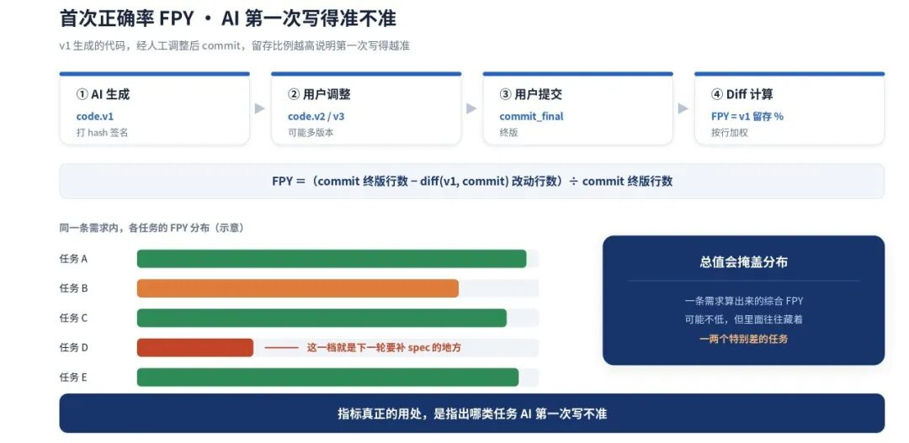

同一条需求里的不同任务，FPY 差别可能很大。总值看着还行，里面往往藏着一两个特别差的。那些低分任务，就是下一轮要补 spec 和上下文的地方。

|这个指标有两处容易误读。  一是 FPY 衡量的是生成质量，不是代码质量。它只看 v1 有多少活到了 commit，不保证活下来的那部分是好代码。它还有个反方向的读法：FPY 高，可能是 AI 写得准，也可能是人懒得改就提交了，这两种情况从数据上分不开。  二是上面这条 trace 只是单条样本，用来说明算法怎么跑，不代表全量水位。|
|---------------------------------------------------------------------------------------------------------------------------------------------------------------------------------------|

这三个指标还有个共同的局限：占比、采纳率、FPY 都在代码提交那一刻结算，回答的是 AI 生成得好不好，没有一个回答合进去之后系统变好了没有。合入后的存活率、返工率、变更失败率，是我们下一步要补的维度。

## 七、三个踩坑

坑一：简单任务没必要启动完整的 Agent 流程

最初的判断很简单：把最强的 Agent 给到所有人，效率自然就上去。跑了一段时间发现杀鸡用牛刀的代价很大，补全一个单函数的活让 Agent 启动整个流程，又慢又烧 token。

不按工具强弱分配，按任务步数分通道。步数不超过 2、单文件、语义清晰的走 Vibe Coding，直接用 IDE 里的 tab 补全，零学习成本；跨文件、多步、语义模糊的才进 Agentic Workflow，从 AiBox 工作台走，全流程留痕。

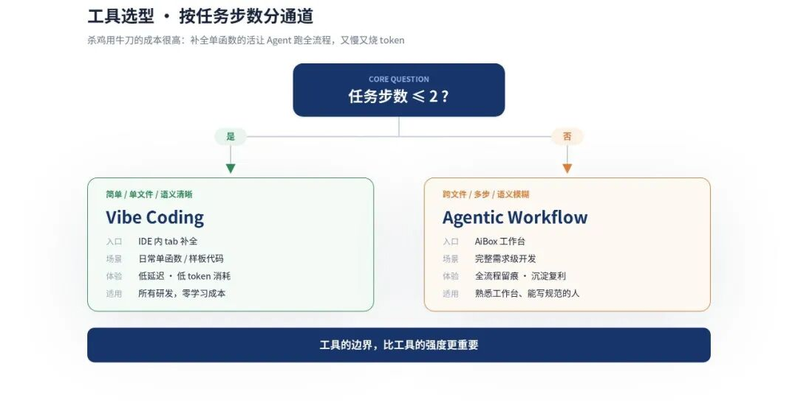

|留下的经验  分通道的前提是标准要硬。如果只写「简单任务用轻的」，研发会凭手感选，最后要么全用重的、要么全用轻的。任务步数这种能一眼判断的标准，比任何描述性的定义都管用。  我们目前把步数阈值设为 2，后续会根据模型能力和实际使用效果调整。|
|----------------------------------------------------------------------------------------------------------------------------------------|

坑二：上下文塞得太多，反而影响效果

早期觉得上下文喂得越多越好，单次 prompt 塞十万 token。结果两个问题同时出现：注意力被稀释，生成质量不升反降；token 成本涨得很快。

从全量喂入改成精准召回，三个机制配套：

· 场景化上下文包　按 PRD 类型和业务域召回，不一锅烩；

· 关键词触发知识点　命中才注入对应规范，不全量塞；

· 三维联评　盯住覆盖度、准确率、自动化注入率三个口径，避免只优化其中一个。

|留下的经验  能带走的是那条准入门槛：每加一条规范，都得先回答它在什么条件下注入、命中率是多少。答不上来的规范，加进去就是噪声。  改完之后上下文体积明显下降，关键召回率没掉、反而升了。这一句没有公开的数字支撑，读的时候请当成我们的体感而不是测量结果。|
|----------------------------------------------------------------------------------------------------------------------------------------------|

坑三：AI 幻觉要靠第二只眼睛

AI 很擅长写出看起来很对的代码，引用了不存在的 API、虚构了字段、错配了依赖。这类问题在人工评审时最容易漏，因为逻辑读起来是通的，错的是事实。

主从双 Agent。主 Agent 按 spec 实现，要求读源码 grounding、不凭想象；副 Agent 独立读真实源码、跑测试，只干一件事：核对 API、字段、依赖是不是真的存在。不过就驳回并带上反馈，主 Agent 改完再验，直到放行才合入。

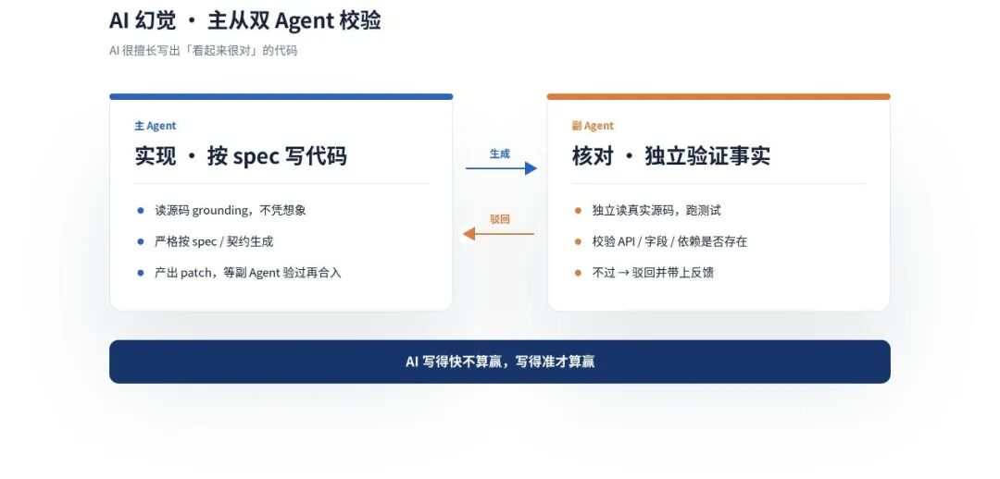

|留下的经验  关键在「独立」两个字。副 Agent 不能复用主 Agent 的上下文，否则它会跟着一起幻觉：主 Agent 以为某个接口存在，副 Agent 拿着同一份上下文去核对，只会确认这个错误。它必须自己回源码。|
|---------------------------------------------------------------------------------------------------------------------|

## 八、总结与展望

为什么把 spec 做进平台

对我们这样的千人团队，难点是让 spec 用到几百个存量服务里，并接上已有的需求管理、开发和审查流程。

|把 spec 接入平台后，研发处理需求时就能获取相关规范，不用每次自己找文档、配规则。|
|-------------------------------------------|

两个判断

下面两条是我们的判断，不是行业共识。

||01　spec 的维护和管理还需要继续完善  有了 SKILL.md、AGENTS.md 这样的文件格式，团队仍然要明确：谁能写规则、谁来评审，过期规则怎么下线，规则冲突时怎么处理。  目前我们先根据使用反馈，判断哪些 spec 需要修订，哪些可以下架。| |-----------------------------------------------------------------------------------------------------------------------------------------------|||02　研发效能的度量正在分成三层  AI 参与后，只看代码行数和工时，已经不足以判断效果，还要看变更失败率、前置时间和线上事故。这一年，我们补充了采纳率、首次正确率和 spec 命中率，帮助排查研发过程中哪些环节需要改进。  下一步，我们会继续补充合入后的指标，看看 AI 生成的代码保留了多久，是否带来返工或线上问题。| |--------------------------------------------------------------------------------------------------------------------------------------------------------------------------------||
|-------------------------------------------------------------------------------------------------------------------------------------------------------------------------------------------------------------------------------------------------------------------------------------------------------|-------------------------------------------------------------------------------------------------------------------------------------------------------------------------------------------------------------------------------------------------------------------------------------------------------------------------------------------------------------------------|
|                                                                            01　spec 的维护和管理还需要继续完善  有了 SKILL.md、AGENTS.md 这样的文件格式，团队仍然要明确：谁能写规则、谁来评审，过期规则怎么下线，规则冲突时怎么处理。  目前我们先根据使用反馈，判断哪些 spec 需要修订，哪些可以下架。                                                                            |                                                                                                                                                                                                                                                                                                                                                                         |
|                                                           02　研发效能的度量正在分成三层  AI 参与后，只看代码行数和工时，已经不足以判断效果，还要看变更失败率、前置时间和线上事故。这一年，我们补充了采纳率、首次正确率和 spec 命中率，帮助排查研发过程中哪些环节需要改进。  下一步，我们会继续补充合入后的指标，看看 AI 生成的代码保留了多久，是否带来返工或线上问题。                                                            |                                                                                                                                                                                                                                                                                                                                                                         |

更长的时间维度

我们内部用三个层级描述人和 AI 的分工：L1 全部人工，慢但可控；L2 人定义目标、AI 起草、人做决审，这是我们现在的位置；L3 是 AI 自己闭环、人只做兜底抽查。

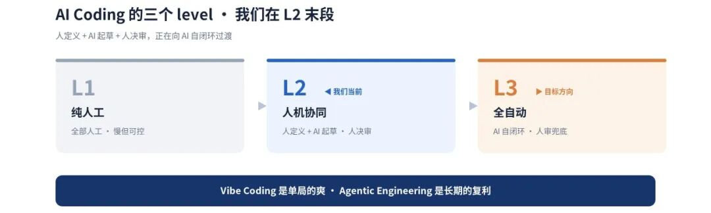

L1 到 L3 不是一步跳过去的。卡住的地方不只是模型能力，还有两个更硬的约束：

||约束一 · 交付稳定性  AI 加速了变更流入，下游的测试和反馈跟不上就会被冲垮。| |-------------------------------------------------|||约束二 · 决策权的划分  哪些环节可以让 AI 自己闭环、哪些必须人签字。这条线得一个场景一个场景地划，划错了要么出事故，要么等于没自动化。| |-------------------------------------------------------------------------------||
|-----------------------------------------------------------------------------------------------------------|-----------------------------------------------------------------------------------------------------------------------------------------------------------------------|
|                             约束一 · 交付稳定性  AI 加速了变更流入，下游的测试和反馈跟不上就会被冲垮。                             |                                                                                                                                                                       |
|              约束二 · 决策权的划分  哪些环节可以让 AI 自己闭环、哪些必须人签字。这条线得一个场景一个场景地划，划错了要么出事故，要么等于没自动化。              |                                                                                                                                                                       |

这一年，我们把个人摸索出来的好用法，整理成了团队能共用的配置、规范和流程。接下来还要看，需求交付是不是更快了，返工是不是更少了。大家用 AI 省下来的时间，得真正体现在团队的交付上。

