# 📰 货拉拉大模型记忆系统（一）：从提取到召回的工程实践

## 一、前言

> ❝
>
> **记忆不是保存过去，而是让过去在需要时，以正确的方式回来。**
>
>

人会在一次次交流中积累对一个人的了解：他不感兴趣什么、买过什么、还在担心什么。对 AI 来说，这些聊天历史默认不会被带进下一次会话。同一位司机已经说过不感兴趣、接过什么单、还在担心什么；下一次电话里，AI 却把这些全忘了。

* **在司机外呼场景中**，这些被忘掉的信息会直接改变下一次沟通的起点。上次拒绝的原因、此前接过什么单、仍有哪些顾虑，决定大模型外呼该怎样开场；丢掉它们，大模型只能重复第一次的话术，既浪费沟通机会，也让用户感到自己从未被理解。

* **在用户助手场景中**，跨会话失忆会以另一种形式出现。用户询问“该下什么订单”时，通常已在此前会话中提到过自己的行业背景、车型偏好和价格敏感度。缺少这些背景，助手仍然能给出答案，却无法判断什么建议真正适合这位用户。

失忆的原因不在模型没有见过这些信息，而在大多数实际调用中，模型只能依据这一次传入的上下文判断。此前会话中的信息不会自动进入下一次调用。系统需要主动保存，并在需要时把相关内容带回，才能让历史影响下一次回答。于是，跨会话历史的处理面临一道工程选择题：完全不带历史，还是每次把历史全部带上？

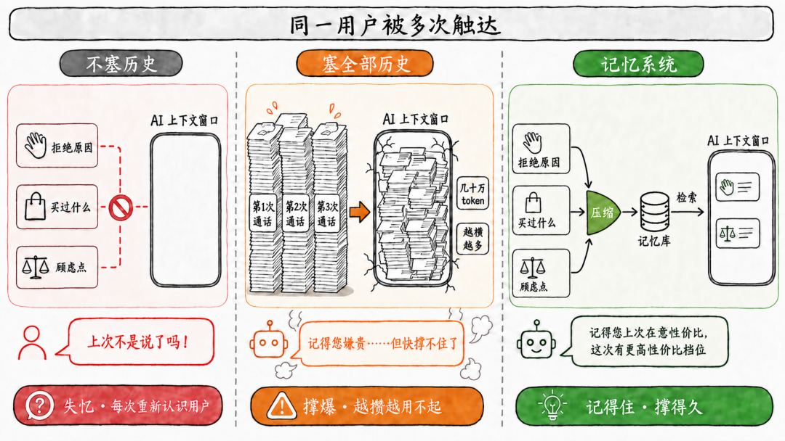

|   对比维度   |          不带历史          |             带上全部历史              |           记忆系统            |
|----------|------------------------|---------------------------------|---------------------------|
| 本轮模型拿到什么 |       当前请求及即时上下文       |            累积的原始会话记录            |      当前相关的偏好、事件和任务状态      |
|单次输入 Token|         **低**          |           **高，且持续增长**           |        **低，且基本稳定**        |
|单次调用成本与等待 |         **低**          |          **高，且随历史增长**           |        **低，且基本稳定**        |
|   维护投入   |         **低**          |              **低**              |**中等**  ：需要提炼、更新和召回|
|处理状态变化的能力 |**低**  ：过去状态无法延续|**中等**  ：保留了记录，但要临时判断新旧关系| **高**  ：可持续更新当前状态 |
|  跨会话连续性  |         **低**          |             **中等**              |           **高**           |

窗口不断变长、摘要不断改进后，为什么仍需要专门的记忆系统？关键在于，长上下文解决的是一次调用能够阅读多少材料，却没有改变历史依然只是一堆原始消息的事实。**历史记录不等于记忆**：历史记录按聊天发生顺序保留“当时说过什么”，却没有把其中的信息整理成可复用的事实、关系和任务进展。后续出现新信息时，系统还需要重新判断它是在补充、修正还是取代过去的记录。

进一步，这些信息还会变化。司机上次拒绝的原因、车型偏好和价格敏感度，都会随新的顾虑、接单行为或明确意愿而修正；用户助手记录的偏好也会随实际需求变化。这些信息何时发生、彼此是补充还是覆盖、下一次会话是否还用得上，记忆系统都需要知道，而不是把每条消息都当作同等重要的历史。

> ❝
>
> **记忆系统的意义，是让历史信息拥有生命力：它会随时间和后续聊天中不断更新、合并或遗忘，并在需要时以合适的形式参与当下的判断与行动。**
>
>

那么，历史该怎样被整理成能持续使用的状态？货拉拉自研记忆系统把整套能力分为在线侧与离线侧。

## 二、总体设计：在线让信息可用，离线让记忆可维护

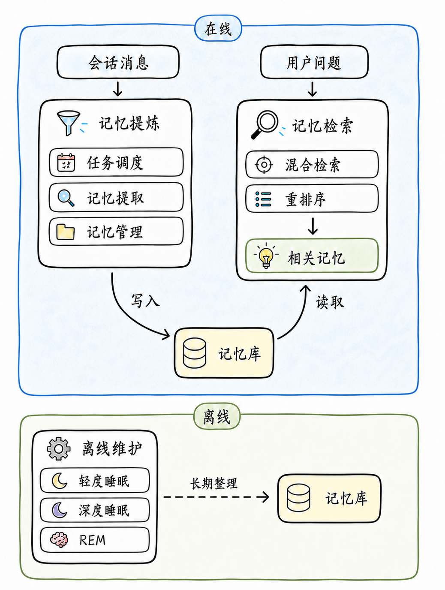

图中展示了货拉拉自研记忆系统的整体分工。在线侧围绕记忆库完成写入与读取两条链路：会话消息经过任务调度、记忆提取和记忆管理，持续被提炼为高价值记忆；用户提出问题后，系统通过混合检索与重排序，从记忆库中取回当前问题所需的相关记忆。

离线侧负责让持续积累的记忆保持有序和有效。轻度睡眠、深度睡眠和 REM 睡眠在不同层次上整理已有记忆，使重复信息得到整合，已变化的信息能够更新，长期重要的信息得以沉淀。

这套分工将记忆的即时流转与长期整理分开：在线侧让新信息持续进入记忆库，并在需要时重新参与回答；离线侧则让记忆在长期积累后，仍能保持清晰、稳定和可用。

|分工 |            要解决的问题             |       核心能力        |
|---|-------------------------------|-------------------|
|在线侧|消息怎样提炼成可复用的记忆，又怎样找出用户问题所需的相关记忆 |任务调度、记忆提取、记忆管理、混合检索|
|离线侧|长期积累的记忆怎样避免重复、过时或相互冲突，并沉淀更稳定的信息| 轻度睡眠、深度睡眠、REM 睡眠  |

**本文是货拉拉大模型记忆系统系列的第一篇**。离线侧——睡眠与梦境如何维护长期记忆——将在下一篇展开。

## 三、让新信息变成可用记忆：在线能力设计

在线侧的四项能力共同构成从会话消息到 LLM 回答的闭环：

|在线能力|                要解决的问题                |             怎么解决的              |
|----|--------------------------------------|--------------------------------|
|任务调度|        消息需要可靠、灵活、完整、高效地进入记忆提取        |消息先记录成待处理任务，再按会话聚合、并发限制等机制交给记忆提取|
|记忆提取| 会话记录需要保留完整证据，后续使用又需要能被独立理解、准确检索的信息单元 |  从消息中识别值得长期保留的独立信息，写成一条条候选事实   |
|记忆管理|       独立的候选事实难以相互关联，也缺少可维护的结构        |为候选事实补上事实存储、实体链接、用户画像、记忆关联与概念标签 |
|混合检索|检索要解决的是：怎样从已保存的记忆中找出用户问题真正需要的部分，再交给大模型|     把长期积累的记忆转换为对用户问题可用的输入      |

其中，任务调度首先决定一段会话能否可靠进入记忆提取。

### 3.1 任务调度架构：让会话以合适的节奏进入记忆提取 ###

在货拉拉自研记忆系统的在线侧，任务调度负责让会话以合适的节奏进入记忆提取。它要在几个方面取得平衡：新信息要尽快可用，同一会话不能被拆散理解，慢模型调用也不能因故障或拥塞拖垮在线请求。它不判断内容是否值得记忆，只负责把一段完整、可执行、可恢复的会话交给记忆提取。

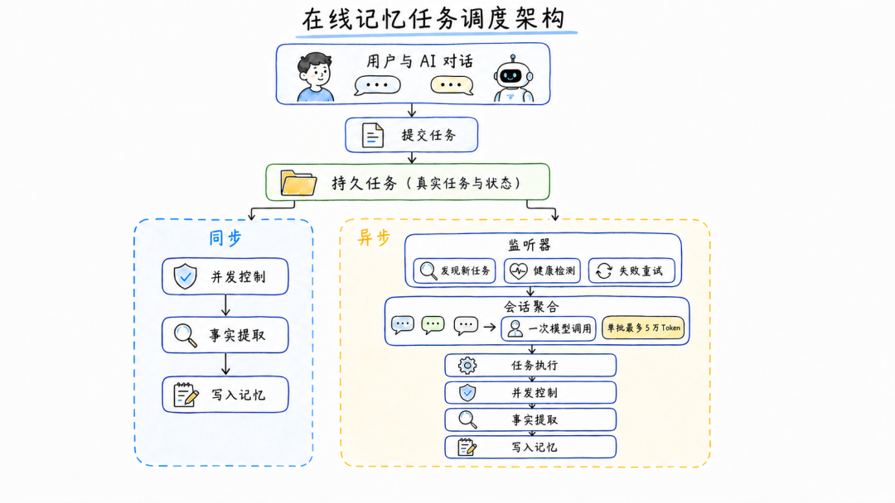

**我们希望任务调度同时保证记忆提取的可靠性、灵活性、会话完整性与处理效率，而非消息一来就立刻提取。**

整条处理链路围绕四个目标设计：

* **可靠性：** 消息先记录成待处理任务；执行异常时，系统仍能重新找到任务并继续处理。

* **灵活性：** 同一条处理链路提供两种响应方式：同步等到记忆写入完成再返回，或先返回、由后台异步完成。

* **会话完整性：** 会话聚合把同一会话的任务放进同一次记忆提取，使每条消息连同它依赖的上下文一起构成完整事实。

* **处理效率：** 每次记忆提取都要调用大模型，速度慢、开销大；聚合把相关消息合并成一次提取，减少重复调用。5 万 Token 上限控制单次提取大小，并发限制控制同时处理数量。

其中，可靠性尤其需要保障：任务已经开始不等于一定能完成，后台执行程序可能中断，记忆提取也可能失败。

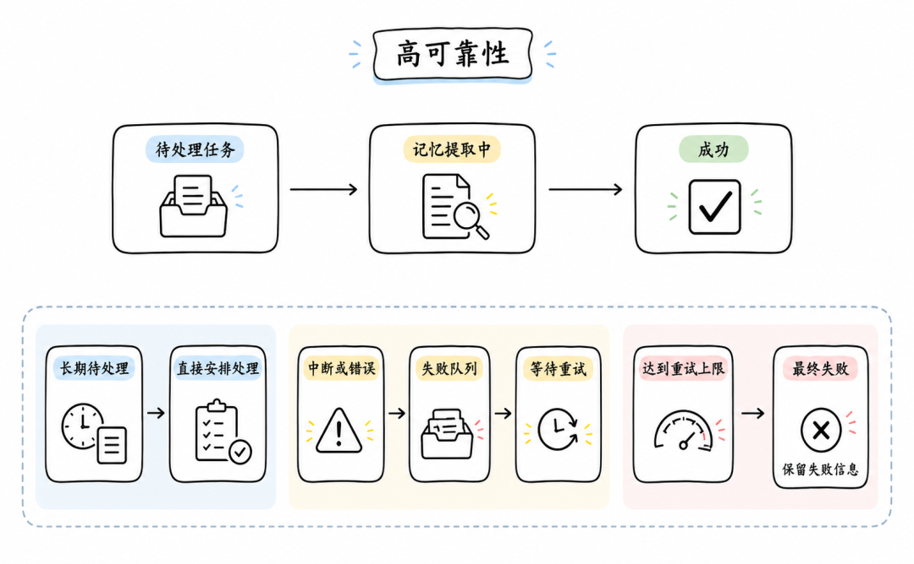

|    情况     |      怎么发现       |       怎样处理        |   避免什么    |
|-----------|-----------------|-------------------|-----------|
|  正在正常处理   |健康检查确认后台执行程序仍正常工作| 继续处理，不交给其他程序重复接手  |   重复提取    |
| 后台执行程序中断  |  健康检查发现本次处理已失活  |回收并发资源，将未完成任务放入失败队列|  任务永久卡住   |
|  记忆提取失败   |  本次处理明确返回错误信息   |      延迟后重新尝试      | 下游故障导致失败  |
|任务长期停在待处理状态|   后台定期检查这类任务    |      直接安排处理       |  任务长期被搁置  |
|  多次仍无法完成  |     达到重试上限      |   标记为失败并保留失败信息    |无限消耗资源、无声丢失|

**这样，执行中断、一次提取错误和长期等待都会进入可见的处理路径：**能够恢复的任务按策略继续；超过重试上限时，保留失败原因，交由后续排查和人工处理。

### 3.2 记忆提取能力：把会话消息变成可独立理解的事实 ###

### 3.2.1 记忆提取解决什么问题 ###

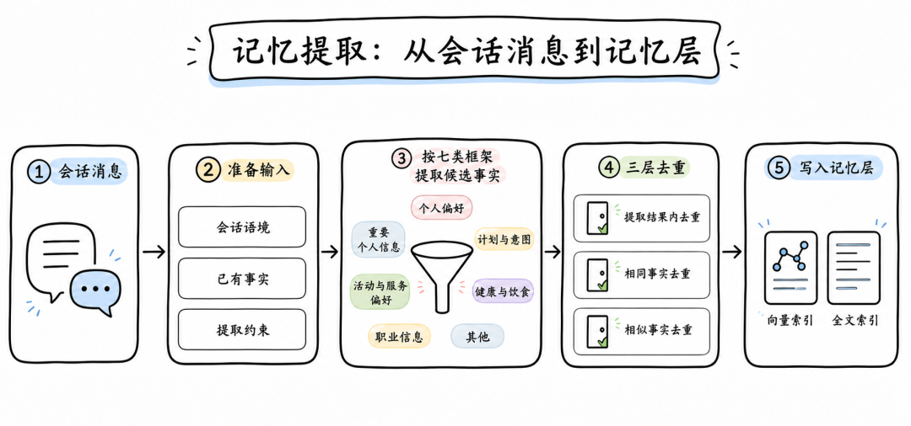

在货拉拉自研记忆系统中，我们没有直接把任务调度提交的这批会话消息压成一段摘要，因为它们仍保留着原始会话的表达方式：消息按先后顺序出现，有的信息依赖前后文才能理解，一段会话里也常常混有请求、补充、确认和多个独立主题。

我们将会话消息提炼为可独立理解的候选事实，而不是直接把原始表达作为长期记忆：

* **直接保留整段会话：** 保留了完整的原始信息，但每次使用时都要从整段消息里重新翻找、辨认哪些信息真正相关。

* **压缩成一段摘要：** 内容更短，但会把多条独立事实揉成一段话，压缩时还容易丢掉具体条件和细节。

会话记录需要保留当时表达的完整证据，后续使用又需要能够独立理解、准确检索的信息单元。我们用记忆提取连接这两者：从会话消息中识别值得长期保留的信息，并写成一条条候选事实。**每条候选事实都要在脱离原始会话后仍能独立理解，因此才能成为后续检索、去重、更新和长期维护的对象。**

### 3.2.2 准备输入 ###

候选事实要脱离原始会话后仍能独立理解，因此提取时不能只看当前消息。比如司机说“那就下周再联系”，只有结合前文才能知道联系的是什么；新信息还要与已有事实比对，才能判断它是在补充、修正还是重复。

记忆提取需要三类输入：

| 判断需要 |        对应输入         |            解决什么问题             |
|------|---------------------|-------------------------------|
|理解当前消息|  本轮会话消息、同一会话近期聊天记录  |   提供候选事实的原始依据，补足当前表达所处的会话语境   |
|比对已有信息|近期提取的事实、根据本轮输入召回的相关事实|避免连续处理时重复提取，判断本轮信息是新增、补充、冲突还是重复|
|确定判断边界| 观测日期、用户主动配置的重点关注内容  |  标注消息实际发生的时间，明确本次提取应优先关注的范围   |

我们只带入完成判断所需的信息，避免把全部历史再次送入模型。

### 3.2.3 提取候选事实 ###

候选事实形成前，我们先划清新旧信息的边界。一轮会话可能再次提到已有的人、项目或偏好，也可能在其中补充新的事件、变化和细节。提取阶段的职责，是先识别这些新增信息；已有事实的合并、覆盖或删除，留给后续记忆管理处理。

### 3.2.3.1 提取范围 ###

提取范围先回答两个问题：**信息来自哪里，以及它是否可能在后续会话中继续有用**。只有同时通过这两层判断的内容，才会进入候选事实。

### 消息来源

* **用户消息：** 用户透露的稳定背景、偏好、计划、经历，以及请求中带出的具体条件，都可能成为候选事实；用户提供的文档、数据或其他资料中，明确且后续可能复用的信息也应被识别出来。

* **AI 消息：** 只有后续会话仍需依赖、且来源可追溯的业务信息，才可以成为候选事实；已确认的约定、任务结果和需要继续执行的结论都属于这类信息。系统必须保留其来源，避免把 AI 的建议、推测或推荐误写成用户自己的偏好和经历。

* **不提取的内容：** 问候、客套确认、空泛评价、对原话的简单复述，以及仅描述当下情绪或一次性状态的表达，不应直接写入长期记忆。

提取时还需要覆盖常见的长期信息。以下七类是我们设置的一组检查维度（而非最终的存储分类），避免只抓取最显眼的话题、遗漏后续可能继续使用的信息。

|  类别   |         关注的信息          |      为什么需要关注      |
|-------|------------------------|-------------------|
| 个人偏好  |       喜好、厌恶、使用习惯       | 直接影响后续回答、推荐和沟通方式  |
|重要个人信息 |    稳定背景、关系、地点和重要日期     |   为跨会话交流提供基本背景    |
| 计划与意图 |      目标、打算和即将发生的事      | 后续可继续跟进进展、变化或完成情况 |
|接单与服务偏好|订单类型、常跑区域、装卸条件和服务费用等具体选择|让后续推荐和服务能够匹配司机的实际需求|
| 健康与饮食 |     饮食限制、运动和健康相关信息     |     关系到建议是否适用     |
| 职业信息  |     工作角色、工作习惯和职业目标     |    影响协作方式与服务内容    |
|其他具体事实 | 前六类未覆盖、但可能被继续追问或补充的信息  |  避免有效信息因分类不足而被忽略  |

以货运司机的表达为例：

|   会话中的信息    |是否进入候选事实|                 原因                  |
|-------------|--------|-------------------------------------|
|   “我开面包车”   |   是    |   车辆类型属于相对稳定的职业背景，会影响可承接订单和后续推荐。    |
|  “我常在东城区跑”  |   是    |        常跑区域是持续服务和订单匹配的重要条件。         |
| “我爱接搬家的订单”  |   是    |         反映明确的接单偏好，可用于后续推荐。          |
|“没有电梯的订单不太爱接”|   是    |   补充了偏好的适用条件，不能只保留“爱接搬家订单”这一半信息。    |
| “今天这单货主挺磨叽” |   否    |        这是对一次订单的即时评价，缺少长期意义。         |
|   “跑得有点累”   |   否    |属于当下状态，除非后续反复出现并形成可确认的持续问题，否则不进入长期记忆。|

这七类维度的作用是**让提取阶段同时看到稳定背景、明确偏好、计划意图和具体经历**；其中计划即使尚未发生，只要表达明确，也可以保留为后续验证和跟进的依据。

### 3.2.3.2 候选事实的质量要求 ###

会话语境、已有事实和时间信息都只是本次提取的判断依据；真正写出的候选事实，还应满足以下要求。

|   要求   |                           具体含义                            |
|--------|-----------------------------------------------------------|
| 有明确依据  |候选事实只能来自本轮会话消息。近期聊天记录、已有事实和观测日期只用于理解、比较或解释时间，不能补入消息中未出现的细节。|
| 保留变化语境 |      独立话题分别提取；涉及变化时，保留变化前后、发生时间、原因和限制条件，避免只留下孤立的新状态。      |
|脱离会话仍可理解|          单独被检索时也能看懂；人名、地点、数字、专有名词和适用条件不能泛化为笼统说法。          |
|不改变事实含义 |    可以去掉口语和寒暄，但不能改变事实、动机或表达的原意；“下周”等相对时间应根据观测日期换为明确日期。     |
|  明确来源  |       区分信息来自用户还是 AI，避免把 AI 的建议、承诺或说明误写成用户自己的事实或偏好。        |

例如，司机说：“我之前常跑东城区，上个月搬到西城区了。下个月打算换辆厢式货车。你上次说这批货是易碎品，需要特殊处理。”可以提取出三条候选事实：

* **司机此前常跑东城区，上个月搬到西城区：**这条信息保留了区域变化的前后状态和时间，不能只压缩成“司机在西城区”。

* **司机计划下个月更换厢式货车：** “厢式货车”是具体条件，不能泛化为“司机准备换车”。

* **AI 已告知司机，本批货物为易碎品，需要特殊处理：** 这记录的是一次已经发生的沟通，来源必须标为 AI；不能写成“司机认为这批货需要特殊处理”。

提取完成后，系统通过去重避免同一事实以多个副本进入记忆；但去重删除的是副本，不是重复出现的证据——同一事实再次被提及时，系统仍记录这次的时间和来源，作为后续判断记忆稳定性的参考信号。

### 3.3 记忆管理：候选事实如何成为有生命力的记忆 ###

### 3.3.1 记忆由哪些部分组成 ###

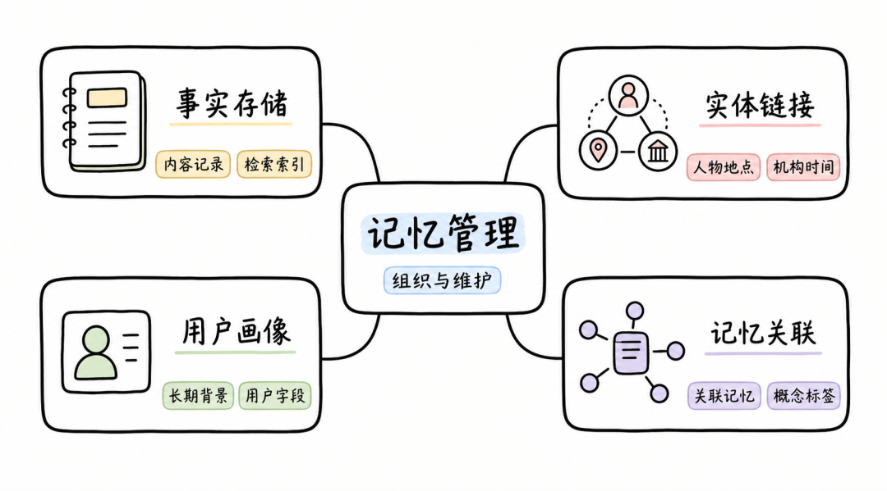

会话消息经过提取和去重后，会写成一条条候选事实。此时，每条事实都可以独立理解，却仍只是彼此分散的记录：仅凭单条事实，无法判断哪些信息指向同一位用户、哪些内容共同构成当前背景，也难以为后续更新、关联检索和维护提供统一依据。

候选事实进入记忆后，货拉拉自研记忆系统继续为它补上可维护的组织结构，而不重新从会话中提取信息。这部分由四项能力共同完成：

* **事实存储：** 保存事实内容、来源、状态和管理信息，为更新、删除、审计和检索建立唯一依据。

* **实体链接：** 把同一人物、地点、机构或时间涉及的多条事实连接起来，让分散记录能够围绕同一个对象被理解和查询。

* **用户画像：** 从多条事实中维护用户较稳定、可跨会话复用的背景；一次性的表达不会直接成为长期属性。

* **关联记忆与概念标签：** 记录事实之间的关联，以及它们涉及的主题和概念，为关联展开、主题检索和后续维护提供线索。

### 3.3.2 事实存储 ###

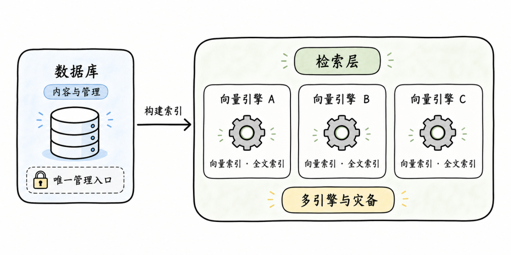

**我们将事实主记录与检索索引分开，是为了同时解决两类问题：** 一方面，事实会被更新、删除、合并和审计，需要一份一致、可追溯的主记录；另一方面，后续查询又要按语义和关键词快速从大量事实中找出相关内容。两类需求的访问方式不同，因此不由同一种存储承担。

|结构 |           主要职责           |        保存内容        |
|---|--------------------------|--------------------|
|数据库|保存事实主记录，承担更新、删除、去重、状态管理和审计|事实内容、来源、去重键、状态及其他元数据|
|检索层|     为事实建立可快速查询的派生索引      |向量、全文索引、事实标识及必要的检索字段|

这一分工带来两项关键设计：

* **唯一管理入口：** 更新、删除、合并和审计都先作用于数据库中的事实主记录，再同步更新检索索引。这样不会出现两套存储各自修改、内容逐渐偏离的情况。

* **多引擎与灾备：** 检索层不承担唯一的数据保存职责。更换检索引擎、同时接入多个引擎，或某个检索引擎异常时，都可以根据数据库中的主记录重新建立索引，事实内容和管理状态不会丢失。

因此，数据库负责“事实是否仍然成立、应当怎样变化”，检索层负责“在当前问题下哪些事实值得先被找到”。**这项存储设计既保证了长期维护的一致性，也让检索能力可以独立扩展和替换。**

### 3.3.3 实体链接 ###

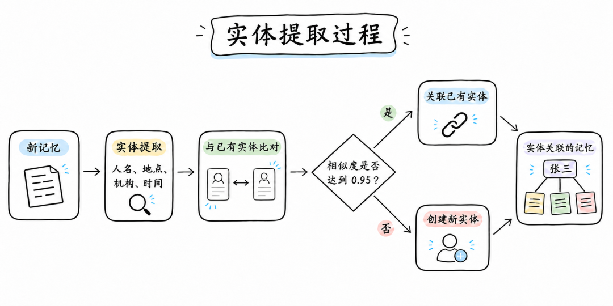

一条事实可以独立保存和检索，但同一人物、地点或机构往往分散出现在多条事实中。仅靠事实内容，系统难以判断这些记录是否指向同一个对象，也难以在需要时把相关经历、偏好和状态一起找回。

**实体链接为事实补上跨记录的关联入口，从事实中识别具有稳定指向的信息作为关联键，而非直接用整条事实。**人物、地点、机构和时间是四类主要的关联入口：

|类型 |          说明          |      举例       |
|---|----------------------|---------------|
|人物 |      事实涉及的具体人名       |     张三、李明     |
|地点 |事件发生或信息所指向的城市、国家、园区等地点|    北京、中关村     |
|机构 |    公司、学校、团队等组织名称     |   货拉拉、清华大学    |
|时间 |  事实中明确出现的日期、时段或时间范围  |2026 年 7 月、周五上午|

**实体与事实之间是多对多关系：**一条事实可以关联多个实体，同一个实体也可以连接多条事实。例如，“司机下个月更换厢式货车”可以关联司机本人和计划时间；围绕同一位司机的多条事实，则能够通过该实体被一起展开。

### 3.3.4 用户画像 ###

事实记录的是发生过什么：一次沟通、一个计划、一项偏好或一次状态变化。我们没有把所有事实直接汇总成画像，而是维护后续会话中反复需要的稳定背景，例如怎样称呼、性别是什么、从事什么工作以及使用什么语言。没有这层集中背景，每次都需要从多条事实中重新拼装对用户的基本理解。

系统提供一组默认字段，项目也可以根据自身业务补充需要长期维护的字段：

| 默认字段  |        保存什么         |
|-------|---------------------|
|  称呼   |用户明确表达的姓名、昵称或希望被使用的称呼|
|  性别   |      用户明确表达的性别      |
|年龄／人生阶段| 年龄、出生年份或青年、中年等人生阶段  |
| 常驻地区  | 长期居住或主要生活的城市、地区、国家  |
|  语言   |   常用语言、方言或语言使用偏好    |
| 职业／工作 |  行业、岗位、职务或在职、求职等状态  |

**画像为后续会话提供已有的理解起点，但它不是静态档案。新的事实出现后，系统仍需判断它是补充背景、改变已有字段，还是只应作为一段独立经历保留。**

### 3.3.5 记忆关联与概念标签 ###

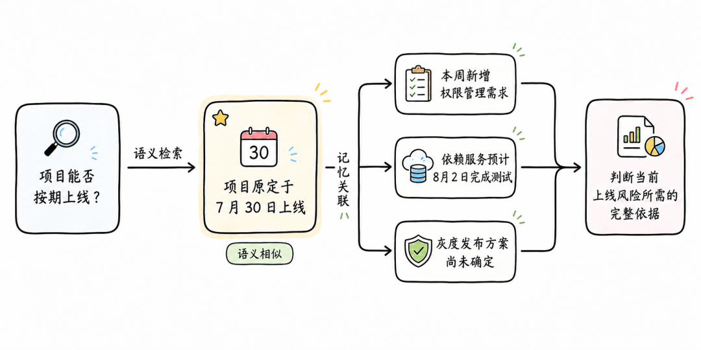

面对“项目能否按期上线？”这样的查询，我们需要找回的不是一条最相似的记忆，而是一组能够共同支撑判断的信息。语义检索可能先命中“项目原定于 7 月 30 日上线”，再通过关联记忆补回已经确认需要一并理解的事实。

|        记忆        |在“能否按期上线”中的作用|    单独有它为什么不够    |
|------------------|-------------|-----------------|
| 项目原定于 7 月 30 日上线 |   提供原始计划    |只能说明原定目标，不能反映当前变化|
|    本周新增权限管理需求    |   补充范围变化    |  不知道是否影响排期和依赖   |
|依赖服务预计 8 月 2 日完成测试|   补充外部依赖    | 测试完成时间晚于原定上线日期  |
|    灰度发布方案尚未确定    |   补充发布策略    |  上线方式和风险控制仍不明确  |

**关联记忆连接的正是这类需要一并理解的内容。**新事实写入时，我们会标记它与已有事实之间的关联；查询命中其中一条后，再按已建立的关联批量取回相关事实。这样补回的是已经确认与当前判断密切相关的信息，不必在查询时临时推断所有可能关系，也不会把全部语义相似内容都塞进结果。

关联记忆与实体链接解决的不是同一个问题：

| 结构 |        它回答的问题        |
|----|----------------------|
|实体链接|这些记忆是否指向同一个人、地点、机构或时间？|
|关联记忆|  理解这条记忆时，还应结合哪些记忆？   |

概念标签则记录一条事实大致涉及哪些主题。它为后续检索、筛选和维护留下主题线索，不表示记忆之间的因果、先后或必须共同返回的关系。

|概念标签|     可以标记的记忆      |  便于后续知道什么   |
|----|------------------|-------------|
|项目排期| 项目原定于 7 月 30 日上线 |  项目当前的时间安排  |
|需求范围|    本周新增权限管理需求    |  范围是否发生变化   |
|系统依赖|依赖服务预计 8 月 2 日完成测试|上线还受哪些外部条件制约 |
|发布策略|    灰度发布方案尚未确定    |上线方式和风险控制是否明确|

一条记忆可以带有多个概念标签。例如，“灰度发布方案尚未确定”既属于“项目排期”，也属于“发布策略”。关联记忆补足的是判断所需的具体材料，概念标签保留的是主题线索；两者都不改写事实内容，却让分散的事实能够被更准确地检索、组合和维护。

### 3.4 混合检索：怎样找到需要的记忆 ###

### 3.4.1 检索的职责 ###

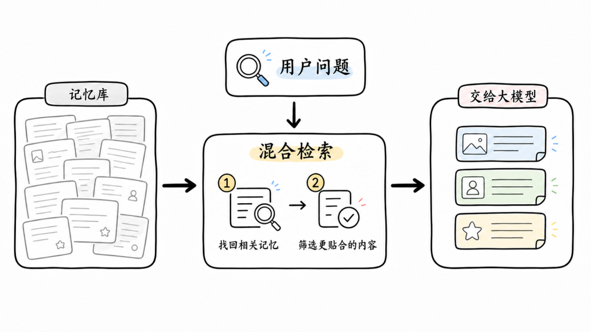

经过提取和管理，过去会话中值得保留的信息会持续沉淀为记忆，货拉拉自研记忆系统在读取阶段只向大模型提供与当前问题相关的有限记忆。记忆的保存与读取，面对的是两种不同的要求：

* **保存时：** 希望尽可能完整。今天暂时用不到的信息，未来可能与新的问题重新产生关系。

* **读取时：** 希望足够聚焦。大模型面对当前问题，只应看到真正有助于判断的信息，而不是一整段不断增长的历史。

为在完整保存与聚焦读取之间建立连接，我们将一次查询拆成两个相互衔接的步骤，最终交给大模型的是一组围绕当前问题筛选出的有限记忆：

1. **三路召回：** 从语义、关键词和具体对象三个角度扩大候选范围，尽量找全与当前问题相关的事实记忆。

2. **两阶段排序：** 先融合不同召回方式提供的信号，再判断候选与当前问题的实际匹配程度，筛出最适合交给大模型的内容。

### 3.4.2 三路召回 ###

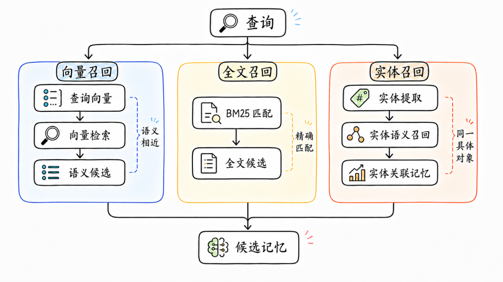

用户问题通常同时包含三类线索：想表达的含义、关键词或固定说法，以及具体的人、地点、机构或时间。单一召回方式很难兼顾三者：只看语义，可能忽略专有词和明确条件；只看关键词，又容易漏掉措辞不同但含义相近的记忆。

为补足这三类线索，我们组合向量、全文和实体三种召回方式；它们在当前设计中的职责并不相同：

|召回方式|      它弥补什么       |  在当前设计中的位置   |
|----|------------------|--------------|
|向量召回|   措辞不同、含义相近的信息   | 确定候选记忆的基础范围  |
|全文召回|   关键词、缩写、固定表达    |只对向量候选补充精确匹配信号|
|实体召回|围绕同一人物、地点、机构或时间的信息|只对向量候选补充具体对象信号|

向量召回先确定值得进一步判断的候选范围，全文和实体召回再对这些候选补充权重，而不直接扩展候选集合。这样的组合避免了将三类结果简单合并后带来大量噪声，同时保留关键词和具体对象对排序的影响。

**三路召回以语义覆盖为基础，并补充精确表达和具体对象的匹配信号，为后续两阶段排序提供范围适当、信息更完整的候选记忆。**

### 3.4.3 两阶段排序 ###

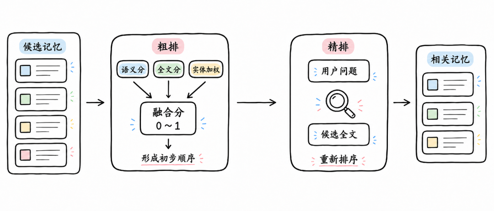

三种召回给出的分数含义和范围并不相同，不能直接相加；因此先用粗排校准、融合成初步顺序，再由精排结合候选内容，判断其是否真正贴合问题。

### 3.4.3.1 粗排 ###

一条候选记忆可能同时被语义、全文和实体检索命中，也可能只出现在其中一两种检索结果里。粗排先把这些检索结果给出的分数调整到可比较的范围，再按本次实际命中的召回方式融合，形成候选的初步顺序。

**语义检索分数：** 向量检索使用经过 L2 归一化的查询向量与记忆向量计算相似度，并换算为 0～1 的分数。

语义分内积查询向量记忆向量

查询向量和记忆向量先经过 L2 归一化，消除向量长度对结果的影响；此时内积等价于余弦相似度。系统使用内积完成 Top-K 检索，**既按语义方向比较相近程度，也能在记忆规模持续增长时保持较低的检索时延。**

**全文检索分数：** BM25 原始分没有固定上限，不能直接与语义分相加。系统先按用户问题里的词语数量选择一组预设参数，再用 Sigmoid 将它映射到 0～1。

全文分原始分

其中，m 是判断匹配强弱的参照点，k 控制曲线陡峭程度。它们不是每次都临时计算出来的，而是按用户问题里的词语数量从固定参数表中选择：

|用户问题里的词语数量| m  | k |
|----------|----|---|
| 不超过 3 个  |5.0 |0.7|
|  4～6 个   |7.0 |0.6|
|  7～9 个   |9.0 |0.5|
| 10～15 个  |10.0|0.5|
| 超过 15 个  |12.0|0.5|

用户问题越长，BM25 原始分通常越高。系统按词语数量选择 m 和 k，**将不同长度问题下的原始分转换为统一的匹配强度**；分数越接近 1，表示全文匹配越强。

**实体加权分数：** 实体加权让候选中与具体对象相关的记忆获得补充信号，但不单独决定候选范围或最终位置。因此，它只作为辅助权重参与融合。

实体加权实体相似度关联记忆数

一个实体关联的记忆越多，说明它的指向范围越广，补充权重应随之降低；同一候选命中多个实体时，只保留最强的一次实体加权。

**融合分：** 三类分数相加后，按本次实际命中的召回方式计算最大可能分。

融合分语义分全文分实体加权最大可能分

|  实际命中的方式   |最大可能分|
|------------|-----|
|    仅语义     | 1.0 |
|  语义 + 全文   | 2.0 |
|语义 + 全文 + 实体| 2.5 |

每条候选都按本次实际命中的方式计算最大可能分，再换算为 0～1 的相对分。这样比较的是候选在自身可获得信号中的匹配强度，而不是它命中了多少种召回方式。粗排据此形成初步顺序，供精排继续处理。

### 3.4.3.2 精排 ###

粗排已经从大量候选中排出了初步顺序，但它比较的仍是语义分、全文分和实体加权。排在前面的候选，仍可能只包含相近词语或相关背景，未必能直接支持当前问题的判断。

**粗排主要依据可计算的检索信号，适合快速缩小范围；精排则同时阅读用户问题和候选记忆的内容，判断两者是否真正相关。**比如查询“这单货什么时候要送到”时，“送货前需要提前联系收货人”没有给出具体时间；“这单货 8 月 15 日下午送到”才是真正的答案。

### 3.4.4 检索不只找回事实记忆 ###

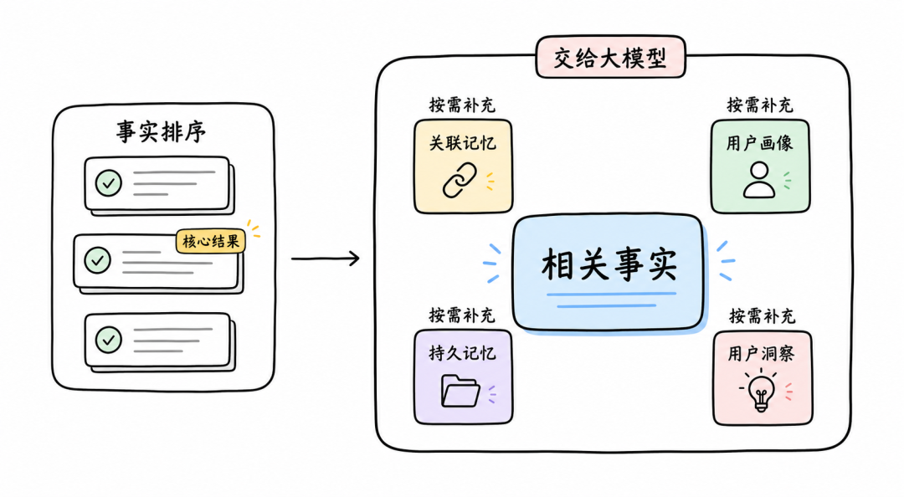

两阶段排序首先返回与当前问题最贴合的事实记忆，它们构成检索的核心结果。我们交给后续回答的，不只是一组相似记忆：关联、画像、持久记忆和用户洞察承担的作用不同，有的补充命中事实的背景，有的提供稳定状态，有的保留长期确认的重要信息，因此按各自的规则返回，并由调用方按需开启。

|结果类型|       返回方式       |      主要作用      |
|----|------------------|----------------|
|事实记忆|   经三路召回与两阶段排序    | 找到最贴合用户问题的具体信息 |
|关联记忆|根据命中事实已保存的关联标识批量展开|  补齐理解该事实所需的背景  |
|用户画像|    直接读取当前用户画像    |提供稳定、可跨会话复用的用户背景|
|持久记忆|   直接返回已晋升的持久记忆   |提供经过长期维护确认的重要信息 |
|用户洞察|     单独进行语义召回     | 补充跨多条事实沉淀出的判断  |

其中持久记忆和用户洞察来自离线侧维护（下一篇展开），在线检索只负责按需取回。

这些结果共同构成大模型的最终输入，使大模型能够基于历史对话回答当前问题，而非每次都从零开始。

## 四、总结

在线侧要回答的，是前言留下的那个问题：历史该怎样被整理成能持续使用的状态。它的做法是把会话拆成一条条可独立理解的事实，再为它们补上关联、画像和标签，让分散的记录成为可维护、可取回的整体。

这套能力之所以拆成四步，是因为每一步要解决的问题不同：会话要完整地进入处理，事实要脱离上下文仍能看懂，记忆要可关联可维护，检索要只取回当前真正相关的内容。把判断分散到不同阶段，新信息才能既尽快可用，又不丢失可继续维护的结构。

这样，历史消息就从按时间堆积的原始内容，变成不断积累、可被准确取回的记忆。

至于这些记忆长期积累后如何去重、更新、避免过时与冲突，是离线侧的职责，我们留到下一篇。

> ❝
>
> 部门｜货拉拉／技术中心／智能平台部  
> 作者｜胡报、徐正昊、石岩、袁根义、李将、张婷
>
>

