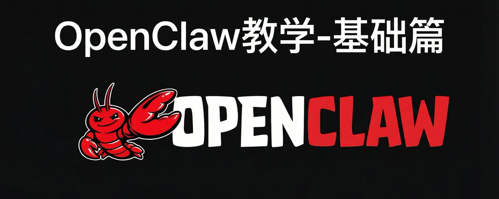
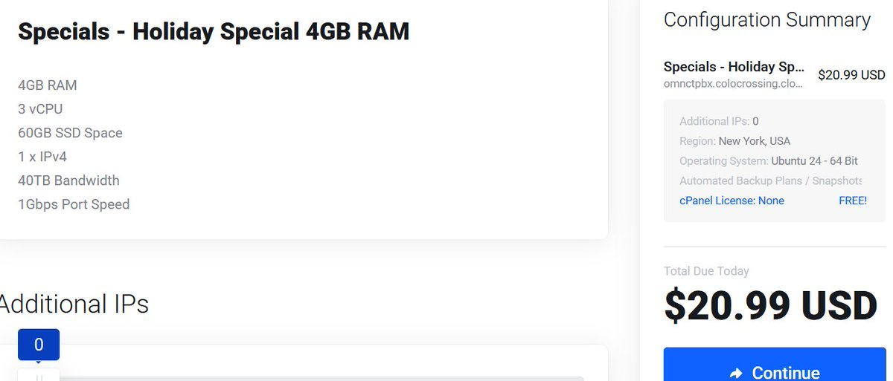
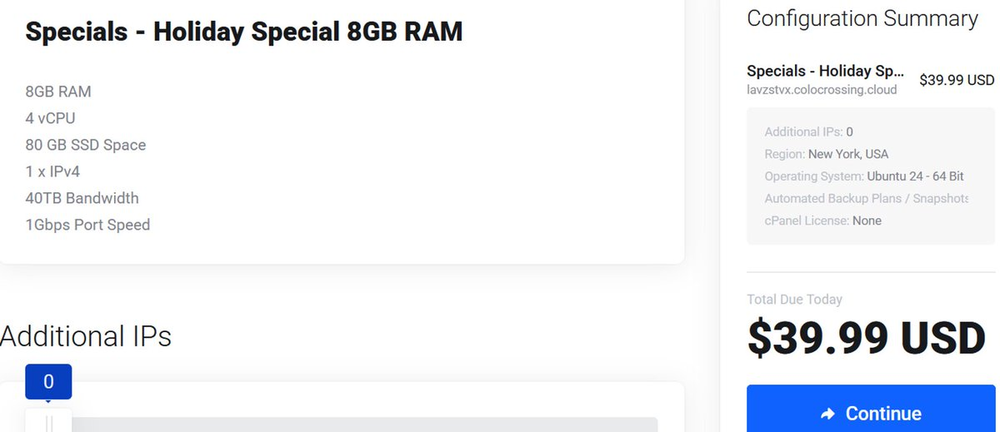

# 📰 OpenClaw 保姆级教程（基础篇）

之前答应大家要出openclaw教学，现在来啦！

这是我们openclaw教学的第一篇，大家可以先码住，之后的计划会再出3-5篇，讲中高阶的详细用法

## 一、先搞清楚 OpenClaw 到底是什么

OpenClaw 本质上是一个本地运行的 AI 网关

它的架构很简单：

→ 你的电脑跑一个 Gateway 进程（理解为中转站）
→ Gateway 连接你的聊天软件（Telegram/Discord/WhatsApp）
→ Gateway 再连接 AI 模型（Claude/GPT/DeepSeek）
→ 你在 Telegram 发消息 → Gateway 转给 AI → AI 回复转回 Telegram

为什么要这么设计

因为大部分 AI 服务（Claude、GPT）都没有直接提供 Telegram 机器人，你要么用网页版，要么用 App

但 OpenClaw 让你可以在任何聊天软件里和 AI 对话，而且所有记忆、配置都存在你自己电脑上（\~/.openclaw/），没有隐私泄露风险

## 二、前期准备｜别急着装，先把这些搞定

1\. 硬件与系统要求

Mac 用户：最省心，原生支持 macOS
Windows 用户：必须装 WSL2（Windows Subsystem for Linux），强烈建议用 Ubuntu 22.04
Linux 用户：直接开干

如果你想 24 小时挂机，建议：

- Mac Mini（最省电，官方推荐）

- 云服务器 VPS（DigitalOcean 12 美元/月起，Hostinger 也可以，国内的也行）

2\. 大模型 API 准备

OpenClaw 支持几乎所有主流模型，但你需要提前准备好 API Key

推荐方案对比：

ChatGPT Plus 订阅（[⭐](https://abs-0.twimg.com/emoji/v2/svg/2b50.svg)[⭐](https://abs-0.twimg.com/emoji/v2/svg/2b50.svg)[⭐](https://abs-0.twimg.com/emoji/v2/svg/2b50.svg)[⭐](https://abs-0.twimg.com/emoji/v2/svg/2b50.svg)[⭐](https://abs-0.twimg.com/emoji/v2/svg/2b50.svg)）

$20/月，官方白名单支持，最省心

阿里云百炼 Coding Plan（[⭐](https://abs-0.twimg.com/emoji/v2/svg/2b50.svg)[⭐](https://abs-0.twimg.com/emoji/v2/svg/2b50.svg)[⭐](https://abs-0.twimg.com/emoji/v2/svg/2b50.svg)[⭐](https://abs-0.twimg.com/emoji/v2/svg/2b50.svg)[⭐](https://abs-0.twimg.com/emoji/v2/svg/2b50.svg)）

¥100-200/月，国内稳定，通义千问 Qwen3-Max/kimi k2.5 非常不错

OpenRouter（[⭐](https://abs-0.twimg.com/emoji/v2/svg/2b50.svg)[⭐](https://abs-0.twimg.com/emoji/v2/svg/2b50.svg)[⭐](https://abs-0.twimg.com/emoji/v2/svg/2b50.svg)[⭐](https://abs-0.twimg.com/emoji/v2/svg/2b50.svg)）

按量付费，约 $3-15/天，多模型切换，适合测试

AI/ML API（[⭐](https://abs-0.twimg.com/emoji/v2/svg/2b50.svg)[⭐](https://abs-0.twimg.com/emoji/v2/svg/2b50.svg)[⭐](https://abs-0.twimg.com/emoji/v2/svg/2b50.svg)[⭐](https://abs-0.twimg.com/emoji/v2/svg/2b50.svg)）

按量付费，支持多模型，OpenClaw 官方集成伙伴

Kimi K2.5（[⭐](https://abs-0.twimg.com/emoji/v2/svg/2b50.svg)[⭐](https://abs-0.twimg.com/emoji/v2/svg/2b50.svg)[⭐](https://abs-0.twimg.com/emoji/v2/svg/2b50.svg)[⭐](https://abs-0.twimg.com/emoji/v2/svg/2b50.svg)）

按量付费，月之暗面积极支持 OpenClaw

中转站（[⭐](https://abs-0.twimg.com/emoji/v2/svg/2b50.svg)[⭐](https://abs-0.twimg.com/emoji/v2/svg/2b50.svg)[⭐](https://abs-0.twimg.com/emoji/v2/svg/2b50.svg)）

便宜但不稳定，风险高

Ollama 本地模型（[⭐](https://abs-0.twimg.com/emoji/v2/svg/2b50.svg)[⭐](https://abs-0.twimg.com/emoji/v2/svg/2b50.svg)[⭐](https://abs-0.twimg.com/emoji/v2/svg/2b50.svg)）

完全免费，零成本但效果差，适合学习

我的建议：

- 新手先用 OpenRouter 或 AI/ML API，按量付费，不浪费

- 确定要长期用了，再上个chatgpt的订阅，其实挺合适的

- 千万别一上来就搞中转站，翻车了排查问题你都不知道是模型问题还是配置问题

3\. 翻墙环境（重要）

Telegram 和 Discord 都需要翻墙才能连接

你需要：

- Clash Verge / Clash for Windows / Surge

- 一个稳定的机场节点

- 开启 TUN 模式（这个很多人忘了，不开 TUN 模式，终端走不了代理）

验证方法：

curl -I https://api.telegram.org

如果返回 200，说明你的终端能访问 Telegram API

## 三、正式安装｜跟着走不会错

Step 1: 安装 Homebrew 和 Node.js

打开终端（Terminal），先装 Homebrew:

/bin/bash -c "$(curl -fsSL https://raw.githubusercontent.com/Homebrew/install/HEAD/install.sh)"

装完后安装 Node.js：

brew install nodejs

验证安装：

node --version  # 应该显示 v22.x.x 或更高
npm --version

重要：OpenClaw 要求 Node.js 版本≥22，低于这个版本会报错

Step 2: 安装 OpenClaw

推荐方式（官方向导）：

curl -fsSL https://openclaw.ai/install.sh \| bash

这个脚本会自动帮你：

- 安装 OpenClaw CLI 工具

- 创建配置目录（\~/.openclaw/）

- 设置环境变量

安装完成后，运行：

openclaw --version

看到版本号就说明装好了

Step 3: 启动配置向导

这是最关键的一步：

openclaw onboard --install-daemon

--install-daemon 参数会让 OpenClaw 在后台持续运行，即使重启电脑也会自动启动

接下来会进入交互式向导，分几个环节：

## 四、配置流程｜这里是大部分人卡住的地方

4.1 选择 AI 模型提供商

向导会列出：

- OpenAI (GPT)

- kimi...

- ....

- 跳过（Skip）

如果你有官方账号：直接选对应的，然后会跳转浏览器授权

如果你用第三方 API（OpenRouter、中转站等）：选择 Skip

跳过后，向导会继续，别担心，我们后面手动配置

4.2 选择聊天平台

向导会问你要连接哪个平台：

● Telegram (Bot API)  ← 推荐新手
○ WhatsApp (QR code)
○ Discord (Bot API)
○ Slack
○ 跳过（Skip）

为什么推荐 Telegram：

- 配置最简单（3 分钟搞定）

- Bot 创建无需审核

- 支持长消息和文件传输

- 有完整的 Bot 管理面板

Discord 适合什么人：

- 已经有 Discord 服务器的团队

- 需要多人协作的场景

- 配置时间约 10 分钟[【7\]](https://docs.openclaw.ai/channels/discord)

这里我们先选 Telegram

4.3 创建 Telegram Bot

打开 Telegram，搜索 @BotFather（这是官方的机器人工厂）

发送 /start 开始对话

然后按顺序发送：

1. /newbot（创建新机器人）

1. 输入你的 Bot 显示名称（比如：我的 AI 助手）

1. 输入 Bot 用户名（必须以\_bot 结尾，比如：ai\_bot）

成功后，BotFather 会返回一个 Token，格式类似：

1234567890:ABCdefGHIjklMNOpqrsTUVwxyz

复制这个 Token，回到终端，粘贴进去

4.4 完成初始配置

向导会问你要不要安装 Skills（技能插件），比如：

- Web 搜索

- 邮件管理

- 日历同步

- 文件操作

新手建议先跳过，等基础功能跑通了再慢慢加

配置完成后，向导会自动启动 Gateway：

✓ Gateway started on http://127.0.0.1:18789
✓ Telegram channel connected
✓ Ready to chat!

## 五、配置第三方 AI 模型

如果你在 4.1 选择了 Skip，现在需要手动配置模型（以下步骤强烈推荐用 cursor 等变成助手来完成！！！）

方法 1: 通过 Web UI 配置（推荐）

打开浏览器，访问：

http://127.0.0.1:18789

这是 OpenClaw 的控制面板

点击 Settings → Models → Add Provider

填入你的 API 信息：

- Provider Name: 自定义（比如 openrouter）

- Base URL: 你的 API 地址

- API Key: 你的密钥

- Model ID: 具体模型名（比如claude-opus-4）

保存后，在 Telegram 里给你的 Bot 发消息测试

方法 2: 直接编辑配置文件

打开配置文件：

nano \~/.openclaw/openclaw.json

找到 models.providers 部分，添加：

{
  "models": {
    "providers": {
      "openrouter": {
        "baseUrl": "https://openrouter.ai/api/v1",
        "apiKey": "your-api-key-here",
        "api": "openai-completions",
        "models": \[
          {
            "id": "anthropic/claude-opus-4",
            "name": "Claude Opus 4",
            "reasoning": true
          }
        \]
      }
    }
  },
  "agents": {
    "defaults": {
      "model": {
        "primary": "openrouter/anthropic/claude-opus-4"
      }
    }
  }
}

保存后重启 Gateway：

openclaw restart

方法 3: 使用 AI/ML API（官方集成）

如果你用 AI/ML API，安装时可以直接用他们的专用版本：

npm install -g openclaw-aimlapi@latest

这个版本会自动配置好 AI/ML API 的 Skills

## 六、配置网络代理｜让你的 AI 能访问外网

很多人配完发现 Bot 不回消息，大概率是代理没配对

确认你的代理端口

打开 Clash Verge，查看：

- HTTP 端口（一般是 7890）

- SOCKS5 端口（一般是 7891）

设置环境变量

编辑 shell 配置文件：

\# 如果用zsh（Mac默认）
nano \~/.zshrc

\# 如果用bash
nano \~/.bashrc

在文件末尾添加：

export http\_proxy=http://127.0.0.1:7890
export https\_proxy=http://127.0.0.1:7890
export all\_proxy=socks5://127.0.0.1:7891

保存后重新加载：

source \~/.zshrc  # 或 source \~/.bashrc

重启 OpenClaw:

openclaw restart

验证代理是否生效：
在 Telegram 给 Bot 发消息：帮我搜索一下 OpenClaw 的最新更新

如果能返回结果，说明代理配置成功

## 七、进阶配置｜让 AI 真正好用起来

7.1 配置个性化 SOUL

OpenClaw 支持自定义 AI 的性格和行为规则

编辑文件：

nano\~/.openclaw/workspace/SOUL.md

写入你的要求，比如：

\# 我的AI助手人格设定

\- 称呼我为「老板」
\- 回复风格：简洁专业，不说废话
\- 擅长领域：产品设计、技术架构、内容创作
\- 禁止事项：不要主动闲聊，不要说「很抱歉」这种客套话

保存后，AI 会按照这个设定来回复你

7.2 安全配置（这个必须做）

OpenClaw 因为权限太大，被安全研究员警告过风险

必须设置的安全措施：

1. 限制 API 花费上限
在你的 API 提供商后台（OpenRouter/Claude 等）设置每日/每月预算上限

1. 开启敏感操作确认
编辑配置文件，找到 tools 部分：

{
  "tools": {
    "exec": {
      "enabled": true,
      "approvalRequired": true  // 执行命令前需要你确认
    },
    "email": {
      "enabled": true,
      "approvalRequired": true  // 发邮件前需要你确认
    }
  }
}

1. 不要把 OpenClaw 暴露到公网 
Gateway 默认监听 127.0.0.1:18789，只有本机能访问，千万别改成 0.0.0.0

## 八、常见问题排查

问题 1: Bot 不回消息

排查步骤：

\# 1. 检查Gateway是否运行
openclaw status

\# 2. 查看日志
openclaw logs --tail 50

\# 3. 测试模型连接
openclaw agent --message "测试" --thinking high

如果 logs 里看到 ECONNREFUSED 或 timeout，是网络代理问题
如果看到 401 Unauthorized，是 API Key 错误
如果看到 rate limit，是你的 API 额度用完了

问题 2: 端口被占用

报错：Error: listen EADDRINUSE: address already in use :::18789

解决：

\# 找到占用端口的进程
lsof -i :18789

\# 杀掉进程（PID是上一步查到的数字）
kill -9 &lt;pid&gt;

\# 重启OpenClaw
openclaw restart
&lt;/pid&gt;

问题 3: Telegram 配对失败

如果 Bot 创建了但配对不上：

\# 查看配对码
openclaw pairing list

\# 手动批准配对
openclaw pairing approve telegram &lt;你的Telegram User ID&gt;

你的 User ID 可以在 Telegram 搜索 @userinfobot 获取

## 九、成本与选择建议

最后聊聊成本，这个很多教程不会告诉你

最低成本方案（约 30 元/月）：

- Ollama 本地模型

- Telegram

- 自己的电脑 24 小时开机（电费约 20 元/月）

- 总计：20-30 元/月

性价比方案（约 150 元/月）：

- OpenRouter 按量付费（约 100 元/月，轻度使用）

- Telegram（免费）

- 云服务器 VPS（约 50 元/月）

- 总计：150 元/月

土豪方案（约 1000 元/月）：

- 直接用claude api（大概1000元）

- Mac Mini 本地运行（一次性投入 3000 元）

- 总计：首月 4000+，后续 1000+/月

我的建议：先用性价比方案跑 1-2 周，确定自己真的会用，再考虑升级

## 十、写在最后

OpenClaw 的核心价值不是「又一个 AI 聊天工具」

而是把 AI 从「打开浏览器→登录→对话→复制结果」这个流程，缩短到「在 Telegram 发一条消息」

这就是超级个体需要的生产力工具：无缝、随时、记忆连续

但它也不是万能的，目前的问题包括：

- 更新太快，文档跟不上（一周好几个版本）

- Skills 质量参差不齐，有些有安全风险

- 配置复杂度对小白不太友好

但这些都不妨碍它成为 2026 年最值得折腾的开源项目

如果你遇到问题，不要急着放弃

善用 Claude Code 或者直接在 OpenClaw 的 GitHub 提 Issue

技术永远是为人服务的，搞不定就让 AI 帮你搞定

### 🖼️ Attached Media

## 💬 Replies

### 1 @wellback000 (wellback000)

*Tue Mar 03 08:04:25 +0000 2026*

@yaohui12138 telegram那个已经过期了，现在的openclaw对权限要求比较严。 不给权限用不了的。  参见这个文档[docs.openclaw.ai/channels/teleg…](https://docs.openclaw.ai/channels/telegram#dm-policy)

### 2 @yaohui12138 (超级个体｜柿子) (Author)

*Tue Mar 03 08:07:37 +0000 2026*

@wellback000 感谢补充

### 3 @zkbupt (Bamboo)

*Mon Mar 02 06:14:12 +0000 2026*

@yaohui12138 开启 TUN 模式很重要，必要时安装一个proxychains4

### 4 @yaohui12138 (超级个体｜柿子) (Author)

*Mon Mar 02 06:39:36 +0000 2026*

@zkbupt 是的

### 5 @hehao0755 (何炎昶)

*Mon Mar 02 16:49:32 +0000 2026*

@yaohui12138 你好 可以配置飞书教学吗？

### 6 @yaohui12138 (超级个体｜柿子) (Author)

*Mon Mar 02 17:54:44 +0000 2026*

@hehao0755 飞书没什么难度，唯一需要注意的就是长链接的配置

### 7 @SuBoya00 (SuBoya)

*Mon Mar 16 15:44:05 +0000 2026*

@yaohui12138 claude api一天就烧了我一百多😇

### 8 @yaohui12138 (超级个体｜柿子) (Author)

*Mon Mar 16 16:53:50 +0000 2026*

@SuBoya00 给你找个逆向用哈哈哈哈

### 9 @bugjay4 (Bugjay)

*Tue Mar 17 03:42:37 +0000 2026*

@yaohui12138 telegram 是真好配置，反应也非常迅速。每天最大的开销是在检查网络🤣

### 10 @yaohui12138 (超级个体｜柿子) (Author)

*Tue Mar 17 03:44:45 +0000 2026*

@bugjay4 是的

### 11 @firestars0924 (Firestars)

*Tue Mar 03 14:05:31 +0000 2026*

@yaohui12138 学习一下。谢谢大神。

### 12 @yaohui12138 (超级个体｜柿子) (Author)

*Tue Mar 03 15:02:06 +0000 2026*

@firestars0924 感谢你的知识

### 13 @Aiyayatt (扯淡)

*Mon Mar 02 15:15:27 +0000 2026*

@yaohui12138 写的好，详细清晰。辛苦了。

### 14 @yaohui12138 (超级个体｜柿子) (Author)

*Mon Mar 02 15:23:08 +0000 2026*

@Aiyayatt 感谢你的支持

### 15 @Cheng5491188501 (老抽色的熊)

*Tue Mar 03 16:02:56 +0000 2026*

@yaohui12138 感谢大佬，收益匪浅！

### 16 @yaohui12138 (超级个体｜柿子) (Author)

*Tue Mar 03 16:36:01 +0000 2026*

@Cheng5491188501 也感谢你的支持

### 17 @Michell81147285 (Michelle)

*Tue Mar 03 00:40:40 +0000 2026*

@yaohui12138 码住，好期待你有线下分享会啊，即便无法实现😂

### 18 @yaohui12138 (超级个体｜柿子) (Author)

*Tue Mar 03 01:12:42 +0000 2026*

@Michell81147285 没事，线上也可以分享给大家很多

### 19 @0xJason (0xJason 杰哥)

*Tue Mar 03 17:32:15 +0000 2026*

@yaohui12138 同感！不错！[x.com/i/status/20276…](https://x.com/i/status/2027693356135158147)

### 20 @xiaoxiaogg99 (Crypto晓峰.BTC.DOGE)

*Tue Mar 03 08:10:12 +0000 2026*

@yaohui12138 文章

OpenClaw 保姆级教程

### 21 @ShikiHuang (-iiikiii-)

*Thu Mar 05 04:13:01 +0000 2026*

@yaohui12138 @readwise save thread

### 22 @shaweeenx (shaweeen)

*Tue Mar 03 14:52:50 +0000 2026*

@yaohui12138 感谢这么细致分享，点赞

### 23 @Zhaomean (ccccc)

*Tue Mar 03 07:24:11 +0000 2026*

@yaohui12138 @grok mark

### 24 @jun01629909 (jun)

*Mon Mar 02 19:46:58 +0000 2026*

@yaohui12138 @grok  mark

### 25 @zhaofan201 (Z)

*Mon Mar 02 16:10:28 +0000 2026*

@yaohui12138 @grok Mark一下

### 26 @serverinfo_cc (服务器资讯)

*Mon Mar 02 12:54:20 +0000 2026*

@yaohui12138 对于云服务器VPS方案，我这有个更实惠的美国服务器，很适合安装龙虾：
配置一： 3核CPU / 4GB内存 / 60GB 高速 SSD 硬盘
价格： 年付20.99美元，续费同价。
 [go.serverinfo.cc/ccs03](https://go.serverinfo.cc/ccs03)

配置二： 4核CPU / 8GB内存 / 80GB 高速 SSD 硬盘
价格： 年付39.99美元，续费同价。
 [go.serverinfo.cc/ccs04](https://go.serverinfo.cc/ccs04) 

### 27 @ResearchWang (Researcher_王十三)

*Tue Mar 03 03:24:06 +0000 2026*

@yaohui12138 保姆级 才更有人看吗？ 😭

### 28 @xiaomin06048391 (xiaoming)

*Mon Mar 02 09:28:35 +0000 2026*

@yaohui12138 Win系统如果让他写代码，写文件，发送是不是必须安装ubantu 在这里面操作的

### 29 @yushen686 (YuShen)

*Mon Mar 02 06:05:11 +0000 2026*

@yaohui12138 五分钟部署教学（甚至不需要）了解一下：[x.com/yushen686/stat…](https://x.com/yushen686/status/2027941224615972975)

### 30 @ZX19842111 (时雨 valor)

*Mon Mar 02 16:31:32 +0000 2026*

@yaohui12138 @grok 出了本地API，帮我找到其他免费的AP I让我下载open claw，或者你帮我想办法怎么免费使用open claw

### 31 @Eric_onlyu (大超学长)

*Wed Mar 04 16:43:47 +0000 2026*

@yaohui12138 Homebrew 安装成功了，为什么会这样？如下
brew install nodejs
-bash: brew: command not found

### 32 @buu99y (LiberSum)

*Fri Mar 06 05:03:02 +0000 2026*

@yaohui12138 openclaw restart
有这个命令吗....

