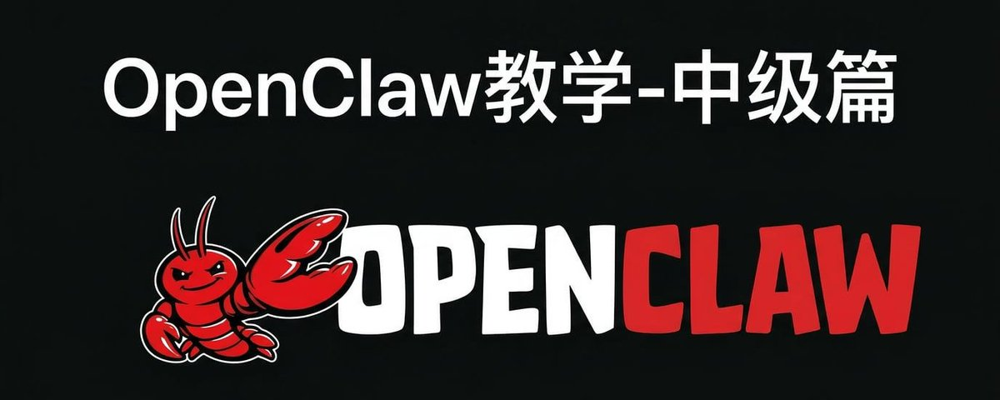

# 📰 openclaw保姆级教学（中级篇）

之前答应大家要出openclaw教学，现在来啦！

这是我们openclaw教学的第二篇，如何让「能用」变为「好用」？

很多人刚安装上openclaw第一个问题就是：为什么这么傻？和大家说的怎么不一样？

其实背后的原因，我认为：

不是模型问题，不是prompt问题
是「能用」到「好用」之间差了三件事：记得住、找得到、断不了

我把踩过的所有坑总结成了一套方法论，我们一件一件说

一、记得住——记忆体系

你让agent帮你学React，聊了一下午，它记住了你的进度、踩过的坑、下一步该学什么
过几天你再问他，它全忘了——你是谁、学到哪了、昨天聊了什么，全部从零开始
你得重新教它一遍，而且你也不知道为什么会这样
每天花10分钟重复教agent，一个月就是5个小时，全浪费了

怎么解决？

我来说下我的方案，我在实际使用中总结了一套三层记忆模型：

Tier 1 信息层 → 原始记录，学习笔记、对话记录，存在 memory/learning/ 目录下，只追加不删除，按需检索
Tier 2 知识层 → 每日提炼，工作日志、重要决策、提炼后的知识点，每天一个文件 memory/YYYY-MM-DD.md（这个是openclaw自带的）
Tier 3 智慧层 → 长期记忆，跨领域洞察、底层规律、核心方法论，存在 [MEMORY.md](http://memory.md/) 里，控制在100行以内，每次session都加载

灵感来自人类的记忆方式——你不会记住每天看过的所有文字，但你会记住提炼后的知识点，最终形成底层的思维模式

然后是7个核心文件，各管各的，互不重复：

[AGENTS.md](http://agents.md/) → 怎么工作（工作流程、操作规范）
[SOUL.md](http://soul.md/) → 我是谁（人格特质、核心原则）
[USER.md](http://user.md/) → 我服务谁（用户偏好、决策模式）
[TOOLS.md](http://tools.md/) → 怎么操作（工具手册、配置说明）
[MEMORY.md](http://memory.md/) → 我记得什么（长期记忆、方法论）
[ERRORS.md](http://errors.md/) → 我在哪里失败过（错误记录、避坑指南）
[SHARED.md](http://shared.md/) → 团队共识（多agent共享信息）

核心原则就一条：一个信息只存一个地方。之前我犯过同一个规则在四个文件里重复写的错误，更新时漏改，agent就精神分裂了

说个之前踩的大坑——

我的学习笔记 345KB / 8509行，被一次cron任务的write操作直接覆盖成了 9.9KB

原因是我让agent追加内容到文件，但模型选了write而不是edit

write = 覆盖整个文件内容，edit = 在指定位置追加

一个月的学习记录几乎全丢

从此定下铁律：写入已有文件永远用edit追加，绝不用write覆盖

这条规则现在写在我每个agent的ERRORS.md和SHARED.md里，所有agent启动就知道

再简单说下Heartbeat——这是 OpenClaw 的定时触发机制，默认每30分钟执行一次

为什么要介绍这个？因为我们之前只是实现了记忆的存储架构，但是记忆的动态吸纳不能光靠openclaw本身带的机制，这样的机制还是很弱

那我们如何解决动态吸纳机制这个问题

答案就是heartbeat机制，我设置每6小时进行一次记忆深化整理，一天4次刚好覆盖工作时段

整理流程：读取最近的日志文件 → [提炼到MEMORY.md/USER.md/ERRORS.md/每日记忆](http://xn--memory-or3jl87iwky.md/USER.md/ERRORS.md/%E6%AF%8F%E6%97%A5%E8%AE%B0%E5%BF%86) → 清理过时信息

搭好这套记忆体系之后，你的agent能做到什么？
→ 学习场景：你昨天学到React Hooks第三章，今天agent自动知道，接着第四章学习
→ 工作场景：你的代码风格偏好、项目架构约定，agent永远记得，不用每次重复说
→ 团队场景：新建一个agent，[它自动读取ERROR.md](http://xn--error-r96ho4edyz8q5flbva.md/)，第一秒就知道团队所有规矩和踩过的坑
不是agent变聪明了，是你给了它一个不会丢的大脑，这才是openclaw的灵魂

openclaw确实很厉害，但是不会搭agent框架的人用这个，还是就像小孩拿激光枪，虽然威力巨大，但是用不明白

二、找得到——搜索决策树

记忆搭好了，但agent还是会在搜索上反复栽跟头

先说我当时有多混乱——OpenClaw里搜索工具一大堆：web\_fetch、curl、browser，还有各种第三方的
每次让agent抓个网页，它就开始乱试。用web\_fetch → 失败（SSRF拦截了）→ 试图改配置绕过 → 系统异常 → 换curl → 成功了

同一个坑，agent A踩了，agent B还会再踩一遍。每次搜索任务光试错就要花5-10分钟，浪费30-50%的token

更要命的是——我当时试图在openclaw.json里加dangerouslyAllowPrivateNetwork来绕SSRF，不但没用，还搞出了系统异常。后来才知道SSRF保护是硬编码的，配置根本改不了

这是第一个关键认知：不要试图改底层配置，要建备用方案

转折点是我发现了一个免费的全网搜索工具，装上之后自动变成OpenClaw Skill，所有agent直接可用
全网语义搜索、网页阅读、YouTube字幕提取，全都免费，不需要API key，当然这个工具也不重要，我更想告诉大家的是要学会去找别人造好的轮子

测完之后我发现它能覆盖80%的搜索场景，剩下20%的特殊情况各有各的解法

所以我建了一套统一的搜索决策树：
第一步判断：是否需要JS渲染或登录态？
→ 需要，直接用browser

→ 不需要，用我指定的免费工具

→ 该工具也失败，按错误类型切：SSRF拦截用curl，其他错误用web\_fetch，都失败才上browser
特殊规则也得文档化：GitHub搜索只能用browser、B站IP被封只能用browser、自己的仓库用gh CLI

效果：搜索任务从5-10分钟试错变成不到1分钟直接命中，token开销砍了一半

但这套方案最有价值的不是决策树本身，而是背后的思路——[我把它写进了SHARED.md](http://xn--shared-2e8iz3sv2yo5obhbt334a.md/)

所有agent启动时自动读取，我踩过的坑，新建的agent第一秒就知道

一个人踩过的坑，其他人不用再踩。[中控agent负责维护SHARED.md](http://xn--agentshared-z18qq24sp7cp85lbn2b7ba.md/)，有更新就广播通知所有agent

这个思路不只是搜索能用——任何工具选择的场景都能这么干：

识别重复问题 → 调研工具 → 建决策树 → 文档化 → 写入共享文件 → 全team受益

从个人经验到团队知识，这是一次升维，在AI时代，这才是最重要的：不要单干，agent就是你的员工，你要学的是管理

三、断不了——计划文件模式

记得住、找得到，但还有一个几乎没人提过的隐蔽问题

你有没有遇到过这种情况：agent在做一个复杂任务，做到一半突然问你——你让我做什么来着？

你以为是bug，重启了session，让它重新开始。又做到一半，又忘了

不是bug，是OpenClaw的正常机制——context窗口有限，对话太长就会自动压缩，删掉旧的对话和工具结果来释放token

如果你的任务状态只存在对话里，压缩一次就全丢了。大部分人遇到这个问题会觉得是OpenClaw不好用，其实是不知道这个机制存在

知道了原因，解法就清楚了——既然context会消失，那就别把关键状态只存在context里

我的做法：收到复杂任务时，先创建一个计划文件 temp/任务名-plan.md

文件结构很简单：目标（一句话）+ 步骤列表（带checkbox）+ 当前进度 + 遇到的问题 + 下一步
每完成一步就更新文件、打勾

context被压缩时，文件不受影响——新session开始读取计划文件，接着上次的进度继续

任务完成后删除或移到归档任务中，作为外部知识库的一部分

而且Heartbeat检查时也能发现进行中的任务，主动向你汇报进度

效果有多夸张？

你晚上睡觉，agent在跑一个20步的任务。中间context压缩了3次，跨了2个session

早上起来，它读完计划文件，接着昨天的第15步继续干，中间没丢任何进度

你睡了一觉，agent帮你干了一夜的活，如果你不加这个机制，效果就难说了

本质上这就是把短期记忆（context）里的关键状态，外化到长期存储（文件）里

和前面三层记忆模型的逻辑一样：重要的东西不能只存在会消失的地方

三个模块讲的是三件事，但底层是同一个道理

以上给大家讲的是框架层面的解法

但每一件的落地细节才是真正的门槛——记忆文件的写入规则有7种分类、搜索决策树的具体的逻辑、计划文件的模板和自动化检查怎么设置

这些我全写了，这就是完整的中级篇

中级篇是完整的落地手册：

\[记忆架构\] 7种信息实时写入规则 + 每个文件的配置模板 + Heartbeat完整代码
\[搜索与决策\] 决策树每个分支的参数配置 + Agent Reach安装 + 6层产品思维模型
\[协作机制\] SHARED.md完整模板 + 广播代码 + 计划文件自动化
\[实战\] 4个完整场景演示 + 各工具详细用法 + 8个Q&A

一共13个主题，每个都有代码块和配置可以直接抄

高级篇也在写了，方向是：
→ 自定义Skill开发（让你的数字员工自己学会新技能）
→ MCP/claude code集成使用（如何才能稳定调用外部工具链）
→ STATE.yaml项目管理（多agent协作的状态同步）
→ 目标驱动自主任务（agent自己拆解目标并执行）
→ 性能优化和token管理
→ hook应用：让你的openclaw拥有"潜意识"

做推特到现在1w多粉了，一直没开过社群

不是不想，是觉得没准备好——我不想建一个只有我单向输出的群，那和公众号没区别

直到这套agent体系跑通之后，我发现有一件事比教程更有价值：一群正在用的人互相交叉验证

所以我建了第一个社群：超进化个体

你能拿到什么：

【内容】
→ 中级篇+高级篇完整教程，13个主题，飞书文档持续更新，我出的所有教程都会附带我的龙虾帮我总结的文档内容，大家直接复制给自己的龙虾即可获得经验和知识

【互动】
→ 我本人在群里集中答疑，每1/2天 定时半个小时-个小时，基本上在群里的问题，我看到就会回复
→ 群友共建，你的实战案例可以被收录进教程

【资源】
→ （可能会有）自用claude使用站推荐，帮助你低成本获得最顶级的AI使用权
→ 500元/小时的1v1咨询（原价1500），AI、自媒体、商业都可以聊
→ 你的好内容我会优先quote助推，1w粉的曝光直接给你

最后提到价格，首发价 149，限50人

50人之后阶梯涨价，每次涨100，200人封顶不再开放

这只是一个小门槛，用来筛选一些真的认可我的人，因为我也不想自己的心血给到我不认可的人

未来真正跑出来的超级个体就那么几个，我赌这个群里会出

（高级篇包括：

第一节 Skill——岗前培训  - 核心概念：Skill = 知识注入，按触发词按需加载  - 杀手案例：日报 Skill，50 字指令变 3 字

第二节 Hook——定 SOP  - 核心概念：Hook = 反射弧，代码直接跑不问 LLM

第三节 MCP——开系统权限  - 核心概念：MCP = USB 接口，统一外部服务调用

第四节 自主任务——独立负责项目  - 核心概念：从指令驱动到目标驱动  - 杀手案例：给一个目标，agent 自己拆 6 步执行）

### 🖼️ Attached Media

## 💬 Replies

### 1 @yaohui12138 (超级个体｜柿子) (Author)

*Mon Mar 16 14:30:03 +0000 2026*

最后说一句，大家付出100块，我一定让大家得到1w块的价值，绝不辜负大家的信任，这是我最基础的承诺 

### 2 @AI_Jasonyu (鱼总聊AI)

*Mon Mar 16 13:52:48 +0000 2026*

@yaohui12138 柿子牛掰\~打Call

### 3 @yaohui12138 (超级个体｜柿子) (Author)

*Mon Mar 16 13:53:26 +0000 2026*

@AI\_Jasonyu 感谢鱼总！

### 4 @rionaifantasy (Rion Wu)

*Mon Mar 16 13:33:37 +0000 2026*

@yaohui12138 冲💪🏻

### 5 @yaohui12138 (超级个体｜柿子) (Author)

*Mon Mar 16 13:33:57 +0000 2026*

@rionaifantasy 感谢rion

### 6 @ai_muzi (木子不写代码)

*Mon Mar 16 18:41:35 +0000 2026*

@yaohui12138 加油啊

### 7 @yaohui12138 (超级个体｜柿子) (Author)

*Tue Mar 17 02:44:00 +0000 2026*

@ai\_muzi 感谢木子！

### 8 @cellinlab (Cell 细胞)

*Mon Mar 16 13:06:24 +0000 2026*

@yaohui12138 太快了！执行力拉满 Max！🫡

### 9 @yaohui12138 (超级个体｜柿子) (Author)

*Mon Mar 16 13:08:08 +0000 2026*

@cellinlab 嘿嘿，必须安排上！

### 10 @nopinduoduo (我真的没有拼多多)

*Mon Mar 16 14:11:40 +0000 2026*

@yaohui12138 支持支持

### 11 @yaohui12138 (超级个体｜柿子) (Author)

*Mon Mar 16 14:12:46 +0000 2026*

@nopinduoduo 感谢多多老师！

### 12 @zstmfhy (AI奶爸)

*Mon Mar 16 13:38:01 +0000 2026*

@yaohui12138 佩服佩服

### 13 @yaohui12138 (超级个体｜柿子) (Author)

*Mon Mar 16 13:38:19 +0000 2026*

@zstmfhy 感谢奶爸！

### 14 @Lonely__MH (Lonely)

*Mon Mar 16 13:43:23 +0000 2026*

@yaohui12138 有所学习，感谢分享。👍

### 15 @yaohui12138 (超级个体｜柿子) (Author)

*Mon Mar 16 13:49:54 +0000 2026*

@Lonely\_\_MH 感谢你的支持呀

### 16 @ai_xiaomu (黄小木)

*Tue Mar 17 03:01:28 +0000 2026*

@yaohui12138 挺好的，继续期待高级篇

### 17 @yaohui12138 (超级个体｜柿子) (Author)

*Tue Mar 17 03:03:21 +0000 2026*

@jayce49621288 感谢支持，高级篇马上就出

### 18 @RookieRicardoR (耳朵)

*Tue Mar 17 03:01:44 +0000 2026*

@yaohui12138 再给你的龙虾推荐一个 Skill 装装，每天高质量日报 [x.com/rookiericardor…](https://x.com/rookiericardor/status/2033704870587383815?s=46)

### 19 @yaohui12138 (超级个体｜柿子) (Author)

*Tue Mar 17 03:03:45 +0000 2026*

@RookieRicardoR 这个不错！直接给我🦐安装上

### 20 @anson7956 (秀才AI)

*Tue Mar 17 04:33:37 +0000 2026*

@yaohui12138 我来学习了

### 21 @yaohui12138 (超级个体｜柿子) (Author)

*Tue Mar 17 04:55:02 +0000 2026*

@anson7956 感谢支持！

### 22 @hezhiyan7 (droidHZ)

*Mon Mar 16 14:30:01 +0000 2026*

@yaohui12138 支持，向柿子老师学习

### 23 @yaohui12138 (超级个体｜柿子) (Author)

*Mon Mar 16 14:30:41 +0000 2026*

@hezhiyan7 感谢赫兹老师！

### 24 @imaxichuhai (阿西_出海（2.0版）)

*Mon Mar 16 14:00:03 +0000 2026*

@yaohui12138 支持

### 25 @yaohui12138 (超级个体｜柿子) (Author)

*Mon Mar 16 14:00:32 +0000 2026*

@imaxichuhai 感谢阿西老师

### 26 @RookieRicardoR (耳朵)

*Tue Mar 17 02:58:01 +0000 2026*

@yaohui12138 非常有用

### 27 @yaohui12138 (超级个体｜柿子) (Author)

*Tue Mar 17 03:00:29 +0000 2026*

@RookieRicardoR 感谢耳朵！

### 28 @boyuan_chen (Boyuan (Nemo) Chen)

*Mon Mar 16 18:19:11 +0000 2026*

@yaohui12138 openclaw 的 skill 系统用起来确实灵活，好奇中级篇有没有覆盖 sub-agent 编排那块？感觉那部分上手曲线最陡

### 29 @yaohui12138 (超级个体｜柿子) (Author)

*Mon Mar 16 18:25:03 +0000 2026*

@boyuan\_chen sub-agent？一般用多agent能解决大部分问题，你什么场景用到了sub呀

### 30 @Stevensun520417 (Stevensun)

*Mon Mar 16 15:08:39 +0000 2026*

@yaohui12138 必须支持一下

### 31 @yaohui12138 (超级个体｜柿子) (Author)

*Mon Mar 16 15:10:54 +0000 2026*

@Stevensun520417 感谢烙铁！

### 32 @RayneRydyR24824 (Chad要退休)

*Mon Mar 16 13:37:30 +0000 2026*

@yaohui12138 记忆层非常漂亮的设计，我自己设计的都是堆在一起，每次记忆学习总会漏掉不少内容，这套分层思路学习了，我回去修改下

### 33 @yaohui12138 (超级个体｜柿子) (Author)

*Mon Mar 16 13:38:05 +0000 2026*

@RayneRydyR24824 这是之前的，我又优化了一下，做好agent需要的是做系统的能力

