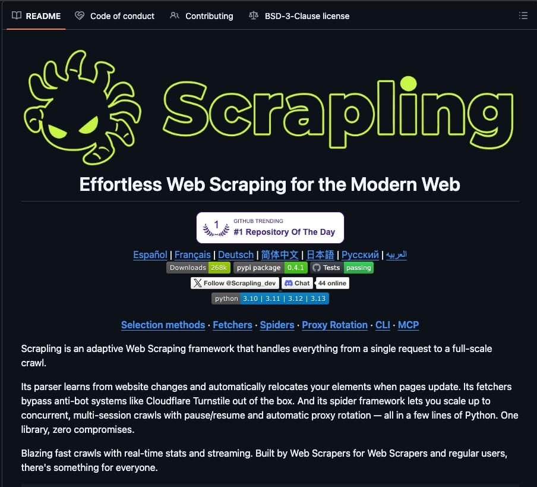

OpenClaw 现在可以抓取任何网站而不被屏蔽——零机器人检测，原生绕过 Cloudflare，比 BeautifulSoup 快 774 倍。

无需维护选择器。无需变通方案。只需数据。

这是不公平的优势，而且完全开源。
[github.com/D4Vinci/Scrapl…](https://github.com/D4Vinci/Scrapling) 

## 💬 Replies

### 1 @_Suresh2 (Suresh)

*Thu May 07 21:56:42 +0000 2026*

@0xluffy\_eth 774x faster, but the bottleneck is almost always the network, not the parser

### 2 @BlockInsight214 (王小庄)

*Thu May 07 13:13:37 +0000 2026*

@0xluffy\_eth OpenClaw 把网页抓取从技术壁垒变成了标准化武器，速度和隐蔽性直接拉开代差。  

这对 AI Agent 构建真实世界数据管道来说是降维打击，完全开源后普通开发者也能轻松拥有不公平优势。

### 3 @Andywang0416 (konghuang)

*Thu May 07 13:28:51 +0000 2026*

@0xluffy\_eth 其实没那么好用，还是要调用playwright

