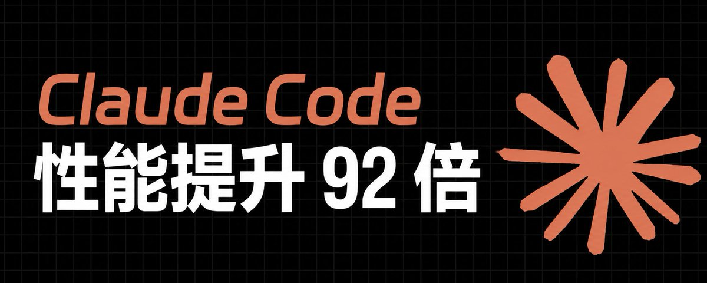

# 📰 如何将 Claude Code 的性能提升 92 倍

🧠 我拆解了 Claude Code 的 10 个核心指令系统：

90%的人都在用“聊天模式”，但真正的高手在用“执行系统”！

【一】开篇：你根本没在用 Claude Code

大多数人第一次接触 Claude Code 的时候，都会自然地把它当成一个“更强的 ChatGPT”。

问问题、改文章、生成内容、润色代码。

看起来很合理。

但问题是——这是一种完全错误的使用范式。

因为 Claude Code 从设计上就不是“聊天工具”。

它的底层逻辑是：

👉 一个可执行任务系统（Task Execution System）👉 一个上下文管理系统（Context Control System[）](https://abs.twimg.com/emoji/v2/svg/1f449.svg)
👉 一个文件级操作系统（File-native AI Agent）

换句话说，它不是“回答你问题的AI”，而是：

> 一个可以按照指令执行复杂工作流的“数字员工”

但绝大多数人，只把它当“会说话的助手”。

【二】为什么普通人永远用不好 Claude Code？

我观察过大量用户的使用方式，有一个非常稳定的模式：

- 写文章 → 让它润色

- 写代码 → 让它补全

- 做总结 → 让它压缩

- 改内容 → 反复对话

问题看起来不大，但核心致命点是：

> 他们在用“对话方式”驱动“系统级工具”

这就像：

- 你用Excel当聊天软件

- 或者用数据库当备忘录

能用，但完全浪费能力。

【三】真正的瓶颈：不是模型，是上下文

很多人会误以为：

“Claude Code 不稳定 / 越用越乱 / 输出变差”

但我做过一个非常明确的测试：

测试条件

- 同一任务

- 同一模型

- 两种使用方式：

① 长对话连续执行
② 每阶段 reset + 指令驱动

测试结果：

方式结果长对话模式输出发散、重复率高、结构崩坏指令系统模式输出稳定、结构一致、可控性高

真正原因只有一个：

👉 上下文污染（Context Contamination）

当对话超过一定轮数后：

- 历史规则干扰当前任务

- AI开始“补充不存在的逻辑”

修改行为变得不可控

token 被无效信息占满

本质不是模型变差，而是：

你没有管理它的“工作记忆”

【四】Claude Code 的真正能力结构

Claude Code 的能力可以拆成三层：

第一层：对话层（表面能力）

- 写文章

- 回答问题

- 生成代码

👉 这是90%用户看到的部分

第二层：系统层（核心能力）

- /clear（重置状态）

- /compact（压缩上下文）

- /rewind（时间回滚）

- /plan（结构设计）

👉 这是生产力的核心

第三层：控制层（高级能力）

- /goal（自动循环任务）

- /memory（长期规则）

- /effort（思考强度控制）

- @文件系统（直接注入上下文）

👉 这是“自动化系统级AI”的能力

【五】关键认知转变：从聊天 → 系统

如果只记住一句话，那应该是：

Claude Code 不是用来“聊”的，是用来“编排任务”的

🧱【六】10个核心指令系统（完整展开）

下面进入核心部分，这才是Claude Code真正的价值区。

[1️⃣](https://abs.twimg.com/emoji/v2/svg/31-20e3.svg) /clear：重置任务状态系统

很多人最大的问题是：

👉 一个对话干所有事情

但现实中：

写文章

改代码

做结构设计

这是三种完全不同的任务空间。

/clear 的本质

不是“清空聊天”，而是：

重置任务上下文环境

使用场景：

切换任务

开始新项目

避免历史污染

错误用法 vs 正确用法：

[❌](https://abs.twimg.com/emoji/v2/svg/274c.svg) 错误：一直在一个对话里堆任务
[✅](https://abs.twimg.com/emoji/v2/svg/2705.svg) 正确：一个任务一个 clean session

[2️⃣](https://abs.twimg.com/emoji/v2/svg/32-20e3.svg) /compact：上下文压缩机制

长对话必然会爆炸。

但你又不能一直重开。

所以 /compact 的意义是：

把对话压缩成“核心状态”

它做三件事：

提取关键结论

删除冗余过程

保留结构信息

本质：

👉 “记忆压缩算法”

使用最佳场景：

超过20轮对话

长期项目

多步骤任务

[3️⃣](https://abs.twimg.com/emoji/v2/svg/33-20e3.svg) /context：系统负载可视化

这是很多人忽略的命令，但非常关键。

它告诉你：

token用在哪

哪些信息在拖慢系统

是否需要 compact / clear

本质：

👉 AI的“任务资源管理器”

一个关键发现：

当上下文超过一定阈值：

输出质量下降

逻辑开始漂移

AI开始“自我补全”

[4️⃣](https://abs.twimg.com/emoji/v2/svg/34-20e3.svg) /rewind：时间回滚系统

这个功能的本质是：

把AI当成“可回放的执行环境”

应用场景：

修改写崩的文章

回退错误代码

撤销错误逻辑

本质：

👉 “版本控制 + 时间轴系统”

[5️⃣](https://abs.twimg.com/emoji/v2/svg/35-20e3.svg) /plan：结构优先机制

这是生产力分水岭。

大多数人是：

直接开始写

而高手是：

先设计结构，再执行

/plan 的核心作用：

拆解任务

生成步骤结构

减少返工

实测结果：

使用 /plan 后：

👉 返工率下降约 50%\~70%

[6️⃣](https://abs.twimg.com/emoji/v2/svg/36-20e3.svg) /effort：思考强度控制

这是一个“算力调节器”。

你可以控制：

简单任务

中等推理

深度分析

极复杂规划

本质：

👉 “AI大脑档位控制器”

错误用法：

让 AI 用最高强度做所有事

正确用法：

修错字 → low

写策略 → high

做架构 → ultra

[7️⃣](https://abs.twimg.com/emoji/v2/svg/37-20e3.svg) /memory：长期规则系统

这是 Claude Code 的“人格层”。

你可以定义：

写作风格

禁用词

输出结构

项目规则

本质：

👉 “长期行为约束系统”

最大价值：

不用重复解释规则

[8️⃣](https://abs.twimg.com/emoji/v2/svg/38-20e3.svg) @文件系统：上下文直接注入

传统AI流程：

复制 → 粘贴 → 解释 → 生成

Claude Code：

👉 @file → 直接读取

优势：

减少token浪费

减少误解

提高精度

本质：

👉 “文件级AI访问权限”

[9️⃣](https://abs.twimg.com/emoji/v2/svg/39-20e3.svg) /goal：自动执行循环系统

这是最接近“自动化AI”的能力。

你设定目标：

修改全部标题

统一风格

批量重构内容

系统会：

👉 自动循环执行 → 直到达标

本质：

👉 “目标驱动型AI Agent”

🔟 /btw：旁路任务系统

很多人不知道这个很关键。

作用：

不打断主任务

插入临时问题

不污染上下文

本质：

👉 “非阻断式提问通道”

📌【七】核心系统总结（可截图）

如果只记一页：

Claude Code 真正的使用方式：

用 /plan 设计任务结构

用 @文件注入上下文

用 /clear 切换任务环境

用 /compact 压缩长对话

用 /rewind 修复错误状态

用 /memory 固化规则

用 /goal 驱动批量执行

用 /context 控制系统负载

用 /effort 调节思考强度

用 /btw 保持主任务稳定

👉 本质只有一句话：

你不是在和 AI 对话，而是在编排一个可执行系统

🧱【八】认知升级：从工具到系统

大多数人失败的原因不是不会用AI，而是：

把系统当工具用

而高手的区别是：

把工具当系统控制

Claude Code 的真正价值不是：

写文章更快

写代码更强

而是：

👉 可以构建“可控的任务执行环境”

🧠【九】结尾

如果你看到这里，应该已经明白一件事：

Claude Code 的上限，从来不是模型能力，而是你是否在“系统化使用它”。

如果你只是聊天，那你只用了 10%-20% 的能力。

如果你开始用命令控制它，你才真正进入生产级阶段。

如果你要下一步，我可以帮你做更狠的版本：

👉 “Claude Code + 自动内容生产流水线（可直接赚钱的版本）”

### 🖼️ Attached Media

## 💬 Replies

### 1 @adamren2068 (《AI人文志》| AI & Effects)

*Mon Jul 06 17:10:39 +0000 2026*

醍醐灌顶！其实大多数人把 AI 当“军师”（问策），而 Claude Code 真正的范式颠覆在于它是“校尉”（带兵夺旗）。
补充博主提到的 Context Contamination（上下文污染），本质上就是人类组织里的“传话游戏效应”。对话轮数一多，熵增不可逆。用 /compact 和 /clear 就像是在代码上线前做一次内存回收（Garbage Collection）。
盲猜博主的后 5 个指令里绝对有关于 “多Agent协同”或者 “自定义个性化系统（.claudecode 配置文件）”的硬核玩法？坐等下篇更新！

### 2 @BruceD30612 (七夜聊 AI)

*Tue Jul 07 02:28:48 +0000 2026*

@0xluffy\_eth 自从知晓claude 那个bug 漏洞，监控用户，以后也不会在使用了。

### 3 @countquery (Cash)

*Mon Jul 06 07:52:45 +0000 2026*

@0xluffy\_eth 这一看就是gpt写出来的垃圾，言简意赅，全是有用的废话连篇

