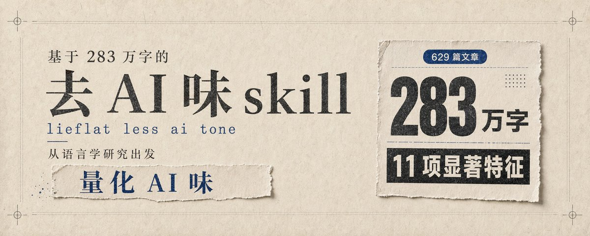
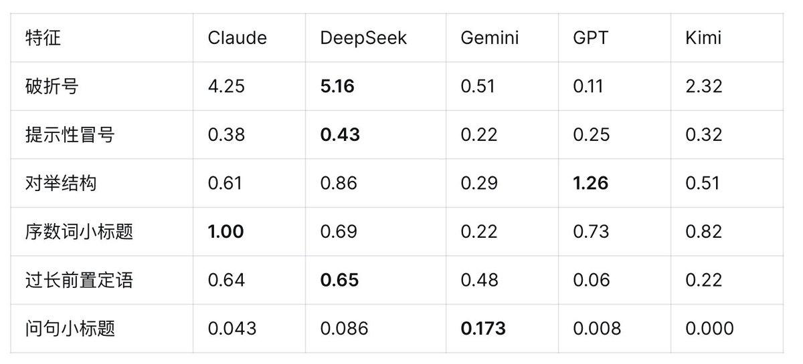
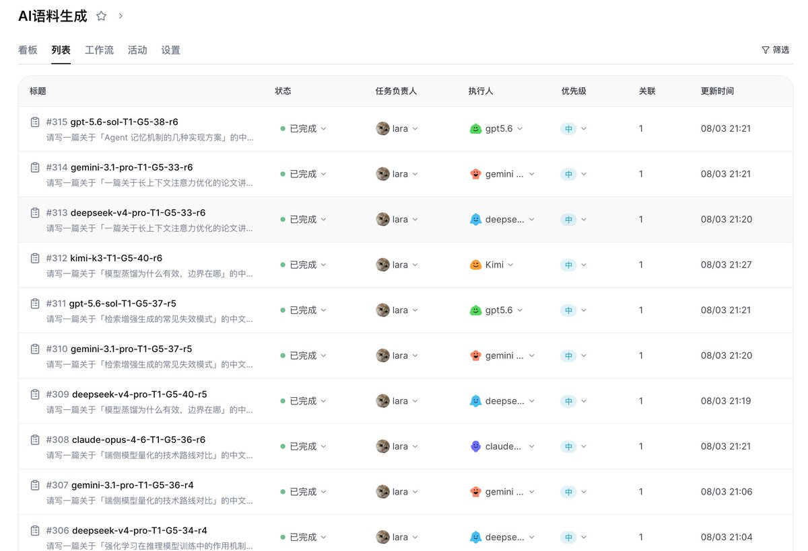
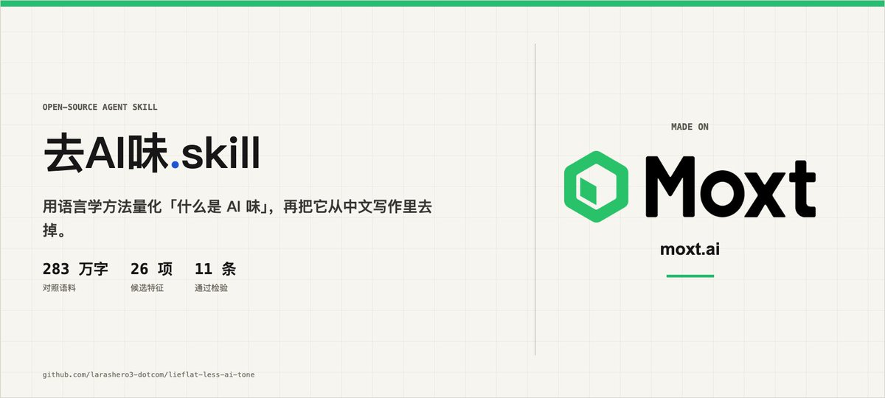
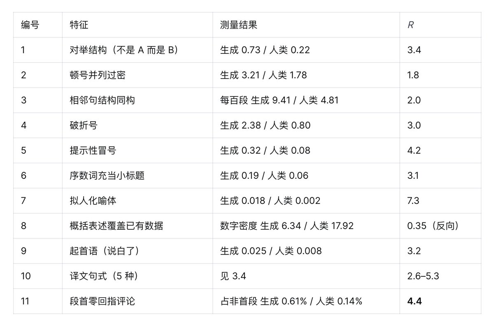
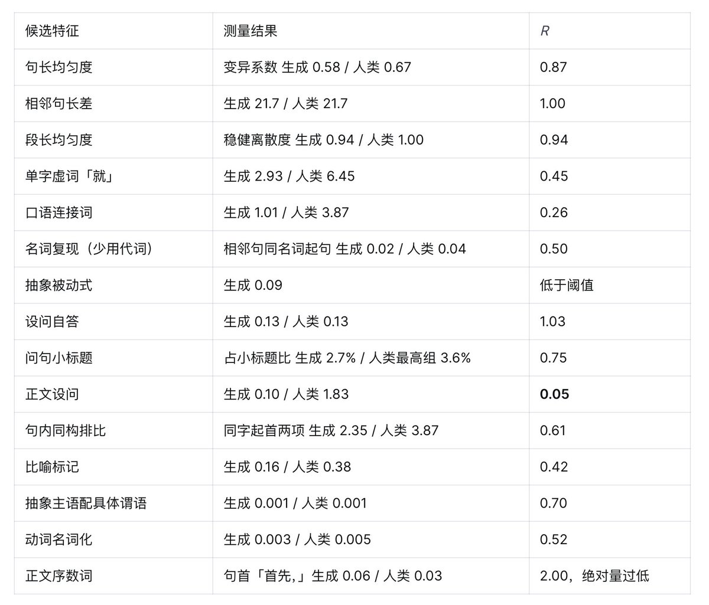

# 📰 做了一个可能有最多数据支撑的去 AI 味 skill

来源：[X 状态](https://x.com/zhiyu333/status/2099746344466579566) · [X 文章](https://x.com/i/article/2099702313078382592)

我每天都在用 AI 写东西，用到某个阶段之后，对它输出的某些句式产生了一种近乎生理性的厌恶，包括"不是A而是B"的对举结构，破折号滥用等等。

这些东西单独看都没问题，可能确实也是人类常用的句式，但它们以特定的密度和组合方式反复出现时，构成了一种可以被立即识别的气息，也就是某种“AI 味”。

互联网上不缺去 AI 味的开源项目，我也尝试过，效果也不错，但时间久了发现两个结构性问题：一是覆盖不全，很多 AI 味我能感觉到但规则里没写；二是误伤，有些规则把我自己的表达习惯也一并消灭了。这两个问题的根源是一样的，不少项目的来源大多是个案观察和凭语感的总结，没有被系统检验过。

于是，我有了一个想法，如果收集足够多的人类文章和 AI 文章，用语言学中对照实验的方法逐项比较各种语言特征的频率差异，看哪些特征真正具备区分力。这样，是不是可以用数据统计的方式，来量化"AI 味到底是什么"？

所以，我用 Moxt 做了一个基于283万字的去 AI 味 skill，目前已经开源到 GitHub。

项目地址在这儿：https://github.com/larashero3-dotcom/lieflat-less-ai-tone

这篇文章想分享下这个 skill 的制作过程、结论，以及我认为未来还可以努力的方向。做到最后，我意识到，去“AI 味”甚至是 AI 写作，这一整个能力，可能是更需要在模型预训练阶段解决的问题。

## 语料及研究方法

在整个实验中，语料是最为关键的部分。语料会直接影响脚本结果。

我一开始只用两个模型的 30 篇样本跑出了一批数据，得出了若干看起来很清晰的结论，比如"破折号是 Claude 独有的特征"。扩到 300 篇后，发现 DeepSeek 的破折号频率比 Claude 更高（每千字 5.16 vs 4.25），而 GPT 几乎不用（0.11）。

因此，如果结果要足够泛化，需要更多的样本数据，以免让单一模型的个体倾向被误读为 AI 共性。

具体来说，我选择了 329 篇真实的人类语料，共 164.8 万字。麻烦的是 AI 生成语料，不同模型需要使用同样的 Agent 环境，而且手动生成语料将会耗费大量时间。

所以，我建了一个 AI 语料生成的 workflow，可以帮我自动化跑完 300 个语料生成任务。这个 workflow 新建了 5 个 agent，每个agent 使用的是不同的主流写作模型，包括 Claude Opus 4.6、DeepSeek V4-Pro、Gemini 3.1 Pro、GPT 5.6 Sol、Kimi K3（长期用 AI 写作的朋友都知道这几个模型的含金量吧）。

我让这些模型都在和人类语料同样的话题和体裁下生成文章，并且还有严格控制的条件：不联网、不给任何风格指令，只提供话题。每个模型生成 60 篇，共 300 篇，我从下班开始启动这个 workflow，第二天上班已经全部跑完了。到这里，整个研究合计 629 篇文章，283 万字。

语料准备充分后，就是采用具体的量化方法。

我采用的是对每项候选特征计算频率，如果每项候选特征中， AI 语料使用频率是人类文章频率的两倍以上，就会被认为是显著的 AI 味特征。如果只是 0.8 到 1.25 倍之间，则视为无差异；小于 0.8 意味着人类用得更多，按这个方向改写只会让文章更不像人写的。

具体的研究方法中，还有更多的统计约束条件，包括人类侧各组数值不能相差 5 倍以上（排除体裁偏差），特征必须落实到可定位的句段和词形（排除依赖语义理解的判断）等等。

整个实验，我一开始测了 26 项候选特征，最终有 11 项结论显通过检验。

## 研究结论

显著特征

真正通过检验的 11 项，集中在篇章和结构层面，词汇和标点上反倒没那么明显。

区分力比较强的是段首零回指评论，AI 出现这种情况的频率是人类的 4.4 倍。它指的是 AI 写作在段与段之间缺少衔接，喜欢在新段落开头直接抛出一句评价（"听起来像一条功能描述"），却不交代评价的对象，读者得回头翻上文才知道说的是什么。

有意思的是，段首衔接词的总量两侧其实没差别（AI 14.4%，人类 15.1%），差异只出在评论句省掉了回指成分。修改方法也很简单，补一个"这"或其他指代词，衔接就没有那么生硬了。

拟人化喻体的显著程度是 7.3，也很突出，这一条是指 AI 喜欢用拟人化的比喻。

我原本认定 AI 写的比喻句特别有 AI 味，所以让 Agent 跑脚本统计比喻句总数，结果 AI 用比喻的频率反而低于人类。也就是说，AI 的比喻问题出在不够贴切，跟数量没关系。于是，Moxt 单独把比喻句细分，观察什么类型的比喻句 AI 使用频率明显更高。结果发现，拟人化的比喻句，"像一位不知疲倦的助手"这一类，AI 用这类句式的频率明显高过人类。

这背后的原因可能是，模型并不真的理解比喻，不知道什么像什么，只是把一些看上去相关的东西硬凑到一起。

这里面的特征我基本都反复测试了好几遍。在测量过程中，持续出现测试方法不准确的问题，所以，具体特征的定义要足够清晰。

除了比喻句这个例子，冒号、顿号三连也都是同样的问题。冒号总量上，AI 与人的差异并不显著，但冒号里的空转句达到了 9.4 倍的差异，也就是专门用来引出列表的冒号使用，例如"主要有以下几种场景："，这句话本身不带任何信息，只负责把下面的列表牵出来。提示语冒号则达到了 3.8 倍，包括"核心是：""说白了："这类说法，AI 也比较喜欢使用。

这个 skill 的语料文本主要是中文的。使用 Claude、GPT 和 Gemini 这些模型写中文文章时，翻译腔的问题也比较明显。一开始我也想穷尽翻译腔特征，Moxt 帮我列了 18 种，最后实测只有 5 种通过检验，包括过长的前置定语、"当……时"从句、前置的话题壳、句首连接词、"这意味着"式的复述句。而剩下 13 种频率都太低，属于确实是翻译腔，但数据不支持它们 AI 痕迹。

最后还有一条方向相反的规则。AI 的数字密度只有人类的 0.35 倍，所以不能反过来让它凭空"补数据"，因此，尽可能翔实的数据支撑能让文章不那么“AI 味”。

未通过验证的特征

另外，也有一些在流行认知里认为是“AI 味”，但在我的实验里并不显著的特征。

正文设问句是最典型的一个。"AI 爱设问"几乎是所有去 AI 味建议里都会出现的一条，可实测下来，人类的设问频率是 AI 的 17 倍（人类 1.83/千字，AI 0.10），5 个模型都不爱用设问句。如果按"减少设问"去改，只会让文章离人类的写法更远。

当然，这里面也有检验准确度的问题，很多 AI 使用的问句，实际上并不是严格的设问句，所以在检验的时候会被遗漏。如何界定检验标准，是个很需要研究的问题。

句长均匀度这个特征也是。最初的数据显示 AI 的句长变异系数是人类的 51 倍，是全表看起来最强的特征，我一度把它排在规则第一条。后来才查出来，是切句程序出了 bug：Markdown 表格和没有句号的长列表被当成了一整个句子，某一组甚至冒出一个 19335 字的"段落"。修正之后重测，比值 0.87，两侧根本没有差异。

最初我提了 26 项假设，实际做下来大部分都不显著。一方面是语料的量级和丰富度有限，另一方面，AI 在执行判定标准的时候自己也会出错，正则写错、分母设错、把不成立的规则误判成立，这些都发生过，往后需要更严谨、更能被证伪的方法。

不同模型的 AI 味表现不同

除了检验普遍意义上的“AI 味”是什么，这个研究还意外发现不同模型写作偏好的区别，最后发现，可能根本不存在统一的“AI 文风"。

同一个特征，模型和模型之间能差到四十倍。就说破折号，DeepSeek V4-Pro 每千字会出现 5.16 次，GPT 则只有 0.11。

对举结构最重的是 GPT 5.6 Sol，每千字 会出现 1.26 次，而最轻的 Gemini 3.1 Pro只有 0.29。

提示性冒号最重的是 DeepSeek 和 Claude（0.43 和 0.38），GPT、Gemini 都偏低。

问句小标题这一项 Gemini 一骑绝尘，每千字 0.173 次，Kimi 干脆是零。

所以拿单一模型总结出来的“AI 特征”，换个模型就未必成立。

## 不足与未来研究方向

这应该是我做过最长时间的一个 skill，大量数据、反复的数据污染、测量错误，让我耗费了许多精力在上面。我甚至在同一个问题上栽过六次，就是正则表达式实际覆盖的范围，比我想定义的规则要宽，导致跑出来的数据是假数据。

比如像问句小标题的测量错误。Agent 一开始拿"每千字"当分母，算出 32 倍，可 AI 平均每篇有 10 个小标题，人类只有 1 到 2 个，小标题的总量本身就差了 5 到 10 倍。实际上，应该换成占小标题总数的比例来算，最终结果是 AI 2.7%，人类最高的一组 3.6%，差异就消失了。

这些经历也让我吸取了不少教训，操作规程也更确定，就是改规则之前，先抽样看 20 条命中，再看频率。

做到后面我越来越认为，这是一个值得长期研究、也需要投入大量数据和精力的话题。

首先，我目前的这个研究有很多不足的地方。虽然目前已经有 280 万字语料，但其实是远远不够的。280 万字无法代表“AI”，就像 280 万字也无法代表人类的写作。

因此，针对具体的场景和体裁来制作专门的“去 AI 味”skill，效果应该会更好。毕竟，小说、学术论文、普通自媒体，对"AI 味"的容忍度和表现形式完全是两回事，我的这个 skill 可以理解为针对媒体、自媒体深度文章的场景。

329 篇人类文章，放进"人类写作"这个大集合里还是太少了。就现在这点样本，不同来源之间的差异已经很可观，光破折号一项，来源和来源之间就能差出一百倍，语料再往下扩，很可能会改掉一部分现在的结论。

还有一层更根本的局限。写作这件事本身太主观，太依赖人的智力特征，量化的难度极高。靠 prompt 或者 skill 做的优化往往只能解决局部问题，能让它不用破折号，但很难让它明白一个比喻到底什么时候才算贴切。写作水平要真正提上去，某种程度上只能等底层能力自己往前走。

所以，我越来越认为这可能是大模型在预训练阶段需要解决的问题。而我这个研究本身，某些工作也更像是预训练阶段的工作，只是我的样本量太微不足道了。

近期我会继续更新这个实验，如果对你有帮助，欢迎一键三连，点个关注吧～

