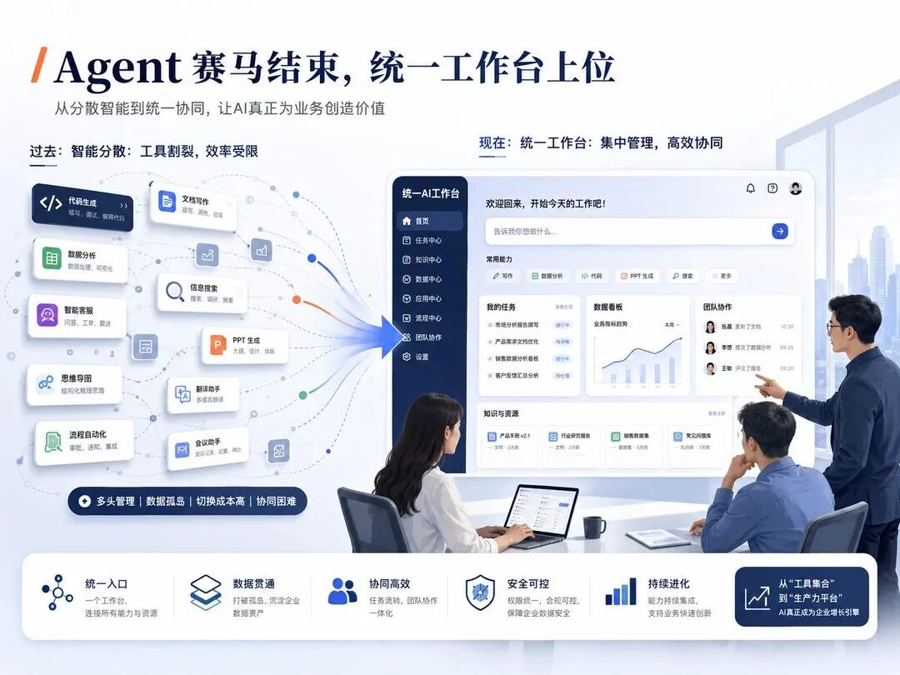
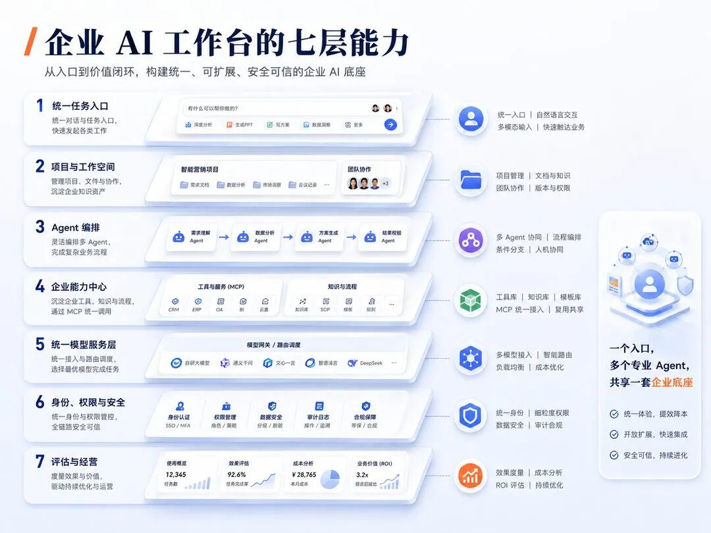
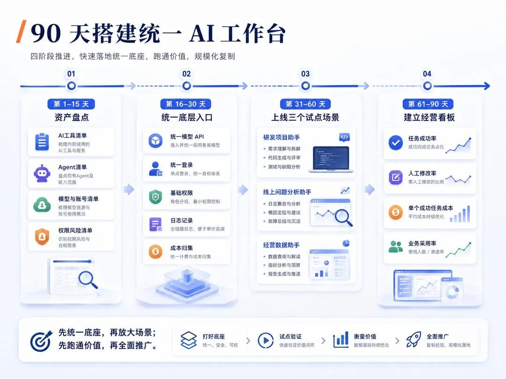

# 📰 大厂开始合并 Agent：企业不需要 100 个孤岛 AI 员工，而需要一个统一工作台

轩见 AI · 企业 AI 战略

最近，国内几家大厂不约而同地做了一件事：

减少分散的 Agent 产品，  
开始建设统一 AI 工作入口。

腾讯将面向研发、办公和 Agent 托管的多类能力逐步放到统一企业底座中；阿里开始整合 QoderWork、悟空和 MuleRun，减少重复建设；字节则将 TRAE 从 AI 编程工具扩展为覆盖研究、文档、数据分析和项目协作的 TRAE Work。

表面上看，这是产品改名、团队调整和入口合并。

但背后真正发生的变化是：

Agent 赛马正在结束，企业 AI 的竞争正从“谁拥有更多 Agent”，进入“谁能组织 Agent 真正完成工作”。

大厂正在从分散工具和独立 Agent，转向统一任务入口、共享上下文和集中治理。

01为什么大厂早期需要很多 Agent？

AI 刚开始进入企业时，没有人真正知道哪一种产品形态能够跑通。

因此，早期的多路线赛马是合理的：有人从代码切入，有人从文档和表格切入，有人从知识库、桌面自动化和业务流程切入。

这个阶段，大厂真正要验证的是：哪些工作适合交给 AI、用户是否愿意把真实任务交给 Agent、什么样的交互可以形成持续使用习惯。

赛马模式适合寻找方向，却不适合长期规模化运营。

当 Agent 真正进入生产，多路线并行的成本开始显现：多个账号、多套模型采购、多套知识库、多套连接器、多套权限和日志系统，以及多个无法共享项目上下文的聊天入口。

继续增加 Agent，已经不能继续提高企业 AI 能力，反而会制造新的 AI 孤岛。

02大厂真正合并的，是七种重复建设

## 1. 统一工作入口

员工只描述最终目标，不需要自己判断该打开哪个 Agent。工作台负责选择模型、工具、工作流和专业 Agent。

## 2. 统一项目上下文

项目目标、文件、历史决策、异常记录和验收标准在同一空间持续积累，Agent 不再每次从零开始。

## 3. 统一身份和权限

每个员工和 Agent 都有唯一身份，明确谁发起、谁执行、访问了什么、谁审批、失败后由谁负责。

## 4. 统一工具、Skill 和连接器

搜索、数据库、代码仓库、工单、监控、发布和审批等能力被标准化，不再由每个 Agent 重复开发。

## 5. 统一模型和算力调度

简单任务走低成本模型，复杂任务走强模型，敏感数据使用合规模型，故障时可以自动切换和降级。

## 6. 统一成本核算

成本归集到用户、部门、项目、Agent、模型和最终任务，而不是只看到总 Token 和总账单。

## 7. 统一质量评估

不只评估某一句回答，而是评估完整任务是否完成、是否被采用、是否需要人工修改以及真实业务收益。

统一工作台不是把入口放在一起，  
而是把企业 AI 的公共能力集中治理。

03大厂真正争夺的，是三种新的控制权

任务入口控制权

谁成为员工每天打开的第一个 AI 产品，谁就有机会接收企业中最多的真实任务。

企业上下文控制权

模型可以替换，但项目、文件、历史决策、工作习惯和反馈会长期积累，形成更难复制的壁垒。

Agent 调度权

谁决定任务交给哪个 Agent、调用哪个模型、使用哪些工具、何时人工接管，谁就掌握企业 AI 的调度层。

大厂合并的不是几个产品入口，而是在争夺企业的任务入口、长期上下文和 Agent 调度权。

04AI 产品正在经历三次角色升级

第一阶段：AI 是回答问题的工具

核心产品是聊天框。竞争重点是知识、语言表达和推理能力。

第二阶段：AI 是可以完成任务的 Agent

AI 开始调用搜索、文件、代码、浏览器和企业系统，竞争重点变成能不能把事情做完。

第三阶段：AI 成为企业工作系统

企业开始管理人、Agent、任务、文件、知识、工具、权限、成本、质量和业务结果。

下一阶段的竞争，  
不是谁拥有最聪明的单个 Agent，  
而是谁能成为人与 Agent 共同工作的企业操作系统。

05一个真正的企业 AI 工作台，需要七层能力

一个入口、多个专业 Agent，共享任务空间、企业能力、模型服务、安全治理与经营评估。

第一层：统一任务入口

员工描述目标、上传材料、选择项目和审阅成果，不需要理解背后的模型与 Agent。

第二层：项目与工作空间

长期保存项目目标、文件、决策记录、执行状态、审批节点和最终交付物。

第三层：Agent 编排

把复杂任务拆给多个专业 Agent，并在关键节点请求人工确认。

第四层：企业能力中心

统一沉淀知识库、Skill、MCP、连接器、内部 API、搜索和业务系统能力。

第五层：统一模型服务层

负责多模型接入、路由、切换、降级、日志和成本统计，是工作台的动力系统。

第六层：身份、权限与安全

采用唯一身份、最小权限、短时凭证、人工审批、审计和回滚。

第七层：评估与经营

持续观察任务质量、完成时间、人工投入、调用成本、采用率和业务结果。

06统一工作台，不等于一个无所不能的超级 Agent

企业不能从“100 个孤岛 Agent”，直接走向“一个什么都做的超级 Agent”。

一个 Agent 同时负责研发、财务、法务、客服、销售、运维和数据，会迅速出现上下文膨胀、权限过宽、专业规则相互污染、评估标准混乱和责任难以定位。

更合理的形态是：一个入口，多个专业 Agent，共享一套企业底座。

前台入口统一

员工面对一个任务入口，不需要学习几十个 Agent 产品。

后台能力专业化

研发、产品、数据、财务、客服和运维 Agent 保留独立岗位目标与专业流程。

基础设施集中

模型、身份、权限、知识、工具、日志、成本和评估共享一套企业底座。

业务能力分布式

部门可以定义 Agent 做什么，但不能各自重新建设基础设施。

07普通企业应该买，还是自己建设？

通用办公需求为主

资料搜索、文档、表格、演示和知识问答可以优先采用成熟 SaaS 工作台，重点做好知识接入、权限和效果评估。

内部系统较复杂

采用“成熟入口＋企业自有模型服务层＋内部 Skill/MCP＋统一身份权限”的混合模式。

数据敏感或核心业务高度定制

前台入口可以采购，但模型网关、企业数据层、Agent 身份、权限审批、执行环境、审计和核心业务 Agent 应掌握在自己手中。

企业不需要什么都自己做，但任务入口、企业上下文和核心执行控制权不能完全外包。

08企业可以用 90 天跑出一个内部 MVP

先盘点资产、统一底层入口，再上线三个场景，最后建立经营看板。

第 1—15 天：完成 AI 资产盘点

梳理工具、Agent、模型账号、知识与数据、系统权限、月度成本和负责人，形成企业 AI 资产地图。

第 16—30 天：统一底层入口

完成统一模型 API、统一登录、基础权限、调用日志、成本归集以及 Skill/MCP 注册规范。

第 31—60 天：上线三个试点场景

优先选择研发项目助手、线上问题分析助手和经营数据助手，分别验证研发交付、系统稳定和业务经营。

第 61—90 天：建立经营看板

持续观察任务成功率、平均完成时间、人工修改率、接管率、严重错误率、单个成功任务成本和业务采用率。

90 天结束时，不要只汇报上线了几个 Agent。  
要回答哪些场景真正缩短了周期、产生了回报、沉淀了可复用能力。

09结合我们的实践，下一步应该补什么？

我们已经搭建统一 AI 模型服务层，接入智谱、DeepSeek、Kimi、小米、MiniMax 和 OpenAI 等国内外模型，并为后续 Agent 提供统一 API。

这一步解决的是：Agent 从哪里获得模型能力、怎样切换和路由模型、怎样记录调用、怎样归集成本。

统一模型服务层是 AI 工作台的动力系统，但它还不是完整的工作台。

下一步更值得补齐的是：

统一项目空间

让需求、文件、知识、决策、任务状态和最终成果围绕项目持续沉淀。

统一员工与 Agent 身份

明确发起者、执行者、责任人、代理关系和权限边界。

统一 Skill 与 MCP 中心

把搜索、代码、数据、监控、发布和内部业务 API 变成可复用能力。

统一任务记录与人工审批

完整记录任务拆解、模型调用、工具执行、人工确认和异常处理。

统一质量评估和成果归档

评价任务是否成功、是否被采用、成本是否下降，并把有效成果写回组织知识。

10企业最容易犯的五个错误

只统一页面，没有统一底座

把多个 Agent 放进一个门户，只是新的导航页。模型、知识、权限、工具和日志仍然分裂。

把统一理解为只能使用一个模型

统一是集中治理和智能路由，不是把所有业务重新绑定到一个模型。

试图建设一个超级 Agent

专业工作仍需要独立岗位、知识、工具、权限和验收标准。

只统计 Agent 数量和调用次数

Agent 越多可能维护成本越高，调用量越大也可能意味着重试和浪费越多。

没有退出机制

任务成功率低、人工修改率高、成本无法下降的 Agent 应允许缩小范围或下线。

写在最后

大厂开始合并 Agent，不是因为 Agent 没有价值。恰恰相反，正是因为 Agent 即将大量进入企业，才必须把它们放进一套统一工作系统中。

企业未来可能真的拥有 100 个 AI 员工，但员工不应该面对 100 个聊天窗口，技术团队也不应该维护 100 套模型、知识、权限、工具和日志系统。

真正成熟的企业 AI 应该是：员工只需要提出目标；统一工作台理解并拆解任务；多个专业 Agent 在后台分工协作；模型和工具被自动调度；高风险节点由人审批；所有过程都可以追踪；所有结果都可以验证；所有成本都可以核算。

AI 员工可以有很多个，  
但公司的 AI 工作系统，只应该有一套。

参考资料

## 1. 腾讯云：WorkBuddy Enterprise 产品概述及 Managed Agents 相关资料

## 2. 财新：阿里整合 QoderWork、悟空与 MuleRun

## 3. TRAE：Introducing TRAE Work

## 4. 易观分析：2026 年 6 月中国桌面端 AI 原生办公智能体访问量

## 5. WorkBuddy Bench：多领域 Agent 评测框架

— 轩见 AI · END —
