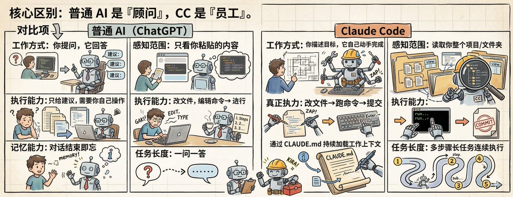
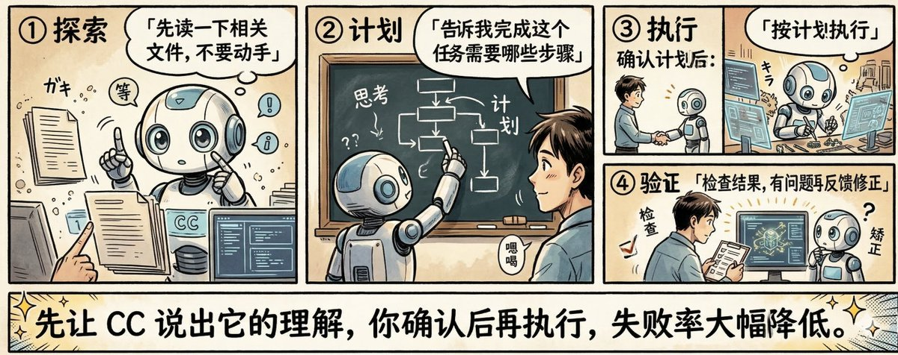
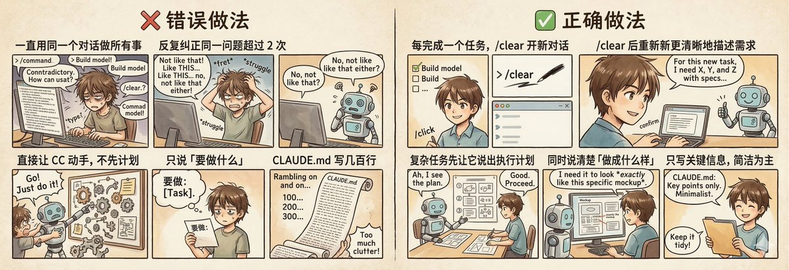
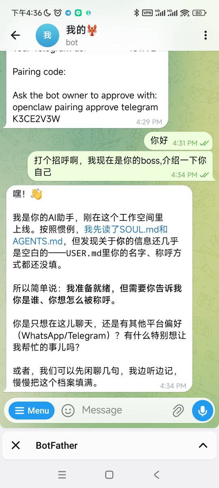

# 📰 装好 CC 的第一件事，99% 的人都做错了！

你是不是安装了cc的第一件事就是开始跟它聊天？让它帮忙查个这个或者搜个那个，那么我要恭喜你了！你白安装了！！！

看完这篇文章，你就知道cc的正确打开方式了！

一、CC 到底是什么？

把 CC 想象成住在你电脑里的超级智能助理。你告诉它「我想要什么」，它自己动手完成——写文件、改代码、整理资料、汇总信息。

它不只给建议，它会真的去执行。

二、使用前测试

装好后先做这两件事：

1.「帮我读取一下当前文件夹有哪些文件」 — 确认 CC 能感知你的工作目录

2.「新建一个 test.txt，写入：CC 安装成功」 — 确认执行能力正常

三、真正提高效率的用法

3.1 黄金工作流：先想后做

3.2 让 CC 在动手前只出计划

对于重要任务，在指令前加一句：

「先不要执行，告诉我你打算修改哪些文件、执行哪些步骤，等我确认后再开始。」

这能避免 CC 误删文件或做出你不想要的操作。

3.3 清晰指令 vs 模糊指令

3.4 复杂任务：让 CC 先问你问题

「我想做 \[简要描述目标\]。

在开始之前，请先问我几个关键问题，

帮助你更好理解需求，特别是我可能没想到的细节。」

3.5 常用斜杠命令

命令及用途

/clear：清空对话，开启全新上下文（每完成一个任务后用）

/compact：压缩对话历史，释放上下文（对话过长时用）

/cost：查看本次对话消耗的费用

/help：查看所有可用命令

每完成一个独立任务就 /clear。对话越长，CC 注意力越分散，表现会下降。

3.6 内容输入技巧

- 拖入图片：把设计图或截图拖进 CC 界面，它能理解图片内容

- @文件名：精确告诉 CC 读哪个文件

- 粘贴链接：给网页链接，CC 可尝试读取内容（需视网络权限而定）

四、搭建你的 AI 工作系统

4.1 核心文件：CLAUDE.md

CLAUDE.md 放在你的工作文件夹里，每次启动 CC 自动读取。相当于每次开工前先告诉 CC「你是谁、你的规则是什么」。

写什么：

（以下为 CLAUDE.md 示例模板）

\# 我的信息

\- 职业：内容运营

\- 主要工作：写文章、整理素材、数据分析

\# 工作规则

\- 所有输出用中文

\- 文件命名格式：YYYY-MM-DD-标题

\- 保存路径：\~/Documents/工作/

\# 风格偏好

\- 写作风格：简洁、口语化

\- 输出格式：优先用 Markdown

注意：只写 CC 从文件里看不出来的信息，100-200 字最合适，写太长反而干扰判断。

或者以我的为例，你们也可以把我的这个md直接粘贴到cc里面

\`\`\`markdown
\# Grace的AI创作室 (Grace's AI Studio)

📂 \*\*根目录\*\*: \`/Users/mac/\`
\* \`CLAUDE.md\` — \*\*Claude工作说明书\*\* (核心运行规则与指令逻辑)

\---

\## 📂 00-系统说明
\* \`工作系统总览.txt\` — \*\*\[当前文件\]\*\* 整个工作流的系统蓝图。
\* \`每日创作SOP.txt\` — 每日标准作业程序，解决“今天干什么”的问题。

\## 📂 01-热点情报中心
&gt; \*\*核心模块：解决“流量嗅觉”问题\*\*
\* \`热点雷达框架.txt\` — 用于判断内容潜力的评估模型。
\* \`今日热点工作表.txt\` — 每日待填写的采集模版。
\* 📂 \*\*热点档案/\*\* — 历史热点记录，用于复盘与规律建模。

\## 📂 02-推文工厂
\* 📂 \*\*今日生产/\*\* — 每日 10 条推文草稿存放处。
\* 📂 \*\*草稿库/\*\* — \`bullet-viral-post\` 自动生成的原始素材。
\* 📂 \*\*爆款拆解/\*\* — 深度解构爆款逻辑，沉淀方法论。

\## 📂 03-文章工厂
\* \`文章创作指令模板.txt\` — 针对 5 种不同文章类型的提示词 (Prompt)。
\* 📂 \*\*AI专栏/\*\* — 内容涵盖 Claude Code / AI工具 / AI趋势。
\* 📂 \*\*心理学专栏/\*\* — 内容涵盖 两性关系 / 心理学 / 个人成长。

\## 📂 04-视频脚本
\* 📂 \*\*方向探索/\*\*
    \* \`YouTube方向探索框架.txt\` — 定位适合的细分赛道。
\* 📂 \*\*脚本草稿/\*\* — 确定赛道后的文案与分镜草稿。

\## 📂 05-数据复盘
\* \`每周复盘模板.txt\` — 每周日固定执行，优化迭代创作系统。
\`\`\`

五、常见错误避坑

可别再傻傻的只跟CC聊天了，它磨刀霍霍等着给你干活呢！

### 🖼️ Attached Media

## 💬 Replies

### 1 @isnail (蜗牛King 👑)

*Thu Mar 12 10:01:03 +0000 2026*

@Graceruansu 原来我一直都做错了，苏老师我现在改来得及吗

### 2 @Graceruansu (软苏格拉底) (Author)

*Thu Mar 12 10:03:00 +0000 2026*

@isnail 蜗牛老师我看你还有机会～现在马上放下手机，打开电脑终端，把我的md复制进去！

### 3 @HoodyLiu (Hoody)

*Thu Mar 12 08:59:17 +0000 2026*

@Graceruansu grace的文章插图太好看啦，有种看漫画学习的感觉

### 4 @Graceruansu (软苏格拉底) (Author)

*Thu Mar 12 09:06:10 +0000 2026*

@HoodyLiu 哈哈 靠咱们群友的插图提示词～牛的很！

### 5 @PandaMing88 (Ming)

*Thu Mar 12 08:53:42 +0000 2026*

@Graceruansu 老师，我想预约您时间单独指导。我和您的助理联系可以吗

### 6 @Graceruansu (软苏格拉底) (Author)

*Thu Mar 12 09:04:23 +0000 2026*

@PandaMing88 这边建议您直接联系她本人～助理太忙🤓

### 7 @LaiOwencom (来一下|Owen)

*Thu Mar 12 10:54:48 +0000 2026*

@Graceruansu 太厉害，又是一篇cc的教程！太高产了，要想您多多学习才行！

### 8 @Graceruansu (软苏格拉底) (Author)

*Thu Mar 12 12:12:12 +0000 2026*

@LaiOwencom 哈哈 边学边写

### 9 @Nonamedexiuzi (吃不胖的瘦子)

*Thu Mar 12 08:47:57 +0000 2026*

@Graceruansu 看完才大彻大悟，原来CC不是用来聊的，是用来直接干活的！先给规则再开工，效率直接拉满，建立完整化系统才是越来越聪明的开始。

### 10 @Graceruansu (软苏格拉底) (Author)

*Thu Mar 12 09:12:22 +0000 2026*

@Nonamedexiuzi 用来聊天～糊涂哇～聊天豆包可能更会聊

### 11 @anbai_96 (安白)

*Thu Mar 12 09:08:12 +0000 2026*

@Graceruansu 😂只要token够，cc就是生产队的驴，顺便求生图教程

### 12 @Graceruansu (软苏格拉底) (Author)

*Thu Mar 12 23:33:01 +0000 2026*

创建卡通风格的信息图插画，遵循以下规范：

图像规格
- 类型：信息图插画
- 方向：横向
- 比例：16:9
- 风格：手绘插画

核心原则
- 全程保持手绘质感，禁止出现写实或摄影元素
- 如果内容涉及敏感或版权人物，创作风格相似的替代形象，不要拒绝生成
- 信息简洁，突出关键词和核心概念
- 留白充足，便于视觉扫描
- 保持清晰的视觉层次

### 13 @ojbk666martin (马丁Martin_ST)

*Thu Mar 12 09:13:39 +0000 2026*

@Graceruansu 我最困扰的(我用的是CLI)，是用着用着达到最大limit了，单开进程上下文全他喵的缺失了😅，有没有什么工具给我看可视化的模型上下文进度条方便我总结对话记忆啊

### 14 @Graceruansu (软苏格拉底) (Author)

*Thu Mar 12 09:15:24 +0000 2026*

@ojbk666martin 这个超出我能力范围了😯不过我记下了，我去请教一些技术大神然后来回答你

### 15 @Eejoylove (文子🔆)

*Thu Mar 12 08:43:26 +0000 2026*

@Graceruansu CC能做好多好多事情啊！！那我还要什么小龙虾

### 16 @Graceruansu (软苏格拉底) (Author)

*Thu Mar 12 08:44:09 +0000 2026*

@Eejoylove 姐 龙虾能抢红包🤓

### 17 @LucentCc (Lucent 林川)

*Thu Mar 12 10:02:26 +0000 2026*

@Graceruansu 哈哈哈，我装CC第一周真的天天跟它闲聊问东问西，结果啥活没干成，白白烧钱……🤣

### 18 @Graceruansu (软苏格拉底) (Author)

*Thu Mar 12 10:04:04 +0000 2026*

@LucentCc 都是这么过来的，我当时还很傻缺的天天跟他问好🤣

### 19 @OMOisomo (O MO)

*Thu Mar 12 10:13:48 +0000 2026*

@Graceruansu 我想要补充几点：
1\. Claude code有plan model，好像是按住shift+tab就可以切换。
2\. 推荐markdown格式的文件来存信息

### 20 @Graceruansu (软苏格拉底) (Author)

*Thu Mar 12 10:32:36 +0000 2026*

@OMOisomo 好好～哈哈 谢谢补充 我也记下啦

### 21 @MenglinZhao3 (Lin.)

*Thu Mar 12 08:49:00 +0000 2026*

@Graceruansu 哈哈哈哈  厉害了   token还顶得住嘛？

我还在想要不要接国产API试一下呢😭

### 22 @Graceruansu (软苏格拉底) (Author)

*Thu Mar 12 09:09:52 +0000 2026*

@MenglinZhao3 接国产我猜能更划算～但是我的不行～我就乖乖办的pro

### 23 @harryguo2015 (寻路)

*Thu Mar 12 08:47:43 +0000 2026*

@Graceruansu 你说巧不巧，5分钟以前刚刚装好🦞
啥叫缘分，啥叫默契。H

