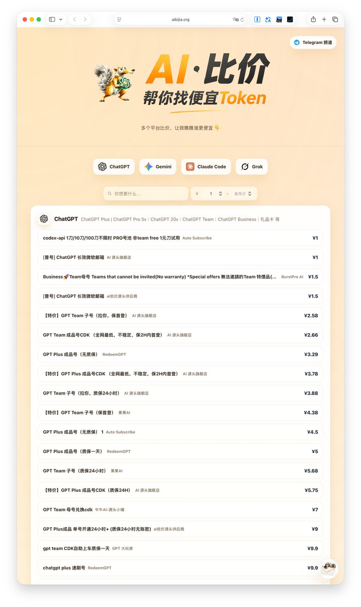
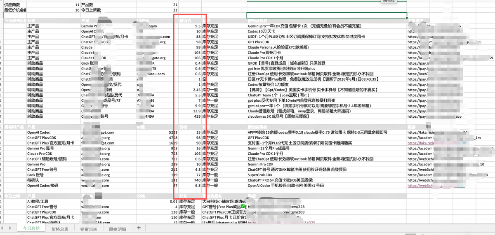
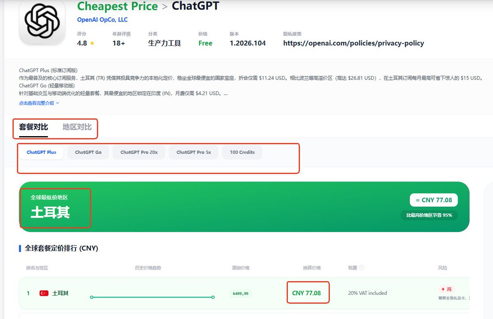

AI 订阅比价网站，方便找便宜靠谱的渠道。[aibijia.org](http://aibijia.org) 

## 💬 Replies

### 1 @ShunqiW44615 (Q7)

*Sun Apr 26 11:28:13 +0000 2026*

@pengchujin 这点差价没有比价的必要，光一个稳定、可靠的渠道就能带来10倍的溢价

### 2 @lanxin333 (Xin Lan)

*Mon Apr 27 00:42:04 +0000 2026*

@pengchujin 在里面选了一家购买会员，结果发来的号不是会员，找售后退款，结果直接关闭售后订单。被骗50块。骗子网站[makerich.club](https://makerich.club/)

### 3 @chndngshng30256 (Cheney)

*Sun Apr 26 09:30:16 +0000 2026*

@pengchujin 土区礼品卡正规充值不到90，这里能要133，何谈性价比。

### 4 @snkplk (pING)

*Sun Apr 26 07:27:55 +0000 2026*

@pengchujin 网站能不能加一个 质保时间的 筛选啊

### 5 @jiefuBTC (解夫🔶｜Crypto)

*Sun Apr 26 06:53:53 +0000 2026*

@pengchujin 我去不管速度咋样，这东西是真方便啊。看到了成本价。

### 6 @feYIUDBhRZPzhjq (一池水)

*Sun Apr 26 09:22:24 +0000 2026*

@pengchujin 里面有些假的。不能光看价格你要看实际1元能跑多少token

### 7 @JayChen418 (Jay Chen)

*Sun Apr 26 08:16:26 +0000 2026*

@pengchujin 好强啊！怎么做的？

### 8 @RouterA (RouterA | AI 工具实测)

*Sun Apr 26 14:31:18 +0000 2026*

@pengchujin 没有开源模型？

### 9 @Web3_DadGOD (链上奶爸)

*Sun Apr 26 07:44:51 +0000 2026*

@pengchujin 有点意思啊，这个是怎么实现的

### 10 @bitelu2026 (比特撸（金九银十进化版）)

*Sun Apr 26 14:52:56 +0000 2026*

@pengchujin 从哪整得这些东西

### 11 @alleywu270684 (alley wu)

*Thu Jun 04 03:39:23 +0000 2026*

@pengchujin 哈哈哈 哪里来的比价啊 
这也太贵了
看看我的比价系统吧
那才是真比价啊 

### 12 @fatcatsuv (极品肥猫)

*Mon Apr 27 01:56:19 +0000 2026*

@pengchujin 中转站比价：[tuiyun.com/stations](http://tuiyun.com/stations)

### 13 @Cizzl2 (Cizzl)

*Sun Apr 26 07:29:34 +0000 2026*

@pengchujin 这网站可以啊

### 14 @bainianAI (百年 AI×出海)

*Sun Apr 26 12:10:30 +0000 2026*

@pengchujin 收藏了，有空去拉下数据看看

### 15 @hooosberg (湖森堡hooosberg)

*Sun Apr 26 06:56:27 +0000 2026*

@pengchujin 牛皮了

### 16 @proxyxai (𝑿𝑨𝑰 𝑹𝒐𝒖𝒕𝒆𝒓)

*Sun Apr 26 11:09:22 +0000 2026*

@pengchujin [xairouter.com](http://xairouter.com)

### 17 @BSRxNcYOv544600 (JIuqiu)

*Sun Apr 26 06:10:34 +0000 2026*

@pengchujin 速度怎么样，现在好多速度不行

### 18 @Stark1Wen (皮克文)

*Sun Apr 26 22:44:22 +0000 2026*

@pengchujin 收藏备用

### 19 @ArtUtopia1 (小小懒妹儿)

*Mon Apr 27 01:19:39 +0000 2026*

@pengchujin 昨天在redeem上买的无质保plus，一开始登不上邮箱收码，登上了号就没了，一个小时就没了

### 20 @x_chenyuanqi (陈元气)

*Mon Apr 27 11:51:24 +0000 2026*

@pengchujin 还有这玩意…

### 21 @zhendeme (liwen)

*Sun Apr 26 09:00:53 +0000 2026*

@pengchujin 好棒 新时代的hao123

### 22 @milo16z (Milo)

*Sun Apr 26 13:18:50 +0000 2026*

@pengchujin 这个牛 但是里面的网站全么，还有可信度高不高 每个都经过验证了吗

### 23 @OneManSaas (OneManSaas)

*Sun Apr 26 22:42:49 +0000 2026*

@pengchujin Absolutely needed this. Been burning hours comparing AI tools when I should be building. The subscription maze is real - half these services don't even list pricing upfront.

### 24 @tensor100 (Baahubali)

*Sun Apr 26 15:36:16 +0000 2026*

@pengchujin 牛批牛批

### 25 @Kyinziai (烟雨楼)

*Sun Apr 26 19:28:08 +0000 2026*

@pengchujin 太卷了你们

### 26 @happy_yao_ (codeCat)

*Fri May 29 10:01:26 +0000 2026*

@pengchujin 实时的吗？我在[appark.ai/cn/cheapest-pr…](https://appark.ai/cn/cheapest-price/chatgpt)看好像更便宜了。可以实时查看不同套餐，不同地区，最低价格地区，怎么订阅一目了然 

### 27 @iloveChineseee (臆想)

*Sun Apr 26 08:04:06 +0000 2026*

@pengchujin 网站挺好，但是质量很难说。害怕亏本，不知道买哪个。又不想原价订阅

### 28 @rayhanmia151210 (汉中俊林阳具)

*Sun Apr 26 11:55:04 +0000 2026*

@pengchujin 拉完了  全是些高价

### 29 @johnnywu2099 (DevJohnny)

*Tue Apr 28 08:42:50 +0000 2026*

@pengchujin 虽然用不上，先码着

### 30 @zzplan92 (zhe zhang)

*Mon Apr 27 16:55:27 +0000 2026*

@pengchujin 直接购买了，退出来以后怎么再看卡密啊，

### 31 @Voyakza (Tokener)

*Sun Apr 26 14:44:51 +0000 2026*

@pengchujin 大佬，这个网站推荐的商家水非常深，用了其中一家，跟骗子差不多

