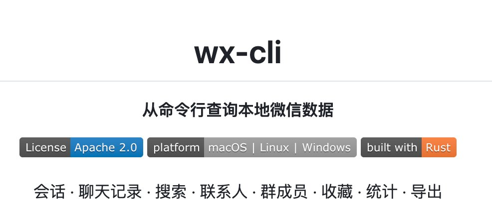

卧槽！刚发现一个能读取微信聊天记录的工具，私域运营神器啊！

wx-cli，让 AI 可以自由读取微信消息。

1\. 消息随便翻：不用点开微信那个难用的搜索框，直接输入关键词就能搜全库聊天记录，速度快到飞起。
2\. 朋友圈挖掘机：能直接看朋友圈历史、搜朋友圈文字，甚至连谁给你点过赞、评论过什么都能一目了然。
3\. 聊天导出神器：想把聊天记录存成文档？它能一键导出成整齐的 Markdown 或网页格式，备份和查阅超级方便。
4\. 自动统计分析：想知道谁是群里的“话痨”？它能直接帮你统计聊天频率，生成各种有趣的数据。
5\. 收藏夹搜索：微信收藏的东西太多找不着？用它按图片、链接或者视频类型一搜就有。
6\. 安全又隐私：它不用扫码登录，也不联网传数据，完全是在你本地电脑上操作，非常安全。
7\. AI 完美搭子：如果你在用 Claude 或 Cursor 这种 AI 工具，它可以直接把聊天记录喂给 AI 帮你总结重点。

项目地址在评论区👇

### 🖼️ Attached Media

## 💬 Replies

### 1 @jinchenma_ai (金尘马) (Author)

*Sat May 09 09:08:05 +0000 2026*

项目地址：[github.com/jackwener/wx-c…](https://github.com/jackwener/wx-cli)

### 2 @EvaCmore (Eva 树姐👧🏻)

*Sat May 09 18:22:28 +0000 2026*

@jinchenma\_ai 原来你们早就用上了

### 3 @jinchenma_ai (金尘马) (Author)

*Sun May 10 01:59:07 +0000 2026*

@EvaCmore 准备试试，一直没用，群里消息太多不得不用了

### 4 @aipgh6 (彭根辉)

*Sat May 09 09:48:17 +0000 2026*

@jinchenma\_ai 之前用的是苍何大神的 wechat cli

### 5 @jinchenma_ai (金尘马) (Author)

*Sat May 09 16:46:52 +0000 2026*

@GenhuiP78950 那个不维护了

### 6 @jiu1gjl (paman)

*Sat May 09 09:15:39 +0000 2026*

@jinchenma\_ai 保存一下

### 7 @jinchenma_ai (金尘马) (Author)

*Sat May 09 16:46:45 +0000 2026*

@jiu1gjl 明天体验！

### 8 @cnzhihao (智昊 - OPC版)

*Sat May 09 13:41:01 +0000 2026*

@jinchenma\_ai 这时间一长不得吃老马的官司

### 9 @jinchenma_ai (金尘马) (Author)

*Sat May 09 16:47:04 +0000 2026*

@cnzhihao 估计后面还是得南山必胜客

### 10 @iBigQiang (强子手记)

*Sat May 09 15:08:33 +0000 2026*

@jinchenma\_ai 这个会封号不呢

### 11 @jinchenma_ai (金尘马) (Author)

*Sat May 09 16:46:30 +0000 2026*

@iBigQiang 应该不会，都是本地操作，wx感知不到的

### 12 @adelbucetta (Adel Bucetta)

*Sat May 09 16:21:58 +0000 2026*

@jinchenma\_ai the real unlock here is not just searching old chats, but being able to automate analysis on that data too

### 13 @ZuiJiu61637 (车九 （低价蓝V代开）)

*Sun May 10 12:26:58 +0000 2026*

@jinchenma\_ai 复刻个性IP AI回复

### 14 @Neko852147 (常夜)

*Sun May 10 03:27:57 +0000 2026*

@jinchenma\_ai 这个会把聊天记录放到缓存里，然后用AI获取微信内存中的密钥进行解密，微信是无法发现的。但不要用发消息的功能，唯一风险就是微信会被重签名，这样腾讯依然可能发现你的微信异常。

### 15 @c_joey97949 (Joey C)

*Sat May 09 16:56:28 +0000 2026*

@jinchenma\_ai 痛点3：微信数据整理
核心诉求：微信备份中的数据还原，包括图片、视频，微信收藏批量导出
状态：未解决

### 16 @LaiOwencom (来一下|Owen)

*Sun May 10 03:23:18 +0000 2026*

@jinchenma\_ai 先保存一下，然后再玩玩

### 17 @hustle0x01 (dimbslk)

*Sun May 10 16:17:34 +0000 2026*

@jinchenma\_ai 能读企业微信不？

### 18 @Etudecn (淘沙者(TheSandPicker))

*Sat May 09 16:45:58 +0000 2026*

@jinchenma\_ai 有点争议，但我还是想说：这类工具会让“会聊天的人”和“会用数据的人”差距越来越大。  
以前靠感觉做私域还能跑，现在不会检索、不会分析，可能很快就跟不上了。你们认同吗？

### 19 @weichen_ink (微尘印记)

*Tue May 12 10:47:21 +0000 2026*

说一个我的使用场景
独立老师，有100多个学生，每天都要有大量的家长反馈和答疑
这些内容都困在微信里面
用这个工具，接口给AI，直接提炼聊天记录，然后补充道Obsidian对应的学生文档里面
这样结合每次上课的记录，就可以生成新一轮的家长反馈，还可以针对性的调整学习计划
对于销售和客服类的岗位还是挺有帮助的
不过前提条件是，要愿意让AI来真正的进入工作流

### 20 @ai_suxiaole (苏乐)

*Sat May 09 16:55:04 +0000 2026*

@jinchenma\_ai 赶紧fork下来试试，说不定明天就没了

### 21 @Tigger0630 (Tigger)

*Wed Sep 02 14:12:29 +0000 2026*

@jinchenma\_ai 被删除了

### 22 @remay112 (remay)

*Sun May 10 08:52:23 +0000 2026*

@jinchenma\_ai 登录过的微信，再不登录的状态下可以提取到聊天记录吗

### 23 @tangqingyue (唐清乐)

*Sun May 10 14:57:43 +0000 2026*

本地读取微信聊天记录+AI总结，技术上不新鲜，但产品化做得好。关键决策是不扫码不联网，把信任成本降到最低。不过'私域运营神器'这个定位暴露了一个矛盾：运营需要的是结构化洞察，但微信聊天天然是碎片化和口语化的。AI能从碎片中提取信号，但信号质量和聊天质量正相关——垃圾进垃圾出这条铁律，AI也绕不过去。

### 24 @Faakeeyuu (Json)

*Sat May 09 23:41:44 +0000 2026*

@jinchenma\_ai 只能读取数据

### 25 @ada250901 (AI&cypto)

*Sun May 10 14:05:49 +0000 2026*

@jinchenma\_ai 来个批量删好友功能。

### 26 @iD9kU4MW5B90962 (离火)

*Sat May 09 17:42:09 +0000 2026*

@jinchenma\_ai 有手机版的吗

### 27 @Chloe52863905 (Chloe)

*Sun May 10 13:19:47 +0000 2026*

@jinchenma\_ai 有类似的读取whatsapp消息工具吗？

### 28 @wutingbin (喔嚯)

*Sun Jul 19 11:17:57 +0000 2026*

@jinchenma\_ai 会延迟，不适合实时聊天。

### 29 @BytePundit (Byte2byte)

*Sun May 10 00:14:04 +0000 2026*

@jinchenma\_ai 南山必胜客会出动吗

### 30 @phoenixlaw (PH囧ENIX)

*Fri May 15 02:24:23 +0000 2026*

@jinchenma\_ai wx-cli 所需的 codesign --force --deep --sign - /Applications/WeChat.app 把微信原签名破坏了，导致 macOS TCC 权限体系反复失效。

### 31 @shanrenxintu (lihong liu)

*Mon May 11 08:34:58 +0000 2026*

@jinchenma\_ai 收藏

### 32 @kidgpt (STEM Ed Hub)

*Sat May 09 22:33:47 +0000 2026*

@jinchenma\_ai 查询确实方便了，支持批量给联系人分组或备注吗？如果能检测是否被拉黑就更好了。

### 33 @WWilson96325 (AI创想家)

*Mon May 11 05:46:25 +0000 2026*

@jinchenma\_ai 这个删除的聊天记录可以找回来吗

### 34 @DIlhUxw4NxdNm3q (江秉坤)

*Sun May 10 02:01:56 +0000 2026*

@jinchenma\_ai 期待

