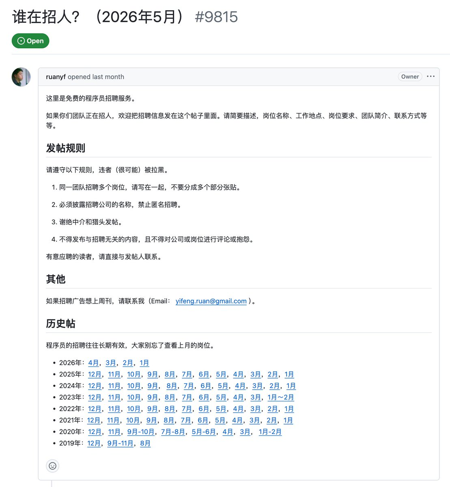
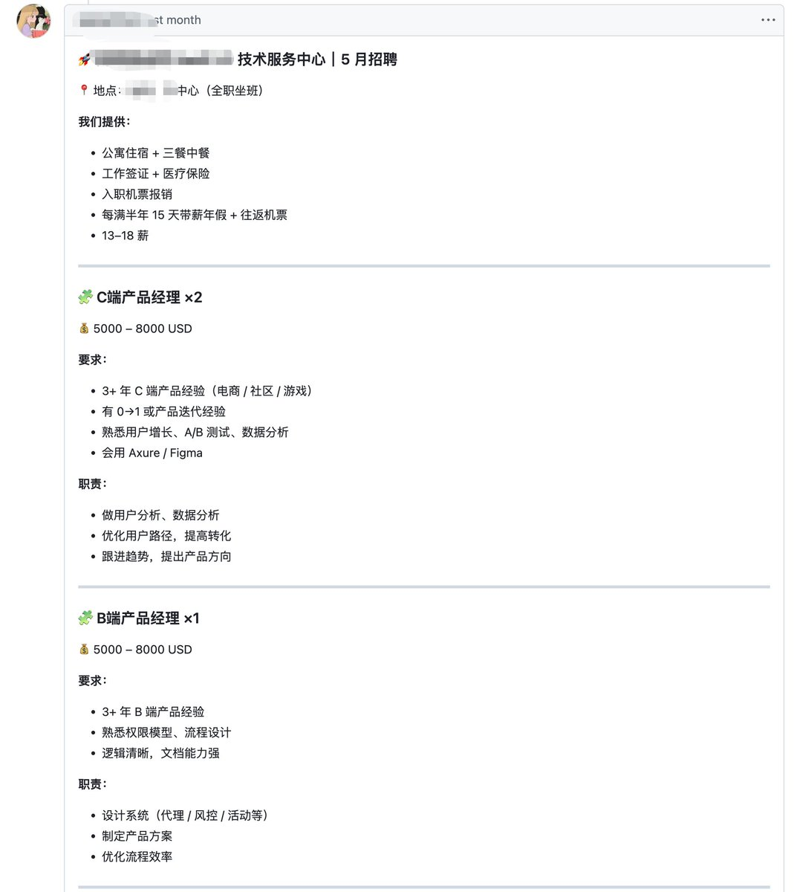

发现一个小众但比 boss 直聘还要精准的招聘渠道

就是阮一峰老师的github周刊issue「谁在招人」帖子

每月都有更新，想找工作的可以去看看 

## 💬 Replies

### 1 @jinchenma_ai (金尘马) (Author)

*Fri May 29 07:50:50 +0000 2026*

哦，忘发地址了，评论区补一下：[github.com/ruanyf/weekly/…](https://github.com/ruanyf/weekly/issues/9815)

### 2 @Potatoloogs (土豆本豆)

*Fri May 29 06:58:41 +0000 2026*

@jinchenma\_ai 我之前真的不知道，去看看！😃

### 3 @jinchenma_ai (金尘马) (Author)

*Fri May 29 07:50:08 +0000 2026*

@Potatoloogs 这种会更精准

### 4 @CharlexHuang (Charlex)

*Fri May 29 10:11:37 +0000 2026*

@jinchenma\_ai 感谢分享～投了一个

### 5 @jinchenma_ai (金尘马) (Author)

*Fri May 29 10:12:23 +0000 2026*

@CharlexHuang 祝好运

### 6 @superKracy (酉财)

*Sat May 30 12:51:46 +0000 2026*

@jinchenma\_ai 这招到的 都是程序员吧🤣

### 7 @jinchenma_ai (金尘马) (Author)

*Sat May 30 13:50:51 +0000 2026*

@superKracy 也有粗了程序员的其他岗位

