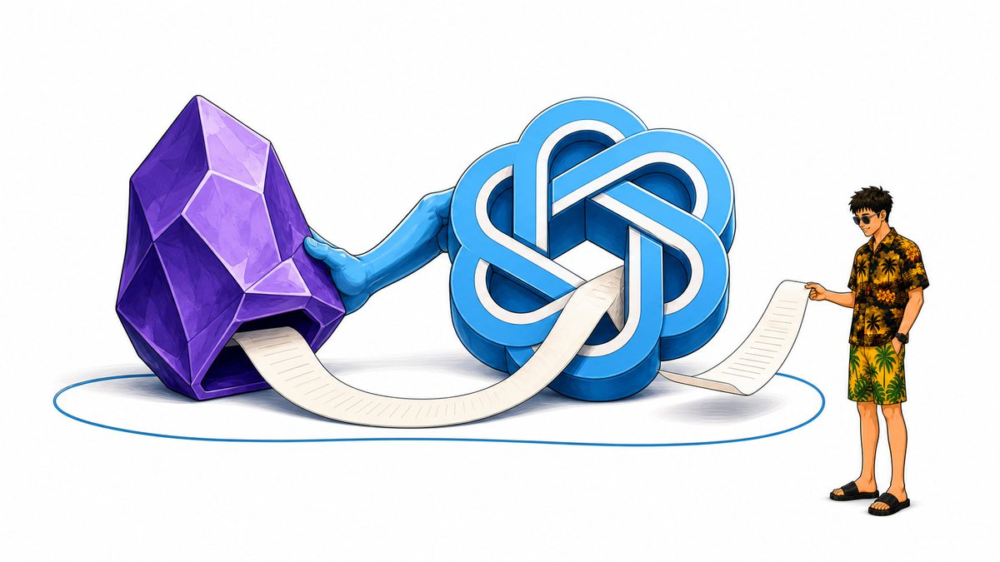
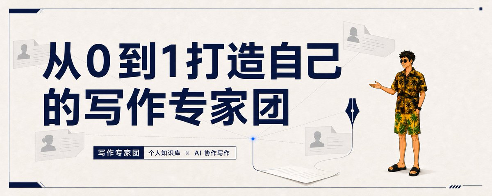

# 📰 我用这套方法，0成本复刻了价值2999元的写作专家团

朋友们大家好啊，我是金尘马。

现在很多人已经在用 DeepSeek、豆包这些 AI 工具写文章了，但我经常听到的一类反馈还是文案生硬、AI 味重。

看似几句话就能生成一篇文章，实际一直在泛泛而谈。因为 AI 不了解我们的经历、判断和说话习惯，很容易拼出一篇谁都能说的文章。

我常年写公众号，一直想用 AI 提高效率。我希望它能理解我的素材、观点和表达方式，像写作团队一样分工协作。

后来我在得到大脑 APP 里看到了一个「写作专家团」功能，它是年费 2999 元的专家版核心权益，配了 8 位 AI 写作专家。

里面有风格打磨师、选题策划、调研专家、知识管家、写手、事实核查专家、资深主编和排版设计师，分别负责找方向、补材料、写稿、核查事实、审稿和排版。

我看到这里，第一反应就是，这不就是一套多 Agent 协作吗？

只要把角色分清，把交接流程和个人知识库接上，用 WorkBuddy 或 Codex，我们完全可以自己搭一个写作专家团。

我最近几个月的公众号文章，基本都在用这套 Agent 工作流辅助创作。接下来，我把搭建思路跟大家分享一下。

# 一、整体思路

这套流程有四个主体：个人知识库、总编辑 Agent、负责具体工序的专业 Agent，以及作者本人。

知识库负责提供材料。总编辑理解选题、分配任务和守住主线，其他 Agent 分别处理素材、大纲、正文、事实核查和审稿。作者补充观点、确认阶段产物，并决定最终发什么。

一篇文章会按照选题澄清、素材查询、任务单、大纲、正文、按需事实核查和审稿的顺序推进。每一步都通过文件交接，上一阶段确认后，再进入下一阶段。

# 二、需要哪些工具，Agent 怎么配合

我自己的实现主要用了四样东西，分别是 AI 工具、本地 Markdown 知识库、保存文章产物的项目目录，以及定义流程和风格的提示词或 Skill 文件。

我现在用的是 Codex 加本地 Obsidian 知识库。具体软件可以替换。AI 能读取本次材料、按步骤输出，并在关键节点等人确认，就可以先做一个简化版。

我的最小版本只留总编辑、素材研究、写作和审稿。它们通过任务单、素材索引、大纲、正文和审稿报告交接，不靠自由聊天。

这是我整理的公开版主 Skill，复制后可以按自己的情况修改：

\`\`\`text
你是我的写作总编辑。请围绕我提供的主题、个人素材和风格要求，组织一支 AI 写作协作团。

按以下阶段工作：
1\. 澄清选题、读者、文章承诺和不能写的内容，等待我确认。
2\. 查询我提供的知识库或素材目录，列出来源、可支持的观点和材料缺口，等待我确认。
3\. 整理写作任务单，包括目标、主线、素材、风格和事实风险，等待我确认。
4\. 生成大纲，写清每一节的目的和使用素材，等待我确认。
5\. 根据确认后的大纲写正文，不编造我的经历、观点、数据和案例。
6\. 正文完成后询问我是否需要事实核查。
7\. 最后输出审稿报告，等我确认修改项后再改正文。

每个阶段只完成当前任务。未经确认，不进入下一阶段。所有外部材料都要保留来源，最终判断和发布权属于作者。
\`\`\`

# 三、怎么训练个人风格的

我没有只对 AI 说一句「写得像我」。

我会先选择一组自己写过的同类型文章，让 AI 分别提取作者身份、说话方式、段落节奏、文章结构和禁用表达。然后留出几篇没有参与提取的文章，用来测试这套规则。

AI 生成测试稿以后，我再拿自己的原文和测试稿做对比。哪些地方不像我，为什么不像，我会把真实改稿反馈继续补进规则里。

可以使用这套提示词：

\`\`\`text
你是我的个人风格训练师。请只分析我明确授权的原创文章。

原创样本：&lt;同类型原创样本文件或目录&gt;
留出样本：&lt;未参与分析的测试样本文件或目录&gt;
作者改稿反馈：&lt;改稿反馈文件，可选&gt;

请输出：
1\. 作者身份、读者关系和事实边界。
2\. 稳定的语言节奏、段落习惯和判断方式。
3\. 不同文章类型常用的结构。
4\. 禁用表达、常见 AI 味和不能编造的内容。
5\. 可用于写作的正反例。

先根据原创样本输出《个人风格规则初稿》，然后停下来等我确认。确认后再用留出样本测试，输出差异清单；收到我的改稿反馈后再更新规则。不要模仿他人的经历和立场，不要用风格匹配分数代替作者判断。
\`\`\`

个人风格不是一次训练完成的，这套规则还要跟着每次真实改稿继续调整。

# 四、多轮审稿与去 AI 味

个人风格规则再完整，大模型写长文时仍会冒出一些熟悉的 AI 表达。我的做法是先完成初稿，再把生成和审稿分开。

第一轮对照文章类型规则，看结构和各章节是否匹配。第二轮对照禁用表达，专门找 AI 味。第三轮再回到个人风格，调整用词、节奏、转场和细节表达。

\`\`\`text
你是写作总编辑。请启动一个独立的审稿 subagent；如果当前工具不支持 subagent，就新开一个独立对话作为审稿人。审稿前读取：

个人风格：&lt;个人风格文件&gt;
文章类型规则：&lt;文章类型规则文件&gt;
禁用表达：&lt;禁用表达文件&gt;

请对当前对话中的文章初稿做三轮审稿：
1\. 对照文章类型规则，检查开头、结构顺序、章节职责和结尾是否符合这类文章的写法，有没有偏题、重复或讲得太满。
2\. 对照禁用表达，逐段查找空话、匀速排比、伪纠偏、模板化转折、过度总结、讲课味和虚构真人感。
3\. 对照个人风格，检查作者身份、读者关系、用词、句子节奏、转场和判断方式，找出明显不像作者的地方。

每轮先输出问题清单，标明位置、原句、命中的规则、原因和最小修改建议。只改明确命中的问题，不编造经历、对话、数字、情绪或观点。subagent 只返回报告，不直接修改正文，最终由作者决定是否采纳。
\`\`\`

尖括号是文件占位符，使用前换成自己的路径。这三个文件需要提前准备，可以根据旧文章和改稿反馈训练出来，也可以让 AI 通过追问和样本对比帮你完成。

三轮可以按文章长短合并或继续迭代，先看报告，再决定改什么。

# 五、小白怎么从 0 到 1

第一步不是搭 Skill，而是准备写作样本。最好找 5 到 10 篇自己纯手写的文章，让 AI 分析你的用词、节奏、结构和常见问题，生成个人风格规范和禁用表达规则。

如果暂时没有自己的文章，也可以找 10 篇喜欢的文章作为参考。最好选择相同作者，让 AI 提炼共同特征。

这些都做完以后，先在 Agent 聊天框里完整跑一遍。从确定选题、查询素材、确认大纲，到生成初稿，再由你指挥它审稿和修改。

等这条流程确实跑通了，再让 AI 根据完整对话，把有效步骤、交接产物和修改要求沉淀成 Skill。

后续每写一篇，就把新发现的禁用表达、结构要求和个人偏好加进去。先跑通，再沉淀，最后在真实写作中不断打磨，这套工作流才会越来越懂你。

---

金尘马｜大厂程序员｜30天X破万粉变现过万｜持续分享 AI 搞钱、程序员转型、OPC 心得｜联系方式见主页介绍：[https://x.com/jinchenma\_ai](https://x.com/jinchenma_ai)

### 🖼️ Attached Media

## 💬 Replies

### 1 @Kirenyi16 (Kiren Yi)

*Fri Jul 31 05:07:14 +0000 2026*

@jinchenma\_ai 卧槽了，那我花了 2999 买的得到专家团队算什么

### 2 @jinchenma_ai (金尘马) (Author)

*Fri Jul 31 05:56:05 +0000 2026*

@Kirenyi16 好用吗？

### 3 @noahduck283 (诺鸭船长3)

*Thu Jul 30 13:11:25 +0000 2026*

@jinchenma\_ai 我觉得他这个有价值的点，在于把写作拆的很清晰，其实好奇它们怎么拆视频的，也可以学习一下

### 4 @jinchenma_ai (金尘马) (Author)

*Fri Jul 31 05:55:48 +0000 2026*

@noahduck283 他们那个还能做视频吗？

### 5 @AI_jacksaku (阿川 | AI thinking)

*Thu Jul 30 17:15:11 +0000 2026*

多Agent确实能把“通用生成”变成“角色化协作”，但真正拉开差距的往往不是Agent数量，而是知识库的粒度——如果只塞原始素材而不做结构化标签（比如按情绪强度、论证密度、读者痛点分类），总编辑Agent还是容易回到“平均人”输出。我试过把知识库拆成“观点碎片库+案例库+禁用表达库”，效果比单纯多角色更稳。

### 6 @wangdefou (得否)

*Thu Jul 30 15:26:15 +0000 2026*

@jinchenma\_ai 还得是我马哥，又分享好东西出来了

### 7 @isnail (蜗牛King 👑)

*Thu Jul 30 17:18:13 +0000 2026*

@jinchenma\_ai 逐字学习，马哥太有实力了

### 8 @ai_Goge (Kelvin)

*Thu Jul 30 11:43:10 +0000 2026*

@jinchenma\_ai 这套方法直接就可以拿去卖，

### 9 @FinnTsai88 (Florian.C)

*Thu Jul 30 14:46:30 +0000 2026*

@jinchenma\_ai 太香了！自己搭多Agent写作团，去AI味+练风格，比2999灵活一百倍，直接抄作业！

### 10 @HytidelLegend (Hytidel聊商业（文章更多干货）)

*Thu Jul 30 11:53:08 +0000 2026*

@jinchenma\_ai 用多Agent协作自建写作专家团，替代付费工具。含知识库、总编与专业Agent分工，训练个人风格、去AI味，小白可从样本起步沉淀Skill。

### 11 @YuanC39954 (禹安)

*Thu Jul 30 16:39:52 +0000 2026*

@jinchenma\_ai 👍 真正有价值的，不是复刻 2999 元，而是把「写作」从一次聊天，变成一条可复用、可迭代、可交付的工作流。

我觉得这才是 AI 时代最重要的思维升级。🌱

### 12 @emmabrain2ts (Emma 的第二脑)

*Thu Jul 30 10:32:13 +0000 2026*

@jinchenma\_ai 哇\~\~\~\~\~\~马哥，太厉害了，怒省2999元马上开练

### 13 @cryozerolabs (冰零)

*Fri Jul 31 00:42:58 +0000 2026*

@jinchenma\_ai 我前几天刚收到GetDraft 停止运营了，原来合并到得到大脑了，哈哈哈。马哥这套直接免费用，哈哈哈

### 14 @An_yhl (晚晚)

*Thu Jul 30 11:58:06 +0000 2026*

@jinchenma\_ai 多 Agent 写作这块，流程比工具更吃功夫

### 15 @better_christal (Christal.Z)

*Fri Jul 31 07:50:52 +0000 2026*

@jinchenma\_ai 太良心了，直接公开分享，省下三千块真香

### 16 @OMOisomo (O MO)

*Thu Jul 30 13:21:27 +0000 2026*

@jinchenma\_ai 还好没买，血赚2999

### 17 @changloria0816 (Gloria)

*Thu Jul 30 14:26:32 +0000 2026*

@jinchenma\_ai 妈呀 学会这套 立剩2999 并且0成本做出来后 还赚了2999出来

### 18 @sj66587 (三金AI搞钱实验室)

*Fri Jul 31 05:27:12 +0000 2026*

@jinchenma\_ai 看了这篇文章 怒省2999

### 19 @FlowOpsDaily (FlowOps Daily)

*Thu Jul 30 22:22:53 +0000 2026*

@jinchenma\_ai 这个“观点碎片库 + 案例库 + 禁用表达库”比多加几个 Agent 更关键。角色再多，如果喂进去的还是一锅原始素材，最后只会轮流平均化。真正拉开差距的是先把素材切成可调用的最小单元，不是先堆协作人数。

### 20 @FlowOpsDaily (FlowOps Daily)

*Thu Jul 30 18:17:23 +0000 2026*

@jinchenma\_ai “观点碎片库 + 案例库 + 禁用表达库” 这套拆法很实用。多 Agent 真正容易平均化，不是角色少，而是每个角色吃到的素材颗粒度太粗。先把禁用表达库建起来，成稿的“像人”程度通常提升最快。

