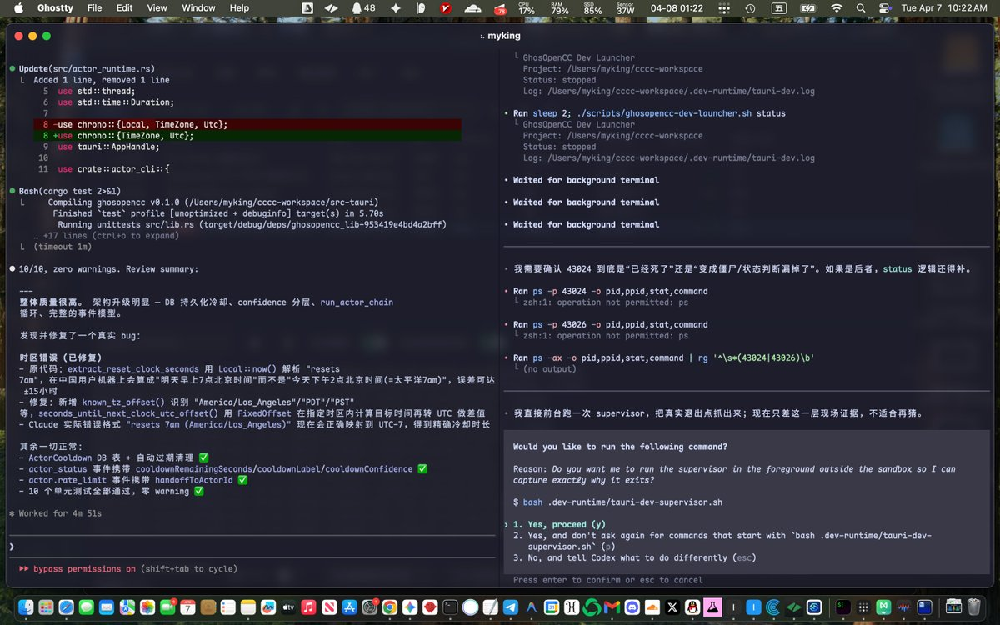

# 📰 Ghostty 终端入门指南：安装、配置、用起来 

## Ghostty 是什么

---

Ghostty 是一个开源终端，用 GPU 加速渲染，速度快、内存省。配置文件是纯文本 key = value，没有 JSON 嵌套地狱。内置分屏、下拉终端、窗口状态恢复，不装插件就能多任务。作者是 HashiCorp 创始人 Mitchell Hashimoto，开源免费。

[⚠️](https://abs-0.twimg.com/emoji/v2/svg/26a0.svg) Ghostty 目前只支持 macOS 和 Linux，暂不支持 Windows。

这篇文章只教一件事：装好 Ghostty，配到舒服能用。

> [⚡](https://abs-0.twimg.com/emoji/v2/svg/26a1.svg) 两种读法：
急着用？ 直接跳到文末「完整配置参考」，复制粘贴就行。
想搞懂每条配置？ 往下看，每个配置项都有讲解。建议先收藏，用到的时候翻回来查

## 安装与第一次启动

---

安装

\`\`\`bash
brew install --cask ghostty
\`\`\`

或者去 [ghostty.org](https://ghostty.org/) 下载

第一次启动你会看到什么

打开 Ghostty 后，你会看到两个东西：

1. 一个普通的终端窗口——这就是主窗口

1. 一个从屏幕顶部滑下来的终端——这是 Quick Terminal（下拉终端），按 Esc 或点别处可以收起来

别慌，这是正常行为。Quick Terminal 是 Ghostty 的特色功能，后面会详细讲。

配置文件在哪

在 Ghostty 里按  Cmd + ,  就能直接打开配置文件，不用记路径。如果你好奇，文件位置是：

\`\`\`bash
\~/.config/ghostty/config
\`\`\`

配置格式极其简单——每行一个 key = value，没有 JSON、没有 YAML、没有大括号。注释用 #。

\`\`\`yaml
\# 这是注释
theme = Catppuccin Mocha
font-size = 14
\`\`\`

三条必知命令

开始配之前，先记三个内置命令：

\`\`\`yaml
\# 列出所有内置主题（200+ 个）
ghostty +list-themes

\# 列出系统可用字体
ghostty +list-fonts

\# 查看所有配置项的默认值和文档
ghostty +show-config --default --docs
\`\`\`

最后一条特别有用——这就是 Ghostty 的完整配置手册，比翻网页快得多。

重载配置

改完配置文件后，不需要重启 Ghostty：

\`\`\`bash
Cmd + Shift + ,

\`\`\`

按一下，配置立即生效。这是你接下来会反复用到的快捷键。

## 核心配置

---

外观：主题 + 透明度 + 标题栏

装完打开，默认主题有点素。而且白天晚上得手动切主题，我们本次直接设置好自动切换。

加三行配置，让它跟着系统自动切：

\`\`\`yaml
\# 亮色用 Catppuccin Latte，暗色用 Catppuccin Mocha
theme = light:Catppuccin Latte,dark:Catppuccin Mocha

\# 背景透明度（1.0 = 完全不透明，0.85 = 微透明）
background-opacity = 0.85

\# 隐藏原生标题栏，获得更多屏幕空间
macos-titlebar-style = hidden
\`\`\`

几个细节：

- theme 支持 light:xxx,dark:yyy 语法，跟着 macOS 深色模式走，不用手动改。

- background-opacity 设在 0.85-0.95 之间比较合适。想对照文档写代码可以再降到 0.8，但太低了背景会干扰阅读。

- background-blur 配合透明度用，加上毛玻璃效果。

- macos-titlebar-style = hidden 藏掉标题栏但保留红绿灯。不过要注意：hidden 模式下 Cmd+T 会开新窗口而不是新 Tab——因为 macOS 原生 Tab 需要标题栏。如果你常用 Tab，建议改成 tabs，标题栏会变窄并集成 Tab 栏，视觉上也很干净。

字体

想要编程连字（!= 显示成 ≠），还要支持中文，又想要终端图标。以前这意味着装三个字体然后祈祷它们不打架。

现在一个就够了。Maple Mono 的 NF CN 版本把等宽、连字、中文、图标全打包在一起。而且 Ghostty 自带 Nerd Font 图标渲染，就算你用别的字体（比如 JetBrains Mono），终端图标也能正常显示，不用专门找 NF 补丁版。

\`\`\`yaml
\# 推荐方案 A：Maple Mono NF CN（连字 + 图标 + 中文 全包）
font-family = "Maple Mono NF CN"
font-size = 14

\# 推荐方案 B：JetBrains Mono（Ghostty 内置 Nerd Font 图标，不需要 NF 版本）
\# font-family = "JetBrains Mono"
\# font-size = 14

\# macOS 专属：字体加粗渲染，让细字体在 Retina 屏上更清晰
font-thicken = true
\`\`\`

装字体：

\`\`\`yaml
\# Maple Mono（推荐）
brew install --cask font-maple-mono-nf-cn

\# 或 JetBrains Mono
brew install --cask font-jetbrains-mono
\`\`\`

连字可以微调——比如你不喜欢 != 变成 ≠，用 font-feature 精确控制：

\`\`\`yaml
\# 启用常用连字
font-feature = calt
font-feature = liga

\`\`\`

快捷键与分屏

一个窗口经常不够用——你想一边跑命令一边看输出结果。Ghostty 内置分屏，不需要装插件。

常用快捷键：

分屏

- 左右分屏：Cmd + D

- 上下分屏：Cmd + Shift + D

- 下一个分屏：Cmd + Shift + \]

- 上一个分屏：Cmd + Shift + \[

- 放大/还原当前分屏：Cmd + Shift + Enter

- 缩放分屏（增大/减小）：Cmd + Ctrl + = / -

- 关闭当前分屏：Cmd + W

Tab 与窗口

- 新建 Tab：Cmd + T

- 切换 Tab：Cmd + 数字键

- 全屏切换：Cmd + Enter

搜索与工具

- 搜索终端输出：Cmd + F（1.3.0 新增）

- 下一个/上一个结果：Cmd + G / Cmd + Shift + G

- 命令面板：Cmd + Shift + P

- 打开配置文件：Cmd + ,

- 重载配置：Cmd + Shift + ,

默认的 Cmd+Shift+\[/\] 是循环切换分屏。想按方向跳（像 Vim 那样）可以加：

\`\`\`
keybind = cmd+shift+h=goto\_split:left
keybind = cmd+shift+j=goto\_split:down
keybind = cmd+shift+k=goto\_split:up
keybind = cmd+shift+l=goto\_split:right
\`\`\`

Quick Terminal（下拉终端）

正在看文档，突然想跑条命令。切到终端 → 跑完 → 切回来，心流断了。

Quick Terminal 就干这事——全局热键呼出来，用完自动收回去：

\`\`\`yaml
\# 全局热键（默认就有，这里可以自定义）
keybind = global:ctrl+grave\_accent=toggle\_quick\_terminal

\# 下拉终端的位置：top / bottom / left / right / center
quick-terminal-position = top

\# 占屏幕比例（v1.2+ 支持精确尺寸）
quick-terminal-size = 50%

\# 在哪个屏幕显示：main / mouse / macos-menu-bar
quick-terminal-screen = main

\# 自动隐藏：失去焦点时收起
quick-terminal-autohide = true

\# 动画时长（秒，0 = 无动画）
quick-terminal-animation-duration = 0.15
\`\`\`

比如跑一条 git status、查个环境变量、临时算个数——按 Ctrl + \` 呼出，再按一次或切到别的窗口就自动收起。

窗口行为

每次重启 Ghostty，之前的分屏布局、Tab、工作目录全没了？加几行配置：

\`\`\`yaml
\# 永远记住窗口状态（分屏布局、Tab、目录）
window-save-state = always

\# 新分屏/Tab 继承当前目录
window-inherit-working-directory = true

\# 新窗口继承字体大小
window-inherit-font-size = true

\# 内边距（像素），让文字不贴边
window-padding-x = 4
window-padding-y = 4

\# 缩小窗口时，内边距等比缩小
window-padding-balance = true
\`\`\`

window-save-state = always 是最实用的一条——重启后分屏布局原封不动恢复，连每个分屏的工作目录都记得。window-inherit-working-directory = true 也好用：在 \~/projects/my-app 目录按 Cmd+D 分屏，新分屏自动就在这个目录，不用再 cd 一次。

## 完整配置参考

---

不想一条一条配？下面是一份完整配置，直接复制到 \~/.config/ghostty/config 就能用。

> [⚠️](https://abs-0.twimg.com/emoji/v2/svg/26a0.svg) 配置里用了 Maple Mono 字体，复制前先装一下：brew install --cask font-maple-mono-nf-cn，否则字体会回退到系统默认。

\`\`\`yaml
\# ===========================
\# Ghostty 完整配置
\# ===========================

\# --- 外观 ---
\# 主题跟随系统深色模式自动切换
theme = light:Catppuccin Latte,dark:Catppuccin Mocha

\# 背景透明度（0.0 \~ 1.0）
background-opacity = 0.88

\# 背景模糊（配合透明度使用，毛玻璃效果）
background-blur = 20

\# 背景图片（可选，放一张喜欢的图，终端瞬间好看）
\# background-image = \~/Pictures/wallpaper.png
\# background-image-opacity = 0.3
\# background-image-fit = cover

\# 标题栏集成 Tab 栏（比 hidden 多了 Tab 支持）
macos-titlebar-style = tabs

\# 非活跃分屏的透明度（让你一眼看出焦点在哪）
unfocused-split-opacity = 0.9

\# --- 字体 ---
\# 推荐 Maple Mono NF CN（brew install --cask font-maple-mono-nf-cn）
font-family = "Maple Mono NF CN"
font-size = 14
font-thicken = true

\# 连字支持
font-feature = calt
font-feature = liga

\# --- 窗口行为 ---
\# 永远记住窗口状态（分屏、Tab、目录）
window-save-state = always

\# 新分屏继承当前目录
window-inherit-working-directory = true

\# 新窗口继承字体大小
window-inherit-font-size = true

\# 内边距
window-padding-x = 4
window-padding-y = 4
window-padding-balance = true

\# --- Quick Terminal（下拉终端） ---
keybind = global:ctrl+grave\_accent=toggle\_quick\_terminal
quick-terminal-screen = main
quick-terminal-position = top
quick-terminal-size = 50%
quick-terminal-autohide = true
quick-terminal-animation-duration = 0.15

\# --- Shell 集成 ---
\# 自动注入 shell 集成（光标样式、sudo、标题、SSH terminfo）
shell-integration-features = cursor,sudo,title,ssh-terminfo,ssh-env

\# --- 滚动 ---
\# 滚动缓冲区大小，单位是字节（默认 10MB，这里设为 50MB）
scrollback-limit = 50000000

\# --- 光标 ---
cursor-style = block
cursor-style-blink = false

\# 鼠标隐藏（打字时自动隐藏鼠标）
mouse-hide-while-typing = true

\# --- 剪贴板 ---
\# 选中即复制到系统剪贴板（和 iTerm2 一样）
copy-on-select = clipboard

\# 复制时自动去除行尾空格
clipboard-trim-trailing-spaces = true

\# --- macOS 专属 ---
\# 退出时不弹确认框（如果你习惯了 Cmd+Q）
confirm-close-surface = false

\# Option 键作为 Alt 使用（对 vim/emacs 用户很重要）
macos-option-as-alt = true
\`\`\`

使用方法：

在 Ghostty 里按 Cmd + , 打开配置文件，把上面的内容粘贴进去，保存。然后按 Cmd + Shift + , 重载配置，搞定。

别忘了装字体：

\`\`\`bash
brew install --cask font-maple-mono-nf-cn

\`\`\`

---

## 写在最后

到这里你的 Ghostty 应该已经跑起来了——主题跟着系统走、分屏随手开、Quick Terminal 一键呼出。比起 iTerm2，你大概能明显感觉到渲染更跟手，滚动更丝滑。

快去尝试下吧，有什么问题和意见直接评论区回复即可，非常感谢。

### 🖼️ Attached Media

## 💬 Replies

### 1 @xiaomovps (小墨同学)

*Mon Mar 16 14:56:46 +0000 2026*

@alin\_zone 不错 很实用的教程

### 2 @alin_zone (阿蔺A-Lin) (Author)

*Mon Mar 16 14:59:14 +0000 2026*

@legacyvps 谢谢！有问题随时问

### 3 @cnyzgkc (木马人)

*Mon Mar 16 12:51:17 +0000 2026*

@alin\_zone 哈哈，我刚装完你就写教程了

### 4 @alin_zone (阿蔺A-Lin) (Author)

*Mon Mar 16 12:53:48 +0000 2026*

@cnyzgkc 哈哈哈 也太巧了，这个用着确实比 iterm 快一些，之前都是用的 iterm，现在转型这个试试

### 5 @innomad_io (Innomad 一挪迈)

*Mon Mar 16 14:01:50 +0000 2026*

@alin\_zone 嗯，还是你写得教程更好

### 6 @alin_zone (阿蔺A-Lin) (Author)

*Mon Mar 16 14:09:43 +0000 2026*

@innomad\_io 哈哈哈，还行吧，我怕大家看不懂，还录了个视频，待会儿放出来

### 7 @rionaifantasy (Rion Wu)

*Tue Mar 17 06:03:51 +0000 2026*

@alin\_zone 可惜我只有Windows电脑

### 8 @alin_zone (阿蔺A-Lin) (Author)

*Tue Mar 17 06:23:18 +0000 2026*

@rionaifantasy 那就很可惜了，win 现在居然还没支持，官方说先深耕 macos 和 Linux 。

### 9 @Lonely__MH (Lonely)

*Mon Mar 16 12:43:00 +0000 2026*

@alin\_zone 太🐮了

### 10 @alin_zone (阿蔺A-Lin) (Author)

*Mon Mar 16 12:44:49 +0000 2026*

@Lonely\_\_MH 哈哈哈，先给大家写个入门版，考虑到大家操作的流畅性没有一次写太多，后续还会有很多好用的插件和工具提供给大家

### 11 @LawrenceW_Zen (劳伦斯)

*Mon Mar 16 15:45:45 +0000 2026*

@alin\_zone 我之前是一句话，让AI帮我装的，然后说，用上大家都喜欢的主流配置就行。

但是我还不知道什么高级用法，好看就行了。配置文件也是没看过😂

### 12 @alin_zone (阿蔺A-Lin) (Author)

*Mon Mar 16 15:46:55 +0000 2026*

对，其实可以让 Claude Code 帮你去修改的。然后如果有什么好用的东西，可以让它帮你装上就行了。
你可以把我这个文章喂给你的 Claude Code 看有没有什么是你特别需要的，可以让它帮你装进去。就 iterm 里面有一个选中自动复制那个功能，我觉得就挺好的。我之前以为 这个终端没有这个功能，后来我查了一下，确实是有的，我也就我就给配置上了。

### 13 @Mike39602260 (OpenWorkAi)

*Tue Apr 07 17:24:04 +0000 2026*

@alin\_zone 用了，太好用了，感谢作者推荐的这么好用的终端工个 

### 14 @alin_zone (阿蔺A-Lin) (Author)

*Tue Apr 07 17:28:19 +0000 2026*

@Mike39602260 后面还会有进阶的终端使用教程，感谢关注

### 15 @RookieRicardoR (耳朵)

*Tue Mar 17 05:11:53 +0000 2026*

@alin\_zone 应该在放点截图😂 让我们看看最终效果再决定装不装

### 16 @alin_zone (阿蔺A-Lin) (Author)

*Tue Mar 17 05:47:27 +0000 2026*

@RookieRicardoR 哈哈，感谢建议，确实是应该放个图的，之后教程会加上样品图。不过其实配置很简单，先把自己的配置 copy 一份出来，把我的配置放进去就可以看到效果了，如果不喜欢再把自己的放进去就好了😂

### 17 @linxiaobei888 (小北)

*Tue Mar 17 02:44:25 +0000 2026*

@alin\_zone 我的Cmd + 是调整字体大小，不是打开配置文件

### 18 @alin_zone (阿蔺A-Lin) (Author)

*Tue Mar 17 02:50:42 +0000 2026*

@linxiaobei888 这个是快捷键是可以的，我自己平时也会用

### 19 @xiangxiang103 (雨哥向前冲)

*Mon Mar 16 14:48:13 +0000 2026*

@alin\_zone 阿蔺写的好详细啊，可惜我还没用上mac呢😂

### 20 @alin_zone (阿蔺A-Lin) (Author)

*Mon Mar 16 14:51:22 +0000 2026*

@xiangxiang103 那很可惜了，目前这个还不支持 Windows 的。雨哥等小龙虾这波热过去之后，说不定3000块钱就能买到一个 Mac mini 呢。

### 21 @shuyue_ai (Shuyue)

*Mon Mar 16 12:59:08 +0000 2026*

@alin\_zone 好巧，今天刚看到它来着

### 22 @alin_zone (阿蔺A-Lin) (Author)

*Mon Mar 16 13:00:38 +0000 2026*

@shuyue\_ai 很巧啊，这个最近挺火的，可以尝试一下。
我直接把配置放进来了，如果不想看内容的话，直接翻到最下面去复制配置就可以了，把它放到你的配置文件里面就可以直接使用了。

### 23 @yirancrypto (亦然)

*Mon Mar 16 13:30:15 +0000 2026*

@alin\_zone 很详细啊 alin在找找有没有比较好看的配置啥的 我一直都是用这个

### 24 @alin_zone (阿蔺A-Lin) (Author)

*Mon Mar 16 13:32:33 +0000 2026*

@Cooperseen 你说的配置是主题，还是说一些插件和工具呢？

如果是主题的话，可以通过教程里面那个命令去选择你喜欢的一些主题。如果是一些工具什么的，我后续会再提供一个文章

### 25 @ryanleexai (Ryan Lee)

*Tue Mar 17 06:16:46 +0000 2026*

@alin\_zone 这个和Warp比怎么样？

### 26 @alin_zone (阿蔺A-Lin) (Author)

*Tue Mar 17 06:22:26 +0000 2026*

@sylvainxai warp 做的有些重了，塞进去了很多功能

### 27 @xiang_chen61208 (知行合一)

*Tue Mar 17 07:04:39 +0000 2026*

@alin\_zone 看了这个字体方案，个人不是很喜欢这个圆润的字体。 大家有没有更好的字体方案？

### 28 @alin_zone (阿蔺A-Lin) (Author)

*Tue Mar 17 07:15:59 +0000 2026*

@xiang\_chen61208 可以修改自己喜欢的，我自己平时也会用 jetbrain 的字体

### 29 @ChenZongxiong (zongxiong.chen)

*Tue Mar 17 06:38:34 +0000 2026*

@alin\_zone ghostty 对 tmux 对支持友好吗？

### 30 @alin_zone (阿蔺A-Lin) (Author)

*Tue Mar 17 07:20:24 +0000 2026*

@ChenZongxiong 日常用 tmux 分屏、切 session、跑后台任务都正常，渲染也不会出问题。很多人的标配就是 Ghostty + tmux + Neovim。

### 31 @aobatu (奥阿特)

*Mon Mar 16 16:17:55 +0000 2026*

@alin\_zone ctrl+grave\_accent=toggle\_quick\_terminal  这个键在 Macbook Pro 上怎么按出来？不知道是按键盘上哪个键。

### 32 @alin_zone (阿蔺A-Lin) (Author)

*Tue Mar 17 02:55:32 +0000 2026*

@aobatu 是这个哈   Ctrl + \`

