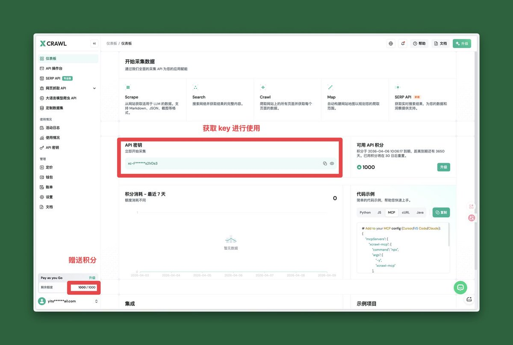
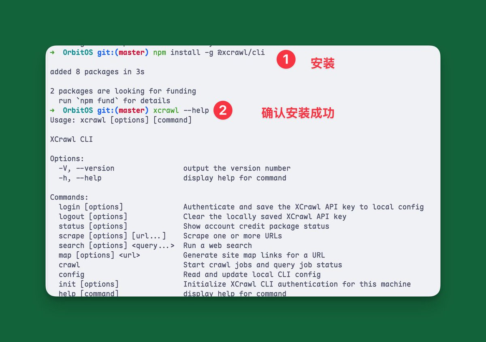
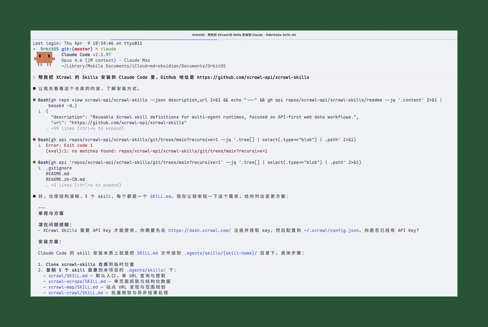
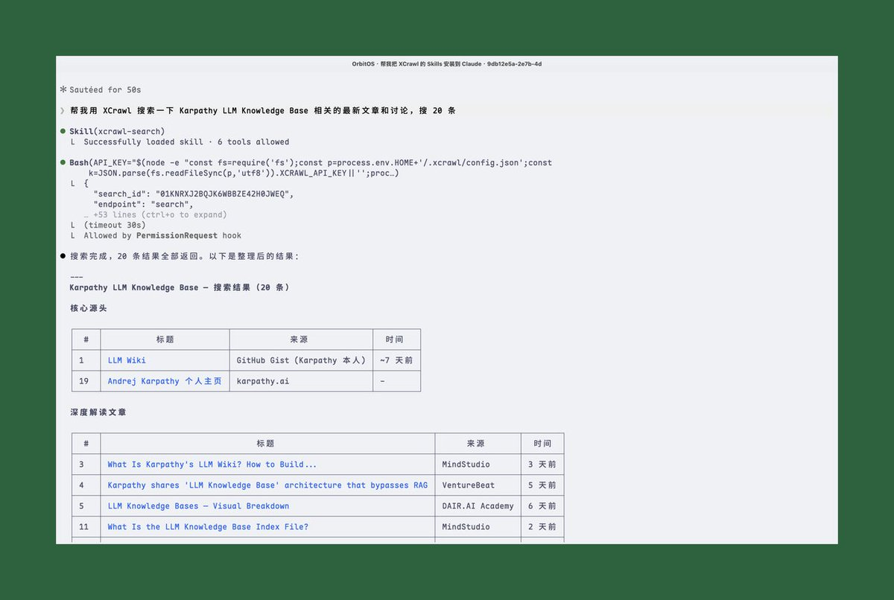
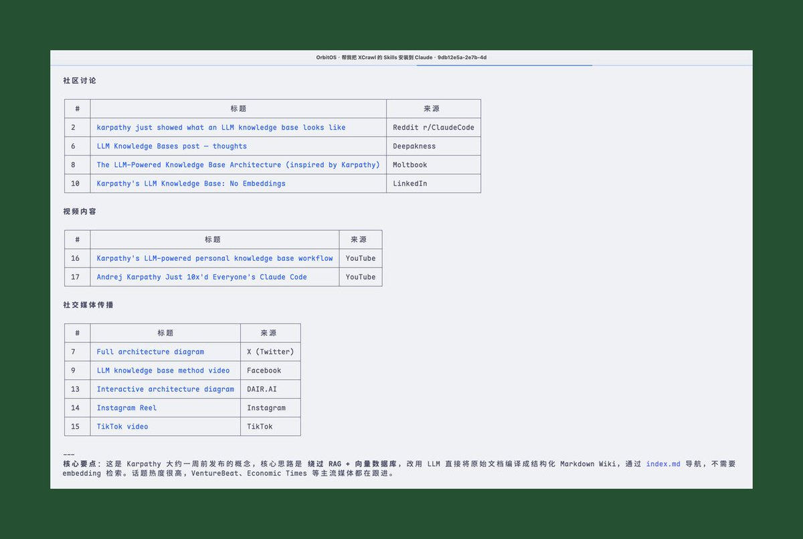
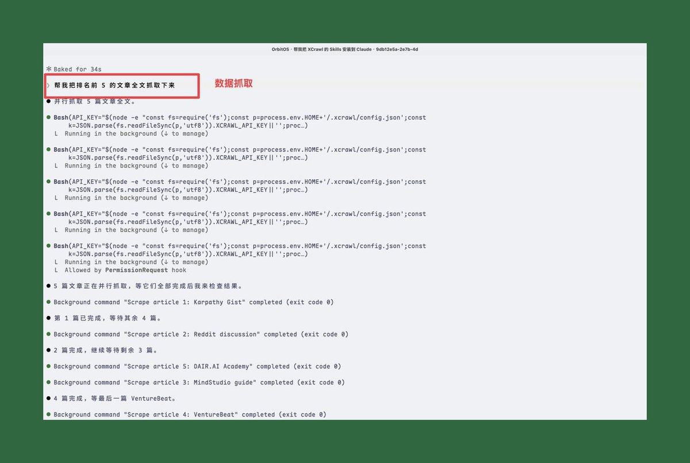
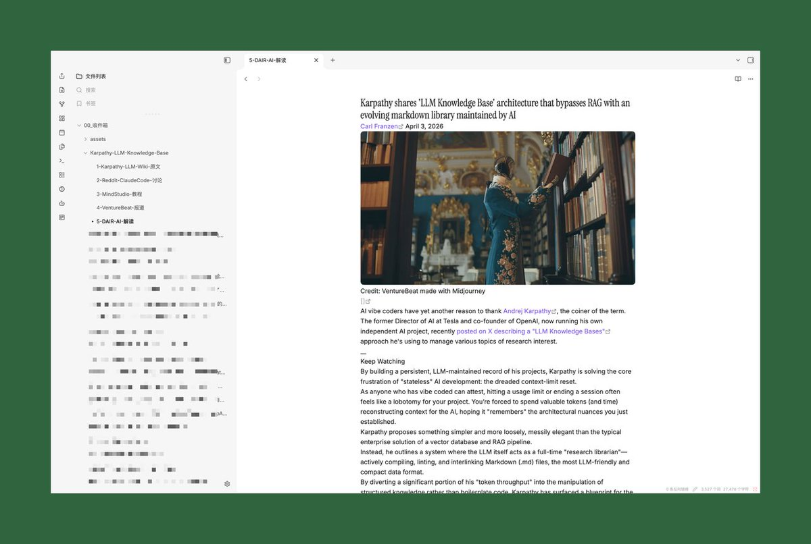
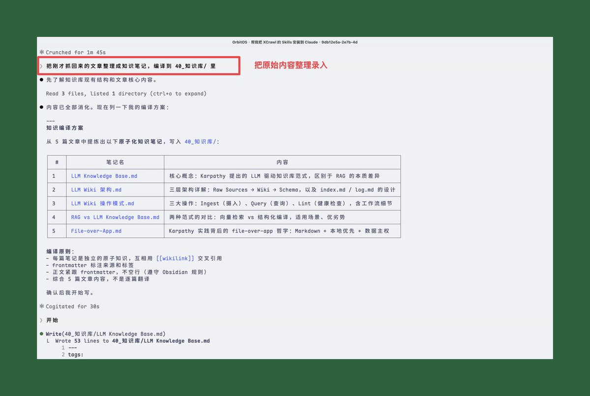
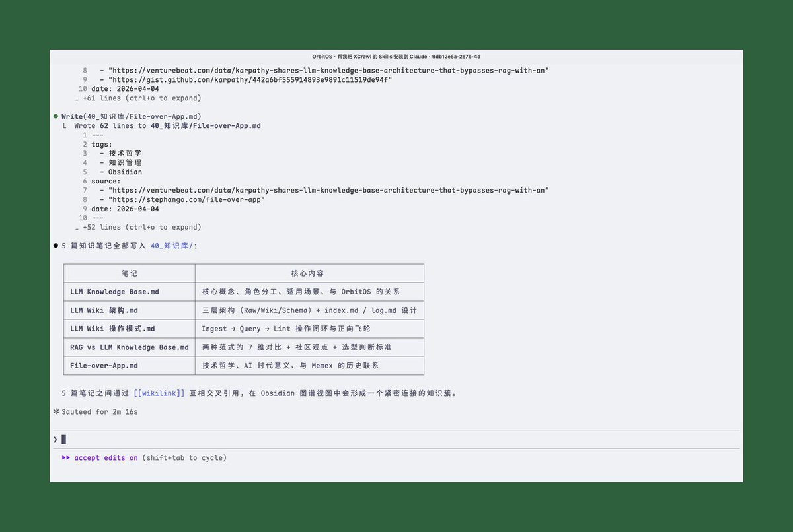

# 📰 Karpathy 的知识库方案，差一个能搜全网的工具

Karpathy 前几天发了个知识库方案，架构很漂亮：文档丢进去，LLM 自动编译成 wiki，查东西直接查 wiki，不用每次从头翻原文。

但有一个问题他没解决：信息从哪来？

他的方案里，数据输入靠 Web Clipper 手动剪。一篇一篇剪，研究一个新话题得花半小时搜集素材。架构再好，喂不进料也白搭。

我试了一个工具，把这一环补上了。

---

## 我的知识库系统

我之前基于一个叫 OrbitOS 的开源项目，用 Obsidian 搭了一套自己的知识系统，干的就是这件事。有需要的可以看下面的教程 👇

[Embedded Tweet: https://x.com/i/status/2021186943787335953]

00收件箱/ 放原始素材，AI 自动编译成 40知识库/ 里的知识条目，写文章的时候直接从知识库调用。和 Karpathy 描述的架构一模一样。

---

## 卡点：搜索不够用

但有一个环节一直不够好：信息输入。

Claude Code 自带的 WebSearch 能搜，但返回的结果有限，摘要也很短。碰到一个新话题想系统性地搜集资料，WebSearch 的覆盖面和深度都不够用。

知识库的瓶颈不是整理，AI 整理得比我好。瓶颈是喂料，喂进来的量和质都受限于搜索工具本身。

---

## XCrawl：给 Claude Code 装上全网搜索

最近试了一下 XCrawl，这个环节可以自动化了。

它给 Claude Code 提供了一组 Skills，装上之后 Claude Code 就能搜网页、抓全文。你不用敲命令，直接说你想搜什么、抓什么，它自动执行。

---

## 准备工作

手动操作只有两步：

[1️⃣](https://abs-0.twimg.com/emoji/v2/svg/31-20e3.svg) 去 [xcrawl](https://xcrawl.com/?keyword=dcjjy5qc) 注册，拿到 API Key（新账号送 1000 免费积分，不用绑卡）

[2️⃣](https://abs-0.twimg.com/emoji/v2/svg/32-20e3.svg) 装 CLI

\`\`\`bash
npm install -g @xcrawl/cli
\`\`\`

剩下的交给 Claude Code。打开 Claude Code，说一句：

\`\`\`plaintext
帮我把 XCrawl 的 Skills 安装到 Claude Code 里，GitHub 地址是 https://github.com/xcrawl-api/xcrawl-skills ，顺便帮我配置 API Key：xxx
\`\`\`

Claude Code 会自动 clone 仓库、装好 Skills、配好 Key。

---

## 实测：搜索

装好之后跑个真实场景。

我在 Claude Code 里说了一句：

\`\`\`plaintext
帮我用 XCrawl 搜索一下 Karpathy LLM Knowledge Base 相关的最新文章和讨论，搜 20 条
\`\`\`

几秒钟返回了 20 条结果，Claude Code 还自动帮我分成了「核心源头」和「深度解读文章」两类。Karpathy 本人的 GitHub Gist、VentureBeat 的报道、社区讨论都搜到了。

---

## 实测：抓取全文

接着我说：「帮我把排名前 5 的文章全文抓取下来」

Claude Code 调用 xcrawl-scrape 逐个抓取，返回干净的 Markdown 正文，自动保存到 00\_收件箱/Karpathy-LLM-Knowledge-Base/ 目录下。

---

## 实测：编译进知识库

最后一步：「把刚才抓回来的文章整理成知识笔记，编译到知识库里」

Claude Code 自动读取 5 篇原始素材，提取核心概念，生成了 5 篇结构化的知识笔记：

- LLM Knowledge Base.md，核心概念、角色分工、适用场景

- LLM Wiki 架构.md，三层架构（Raw/Wiki/Schema）+ index 设计

- LLM Wiki 操作模式.md，Ingest → Query → Lint 操作闭环

- RAG vs LLM Knowledge Base.md，两种范式的对比和选型

- File-over-App.md，技术哲学、AI 时代意义

5 篇笔记之间用 wikilink 互相引用，在 Obsidian 里自动形成知识图谱。

---

## 完整流程回顾

\`\`\`plaintext
帮我搜 Karpathy LLM Knowledge Base 的最新讨论」
    ↓
xcrawl-search 返回 20 条结果
    ↓
「帮我把前 5 篇全文抓下来」
    ↓
xcrawl-scrape 抓取，自动保存到收件箱
    ↓
「整理成知识笔记，编译到知识库」
    ↓
5 篇结构化知识笔记写入 40\_知识库/
\`\`\`

三句话，从「我想了解这个话题」到「知识库里多了一组结构化笔记」。全程自然语言，没敲一条命令。

---

## 使用体感

搜索结果覆盖面比 WebSearch 广不少，基本上主流媒体、GitHub、Reddit、YouTube 都能搜到。抓取回来的内容是干净的 Markdown，不用再手动清理 HTML 标签。积分消耗也比我预想的低，搜索 + 抓取 5 篇全文，整套流程跑下来才用了二十多积分，送的 1000 积分够折腾很久。

---

Karpathy 说他的 data ingest 靠 Web Clipper 手动剪。

当然这个也是一种方式，我也写过 Obsidian Web Clipper 插件的使用教程，可以看下面的文章，但是这个方式只适合平时看到一些好的信息的时候剪藏使用，不适合批量去检索和使用

[Embedded Tweet: https://x.com/i/status/2027692558944768444]

不过现在不用了。搜索、抓取、落库、编译，一条龙自动化。第二大脑的「喂料」问题，算是有解了。

如果你也有类似的信息采集需求，可以试试这套组合。装好 XCrawl，让 Claude Code 带着跑一遍「搜索 → 抓取 → 整理」，你会发现比手动搜集快太多了。

---

XCrawl 注册送 1000 免费积分，不用绑卡 → https://xcrawl.com/?keyword=dcjjy5qc

### 🖼️ Attached Media

## 💬 Replies

### 1 @CryptoJHK (AI军火库)

*Mon Apr 13 11:41:04 +0000 2026*

@alin\_zone 牛呀，老板分享的很实用

### 2 @alin_zone (阿蔺A-Lin) (Author)

*Mon Apr 13 11:44:19 +0000 2026*

@CryptoJHK 感谢支持

### 3 @nash_su (nash_su - e/acc)

*Tue Apr 14 02:33:37 +0000 2026*

@alin\_zone 这个跟我做的 llm-wiki 里的 deepresearch 功能很像，不过 llm-wiki 用的是 Tavily

### 4 @alin_zone (阿蔺A-Lin) (Author)

*Tue Apr 14 02:56:15 +0000 2026*

@nash\_su 大佬之前的那个设计我也看了，设计思路很像，只不过是工具不同，这个系统是需要一个强有力的数据灌入的工具，不然前期使用起来可能会感觉不到强大

### 5 @4111y80y (Adair Lee)

*Mon Apr 13 13:58:28 +0000 2026*

@alin\_zone 平时找资料太耗时，能自动化省大事了。

### 6 @alin_zone (阿蔺A-Lin) (Author)

*Mon Apr 13 14:29:02 +0000 2026*

@4111y80y 对的，可以自己设置定时每天早晨或者固定时间自动化获取信息，保持对AI最新技术的了解

### 7 @iml1s (ImL1s)

*Mon Apr 13 12:09:23 +0000 2026*

@alin\_zone Web Clipper 的確是個痛點，手動 clip 本身就破壞了「無感積累」的體驗。其實更理想的方案是讓 browser extension 在背景自動抓取瀏覽歷史+停留時間判斷值不值得收錄，結合 LLM 過濾雜訊。Karpathy 這個框架搭好了，資料來源才是關鍵缺口。

### 8 @alin_zone (阿蔺A-Lin) (Author)

*Mon Apr 13 12:20:35 +0000 2026*

@aa22396584 是的，后续可以做成自动抓取的行为来去不断的丰富自己的素材库，Karpathy 的模式其实就是要很多数据

### 9 @ddny09 (Evan.Z)

*Mon Apr 13 11:50:48 +0000 2026*

@alin\_zone 学习了👍

### 10 @alin_zone (阿蔺A-Lin) (Author)

*Mon Apr 13 12:08:24 +0000 2026*

@ddny09 生命不息，学习不止 哈哈

### 11 @ModengSir (Modengsir AI)

*Mon Apr 13 11:23:09 +0000 2026*

@alin\_zone 等了好久，才出干货😃

### 12 @alin_zone (阿蔺A-Lin) (Author)

*Mon Apr 13 11:24:21 +0000 2026*

@ModengSir claude 封号和降智属实是影响效率，还有就是频繁的掉登录，这个陈年老 bug 也不知道什么时候能修。明天也有干货，不要错过

### 13 @jinglian (前端哥Liam)

*Mon Apr 13 12:58:43 +0000 2026*

@alin\_zone 挺好的，我之前也用Claude Code，Xcrawl，还有 NotebookLm 结合起来跑了一个工作流，快速整理大量的博客做筛选。

### 14 @alin_zone (阿蔺A-Lin) (Author)

*Mon Apr 13 14:27:34 +0000 2026*

@jinglian 对的，这几个配合起来用很舒服，我也把Gemini接入到我的工作流中了，搜索还挺强大的

### 15 @xiangxiang103 (雨哥向前冲)

*Mon Apr 13 11:19:54 +0000 2026*

@alin\_zone 这个配合不错，抓取信息入库，然后再让ai梳理成自己的知识库

### 16 @alin_zone (阿蔺A-Lin) (Author)

*Mon Apr 13 11:21:24 +0000 2026*

@xiangxiang103 我们做的事情都需要海量的信息录入，如果信息收集侧不够强大的话也会导致我们的判断出现偏差

### 17 @KtAIFeed (荒野饲养员)

*Mon Apr 13 11:20:21 +0000 2026*

@alin\_zone 这个思路把Karpathy的知识库概念又往前推了一步。以前最头疼的资料收集和整理环节，现在用XCrawl几句对话就自动化完成了，真正让第二大脑从想法变成了日常可用的工具，我要试一下，如果不好用再回来喷也不迟😁

### 18 @alin_zone (阿蔺A-Lin) (Author)

*Mon Apr 13 11:21:56 +0000 2026*

@KtAIFeed 反正免费 1000 积分，我觉得是能用挺久了，试试也不吃亏

### 19 @aehyok (AI少年)

*Mon Apr 13 13:39:10 +0000 2026*

@alin\_zone 这个点子不错，配置上这个插件 如意起飞

### 20 @alin_zone (阿蔺A-Lin) (Author)

*Mon Apr 13 14:28:25 +0000 2026*

@aehyok 是啊，这个插件主要是获取信息非常方便，尤其是能从reddit这些社区获取信息，很棒

### 21 @bccdc5 (Ethen(伊森）)

*Mon Apr 13 11:32:57 +0000 2026*

@alin\_zone 满满的干货，先试试，反正有1000积分，用好了再付费😄

### 22 @alin_zone (阿蔺A-Lin) (Author)

*Mon Apr 13 11:35:37 +0000 2026*

@bccdc5 没毛病，我感觉这 1000积分能用挺久的，我自己实验了几次，才用了几十积分

### 23 @Lonely__MH (Lonely)

*Mon Apr 13 11:43:10 +0000 2026*

@alin\_zone 👍

### 24 @frankEvolu33064 (frank Evolution)

*Tue Apr 14 09:58:29 +0000 2026*

@alin\_zone 感谢老师，已收藏，非常值得反复阅读思考

### 25 @bruno27vk (Bruno27vk)

*Sat Jul 25 20:54:32 +0000 2026*

@alin\_zone 非技术人员用 Zapier 接 Geonode，拖拽几下就能爬数据，业务驱动采集，工程师不用当客服 🤖[geonode.com/zh](http://geonode.com/zh)s

### 26 @kora_lenma (len Kora)

*Sun Aug 09 06:04:43 +0000 2026*

@alin\_zone 给穷困开发者留了条活路。[geonode.com/zh](http://geonode.com/zh) 注册即送测试额度，后续价格又低，个人搞点副业完全够上 ⚡

### 27 @ssaha6242 (sneha)

*Sun Jul 26 06:52:12 +0000 2026*

@alin\_zone 📱 用[geonode.com/zh](http://geonode.com/zh)H 抓取社交媒体，他们的代理池天然绕过速率限制，不会触发风控告警。🛡️

