# 📰 3 步带你搭建 Karpathy 同款 AI 知识库（附教程）

OpenAI 联合创始人卡帕西在他的知识库里塞了 40 万字、上百篇文章，但他自己从来不整理一个字，而是全部交给 AI。

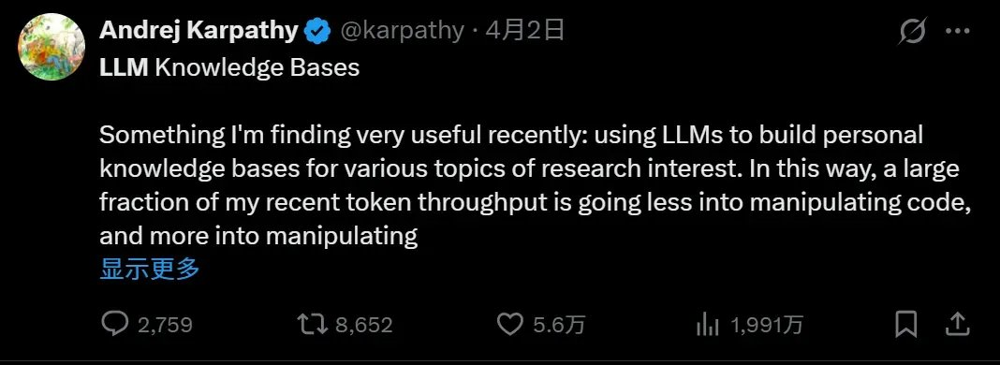

他前几天把这套方法公开在了 GitHub 上，一条推文直接冲上 1900 万曝光，全网刷屏。

核心思路就是让 AI 帮你维护知识网络，而不是你自己整理。

我们经常会收藏很多内容，好的文章、播客、视频等等，存了成百上千条，但真正会去翻出来用的几乎没有。而且存的又很分散，等两三周后想再去找，放在哪儿也都忘了。

这些好的内容根本无法被我们吸收，只能白白躺在收藏夹，这是大部分人在知识管理上的通病。

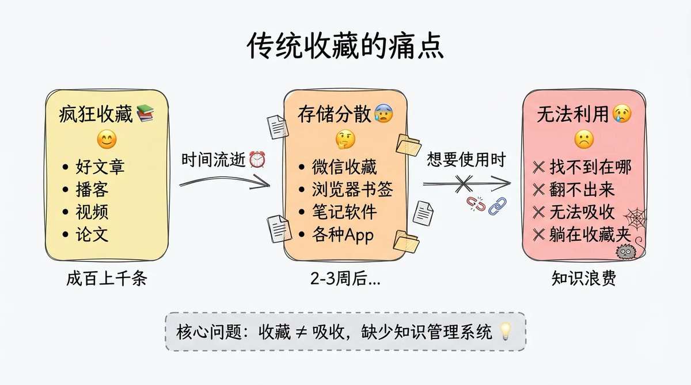

## 通过本文你将学到：

1. 为什么卡帕西这套 AI 知识库有价值

1. 这套知识库原理和结构是什么

1. 如何搭建属于你的 AI 知识库

# 为什么这个方法有用

过去也有人提出用知识库解决知识整理的问题，但以前的AI知识库本质上就是"AI 搜索"。你上传一堆文章，问问题的时候它去检索相关段落，拼凑一个回答。每次问答都是从零开始，这次的回答对下次没有任何积累。

卡帕西的这套方法不一样。

它能让你每次丢进一篇新资料后，AI 都会主动去阅读、提炼概念、建立和已有内容的关联。

每次你问一个好问题，答案也会被沉淀进知识网络。

你的知识库会越用越懂你，这才是真正的知识复利。

# 三层架构

那 AI 到底是怎么做到这些的？

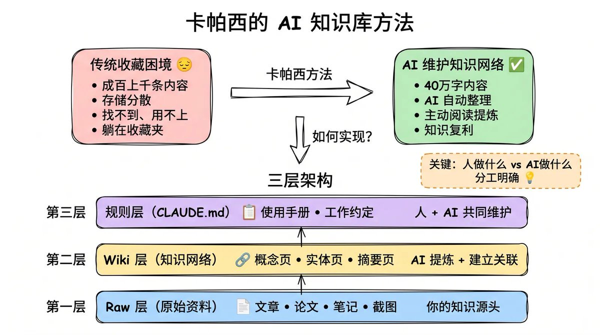

答案就在卡帕西设计的这套三层架构里，关键是把"人做什么、AI 做什么"分得清清楚楚。

## 第一层是原始资料层，也叫 Raw 层

你把平时收集的文章、论文、笔记、截图，全都扔进来就行，AI会读取这里的内容。这一层就是你所有知识的源头。

## 中间是 Wiki 知识网络层

AI 会把原始资料提炼成一个个概念页、实体页、摘要页，再把它们互相链接起来，最后形成一张知识地图。

## 最上面是规则层

其实就是一个叫 [CLAUDE.md](http://claude.md/) 的文件，像一本使用手册一样告诉 AI 这个知识库长什么样、该怎么工作。这一层是你和 AI 共同维护的约定。

# 如何怎么搭建

## 第一步，准备工具

这里我用的是 Obsidian。

这是一款本地笔记软件，可以把你的所有数据都存在本地电脑上，搭配里面的 AI 插件，就能直接在笔记里跟 AI 对话，我后面整个知识库的搭建和维护都在这里完成。

关于 Obsidian 的安装教程我之前的笔记里也有讲过。

## 第二步，让 AI 搭建知识库结构

在 GitHub 上找到卡帕西开源的这份文档，把链接直接丢给 AI，告诉它：帮我根据这份内容搭建文件夹结构

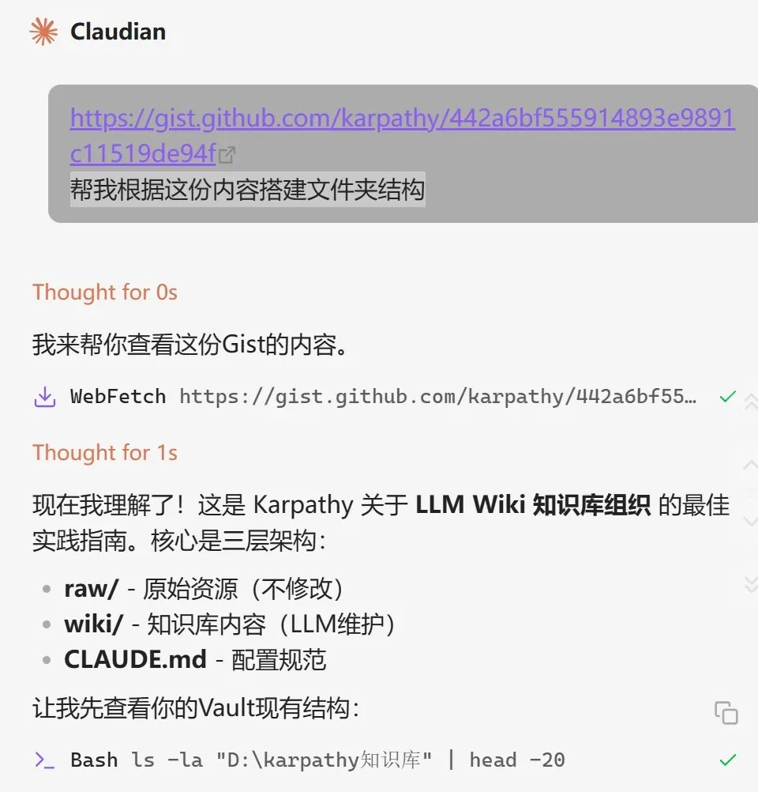

AI 会自动读取这份文档，然后帮你创建 raw（原始资料）、wiki（知识网络），还有 [CLAUDE.md](http://claude.md/) 文件。

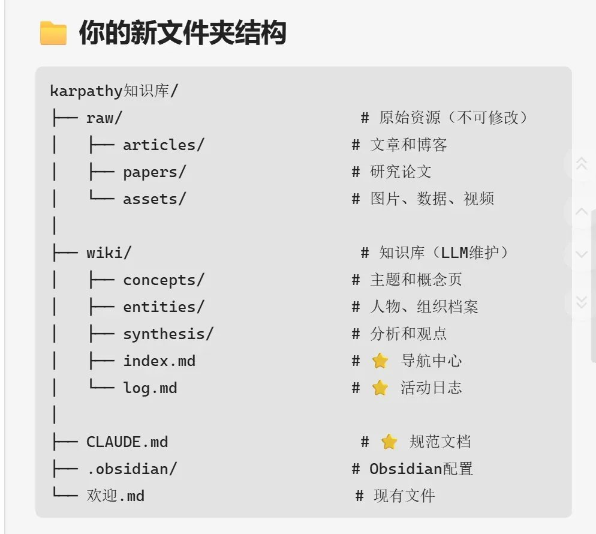

第三步，开始录入资料

可能有人要问，那我怎么把收藏的资料放进来呢？

这里推荐用 Obsidian 官方出的 Chrome 插件，叫 Obsidian Web Clipper。它能一键把网页内容和 YouTube 视频，以 Markdown 格式直接保存到 Obsidian 本地。

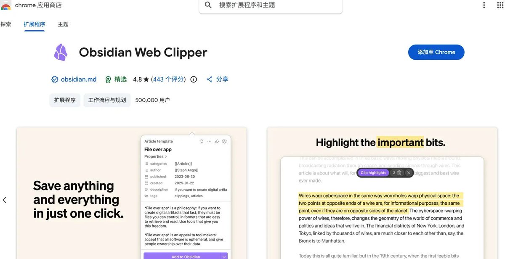

比如我最近想学 harness engineering，在 YouTube 上刷到一个质量不错的视频。以前收藏视频挺麻烦的，字幕没法直接复制收藏。

现在我可以直接点一下插件，它就会自动把整段字幕提取出来，转成 Markdown，直接存进我知识库里。

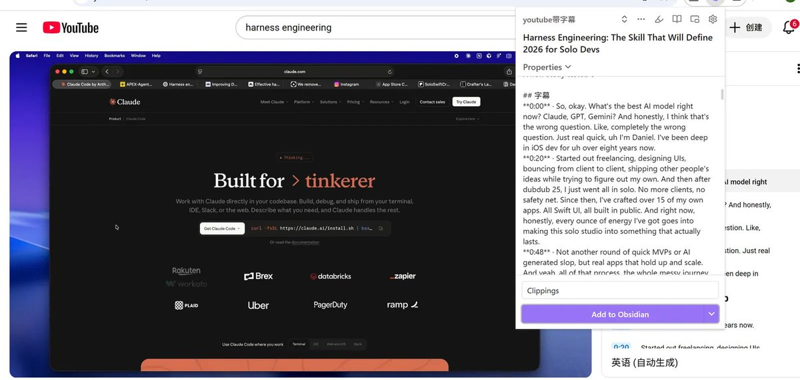

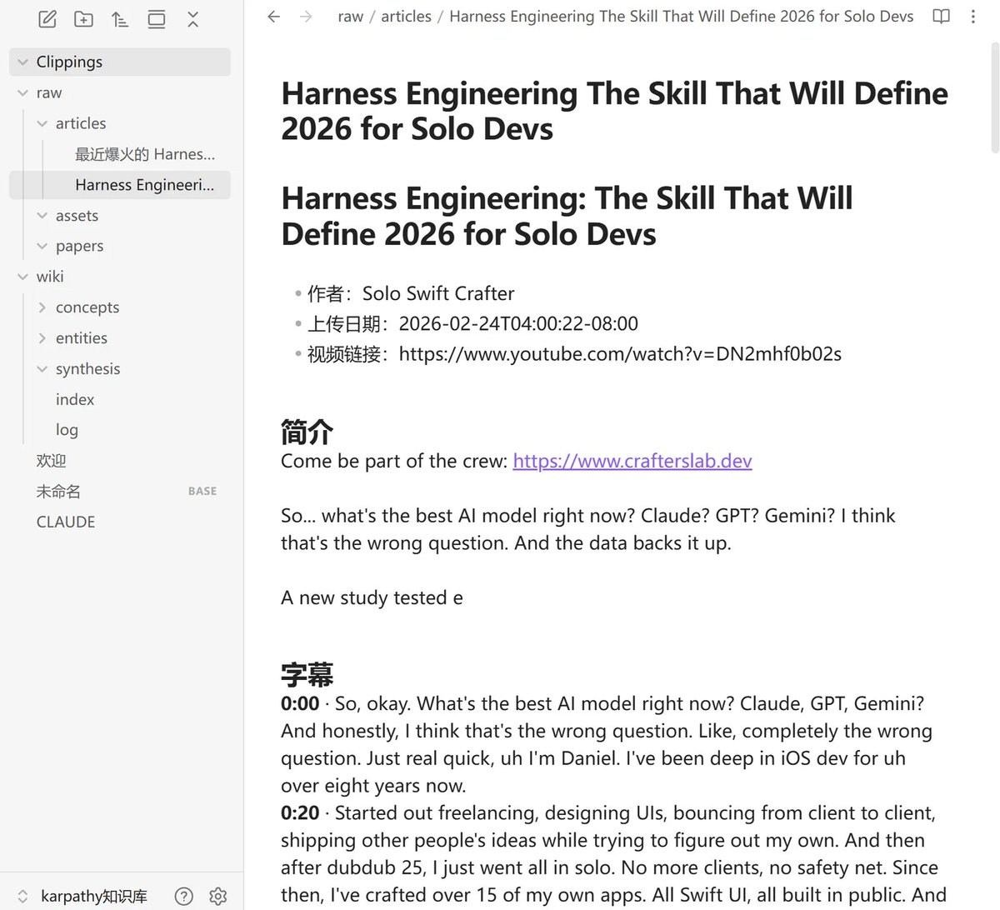

网页文章也是一样的流程。看到好内容直接就能进知识库。

在内容被放入raw文件夹后，我继续告诉 AI：我新增了一篇文章，帮我整理。

接下来 AI 会先把文章通读一遍，提炼出里面的核心概念。

比如我录入那篇讲 Harness Engineering 的文章，AI 会直接帮我把每个页面都自动梳理好结构，还顺手建好了 2 个 Creator 档案，记录这些观点是哪些作者提出来的。

最后它还会给我一份「核心内容速览」，把几篇文章提炼出来的共识用一张表格列出来，并且建议我下一步可以做什么。

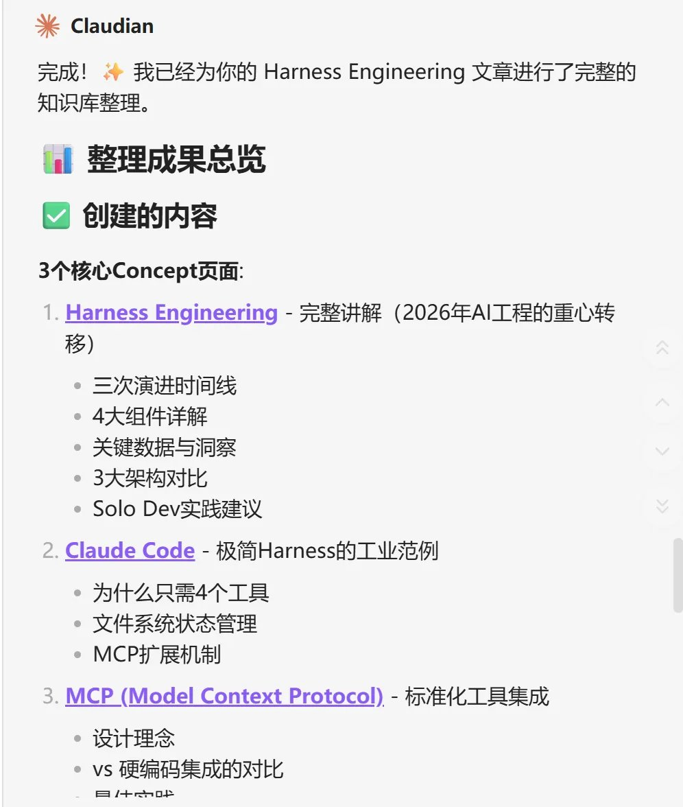

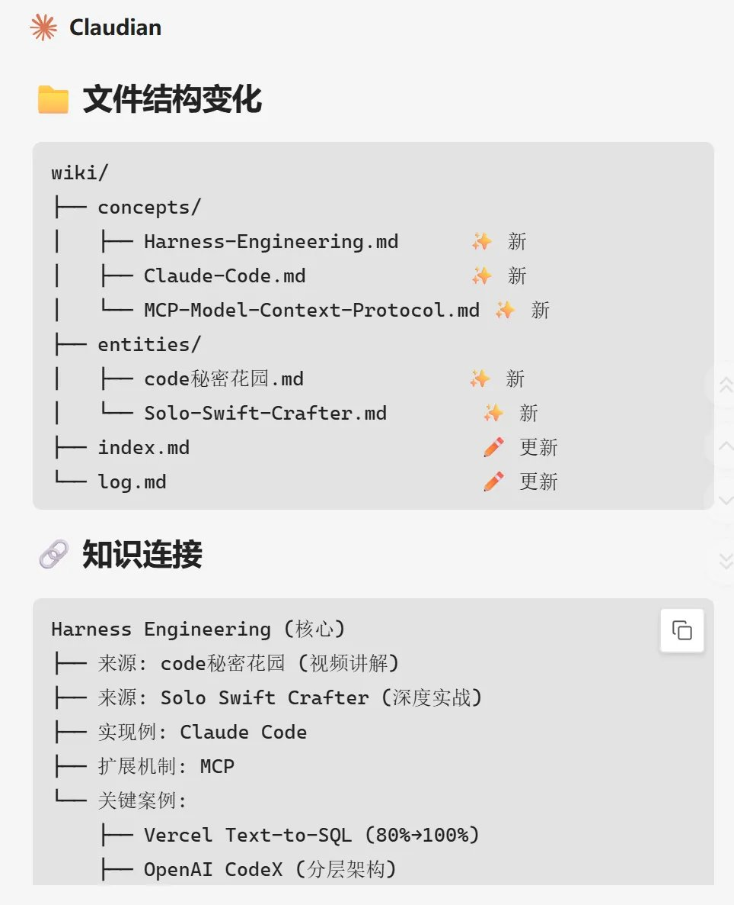

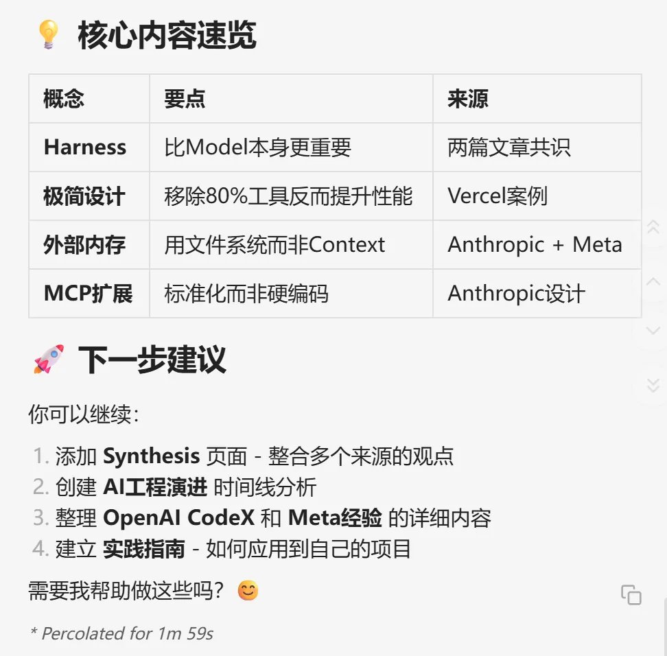

这个过程里我只做了一件事，就是把文章丢进文件夹。剩下的阅读、提炼、归类、建立链接、找洞察，全是 AI 在做。

这就是卡帕西说的"把脏活累活交给 AI"。

到这里你已经学会了卡帕西的 AI 知识库是什么，如何用 Obsidian 加 AI 把它搭起来。

大部分人收藏内容都是一次性的，存了就忘，下次想用又得从头找。

而这套方法的核心优势是知识复利：你每丢一篇资料、每问一个问题，AI 都会沉淀回知识库里，越用越懂你。

而且数据全部在本地，不会被任何平台绑架，未来换什么模型都能接着用。

> 🫶如果对你有帮助，欢迎关注我的 X 账[号](https://abs.twimg.com/emoji/v2/svg/1f449.svg)[👉@imaxichuh](https://x.com/@imaxichuhai)ai，我会持续分享AI 思考、AI 工具使用体验等内容。

也欢迎关注我的公众号：

### 🖼️ Attached Media

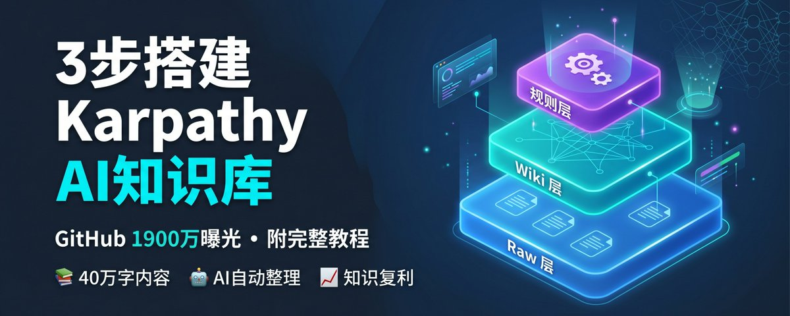

## 💬 Replies

### 1 @HieuPham9993 (Hiếu Phạm)

*Tue Apr 21 13:57:48 +0000 2026*

@imaxichuhai @readwise
save

### 2 @diowang13 (WangLe)

*Mon Apr 20 21:40:55 +0000 2026*

@imaxichuhai @readwise save

