# 📰 让 Agent 越用越准、成本越来越低：AgentLoop 的 Agent 经验自进化闭环

随着大模型从对话问答走向工具调用和复杂任务执行，AI Agent 正在进入研发、运维、数据分析、客户服务等企业核心场景。企业关注的重点也从“能不能做出一个 Agent”，转向“Agent 上线后是否准确、出现问题如何定位、优化效果如何验证，以及运行成本是否可控”。

AgentLoop 是阿里云面向 AI Agent 研发和生产运行提供的可观测与持续优化平台。它通过采集 Agent 的模型调用、工具调用和完整执行链路，将原始 Trace 转化为可分析的 Trajectory，并连接评估、实验和经验自进化能力，帮助企业发现问题、验证优化效果，再把真实运行中验证过的有效经验带回 Agent，形成“观测—分析—优化—再验证”的闭环。

传统软件追求确定性：在相同版本、相同输入和相同环境下，系统应当给出稳定、可预测的结果。企业可以通过功能测试、回归测试和发布门禁，建立清晰的上线标准。

AI Agent 则天然具有不确定性。模型采样、上下文变化、任务规划、工具返回和长链路执行都可能影响结果。同一个问题连续运行多次，Agent 可能选择不同的工具、走不同的路径，甚至给出不同的答案。一次评测通过，不代表下一次仍然通过；平均表现不错，也不代表线上不会出现不可接受的质量低谷。

当 Agent 开始进入运维、研发、数据分析和企业业务流程，企业真正关心的归根到底是两个结果：

* Agent 现在到底做得准不准，还有多少提升空间？ 不只是看一次演示或平均分，而是判断它在真实业务中的任务成功率、首次完成率和多次执行的稳定性能否达到上线要求；哪些场景容易失败，能否通过工程手段继续改善。

* 达到这样的准确率，需要付出多少成本？ 每完成一个成功任务，需要消耗多少 Token、时间、工具调用和人工介入；与人工处理或传统系统相比，这笔投入是否值得。

Agent 的准确率是否达到业务要求、存在的问题是否有明确的提升空间，以及整体成本是否可以接受，决定了它能否从 Demo 走向生产，从局部试用走向规模化部署。

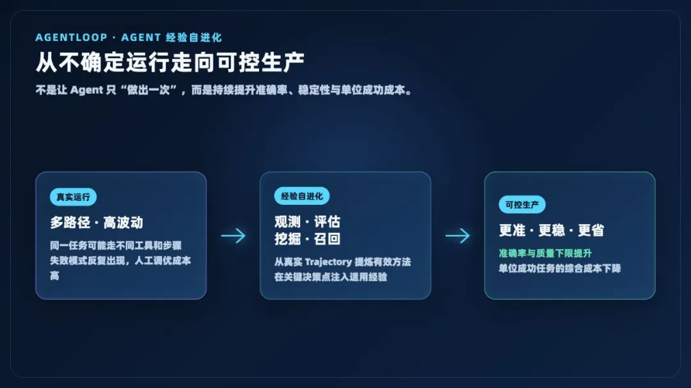

图 1丨AgentLoop 通过 Agent 经验自进化，

帮助企业 Agent 从多路径、不稳定的执行状态逐步走向可控生产

### 每一次运行，都在产生待挖掘的经验

*Cloud Native*

Agent 的每次运行不只产生一个最终答案，也会留下如何理解任务、选择工具、处理错误和完成目标的执行轨迹。成功轨迹中包含有效路径，失败轨迹中则记录了反复出现的错误和恢复线索。

这些轨迹中沉淀着大量尚未被利用的优化证据，但原始 Trace 并不天然等于经验。只有经过清洗和组装形成 Trajectory，再结合结果评估进行比较，才能提炼出可验证、可召回、可复用的行动经验。

因此，数据飞轮的价值不是积累更多日志，而是让每一次运行都为下一次运行提供经过验证的优化依据。

### Agent 上线之后，持续优化才真正开始

*Cloud Native*

上线前的评测集只能覆盖已知问题。真实业务会不断产生新的用户表达、新的工具状态、新的异常组合和新的边界条件。模型会升级，知识和业务规则会变化，Agent 使用的工具也会持续迭代。因此，Agent 不可能依靠上线前的一次调试永久保持质量。

今天，企业通常通过一条人工数据飞轮持续优化 Agent：

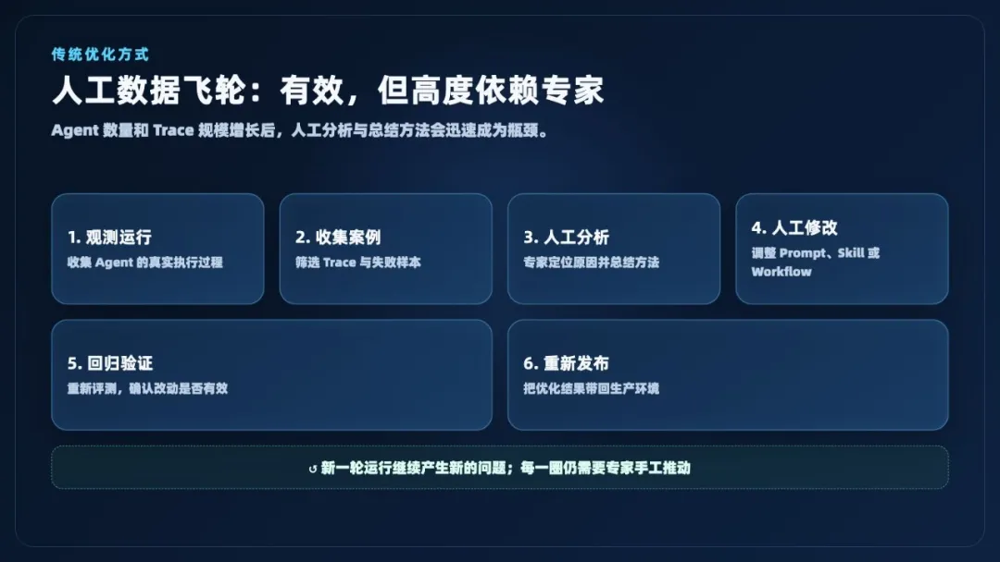

这条路径有效，但高度依赖专家。随着 Agent 数量、任务类型和调用规模不断增长，人工查看 Trace、分析根因和总结方法会迅速成为瓶颈。大量执行数据被保存下来，真正能够被及时分析并转化为优化动作的，只占其中很小一部分。

企业需要一条更自动化的进化路径：持续观测 Agent 的真实运行，从成功和失败轨迹中自动发现规律，生成可复用经验，并把经过筛选的经验带回 Agent 的下一次执行。

这正是 AgentLoop 的 Agent 经验自进化能力（下文简称“经验自进化”）希望解决的问题。

### 从人工数据飞轮到 Agent 自进化

*Cloud Native*

AgentLoop 通过经验自进化，在模型之外构建了一层可持续更新的经验系统。它接收 Agent 的真实 Trace，将高噪音的执行数据清洗并组装为标准化 Trajectory，再从多个轨迹中自动挖掘有效路径、失败模式、工具约束、参数规则和恢复策略，生成结构化经验。

当 Agent 再次面对相似任务时，Recall Skill 和 CLI 会根据当前目标、业务对象、工具、执行进度和错误状态，召回少量适用经验，并注入 Agent 的运行时上下文。Agent 完成任务后，新的运行结果再次形成 Trace，进入下一轮经验挖掘。

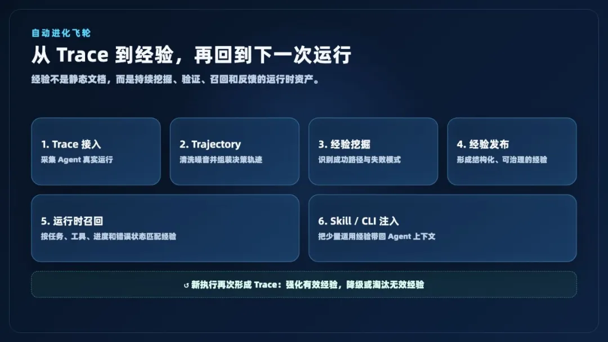

图 2丨从 Trace、Trajectory、经验挖掘

到运行时召回的自动进化飞轮

这里的“自进化”并不是直接修改模型权重，而是让 Agent 在模型通用能力之外，持续获得来自真实业务的行动经验。

模型负责推理，工具负责执行，知识库提供事实，经验库则帮助 Agent 判断：在当前情境下，应该优先做什么、哪些路径容易失败、遇到问题后如何恢复，以及什么才算真正完成。

### 用经验降低 Agent 的不确定性

*Cloud Native*

Agent 的不确定性无法被彻底消除，但可以被持续约束。

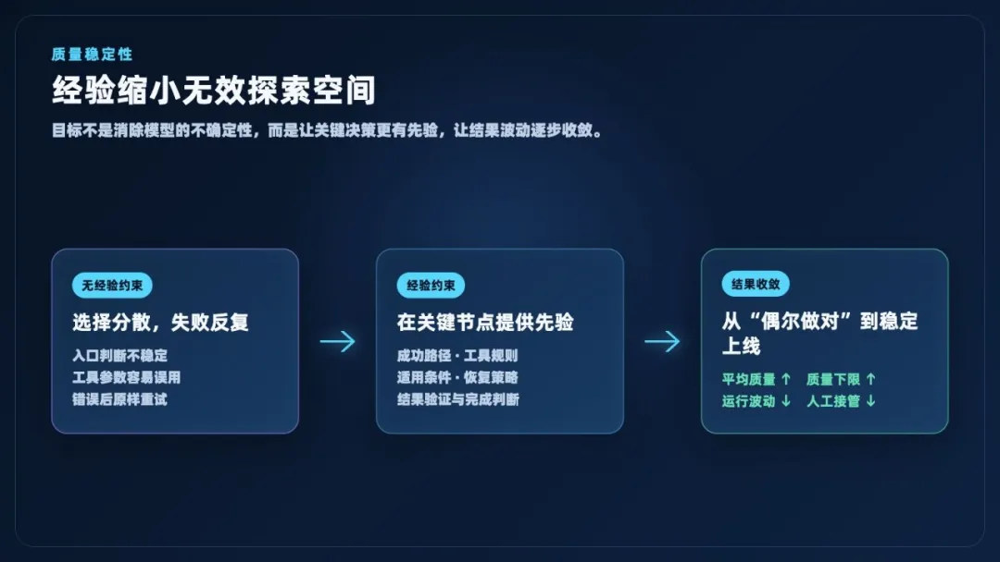

图 3丨经验持续约束无效探索空间，

提高平均质量并抬高运行下限

很多失败并不是因为模型完全不具备能力，而是因为 Agent 在关键节点做出了错误选择：选错了信息入口、错误理解了工具参数、在空结果后反复重试、忽略了业务范围，或者在结果尚未验证时就提前结束任务。

这些问题具有明显的经验属性。同类任务运行得越多，系统越有机会识别哪些选择经常带来成功，哪些行为容易导致失败，以及不同情境下应当采用什么恢复策略。

经验注入的价值，是在 Agent 做出关键决策之前，缩小无效的探索空间：

* 在任务开始时，提供经过验证的入口选择和行动顺序；

* 在调用工具前，补充参数约束、数据范围和前置条件；

* 在出现错误或空结果后，优先提供有效的恢复方法；

* 在准备交付时，提醒 Agent 验证结果是否真正满足业务目标。

因此，企业衡量经验库时，不应只看一次运行是否成功，而应同时关注：

* 平均任务成功率；

* 首次完成率；

* 同类任务多次执行时的成功率、最低表现和结果波动；

* 失败模式的集中度；

* 人工接管率和返工率。

如果平均准确率提高，同时质量下限被抬高、运行波动逐步缩小，Agent 才真正从“偶尔做对”走向“可以稳定上线”。

### 用更少的成本获得更多成功结果

*Cloud Native*

准确率和成本并不是两个彼此独立的问题。很多 Agent 成本恰恰来自不确定性：方向选错后反复推理，工具调用失败后原样重试，错误的查询范围引发多轮返工，没有完成判断导致执行链不断延长。

当经验帮助 Agent 更早选择正确入口、更准确地使用工具，并在失败后采用有效的恢复策略时，可以同时减少：

* Prompt 与 Completion Token；

* 无效工具调用和重复查询；

* 单次任务执行时间和超时；

* 人工查看 Trace、总结问题和修改提示词的投入；

* 原始 Trace 的存储、传输和重复分析成本。

对企业而言，最有意义的成本指标不是单次调用使用了多少 Token，而是：

>
>
> 每完成一个成功任务，需要消耗多少 Token、时间、工具调用和人工介入。
>
>

经验注入并不意味着每个场景的 Token 都一定下降。有些任务为了获得更高成功率，可能需要使用更多上下文。真正合理的目标，是在质量护栏下持续优化单位成功成本，而不是单独追求最低 Token。

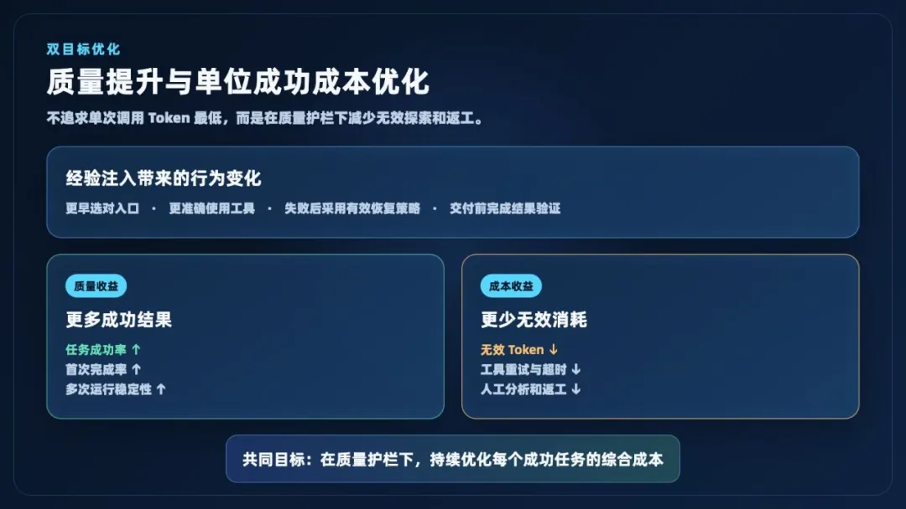

图 4丨经验注入同时关注质量、

结果稳定性以及每个成功任务的综合成本

### AgentLoop 的 Agent 经验自进化：核心优势

*Cloud Native*

### ▍**广泛接入真实 Agent 运行数据** ###

经验飞轮成立的前提，是能够看到 Agent 的完整运行过程。企业内部的 Agent 往往来自不同框架、不同团队和不同运行环境，很难通过单一 SDK 完成统一接入。

AgentLoop 提供多种探针、OpenTelemetry、LoongSuite Pilot、eBPF，以及面向不同 Agent 和 AI Coding 工具的接入能力。无论 Agent 是否方便修改代码，都可以选择适合的方式采集模型调用、工具调用、执行结果和运行环境信息。

广泛的数据接入能力，使经验库不再局限于某个 Agent 框架，而能够成为企业级的共享优化基础设施。

### ▍**用 Trajectory 提炼高价值执行数据** ###

原始 Trace 通常包含大量基础设施 Span、重复消息和与 Agent 决策无直接关系的数据。如果直接对完整 Trace 做长期存储和模型分析，成本会快速增长，真正有价值的行动信号也容易被噪音淹没。

AgentLoop 会将原始 Trace 清洗、去噪并组装为标准化 Trajectory，保留任务目标、行动步骤、工具调用、观察结果、错误、恢复过程和最终结果等高价值信息。

在内部复杂样本中，清洗后的高价值轨迹可以降到原始 Trace 约 4%—6% 的数据量级。更小、更结构化的 Trajectory 不仅降低存储和挖掘成本，也让算法能够直接分析 Agent 的决策过程，而不是处理杂乱的日志片段。

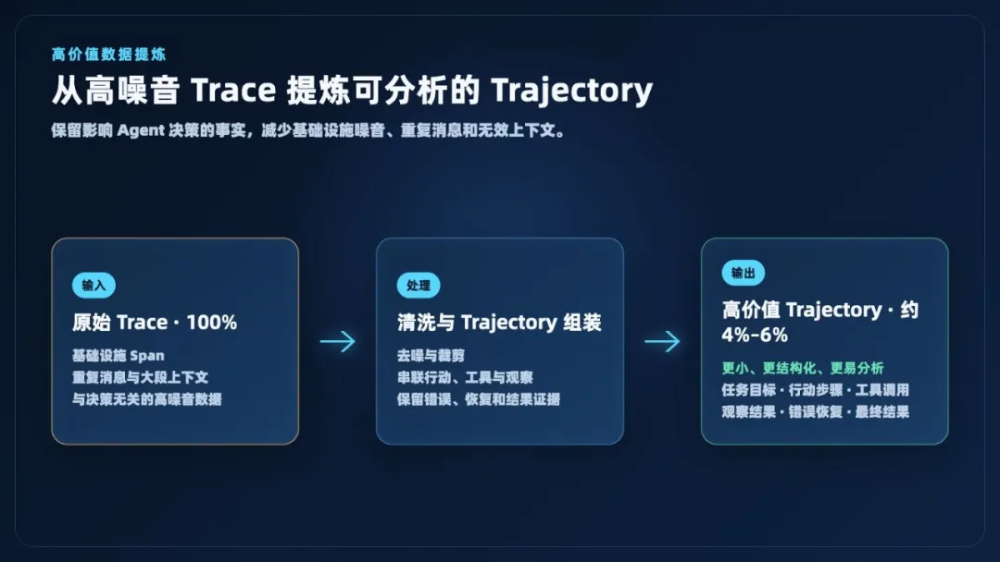

图 5丨从高噪音、大体量 Trace 中提炼紧凑、

结构化的 Agent Trajectory

### ▍**面向真实轨迹深度优化的挖掘与召回算法**

###

### 经验不是对单条 Trace 做一次摘要，也不是简单保存成功案例。AgentLoop 会在多个轨迹之间进行比较，识别反复出现的有效动作和高风险路径，生成不同类型的结构化经验，例如 ###

* 工具选择和调用顺序；

* 参数规则与前置条件；

* 容易导致失败的反模式；

* 错误恢复和问题绕行策略；

* 结果验证与完成判断规则。

在召回阶段，系统不仅考虑文本相似度，还会结合当前任务、工具、进度、错误状态和经验适用范围进行排序和过滤。目标不是返回更多历史内容，而是在真正影响决策的时刻，提供少量能够改变行动的经验。

### ▍**多类 Bench 验证质量与成本收益** ###

AgentLoop 的 Agent 经验自进化能力已在运维、通用工具使用、专业 Agent 和软件工程等不同任务上进行了经验注入实验。部分结果如下：

|       Bench       |     注入前      |         注入经验后          |      Token 变化       |
|:------------------|:-------------|:-----------------------|:--------------------|
|   StarOps 指标查询    |   正确率 7.1%   |       正确率 36.1%        |       \-6.8%        |
|OpenClaw / PawBench|  通过率 24.53%  |       通过率 30.67%       |      \-58.16%       |
|    PinchBench     |### 0.2928 ###|### 0.3464，提升 18.3% ### |       \+2.9%        |
|   ClawProBench    |### 74.51% ###|### 78.43%，提升 3.92pp ###|        \-11%        |
|SWE-bench Verified |### 67.2% ### | ### 74.4%，提升 7.2pp ### |### 362.4M → 536M ###|

这些结果表明，经验注入能够在多种任务形态中带来质量收益。在 StarOps 实验中，平均工具调用次数下降 25.1%，有害事件下降 27.8%；在 PawBench 和 ClawProBench 中，质量提高的同时 Token 明显下降。

实验也说明，质量和成本之间可能存在权衡。例如 PinchBench 的 Token 增加 2.9%，SWE-bench Verified 在成功率提高的同时消耗了更多 Token。因此，AgentLoop 不只关注单一分数，而是同时衡量成功率、同类任务多次执行的稳定性、Token/成功任务、工具调用、耗时和超时率，寻找适合具体业务目标的最优点。

### ▍**Skill + CLI，让经验快速进入 Agent** ###

经验生成后，不需要重新训练模型，也不需要重建 Agent。用户可以在客户端安装 Recall Skill，通过 CLI 配置经验库（Experience Store）和库级访问凭证。

安装完成后，Agent 可以在任务开始、调用关键工具、遇到错误或准备交付时主动检索相关经验，并将召回结果作为当前任务的参考上下文。

这种方式具有三个优势：

* 接入快，不需要改变模型权重；

* 经验更新后可以立即被新的任务使用；

* 经验出现问题时，可以快速限制作用范围、替换或下线。

经验被注入 Agent 的运行时上下文；Agent 完成任务后，新的执行结果再作为 Trace 进入经验挖掘链路，形成持续闭环。

### ▍**让多个 Agent 共享经验、共同进化** ###

企业真正需要的不是某一个 Agent 单独变好，而是让有效方法在组织内复用。

团队可以让不同客户端和不同 Agent 使用同一个经验库。一个 Agent 在真实任务中验证过的有效路径，可以在权限允许的范围内被其他 Agent 召回；一个团队已经遇到过的失败，也可以成为其他团队提前避开的反模式。

共享经验能够带来几项长期价值：

* 新 Agent 可以继承已有方法，降低冷启动成本；

* 新成员可以直接使用骨干积累的行动经验；

* 更换模型或 Agent 框架后，业务经验不必从零积累；

* 通用经验可以跨 Agent 共享，业务专属经验可以按 AgentSpace 和经验库隔离；

* 个人经验逐步转化为企业可管理、可追溯的能力资产。

模型提供通用智能，经验库则沉淀组织在真实业务中形成的专属能力。Agent 使用得越多，组织能够复用的有效方法就越丰富。

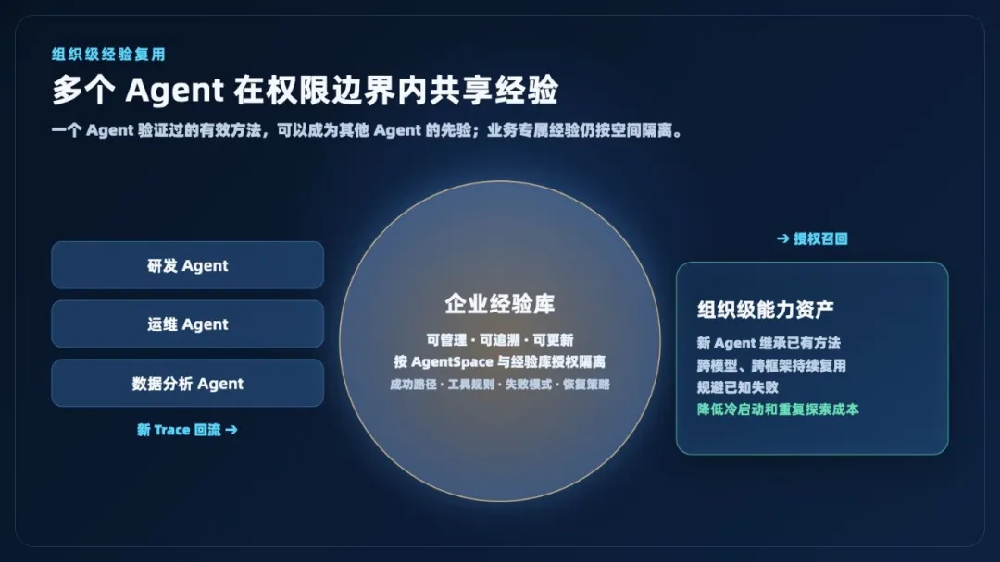

图 6丨不同 Agent 在权限边界内共享经验，

让局部成功转化为组织级能力

### ▍**位于模型之外，更新更快、迁移更容易** ###

微调和强化学习通过训练改变模型本身，能够获得更深层的行为变化，但通常需要更多数据、计算资源和验证周期。经验库位于模型之外，通过运行时检索和上下文注入生效。

这使经验成为一层可移植的优化能力：

* 可以服务不同模型和 Agent 框架；

* 可以按任务和业务动态召回；

* 可以快速更新，不必重新训练和发布模型；

* 可以按团队、业务和权限控制作用范围；

* 可以与评估结果结合，持续验证经验是否仍然有效。

企业最终保留下来的，不再只是某个模型版本偶然做对的结果，而是一套可以跨模型、跨客户端持续使用的业务行动经验。

### 如何开启 AgentLoop 的 Agent 经验自进化

*Cloud Native*

完成 Agent Trace 接入后，客户只需要在控制台创建经验库，再把控制台生成的接入配置复制到 Agent 客户端。开始前请确认：

* Agent 已通过探针、OpenTelemetry、Pilot 或 eBPF 等方式接入 Trace；

* 客户端已安装 Node.js 18 或更高版本；

* 当前账号具有目标 AgentSpace 和经验库的访问权限。

### ▍**第一步：创建经验库，开启自动挖掘** ###

进入 AgentLoop<sup data-nest-level="2" data-pm-slice="0 0 []" style="-webkit-tap-highlight-color: transparent;margin: 0px;padding: 0px;outline: 0px;max-width: 100%;box-sizing: border-box !important;overflow-wrap: break-word !important;font-style: normal;font-variant-ligatures: normal;font-variant-caps: normal;font-weight: 400;letter-spacing: 0.544px;orphans: 2;text-indent: 0px;text-transform: none;widows: 2;word-spacing: 0px;-webkit-text-stroke-width: 0px;white-space: normal;text-decoration-thickness: initial;text-decoration-style: initial;text-decoration-color: initial;text-align: left;color: rgba(0, 0, 0, 0.55);background-color: rgb(255, 255, 255);line-height: 0;font-family: Optima-Regular, Optima, PingFangSC-light, PingFangTC-light, &quot;PingFang SC&quot;, Cambria, Cochin, Georgia, Times, &quot;Times New Roman&quot;, serif;visibility: visible;"><strong data-nest-level="3" style="-webkit-tap-highlight-color: transparent;margin: 0px;padding: 0px;outline: 0px;max-width: 100%;box-sizing: border-box !important;overflow-wrap: break-word !important;visibility: visible;"><span data-nest-level="4" leaf="" style="-webkit-tap-highlight-color: transparent;margin: 0px;padding: 0px;outline: 0px;max-width: 100%;box-sizing: border-box !important;overflow-wrap: break-word !important;visibility: visible;"><span style="color: rgb(255, 104, 39);" textstyle="">[</span></span></strong></sup><sup data-nest-level="2" style="-webkit-tap-highlight-color: transparent;margin: 0px;padding: 0px;outline: 0px;max-width: 100%;box-sizing: border-box !important;overflow-wrap: break-word !important;font-style: normal;font-variant-ligatures: normal;font-variant-caps: normal;font-weight: 400;letter-spacing: 0.544px;orphans: 2;text-indent: 0px;text-transform: none;widows: 2;word-spacing: 0px;-webkit-text-stroke-width: 0px;white-space: normal;text-decoration-thickness: initial;text-decoration-style: initial;text-decoration-color: initial;text-align: left;color: rgba(0, 0, 0, 0.55);background-color: rgb(255, 255, 255);line-height: 0;font-family: Optima-Regular, Optima, PingFangSC-light, PingFangTC-light, &quot;PingFang SC&quot;, Cambria, Cochin, Georgia, Times, &quot;Times New Roman&quot;, serif;visibility: visible;"><strong data-nest-level="3" style="-webkit-tap-highlight-color: transparent;margin: 0px;padding: 0px;outline: 0px;max-width: 100%;box-sizing: border-box !important;overflow-wrap: break-word !important;visibility: visible;"><span data-nest-level="4" leaf="" style="-webkit-tap-highlight-color: transparent;margin: 0px;padding: 0px;outline: 0px;max-width: 100%;box-sizing: border-box !important;overflow-wrap: break-word !important;visibility: visible;"><span style="color: rgb(255, 104, 39);" textstyle="">1]</span></span></strong></sup>控制台，选择目标 AgentSpace，然后打开「上下文工程 → 经验库」，单击右上角「创建经验库」。

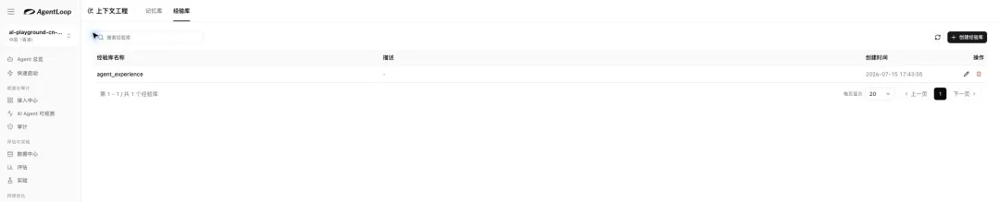

图 7丨在「上下文工程 → 经验库」中创建或进入已有经验库

创建时只需填写三项关键信息：

## 1. 经验库名称 ： 使用小写字母、数字和下划线

## 2. 提取 Agent 应用 ： 选择需要持续优化的 Agent

## 3. 经验抽取起始时间 ： 指定从哪个时间点开始分析已有 Trace

经验库默认使用「AI Agent 可观测」接入的全链路数据作为来源。确认创建后，AgentLoop 会持续把 Trace 清洗为 Trajectory，并自动挖掘行动路径、工具规则、反模式和恢复策略，不需要人工上传经验文档。

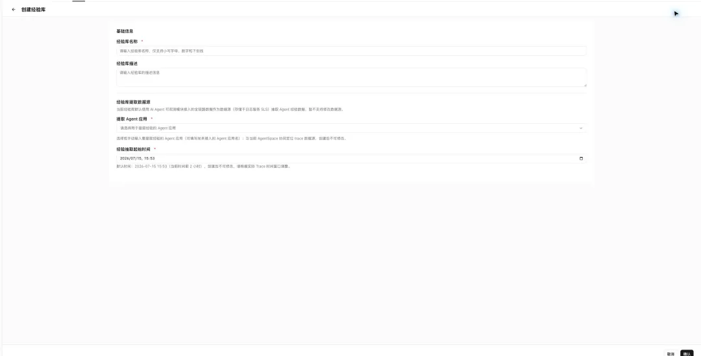

图 8丨填写经验库名称，选择 Agent 应用和 Trace 起始时间

### ▍**第二步：创建访问凭证** ###

进入经验库详情，打开「API Key」页签，单击「立即创建」。API Key 用于客户端访问当前经验库，推荐作为快速接入方式；需要统一身份治理的企业也可以使用 AK/SK。

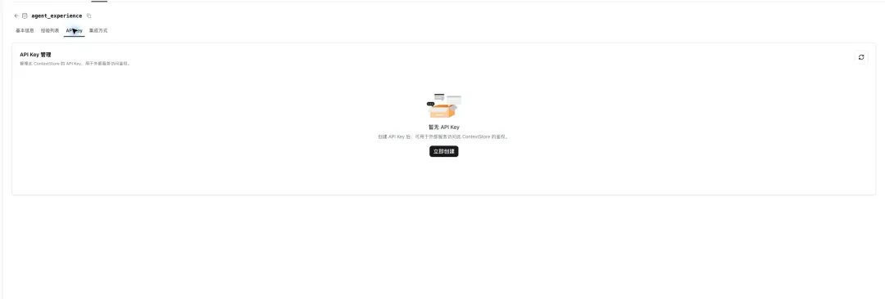

图 9丨在经验库详情的「API Key」页签创建访问凭证

API Key、AK/SK 不要写入查询命令，也不要提交到 Git。不同客户端可以使用各自的凭证访问同一个经验库，便于审计、轮换和权限回收。

### ▍**第三步：安装 Recall Skill 并复制配置** ###

打开「集成方式」页签。控制台会根据当前地域、AgentSpace 和经验库自动生成安装命令、Recall Endpoint 和验证命令，客户无需手工拼接 URL。

一次性验证时选择「临时 Skill 安装」，依次复制并执行三个代码块：

## 1. 安装 alibabacloud-agentloop-experience Skill

## 2. 配置 AGENTLOOP\_ENABLE\_RECALL 、 Recall Endpoint 和 API Key

## 3. 执行一次经验召回验证

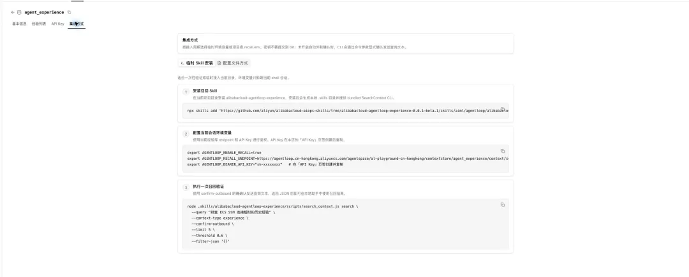

图 10丨控制台自动生成 Skill 安装、环境变量和召回验证命令

团队或项目长期使用时，切换到「配置文件方式」，把配置保存到项目的 .agentloop/recall.env 或当前用户的 \~/.agentloop/recall.env。项目级配置应加入 .gitignore。

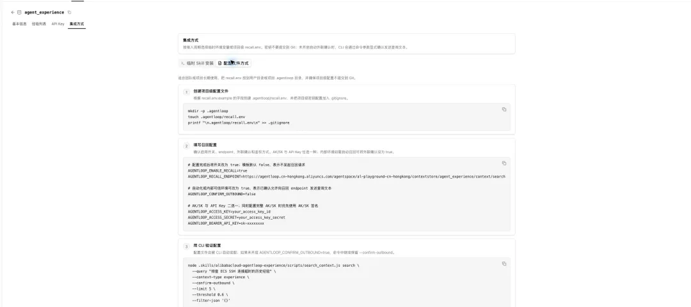

图 11丨使用项目级 recall.env 保存长期召回配置

### ▍**第四步：验证召回并共享经验** ###

在项目根目录执行控制台提供的验证命令。查询文本建议包含具体产品、错误信息、接口名或 Request ID，例如：

```

node .skills/alibabacloud-agentloop-experience/scripts/search_context.js search \
  --query "排查 ECS SSH 连接超时的历史经验" \
  --context-type experience \
  --confirm-outbound

```

```

返回 JSON 且

```

同一团队的多个 Agent 指向同一个经验库后，就可以在权限范围内共享经验。Agent 会在任务开始或遇到问题时召回相关方法；新的执行结果继续形成 Trace，进入下一轮自动挖掘。

>
>
> 安全提示：默认保留 --confirm-outbound，明确确认发送本次查询文本。只有在已经授权的内部可信环境中，才建议开启自动外联确认；查询中不要携带密码、Token、个人信息等敏感数据。
>
>

随着新的任务不断运行，新的 Trace 会继续进入经验挖掘链路，形成：

```

观测 → 轨迹 → 挖掘 → 经验 → 召回 → 运行 → 再观测

```

```

企业可以观察成功率、同类任务多次执行的稳定性、Token/成功任务、工具调用次数、平均耗时和人工接管率，确认经验库带来的真实收益，并逐步扩展到更多 Agent 和业务场景。

```

### Agent 经验自进化与

### Memory、RAG、微调和 RL 的差异性

*Cloud Native*

这些能力并不是互相替代关系，它们解决的是不同层面的问题。

|        能力        |       主要解决的问题        |              如何生效              |
|:-----------------|:---------------------|:-------------------------------|
|      Memory      |这个用户、会话或 Agent 过去发生过什么|    检索用户事实、偏好和历史事件，保持跨会话连续性     |
|    RAG / 知识库     |    规则、文档和业务事实在哪里     |      从外部知识源检索相关内容，为模型补充事实      |
|  Workflow / SOP  |      标准流程应该怎样执行      |      通过人工定义的步骤和规则提供确定性编排       |
|Prompt Engineering|     如何约束模型的通用行为      |          修改系统提示词或任务模板          |
|      Skill       |   Agent 具备什么可复用能力    |   封装操作方法、脚本、工具和资源，供 Agent 调用   |
|Fine-tuning / SFT |    如何改变模型的整体行为倾向     |          使用训练数据更新模型权重          |
|        RL        |     如何通过奖励优化模型策略     |         基于轨迹和奖励训练或更新策略         |
|   Agent 经验自进化    |在当前情境下，过去哪些行动有效、哪些容易失败|从真实 Trajectory 挖掘经验，在运行时检索并注入上下文|

可以用一句话概括它们的差异：

Memory 让 Agent 记得过去，RAG 让 Agent 找到知识，Workflow 提供固定流程，Skill 让 Agent 获得能力，微调和 RL 改变模型本身，而经验自进化让 Agent 在当前任务中复用真实执行验证过的方法。

在完整的企业 Agent 系统中，这些能力可以协同工作：RAG 提供业务事实，Memory 提供用户和会话背景，Skill 提供可执行能力，经验自进化机制提供行动经验，评估与实验则负责证明这些变化是否真正提高了质量。

### 让 Agent 从“能用”走向“可持续上线”

*Cloud Native*

企业引入 Agent 的核心挑战，不是缺少一次令人惊艳的演示，而是如何长期管理一个具有不确定性的生产系统。

AgentLoop 的 Agent 经验自进化以真实运行轨迹为起点，将高噪音 Trace 转化为高价值 Trajectory，自动挖掘成功路径和失败模式，再通过 Skill 与 CLI 把相关经验带回 Agent 的下一次执行。

它带来的价值可以用几个可度量的变化来表达：

* 提高 Agent 的任务成功率；

* 提高同类任务多次执行时的稳定性；

* 减少无效推理、工具调用、超时和人工调优；

* 优化每个成功任务的综合成本；

* 让一个 Agent 的有效方法被其他 Agent 安全复用；

* 让组织经验跨模型、跨框架持续积累。

AgentLoop 的 Agent 经验自进化不是又一个保存历史内容的知识库，而是一套面向企业 Agent 的持续质量优化系统：

>
>
> 通过真实运行轨迹自动挖掘并按需注入经验，在不重新训练模型的情况下，提高准确率和结果稳定性，并优化每个成功任务的成本。
>
>

观测系统负责看到真实运行，评估系统负责定义什么是好，经验自进化负责把已经验证的有效方法重新带回运行。当这三者形成闭环，Agent 才能在真实业务中持续进化，并逐步从不确定走向可控。

相关链接：

[1] agentloop.console.aliyun.com
