# 📰 垂类业务如何落地生产级 Agent

## 这是2026年的第 60 篇文章

（ 本文阅读时间：约 30 分钟 ）

## 前言

AI 技术正在以前所未有的速度迭代，Agent、Loop-Engineering、Skills、Harness、LLM-Wiki、RAG、Memory等概念在短期内几乎同时涌入工程讨论，Demo 的构建门槛被持续压低——可视化编排加上 Vibe-Coding，一个过去需要数周才能搭起来的演示，如今往往几天或者在更短的时间内就能跑通。但进入企业生产环境之后，稳定性、可控性、可审计性和业务闭环能力，仍然是没有捷径的硬仗。

我们从企业落地的视角，系统回答一个问题：在技术名词和概念永远追不完的时代，垂类业务如何抓住不变的本质，让 AI Agent 从「能跑」走向「能生产」？

01

技术迭代下的 Agent 机遇

### 1.1 变化的加速：Agent 不再是概念 ###

2025 年 9 月，Anthropic 在 Engineering Blog 上给出了一句让人印象深刻的话：

"We've gravitated towards a simple definition for agents: LLMs autonomously using tools in a loop."—— "Effective context engineering for AI agents", Anthropic Engineering Blog, Sep 29, 2025

这意味着什么？Agent 不再是一个需要精心定义的模糊热词，而是工程上一个清晰的范式：

### 大模型 + 工具 + 循环

今天的模型能力已经非常强悍，OpenAI、Google、Anthropic、DeepSeek、Alibaba、KiMi、MiniMax、智普等多家国内外公司的大模型百花齐放百家争鸣。

与大模型同步的是一系列外围工程概念的成熟，Agent Skills（Anthropic 2025.10，2025.12 开源标准化）、Model Context Protocol（MCP，2025.12 捐赠给 Linux Foundation 旗下 AAIF）、A2A 协议（Google 2026.3 发布，2026.8 加入 AAIF）、Memory Compaction、Harness Engineering、Graph-based Agent（LangGraph）、Knowledge Pipeline（Karpathy LLM Wiki 模式）……每一个名词背后都代表着一类真实的新能力。

对企业而言，这意味着一个真实的窗口期：模型能力、工程运行时、业务侧半结构化流程，三件事同时成熟了。客服、运营、审核、售后等，都不再只是「加一个聊天框」，而有机会变成「把流程中的决策与执行交给可控的 Agent」。

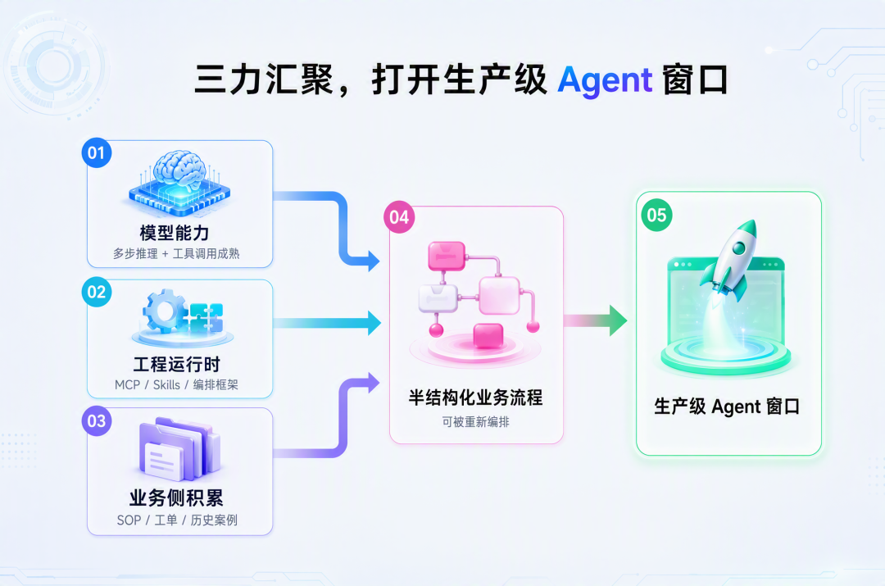

窗口的本质是“把一件事从受理推到完成”所需的拼图第一次凑齐；错过的代价是让竞争对手先把高频流程做成了可运营的生产能力。

### 1.2 Demo 易做，生产难过四道关

很多项目在演示阶段表现亮眼：输入干净、路径单一、异常被刻意绕开。一旦进入真实业务，问题换了形态出现：

* 同一句话在不同订单、不同会员等级、不同活动规则下含义完全不同；

* 工具超时、权限不足、上游接口变更会打断推理链；

* 用户中途改口、隔天补充材料；

* 错误答案不再是"体验不好"，而是错误退款、合规风险和客诉；

* ……

生产级 Agent 要过的不只是“能不能回答”，是四道更硬的关：

|**关卡**|           **追问**            |         **Demo 与生产的分野**          |
|------|-----------------------------|----------------------------------|
| 稳定性  |     同一类任务在真实流量下能否可重复完成？     |Demo 偶尔惊艳一次；生产要求第 9999 次和第 1 次质量一致|
| 可控性  |   能否限制它做什么、不能做什么？越权能否被拦住？   |   Demo 无越权场景；生产中自然语言禁令挡不住工具调用    |
| 可审计性 |事后能否还原它看了什么、调了什么、依据哪版策略、谁放的行？|   Demo 无需追责；生产的错误退款要能作为完整证据回放    |
| 业务闭环 |  能否把任务推进到业务可验收的终点，而非给出建议？   |    Demo 输出漂亮文本；生产要写入真实系统并可验收     |

Klarna 的 AI 客服故事就是「窗口与风险并存」的最佳样例。

2024 年 2 月，它公布了 AI 助手首月成绩：处理 230 万次对话（约三分之二的客服量），相当于约 700 名全职坐席；处理时长从约 11 分钟降到不足 2 分钟；预计带来约 4000 万美元的年化利润改善。高频标准化客服确实可以被规模化接管。

但后半段同样真实：2025 年 CEO 公开承认成本权重压过了服务质量，重新加大人工投入；2026 年的公开形态是“AI 处理约三分之二常规问询，复杂、高情绪、高价值问题交回给人”的混合模式。

这是生产级落地的典型轨迹：先证明能接管一部分，再发现哪些不能只按成本优化。

Vibe Coding 和可视化平台降低的是“从想法到 Demo"的成本，几乎不自动降低“从 Demo 到生产”的成本。后者是系统工程，这正是本文接下来要拆的内容。

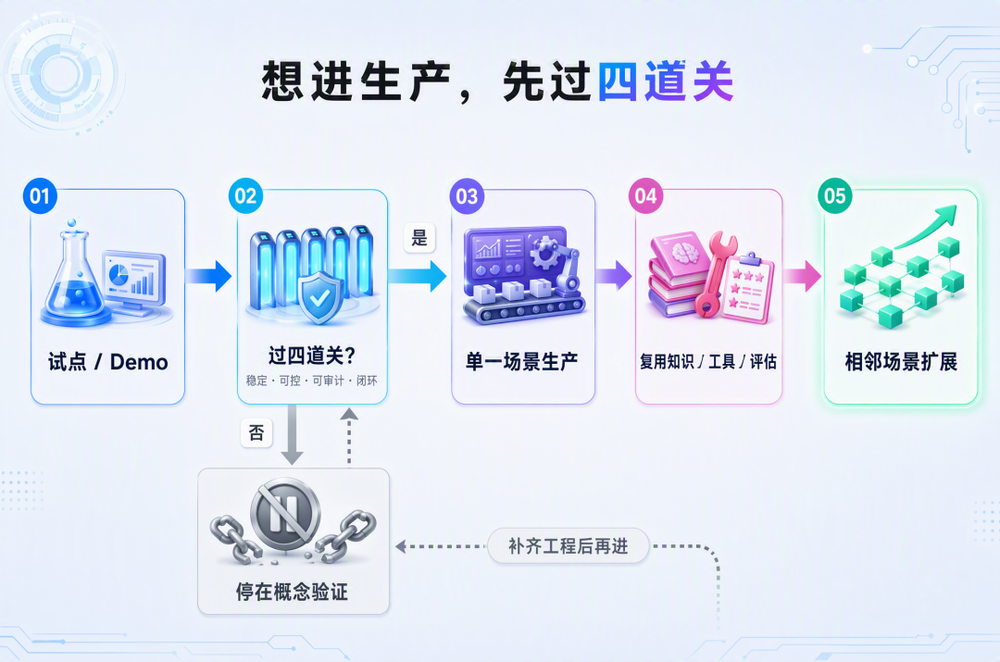

### 1.3 名词会换，追能力才追得上变化 ###

当前最容易走偏的做法是把新名词当架构本身：今天上 Agent Loop，明天换 Agent Graph，后天把 Prompt 改叫 Skills，把知识库改名 LLM-Wiki——名词在变，系统没有变稳。更合理的做法是把热词还原成它们真正解决的工程问题：

|**概念（会换名字）**|       **它真正在解决什么**        | **生产里落到哪一层**  |
|------------|---------------------------|---------------|
|    Loop    |路径不预设时，用"观察—行动—修正"的隐式循环驱动多步|   动态选工具的运行时   |
| Checkpoint |     与 Loop强协作：运行进度持久化     |  暂停、续跑、跨进程恢复  |
|    MCP     |       用统一协议接入数据和工具        |    工具接入标准     |
|   Skills   |    把流程经验封装成可发现、按需加载的能力    |   能力目录与版本治理   |
|  Harness   |模型外围的"操作系统"：工具、沙箱、权限、预算、评估 |      运行时      |
|  LLM-Wiki  | 摄入时把原文编译成可引用的结论，而非查询时临时阅读 |     知识编译层     |
|    RAG     |       检索时找回相关原文或证据        |    检索与知识层     |
|   Memory   |       跨轮、跨会话保留必要信息        |事实 / 经验 / 进度的分层|

2026 年业界把 Harness 提到与模型同等重要的位置，公式很干净：

### Agent = 模型 + Harness

模型提供智力，Harness 是让智力安全作用于世界的操作系统。企业不必照搬任何一家 SDK，但这个公式背后的问题必须自己回答。

Gartner 分析师 Anushree Verma 的一句话适合贴在每次技术选型会上：需要决策时用 Agent，常规工作流用自动化，简单检索用助手。反过来读就是警告：*把 RPA 能稳定干完的事硬做成多轮推理，既贵也不稳*。

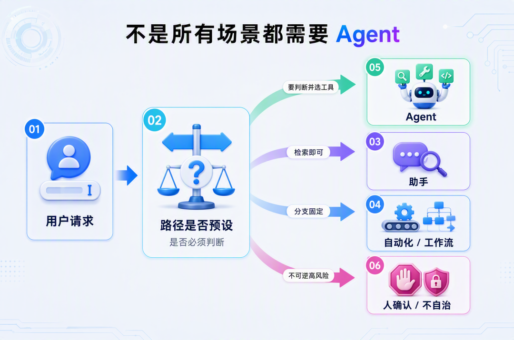

### 1.4 从小场景切入，先闭环再扩展 ###

全能型Agent是Demo叙事，不是生产叙事。生产里有效的切入点，通常同时满足四个条件：

* **高频：每天发生，样本足够用来评估和改进；**
* **低风险或风险可隔离：出错可逆，不会立刻造成资金和合规损失；**
* **规则相对明确：有 SOP、知识库或可调用的系统数据；**
* **闭环短：从受理到完成路径清楚，“做完了”容易定义。**

国内外头部企业的公开路径高度一致地印证了这条规律：Klarna 最先规模化的是退货、退款咨询、支付发票类高频会话，而非把纠纷裁决一次性交给模型（其 CEO 明确说过助手没有单方面批准退款的权限）；华住与腾讯云 2026 年的住中服务智能体先覆盖送水、续住、洗衣咨询；来伊份先做门店巡检、智能补货、流程审批；飞鹤先做设备运维和人事流程；邯郸公积金从离退休提取这类高频适老事项切入。没有一家从"通用大脑"开始。

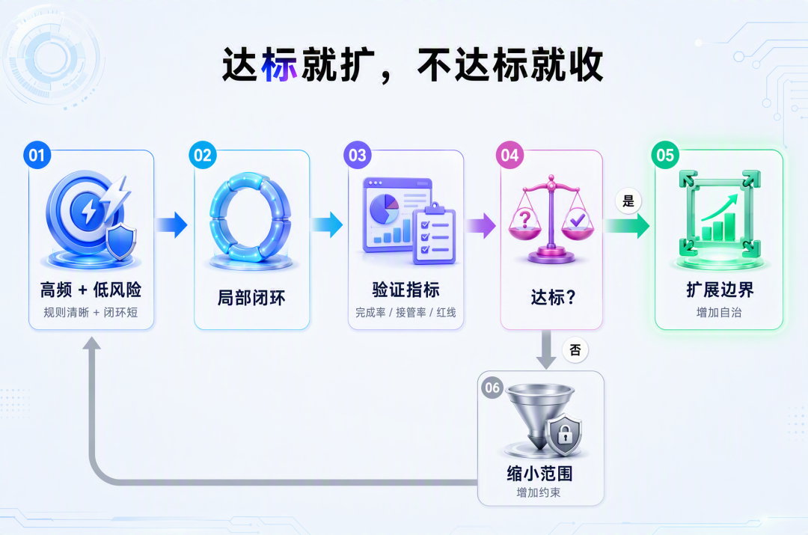

### 1.5 一个最小闭环要能回答五个问题 ###

局部闭环比大而全的平台更有说服力，一个最小可用的生产闭环，至少要能回答：

* 用户或上游系统提出的任务，是否被正确理解？

* Agent 是否拿到了当前场景下正确的知识和数据？

* 它是否调用了被允许的能力，而不是临场发挥？

* 结果是否进入了真实业务系统，或给出可执行的下一步？

* 失败时是否有降级、转人工和事后追溯？

如果五个问题答不清，扩展场景只会复制缺陷。先把一个场景做成“可上线、可监控、可回滚、可优化”，再把其中的知识层、工具层、评估层复用到相邻场景，这是垂类业务拥抱技术变化的正确节奏。

02

先定目标，再定边界

企业用 AI 最先翻车的地方，往往不是模型，而是目标含糊、边界含糊。后面所有的知识、工具、循环都会把这份含糊放大。

### 2.1 五个真实卡点 ###

* 卡点一：

* 目标打架，却写成同一个 KPI。 

* 提效、降本、降风险、增体验可以并存，但不会自动一致。Klarna 的回调，本质是成本权重压过了复杂问题和体验。如果线上只优化自动解决率，系统会倾向"尽量不转人工"；只优化满意度，又会把能自动完成的事推给人。没有主次和红线，模型再强也只是在两个目标之间摇摆。

* 另外一个角度，要看我们具体想追求什么，比如客服场景，是要用AI降低服务成本，而是想更好的服务客户？这俩个事情其实并不完全一致。

* 卡点二：

* 一句话里混了咨询和执行。 

* "这个能退吗，不行就帮我退"对系统是两段：先基于政策和订单状态给出可追溯结论，再决定是否允许发起售后。用同一个自由 Agent 处理，可能会出现错误承诺或越权写单。

* 卡点三：

* 只有自然语言禁令，没有动作目录。 

* Prompt 里写"不要乱退款"挡不住工具调用。生产真正要管的是可执行动作：查订单、改地址、创工单、发起退款、发送承诺话术。没有目录就没有策略点，出了事故无法回答"当时是谁批准这次调用的"。

* 卡点四：

* 责任落不到运行时。 

* 业务说口径归我，平台说工具归我，模型供应商说幻觉免责——三方都对，等于没人能把一次错误运行停下来。责任必须设计进流程：每条轨迹带 scene\_id、policy\_version、tool\_call\_id、decision，高风险动作保留人工确认句柄，关键办理给用户留凭证。

* 卡点五： 

* 分类型错了，后面会用错方案——该走规则引擎的走了多轮推理，该转人工的却在循环里重试。

### 2.2 目标写成可验收的规格，边界按风险分级 ###

可执行目标至少包含：对象、场景、基线、目标值、红线、测量方式。

公开案例已经是这个结构，而不是“提升智能化”。比如

* Klarna：处理时长约 11 分钟→不足 2 分钟，红线是不单方面批准退款；

* 华住住中服务：5 秒内响应并生成工单，公开问答准确率 95% 以上；

* 来伊份：AI 巡检近 3000 家门店、审批耗时降 70%；

* 飞鹤：设备平均故障恢复 104 小时→47 小时、重复故障率 34%→8%；

* 邯郸公积金：办理约 15 分钟→约 3 分钟并留电子凭证。

边界建议用风险分级管理：

|**风险等级**|  **定义**   |  **自治程度**  |**人工介入**|   **典型场景**   |
|--------|-----------|------------|--------|--------------|
|   L0   | 纯信息展示/检索  |    全自动     |  不需要   |  信息摘要、数据查询   |
|   L1   |辅助决策，结果供人参考|    输出建议    | 人确认后执行 | 客服推荐回复、初步分析  |
|   L2   | 先执行，人后复核  |    自动执行    |事后抽查/可撤销|  批量标注、文档初审   |
|   L3   |  强合规/高资损  |人主导，Agent 辅助|  每步审批  |贷款审批、合同签署、资金操作|

用"确定性 × 可逆性"确定自治程度的象限：

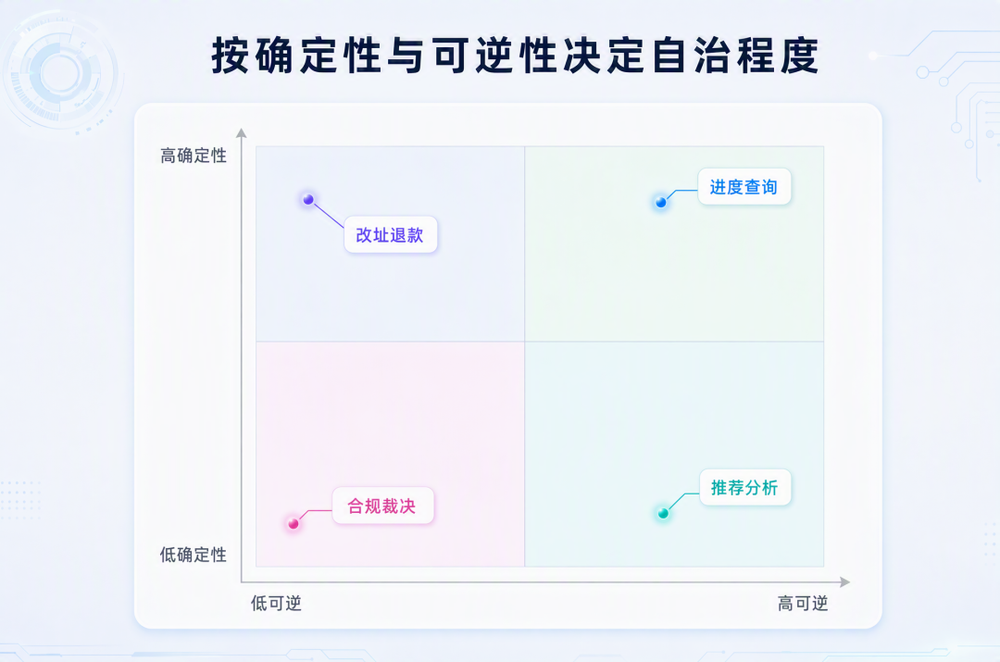

象限给出定位，分级表给出对应的关联（***仅供参考***）：

| **象限**  |     **对应等级**     |        **要点**         |           **典型场景**            |
|---------|------------------|-----------------------|-------------------------------|
|高确定 + 高可逆|L0（只读）/ L2（可撤销的写入）|  只读全自动；写入走"先执行、事后抽查"  |物流查询 → L0；  批量文档初审 → L2|
|高确定 + 低可逆|        L1        |判断大致可靠，但执行闸门必须设人或者强规则校验|           改地址、发起退款            |
|低确定 + 高可逆|        L1        |   只做建议不执行，人确认是质量把关    |            推荐、分析报告            |
|低确定 + 低可逆|        L3        |   人主导，Agent 辅助，每步审批   |           合规裁决、大额赔付           |

有两处细看会发现“不是四个格子对四行”的映射：

* **L1 出现在两个象限，卡的东西完全不同。**

* 推荐分析落在 L1，卡的是**质量**——结论可能不优，但不直接执行，确认是宽松的把关；

* 改址退款也落在 L1，卡的是**权限**——判断大概率正确，但动作不可逆，必须把人工确认或者强规则校验才进执行链路。

* **L2 不是天上掉下来的，是用工程手段造出来的可逆性。**

* 高确定 + 高可象限里，只读天然落 L0；

* 要让写入操作也享受"先执行后复核"，前提是用幂等键、撤销窗口、补偿接口把可逆性做出来。补偿做不到，就退回 L1。

* 严格来说，L2 = 高确定性 + 工程保障下的可逆性——这也是为什么小额退款可以走 L2，大额必须回到 L1/L3。

### 2.3 边界怎么划 ###

|       **方案**       |       **解决什么**        |  **不解决什么**  |
|--------------------|-----------------------|-------------|
|     A. 场景分级清单      |     统一"做/不做、谁确认"      |  拦不住运行时越权   |
|B. 动作目录 + 策略执行点（PEP）|把"能不能做"从 Prompt 挪到调用前校验|不管知识对不对、流程顺不顺|
|  C. SOP 编译成可执行契约   | 进入条件、槽位、守卫、停止条件可被机器执行 |建设周期长，流程变更要发版|

### 三档可以叠加，不必一次到位。先A避免做错场景，再对写操作上B，最后把投诉、退款、政务办理等红线场景做成C。 ###

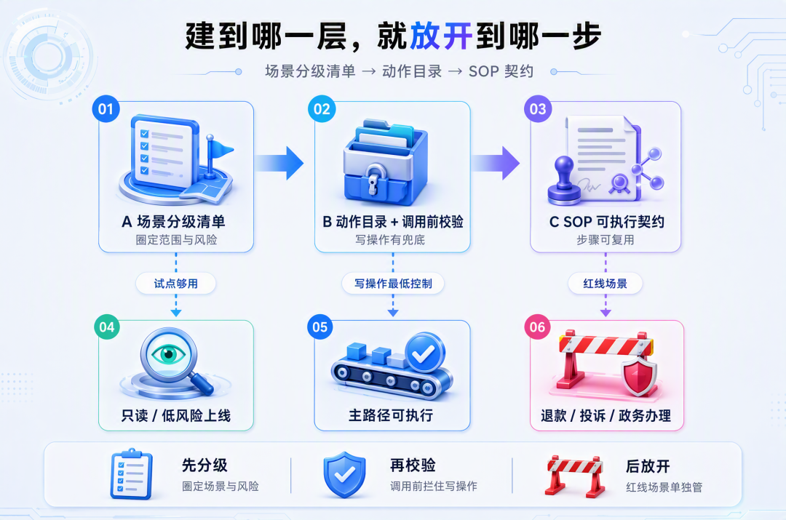

把“能不能做”从提示词挪到执行前：

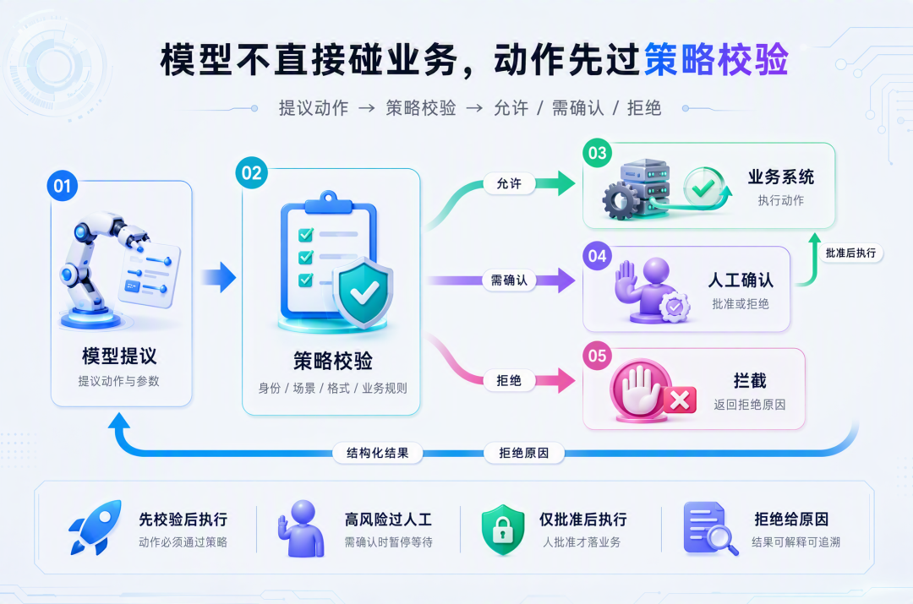

03

让 Agent 真正理解业务知识

企业知识问题被说了很多年，用上大模型之后换了更棘手的形态：系统会流畅地用错过期条款。难点在“查询时无法证明当前这条结论适用”。

### 3.1 传统 RAG 在企业里的失败形态 ###

* **口径冲突：同一规则同时存在于 FAQ、SOP、商品详情、工单备注和群聊约定。向量检索按相似度返回多条，模型临时综合——Demo 里像“融会贯通”，生产里是随机站队，冲突还被圆成模棱两可的话，用户以为得到了承诺。**
* **条件知识被切碎：企业规则几乎都是条件句（品类、渠道、会员等级、活动期、签收状态）。固定长度切块时，例外条款经常落在下一个切片——Top-K 命中了原则、漏了例外，答案看起来很自信。**
* **时效与版本：“去年的价保规则”语义上仍像“今年的”。没有生效区间和版本字段，过期内容持续进上下文。**
* **权限后置过滤：先召回再按权限删除，被删片段仍可能影响 rerank 或已写日志——既浪费上下文，也有泄露风险。**
* **静态知识与实时事实混用：退货政策是知识，订单是否已签收是事实。把交易数据编进知识库会过期；只用知识库答"我的退款到哪了"会幻觉。**
* **检索命中≠答案可用：没有引用、没有冲突暴露、没有“未命中则拒绝作答”策略时，模型会补齐空白——高风险路径上比不回答更危险。**

### 3.2 从 RAG 到知识编译：一个更好的范式 ###

Andrej Karpathy 2026年提出的LLM-Wiki模式，把这个领域的问题重新表述了一遍：不要在每次查询时从原始文档临时拼凑答案，而是让 LLM 持续维护一个结构化的、可追溯的中间知识层；新资料到达时增量更新它，而不是每次查询重建它。 

Karpathy 的三层架构：

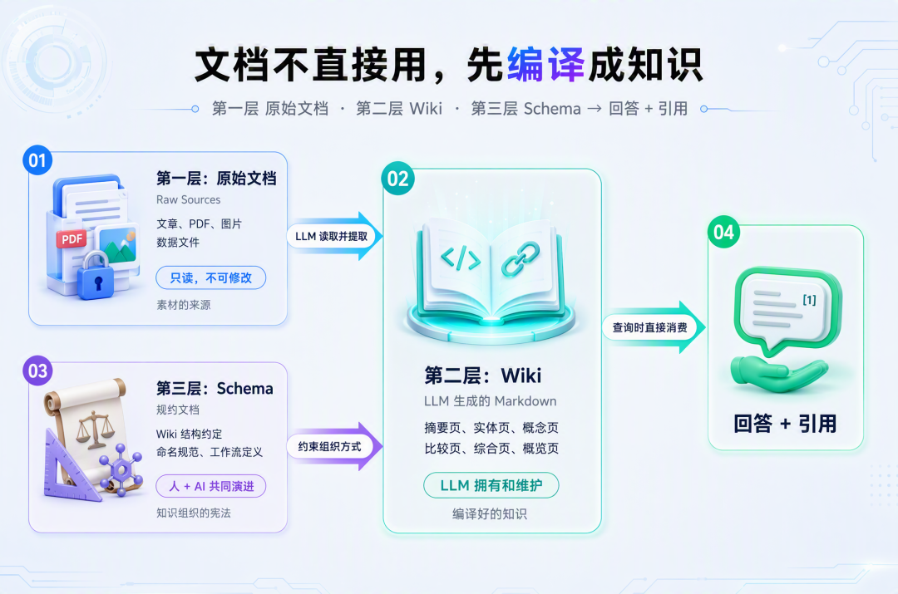

这不同于传统 RAG 的关键差异在于：**传统 RAG 是“查询时编译”（Query-time Compilation），LLM Wiki 是“摄入时编译”（Ingest-time Compilation）。** 知识只被整理一次，然后持续更新；每次查询消费的是已经编译好的知识，而不是临时拼凑的碎片。

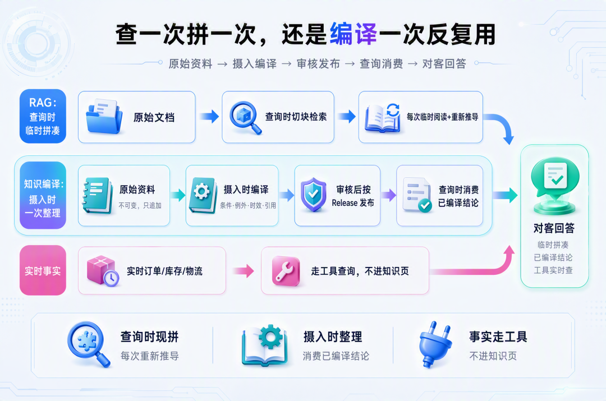

Karpathy 的 LLM Wiki 是一个个人知识管理的模式。将其应用到企业垂类业务场景时，需要做三个层面的适配和扩展：

第一层适配：从“个人 Wiki”到“企业知识层”

企业场景下的知识有更强的约束性要求：

|**维度**|**个人 LLM Wiki**|          **企业业务语义层**           |
|------|---------------|--------------------------------|
| 来源管理 |  个人收藏的文章/笔记   |产品手册、合规文件、SOP、工单、会议纪要、数据库 schema|
| 更新频率 |     随阅读节奏     |        随业务变更、规则更新、系统升级         |
|权威性要求 |     自行判断      |        必须有明确的来源链接和生效日期         |
| 多租户  |      单人       |          多角色、多部门、不同权限          |
| 合规要求 |       无       |        知识变更需要审批、留痕、可追溯         |

第二层适配：三种知识操作（Ingest / Query / Lint）

Karpathy 把 Wiki 的日常工作收成三个动词：Ingest（摄入）、Query（取用）、Lint（体检）。三者必须拆开，不能都塞进一次对话。摄入负责把资料变成可引用结论；取用负责按场景拿到正确版本；体检负责定期找出矛盾、断链、过期和空白。没有取用，编译只是给自己看；没有体检，编译只是把噪声换了个存放处。

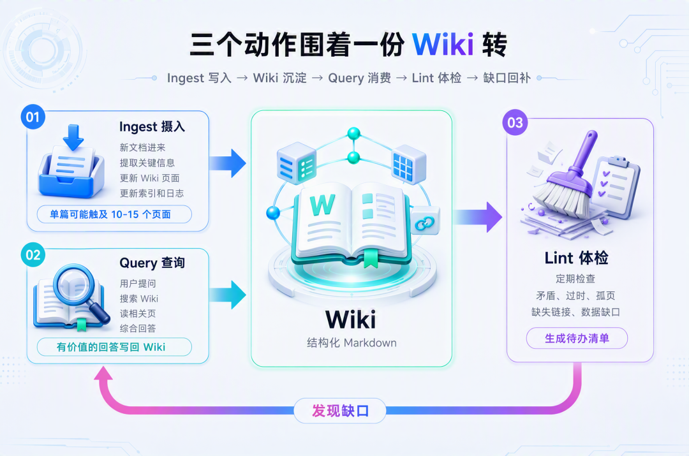

### 3.2.1 Ingest：一次编译，而不是每次提问再拼

Karpathy 给出的个人流程是：把新资料放进原始层 → 读全文并讨论要点 → 写摘要页 → 更新索引 → 更新被触及的实体/概念页（一篇资料常会改 10–15 页）→ 向日志追加一条记录。企业落地要把这条流程从“一次聊天”升级成可重复的编译作业。

### 实践要点：

## 1. **原文只追加、不改写。**

    原始文档是事实源。Wiki 是解释层。用户对话、Agent 临场总结，都不能直接覆盖原文。

## 2. **先立契约再写内容。**

    页面类型、必填元数据（来源、生效区间、适用对象、权限、版本）、章节顺序要先定死。没有 schema，后面的 Lint 没有门槛。

## 3. **编译输出是补丁，不是整页重写。**

    一篇新资料只更新被触及的结论和交叉引用；整页自由改写会出现“摘要越来越漂亮、细节越来越空”的坍缩。

## 4. **标明抽出与推断。**

    从原文抽出的结论可以进正式页；模型推断的内容必须打标。推断占比高的，不能当政策用。

## 5. **概念页要有门槛。**

    参考实践里，一个概念至少被两篇原文引用才独立成页，避免每个词都变成孤页。

## 6. **日志可被机器读。**

    每条摄入用统一前缀，例如 `## [2026-04-02] ingest | 退货政策-v3`。Karpathy 特别提到，这样 `grep` 就能拉出时间线，审计和增量编译都靠它。

## 7. **机械活交给脚本，认知活交给模型。**

    去重、命名、状态机、frontmatter 校验用脚本；摘要、实体归并、冲突标注用模型。让模型去判断链，会漏、会飘。

*个**人 Wiki 可以人盯着一篇一篇吃；企业 Wiki 必须能断点续作：发现 → 抓取 → 编译 → 验收，允许“抓了 10 篇、先摄入 5 篇、隔天再补”。*

### 3.2.2 Query：先消费已编译结论，而不是再去翻原文堆 ###

Karpathy 对 Query 的定义很短，但有两句不能省：对着 Wiki 提问，而不是对着原始文档临时拼；好的回答可以沉淀回 Wiki，探索本身也要复利。 开源实现（如跟随该模式的 SCHEMA）通常把步骤写成：先读 `index.md` → 关键词 / 向量融合召回 → 读中选页全文 → 带引用综合作答 → 用户明确保存时才落成新页。企业场景还要补上权限、时效、未命中策略和“实时事实走工具”。

查询要先分流，不要所有问题都走向量。 直播数据 Wiki 一类实践把问法分成三类：给出明确对象名的精确查询（直接读目标页）；带“上游 / 下游 / 适用 / 例外”的关系查询（走链接或关系图）；其余才是模糊搜索（先收敛业务域，再多路召回）。模糊搜索前先读目录、把范围收到两三个相关域，比一上来全库 Top-K 更稳。

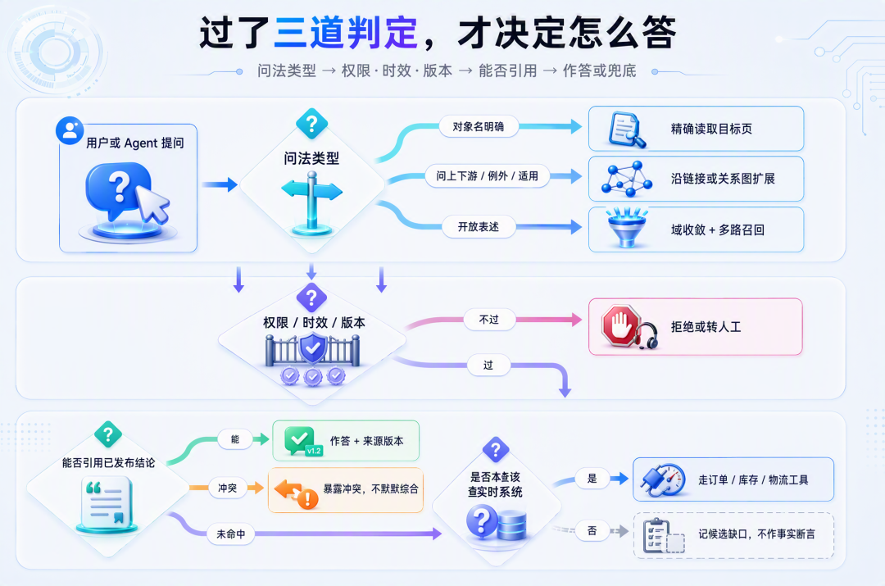

### 实践要点：

1. **只索引编译结果，不索引原文堆。原文里有目录段、表格噪声、未仲裁冲突。人和 Agent 应读同一套已发布页；需要核对原文或尚未编译的材料时，再回查 Raw。**
2. **权限和时效在召回前过滤。先搜再按权限删，既浪费窗口，也有泄露风险。过期页即使语义很像，也不能进答案。**
3. **多路召回，而不是只靠相似。元数据硬过滤、关键词（政策编号、订单号）、向量、以及沿“例外 / 上游 / 适用对象”的链接扩展，要一起用。脚本做粗排，模型只在短名单上精排。**
4. **覆盖度是硬门槛。候选读完详情后，不满足当前条件（品类、渠道、会员等级、活动期）的直接淘汰，不能因为“写得像”就采用。**
5. **未命中要诚实。检索分低于阈值，禁止用通用常识补业务事实。高风险路径上，不回答比流畅地错更安全。**
6. **实时事实不走 Wiki。库存、物流、余额、工单状态走系统查询。Wiki 回答“规则是什么”，工具回答“这一单现在怎样”。**
7. **对话成功一次，不能写成政策。有价值的综合、对比、分析，最多进入候选页或查询日志，经审核和编译后再发布。Karpathy 说的“好答案写回 Wiki”，在企业里对应的是候选，不是生产热更新。**
8. **查询日志是体检的输入。同一类问题反复问不到、或反复命中过期页，应进入 Lint 的缺口和腐化清单，而不是让运营凭感觉补文档。**

*业界把 RAG 健康检查产品化时（如 corpuslint、corpus-canary 一类语料体检工具），强调的也是同一件事：很多“答错了”其实是语料腐化，不是模型不够强。Wiki 模式把体检从“向量库里找重复切片”前移到了“已发布结论是否仍适用”。*

### 3.2.3 Lint：把健康度从“建库时合格”变成“持续合格” ###

Karpathy 给 Lint 列了一张检查单：页与页是否矛盾、是否被更新资料取代、有没有无人引用的孤页、被反复提到却没有专页的概念、缺交叉引用、以及可以用新资料补上的数据缺口。LLM 还适合提出“下一步该去找什么资料”。企业要把这张检查单拆成两层：脚本能稳定抓住的结构问题，和必须模型或人来看的语义问题。

|**检查项**| **谁来做**  |     **典型信号**      | **发现之后怎么处理**  |
|-------|----------|-------------------|---------------|
| 结构完整性 | 脚本，可进 CI |缺来源 / 缺生效时间 / 缺权限标签|     阻断发布      |
| 链接有效性 |    脚本    |  断链、孤页、索引与页面不一致   |  修链接或删除无效引用   |
|数量与契约对账|    脚本    |原文数、Wiki 页、关系图节点对不上|  编译失败，不对外发布   |
|  新鲜度  | 脚本 + 规则  | 超过有效期、源文件已变但页未重编译 |    触发增量摄入     |
| 冲突与口径 |模型建议 + 人裁决|   两页对同一条件给出相反结论   |  暴露冲突，禁止自动选边  |
| 覆盖缺口  |查询日志 + 规则 | 多会话重复问不到、应覆盖领域未建页 |补原文，再编译，用代表问题回放|
|推断冒充政策 | 规则 + 抽检  |    无引用、推断标记过多     |  降级为草稿，不得进生产  |

实践要点：

1. 两道关，而不是一道。 单页生成后先做字段和引用检查；整库构建后再做全局对账（页数、断链、关系图）。前者保证一页正确，后者保证整体一致。

2. Lint 是持续巡检，不是上线仪式。 每篇摄入后跑轻量断链检查；每周或规则变更后跑全量。参考实践把健康检查从“构建后一次性兜底”扩展为运维期巡检，不通过的项进治理待办，用增量重生成关闭，而不是全量推倒。

3. 严重级别要能挡住发布。 断链、缺引用、契约字段缺失应是 ERROR、非零退出，能当 CI 门槛。孤页、薄页、建议补链可以是 WARNING。让模型“看着办”，规范会在关键时刻被跳过。

4. 冲突只暴露，不默默综合。 两条有效期内的结论打架，应返回冲突并进入人工仲裁，而不是让模型选一句好听的。

5. 缺口要可晋升，不要把所有零结果当“缺文档”。 闲聊、表达不完整、本该查订单却去搜政策、越权被拒、检索故障，都会表现为“没召回”。可晋升的缺口至少要同时满足：属于企业应覆盖的领域；当前发布版本未充分覆盖；最终没有引用有效证据；并且在多个独立会话里重复出现。

6. 健康度要能量化。 参考实践用覆盖率、连通度、溯源可信度、结构完整性、新鲜度打分，用来排待办，而不是凭“感觉文档很多”。没有分数，知识库会只增加不整理。

第三层适配：从“文档”到“语义”的三个坎

从企业文档到可以被 Agent 真正消费的业务语义，需要跨过三道坎：

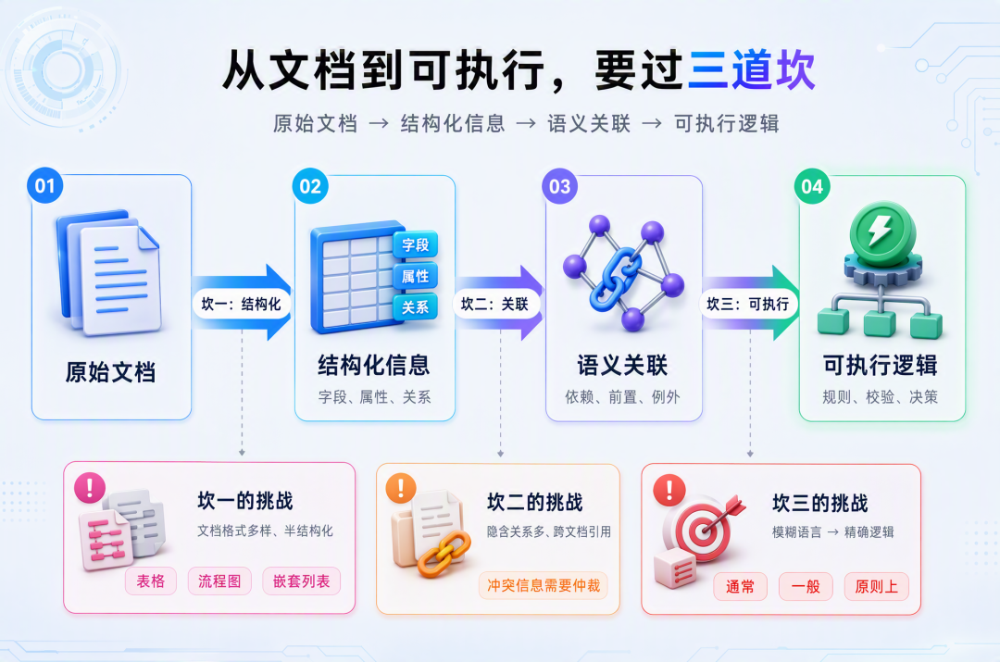

* **结构化**

  。把文档中的信息提取为有明确字段和属性的结构化数据。例如，把“贷款申请人年龄应在 18-65 岁之间，具有稳定收入来源”提取为 `{min_age: 18, max_age: 65, income_requirement: "stable"}`。

* **关联**

  。建立跨文档的语义关联。例如，A 文档说“逾期 30 天进入催收流程”，B 文档说“VIP 客户逾期宽限期延长至 45 天”——这两个规则之间存在优先级和适用条件关系，必须被显式建模。

* **可执行**

  。将模糊的自然语言表达转化为可被 Agent 执行的规则。“通常不超过 3 个工作日”——“通常”意味着什么？“3 个工作日”与自然日的区别？这些都必须被精确化。

### 3.3 知识方案 ###

|          **方案**           |      **解决什么痛点**      |    **失败模式**    |
|---------------------------|----------------------|----------------|
|         A. 文档 RAG         |   把手册变成可问，解决"找得到"    |冲突/过期/条件丢失/无法锁版本|
|       B. 带元数据的混合检索        |找得更准（关键词+向量+过滤+rerank）|   元数据脏则过滤失效    |
|   C. Agentic RAG / 查询改写   |     复杂问法、多跳定位条款      |  延迟与费用上升，需限跳数  |
|     D. 规则引擎 + LLM 填槽      |      高风险判定要稳定可测      |  规则覆盖不全时体验变硬   |
|E. 知识编译（Wiki/Claim/Release）| 摄入时综合、冲突显式化、结论可引用可发版 |  编译链路与审核组织成本高  |

推荐节奏：

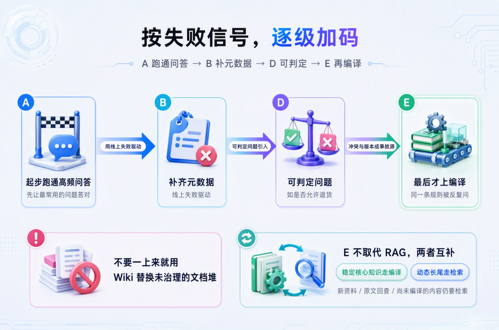

不同的业务场景适合不同的知识访问方式：

|       **场景类型**        |      **推荐模式**      |     **原因**     |
|-----------------------|--------------------|----------------|
|  快速变化的外部信息（新闻、市场数据）   |        RAG         | 不可能逐篇编译进 Wiki  |
|稳定的内部知识（产品手册、合规条例、SOP） |      LLM Wiki      |知识可编译、需要一致性、需要审计|
|   半结构化数据分析（客户交易、日志）   |   数据库查询 + LLM 解释   |结构化查询比 RAG 精确得多 |
|探索性知识发现（"这个领域有哪些最佳实践？"）|RAG + 人工 → 逐步纳入 Wiki|    先探索，后沉淀     |

需要强调的是，LLM Wiki 模式并非要完全取代 RAG，RAG 解决的是“找到相关内容”的问题，LLM Wiki 解决的是“让知识积累和演进”的问题。两者是互补关系，不是替代关系。

无论选哪种，下面几项不做，知识层都会在生产里漏。

* **切分要尊重结构，而不是只切长度。**

   标题、列表、表格、FAQ 问答对应保留；条件句尽量与例外同块。

* **引用是一等公民。**

   高风险回答必须能指回 `source_id + version + 定位符`。无引用则降级：转人工、给原文链接，或不作事实断言。

* **冲突要暴露，不要默默综合。**

   两条结论冲突时应返回冲突，而不是让模型选一句好听的。

* **未命中策略。**

   检索分数低于阈值时，禁止用通用常识补业务事实。

* **评测集按场景，不按“感觉通顺”。**

   用真实工单构造：含条件、含过期干扰项、含冲突对。离线看召回、引用覆盖、冲突检出；线上看错误承诺和过期命中。

### 3.4 知识缺口不是「这次没搜到」 ###

上线后最常见的误判是把“零结果”当“缺文档”。闲聊、表达不完整、本该查订单却去搜政策、越权被拒、检索服务故障，都表现为"没召回"，需要区别对待！

可晋升的知识缺口至少要同时满足：属于企业应覆盖的领域、当前 Release 未充分覆盖、Agent 最终没有引用有效证据、且在多个独立会话里重复出现。

发现之后的正确写路径是：交互进入短期 Buffer → 噪声过滤 → 主题归一 → 跨会话累积 → 达阈值进运营列表 → 补原始资料 → 走编译审核发布 → 用代表问题回放通过才关闭。

04

把经验变成能力

文档告诉 Agent 规则是什么，经验告诉它“遇到这种情况通常怎么做”。后者不结构化，模型只能临场发明流程。

### 4.1 经验不只在文档里 ###

企业里真正有价值的知识是“怎么做”的经验，这些经验分布在：

* **SOP（标准操作流程）：写得清楚但往往过时，真正执行可能已经迭代了好几版；**
* **历史工单：真实案例中如何处理的完整记录，远比 SOP 更细腻；**
* **老员工的习惯：特定场景下的“感觉”和“经验判断”，隐含了大量未明说的规则；**
* **团队约定：Slack 里的一次讨论决定了某种情况该怎么处理，但没有进入任何正式文档；**
* **错误教训：上一次出错后的修正动作，这些知识往往只在当事人脑中。**

传统做法是把这些经验一条一条写进 Prompt。但问题是：

* Prompt 越长，模型越容易“失焦”：Anthropic 称之为 context rot（上下文衰减）；

* Prompt 难以维护：规则互相嵌套、版本混乱、修改一条规则可能间接影响其他行为；

* Prompt 无法复用：不同 Agent、不同场景需要复制粘贴 Prompt 片段。

### 4.2 能力封装的分档 ###

|       **方案**       |  **解决什么**   |   **不擅长**    |
|--------------------|-------------|--------------|
| A. 超长 Prompt / 少样本 |  最快让单一场景像样  | 多场景维护、灰度、回滚  |
|    B. 按意图加载的工作流    |把步骤画出来，减少临场发明|  开放域、用户中途改口  |
|  C. Skills + 渐进披露  | 能力多但上下文保持瘦  |描述写不好会选错 Skill|
|D. 确定性骨架 + LLM 填槽与话术|  高风险步骤不可漂移  |   覆盖不到的长尾    |
| E. 从轨迹蒸馏 Skill 候选  |  把线上打法沉淀下来  |   无门禁会污染目录   |

### 方案 C 的核心设计是渐进式披露（Anthropic Agent Skills 的做法）： ###

* 目录层只放 name + description（约百 token），命中后才加载 SKILL.md 正文，必要时再打开附录与脚本——50 个场景不会同时挤进窗口，脚本执行不消耗上下文，只有脚本输出占 token。

* 一个垂类能力单元至少应包含：触发条件、输入要求、执行步骤、工具白名单、校验规则、异常处理、输出约束。

* 工程上还应做到：

* 一 Skill 一事（正文超过约 5000 token 就该拆）

* 版本必须可回滚（skill\_version 出现在轨迹里，出问题切回旧版而非热改 Prompt）

* 独立评测（退货 Skill 的工具成功率、错误承诺率，不被"整个机器人好不好用"淹没）

* name/description 是接口定义（Agent 只看这两个字段决定是否触发）。

**实践中的有效组合**通常是：B 或 D 做主路径骨架，C 做可复用的场景包，A 只留全局红线和人设，E 负责把线上打法回流成下一版 C。**Tool 始终按当前 Skill 的白名单暴露**（4\~8 个），而不是企业 API 目录全量摊开。

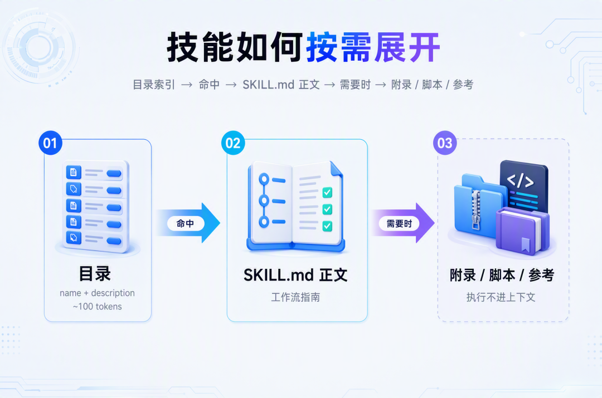

**经验要可发现、可版本、可按场景收紧工具，不能只活在某个人的脑子和一段不可回滚的文本里。**

05

让任务持续推进

### 5.1 Agent的本质是循环，不是一次生成 ###

一次生成适合“把这句话写漂亮”。企业任务几乎都不是这样。售后可能是：识别意图 → 核验订单 → 判断品类 → 检索规则 → 咨询或申请 → 凭证缺失再分支。公积金提取要把一句话变成核验、查询、签署、凭证。每一步的结果是下一步的输入。用单轮检索硬接，只会反复解释政策，办不成事。

所以 Agent 的最小形态不是“更聪明的聊天框”，而是下面这个圈：

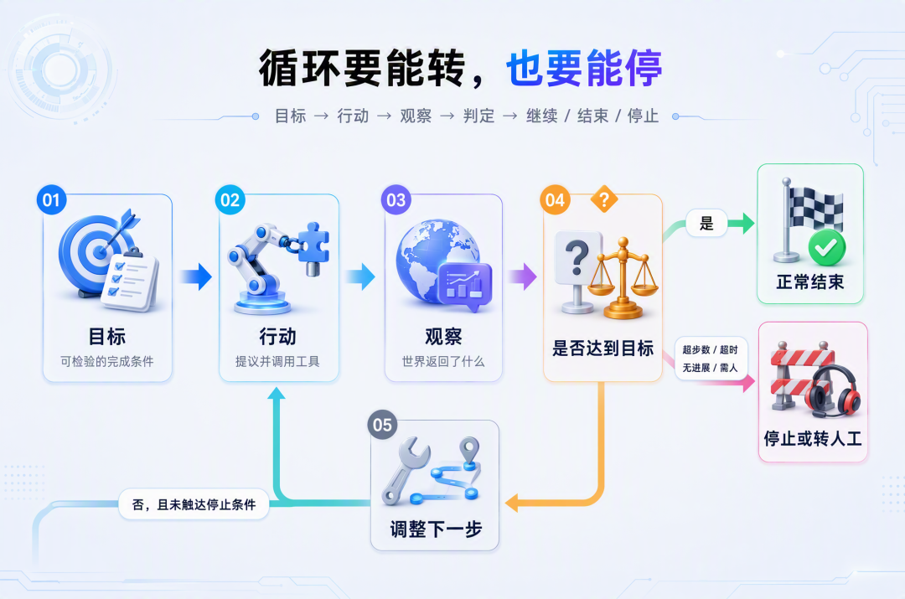

这里有一条容易被忽略的边界：**循环里真正执行工具的，是外围代码，不是模型。**

Anthropic 的工具调用协议写得很清楚：模型只能发出 `tool_use`，应用把工具跑完，把结果塞回去，直到模型不再要工具、或触达其他停止原因。生产级 Agent 的控制权，从第一天起就应该在这段确定性代码上，而不是在模型的自由发挥上。

这也是它和另外两种东西的差别：

|       |**一次生成**|**固定自动化**|  **Agent 循环**  |
|-------|--------|---------|----------------|
|下一步由谁决定| 没有下一步  | 预先写死的节点 |  当前状态 + 规则/模型  |
| 中途新信息 |  无法消化  | 只能走已画的边 |    可以改计划再行动    |
| 怎样算完  |  生成结束  | 走到终点节点  |   完成条件被独立验证    |
|  适合   | FAQ、摘要 |分支清楚的标准流程|要判断、要选工具、路径不完全预设|

Gartner 那句“决策用 Agent、常规用自动化、检索用助手”，对应的就是这三列。把固定退货路径做成多轮发明，既贵也不稳；把必须临场判断的纠纷做成死工作流，又会在用户改口时卡死。

### 5.2 Loop Engineering：设计循环，而不是把提示词写得更长 ###

提示词工程关心“这一句怎么说才有效”，上下文工程关心“这一窗里放什么”，循环工程关心另一件事：谁在什么时候启动下一圈、用什么证明这一圈有效、什么条件下不许再转。 

Osmani（*对对，就是提出‘**如果你不是模型，你就是 harness**’的男人*） 把它放在 Harness 的上一层：Harness 是单次运行的操作系统，循环是让这次运行能被触发、被验收、被续上的控制层。

一个能离开人盯着的循环，至少要有四件东西。缺任何一件，Demo里像在干活，生产里就会空转或越权。

|  **构件**  |**它回答的问题**|      **垂类业务里长什么样**       |   **缺了会怎样**   |
|----------|----------|--------------------------|---------------|
| ***触发*** |这一圈为什么现在开始|   用户进线、工单创建、审批回调、定时巡检    | 只能等人在对话框里按下回车 |
| ***目标*** |  怎样才算做完  | “工单已派单且住客可见”“代表问题带引用答对”  | 模型用流畅的结束语代替完成 |
|***验收器*** | 谁来证明做完了  |   业务断言、规则引擎、另一路抽检、人工确认   |干活的给自己打分，分数会自己涨|
|***停止条件***| 什么情况下必须停 |达成目标、超步数、超时、费用上限、无进展、高风险转人| 同一失败接口重试到重复扣款 |

目标：

2026 年编码 Agent 里出现的 `/goal`，本质就是把目标和验收器写死：例如“指定测试全部通过且检查干净”，而且**另用一个模型或脚本判断是否达标，不让写代码的那个给自己打分。**

企业办理类任务应当抄这条，而不是只抄那个命令名。退款咨询的目标不该是“用户看起来满意”，而该是“结论引用了当前有效政策，且未发起未授权的退款”。

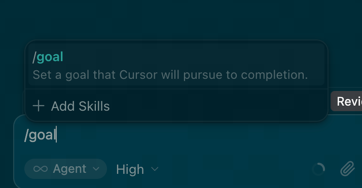

### 验收器：

验收器必须独立。对垂类业务，独立验收不一定要再搞一个大模型，更常见、也更便宜的是，下游状态机是否到达目标态、必填槽位是否齐全、规则引擎是否放行、高风险是否得到人工授权。

### 触发和停止：

把触发和停止再拆一层，循环就不再是“多转几圈”这么笼统。Osmani 把循环分成四档，每一档交出的东西不同：

|**档位**|**人交出什么**|    **编码 Agent 里的样子**    |     **垂类业务里的样子**      |
|------|---------|-------------------------|-----------------------|
| 回合循环 |  检查方式   |  每轮提示后，Agent 自己判断是否做完   | 坐席或用户每说一句，系统走一步再停下来问  |
| 目标循环 |  停止条件   |`/goal`：测试通过且检查干净，另用评估器判定|   “工单已派单且住客可见”，达标才停   |
| 时间循环 |  触发节奏   |   `/loop` 或定时任务，按间隔巡检   |  超时未补凭证催办、夜间对账、设备巡检   |
| 主动循环 |  提示本身   |     事件或日程自己开工，无人盯着      |告警触发诊断、审批回调续跑、工单创建即启动办理|

四档是嵌套，不是互相替换。主动循环外面是触发，里面仍要有可检验的目标和独立检查。最里层的检查写错，外面转得越勤，错得越快。目标必须能被判定。“一直聊到用户满意”不是目标，是把停止条件交还给模型的感觉。

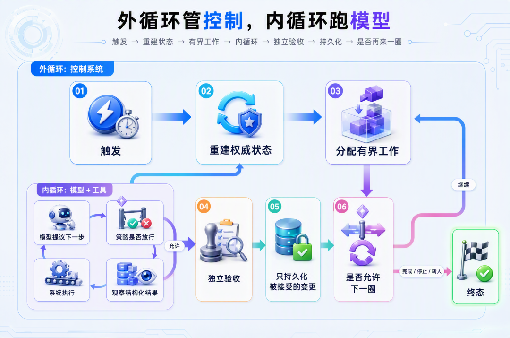

内循环解决“这一步怎么走”。外循环解决“这一步该不该走、走完算不算数、能不能再走”。生产事故几乎都出在外循环：状态是旧的、重试把写操作又做了一遍、停止规则太软、验收和执行是同一个黑盒，同时也有可能导致循环重复失败、多余工作和错误推理把费用烧光。

### 5.3 循环在生产里怎样失败 ###

常见失败不是“模型不够聪明”，而是控制失效：

|**失败形态**|    **业务上像什么**    |   **控制上缺什么**    |
|--------|------------------|-----------------|
|   空转   |同一句话解释三遍，费用在涨，单没办 |   步数、超时、无进展检测   |
|  目标漂移  |用户问能不能退，系统开始推荐别的商品|    每一圈回看原始目标    |
|  假完成   | 回复“已为您办理”，工单未派单  |业务断言，而不是 HTTP 200|
| 副作用重放  | 超时后重试，重复创单、重复派单  |  幂等键；已成功的写不再执行  |
| 窗口被撑爆  |    “第二个”指错订单     |   上下文压缩，进度外置    |
|无人值守的自信 |   循环在夜里把不该退的退了   |  高风险停止并转人；验收独立  |

没有停止条件的循环，和没有状态的多步，一样危险。前者会烧钱和制造副作用，后者会在用户说“那就退吧”时把上一轮核验过的订单弄丢。

这也解释了为什么“持续完成”比“一次生成”更适合当生产指标。Demo 看的是答对了一道题；生产看的是连续任务有没有被推到可断言的终点、失败有没有被停住、费用有没有上限。

|**评价维度**|**Demo 级**|    **生产级**     |
|--------|----------|----------------|
|   完成   | 看一次输出像不像 |  看完成断言是否被独立验证  |
|  错误处理  | 报错就人工介入  | 有界重试、降级、或升级为人工 |
| 任务连续性  |  每次从头开始  |从权威状态续跑，已成功的写不重放|
|   成本   |   不在乎    | 每圈有步数、超时和费用上限  |

### 5.4 垂类业务怎么选循环的形态 ###

循环是本质，图画出来只是给“下一步由谁决定”换一种写法。**自由循环**把下一步交给模型当场决定，适合路径不完全预设、要动态选工具。**图编排 / 工作流**把下一步写成节点和边，适合分支、等待、人工卡点必须可审查。二者都是循环：工作流跑起来，也是到节点、做事、看结果、走下一条边。检查点是第三维——进度能否落下——循环和图都可以叠加，图画清楚不等于能持续跑。

|    **方案**     |  **解决什么痛点**   |   **不适合**   |
|---------------|---------------|-------------|
|   A. 单轮检索生成   |   纯咨询、一次说清    | 办理、多系统、要写数据 |
|   B. 受控内循环    |路径不完全预设，需要动态选工具|分支必须写死、强审批挂起 |
| C. 把循环画成可审查的图 | 分支、等待、人工卡点要可测 |强开放域、步骤很难预先画出|
|D. 确定性主链 + 局部循环|  主路径要稳，局部要灵活  |需要把所有步骤都交给模型时|

方案 B 的价值在退出条件，不在转得更多。实施清单至少包括：步数上限、整段超时、费用预算、写操作幂等、对相同参数的重复调用熔断、工具结果按业务 schema 校验。缺这几项的 Loop，只是在用 token 换偶然成功。

方案 C 并不自动更安全。没有持久化，图和循环一样，进程一丢就得从头来。没有独立验收，图只是把假完成画成了“已到达结束节点”。

方案 D 往往是生产形态：主路径用工作流锁死，局部不确定步骤再嵌一段受控循环。能预定的节奏不要交给临场发挥，必须临场判断的局部才打开循环。

06

让Agent接入系统

没有系统接入，Agent 只能解释世界；有了接入却没有控制面，它会改写世界。这一章的难点几乎全是传统集成问题被模型调用放大。

### 6.1 直连的五种代价 ###

企业动作散落在CRM、工单、IM等多个系统中，而模型如果直连系统的API，产生的影响会很多：

* 身份冒用（模型用服务账号打了用户不该打的接口）；

* 幂等缺失（超时重试造成重复创单、重复扣款——Demo 少见，生产致命）；

* 部分失败（工单创建成功、通知失败、库存未锁，循环按"失败"再来一次）；

* schema 与错误码不稳（模型把降级文案当业务结果，把可重试错误当终态）；

* 工具集过大（一次暴露上百个 API，选错、漏传、越权的概率一起上升）。

### 6.2 接入方案分档 ###

|    **方案**    |       **解决什么**       | **风险/局限**  |
|--------------|----------------------|------------|
| A. 模型直连 API  |      最快做出"会查会写"      | 权限、幂等、审计裸奔 |
|B. iPaaS/连接器编排|     跨系统流转、触发、重试      |对话状态与体验不在这层 |
| C. MCP 标准协议  |     统一方式暴露工具与资源      |协议不管业务级鉴权与配额|
|D. 工具网关（推荐主路径）|身份、schema、幂等、审计、熔断集中处理|  要建设网关本身   |

### 一个形象的类比：MCP 是“USB-C 接口”，解决怎么连；工具网关解决能不能连。MCP 让工具描述与调用标准化、多个运行时可复用同一组 server，生产仍要在协议之外做鉴权、配额、审计——协议不替代业务级 PEP。 ###

### 方案 D 的最低配置：调用身份与用户身份绑定；按场景的工具白名单；JSON Schema 校验；幂等键；超时与熔断；结构化错误（可重试/不可重试/需人工）；写操作默认最小权限，高风险走审核等等。 ###

补偿策略要预先写清：可撤销的配补偿接口；不可撤销的必须前置确认；重试必须带同一幂等键。做不到这三条，就不应把执行权交给 Agent——给解释权可以，给写系统的权必须另算。

当 Agent 通过工具层接入真实业务系统后，它就从“提供建议”变成了“执行动作”，这意味着治理要求全面提升：

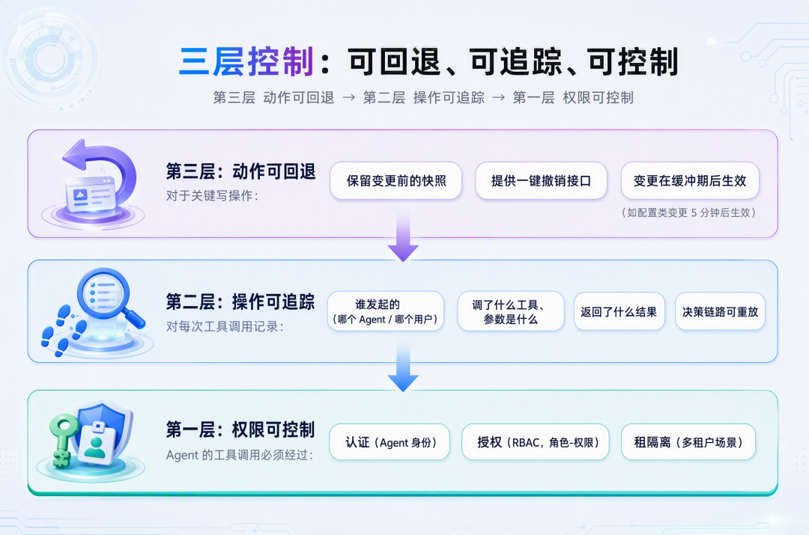

当 Agent 具备代码执行能力时（如执行 Python 脚本处理数据），需要考虑额外的沙箱隔离。Dify 平台在 API 模式下的 Skills 运行在无网络访问的沙箱容器中，不允许运行时安装包——这是一种生产可用的安全策。WorkBuddy 则采用本地桌面执行模式，敏感文档不需要离开本地环境。

当一个 Agent 真正接入了系统，它的角色发生了质变，下图对比了三种 Agent 形态的差异：

|            **形态**             |   **能做什么**   |     **不能做什么**     |    **治理复杂度**     |
|-------------------------------|--------------|-------------------|------------------|
|    **信息型 Agent**（RAG + 对话）    |回答知识问题、生成文本摘要 |      执行任何写操作      |   低（只需要内容安全审核）   |
|   **辅助型 Agent**（RAG + 工具建议）   |建议操作、生成待办、推荐路由|     直接操作业务系统      |  中（需确认链路和审计日志）   |
|**执行型 Agent**（RAG + 工具层 + 确认机制）|创建工单、发起审批、更新数据|涉及资金的写操作（应在 L3 管控下）|高（需要完整的权限、追踪、回退体系）|

07

支持长任务与恢复

### 7.1 任务常常跨轮次 ###

在企业场景中，“任务”与“对话”不是一回事。一个客户问题可能需要三天才能解决：第一天收集信息，第二天等待对方补充材料，第三天执行处理。如果 Agent 只存在于一次对话的上下文窗口中，它不可能支撑这种时间跨度的业务。

以下是企业长任务常见的五种中断类型：

|**中断类型**|         **示例**          |**持续时间**| **恢复难度**  |
|--------|-------------------------|--------|-----------|
| 等待外部输入 |       等待客户上传补充材料        | 数小时到数天 |     中     |
| 需要人工审批 |        经理审批退款申请         |几分钟到数小时 |低（审批有明确事件） |
| 流程跨系统  |先在 CRM 查客户信息，再去 ERP 查订单状态|  数分钟   | 低（流程可编排）  |
|  定时触发  |     每月 1 号生成上月运营报表      |  固定周期  |  低（时间触发）  |
|异常中断与恢复 |    系统崩溃、网络超时、API 限流     |  不可预知  |高（需要自动恢复机制）|

### 7.2 Context ≠ Memory ≠ State ###

在 Agent 架构中，三个概念常被混用但必须区分：

|     **概念**     |     **含义**     |**存储周期**|      **典型实现**       |            **类比**            |
|----------------|----------------|--------|---------------------|------------------------------|
|**Context**（上下文）|当前推理窗口中的全部 token| 单次推理周期 |      LLM 上下文窗口      |        人脑的工作记忆——有限且短暂        |
| **Memory**（记忆） |   跨会话持久化的信息    |  天到月   |     向量库、结构化记忆存储     |        人脑的长期记忆——需要时检索        |
| **State**（状态）  |   任务执行的当前进度    | 任务生命周期 |检查点（Checkpoint）/ 事件溯源|进程的 program counter——"现在执行到哪了"|

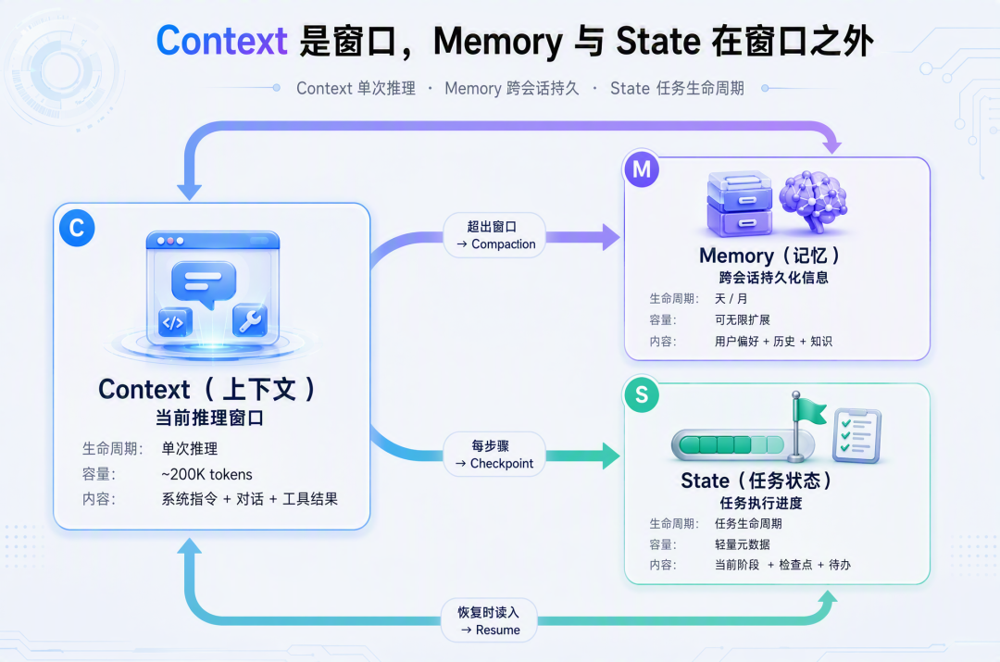

### 7.3 支持断点续跑 ###

生产级长任务系统需要两种恢复模式：

检查点模式（Checkpoint-based）——在每个关键步骤完成后，保存当前状态的快照。如果任务中断，从最近的有效检查点恢复。

事件溯源模式（Event Sourcing）——记录所有状态变更事件，恢复时重放事件序列重建状态。比检查点更精细，但成本更高。

对于垂类业务来说，"状态管理"不是一个可选的技术细节，而是业务连续性的工程基础。如果一个Agent在处理客户问题的第 3 天重启后忘记了第 1-2 天的所有交互，这不是技术问题，是故障。关注的一些要点：

* 检查点间隔是否合理？（太频繁浪费资源，太稀疏丢失进度）

* 中断后恢复时，Agent 是否向用户确认“我从中断点继续”？（避免重复操作）

* 人工审批的中断是否支持持久化等待？（审批人可能一个小时后才回复）

* 状态数据是否有备份？（检查点丢失 = 任务丢失）

08

让Agent可衡量、可治理、可进化

### 8.1 上线后的漂移与评测错位 ###

上线不是终点。Demo 证明曾经成功过一次；评估证明在定义好的分布上可重复成功。

知识过期、工具变慢、模型升级改变工具选择、业务规则更新后旧 Skill 仍在应答——漂移在流量里缓慢发生，没有切片指标时总完成率仍可能"看起来稳定"。

评测错位则更隐蔽：用通用 chatbot 榜单或“像不像人”替代场景评测，会放过错误承诺；用 LLM-as-judge 打分而不校准，会系统性偏向流畅而不是正确；只看最终回复、不看轨迹，发现不了“选错工具但话圆回来”的情况。这都是行业性的常见痛点。

### 8.2 分层指标 ###

|     |                |
|-----|----------------|
| 任务层 |完成率、一次解决、转人工、时长 |
| 能力层 |某场景步骤完成、错误分支、准确率|
| 工具层 | 调用成功率、超时、幂等冲突  |
| 知识层 |命中率、引用覆盖、过期、冲突检出|
| 风险层 | 幻觉、越权、错误承诺、资损  |
|体验与成本|  满意度、接管、费用、延迟  |

与之对应的发布体系：离线黄金集回归（发版前跑，不通过就不全量）、灰度（按场景或租户）、按版本回滚。

### 8.3 自进化 ###

Agent的自进化按“改什么”分两大分支：**改脚手架**（Prompt、Memory、Skill、工具、工作流——更新快、便宜、可逆、可审计）与**改模型权重**（微调/强化/蒸馏——持久但慢、贵、难回滚）。两条路径不是二选一而是接力：脚手架承载快速试错，经验足够稳定通用后再考虑内化进权重。**对多数垂类业务，先把脚手架循环跑通就是全部答案；权重路径是最后一公里，不是起点。**

自进化的真正难点不是“生成修改”，而是“判断修改有没有真的变好”。不加控制的自我修改，Skill 会越改越长越散——放之生产，一次“看似合理”的修改可能悄悄降低真实任务性能。所以门禁必须硬：

| **门禁**  |     **作用**      |**类比**|
|---------|-----------------|------|
|  有界编辑   |每次只做小的增/删/改，不整段重写| 学习率  |
| 留出验证集门控 | 候选必须严格优于当前版本才接受 | 验证集  |
|  拒绝缓冲   | 被拒的修改不丢弃，作为负反馈  | 经验回放 |
|生成器/验证器隔离| 改策略的和打分的不能是同一个  | 利益回避 |

需要关注的是：

* **轨迹先分级再优化（知识缺口/规划失败/工具选错/Skill 缺失四类，分错层后面全是空转）；**
* **任何自进化输出都是新版本或 PR，不原地覆盖（会话日志只追加，正式 Wiki/Skill 只追加）；**
* **评估器只读（黄金集、红线不在被优化对象里——没有不可变评估器的自进化，只是在用自己给自己打分）；**

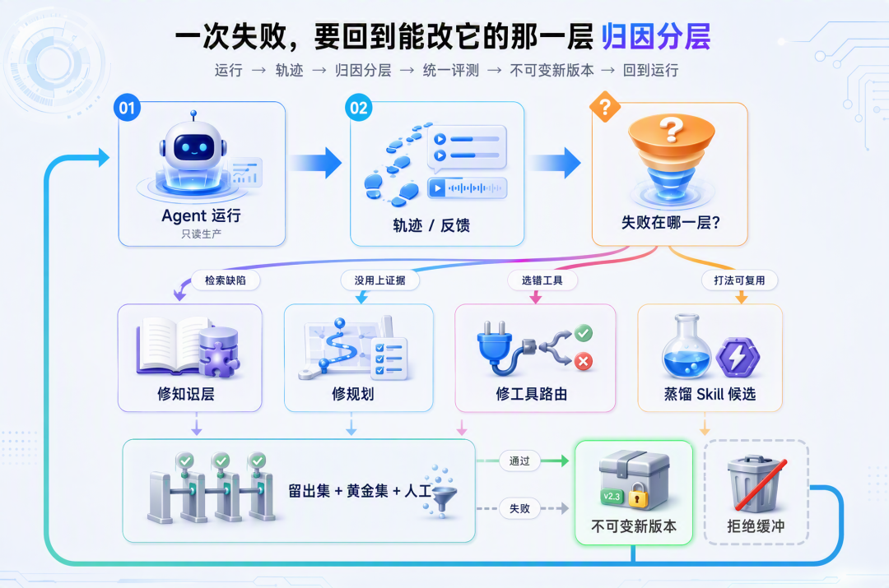

09

平台能不能直接套用

很多垂类业务的第一反应是：能不能用现成平台（Dify等）直接搭？答案是：**可以，但有明确的能力边界。**

2026年国内外平台都在快速演进，但各自的定位差异决定了边界。把几个主流平台放到同一张能力地图上：

|  能力维度  | Dify 类（开源可自托管） |WorkBuddy 类（生态型工作台）|云厂商 AgentOps 类（百炼/千帆等）|纯框架（LangChain、AgentScope、SpringAI等）|
|--------|----------------|-------------------|----------------------|-----------------------------------|
|  适合起点  | 知识问答、标准流程、快速验证 |   企业办公协同、腾讯生态场景   |    已深度使用对应云的平台团队     |         Agent 行为核心竞争力的团队          |
| 私有化/合规 |社区版自托管门槛低；企业版有认证|  公有云/VPC/私有三种交付   |       深度绑定对应云        |               完全自主                |
|长任务/断点续跑| 弱（多数平台不做持久化执行） |       部分支持        |         各家在补         |     框架有 checkpointer，仍需自建恢复层      |
|  行业纵深  | 无预置，需自建知识/连接器  |   20+ 行业实践，偏办公侧   |       行业方案随云生态       |               全部自建                |
| 治理完整度  |    企业版基础治理     |   统一治理+成本归集较完整    |       依赖云的治理体系       |               全部自建                |

10

抓住不变的东西

前面九章引入的技术，都不是为了把架构图换成更新的名词。它们在回答垂类业务里几件反复出现的事。名词会过时；这些事不会。把技术名拿掉，剩下的是同一组企业问题。

|  **企业里反复出现的问题**  |    **本文用过的技术名（会换）**    |   **换了名字之后仍要回答**   |
|------------------|------------------------|--------------------|
|目标打架、红线写在 Prompt 里|     四象限、PEP、可执行规格      | 这次运行到底允许做什么，错了谁负责  |
|  口径冲突、过期条款被流畅复述  |     RAG、混合检索、Wiki      |当前这条结论是否适用、能否指回某一版原文|
|   打法只在老员工和工单里    | Prompt、工作流、Skills、轨迹蒸馏 |经验能否被发现、版本化、按场景收紧工具 |
|  动作散落各系统、模型会越权写  |     MCP、工具网关、幂等、补偿     |  提议与执行是否分开，失败能否收场  |
|    跨轮、跨时间、跨人工    |Context/Memory/State、检查点|   接着聊和接着做是不是两回事    |
|     上线后静默变差      |    分层 SLI、黄金集、灰度回滚     | 用什么证明还可靠，错了如何缩小半径  |
|  越跑越脏，或把漂移写成进化   |     脚手架进化、Skill 谱系     | 经验写进哪一层，谁有权拒绝这次更新  |

真正成熟的生产级 Agent，不是一个什么都能做的通用体，而是一套围绕业务闭环的能力栈：理解业务知识，调用正确能力，进入真实系统，持续推进任务，在治理下长期运行，并把轨迹变成下一版更稳的知识与 Skill。与其追每月一个的新名词，不如回到最根本的四个问题：

* 你的业务里，什么知识最值得被编译和沉淀？

* 你的团队里，什么经验最需要被封装成能力？

* 你的系统里，哪些边界是Agent永远不该跨越的？

* 你的治理体系里，什么指标真正衡量Agent的价值？

回答了这四个问题，就知道接下来该投入什么。名词可以明天再追，行动今天就要开始！

欢迎留言一起参与讨论\~

