# 📰 相关性 ≠ 因果性：因果推断在 AI 评测归因中的方法与实践

## 这是2026年的第 43 篇文章

（ 本文阅读时间：约 25 分钟 ）

>
>
> 核心目标：用因果推断与博弈论方法，量化「因」对「果」的贡献度，精准定位复杂 AI 系统（LLM、Runtime Env、Tools等）的优化瓶颈。
>
>
>
> 阅读导航：
>
>
>
> 1.如果你已熟悉因果推断与归因分析的基础理论，可直接跳到 第 5 章：AI 评测中的归因分析实战
> ----------
>
>
>
> 2.如果你关注方法选型，推荐先看 第 4.3 节：方法选择决策框架
> ----------
>
>
>
> 3.如果你只想了解结论和实践经验，可直接看 第 6 章：总结与展望
> ----------
>
>

01

## 引言

### 1.1 从"冰淇淋与溺水"说起 说明：展示天气作为共同原因同时影响冰淇淋销量和溺水率的因果关系 揭示表面相关背后的真实机制 ###

在因果推断的经典案例中，有一个广为人知的现象：夏天冰淇淋销量越高，溺水事故也越多。如果仅看数据相关性，很容易得出荒谬的结论“吃冰淇淋会导致溺水”。但常识告诉我们，这两者之间并无直接因果关系，真正的幕后推手是气温：天气越热，既促使人们购买冰淇淋，也吸引更多人去游泳，从而增加了溺水风险。

这个案例揭示了一个核心问题：相关性不等于因果性。在数据分析中，如果我们不能识别并控制混杂变量（如气温），就会被表面相关误导，做出错误的决策。

将这一逻辑类比到 AI 评测中：

假设我们观察到「使用新版 Prompt 的 Agent 任务成功率更高」。如果直接归因于 Prompt 改进，可能会忽略一个关键混杂因素：Query复杂度。也许新版 Prompt 恰好被分配给了更多简单Query，而旧版处理的是复杂任务。如果不控制这个混杂变量，我们就会高估 Prompt 优化的真实效果，甚至可能将一个实际上退化的版本误判为改进。

这正是归因分析要解决的核心问题：在众多交织的因素中，剥离出每个因素的纯净贡献度，回答「到底是哪个环节真正驱动了结果变化？」

### 1.2 研究背景 ###

在数据科学领域，因果分析（Causal Analysis）是量化「因」对「果」贡献度的核心方法。其本质目标是识别不同输入变量（因素）对目标结果的影响权重，回答「哪些因素在驱动结果？贡献占比分别是多少？」这一关键问题。

随着人工智能从预测走向决策，传统的相关性分析已无法满足需求。因果推断（Causal Inference）提供了从「发生了什么」到「为什么会发生」再到「如果干预会怎样」的跃迁能力，成为现代归因分析的理论基石。

### 1.3 调研范围 ###

本文聚焦三个维度：

* 工具框架：主流因果推断库与归因分析工具的技术选型；

* 经验方法论：从经典统计到机器学习的归因方法体系；

* AI 评测应用：

  如何将数据科学的归因范式应用于 LLM/Agent 评估（深度实操版）。

02

归因分析的演进路径

### 2.1 从规则模型到算法驱动 ###

归因分析经历了从简单规则到复杂算法的演进：

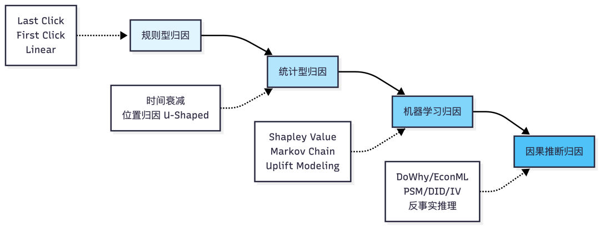

说明：展示从规则型→统计型→机器学习→因果推断的四阶段演进，包含各阶段的代表性方法。

传统规则型归因基于先验业务逻辑设计，无需复杂计算，但灵活性差，易忽略因素间的交互作用。现代算法驱动型归因则基于机器学习、博弈论和因果推断构建，能够捕捉高维、非线性、强交互场景下的真实贡献度。

### 2.2 核心挑战：相关性与因果性的鸿沟 ###

机器学习擅长回答「X 条件下 Y 会怎么样」（关联层），但无法回答「如果改变 X，Y 会如何变化」（干预层）或「如果当时做了不同的选择，结果会怎样」（反事实层）。这正是因果推断要解决的核心问题。

Pearl 提出的因果阶梯理论将推理能力分为三层：

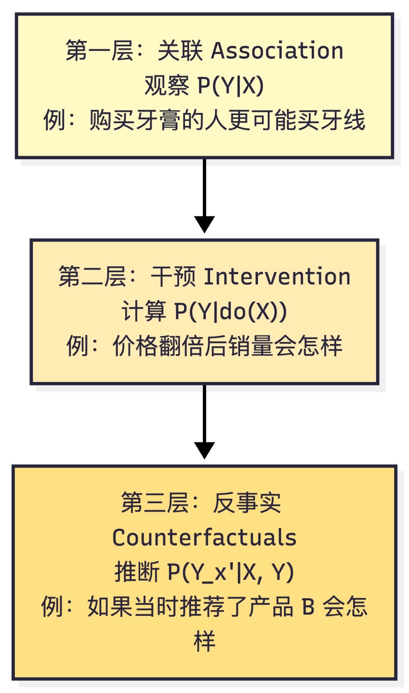

说明：展示Pearl因果推理三层结构，从关联观察到干预实验再到反事实推理的能力递进

03

主流工具框架对比

### 3.1 Python 生态核心库 ###

当前因果推断工具库生态呈现多元化发展，主要代表包括：

|    工具库    |  开发机构   |         核心特点          |        最佳适用场景        |
|-----------|---------|-----------------------|----------------------|
|   DoWhy   |Microsoft|因果图模型，四步框架（建模→识别→估计→反驳）|   因果发现、假设检验、端到端流水线   |
|  EconML   |Microsoft|     正交机器学习，深度学习集成     |  经济学研究、高维数据、异质性处理效应  |
| CausalML  |  Uber   |   Meta 学习者框架，树模型为基础   |营销效果评估、Uplift Modeling|
|PyCausalSim|  社区开源   |   模拟驱动的因果发现，内置验证模块    |   A/B 测试分析、结构因果模型    |

### 3.2 三大框架技术对比 说明：展示DoWhy（因果图建模）、EconML（正交机器学习）、 CausalML（Meta-Learner）的核心流程和技术特点 ###

DoWhy 的优势在于提供原则性的因果图建模框架，确保所有假设的明确性，并通过自动化反驳检验增强结果的可信度。EconML 则专注于利用正交机器学习解决高维数据中的因果效应估计问题，特别适合需要精细刻画异质性处理效应的场景。CausalML 以 Meta-Learner 为核心，提供了简单易用的 API，在营销归因和 A/B 测试分析中表现优异。

### 3.3 可解释性工具：SHAP 值 ###

SHAP（SHapley Additive exPlanations）基于博弈论中的 Shapley 值，为每个特征分配公平的贡献度。其满足四个公理：效率性、对称性、哑元性和可加性，被视为模型解释的「黄金标准」。

说明：展示SHAP值如何通过遍历所有特征子集、计算边际贡献并加权平均，

最终得到每个特征的公平贡献度。

在归因分析中，SHAP 值可用于量化每个营销渠道、实验参数或模型特征对最终结果的贡献，支持树模型、神经网络等多种预测模型。

04

核心方法论体系

### 4.1 两大理论框架：Rubin vs Pearl ###

因果推断领域存在两大主流框架：

Rubin 潜在结果模型（RCM）：

* 核心思想：为每个个体定义在所有可能干预下的潜在结果；

* 关键概念：处理效应（TE）、平均处理效应（ATE）、条件平均处理效应（CATE）；

* 典型方法：倾向得分匹配（PSM）、双重差分（DID）、工具变量（IV）；

* 优势：统计推断严谨，适合效应估计。

Pearl 因果图模型：

* 核心思想：使用有向无环图（DAG）表示变量间的因果关系；

* 关键工具：do-算子、后门准则、前门准则；

* 典型方法：结构因果模型（SCM）、因果发现算法（PC/GES/LiNGAM）；

* 优势：因果关系识别清晰，适合机制探索。

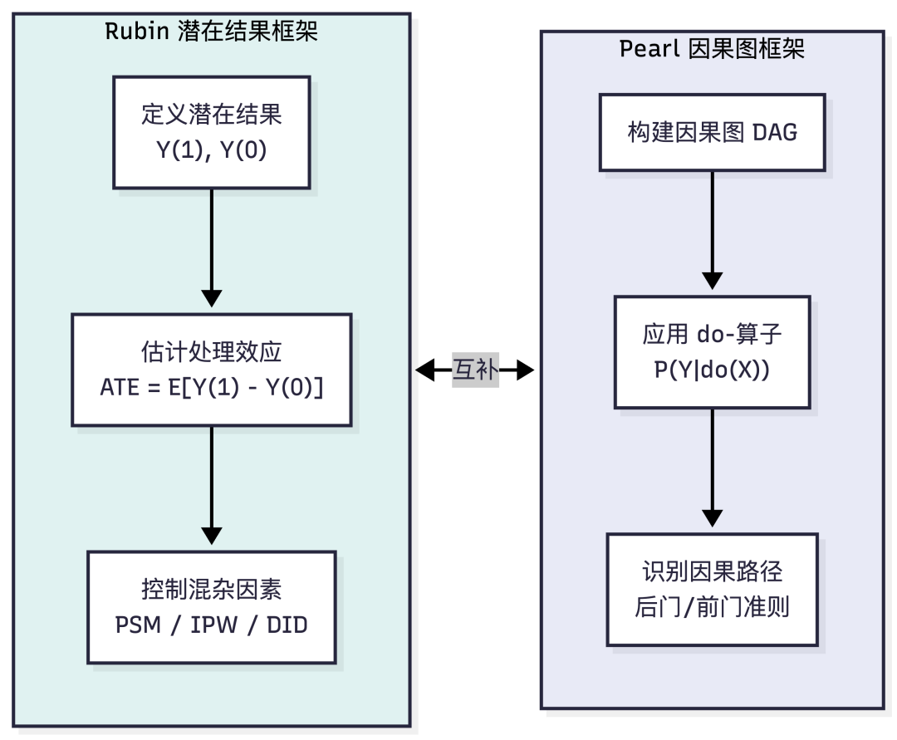

说明：展示两大因果推断框架的核心流程和互补关系，Rubin侧重效应估计，Pearl侧重机制识别。

两大框架的目标一致：计算存在混淆变量时干预对结果的影响。但侧重点不同：Rubin 框架侧重因果效应的估计和统计推断，Pearl 框架更偏向因果关系的识别和机制理解。在实际应用中，二者常结合使用（如 DoWhy 同时整合了两种框架）。

### 4.2 主流归因方法详解 ###

### （1）Shapley Value 归因 ###

基于合作博弈论，计算每个参与者在所有可能联盟中的边际贡献均值。在营销归因中，将每个渠道视为"参与者"，转化视为"总收益"，通过 Shapley 值公平分配各渠道的贡献。

优点：理论保证完备（满足效率性、对称性等公理），能捕捉特征间的交互效应；  

缺点：计算复杂度随特征数指数增长，需采用近似算法（如 Kernel SHAP、Tree SHAP）。

### （2）Markov Chain 归因 ###

将用户转化路径建模为马尔可夫链，通过计算移除某渠道后转化概率的变化来衡量其贡献。突出接触点的先后顺序，适合分析多触点用户旅程。

优点：天然考虑时序依赖，能识别关键转化节点；  

缺点：计算成本高，需大量随机路径模拟。

### （3）Uplift Modeling ###

关注干预带来的增量效应，将用户分为四类：Persuadables（被说服者）、Sure Things（必然转化者）、Lost Causes（无望者）、Sleeping Dogs（反感者）。核心目标是精准定位 Persuadables 群体。

优点：直接优化干预 ROI，避免资源浪费；  

缺点：需要随机实验数据或强假设支撑。

### （4）因果推断方法 ###

* 倾向得分匹配（PSM）：通过匹配处理组和对照组的倾向得分，模拟随机实验；

* 双重差分（DID）：利用面板数据消除固定效应，要求平行趋势假设；

* 工具变量（IV）：引入外生变量解决内生性问题，要求相关性和排他性约束；

* 双重机器学习（DML）：结合机器学习灵活性与计量经济学严谨性，适合高维数据。

### 4.3 方法选择决策框架 说明：根据数据可获得性、维度、时序信息等条件，指导选择合适的归因方法 ###

05

AI 评测中的归因分析实战

>
>
> 说明：以下案例中的数据均为示例性数据，用于演示归因分析方法的应用流程。实际应用中需根据具体业务场景收集真实数据。
>
>

### 5.1 为什么 AI 评测需要归因分析？

传统 LLM 评测聚焦于任务完成率和输出质量等，但面对复杂的 Agent 系统时，这种黑盒评估无法回答关键问题：

* 工具调用失败：是模型选错了工具，还是参数传递错误？

* 规划失误：是任务分解不合理，还是执行顺序错误？

* 推理缺陷：是知识缺失，还是逻辑链条断裂？

组件级归因评估将 Agent 拆解为独立模块，分别评估工具选择准确率、规划合理性、推理链质量等，从而精准定位瓶颈。

### 5.2 三种数据形态下的归因策略矩阵 ###

根据数据可获得性，归因分析可分为三种路径：

|   数据形态   |            适用场景             |             核心方法              |                 关键工具                  |精度等级 |
|----------|-----------------------------|-------------------------------|---------------------------------------|-----|
|Full Trace|有完整执行轨迹日志（LangSmith/DeepEval）|      组件级指标分解 + SHAP 值计算       |   DeepEval `@observe`、LangSmith SDK   |⭐⭐⭐⭐⭐|
| I/O Only |        只有输入输出对，无中间过程        |扰动式归因（Prompt/Tool Perturbation）|Prompt-Perturbation-Simulator、ToolMaze | ⭐⭐⭐ |
| A/B Test |           可设计对照实验           |      因果推断（反事实推理、双重稳健估计）       |DoWhy、EconML、Neural Orthogonal Learning|⭐⭐⭐⭐ |

### 5.3 Agent 评测的分层归因框架 ###

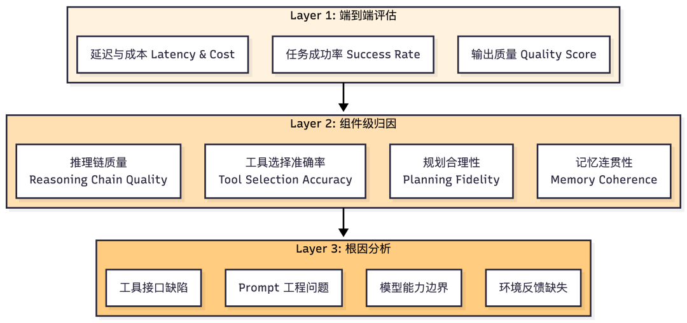

说明：展示从端到端评估→组件级归因→根因分析的三层诊断体系，

逐层深入定位问题根源。

### 5.4 Trace 日志归因实操（高精度方案） ###

#### 方法论框架 ####

当拥有完整的 Agent 执行轨迹（Trace）时，归因分析的核心思路是将端到端的失败拆解为各组件的贡献度。这种方法类似于软件工程的「分布式追踪」，但针对的是 AI Agent 的思维链和工具调用链。

核心指标体系设计：

|组件维度|             关键指标             |    业务含义     |                计算方法                |
|----|------------------------------|-------------|------------------------------------|
|工具选择|   Tool Selection Accuracy    |  模型是否选对了工具  |         对比实际调用工具与预期工具的匹配度          |
|参数构造|Parameter Construction Quality|传递给工具的参数是否正确 |       检查参数字段完整性、格式合规性、语义合理性        |
|规划能力|     Plan Adherence Score     |多步任务是否按合理顺序执行|          评估步骤间的逻辑连贯性和依赖关系          |
|生成质量|       Answer Relevancy       | 最终回答是否准确相关  |      使用 LLM-as-Judge 或人工标注评分       |
|资源效率|       Token Efficiency       |  成本与性能的平衡   |Completion Tokens / Prompt Tokens 比率|

#### 操作步骤详解 ####

Step 1：定义组件级评估标准

在打点之前，必须明确每个组件的「成功」定义。例如：

* 工具选择成功：不仅要求调用的工具在可用列表中，还要求它是完成当前子任务的最优选择（可通过历史成功率或专家规则定义）；

* 参数构造成功：参数字段无缺失、数据类型正确、且语义上与用户意图匹配（如查询“北京天气”时 location 字段应为“北京”而非“Beijing”）。

Step 2：实施分层打点策略

不要试图一次性监控所有指标，建议分阶段推进：

## 1. 第一阶段：只监控工具调用序列和最终结果，建立基线

## 2. 第二阶段：增加参数质量检查和规划合理性评估

## 3. 第三阶段：引入 SHAP 值计算，量化各组件对最终得分的贡献权重

Step 3：构建根因诊断矩阵

将历史 Trace 汇总为特征表，每一行代表一次执行，列包括各组件指标和最终得分；通过相关性分析或回归模型，识别哪些组件与失败强相关。

#### 典型案例解析 ####

案例 1：工具描述模糊导致选错

场景：用户询问“帮我查一下杭州明天的气温并推荐穿衣建议”。Agent 错误调用了 `general_search` 工具而非 `weather_api`，导致返回了杂乱的网页摘要而非结构化天气数据。

Trace 分析：

* 工具选择准确率：0（选错工具）；

* 参数构造质量：N/A（未进入参数构造阶段）；

* 规划合理性：0.3（未能识别出需要两步：先查天气再给建议）；

* 最终得分：0.2（回答不可用）。

归因结论： 通过对比 50 次类似Query的 Trace，发现当用户同时提到「地点+时间+衍生需求」时，工具选择错误率高达 60%。进一步分析工具描述发现，`weather_api` 的描述中未明确提及支持“穿衣建议”场景，导致模型犹豫后选择了更通用的搜索工具。

优化建议：在 `weather_api` 的工具描述中增加示例：“适用于查询天气信息及基于天气的衍生建议（如穿衣、出行）”。

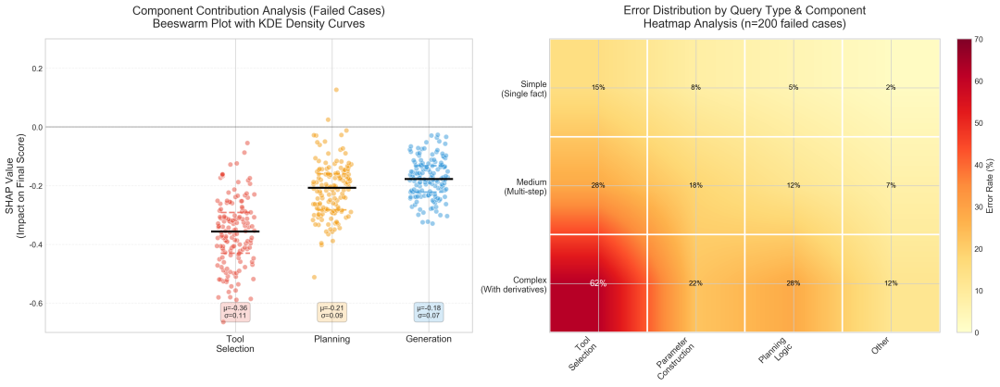

说明：展示50次类似Query中工具选择的分布情况，

以及工具描述清晰度与选择准确率的相关性。

案例 2：参数格式错误导致调用失败

场景：用户要求“把这份销售报表转换成 PDF”。Agent 正确选择了 `doc_to_pdf_converter` 工具，但传递的文件路径参数包含了特殊字符（如空格和中文），导致工具抛出“File Not Found”错误。

Trace 分析：

* 工具选择准确率：1（选对工具）；

* 参数构造质量：0（路径未做 URL 编码）；

* 规划合理性：1（单步任务，无需复杂规划）；

* 最终得分：0（完全失败）。

归因结论： 检查最近 100 次文件处理任务的 Trace，发现参数构造失败占所有失败的 45%，其中 70% 是因为路径包含特殊字符。这说明模型在构造参数时缺乏对文件系统规范的认知。

优化建议：在 System Prompt 中增加参数构造规范：“当传递文件路径时，必须对空格进行 %20 编码，对中文字符进行 UTF-8 编码”。或在工具层增加自动转义逻辑。

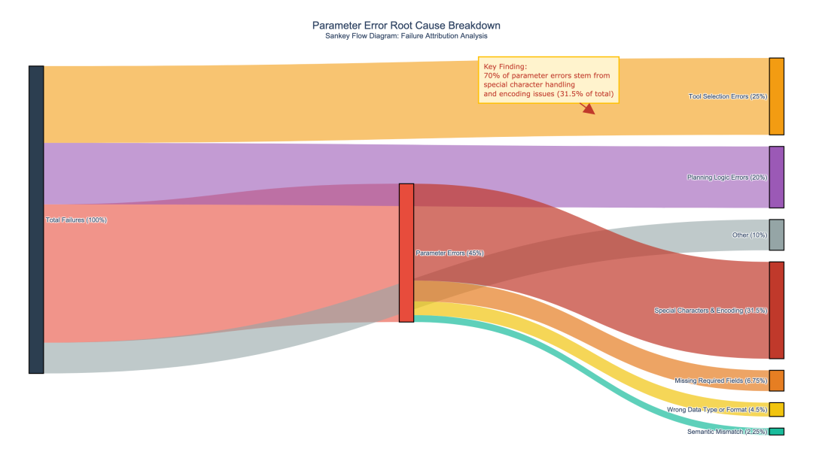

说明：展示100次文件处理任务中各类参数错误的分布，特别标注特殊字符导致的失败占比。

案例 3：规划步数过多导致超时

场景：用户要求“分析过去三个月的销售数据并给出下季度预测”。Agent 生成了一个包含 8 个步骤的详细计划（数据提取→清洗→聚合→可视化→趋势分析→季节性分解→模型训练→预测），但由于每步都调用 LLM，总耗时超过 120 秒触发超时。

Trace 分析：

* 工具选择准确率：1（所有工具选择正确）；

* 参数构造质量：1（参数无误）；

* 规划合理性：0.4（步骤过于细化，可合并）；

* 资源效率：0.2（Token 消耗过高）；

* 最终得分：0（超时未完成）。

归因结论： 对比成功完成的同类任务 Trace，发现平均规划步数为 3-4 步。当前 Agent 的规划模块倾向于过度分解任务，导致执行链过长。通过分析规划生成的 Prompt，发现缺少「步骤合并原则」的指导。

优化建议：在规划阶段的 Prompt 中增加约束：“优先合并可并行执行的步骤，总步数控制在 5 步以内。对于数据类任务，优先考虑使用支持多操作的工具（如 pandas\_agent）而非分步调用。”

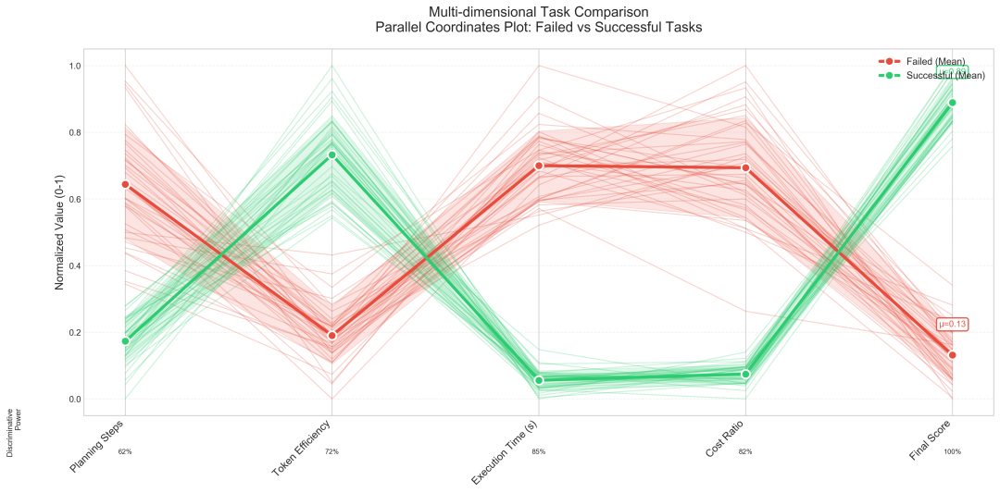

说明：对比成功与失败任务的规划步数分布，展示步数与耗时的正相关关系。

### 5.5 扰动式归因实操（无 Trace 场景） ###

#### 方法论框架 ####

当缺乏中间过程数据时，归因分析退化为黑盒实验：通过微调输入要素（Prompt、工具配置），观察输出变化的幅度，反向推断各要素的贡献度。这种方法类似于物理学中的「控制变量法」或化学中的「滴定实验」。

核心思想：如果移除某个要素后输出质量大幅下降，说明该要素是关键贡献者；如果移除后影响很小，说明该要素冗余或噪声。

#### 扰动策略设计原则 ####

|扰动类型 |               操作方式               |     适用场景     |        注意事项         |
|-----|----------------------------------|--------------|---------------------|
|指令扰动 |       替换提示词中的指令表述（保持语义不变）        |测试指令清晰度对输出的影响 |避免改变任务本质，如将"总结"改为"翻译"|
|示例扰动 |      随机删除、替换或重排 Few-shot 示例      |评估示例的质量和数量敏感性 |  保留至少 1 个示例以防完全失效   |
|上下文扰动|        移除部分检索到的文档片段或调整排序         |测试 RAG 检索质量的影响|    记录被移除文档的相关性分数    |
|格式扰动 |  改变输出格式要求（如从 JSON 改为 Markdown）   |  测试格式约束的必要性  |     确保解析器能适应新格式     |
|温度扰动 |调整 Temperature 参数（0.0 → 0.7 → 1.0）| 评估随机性对稳定性的影响 |  每次运行固定 seed 以便复现   |

#### 操作步骤详解 ####

Step 1：建立基线输出

使用原始配置运行 N 次（N ≥ 10），记录平均得分和标准差。这将成为后续扰动的参照基准。

Step 2：设计对照实验组

为每种扰动类型设计 3-5 个变体。例如：

* 指令扰动：变体 A（简化指令）、变体 B（详细指令）、变体 C（强调约束）；

* 示例扰动：变体 D（删除 50% 示例）、变体 E（替换为低质量示例）、变体 F（重排示例顺序）。

Step 3：批量运行与数据收集

对每个变体运行 M 次（M ≥ 20），记录：

* 输出与基线的文本相似度（使用 Embedding Cosine Similarity）；

* 任务完成度评分（人工或 LLM-as-Judge）；

* 响应时间和 Token 消耗。

Step 4：计算归因分数

贡献度 = (基线平均分 - 扰动后平均分) / 基线平均分 × 100%

正值表示该要素有正向贡献，负值表示移除后反而提升（说明原要素可能是噪声）。

#### 典型案例解析 ####

案例 1：Prompt 中缺少输出格式约束导致解析失败

场景：一个客服 Agent 需要从用户消息中提取订单号和问题类型。原始 Prompt 只说“请提取关键信息”，未指定输出格式。

扰动实验：

* 基线：无格式约束，100 次运行中只有 60% 的输出能被解析器正确提取；

* 变体 A：增加“请以 JSON 格式输出，包含 orderid 和 issuetype 字段”；

* 变体 B：增加“请用逗号分隔订单号和问题类型”；

* 变体 C：提供 Few-shot 示例展示期望的输出格式。

结果：

* 变体 A 的解析成功率提升至 95%；

* 变体 B 提升至 80%；

* 变体 C 提升至 92%。

归因结论：格式约束的贡献度为 (95% - 60%) / 60% = 58.3%，是所有 Prompt 要素中影响最大的。这说明对于结构化提取任务，明确的格式指令比示例更重要。

优化建议：在所有涉及信息提取的 Prompt 模板中强制加入格式约束，优先使用 JSON Schema 而非自然语言描述。

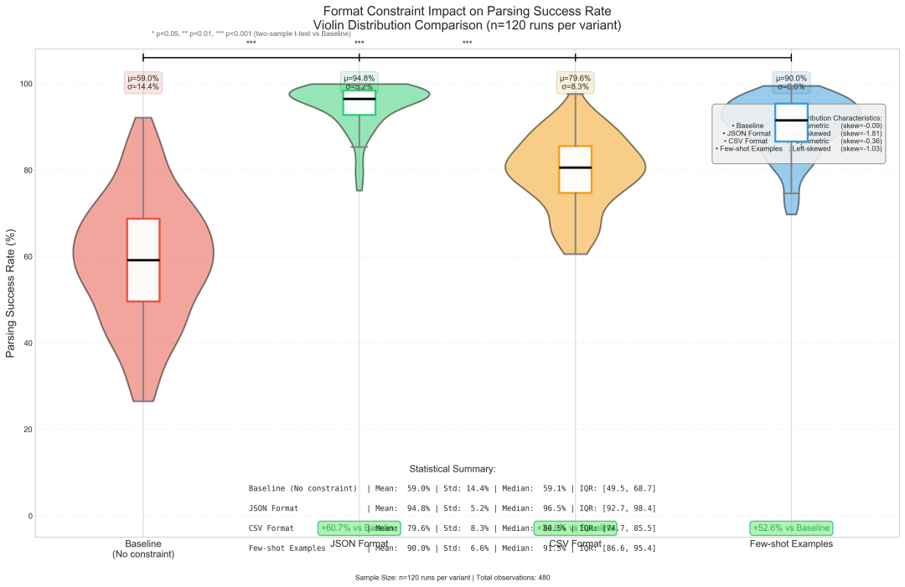

说明：展示不同格式约束变体的解析成功率对比，突出JSON格式约束的显著优势。

案例 2：RAG 检索到的文档噪声太大干扰生成

场景：一个法律问答 Agent 使用 RAG 检索相关法条。用户询问“劳动合同解除的经济补偿如何计算”，系统检索到 10 篇文档，其中 3 篇高度相关，7 篇是噪声（如社保政策、税务规定）。

扰动实验：

* 基线：使用全部 10 篇文档作为上下文；

* 变体 A：只保留相关性分数 \> 0.8 的文档（剩 3 篇）；

* 变体 B：随机删除 50% 的文档（剩 5 篇）；

* 变体 C：将所有文档按相关性降序排列后只取前 5 篇。

结果（由律师专家评分，满分 10 分）：

* 基线平均分：6.2（回答冗长且包含无关信息）；

* 变体 A 平均分：8.5（精准引用相关法条）；

* 变体 B 平均分：7.1（有时删掉了关键文档）；

* 变体 C 平均分：8.0（平衡了准确性和完整性）。

归因结论：高质量文档筛选的贡献度为 (8.5 - 6.2) / 6.2 = 37.1%。这说明 RAG 系统的检索质量直接影响生成效果，简单的 Top-K 策略不如基于相关性阈值的动态筛选。

优化建议：在 RAG 检索后增加一步“相关性过滤”，只保留分数 \> 0.75 的文档。同时调整检索模型的召回策略，减少低相关性文档的混入。

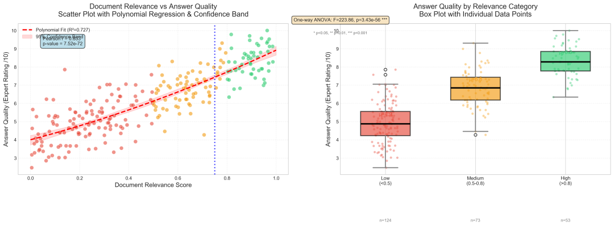

说明：展示不同文档筛选策略下的专家评分对比，以及相关性与回答质量的正相关关系。

案例 3：Few-shot 示例的顺序影响推理链质量

场景：一个数学解题 Agent 使用 Chain-of-Thought (CoT) Prompt，提供了 3 个示例展示解题思路。

扰动实验：

* 基线：示例按难度递增排列（简单→中等→困难）；

* 变体 A：示例按难度递减排列（困难→中等→简单）；

* 变体 B：示例随机排列；

* 变体 C：只保留最困难的 1 个示例。

结果（在 50 道测试题上的准确率）：

* 基线准确率：78%；

* 变体 A 准确率：72%；

* 变体 B 准确率：65%；

* 变体 C 准确率：70%。

归因结论：示例顺序的贡献度为 (78% - 65%) / 78% = 16.7%。虽然影响不如格式约束那么大，但说明“由浅入深”的示例排列能帮助模型更好地学习推理模式。随机排列会显著降低效果，可能是因为模型难以捕捉规律。

优化建议：在设计 CoT Prompt 时，严格按照难度递增或逻辑递进的顺序排列示例。避免随机化或逆向排列。

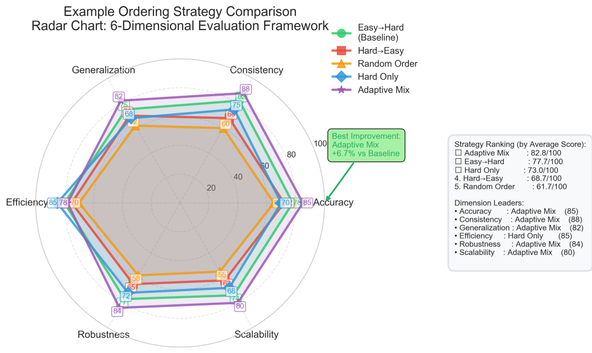

说明：展示不同Few-shot示例排列策略对推理链质量的影响对比。

### 5.6 因果推断 A/B 测试实操 ###

#### 方法论框架 ####

传统 A/B 测试只能看到相关性（“新版 Prompt 的得分更高”），但无法排除混杂因素（“可能是新版测试的用户本身经验更丰富"或"新版测试时服务器负载更低”）。因果推断通过控制混杂变量，估计干预的净效应。

核心概念：

* 处理变量（Treatment）：你主动改变的因子（如 Prompt 版本、模型选择、Temperature）；

* 结果变量（Outcome）：

  你关心的指标（如任务成功率、用户满意度、响应时间）；

* 混杂变量（Confounders）：同时影响处理和结果的第三方变量（如Query复杂度、用户领域知识、时间段）；

* 平均处理效应（ATE）：剥离混杂因素后，处理变量对结果的纯净影响。

#### 操作步骤详解 ####

Step 1：绘制因果图（DAG）

在实验设计前，先用有向无环图梳理变量关系。例如：

* Query复杂度 → Prompt 版本（因为复杂Query可能分配给新版）；

* Query复杂度 → 任务得分（复杂Query天然更难）；

* 用户经验 → 任务得分（经验丰富的用户提问更清晰）；

* 时间段 → 服务器负载 → 响应时间。

通过 DAG 识别出需要控制的混杂变量（这里是Query复杂度和用户经验）。

Step 2：设计随机对照实验

为确保两组分布一致，采用以下策略：

* 完全随机化：将同一批Query随机分配给 V1 和 V2 Prompt，确保Query复杂度分布相同；

* 分层随机化：按Query复杂度分为高/中/低三层，每层内随机分配，确保各层样本均衡；

* 配对设计：对每个Query，分别用 V1 和 V2 运行，直接对比得分差异（消除Query本身的影响）。

Step 3：选择估计方法

根据数据特点选择合适的方法：

* 简单 t-test：仅当确认无混杂变量时使用（如完全随机化且样本量足够大）；

* 倾向得分匹配（PSM）：当无法完全随机化时，通过匹配相似样本来模拟随机实验；

* 双重稳健估计（Doubly Robust）：结合回归模型和 PSM，即使其中一个模型有误仍能保持一致性；

* 神经正交学习（NOL）：当混杂变量维度很高（\>10 个）时使用，通过深度学习自动提取特征。

Step 4：敏感性分析

检验结论对未观测混杂变量的鲁棒性。如果加入一个假设的未观测混杂变量后，处理效应仍然显著，说明结论可靠。

#### 典型案例解析 ####

案例 1：发现新版 Prompt 在简单Query上表现更好但在复杂Query上更差

场景：团队开发了新版 Prompt（V2），声称能提升 Agent 表现。初步 A/B 测试显示 V2 的平均得分比 V1 高 5%，但上线后用户反馈两极分化。

因果分析问题：初步测试未控制Query复杂度，可能导致 Simpson's Paradox（辛普森悖论）。

重新设计实验：

* 将Query按复杂度分为三类：简单（单步事实Query）、中等（多步推理）、困难（需要工具调用和规划）；

* 在每类内部分别计算 V1 和 V2 的得分差异。

结果：

* 简单Query：V2 得分 8.5 vs V1 得分 7.8（+8.9%）；

* 中等Query：V2 得分 7.2 vs V1 得分 7.5（-4.0%）；

* 困难Query：V2 得分 5.8 vs V1 得分 6.5（-10.8%）。

归因结论： V2 Prompt 通过简化指令提升了简单Query的效果，但牺牲了对复杂任务的处理能力（可能是因为删减了规划指导）。整体平均提升 5% 是因为测试集中简单Query占比 70%，掩盖了在复杂查询上的退化。

优化建议：采用动态 Prompt 策略：对简单Query使用 V2，对复杂Query保留 V1 或开发专门的 V2-complex 版本。

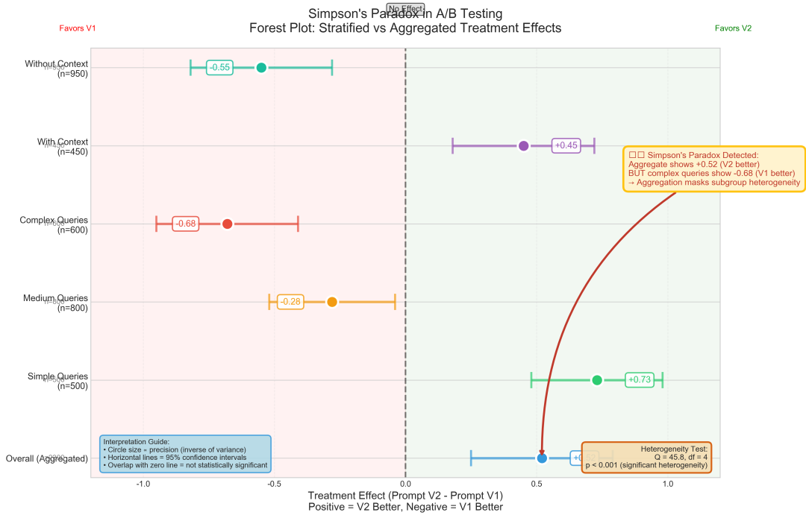

说明：展示不同Query复杂度分层下的Prompt版本效果对比，揭示辛普森悖论现象。

案例 2：通过 PSM 匹配后发现 Temperature 调整的真实效应

场景：团队想验证“降低 Temperature 从 0.7 到 0.3 是否能提升回答一致性”。但历史数据中，低 Temperature 主要用在客服场景（Query较简单），高 Temperature 用在创意写作场景（Query较复杂），直接比较有偏差。

因果分析设计：

* 构建因果图：Temperature → 回答一致性；Query类型 → Temperature（客服场景倾向用低 Temp）；Query类型 → 回答一致性（创意任务天然变化大）；

* 使用倾向得分匹配：为每个低 Temp 样本找到一个Query类型相似的高 Temp 样本。

匹配后结果：

* 未匹配的原始差异：低 Temp 一致性得分 0.85 vs 高 Temp 0.72（看似提升 18%）；

* PSM 匹配后差异：低 Temp 0.82 vs 高 Temp 0.78（真实提升仅 5%）。

归因结论： 原始观察到的 18% 提升中，13% 是由于查询类型不同导致的混杂效应，Temperature 本身的净效应只有 5%。这说明降低 Temperature 确实能提升一致性，但效果远小于表面观察。

优化建议：不要盲目降低 Temperature，需权衡一致性与创造性。对于客服等标准化场景可使用 0.3，对于创意任务保持 0.7。

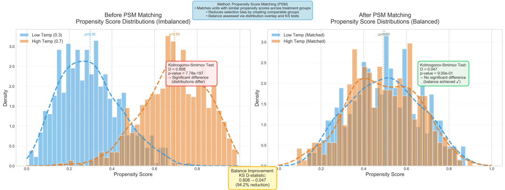

说明：展示倾向得分匹配前后的协变量分布对比，验证匹配质量。

案例 3：使用 NOL 评估多参数联合优化的效果

场景：团队同时调整了 5 个参数：Prompt 版本、Temperature、Top-p、最大 Token 数、重试次数。传统回归无法处理如此高维的交互效应。

因果分析设计：

* 收集 1000 次实验数据，记录 5 个参数值和最终得分；

* 使用 EconML 的 LinearDML 模型，将 5 个参数作为 Treatment，Query特征作为 Confounders。

结果：

* Prompt 版本的 ATE：+0.12（显著提升）

* Temperature 的 ATE：-0.03（轻微负向，但不显著）

* Top-p 的 ATE：+0.01（几乎无影响）

* 最大 Token 数的 ATE：+0.08（中等提升，但边际递减）

* 重试次数的 ATE：+0.15（显著提升，但成本增加 3 倍）

交互效应发现：

* Prompt V2 + 低 Temperature 的组合效应为 +0.18，高于单独效应之和（0.12 - 0.03 = 0.09），说明二者有协同作用；

* 重试次数 \> 2 后，额外收益急剧下降（从 +0.15 降至 +0.02）。

归因结论：最优策略是采用 Prompt V2 + Temperature 0.3 + 重试 2 次，预计综合提升 0.18 + 0.08 + 0.15 = 0.41 分，同时控制成本。

优化建议：放弃单独优化单个参数的思路，转向参数组合的联合优化。建立参数配置的 Pareto 前沿，平衡效果与成本。

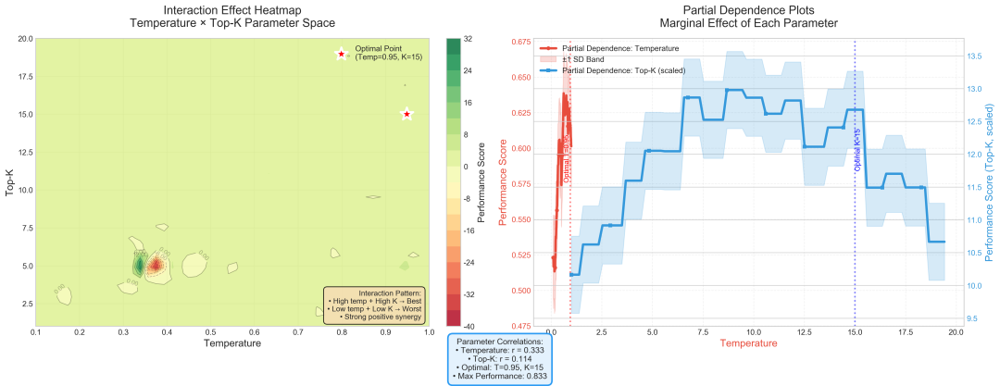

说明：展示多参数联合优化的交互效应和Pareto前沿分析结果。

### 5.7 综合归因工作流可视化 ###

#### Trace 归因 Pipeline ####

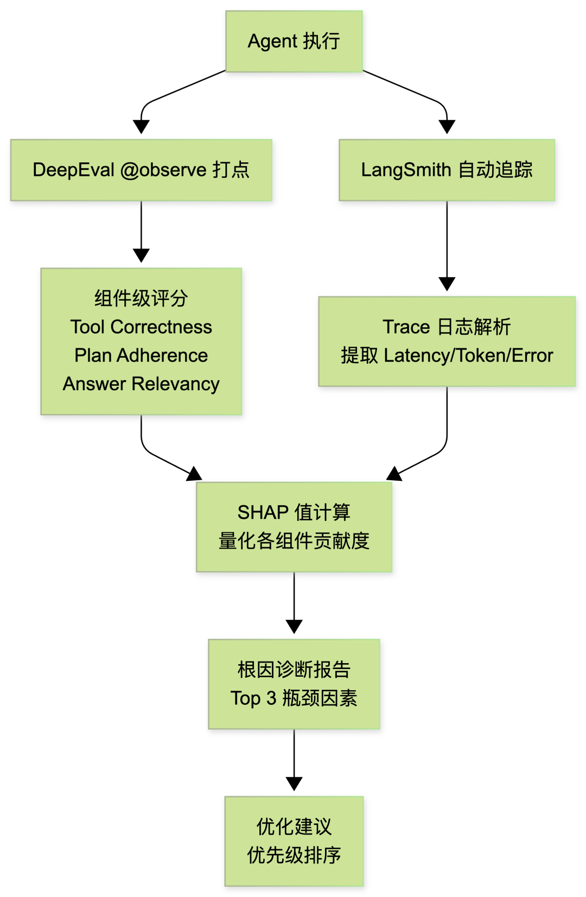

#### 扰动式归因工作流 ####

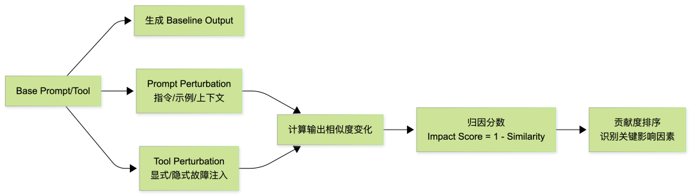

#### 因果 A/B 测试设计 ####

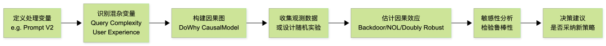

06

挑战与未来方向

### 6.1 方法的适用边界与局限性 ###

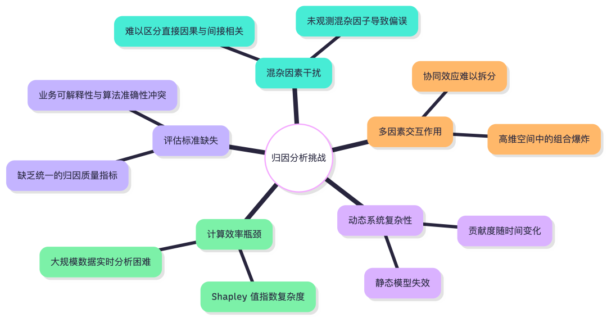

说明：展示因果推断在AI评测归因分析中面临的主要挑战和瓶颈。

归因分析不是万能的。在实践中，我们需要清楚它的能力边界：

Trace 日志归因的局限：

* 依赖埋点的完整度。如果某个组件没有被监控到，归因结果会出现盲区；

* 组件间强耦合时，独立归因可能高估或低估某个模块的贡献（例如“工具选择”高度依赖“规划”，两者难以完全拆分）；

* 需要一定的数据量积累（建议至少 100+ 次执行），否则统计意义不足。

扰动式归因的局限：

* 成本高：每个扰动变体需要运行 20+ 次才能得到稳定结果，N 个变体意味着 20N 次 API 调用；

* 扰动设计本身有主观性：选择扰动什么、扰动多大幅度，直接影响结论；

* 无法捕捉组件间的交互效应（A 和 B 单独扰动都没影响，但同时扰动才暴露问题）。

因果推断 A/B 测试的局限：

* PSM 对样本量要求高（通常需要 500+ 样本才能找到足够多的匹配对）；

* 因果图构建依赖领域知识，错误的因果假设会导致错误的估计；

* 高维场景下，DML 等方法虽然理论优美，但调参和收敛需要经验。

### 6.2 什么时候不该用归因分析 ###

以下场景直接做 Bad Case 分析可能比归因分析更高效：

* 数据量小于 50 条：统计意义不足，归因结果波动大，不如直接逐条看；

* 系统处于快速迭代期：每天都在改 Prompt 和工具配置，数据还没积累够就已过期；

* 问题原因已经明确：如果 debug 就能定位（比如某个工具 API 挂了），不需要“科学归因”；

* 单组件系统：Agent 只有一个模型 + 一个 Prompt，没有可拆解的组件维度。

归因分析的价值在于多组件、高复杂度、需要规模化诊断的场景。简单问题用简单方法解决即可。

### 6.3 当前面临的核心挑战 ###

在实际落地中，我们遇到的主要困难集中在以下几个方面：

|        挑战        |        具体表现         |                       我们的应对                       |
|------------------|---------------------|---------------------------------------------------|
|    混杂变量识别不完整     |   总有未观测到的因素在影响结果    |            通过敏感性分析评估结论的鲁棒性，而非追求"完美控制"             |
|    组件贡献度随时间漂移    |上周的瓶颈是 Prompt，这周变成了检索|          建立周期性归因机制（如每周跑一次 SHAP），而非一次性分析           |
|计算成本与精度的 trade-off| Shapley 值精确计算是指数复杂度 |    使用 Tree SHAP 等近似算法，接受 5% 以内的误差换取 100x 的速度提升    |
|    归因结果的可解释性     |   SHAP 值对非技术人员不直观   |将数值结论转化为自然语言："工具选择错误是当前系统失败的首要原因，贡献了约 40% 的失败 case"|

### 6.4 实践经验与避坑指南 ###

起步阶段：

1. 从单一组件开始归因：不要一上来就搭建全流程归因系统。先选一个明确有问题的组件（比如工具选择），验证方法可行性后再扩展；

2. 基线数据先行：在做任何优化之前，先跑 100+ 次收集基线数据。没有基线就没有对比，归因结论无从建立；

3. 接受「够用就好」：归因分析的目标是「找到主要瓶颈」，而非精确量化每个组件到小数点后两位。80% 的确信度足以指导优化方向。

进阶阶段：

1. 建立归因-优化-验证闭环：归因只是起点。找到瓶颈后需要优化，优化后需要重新归因验证效果。避免「归因了但没人动」；

2. 警惕单一指标误导：不要只看最终得分。一个「成功」的 case 可能工具选择错了但模型通过推理弥补了，这种情况下，归因应该标记工具选择仍然是风险点；

3. 跨组件联动分析：当单组件归因解释力不足时（如所有组件单独看都「还行」但系统就是失败），尝试分析组件间的交互效应。

常见陷阱速查表：

|     陷阱      |         症状         |                           解决方案                            |
|-------------|--------------------|-----------------------------------------------------------|
|  过度依赖单一指标   |   只看最终得分，忽略组件分解    |同时监控 Tool Correctness + Plan Adherence + Generation Quality|
|    数据噪声大    |   同一配置多次运行结果差异大    |               增加运行次数（≥30），使用均值 + 置信区间而非单次结果               |
|   扰动幅度过大    |     扰动改变了任务本质      |                 控制扰动为"同义替换"级别，而非"改变任务定义"                  |
|   忽略混杂变量    |A/B 测试中两组 Query 分布不均|            使用 PSM 或分层分析校正；至少检查 Query 复杂度分布是否一致            |
|归因结论没有 action|  SHAP 值算了但不知道怎么改   |                  每条归因结论必须附带至少一个可执行的优化建议                   |

### 6.5 未来探索方向 ###

* 动态归因：当前归因是「事后分析」，未来希望实现实时归因，即每次 Agent 执行完毕即输出瓶颈诊断；

* 因果发现自动化：目前因果图（DAG）需要人工构建。探索用因果发现算法（如 PC/GES）从历史数据中自动学习组件间的因果关系；

* 归因驱动的自动优化：将归因结论直接转化为 Prompt 修改建议或工具描述改写建议，形成自动化的「诊断→优化」闭环。

07

术语表

|      术语       |              英文              |                  解释                  |
|---------------|------------------------------|--------------------------------------|
|    平均处理效应     |ATE (Average Treatment Effect)|            干预对整体人群的平均因果效应            |
|   条件平均处理效应    |    CATE (Conditional ATE)    |          在给定协变量条件下的异质性处理效应           |
|     倾向得分      |       Propensity Score       |          个体接受干预的概率，用于匹配或加权           |
|     后门准则      |     Back-door Criterion      |         Pearl 框架中识别因果效应的图论条件         |
|     do-算子     |         do-operator          |          表示主动干预而非被动观察的数学符号           |
|    双重机器学习     |DML (Double Machine Learning) |         通过正交化消除正则化偏误的因果估计方法          |
| Meta-Learner  |         Meta-Learner         |通过组合多个机器学习模型估计因果效应的框架（S/T/X/R Learner）|
|   Shapley 值   |        Shapley Value         |        博弈论中公平分配合作收益的方法，用于特征归因        |
|    马尔可夫链归因    |   Markov Chain Attribution   |          基于状态转移概率计算渠道贡献度的方法          |
|Uplift Modeling|       Uplift Modeling        |          预测干预带来的增量效应，用于营销增效          |

References

[01] Causal Inference in Data Science: A Framework for Attribution Systems

<https://eajournals.org/ejcsit/vol13-issue36-2025/causal-inference-in-data-science-a-framework-for-attribution-systems/>

[02] PyCausalSim: 基于模拟的因果发现的 Python 框架

<https://zhuanlan.zhihu.com/p/1982899450155382532>

[03] 因果推断框架 DoWhy 入门

<https://zhuanlan.zhihu.com/p/321808640>

[04] 如何用 EconML 与 DoWhy 构建端到端因果推断流水线

<https://blog.csdn.net/gitblog\_01124/article/details/143557311>

[05] Shapley value: from cooperative game to explainable artificial intelligence

<https://link.springer.com/article/10.1007/s43684-023-00060-8>

[06] Advanced Machine Learning Models for Attribution Modeling

<https://madgicx.com/blog/advanced-machine-learning-models-for-attribution-modeling>

[07] Evaluation and Benchmarking of LLM Agents: A Survey

<https://arxiv.org/html/2507.21504v1>

[08] LLM Agent Evaluation Metrics in 2026

<https://www.confident-ai.com/blog/llm-agent-evaluation-complete-guide>

[09] 实测 28 款大模型：CaLM 评测体系揭示 AI 因果推理能力的真实水平

<https://blog.csdn.net/weixin\_30832143/article/details/159295398>

[10] CounterBench: Evaluating and Improving Counterfactual Reasoning

<https://arxiv.org/abs/2502.11008>

[11] LLM attribution analysis across different fine-tuning strategies

<https://arxiv.org/abs/2604.15589>

[12] 归因分析（Attribution Analysis）详解

<https://blog.csdn.net/m0\_73161433/article/details/156768404>

[13] Prompt Perturbation for Reliable LLM Evaluation

<https://arxiv.org/abs/2606.17634>

[14] ToolMaze: Dynamic Path Discovery in TIR Agents

<https://github.com/Zhudongsheng75/ToolMaze>

欢迎留言一起参与讨论\~
