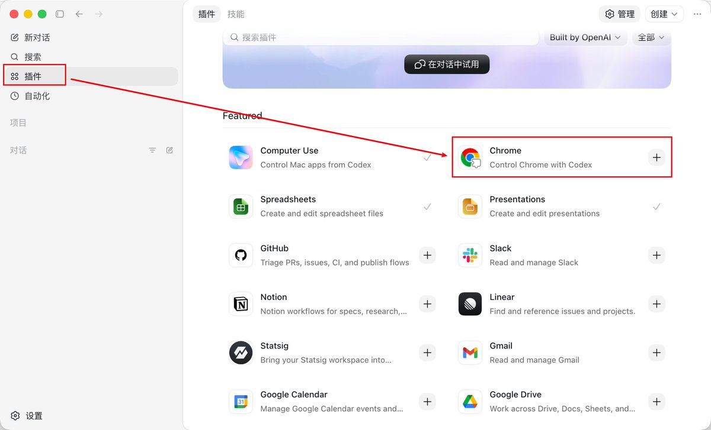
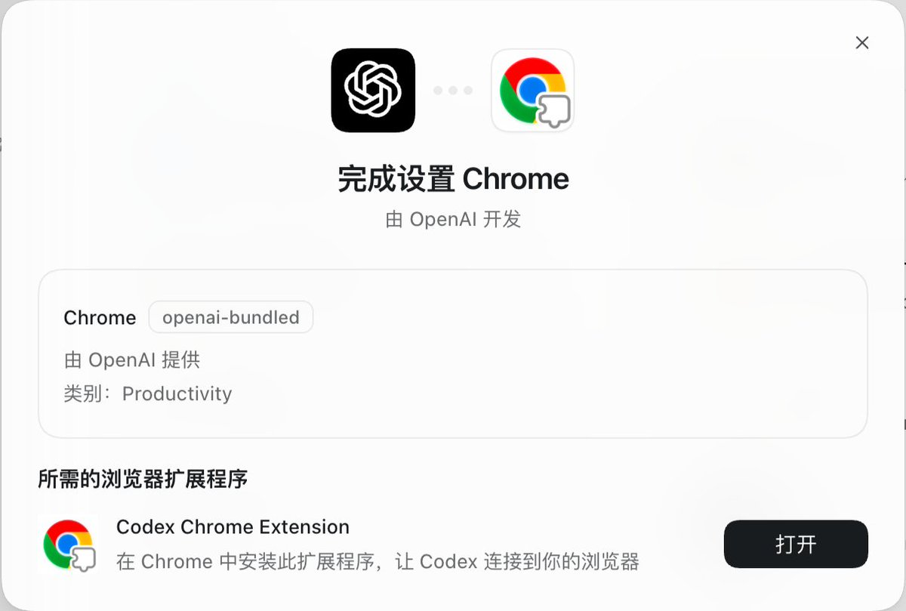
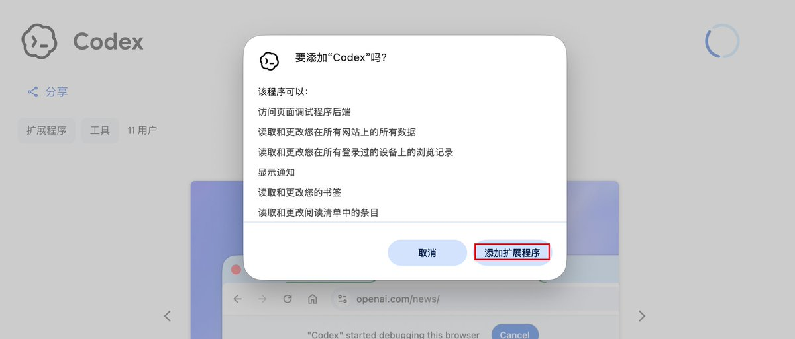
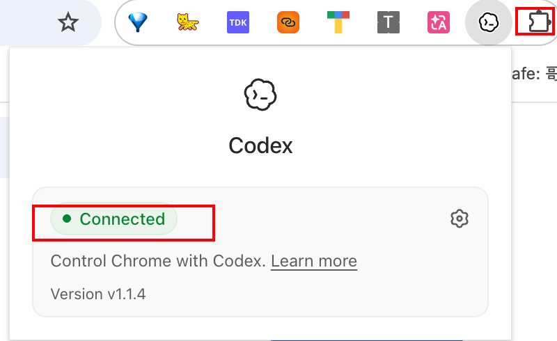
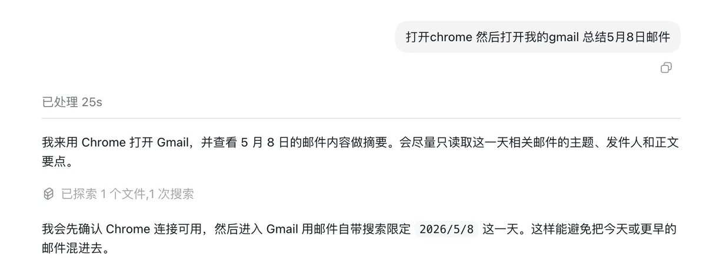
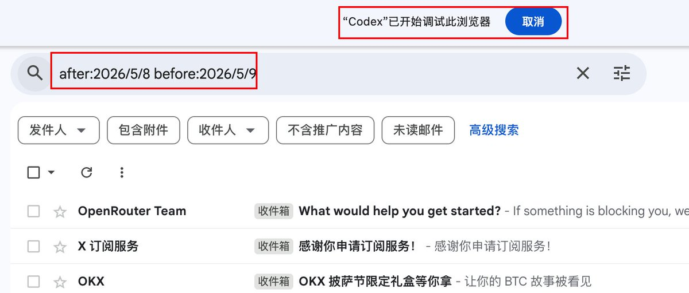
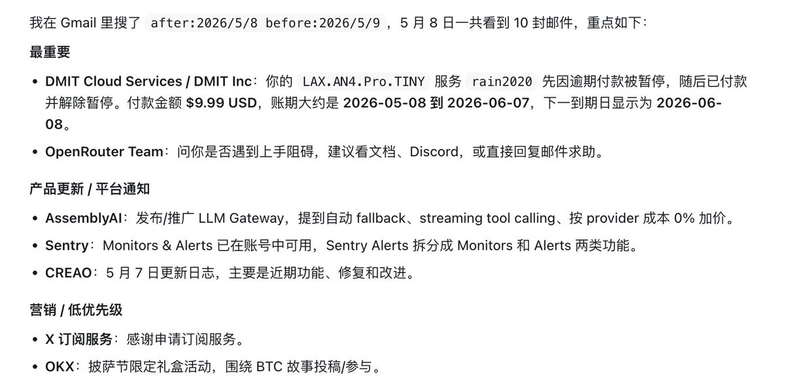
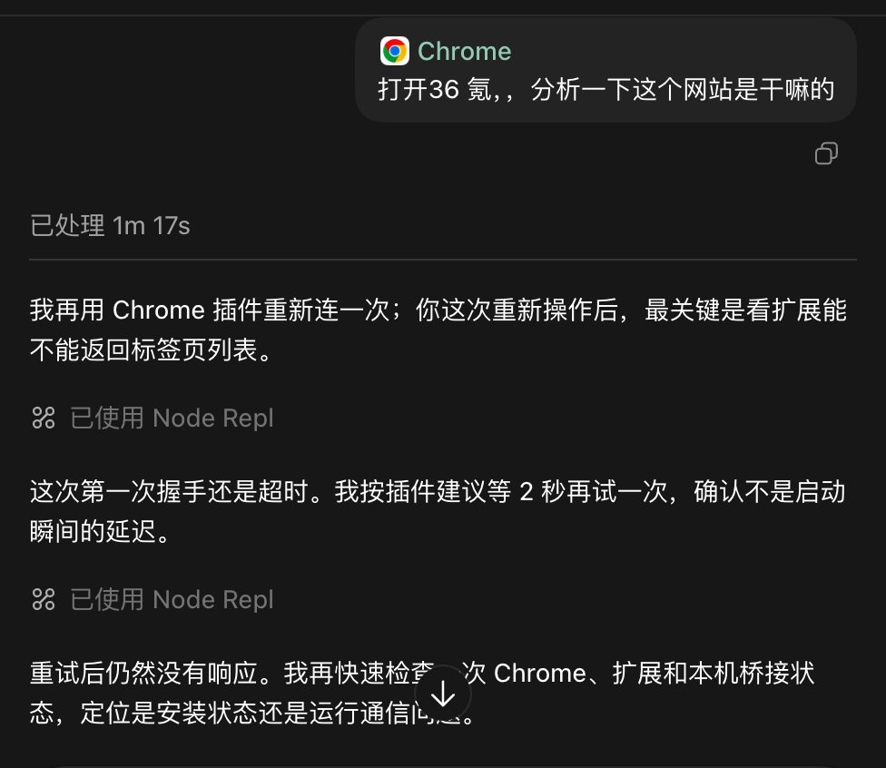

# 📰 Codex X Chrome插件配置使用保姆级教程

OpenAI 给 Codex 推出了 Chrome 扩展，让它能直接在浏览器里工作。这篇文章是从安装到使用的详细教程，文章末尾也有全部文档。

一、安装

打开Codex应用，左侧栏。直接在Codex的插件中找到Chrome，然后按照下图所示安装即可

二、使用

这一步必须要确认，Codex在浏览器的插件处于连接正常状态

在输入框里直接使用以下方式调用：

- 推荐：输入 @Chrome + 你的任务描述
示例：@Chrome 帮我登录 Salesforce，根据这些笔记更新客户记录

- 或者输入 /Chrome 选择插件后，直接描述任务。

- 也可以不加前缀，直接描述浏览器相关任务，Codex 会自动建议使用 Chrome 插件。

Codex 会：

- 在后台打开专用标签组（你当前页面不受影响）。

- 抓取页面内容、填写表单、点击操作、多标签并行验证等。

- 遇到敏感操作（如提交表单、下载文件、访问个人信息）会暂停并询问你确认。

- 任务完成后会保留有用页面给你审查，并自动整理标签。

示例直接看图：

可以看到，成功打开了我的浏览器，最后看结果：

注意：
如果后续文件上传/下载失败，进入 chrome://extensions/ → 找到 Codex → 点击“详细信息” → 打开 允许访问文件网址 权限。
目前只支持 Chrome（不支持 Edge 等其他 Chromium 内核浏览器）。

文档：
https://developers.openai.com/codex/app/chrome-exten

视频：
https://x.com/OpenAI/status/2052480800004956323?s=20

### 🖼️ Attached Media

## 💬 Replies

### 1 @lbkill1 (lbkill)

*Sat May 09 04:02:38 +0000 2026*

@Pluvio9yte 我在codex里面搜不到chrome插件，已经更新到最新版了

### 2 @Pluvio9yte (雪踏乌云) (Author)

*Sat May 09 04:03:38 +0000 2026*

@lbkill1 那就直接谷歌搜

### 3 @CaptainXTop (CaptainX)

*Sat May 09 05:57:35 +0000 2026*

@Pluvio9yte 我的显示连上了，但是接管不了，@列表也没有chrome

### 4 @yjyq_xcys (路致远)

*Sun May 10 13:44:30 +0000 2026*

@Pluvio9yte [developers.openai.com/codex/app/chro…](https://developers.openai.com/codex/app/chrome-extension)

文章末尾文档那边的链接后缀有漏

### 5 @bolt35328 (bolt)

*Sat May 09 05:30:29 +0000 2026*

@Pluvio9yte connect那一步不知道为啥显示的是discontent，目前没找到解决办法😢

### 6 @wngpng18543 (cypto A9)

*Sat May 09 07:16:56 +0000 2026*

@Pluvio9yte 有这个垃圾玩意就没成功过，不是超时就是没法连接，插件也是绿色小点连接状态，无语 

### 7 @yahaclass (YAHA學堂)

*Sat May 09 05:36:53 +0000 2026*

@Pluvio9yte 你这评论区 比你内容更精彩

### 8 @ailumaodems (志明爱ai)

*Sat May 09 03:13:32 +0000 2026*

@Pluvio9yte 评论区怎么这么多奇奇怪怪的回复

### 9 @ponyodong (波妞PONYO)

*Sat May 09 03:24:03 +0000 2026*

@Pluvio9yte 教程写得太及时了！特别是在“详细信息”里打开“允许访问文件网址”那一步，很多人装完没反应其实就是卡在这。Codex 这种在后台开独立标签组的逻辑确实比传统的网页爬虫要聪明得多，安全确认机制也给足了心理预期。

### 10 @KimCorey_PM (Corey Kim)

*Fri May 08 21:30:14 +0000 2026*

@Pluvio9yte api 以前能用插件的，现在是必须登录账号才可以使用插件对吗。

### 11 @KUMAD312 (KUMA-D)

*Sat May 09 17:37:56 +0000 2026*

@Pluvio9yte 你这玩意能做哪些gemini做不到的东西吗

### 12 @zuoluojx (发福佐罗)

*Sat May 09 13:57:43 +0000 2026*

@Pluvio9yte 用的中转站，就不能使用插件功能了？必须登录吗？但是账号没有订阅。。。

### 13 @8TDe5IGuBm2539 (Mai Xin)

*Sat May 09 15:27:26 +0000 2026*

@Pluvio9yte 港区谷歌商店下载不了chrome插件，请更换ip

### 14 @ke_lao20105 (Singing Bird)

*Sat May 09 16:05:54 +0000 2026*

@Pluvio9yte 会不会有信息泄漏的风险

