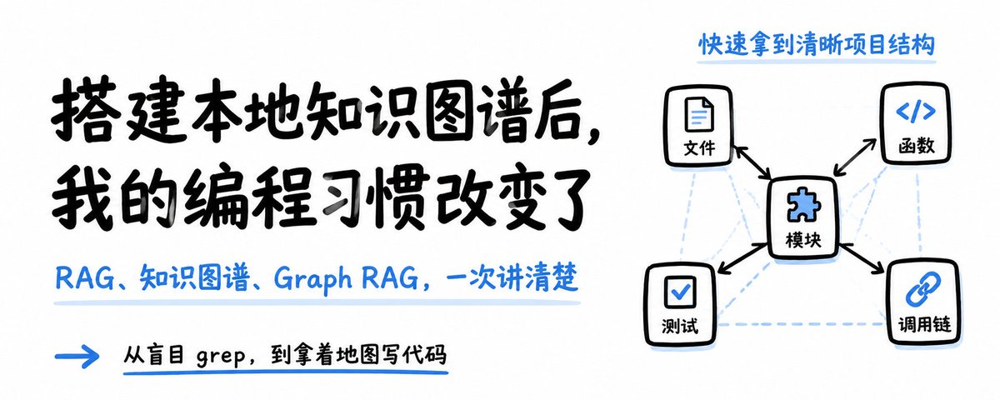

# 📰 Token省35%、工具调用暴降94%！本地知识图谱改变的5个编程习惯 

搭建本地知识图谱后，我的编程习惯改变了

事情要从几天前说起：

和一个开发朋友日常进行闲聊，他提了一嘴他公司最近在优化的一个项目：

整一套面向青少年的心理辅助 Agent 助手，用来做情绪疏导和危机干预。

「现在卡在知识库搭建这块，」他说，「你懂吧，我们打算搞个知识图谱，给AI来进行诊断」... 我本来以为RAG就是知识图谱，然后被他上了一课...

然后回去他建议我找了个开源SKILL，自己动手给我现在的项目搭了一套知识图谱。

说实话，真的感谢他给我科普了这一趟，在完整了解这俩概念，并且搭建完一次知识图谱后，我的编程习惯都感觉被重塑了（什么恶堕？）这个本地图谱的好用程度有点超乎我的预期了。

于是在今天，我决定把我这段经历写成文章，重点把这三件事说清楚：RAG 和知识图谱到底是什么

Graph RAG 又是什么、以及我自己实操下来，被本地知识图谱五个被彻底改变的编程习惯。

先搞清楚：RAG、知识图谱到底有什么区别

1.RAG 到底是什么

RAG全称是“检索增强生成”，其核心思想是把大模型自身参数里的“记忆”和外部检索到的“非参数记忆”结合起来，用检索结果辅助生成答案。

比如说，你去问AI问题：北京烤鸭属于什么菜系？

正常情况下，这个问题本身会作为上下文被塞给大模型，大模型根据自身训练参数里的记忆给出回答。

但是问题很明显，这大模型训练的时候没有学习相关信息，或者相关信息不是最新的，最正确的（例如被最新的“北京鸭腿事件”给盖过去了。），大模型回答的质量可能会令人不满意。

而使用了RAG以后，通过拼接外部的额外记忆或知识：

1\. 北京烤鸭是北京的著名美食

2\. 北京烤鸭属于京菜

3\. 北京烤鸭的主要食材是鸭肉

把这部分知识拼成一个完整的输入prompt：{北京烤鸭是北京的著名美食。北京烤鸭属于京菜。北京烤鸭的主要食材是鸭肉。} + {北京烤鸭属于什么菜系？}

由于上下文给大模型提供了更多的上下文，大模型相当于翻书翻到了正确资料，现在的回答变得更加靠谱，精准的找到了“京菜”这一关键信息，于是回答道：

北京烤鸭属于京菜，主要食材是鸭肉

当然，这只是一个简单的示例。下面讲一下完整的RAG流程。

由于搭建RAG通常伴随着搭建向量数据库，导致很多人误解：向量数据库==RAG。我之前刚开始起步的时候也犯过这个错误，但是实际上RAG 是一种系统流程，向量数据库只是 RAG 里常用的一个组件。

一个典型 RAG 系统通常包括：

1\. 原始资料

2\. 切分成 chunk

3\. 转成 embedding 向量4. 存进向量数据库

5\. 用户提问

6\. 检索相关 chunk

7\. 把 chunk 作为上下文交给大模型

8\. 大模型生成答案

所以 RAG 是一条链路：

在实际运行过程中，chunk 是重要的单元，一般称之为“分块”，比如一篇 10 页 PDF，会被切成很多

chunk：

chunk 1：第1页第1段

chunk 2：第1页第2段

chunk 3：第2页第1段

...

每个 chunk 会被转成向量。

用户问题也会被转成向量。

然后系统会问：哪些 chunk 和这个问题在语义上最接近？

这就是向量检索。检索完以后，就回到我们最初的步骤，把检索到的内容拼接回问题：也就是问北京烤

鸭到底是什么菜系。然后让大模型回答就完事了。

2\. 知识图谱：完整的推理链路约束

知识图谱的思维模型完全不同。它不是把文档切成碎片去检索，而是把知识拆成「实体 + 关系」的三元

组。

还是北京烤鸭的例子，用知识图谱表示：

(北京烤鸭, 属于菜品类型, 北京菜)

(北京菜, 属于, 中国菜)

(北京烤鸭, 主要食材, 鸭肉)

(北京烤鸭, 烹饪方式, 烤制)

(鸭肉, 来源于, 鸭子)

(鸭子, 属于, 禽类)

(禽类, 属于, 动物)

这张图不仅能回答「北京烤鸭属于什么菜」，还能回答 RAG 很难直接回答的推理型问题：

「北京烤鸭的主要食材来自哪类动物？」

推理路径是：

北京烤鸭 → 鸭肉 → 鸭子 → 禽类 → 动物

这就是知识图谱的核心优势：它能沿着关系链路做多跳推理，而不是只在语义相似的文本块里打转。

3.为什么它们经常被混淆

因为它们都被叫作“知识库”，因为它们都能让大模型回答更准

就是这么简单的一个坑。。。

因为他俩对于AI来说，通常都会被视作外部知识库，目的也都是提升模型回答的质量

网络上很多教程会说：

用 RAG 搭建企业知识库，用知识图谱搭建企业知识库

但实际上：RAG 靠外部文本证据增强回答。知识图谱靠结构化关系约束推理。

目标相似，路径不同。

这个时候就有反应快的观众要问了：主播主播，有没有什么方式，我既能利用外部证据，还能把本地的关系化结构用来增强推理啊？

有的兄弟，有的，Graph RAG来了。

扩展内容：Graph RAG，让AI变成可靠智囊

听名字就知道，这玩意是把RAG 和知识图谱做成一个东西了。

可以这样理解：Graph RAG就是用图结构增强 RAG 的检索和推理。

当然，这样做也会带来额外的开销，其本质上是让大模型在回答前先理解实体之间的关系，再结合文本证据生成更准确、更可解释的答案。

你不仅需要维护你的知识图谱，保证关系的一致性与正确性，还得花时间搭RAG，最后还得把接口弄上，挺麻烦的。一般都是企业级的工程才这么搞，个人搭本地知识库我并不是很推荐，真的太麻烦了。

实操：如何把项目变成知识图谱

我个人尝试下来，最舒服的方式是在本地把大型代码项目转化为知识图谱。

通过把你的整个代码库提前索引成本地知识图谱提前建图，后续查询直接走图谱，不再每次都全量扫文件，工具调用数量暴降 94%，速度起飞、Token 狂省、我自己已经爱上这个范式了。

实操起来也是格外的简单。最近有个很火的开源项目CodeGraph，因为它是走完全本地的，满足我的安全和隐私需求，所以我直接安装了。安装与接入

其实以下三步都是AI完成的，我实际上就说了一句话：

帮我安装：https://github.com/colbymchenry/codegraph

第一步：安装

npm i -g @colbymchenry/codegraph

验证一下：

codegraph version

\# 输出：1.0.1

第二步：接入 AI 助手

CodeGraph 支持 Claude Code、Cursor、Codex CLI、Hermes Agent 等 8 种主流 AI 编程助手。我用的是 Hermes Agent，一条命令自动接入：

codegraph install --target hermes --location global --yes

它会自动在 \~/.hermes/config.yaml 里写入 MCP Server 配置：

然后重启 Hermes，搞定。

第三步：初始化项目

进入你的项目目录：

cd your-project

codegraph init

我这个项目是一个做了很久的检测系统，92 文件，Python + Vue + YAML 混合，用它来跑了一遍：

◆ Indexed 92 files

● 1,166 nodes, 2,141 edges in 1.3s

└ Done

1.3 秒。92 个文件，1166 个节点，2141 条边。而且初始化之后 CodeGraph 会自动启动文件监听，后续你或 AI 改的任何代码都会自动增量同步到图谱里，不需要手动重建索引。

编程习惯的改变：五个实实在在的 before & after

我知道有人看到这，发现我没回收标题，想骂我标题党了。

但是这篇文章说了，不是简单的科普，我会如实分享这段时间我的心路历程和工作流程变化。

不再让 AI 盲目 grep

以前让 AI 理解一个功能流程，要来回 8-12 次 tool call——grep 这个、read 那个、再 grep、再 read

——Token 烧了一堆，说的就是你 Claude ，每次花我一大笔真金白银。

现在一次 codegraph\_explore("how does video extraction work")，直接返回相关符号、调用链、源码，AI 从「瞎子摸象」变成了「拿着地图走路」。

别的不说，剩Token是真的省，token 费用少35%！

接新项目不再恐惧

会想起来以前接新项目，前两天全花在理解代码结构上，AI 来帮忙的话，一次就给你花一堆 Token ——没办法项目真的很大啊。

现在我用 codegraph init 一秒建图，Hermes总结好之后，直接告诉我入口在哪、数据怎么流转、哪些模块是核心。

从两天才能上手，变成几分钟就能写代码。效率提升114514%。

测试精准跑

之前中转站加入aff的时候，那次测试的就不够完整，中间有些步骤会导致BUG，直接黑屏，在本地测试的时候完全没发现，最后修了半天，累的崩溃。

现在有了 graph 以后， codegraph affected 只跑真正受影响的测试，配合 git diff --name-onlyHEAD \| codegraph affected --stdin 一条命令搞定。覆盖率问题无需担心。

反馈循环从分钟级缩到秒级，而更短的反馈循环 = 更高的开发效率。

后记：

这篇文章的标题我没有用「CodeGraph 使用教程」，因为工具本身不重要，网上开源的很多，重要的是

它改变了你什么。

如果你也经常遇到 AI 助手在你的项目里「迷路」——反复 grep、重复 read、理解偏差、遗漏关键依赖——不妨试试给它的脑子装一张地图。

### 🖼️ Attached Media

## 💬 Replies

### 1 @berryxia (Berryxia.AI)

*Wed Jun 17 00:30:57 +0000 2026*

@Pluvio9yte 省就是赚到

### 2 @ai_super_niko (Niko爱学习)

*Tue Jun 16 15:40:21 +0000 2026*

@Pluvio9yte 这个是真的好用，代码搜索速度快了很多，还能省token

### 3 @heycqing (Blep-Cat(海青))

*Wed Jun 17 01:07:42 +0000 2026*

@Pluvio9yte 针对1/2个项目，其实不需要使用到 codegraph， 很早之前我也想引入，但是其实效果不明显的；

直接让claude模块或者openai模型就可以完整复刻，加一点记忆就可以

