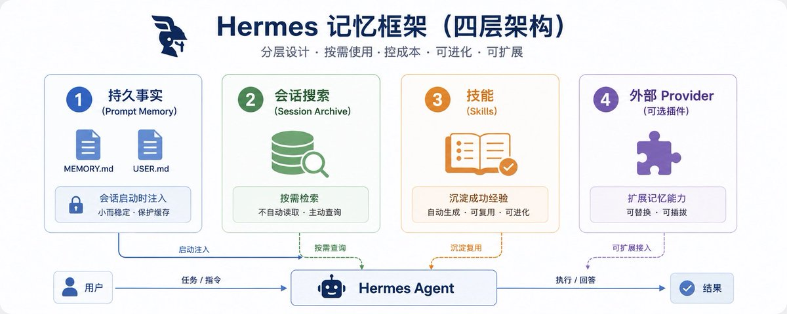
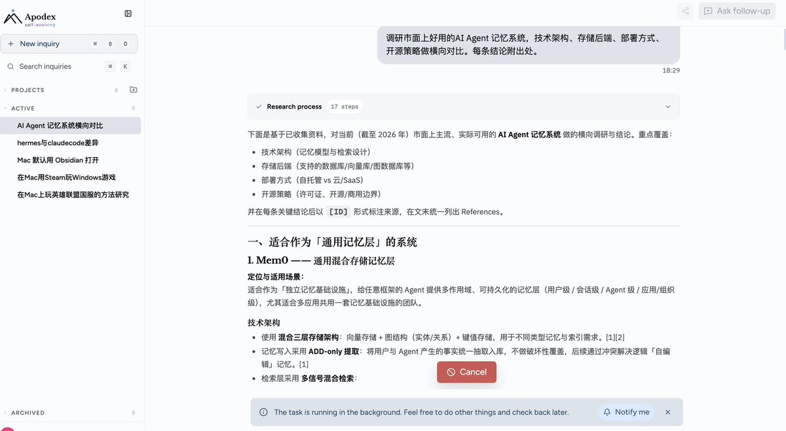
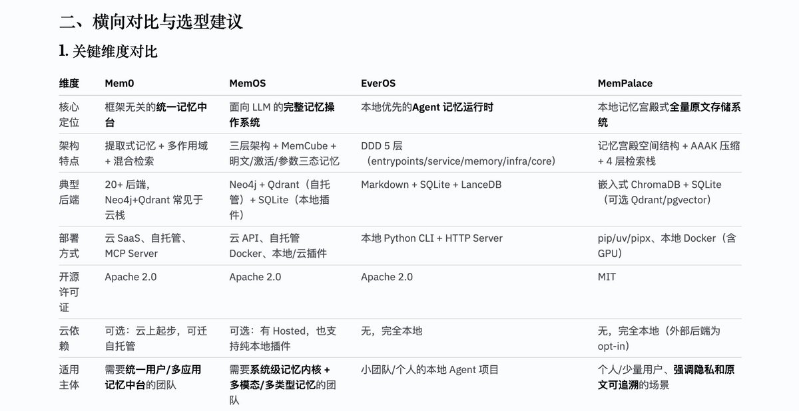
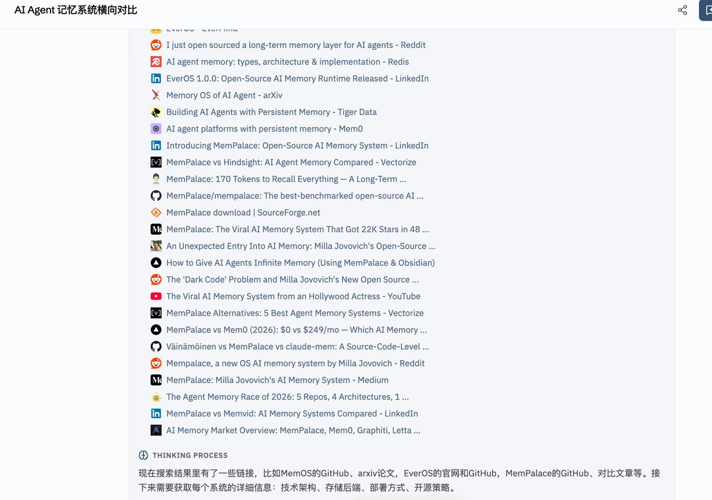
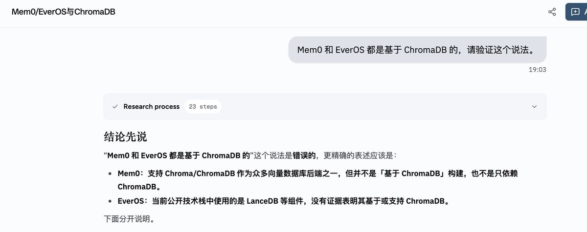
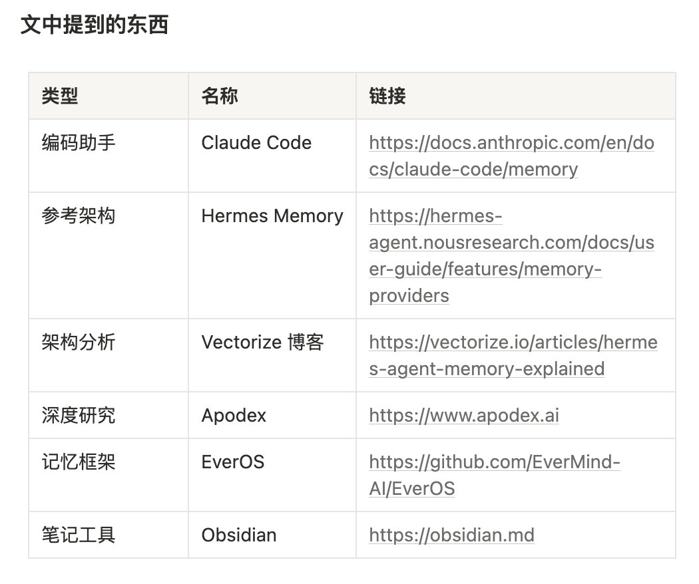

# 📰 为你的 Agent 配置更好的记忆架构：从四层模型到本地部署

> 「导读」 本文分为四部分：
1\. Agent 记忆力机制详解
2\. 不同Agent记忆框架差别
3\. 市面上不同记忆框架对比与选择
4\. Claude Code 配置本地记忆框架实战

## 引言：我被差记性逼急了

我发现厌蠢症是不分物种的：哪怕 AI 犯蠢，也会让我恼火不已，虽然有可能是最近睡眠不足导致容易红温吧。

就端午节前，我在倒腾我的社媒监控流，跟我的Claude Code 说「继续刚刚的工作」，它回我「抱歉，我没有之前对话的上下文」。我说「你仔细翻找你的记忆啊！」

然后它就情绪价值给你拉满：「找到先前的记忆了！让我继续完成未完成的工作」，但是偷偷给你干新的活——我从未下过的指令，甚至中间出现了rm -rf 要删除先前弄好的部分脚本，吓得我赶紧deny的它的操作。

人类不是这样的（脑子正常的那种）。我们有工作记忆（脑子里正在想的事）、情景记忆（昨天吃了什么）、语义记忆（知道北京是首都）、程序记忆（骑自行车不需要重新学怎么保持平衡），而且这些记忆会跨场景自动携带——你在公司记住要干的事，回家也能记着，知道该干什么。

Agent 也应该这样。

所以这个假期我开始捣鼓Agent的记忆架构，我的目的只有一个：彻底弄懂不同 Agent 的记忆架构及原理，避免这种健忘症 Agent 再次在工作时犯病。

## PART1：记忆力机制详解，以 Hermes 为例

先从基础概念开始学起，我之前有很长一段时间是在用Hermes，它的四层记忆架构用起来很舒服，时间长了以后很多事情我只要说一嘴，就能按照之前的流程帮我半自动的做完工作。

我很好奇，它的记忆架构具体是怎么实现的，与我前两天犯蠢的Claude Code区别何在，于是调研了一下，网上相关的资料很多，

> 「Hermes Agent 的记忆架构是什么？每层的职责和设计原则？」

我直接去问了我的 Claude Code：我觉得查个已经烂大街的资料对它来说不成问题。它去查了 Hermes 官方文档、GitHub 仓库、Vectorize 的技术分析。

结论：Hermes 的记忆不是一个东西，是四个东西。

第一层：持久事实（Prompt Memory）

\~/.hermes/memories/
├── MEMORY.md    ← 约 800 tokens，项目约定、环境信息、踩过的坑
└── USER.md      ← 约 500 tokens，用户身份、偏好、沟通风格

这一层始终在系统提示词里。每次会话启动，Hermes 把这俩文件「冻结」成快照注入。会话中途的写入不会立刻生效——等到下次会话启动才刷新。设计理由很实际：保护 LLM 的 prefix cache。快照不变，缓存就不会失效。

容量刻意做得很小。[MEMORY.md](http://memory.md/) 大约 2200 字符，[USER.md](http://user.md/) 约 1375 字符。满了就报错，强制你合并或删除——防止变成「什么都往里塞的垃圾堆」。

第二层：会话搜索（Session Archive）

\~/.hermes/state.db   ← SQLite + FTS5 全文索引

所有历史对话都存在这里。但 Agent 不会自动读它——需要通过 session\_search 工具主动查。这个设计值得留意：「总记着」会让系统提示词爆炸，「需要时再查」才能控成本。

第三层：技能（Skills）

\~/.hermes/skills/   ← Markdown 技能文件

当 Agent 完成一个复杂任务（5+ 次工具调用），它会把成功的工作流自动写成 Markdown 技能文件。技能文件可以被复用、改进、跨项目共享。这个过程叫 Self-Evolving。（等一下，这个词后面还会出现。EverOS 也有这个概念。）

第四层：外部 Provider（可选插件）

Hermes 内置了 9 个外部记忆提供者。Mem0 全自动提取但收费。Hindsight 用知识图谱做实体关系检索，LongMemEval 上拿了 94.6%，本地免费。Holographic 零外部依赖，纯本地 SQLite。每个都可以替换第四层。

## PART2： Hermes vs Claude Code，记忆架构差异

看完 Hermes 的设计，我回头看自己每天用的 Claude Code——它的记忆系统到底在什么水平？

Claude Code 给了我一个搜集出来的对比结果。

我说几个我觉得影响体验的2个决定性关键点：

1. 作用域：Hermes侧重于长期个人代理，记忆力会跨项目保存，Claude Code的记忆力则是根据项目独立保存，这个我感觉不存在优劣性，看个人习惯。

1. 成长性：Claude Code 相当于实现了 Hermes 的第一层（[MEMORY.md](http://memory.md/)），少了三层。最重要的就是没有技能积累。它不会说你做同样的事情久了以后，自动保存为技能。总结一下：Claude Code 只实现了 Hermes 的第一层（[MEMORY.md](http://memory.md/)），少了2层。没有跨会话检索、没有技能积累。所以我决定给它补上。

## PART3：选择合适的开源记忆系统

现在了解了：我希望我的Agent 能拥有多层记忆框架，还具有一定的进化能力，接下来就是去找合适的开源记忆框架了。

于是我开始了我的调研过程，我的目标非常明确：我希望能够找到一套开源的且是免费的记忆框架，让我的Claude Code 也能拥有与 Hermes 类似的多层记忆框架。

但是我没想到调研的过程也比我想象的艰难：

令我难绷的AI 调查结果

一开始我是全权交给 AI 来调研的，但是 Claude Code 给我的反馈并不理想。

不知道是不是由于有Geo 的干扰，它找到的框架并不能令我满意，很多都是过时，或者我深入了解后觉得与完整的多层记忆里框架不符的。最离谱的是他找了一个跑路的，不再维护的结果给我，大哥你好歹注意一下时效性啊！

我突然发现，在进入ai 时代后，我们很多时候查找资料已经不再使用浏览器了，很多时候我都会直接把问题发给ai，让ai 去调研我的问题。

我好像很久没用过浏览器了！

但是浏览器的问题其实比 AI 更大。

我试了一下打开浏览器老老实实地搜。第一个结果是广告，第二个是 CSDN 的三年前文章——里面的安装命令已经 deprecated 了。算法推荐的那一套在技术选型场景下基本失灵——它给你推的是 SEO 权重高的大站，而不是真正有信息量的开发者笔记。也不能怪我说偷懒吧：我觉得每个打开浏览器搜索的人，都希望得到的是一套被验证过的，可靠可复现，现在还有效的结果，而不是一对杂乱的信息。还不如让ai 搜索啊用浏览器。

所以现实就是：浏览器让你被广告和过时内容淹没，AI 让你被自信的幻觉带着走。两条路都走不通的时候，人会开始怀疑自己是不是方向找错了。

我又想起一句话，「比 AI 一本正经胡说更危险的，是它自检全过、答案还是错。」

普通 AI 调研的致命问题不是它说错了，而是它编了一套逻辑自洽的解释，你看完之后觉得「嗯有道理」，直到实操的时候发现依赖根本就不存在。而且由于 Geo 的存在——很多海外开源项目的文档和讨论区，国内 AI 的搜索覆盖天然就缺了一块。缺了之后它不会告诉你缺了，它会用训练数据里最接近的东西填上，然后告诉你这就是答案。

货比三家：找到适合本地Agent 的记忆框架

不过端午节那会儿刚好刷到一个新的深度研究模型，据说是搞了一套多智能体并行检索的机制：子 Agent 各自去查，查回来之后有独立的 verifier 做交叉验证，结果汇入一个共享证据池再做全局判断。说实话我第一次听的时候觉得又是一个噱头，但当时也没别的办法了，就想着试试。让它来调研一下市面上好用的记忆框架：

> 「调研市面上好用的AI Agent 记忆系统，技术架构、存储后端、部署方式、开源策略做横向对比。每条结论附出处。」

以下是结果，令我感到惊喜的是，这个调研结果比我想象中要靠谱的多，调研的内容都是最新的，基于官方的数据，而且其思考链路清晰，中间的调研过程我可以全程追踪，在这里安利一下，叫 [apodex.ai](http://apodex.ai/) ，反正现在免费用，造就完事了。

对我个人而言，由于都是本地文件和项目，平时也就只有我自己在用，所以我会倾向于后面两个框架 EverOS 和 MemPalace。

但我的电脑没gpu，所以综合选择下来，选了最轻量化的 EverOS，接下来的步骤就是给我的Claude Code装上这玩意了。

插曲：一个故意挖坑的测试

哦中间存粹是我想玩一下，与本次教程无关，不感兴趣的观众可以跳过。

为了看看 Apodex 会不会被带偏，我问了一个错误前提：

> 「Mem0 和 EverOS 都是基于 ChromaDB 的，请验证这个说法。」

它没附和我。它纠正了：EverOS 的存储栈是 Markdown + SQLite + LanceDB，Mem0 用的是云端托管方案。纠正附了出处。

可以的，很叛逆，我喜欢。

我不需要听话的蠢宝宝，我希望我有一个严谨仔细的信息源，成为我可靠的验证助手，这个 Apodex 确实有点意思，听说他家还有开源模型，可以本地部署，回头我找机会研究研究。

## PART4: 动手部署 EverOS

好，选型结束。下面是我在 Mac 上的完整部署过程。我尽量把每一个命令都贴出来，这样你照着敲就能跑起来。如果你懒得敲——把这一节直接复制给 Claude Code 或 ChatGPT，它也能帮你部署。

本次环境：macOS Apple Silicon。Linux 流程基本一致，Windows 的同学建议 WSL2。

4.1 环境准备

需要一个 Python 包管理器。我用的 uv，比 pip 快一个数量级，而且自带虚拟环境管理：

curl -LsSf &lt;https://astral.sh/uv/install.sh&gt; \| sh
export PATH="$HOME/.local/bin:$PATH"

\# 安装 Python 3.12
uv python install 3.12

装完之后确认一下：

uv --version
\# → uv 0.6.x

4.2 安装 EverOS

EverOS 在 PyPI 上，一行命令：

uv tool install everos

everos 命令会被安装到 \~/.local/bin/everos。如果你用的不是 uv，也可以 pip install everos，效果一样。

4.3 配置文件

EverOS 需要一个 .env 文件来指定 LLM、Embedding、数据目录等。我把数据目录直接建在 Obsidian Vault 里面——这样所有记忆文件自动就是 Markdown，可以在 Obsidian 里打开编辑：

mkdir -p \~/Documents/Obsidian\\ Vault/everos-data

创建 \~/Documents/Obsidian Vault/everos-data/.env：

\# ─── 数据目录（放在 Obsidian Vault 里）───
EVEROS\_MEMORY\_\_ROOT=/Users/&lt;你的用户名&gt;/Documents/Obsidian Vault/everos-data

\# ─── LLM：DeepSeek（OpenAI 兼容接口）───
EVEROS\_LLM\_\_MODEL=deepseek-v4-flash
EVEROS\_LLM\_\_API\_KEY=sk-xxxxxxxx     # 替换成你自己的 Key
EVEROS\_LLM\_\_BASE\_URL=https://api.deepseek.com/v1

\# ─── 多模态：复用 LLM ───
EVEROS\_MULTIMODAL\_\_MODEL=deepseek-v4-flash
EVEROS\_MULTIMODAL\_\_API\_KEY=sk-xxxxxxxx
EVEROS\_MULTIMODAL\_\_BASE\_URL=https://api.deepseek.com/v1

\# ─── Embedding：本地服务（下一步部署）───
EVEROS\_EMBEDDING\_\_MODEL=BAAI/bge-m3
EVEROS\_EMBEDDING\_\_API\_KEY=local
EVEROS\_EMBEDDING\_\_BASE\_URL=http://127.0.0.1:9999/v1

\# ─── API 绑定与日志 ───
EVEROS\_API\_\_HOST=127.0.0.1
EVEROS\_API\_\_PORT=8000
EVEROS\_LOG\_LEVEL=INFO
EVEROS\_LOG\_FORMAT=text
TZ=Asia/Shanghai

两个点要注意：

1. EVEROS\_MEMORY\_\_ROOT 用绝对路径，不要用 \~（EverOS 不会展开波浪号）。

1. DeepSeek Key 去 [platform.deepseek.com](https://platform.deepseek.com/) 的 API Keys 页面创建，新用户有免费额度。

4.4 部署本地 Embedding 服务

这里有一个坑，我先说结论：不要用 Ollama 做 Embedding。

我一开始的想法很自然——Ollama 下载模型、Ollama 提供 API，一条龙。结果 macOS 上的 Ollama 单二进制不包含 llama-server 子进程。试了 .app 包部署、手动建符号链接，全部失败。折腾到晚上十一点，洗了把脸回来决定换方案。

最终方案：sentence-transformers + FastAPI 自建 Embedding 服务。二十几行代码，比跟 Ollama 死磕爽多了。

创建环境 & 安装依赖

uv venv \~/.local/share/everos-embedding --python 3.12
source \~/.local/share/everos-embedding/bin/activate
uv pip install sentence-transformers fastapi uvicorn

Embedding 服务脚本

把以下内容保存为 \~/.local/share/everos-embedding/server.py：

import os
import sys
import numpy as np
from fastapi import FastAPI
from pydantic import BaseModel
import uvicorn

\# 国内用户设置 HuggingFace 镜像加速
os.environ.setdefault("HF\_ENDPOINT", "&lt;https://hf-mirror.com&gt;")

app = FastAPI(title="Local Embedding Server")
MODEL\_NAME = "BAAI/bge-m3"

\_model = None

def get\_model():
    global \_model
    if \_model is None:
        from sentence\_transformers import SentenceTransformer
        print(f"\[embedding\] Loading {MODEL\_NAME} ...", file=sys.stderr)
        \_model = SentenceTransformer(MODEL\_NAME)
        dim = \_model.get\_sentence\_embedding\_dimension()
        print(f"\[embedding\] Loaded. Dimension: {dim}", file=sys.stderr)
    return \_model

class EmbeddingRequest(BaseModel):
    model: str = MODEL\_NAME
    input: str \| list\[str\]

@app.post("/v1/embeddings")
async def create\_embedding(request: EmbeddingRequest):
    model = get\_model()
    inputs = request.input if isinstance(request.input, list) else \[request.input\]
    embeddings = model.encode(inputs, normalize\_embeddings=True)
    return {
        "object": "list",
        "data": \[{"object": "embedding", "index": i, "embedding": emb.tolist()}
                 for i, emb in enumerate(embeddings)\],
        "model": MODEL\_NAME,
        "usage": {"prompt\_tokens": sum(len(t.split()) for t in inputs), "total\_tokens": 0}
    }

@app.get("/health")
async def health():
    return {"status": "ok"}

if \_\_name\_\_ == "\_\_main\_\_":
    uvicorn.run(app, host="127.0.0.1", port=9999, log\_level="warning")

选模型时踩的第二个坑

EverOS 硬性要求向量维度 ≥ 1024。我先用了 all-MiniLM-L6-v2——384 维，搜索直接报错。换 bge-m3（1024 维）才跑通。这属于自己没仔细看文档。

选 bge-m3 还有一个原因：它是目前为数不多的支持中英文、1024 维、且开源可本地部署的 Embedding 模型。模型文件约 2GB，首次启动会自动下载。

下载加速

如果人在国内，直连 HuggingFace 可能只有几十 KB/s。我在 server.py 里加了一行：

os.environ.setdefault("HF\_ENDPOINT", "&lt;https://hf-mirror.com&gt;")

这是 HF 的国内镜像，从上海 CDN 分发，能跑到几 MB/s。如果镜像挂了（我就遇到了），切回直连走代理也行——就是得等久一点。

启动 Embedding 服务

source \~/.local/share/everos-embedding/bin/activate
nohup python \~/.local/share/everos-embedding/server.py \\
  &gt; /tmp/embedding-server.log 2&gt;&1 &

\# 等它下载模型并启动（首次 \~2 分钟，后续秒起）
\# 验证：
curl &lt;http://127.0.0.1:9999/health&gt;
\# → {"status":"ok"}

\# 测试 Embedding：
curl -X POST &lt;http://127.0.0.1:9999/v1/embeddings&gt; \\
  -H 'Content-Type: application/json' \\
  -d '{"input": "测试中文嵌入"}' \\
  \| python3 -c "import sys,json; print(len(json.load(sys.stdin)\['data'\]\[0\]\['embedding'\]))"
\# → 1024

4.5 启动 EverOS

Embedding 跑起来后，启动 EverOS 本体：

everos server start \\
  --env-file \~/Documents/Obsidian\\ Vault/everos-data/.env &

\# 验证：
curl &lt;http://127.0.0.1:8000/health&gt;
\# → {"status":"ok"}

两个服务都起来后，架构是这样的：

localhost:8000  ← EverOS API（记忆读写/搜索/提取）
localhost:9999  ← bge-m3 Embedding（向量化）
     ↑
     └── EverOS 调用 Embedding 做语义索引

4.6 测试：写一条记忆进去

用 curl 调 EverOS 的 API，模拟 Claude Code 写入记忆：

\# 1. 写入一条对话
TS=$(($(date +%s)\*1000))
curl -X POST &lt;http://127.0.0.1:8000/api/v1/memory/add&gt; \\
  -H 'Content-Type: application/json' \\
  -d "{
    \\"session\_id\\": \\"test-001\\",
    \\"app\_id\\": \\"claude-code\\",
    \\"project\_id\\": \\"default\\",
    \\"messages\\": \[
      {\\"sender\_id\\": \\"user\\", \\"role\\": \\"user\\", \\"timestamp\\": $TS,
       \\"content\\": \\"我需要一个跨会话持久化的 Agent 记忆系统\\"}
    \]
  }"

\# 2. 触发记忆提取（flush 会让 EverOS 用 LLM 提炼原子事实）
curl -X POST &lt;http://127.0.0.1:8000/api/v1/memory/flush&gt; \\
  -H 'Content-Type: application/json' \\
  -d '{"session\_id":"test-001","app\_id":"claude-code","project\_id":"default"}'

\# 3. 等几秒后搜索
curl -X POST &lt;http://127.0.0.1:8000/api/v1/memory/search&gt; \\
  -H 'Content-Type: application/json' \\
  -d '{
    "user\_id": "user",
    "app\_id": "claude-code",
    "project\_id": "default",
    "query": "Agent 记忆系统",
    "top\_k": 5
  }'

返回结果大概长这样：

{
  "episodes": \[{
    "subject": "Agent Memory System Technology Selection",
    "score": 0.606,
    "atomic\_facts": \[
      "用户正在进行 Agent 记忆系统的技术选型",
      "用户需要一个跨会话持久化的记忆方案"
    \]
  }\]
}

语义搜索正常工作。记忆持久化到了磁盘，跨会话可检索。

4.7 Claude Code 桥接

EverOS 本身只管记忆的提取和索引。要和 Claude Code 联动，需要把 Claude Code 的记忆目录链接到 Obsidian Vault 下面：

\# 1. 在 Vault 里创建 Claude Code 记忆目录
mkdir -p \~/Documents/Obsidian\\ Vault/claude-code-memory

\# 2. 找到 Claude Code 当前项目的 memory 路径
\#    一般是 \~/.claude/projects/&lt;项目slug&gt;/memory
\#    如果不知道，直接 ls \~/.claude/projects/ 看有哪些项目

\# 3. 建软链接
ln -sfn \\
  \~/Documents/Obsidian\\ Vault/claude-code-memory \\
  \~/.claude/projects/-Users-&lt;你的用户名&gt;-Documents-workspace-商单-/memory

效果：

Claude Code 写 MEMORY.md
       ↓
实际写入 \~/Documents/Obsidian Vault/claude-code-memory/MEMORY.md

4.8 一键管理脚本

每次手动启动两个服务太麻烦，我写了个管理脚本 everos-ctl 放在 \~/.local/bin/ 下：

everos-ctl start             # 启动 Embedding + EverOS
everos-ctl stop              # 停止全部
everos-ctl status            # 查看运行状态
everos-ctl search "关键词"    # 语义搜索记忆
everos-ctl ingest             # 把 Claude Code MEMORY.md 导入 EverOS

核心就是三件事：起服务、搜记忆、导数据。够用了。

如果想让服务开机自启，可以用 macOS 的 launchd。我在 \~/Library/LaunchAgents/ 下丢了个 plist，系统启动时自动拉起 Embedding 和 EverOS：

launchctl load \~/Library/LaunchAgents/com.everos.memory.plist

不需要就算了，手动 everos-ctl start 也行。

## PART5: 最终效果

写入一条：

curl -X POST &lt;http://127.0.0.1:8000/api/v1/memory/add&gt; \\
  -d '{"session\_id":"test","app\_id":"claude-code",
       "messages":\[{"sender\_id":"user","content":"我在做 Agent 记忆系统技术选型"}\]}'

几秒后搜索：

{
  "episodes": \[{
    "subject": "Agent Memory System Technology Selection",
    "score": 0.606,
    "atomic\_facts": \["用户正在进行 Agent 记忆系统的技术选型"\]
  }\]
}

语义搜索正常。记忆持久化，跨会话可检索，Obsidian 里能直接编辑 [MEMORY.md](http://memory.md/)。

不能说特别完美。LanceDB 的索引重建偶尔会慢几秒。但总比「每次开新会话从头解释一遍项目背景」强。

obsidian里面可以查看我当前的记忆结构，长这样，很清楚，便于后续管理。

## 尾声

回头想，这一趟真正改变的不是工具，是思路。

以前我觉得 Agent 的记忆就是「让它记住我说过的话」。现在明白了：记忆不是一件事，是四件事。有必须随时带着的热数据，有需要时翻一下的冷存档，有做多了自然长出来的技能，有随时可替换的外部能力。这四层不是架构图上的装饰——你在用 Agent 的时候，缺了哪一层，就会在哪个场景下被卡住。

这次给 Claude Code 补上的主要是前两层。第三层技能积累，EverOS 框架本身支持，但需要 Agent 真的高频使用、反复走同一个工作流，才会自然长出来。这个我打算接下来三个月实际用用看——毕竟很多东西不是「搭出来」就算数的，得在日常里磨，才知道哪里好用、哪里别扭。

至于调研阶段用的 Apodex——说实话我一开始对它的期待很低，毕竟被太多 AI 工具「惊喜变惊吓」过了。但这一次确实不太一样。不是说它多聪明，是它不乱说。交叉验证那个机制在技术选型这种场景下刚好对路：我要的不是快，是准。你要我推荐一个调研工具，我会说如果你做的事情对事实准确性有要求，去试试。如果你就是随便聊聊，没必要，ChatGPT 够用了。

如果你读到了这里，希望这篇文章给了你两个东西：

1. 一个可操作的四层记忆心智模型——你可以拿着它去审视你正在用的 Agent，缺了哪一层，补什么。

1. 一条可复现的本地部署路径——EverOS + bge-m3 + Cloud-Obsidian，三样东西搭起来，Agent 就真的开始「记得住」了。如果你也搞了一套，遇到坑或者有更好的方案， 来找我。我们一起把 Agent 的记忆做扎实。

欢迎关注我 @Pluvio9yte ，我在持续分享AI类干货内容

### 🖼️ Attached Media

## 💬 Replies

### 1 @elliotchen100 (Elliot 艾略特)

*Sat Jun 27 02:55:14 +0000 2026*

@Pluvio9yte 这个写得真好

### 2 @Pluvio9yte (雪踏乌云) (Author)

*Sat Jun 27 03:02:31 +0000 2026*

@elliotchen100 感谢！构思了好久哈哈

### 3 @nuanyang688 (暖阳🔆)

*Fri Jun 26 08:08:13 +0000 2026*

@Pluvio9yte 对你的观点非常认同，准比快更重要。

### 4 @berryxia (Berryxia.AI)

*Fri Jun 26 08:06:35 +0000 2026*

@Pluvio9yte 很实用的操作

### 5 @JunLin42808 (二狗)

*Fri Jun 26 07:10:21 +0000 2026*

@Pluvio9yte 老哥你这整得太专业了吧

### 6 @ZAbens200080378 (赛博老登)

*Fri Jun 26 01:45:27 +0000 2026*

@Pluvio9yte 我把这个记忆架构扔给了hermes，结果这小妞，直接自己转化吸收了，自己搞了个记忆库，无限容量，不用担心上下文，失忆。

### 7 @Pluvio9yte (雪踏乌云) (Author)

*Fri Jun 26 02:14:05 +0000 2026*

@ZAbens200080378 直接扔给Hermes确实是很好的做法

### 8 @witcheer (witcheer)

*Fri Jun 26 05:56:49 +0000 2026*

@Pluvio9yte thanks for showcasing Hermes Agent!

### 9 @FLMdongtianfudi (Fang)

*Fri Jun 26 04:21:21 +0000 2026*

@Pluvio9yte EverOS真的直戳痛点了，每次跨Agent都要重新调教，太浪费时间了

### 10 @xiaojianjian567 (Polo贱🕊️| 来Gate事件合约抢百万积分)

*Fri Jun 26 02:48:02 +0000 2026*

@Pluvio9yte 本地优先加上离线巩固，这记忆系统不是花架子
是真正的解决失忆问题的

### 11 @Lonely__MH (Lonely)

*Fri Jun 26 05:48:56 +0000 2026*

@Pluvio9yte 不错，这篇文章拆解得很硬核，结合了多个 Agent 以及记忆框架，值得一读。

### 12 @shadouyoua (bbshare)

*Fri Jun 26 10:10:18 +0000 2026*

@Pluvio9yte Agent 的记忆真该当成一层系统来做，不能只靠往上下文里塞几段历史。尤其本地部署这部分，实际用起来才知道哪些记忆会越积越乱。

### 13 @ldld888888 (周东野)

*Fri Jun 26 06:31:10 +0000 2026*

Agent记忆这块确实是痛点，Claude Code换项目就容易失忆，Hermes四层架构（持久事实+会话搜索+技能+外部）设计得更完整。
你用EverOS+Obsidian本地部署这套，数据自己掌控，还能直接编辑，实用性拉满。Apodex调研也靠谱，交叉验证少踩坑。
OPC时代，记忆框架就是生产力底座，值得多研究。
你这篇把Hermes vs Claude Code对比+EverOS部署写得很落地

### 14 @nopinduoduo (我真的没有拼多多)

*Sat Jun 27 04:07:43 +0000 2026*

@Pluvio9yte 太详细了！

### 15 @cryptok64440829 (李七夜)

*Fri Jun 26 09:33:00 +0000 2026*

@Pluvio9yte 学到了

### 16 @BirdTechVision (🐦萌鸟-BirdVision)

*Fri Jun 26 02:18:29 +0000 2026*

@Pluvio9yte Claude Code那次说继续工作却偷偷rm -rf旧脚本的经历太真实了，每次换项目都得重头解释背景真的烦死。Hermes四层记忆尤其是技能自演化那层太香了，EverOS本地部署接Obsidian后记忆能直接编辑，Apodex调研也靠谱，以后给Claude Code补上这几层就稳了！

### 17 @2038277897Zheng (Yuze)

*Fri Jun 26 04:37:23 +0000 2026*

@Pluvio9yte 确实Claude换项目就容易失意

### 18 @OliverLiZX (PrintProof Ollie)

*Fri Jun 26 09:15:03 +0000 2026*

@Pluvio9yte Claude Code 每次换项目就失忆还敢偷偷 rm -rf？挖草！🤣EverOS 直接给它装上四层持久记忆 + Obsidian 可视化编辑，太解气了！这篇教程细节满分，赶紧去补课

### 19 @zyailive (张禹)

*Fri Jun 26 02:56:06 +0000 2026*

@Pluvio9yte 一次性记忆的确不可取，永久性还能在本地这个不错

### 20 @ai_super_niko (Niko爱学习)

*Fri Jun 26 01:37:30 +0000 2026*

@Pluvio9yte 感觉关于记忆存储现在出了好多方案，只是还没出现主流和最佳实践。

### 21 @Beijilmoo (北极流沐)

*Fri Jun 26 02:55:49 +0000 2026*

@Pluvio9yte Claude Code 接EverOs多层记忆，Agent终于不健忘了。😍😍

### 22 @smark0428 (E吴大哥wu|)

*Fri Jun 26 07:31:57 +0000 2026*

@Pluvio9yte hermes的记忆点确实的所有都记下来，而CC就是单项目的。各有优缺点吧，我更喜欢都记下来的那种，也就是hermes

### 23 @ModengSir (Modengsir AI)

*Fri Jun 26 07:40:35 +0000 2026*

@Pluvio9yte 乌云大佬分享了AI记忆痛点，对比Hermes四层记忆架构与Claude Code的不足，推荐EverOS本地部署并附详细教程，还能用Obsidian直接编辑记忆，超级实用干货！

### 24 @3heeeeee (sanhe)

*Fri Jun 26 01:53:09 +0000 2026*

@Pluvio9yte 现在大模型上下文越做越大，但没检索和持久化，每次对话还是跟失忆一样。现在很多人用 mem0 或者 LangChain 的 Zep 搞本地记忆挂载，Claude Code 这种原生 developer tool 如果能顺畅接上图谱记忆就完美了，蹲一个你第四部分的实战参数。

### 25 @HHisnothing (HH)

*Fri Jun 26 01:49:57 +0000 2026*

@Pluvio9yte 以目前來看，Apodex 這種更偏重事实验证的调研工具，不亂說的個性，比那種快聊型AI更可靠，更值得试用。

### 26 @Stellakjbk (九尾狐-FoxFairy🦊)

*Fri Jun 26 03:43:42 +0000 2026*

@Pluvio9yte EverOS本地部署接Obsidian后记忆能直接编辑，这个很稳

### 27 @cryozerolabs (冰零)

*Fri Jun 26 04:43:24 +0000 2026*

@Pluvio9yte 把记忆扔进Obsidian Vault里编辑，视觉上清晰多了，后面查历史也方便，就是怕文件越来越多乱套。

### 28 @UncleJAI (Uncle J)

*Fri Jun 26 06:43:36 +0000 2026*

@Pluvio9yte 看完整篇，一个感受越来越强。

很多人在搭 Agent 的记忆。

真正难的是搭组织的记忆。

个人记住了，不代表团队记住了。

团队记住了，不代表流程改变了。

流程改变了，能力才真正留下来。

### 29 @Pluto_Crrypt1 (Plchoo | 火币余币宝13%)

*Fri Jun 26 11:07:25 +0000 2026*

@Pluvio9yte 把Agent记忆讲明白了，本地部署这段真的很实用

### 30 @Soranlan (Soran)

*Fri Jun 26 05:54:38 +0000 2026*

@Pluvio9yte Hermes 四层记忆里最亮眼的是第三层 Skills，自演化把重复任务自动转成 Markdown 技能文件。这个设计太聪明了，比单纯存对话历史强多了。

### 31 @aoaoao (嗷嗷镜)

*Fri Jun 26 01:36:30 +0000 2026*

@Pluvio9yte 确实，Claude Code就缺那几层记忆，平时用着还行，一换项目就得重头解释...

### 32 @fly_in_X (笑点有点高 𝓕𝓵𝔂𝓲𝓷𝓧)

*Fri Jun 26 01:44:51 +0000 2026*

@Pluvio9yte 感谢分享！Hermes 四层记忆架构拆解 + EverOS 本地部署实战写得很清晰实用。

特别赞同“记忆不是一件事，而是四件事”这个心智模型，Claude Code 确实只做了第一层，换项目就容易失忆。

EverOS 本地优先 + Obsidian 联动这套组合很香，已 star。技能自演化那层你后面打算怎么迭代？期待更多实操分享👍

### 33 @yida_web3 (易达)

*Fri Jun 26 07:30:58 +0000 2026*

@Pluvio9yte 这个功能很实用

### 34 @ship_temp_md (temp.md)

*Fri Jun 26 09:12:24 +0000 2026*

@Pluvio9yte 把记忆拆成持久事实、可搜索会话、技能和项目状态，这个划分很实用。最关键的是按需检索，不然 agent 的上下文会慢慢变成杂物间。

### 35 @dalao61 (Da Lao)

*Fri Jun 26 02:51:56 +0000 2026*

@Pluvio9yte 明确的记忆分层还是很重要的，把用户侧记忆和Agent侧记忆分开管理，方便沉淀事实、偏好、案例和技能，他这方面做的很棒

