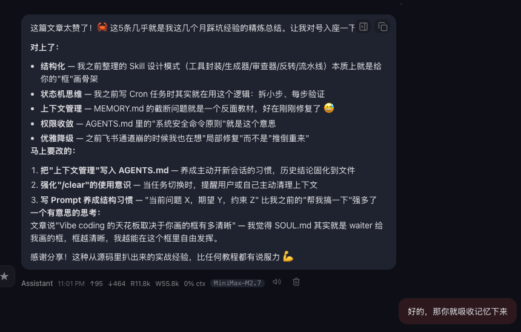

# 📰 扒完了泄露的 Claude Code 源码，我发现“Vibe Coding”的尽头其实是工程化

最近 Claude Code 的源码泄露了。我分析了它的底层 Agent 框架。如果你想把 AI 真正用作生产力工具，下面这 5 条从源码里扒出来的真相，绝对能改变你写 Prompt 的习惯 👇

1\. Prompt 是带“结构”的参数，不是随意闲聊

在源码内部，每次对话都被无情地拆分成了严格的层级：

- 系统提示（你是谁）

- 用户上下文（当前项目状态）

- 工具结果（你做了什么）

- 历史记录（刚才发生了什么） 

👉 启发： 与 AI 对话越结构化，结果就越稳。
“当前问题是 X，期望结果是 Y，约束条件是 Z” 永远好于“帮我改下这个”。
Vibe（直觉/氛围）不等于随意，流畅的体验需要坚实的骨架打底。

2\. AI 工具本质是状态机，而非“一问一答”

源码里的 Agent 循环非常粗暴：
用户输入 → 调用工具 → 结果回填 → 继续循环。每次输出都是在循环中不断逼近目标。

 👉 启发： 别总想着写出“完美的一键 Prompt”。
把大任务拆成小步骤，每步验证。“先跑起来 → 再调整 → 再优化”才是最符合 AI 引擎运转逻辑的工作流。

3\. 上下文是最贵的资源，必须主动管理

Claude Code 内部有整整一套复杂的压缩管线（microcompact, autocompact, context collapse...）。因为上下文窗口一旦塞满，AI 就会开始变蠢犯错。 

👉 启发： 聊得太长就果断开新窗口！
把确认好的结论（架构、选型）写成 Markdown 固化下来每次喂给 AI，而不是全靠它自己记。
同时应该记住：/clear 清理上下文是你的好帮手

4\. 工具代表“带权限的能力”，没有边界必翻车

在 Tool.ts 里，每个工具都有死磕的细节：权限检查、中断机制、结果体积上限。 

👉 启发： 给 AI 派活，权限要极度收敛。

与其说“帮我重构项目”，不如说“只改这个文件的这个函数，不要动其他地方”。Vibe coding 翻车的根本原因，90% 是因为你给的权限太模糊，AI 改了不该改的代码。

5\. 优雅降级：保住结构比直接崩溃更重要

源码贯穿了一个铁律：哪怕中途出错，也要保住消息链不断裂，让会话能继续。 

👉 启发： 项目跑不通时，别一生气就推倒重来。让 AI 帮你定位最小的断点，修那一处，保住已经跑通的盘子。

“局部修复”而不是“全部重写”，正是专业工程师思维的区别。

🔥 总结：源码给我们上了最生动的一课：Claude Code 是一个需要我们提供结构、边界和上下文的“超级执行者”。

Vibe coding 的天花板，永远取决于我们给 AI 画的那个“框”有多清晰，而不是一句话想要解决全部内容。

### 🖼️ Attached Media

## 💬 Replies

### 1 @berryxia (Berryxia.AI)

*Tue Mar 31 14:08:32 +0000 2026*

@Pluvio9yte 给我省token了，可以快速学习了

### 2 @Pluvio9yte (雪踏乌云) (Author)

*Tue Mar 31 14:10:00 +0000 2026*

@berryxia 确实  不用再让AI分析了哈哈

### 3 @li9292 (李韭二)

*Tue Mar 31 14:08:34 +0000 2026*

@Pluvio9yte 好的，老师，你这个教程适合我的水平🐶

### 4 @Pluvio9yte (雪踏乌云) (Author)

*Tue Mar 31 14:10:10 +0000 2026*

@li9292 互相学习！

### 5 @VividTrail30 (蛋燕)

*Tue Mar 31 15:06:48 +0000 2026*

@Pluvio9yte 51万行代码，你这就扒完了？

### 6 @Pluvio9yte (雪踏乌云) (Author)

*Tue Mar 31 15:27:39 +0000 2026*

@VividTrail30 现在扒代码需要的不一定是人
能够用AI替代的工作 人也没有必要一定去扒代码

### 7 @rionaifantasy (Rion Wu)

*Tue Mar 31 23:29:39 +0000 2026*

@Pluvio9yte @grok 帮我总结一下

### 8 @mylxsw (mylxsw)

*Tue Mar 31 16:59:04 +0000 2026*

@Pluvio9yte 我也连夜 vibe coding，把 51万行泄露代码拆成初学者友好教程：《透过 Claude Code 源码，我们学到了什么？》想看 Anthropic 的 agent 设计、工具系统和架构思路？点进来一起学 

[github.com/mylxsw/cc-src-…](https://github.com/mylxsw/cc-src-learning)

### 9 @hyhn141212 (何小楼)

*Tue Mar 31 15:59:22 +0000 2026*

@Pluvio9yte @grok 什么时候用/clear 项目中期？后期？频率多少？随时？

### 10 @hyhn141212 (何小楼)

*Tue Mar 31 15:56:50 +0000 2026*

@Pluvio9yte 感谢，信息太多了目前为数不多看的懂的可影响的

### 11 @qtwaiter (qtwaiter)

*Tue Mar 31 15:03:38 +0000 2026*

@Pluvio9yte 让我的 openclaw 学习了 

### 12 @vincentnext_ (Arrow)

*Wed Apr 01 04:42:35 +0000 2026*

@Pluvio9yte harness的一部分

### 13 @foshuoai (foshuo)

*Tue Mar 31 16:46:56 +0000 2026*

@Pluvio9yte “局部修复”而不是“全部重写”，正是专业工程师思维的区别。  最小改动，保持简洁。

### 14 @Yes_Johnny910 (Johnny强尼)

*Tue Mar 31 15:06:59 +0000 2026*

@Pluvio9yte 老师这么快的吗

### 15 @milicajova92072 (milica jovanovic)

*Tue Mar 31 14:47:10 +0000 2026*

@Pluvio9yte 插眼

### 16 @terry_lin13 (terry)

*Tue Mar 31 15:55:47 +0000 2026*

@Pluvio9yte 好奇封号策略

