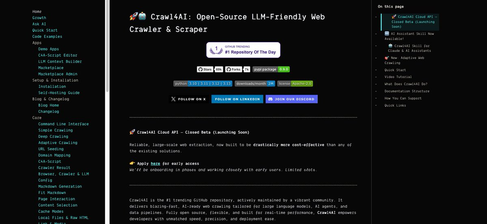
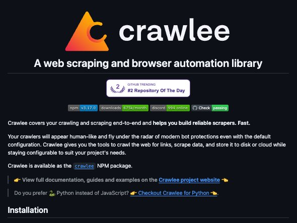
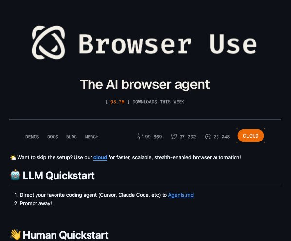
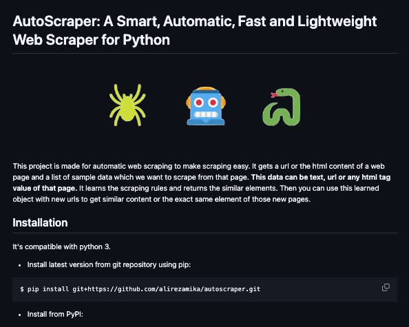

10个GitHub仓库帮你爬取整个互联网

全部收藏。每个都能从任何网站提取干净数据，这种访问权限通常需要销售电话和合同才能获得。

1\. [github.com/firecrawl/fire…](https://github.com/firecrawl/firecrawl)

指向任何网站，它就能爬取每个页面、渲染JavaScript，返回AI能立即读取的干净结构化数据。13万星，进入GitHub百大仓库。半数AI创业公司悄悄运行的爬虫骨架，完全开源。

2\. [github.com/unclecode/craw…](https://github.com/unclecode/crawl4ai)

GitHub排名第一的爬虫。把任何网站转换成干净的LLM就绪的markdown，比付费服务更快，无需API密钥、无需账户、无需按页面付费。某开发者被16美元的付费爬虫激怒后几天就搞出来了。5.1万星。Apache 2.0。

3\.  [github.com/browser-use/br…](http://github.com/browser-use/browser-use)

像真人一样操控浏览器的AI代理，点击、滚动、登录、填表，从未见过的网站中提取数据。两位苏黎世ETH研究员开发，一年内达到9.5万星。能爬取简单爬虫无法触及的页面。MIT协议。

4\.  [github.com/apify/crawlee](http://github.com/apify/crawlee)
完整专业爬虫框架，包含轮换代理、自动重试、浏览器指纹欺骗和队列管理。防止被封禁的全套机制，爬虫公司收费数千的技术栈，现在免费给你。

5\. [github.com/scrapy/scrapy](http://github.com/scrapy/scrapy)

十多年来悄悄为数据团队赋能的工业级爬虫。爬百万页面、提取任何内容、干净导出。在大多数付费工具无法触及的规模上经过实战检验，始终免费。

6\. [github.com/microsoft/mark…](http://github.com/microsoft/markitdown)

微软自家工具，将任何文件或网页、PDF、Office文档、HTML、图像转换成AI能用的干净markdown。整个数据管道公司都在围绕此构建，由微软开源。

7\. [github.com/D4Vinci/Scrapl…](http://github.com/D4Vinci/Scrapling)

隐形爬虫，能自动适应网站布局变化，绕过反爬虫检测。防爬供应商当高级功能出售的猫鼠游戏，现在免费开源。

8\. [github.com/Genymobile/scr…](http://github.com/Genymobile/scrcpy)

从电脑远程控制任何安卓手机，提取数据和自动化没有网站的应用。通往大多数爬虫无法触及的纯移动平台的桥梁。13万+星。Apache 2.0。

9\.  [github.com/alirezamika/au…](http://github.com/alirezamika/autoscraper)

给一个例子它就自动找出规律爬取网站其余内容。无需选择器、无需代码维护。'直接给我数据'按钮，几行Python。

10\. [github.com/lwthiker/curl-…](http://github.com/lwthiker/curl-impersonate)

curl的增强版，完美模拟真实浏览器指纹，请求看起来就像有Chrome的真人。昂贵爬虫API底层暗用的最低级技巧，现在免费。

公司为此收费2000美元/月。源代码就在这儿。

### 🖼️ Attached Media

## 💬 Replies

### 1 @yhiyo2011 (老约翰塞维斯)

*Sun Jun 28 09:25:55 +0000 2026*

@Lucy\_love\_AI 上干货啦，干净收藏起来

### 2 @alexabelonix (Alexa | Indie hacker)

*Sun Jun 28 01:29:07 +0000 2026*

@Lucy\_love\_AI love seeing this.

### 3 @rumpel_sol (Rumpelstiltskin)

*Sun Jun 28 15:09:01 +0000 2026*

@Lucy\_love\_AI These scraping tools are strong for extraction.
The real power comes when you wrap them in proper loops so agents can autonomously research, extract, verify and act on data at scale.
I open sourced athena-loops as a practical harness for this
[github.com/luckeyfaraday/…](https://github.com/luckeyfaraday/athena-loops)

