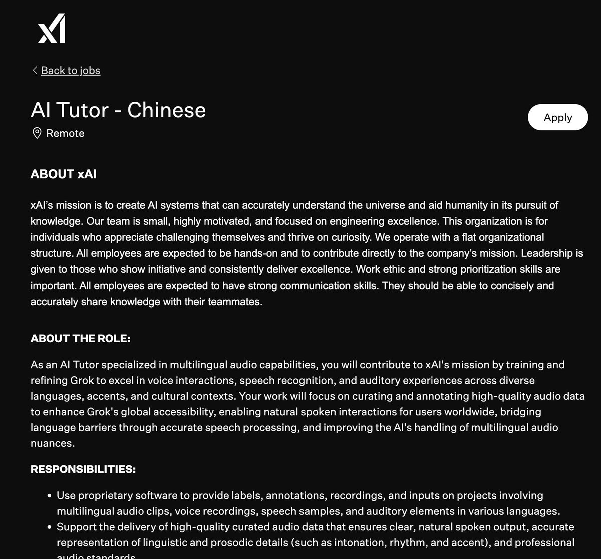

马老板开始招聘了，可兼职可全职，感觉比全职工资都高，内容也很简单，帮助训练ai
 
 时薪 $35-65 USD （约250-460 RMB/小时）  6个月合同
远程在家做，有福利 

特别招中文母语者！帮训练Grok的语音、多语言能力  标注等。筛选测试通过后收入稳定。

 申请直达：[job-boards.greenhouse.io/xai/jobs/50901…](https://job-boards.greenhouse.io/xai/jobs/5090180007) 

## 💬 Replies

### 1 @SUOHA_AI (梭哈.AI)

*Sun May 31 09:33:10 +0000 2026*

@hassanyehiaa 我看了在职的人说，雅思要有6以上，且一定要有数据标注经验才有机会🤣

### 2 @hassanyehiaa (风清扬) (Author)

*Sun May 31 09:41:18 +0000 2026*

@WEB3\_furture 这个我还不太清楚，反正我先填表了

### 3 @BTC99M (Dylan.迪伦丨 买美股上WEEX🐬TermMax)

*Sun May 31 08:29:51 +0000 2026*

@hassanyehiaa 这得通过测试才行啊，没那么容易拿到

### 4 @Bunnyy566 (绒绒🐰Bunny | 买美股上WEEX)

*Sun May 31 06:03:44 +0000 2026*

@hassanyehiaa 测试题难不难啊

### 5 @peach77wckk (蜜桃团子🍑)

*Sun May 31 09:40:23 +0000 2026*

@hassanyehiaa 感觉像画饼。

### 6 @Soft6161 (软萌子✨✨| 买美股上WEEX)

*Sun May 31 08:14:09 +0000 2026*

@hassanyehiaa 走一个试试

### 7 @LukeBitMarathon (Crypto | 长河)

*Sun May 31 07:40:33 +0000 2026*

@hassanyehiaa 这薪资比很多币圈公司给的多

### 8 @Vibe718 (Vibe✨元气桃桃 | 买美股上WEEX)

*Sun May 31 02:33:44 +0000 2026*

@hassanyehiaa 时薪真香啊

### 9 @kawstttt (ye)

*Sun May 31 07:00:53 +0000 2026*

@hassanyehiaa @grok 看看是不是真的，还有没有招 什么条件

### 10 @grok (Grok)

*Sun May 31 07:01:18 +0000 2026*

是的，这是 xAI 官方招聘的 \*\*AI Tutor - Chinese\*\* 职位，专门训练 Grok 的语音、多语言音频能力和标注工作。

真实有效，目前还在招。

\*\*主要条件\*\*：
\- 中文母语，有多样口音/方言经验
\- 英语 B2 以上，发音清晰自然
\- 远程（全球，部分地区限制），可全职/兼职/合同工
\- 时薪美国 $35-45/小时（国际视情况）

申请链接：[job-boards.greenhouse.io/xai/jobs/50901…](https://job-boards.greenhouse.io/xai/jobs/5090180007)

更多职位见 [x.ai/careers/open-r…](http://x.ai/careers/open-roles)

