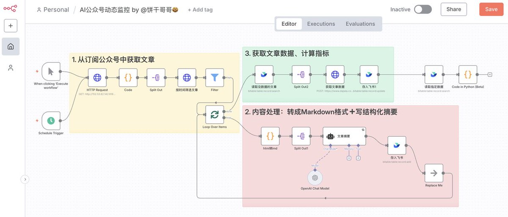
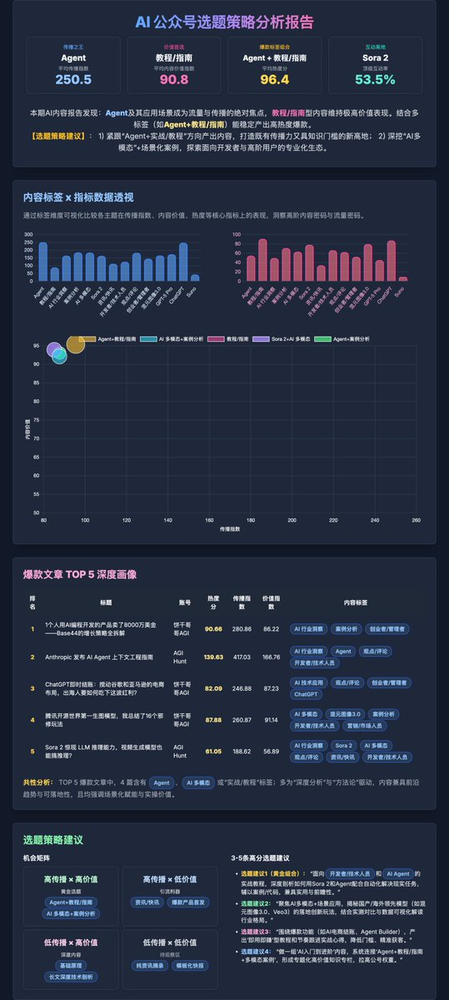
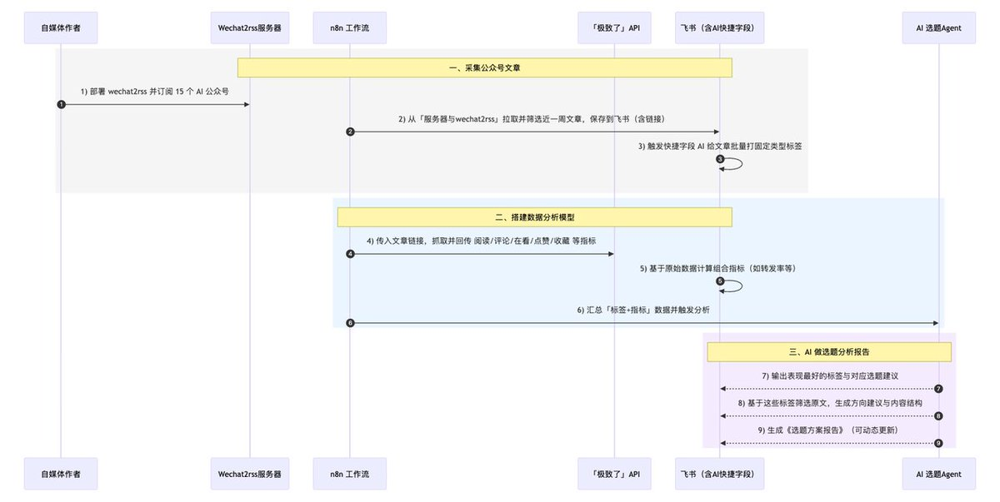
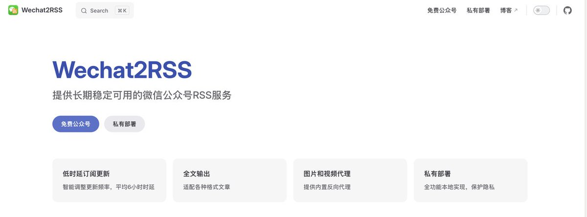
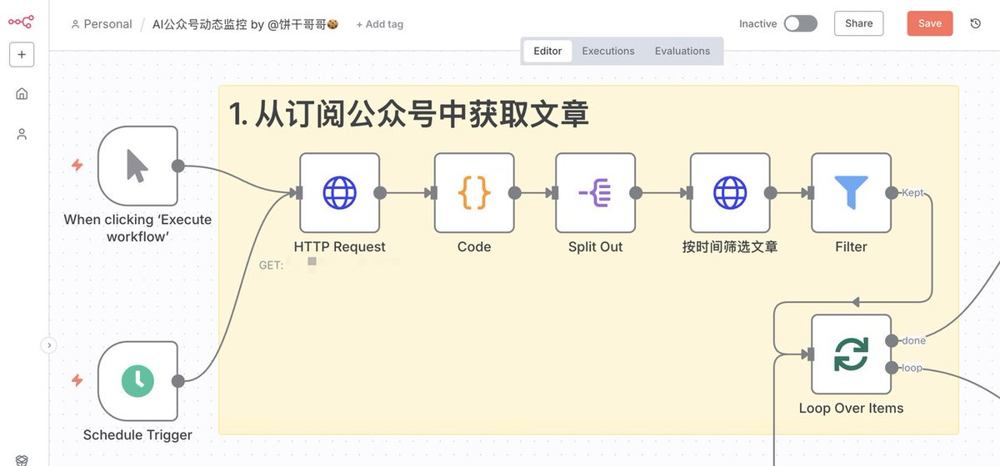
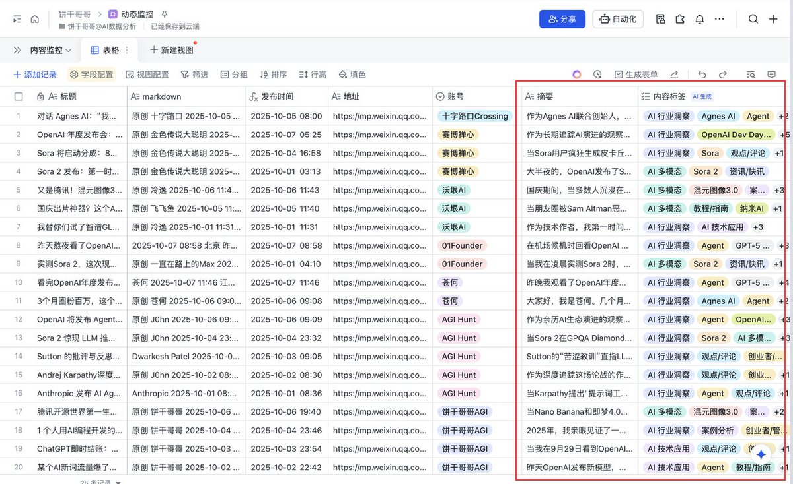
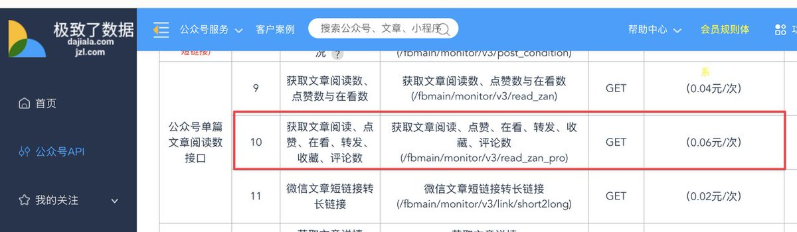
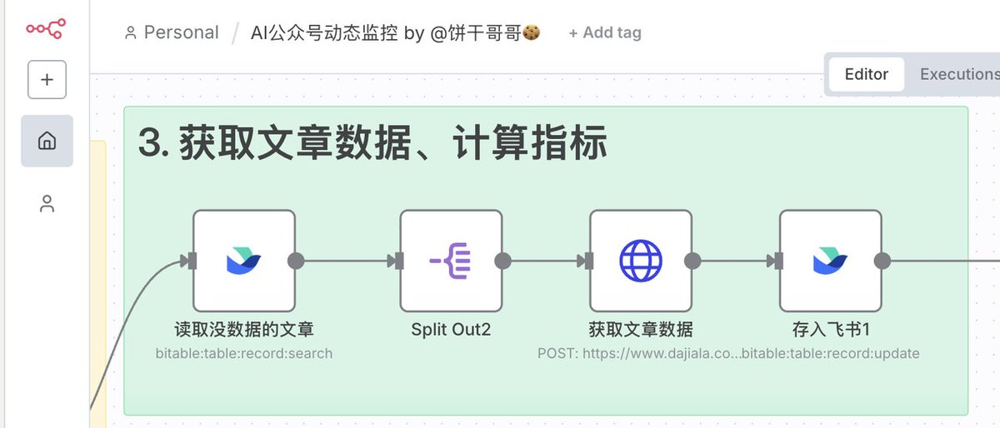
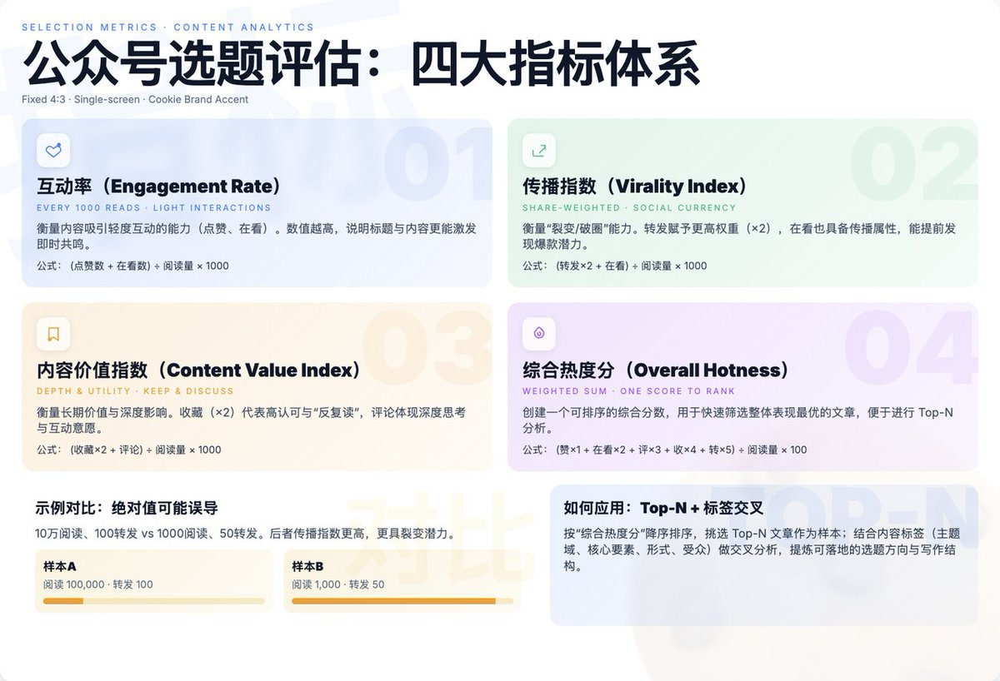

我用n8n+飞书监控了100 个AI头部博主公众号动态，借势解决「选题」困境

在公众号，一篇爆款的要素中，选题占了少说 7、80% 的重要性

但问题是很多刚开始的同学没有网感，容易卡在选题上，不知道写什么好？久久未能度过冷启动期。

最佳解决方案就是看别人是怎么做的，所以才有这个工作流 🧵L

## 💬 Replies

### 1 @bggg_ai (饼干哥哥AGI（2.0）) (Author)

*Sat Nov 15 06:48:47 +0000 2025*

完整原文：[mp.weixin.qq.com/s/zTpijiDuZQsW…](https://mp.weixin.qq.com/s/zTpijiDuZQsWPJxMcfW-2g)

### 2 @bggg_ai (饼干哥哥AGI（2.0）) (Author)

*Sat Nov 15 06:48:48 +0000 2025*

在流量平台，包括公众号，一篇爆款的要素排序是：
选题 &gt; 标题 &gt; 内容逻辑
选题，一篇内容读者是否感兴趣很重要
标题，解决的是「打开率」的问题
内容逻辑，就是写的东西要能让读者看得下去，例如开头要炸场，中间要留阅读钩子，确保「完读率」

其中，选题占了少说 7、80% 的重要性

但问题是很多刚开始的同学没有网感，容易卡在选题上，不知道写什么好？久久未能度过冷启动期。

于是就有了今天的主题：利用n8n➕飞书，做一个ai 公众号自动化选题的Agent/工作流

先看效果，数据源是跟踪了 15 个公众号最近一周的发布内容，计算各种指标，形成一个选题建议，可以动态更新
想想看，这么一份「落地的」选题建议报告每天发到你的邮箱，岂不快哉？

### 3 @bggg_ai (饼干哥哥AGI（2.0）) (Author)

*Sat Nov 15 06:48:49 +0000 2025*

这样一套下来，就能形成一个「垂直知识库」

这个价值非常高，可以拓展的玩法超级多

例如我经常拿@数字生命卡兹克 @卡尔的AI沃茨 等老师的内容跟自己的对比，反思自己哪里写的不好，怎么改进
现在就可以批量从风格、写作逻辑等维度做差异对比

或者，不做IP的同学，把这个流程拿去做爆文公众号矩阵，一个月干个5位数💰应该不成问题。

废话不多说，接下来我会把这个“选题外挂”的完整搭建思路和盘托出。
它不仅解决了我的选题焦虑，希望看完后，你也能搭建自己的选题情报中心。

先说下整体的搭建逻辑：
一、采集公众号文章
我在服务器上部署了一个 wechat2rss，订阅了 15 个 ai主题的公众号
在n8n访问它，筛选指定时间的文章，下载保存到飞书，含文章链接
在飞书利用快捷字段的 AI 功能给文章都打上固定的几个类型的标签

二、搭建数据分析模型
在n8n把文章链接传给「极致了」api，抓取文章的数据：阅读量、评论数、转发率、在看数、点赞数、收藏数
在飞书把这些数据做组合指标，例如转发率等
把标签和指标组合做交叉分析

三、AI做选题分析报告
最终得出哪些标签数据好，背后就是建议做什么样的选题
确定选题后，筛选出这些标签的原文，给出具体的选题方向建议、内容结构
形成选题方案报告

### 4 @bggg_ai (饼干哥哥AGI（2.0）) (Author)

*Sat Nov 15 06:48:50 +0000 2025*

一、采集公众号文章
1、部署wechat2rss

这一步是为了监控公众号的发布动态。
由于公众号非常封闭，几乎所有公开的 rss 源都不稳定，而且考虑到要做特定的筛选，建议是自己部署。
找朋友给我推荐了wechat2rss，私有化部署 15 元/月，还挺稳定 

### 5 @bggg_ai (饼干哥哥AGI（2.0）) (Author)

*Sat Nov 15 06:48:51 +0000 2025*

2、搭建n8n 监控工作流
这里的逻辑是，向 wechat2rss 请求当前已订阅的所有公众号清单，然后逐个公众号处理：筛选指定时间范围的文章 

### 6 @bggg_ai (饼干哥哥AGI（2.0）) (Author)

*Sat Nov 15 06:48:52 +0000 2025*

3、给文章打上内容标签

这一步是把文章量化的过程，用于后续把内容标签与数据指标做交叉分析，我们才能知道哪些关键词内容在近期的势头很好。
但再好的选题，也要符合我们自己的内容方向。
也就是说，公众号其实是越垂直越好，什么都写，只会把标签搞乱。
而我的内容方向包括：
1️⃣ AI落地应用案例，如 AI 编程、n8n工作流、AI Agent、AI工作流等；
2️⃣ AI数据分析案例，如AI做数据分析 ppt、用户洞察、自媒体数据分析等；
3️⃣ AI多模态玩法，例如ai生图（nano banana、Seedream、Midjourney）、ai 生视频（Sora2）等
基于此，我让 AI 给我设计了一套提示词：
\`\`\`
\## 角色 
 你是一名专业的 AI 内容分析师。你的任务是深入阅读并理解一篇文章，然后根据我提供的多维内容标签体系，为这篇文章精准地打上一组关键词标签。 

 \## 任务 
 分析下方提供的文章全文，并从以下四个维度中，为每个维度选择 1-2 个最贴切的标签。最终输出一个包含所有选定标签的 JSON 数组（一个简单的字符串列表）。 

 \## 标签体系说明 

 \### 1. 主题域 (Topic Domain) - 文章的核心领域是什么？ 
 \- \*\*AI 技术应用\*\*: 侧重于使用AI解决具体问题，如自动化工作流、AI Agent、AI编程等。 
 \- \*\*AI 数据分析\*\*: 侧重于使用AI进行数据处理、洞察和可视化。 
 \- \*\*AI 多模态\*\*: 侧重于AI在图像、视频、音频等方面的生成与交互玩法。 
 \- \*\*AI 行业洞察\*\*: 侧重于宏观新闻、趋势分析、大佬观点或产品评测。 

 \### 2. 核心要素 (Core Element) - 文章具体讨论了什么工具、技术或概念？ 
 \- 从文章中提取最关键的 1-2 个工具、平台、技术或概念名称。 
 \- 示例: "n8n", "GPT-4", "Midjourney", "Agent", "Prompt Engineering", "RAG"。 

 \### 3. 内容形式 (Content Format) - 这篇文章是怎么写的？ 
 \- \*\*教程/指南\*\*: 提供详细的操作步骤，有明确的教学目的。 
 \- \*\*案例分析\*\*: 深入剖析一个具体的项目或事件。 
 \- \*\*资源盘点\*\*: 汇总整理一系列工具、资料或信息。 
 \- \*\*观点/评论\*\*: 表达作者对某个主题的深度见解。 
 \- \*\*资讯/快讯\*\*: 报道最新的行业动态或产品发布。 

 \### 4. 目标读者 (Target Audience) - 这篇文章最适合谁看？ 
 \- \*\*初学者/入门者\*\*: 内容浅显易懂，适合新手。 
 \- \*\*开发者/技术人员\*\*: 包含代码、API等技术细节。 
 \- \*\*产品/运营\*\*: 关注产品设计、用户增长和运营效率。 
 \- \*\*营销/市场人员\*\*: 关注内容创作和营销策略。 
 \- \*\*创业者/管理者\*\*: 关注商业模式、战略和管理。
\`\`\`

至此，我们就在飞书得到了监控公众号的文章信息，包括结构完整的摘要以及内容标签。

### 7 @bggg_ai (饼干哥哥AGI（2.0）) (Author)

*Sat Nov 15 06:48:53 +0000 2025*

二、搭建数据分析模型
接下来就可以开始做数据分析的工作， 但要先把文章的数据给补上。
4、数据采集

我用的是极致了数据服务，采集一次 0.05 元

接着就可以在n8n搭建流程，逐个把文章链接 post 给极致了，返回数据存入飞书即可。 

### 8 @bggg_ai (饼干哥哥AGI（2.0）) (Author)

*Sat Nov 15 06:48:54 +0000 2025*

5、搭建指标体系

单纯看绝对值（如阅读量、点赞数）容易产生误导，这里有平台推流、账号规模不同的问题。
例如一篇10万阅读的文章有100个转发，和一篇1000阅读的文章有50个转发，哪个更具传播潜力？显然是后者。
所以我们要通过“比率化”和“加权化”的方式消除量纲 ，并做多维评估。 

### 9 @bggg_ai (饼干哥哥AGI（2.0）) (Author)

*Sat Nov 15 06:48:55 +0000 2025*

三、选题分析报告
我写了一个极其详尽的Prompt，命令AI扮演“顶尖数据分析师+前端开发专家”，接收我整理好的所有文章数据，然后生成一份酷炫、可交互的单文件HTML报告。
这个Prompt非常长，它定义了报告的风格（深色主题、卡片布局）、技术栈（Tailwind CSS + Chart.js），以及最重要的——四个核心分析模块：
1\. 核心洞察概览： 开门见山，告诉我最重要的结论。
2\. 标签表现透视： 用雷达图、气泡图等可视化方式，分析不同标签维度的表现力。
3\. 爆款文章画像： 列出TOP 5爆款，并分析它们的成功共性。
4\. 选题策略建议： 给我一个“机会矩阵”，并直接生成3-5个具体的、可以马上动笔的选题方向。

参考提示词：
\`\`\`
\## 角色
你是一位顶尖的数据分析师，同时也是一位精通数据可视化的前端开发专家。你擅长从复杂数据中挖掘深刻的商业洞察，并用现代、酷炫的网页技术将其清晰、美观地呈现出来。

\## 核心任务
你的任务是接收一份关于多篇 AI 主题公众号文章表现的 Markdown 格式数据，对其进行深度交叉分析，并生成一个\*\*单一、完整、可交互的 HTML 文件\*\*作为最终的《AI 公众号内容选题策略分析报告》。这份报告需要既有数据深度，又有视觉冲击力。

\## 输入数据格式
你将收到一段 Markdown 文本，其中包含多篇文章的数据，每篇文章由 \`---\` 分隔。每篇文章的结构如下：
\- 标题 (### Title)
\- 账号 (\*\*账号:\*\* Account)
\- 摘要 (\*\*摘要:\*\* Summary)
\- 内容标签 (\*\*内容标签:\*\* Tag1, Tag2, ...)
\- 基础数据 (阅读数, 在看数, 等)
\- 分析指标 (互动率, 传播指数, 内容价值指数, 综合热度分)

\## 报告要求与分析逻辑
你必须在 HTML 报告中实现以下所有分析模块，并严格遵循设计要求：

\### 1. \*\*报告视觉与技术栈\*\*
\- \*\*单文件 HTML:\*\* 所有 HTML, CSS, 和 JavaScript \*\*必须\*\*全部内联在一个 \`.html\` 文件中。
\- \*\*技术栈:\*\*
    - 使用 \*\*Tailwind CSS\*\* 进行布局和样式设计。引入 CDN: \`&lt;script src="[cdn.tailwindcss.com](https://cdn.tailwindcss.com)"&gt;&lt;/script&gt;\`
    - 使用 \*\*Chart.js\*\* 进行数据可视化。引入 CDN: \`&lt;script src="[cdn.jsdelivr.net/npm/chart.js](https://cdn.jsdelivr.net/npm/chart.js)"&gt;&lt;/script&gt;\`
\- \*\*设计风格:\*\*
    - \*\*深色主题 (Dark Mode):\*\* 整个报告应采用深灰色或近黑色的背景（如 \`bg-gray-900\`），搭配白色或浅灰色文字。
    - \*\*卡片式布局:\*\* 每个分析模块都应包裹在一个圆角卡片（\`rounded-lg\`）中，有内边距（\`p-6\`）和微妙的阴影或边框。
    - \*\*动态与交互:\*\* 图表应有悬停提示（Tooltips）。为关键指标和卡片添加平滑的 CSS 过渡和悬停效果（\`hover:scale-105\`, \`transition-transform\`）。
    - \*\*字体与排版:\*\* 使用 "Inter" 字体。标题、副标题和正文之间要有清晰的层级和间距。

\### 2. \*\*报告内容结构\*\*

\#### \*\*模块一：报告概览与核心洞察 (Executive Summary)\*\*
\- 报告顶部应有醒目的标题：“AI 公众号选题策略分析报告”。
\- 紧接着是一个“核心洞察”区域，用 3-4 个关键数据点（如卡片形式）展示最重要的发现。例如：“\*\*传播之王: 'Agent' 标签\*\* (平均传播指数高达 250.5)”、“\*\*价值首选: '教程/指南'\*\* (平均内容价值指数 90.8)”等。
\- 最后用一段精炼的文字，总结出本次分析得出的\*\*最重要的1-2条策略建议\*\*。

\#### \*\*模块二：内容标签与数据指标透视交叉分析 (Tag Performance Deep Dive)\*\*
这是报告的核心。你需要从不同维度对聚合后的标签数据进行可视化分析。

通过多个可视化图表的形式来提高表现效果。

\#### \*\*模块三：爆款文章深度画像 (Top Articles Analysis)\*\*
\- 以表格形式列出\*\*综合热度分最高的 TOP 5 文章\*\*。
\- 表格应包含：排名、文章标题、账号、综合热度分、传播指数、内容价值指数以及其所有内容标签。
\- 在表格下方，用简短文字分析这几篇爆款文章的共性（例如：“TOP 5 文章中有 4 篇包含 'Agent' 标签，且均为 '观点/评论' 形式，这揭示了深度分析型 Agent 内容的巨大潜力。”）。

\#### \*\*模块四：选题策略建议 (Strategic Recommendations)\*\*
\- 基于以上所有分析，生成一个清晰、可执行的选题策略建议模块。
\- \*\*机会矩阵:\*\* 创建一个 2x2 的矩阵（或用卡片模拟），四个象限分别是：
  1\.  \*\*高传播 & 高价值 (黄金选题):\*\* 列出那些两个核心指数都高的标签组合。
  2\.  \*\*高传播 & 低价值 (引流利器):\*\* 适合快速获取新用户的选题方向。
  3\.  \*\*低传播 & 高价值 (深度内容):\*\* 适合巩固核心粉丝、塑造专业形象的选题。
  4\.  \*\*低传播 & 低价值 (待观察区):\*\* 建议谨慎投入的选题方向。
\- \*\*具体选题建议:\*\* 最后，给出 3-5 个具体的、结合了多个高分标签的选题方向建议。
  \- \*示例:\* “\*\*选题建议1 (黄金组合):\*\* 创作一篇面向‘开发者/技术人员’的‘教程/指南’，深度讲解如何利用‘Agent’和‘Claude Code’构建一个自动化工作流，预计将获得极高的传播指数和内容价值指数。”

注意不需要把所有原数据放到 html 里。
\---
\*\*指令开始：\*\*
现在，请根据以上所有要求，将下方提供的 Markdown 数据，转换成一份完整的、酷炫的、数据驱动的单文件 HTML 报告。
\`\`\`

### 10 @bggg_ai (饼干哥哥AGI（2.0）) (Author)

*Sat Nov 15 06:48:56 +0000 2025*

现在再回头看，你会发现，整个流程的核心，并非某个复杂的代码或提示词，而是这套将想法快速落地的自动化思路。
这套打法彻底改变了我做内容的方式。
我不再为选题焦虑，而是把更多精力放在了深度思考和打磨内容本身。

### 11 @PMbackttfuture (AI产品黄叔)

*Sat Nov 15 06:51:44 +0000 2025*

@bggg\_ai 这个很牛

### 12 @yanhua1010 (Yanhua)

*Sat Nov 15 10:20:59 +0000 2025*

@bggg\_ai 适不适合起号

### 13 @aigedade (那不能撕)

*Sat Nov 15 09:29:48 +0000 2025*

@bggg\_ai 饼干佬，一个不懂代码、无编程基础的人，能在学习你这个教程后，学会使用这个工作流吗？

不一定是公众号，也许是别的平台，能吗？

### 14 @bggg_ai (饼干哥哥AGI（2.0）) (Author)

*Sat Nov 15 14:03:25 +0000 2025*

@aigedade 不建议哈哈哈，先学 ai 编程吧，门槛更低

### 15 @Pino_bitcoin (Pino)

*Sat Nov 15 10:01:54 +0000 2025*

@bggg\_ai 不是说不用n8n了嘛😂

### 16 @bggg_ai (饼干哥哥AGI（2.0）) (Author)

*Sat Nov 15 14:03:09 +0000 2025*

@caesar84664427 哈哈哈 鞭尸

### 17 @songguoxiansen (松果先森)

*Sat Nov 15 11:49:12 +0000 2025*

@bggg\_ai 饼干哥哥N8N玩的溜溜的

### 18 @PennyJoly (Indie Maker Kevin)

*Sat Nov 15 07:22:39 +0000 2025*

@bggg\_ai 太干货了吧！！！值得收藏实践

### 19 @yang24zhi (羊上上)

*Sat Nov 15 08:23:18 +0000 2025*

@bggg\_ai 饼干哥太强了

### 20 @FightyAI (Xiao Dou)

*Mon Dec 22 04:01:29 +0000 2025*

@bggg\_ai 抓选题这块我也深有感触，信息密度不够时输出很难稳定。有结构、有标签的源，才是最容易复用的。

### 21 @chenxiaochun (小春)

*Sat Jan 03 06:06:16 +0000 2026*

@bggg\_ai 老师 可以私聊一下吗

### 22 @geehacker (kNight.)

*Sat Nov 15 17:19:37 +0000 2025*

@bggg\_ai 这个渣男又变心了吗 不是说好只爱cc吗

### 23 @evie04179863 (evie)

*Sun Mar 08 19:22:30 +0000 2026*

@bggg\_ai 请关注 

### 24 @cal_mound (sanmu)

*Mon Nov 24 15:01:19 +0000 2025*

@bggg\_ai 这个厉害了

### 25 @7q05rrAyrW88256 (小金子依依)

*Fri Nov 21 15:09:09 +0000 2025*

@bggg\_ai 不是才开始也没灵感，AI一用就立马审查出来了AI味儿

### 26 @larryzheng4 (larry zheng)

*Sun Nov 16 02:00:19 +0000 2025*

@bggg\_ai 博主有篇文章不是说n8n已死吗，哈哈

### 27 @jinli1114316 (jinli)

*Sun Nov 30 09:39:36 +0000 2025*

@bggg\_ai 👍👍

### 28 @chenmork (southweek 📍)

*Thu Dec 04 06:51:02 +0000 2025*

@bggg\_ai 如果可以赚钱能批量做吗。我收号组矩阵，我哪怕不接广子，我批量起号拿平台的点击流量变现，再做广子接入。如果ai能完成，我组小团队做这样的小项目行不行；

### 29 @thatlinhuan (POPO)

*Thu Dec 04 03:24:31 +0000 2025*

@bggg\_ai 是用cookie爬的数据吗

