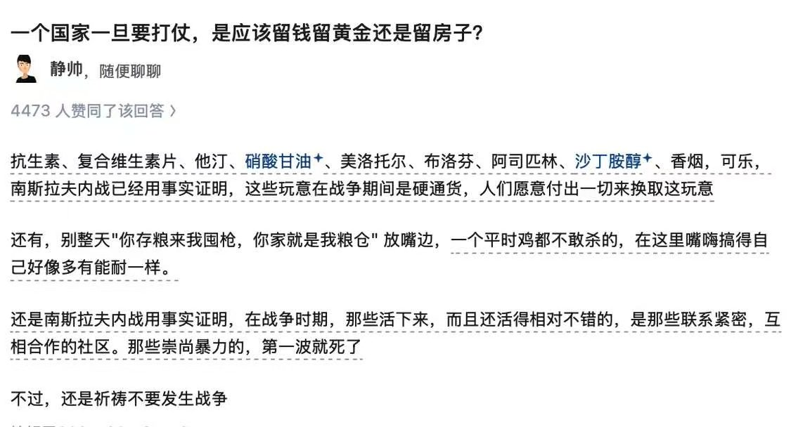

战时参考 

## 💬 Replies

### 1 @ysrg526yr95197 (不吃花生的泡堂)

*Mon Aug 31 05:46:24 +0000 2026*

@mafang71 战争爆发前，如果你发现大富豪们开始悄悄变卖资产、政客们说话越来越极端、邻居们开始囤积一些莫名其妙的东西时，千万不要抱有幻想。战争爆发的那个晚上，不要试图当英雄去保护财产，带着你的家人和最轻便的救命物资，在道路被封锁前立刻逃离城市，这是生存几率最高的一条路。

### 2 @ChrisD318587027 (Chris D)

*Sun Aug 30 13:38:11 +0000 2026*

@mafang71 连酒精和白糖都没有，还敢说知道南斯拉夫内战

### 3 @Dawnnewsta (曲终人散🇨🇦🇺🇦)

*Sun Aug 30 13:45:35 +0000 2026*

@mafang71 留什么都没用，因为你都留不住

### 4 @yixiantian22 (过期的长生不老药)

*Sun Aug 30 12:08:13 +0000 2026*

@mafang71 战争不战争的，不好说，促进消费倒是真的，中共这些年制造恐慌导致的狂热消费无数次了。这次会是真的狼来了吗？就这里说的药品，有用的只有阿斯匹林和抗生素，不过，阿斯匹林你要是没点关系拿不到，有关系的话什么时候都拿得到

### 5 @ChanghungL94609 (changhung lai)

*Sun Aug 30 14:41:51 +0000 2026*

@mafang71 這些資產都會被徵用所以能留一條命給你就不錯了

### 6 @al84139034 (jr)

*Sun Aug 30 10:18:47 +0000 2026*

@mafang71 这些玩意都是有保质期的，咋屯

### 7 @chonghuling (爱情冲冲冲)

*Sun Aug 30 14:31:29 +0000 2026*

@mafang71 按新法律黄金征收，房子征用。。征收到底给不给钱

### 8 @Eric1348744407 (德赛ERIC)

*Mon Aug 31 09:26:46 +0000 2026*

@mafang71 这是典型的不善于思考，但是假装会思考的沙雕人士建议，上面提到的东西到了战时基本都是专管物资，你敢囤货卖，不出三天就被抓进去了，其次这些基本保障品中国还缺产量吗？真的是指挥照搬国外经验的蠢货。在中国战时要囤的是高奢才对，比如高级洋酒，高级美妆护肤

### 9 @xuxuxuxu999 (推特推特我爱你)

*Sun Aug 30 14:29:00 +0000 2026*

@mafang71 压缩饼干 白糖 水 汽油 药物

### 10 @li_tianlin9526 (SomendQshandjam)

*Sun Aug 30 11:26:20 +0000 2026*

@mafang71 个人认为药物 米面油鸡蛋 还有水 外汇

### 11 @iphone8king (com)

*Sun Aug 30 10:26:09 +0000 2026*

@mafang71 真扯淡， 乌克兰和俄罗斯怎么不借鉴一下，没听说这两国国民要搞这一套

### 12 @YangzQiao (chou yang🇺🇦🇮🇱)

*Sun Aug 30 11:32:44 +0000 2026*

@mafang71 新冠疫情封城期间就是硬通货

### 13 @yinchaojioqbdpo (印钞机.hl)

*Sun Aug 30 10:51:36 +0000 2026*

@mafang71 以前看玻利维亚那文，疫情时连打火机都囤了

### 14 @sosiristseng (Tseng Wen-Wei)

*Mon Aug 31 07:20:17 +0000 2026*

@mafang71 黃金沒用，連美國在經濟危機時都會沒收私藏黃金的

### 15 @humdum75589278 (humdum)

*Mon Aug 31 14:30:34 +0000 2026*

@mafang71 秦国商鞅变法的一个重要成果就是“使民勇于公战而怯于私斗”
编乎这些用户，骂起中国人来，旁征博引，什么国际标准欧美文化都能张嘴就来，唯独不看看中国的史书写了什么
按他的逻辑，流氓地痞争强斗狠的国家一定有战斗力

### 16 @VivianQ91395561 (VivianQ)

*Sun Aug 30 10:46:26 +0000 2026*

@mafang71 又骗我囤东西 上次囤了好多罐头

### 17 @ZoneJuror (ZoneJuror)

*Sun Aug 30 12:18:43 +0000 2026*

@mafang71 假马方

### 18 @bianokx_momo (diudidu)

*Sun Aug 30 18:43:09 +0000 2026*

@mafang71 缓冲地带足够深，而且还要懂得隐藏起来

### 19 @Xiao512Tang (上帝独孙子)

*Sun Aug 30 15:30:11 +0000 2026*

@mafang71 受教了

### 20 @didierchi0912 (C’ygiya Di)

*Sun Aug 30 15:31:00 +0000 2026*

@mafang71 应该留住命🤔

### 21 @AndySniper11 (安迪@LA)

*Sun Aug 30 19:35:38 +0000 2026*

@mafang71 马老师是不是得到什么内部消息了？

### 22 @superdupergoh (Cryptoowl 🛡)

*Mon Aug 31 03:09:44 +0000 2026*

@mafang71 问题是，以上大部分的物资都有有限的保质期。

### 23 @LaoWangknxe (王十万（体彩店主）)

*Sun Aug 30 14:44:22 +0000 2026*

@mafang71 没必要搞得那么悲观

### 24 @ch_lin16591 (CH Lin)

*Sun Aug 30 13:09:48 +0000 2026*

@mafang71 把钱转移到国外，必要时可以跑

### 25 @XingPony (Xing)

*Mon Aug 31 19:16:36 +0000 2026*

@mafang71 算了吧 买本绿卡吧

### 26 @Jeff_John_sta (金州南雁)

*Sun Aug 30 14:47:56 +0000 2026*

@mafang71 啥？！啥是黄金？啥是“留”？为啥不直接把“何不食肉糜？”也列入参考？

### 27 @jekindsww (jekinshdjjw)

*Mon Aug 31 16:21:03 +0000 2026*

@mafang71 硬通货不止小偷强盗会来偷，社区、政府也会来抢。

### 28 @tingting1827816 (tingting)

*Mon Aug 31 13:05:03 +0000 2026*

@mafang71 崇尚暴力的死剩下的做了天下。比如毛泽东。看看塔利班怎么活下来的。不崇尚暴力难道就不死吗？

### 29 @Kongtong2020 (Aktake)

*Tue Sep 01 01:18:24 +0000 2026*

@mafang71 早点往回民区搬，第一时间信教比啥都强。原子化互害开玩笑呢

### 30 @JunLv178889 (Jun Lv)

*Sun Aug 30 16:50:34 +0000 2026*

@mafang71 你那那些被干碎的中东臭鱼烂虾的小国类比准超级大国吗

### 31 @pete63416117 (黄种人Y1)

*Sun Aug 30 22:33:00 +0000 2026*

@mafang71 你小看了活着这个词更多的时候是动词

### 32 @zhngrnjn36552 (Miles Zhang)

*Mon Aug 31 13:55:33 +0000 2026*

@mafang71 应该跑路好吗！像我们这种不喜欢惹事，知识水平也还不错的难民，愿意接收的国家可不少。

### 33 @soffia9527 (培根铸魂有点儿淡)

*Tue Sep 01 03:17:39 +0000 2026*

@mafang71 普通人屯黄金会招来杀身之祸

### 34 @DGothen (DiabloGothen)

*Mon Aug 31 01:41:38 +0000 2026*

@mafang71 马方老师对日本挺熟悉的，今天说这个也许闻到了战争的味道。

### 35 @jnhuzhng1553286 (王者归来)

*Mon Aug 31 02:31:05 +0000 2026*

@mafang71 死的永远是底层人和中层的，其他的喝茶泡妞，还有大量物资

### 36 @dlbmoon (热心网友_9527)

*Sun Aug 30 12:19:33 +0000 2026*

@mafang71 疫情的时候囤的东西都吃完了吗？😼

