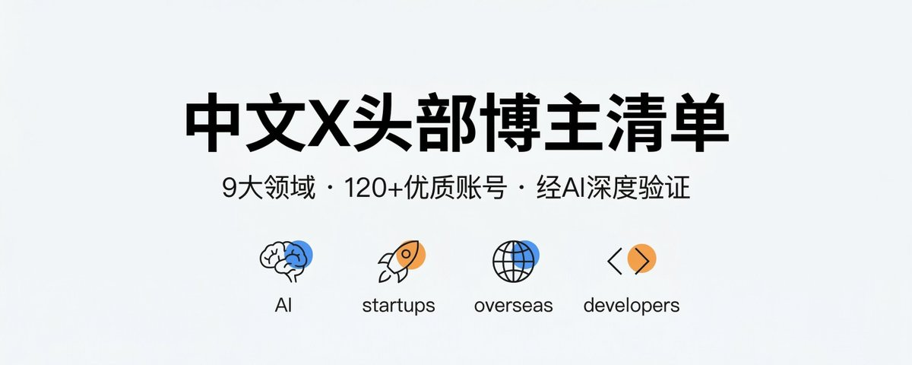

# 📰 2026最值得关注的AI/出海/创业/独立开发/副业博主大合集！共129个，分领域整理，建议收藏 

经过Gemini、Grok、ChatGPT、Claude四个顶尖大模型的深度分析与多轮交叉验证，再结合人工严格筛选和去重，我整理出了这份《中文X各领域最值得关注的头部博主清单》。

这份清单严格遵循以下标准：

- 粉丝量均在5k以上

- 推文活跃度高、热度高、粉丝互动积极

- 内容干货价值高、实战性强、深受认可（无割韭菜、无水贴）

- 每个博主仅归入最匹配的一个领域（零重复）

目的就是帮你快速构建一个信息密度极高、噪音极低的高质量中文信息时间线。 只要关注这些账号，你就能第一时间获取AI、出海、创业、SaaS、副业等领域的最新干货和实战经验。

以下按领域分类整理，不分排名先后，直接点击Handle一键关注即可。

# 一、AI 领域

1. 中文 AI 圈高频信息源，长期分享 Prompt 工程、AI 实战、前沿工具与模型解读。宝玉[@dotey](https://x.com/@dotey)

1. AIGC 周刊主理人，专注 AI 绘画、视频生成、设计工作流和工具趋势。歸藏[@op7418](https://x.com/@op7418)

1. 以 AI 资讯日报和前沿动态整理见长，适合追踪新模型、新产品和热点变化。Gorden\_Sun[@Gorden\_Sun](https://x.com/@Gorden_Sun)

1. 科技与 AI 工具分享型账号，覆盖 ChatGPT、AI 工具导航、产品资讯和使用技巧。小互@xiaohu

1. 偏 Web 与 AI 技术实践，常分享 AI 论文、开源项目和产品落地思考。shao\_\_meng[@shao\_\_meng](https://x.com/@shao__meng)

1. 聚焦 AI 工具普及与产品体验，内容偏实用、面向普通用户和工具使用者。thinkingjimmy[@thinkingjimmy](https://x.com/@thinkingjimmy)

1. AI 开发与产品结合型账号，偏开发者视角，适合关注工具构建和应用实践。goocarlos[@goocarlos](https://x.com/@goocarlos)

1. 偏 AI 创业和 LLM、RAG、Agent 方向，关注技术趋势与商业落地。Tumeng05[@Tumeng05](https://x.com/@Tumeng05)

1. 擅长把复杂 AI 技术讲清楚，常写 AI 产品、开发实践和工具应用心得。Axton Liu[@AxtonLiu](https://x.com/@AxtonLiu)

1. 偏 AI 视频和生成式视觉创作，适合关注创意类 AI 方向。海辛[@haibun](https://x.com/@haibun)

1. 常分享 AI 工具、生产力提升和趋势观察，内容完整度和信息密度都较高。倪爽[@nishuang](https://x.com/@nishuang)

1. 偏 AI 产品、工作流、Vibe Coding 和趋势判断，兼具产品感和表达能力。向阳乔木[@vista8](https://x.com/@vista8)

1. 深度 Prompt 探索者，内容偏 AI 思考、创意应用和方法论总结。李继刚[@lijigang](https://x.com/@lijigang)

1. 华人 AI 领域最具影响力的意见领袖之一，偏产业、创业和大模型趋势判断。李开复[@kaifulee](https://x.com/@kaifulee)

1. 中文 AI 知识整理型头部账号，适合体系化学习和追踪前沿资源。WaytoAGI[@WaytoAGI](https://x.com/@WaytoAGI)

1. 偏 LLM、AI 实战和开发者视角，内容通常信息密度较高。响马[@xicilion](https://x.com/@xicilion)

1. 更偏 AI 创业者视角，关注 Agent、产品机会和模型能力变化。Orange AI[@oran\_ge](https://x.com/@oran_ge)

1. 聚焦 AI 编程、AI Native 产品和具体工具实操，内容落地性强。AI进化论 花生[@AlchainHust](https://x.com/@AlchainHust)

1. 覆盖 AI 工具、AI 认知和开发者实践，适合看一线新工具和新玩法。DN-Samuel[@SamuelQZQ](https://x.com/@SamuelQZQ)

1. 常做 AI 工具拆解、项目观察和开发者生态内容，适合追踪新项目。艾略特[@elliotchen100](https://x.com/@elliotchen100)

1. 偏 AI Builder 和内容创作者路线，连接产品、创作和增长。早见 Hayami[@Hayami\_kiraa](https://x.com/@Hayami_kiraa)

1. 以创意型 AI 应用、提示词、自动化和生产流为主。[Berryxia.AI](https://berryxia.ai/)[@berryxia](https://x.com/@berryxia)

# 二、创业者领域

1. 偏创业、投资、学习成长与人生避坑，具有较强个人观点输出。立党[@lidangzzz](https://x.com/@lidangzzz)

1. AI 创业与赚钱实践结合型账号，兼顾产品、流量和实战经验。铁锤人[@lxfater](https://x.com/@lxfater)

1. 连续创业者视角，常分享创业故事、商业认知和实战经历。李自然[@nateleex](https://x.com/@nateleex)

1. 非典型开发者创业路线，内容涵盖 AIGC 应用、商业化和个人经历。yan5xu[@yan5xu](https://x.com/@yan5xu)

1. 海外创业者视角，偏普通人出海创业路径和真实经验。圣总聊出海[@santiagoyoungus](https://x.com/@santiagoyoungus)

1. 偏 AI 创业和产品落地，适合看从想法到产品化的过程。Cydiar404[@Cydiar404](https://x.com/@Cydiar404)

1. AI 创业者视角，关注产品构建、市场验证和实际增长。JefferyTatsuya[@JefferyTatsuya](https://x.com/@JefferyTatsuya)

1. 结合 AI 趋势、创业视角和产品运营，偏实战型表达。seclink[@seclink](https://x.com/@seclink)

1. 互联网老兵型创业观察者，擅长商业评论、创业反思和行业判断。Fenng[@Fenng](https://x.com/@Fenng)

1. 连续创业者视角，常写科技、创业和数字生活方式。郭宇[@turingou](https://x.com/@turingou)

1. 资深技术创业者，内容偏创业心态、技术路线和行业选择。Tinyfool[@tinyfool](https://x.com/@tinyfool)

1. 长期关注科技周期和公司战略，对创业和技术趋势有独到看法。霍炬[@virushuo](https://x.com/@virushuo)

1. 技术创业老兵，常分享创业复盘、技术产品和行业经验。范凯@fankaishuoai

1. 创业洞察、工具推荐和书单类内容较多，兼顾实用和思考。XDash[@XDash](https://x.com/@XDash)

1. 前工程师转独立开发与创业，分享 build in public 和 AI 产品实践。idoubi[@idoubicc](https://x.com/@idoubicc)

1. 设计与品牌创业交叉视角，常写工作室经营和创作型创业经验。倪爽[@nishuang](https://x.com/@nishuang)

1. 偏 SaaS 海外营销、认知升级和案例拆解。子木@CoderJeffLee

1. 偏开源 Agent 产品和创业工具链，内容兼具产品与创业思考。Tom Huang[@tuturetom](https://x.com/@tuturetom)

1. 跨境和 AI 创业结合较深，适合关注出海创业实战路径。Tony出海[@iamtonyzhu](https://x.com/@iamtonyzhu)

1. 偏科技创业和高质量访谈内容，适合看产业视角和创业认知。泓君 Jane[@hongjun60](https://x.com/@hongjun60)

1. 科技媒体与创业观察结合，信息密度较高。陈茜 Qian Chen[@Valley101\_Qian](https://x.com/@Valley101_Qian)

# 三、SaaS 和 APP 产品领域

1. 独立开发与出海 SaaS 路线代表账号，分享模板、建站、流量和变现经验。indie\_maker\_fox[@indie\_maker\_fox](https://x.com/@indie_maker_fox)

1. 出海 SaaS 和 AI 产品创业者，偏产品开发、增长和 SEO 实战。HongyuanCao[@HongyuanCao](https://x.com/@HongyuanCao)

1. 偏 SaaS 开发工具、模板和产品构建经验。nextify2024[@nextify2024](https://x.com/@nextify2024)

1. 连续创业者和产品经理视角，分享 SaaS 出海和产品思考。readyfor2025[@readyfor2025](https://x.com/@readyfor2025)

1. Next.js 和 SaaS 出海方向账号，偏开发工具和产品搭建。weijunext[@weijunext](https://x.com/@weijunext)

1. 结合 SaaS 独立开发与知识产品变现，内容偏实操和经营思路。yihui\_indie[@yihui\_indie](https://x.com/@yihui_indie)

1. 偏 SaaS 工具和 APP 产品观察，常做产品体验和优化案例整理。JinsFavorites[@JinsFavorites](https://x.com/@JinsFavorites)

1. 数据工具与 SaaS 创业方向，偏产品实践与业务理解。xiongchun007[@xiongchun007](https://x.com/@xiongchun007)

1. 产品设计哲学和用户体验表达强，适合看高质量 APP 产品思考。王俊煜[@Junyu](https://x.com/@Junyu)

1. 从全栈与体验角度看产品，常做各类 SaaS 和 APP 分析。罗磊[@luoleiorg](https://x.com/@luoleiorg)

1. 独立 APP 开发者视角，关注移动产品从零到一和上架运营。Plidezus[@Plidezus](https://x.com/@Plidezus)

1. 偏 AI 产品和实际应用，常写 Prompt 与产品落地。遁一子[@jesselaunz](https://x.com/@jesselaunz)

1. 独立创业者，关注 AI 和硬件、产品思维与新形态产品尝试。王乐[@lewangx](https://x.com/@lewangx)

1. iOS/Mac 独立开发者路线，订阅变现和 App Store 经验较多。Axton[@axtonliu](https://x.com/@axtonliu)

1. 高质量 iOS 独立开发者，产品审美和完成度都很强。图拉鼎@tualatrix

1. 工程与产品兼具，偏开发者工具和 SaaS 思维。子骅 Zihua Li[@luinlee](https://x.com/@luinlee)

1. AI 编程教育、产品化和内容转化结合较好。程序员鱼皮[@yupi996](https://x.com/@yupi996)

1. 把 AI 工具、冷启动和求职产品化思维结合起来，产品感较强。Y11[@seclink](https://x.com/@seclink)

1. 偏多 Agent、工具链和落地能力，适合看下一代 AI 产品形态。huangserva[@servasyy\_ai](https://x.com/@servasyy_ai)

1. AI、内容和副业式产品思维结合，面向普通用户的表达能力强。程序员小灰[@XiaohuiAI666](https://x.com/@XiaohuiAI666)

# 

# 四、出海领域

1. 中文出海建站、SEO 流量和 SaaS 增长方向的高频实战派。哥飞[@gefei55](https://x.com/@gefei55)

1. 偏 AI 出海独立开发和产品增长经验分享。lyc\_zh[@lyc\_zh](https://x.com/@lyc_zh)

1. 兼顾 AI、出海、SaaS、APP 和海外手机卡 eSIM 实操干货，是交叉领域影响力账号。鱼总聊AI[@AI\_Jasonyu](https://x.com/@AI_Jasonyu)

1. 出海、被动收入和海外创业路径结合型账号。JourneymanChina[@JourneymanChina](https://x.com/@JourneymanChina)

1. 前端工程师出海探索路线，分享英推增长和产品出海。dev\_afei[@dev\_afei](https://x.com/@dev_afei)

1. 工具站构建和出海实战分享为主。luobogooooo[@luobogooooo](https://x.com/@luobogooooo)

1. AI SaaS 出海独立开发实践者，偏全球化经验。GoSailGlobal[@GoSailGlobal](https://x.com/@GoSailGlobal)

1. 偏出海创业生态、社区活动和项目观察，机构属性较强。出海去孵化器[@chuhaiqu](https://x.com/@chuhaiqu)

1. 出海 SEO 和自然流量打法代表账号。大罗 SEO[@daluoseo](https://x.com/@daluoseo)

# 五、海外手机卡领域

1. 偏 eSIM、虚拟手机号和海外手机卡使用教程。奶昔[@realNyarime](https://x.com/@realNyarime)

1. 数字游民路线，专注境外手机卡、eSIM 和海外银行卡实用方案。DigitalNomadLC[@DigitalNomadLC](https://x.com/@DigitalNomadLC)

1. 常分享海外手机卡、eSIM 和相关黑科技使用经验。RocM301[@RocM301](https://x.com/@RocM301)

1. 偏海外手机卡和 eSIM 交易、使用经验与 deal 分享。Eva树姐[@EvaCmore](https://x.com/@EvaCmore)

1. 覆盖海外手机卡、银行账户和数字身份搭建。数字移民[@shuziyimin](https://x.com/@shuziyimin)

1. 不仅做 AI 和出海，也长期覆盖海外手机卡 eSIM 的实操内容。鱼总聊AI[@AI\_Jasonyu](https://x.com/@AI_Jasonyu)

1. 海外手机卡和数字生活方向账号，偏美国和欧洲 eSIM 保号攻略。小糖[@itangtalk](https://x.com/@itangtalk)

# 六、独立开发者领域

1. 靠写代码养活自己的独立开发者路线，常写 AI 编程和收入内容。austinit[@austinit](https://x.com/@austinit)

1. 出海独立开发和 AI 工具折腾者，常写构建过程和真实故事。guishou\_56[@guishou\_56](https://x.com/@guishou_56)

1. 关注产品迭代、开源贡献和独立开发经验。9yearfish[@9yearfish](https://x.com/@9yearfish)

1. 分享 build in public 和技术实战笔记。benshandebiao[@benshandebiao](https://x.com/@benshandebiao)

1. 偏 iOS 独立开发和 APP 构建经验。hwwaanng[@hwwaanng](https://x.com/@hwwaanng)

1. 沉浸式翻译作者，产品与工具出海结合的代表型独立开发者。OwenYoungZh[@OwenYoungZh](https://x.com/@OwenYoungZh)

1. 知名独立开发者，常分享开发日常、产品思考和生态观察。图拉鼎[@tualatrix](https://x.com/@tualatrix)

1. iOS 独立开发视角，适合看应用打磨和推广经验。Baye[@waylybaye](https://x.com/@waylybaye)

1. 活跃开源作者和独立开发者，技术前沿感强。Randy[@randyloop](https://x.com/@randyloop)

1. 中文独立开发者和极客社区代表人物之一。Livid[@livid](https://x.com/@livid)

1. 前端讲师和独立开发者路线，内容覆盖 Web、英语和独立开发。花果山大圣[@shengxj1](https://x.com/@shengxj1)

1. 关注独立开发者破冰、个人品牌建设和社交推广。郎瀚威 Will[@FinanceYF5](https://x.com/@FinanceYF5)

1. 高质量 iOS 应用作者，偏产品审美和完成度。61[@liuyi0922](https://x.com/@liuyi0922)

1. Indie hacker 和 AI 路线，适合看个人开发者如何持续做产品。马天翼[@fkysly](https://x.com/@fkysly)

1. OpenClaw、Agent、工具开发结合较深，也是 builder 型独立开发账号。知县[@zhixianio](https://x.com/@zhixianio)

1. 更新频率高，常写 AI 工具、自动化、增长和 OpenClaw 生态。雪踏乌云[@Pluvio9yte](https://x.com/@Pluvio9yte)

# 七、OpenClaw 领域（小垂直领域）

1. 活跃分享 OpenClaw 使用教程和 AI Agent 资源。abskoop[@abskoop](https://x.com/@abskoop)

1. 偏 OpenClaw 教程和 Agent 工具实战案例。stark\_nico99[@stark\_nico99](https://x.com/@stark_nico99)

1. 分享 OpenClaw 指南、社区构建和应用经验。hongming731[@hongming731](https://x.com/@hongming731)

1. 偏 OpenClaw 项目展示、演示和优化经验。penny777[@penny777](https://x.com/@penny777)

1. 偏 OpenClaw 教程与资源整理。quarktalksss[@quarktalksss](https://x.com/@quarktalksss)

1. AI Agent 和 OpenClaw 实践方向，偏工具优化和案例。Khazix0918[@Khazix0918](https://x.com/@Khazix0918)

1. OpenClaw 和多 Agent 开发者路线，偏高级应用与社区资源。servasyy\_ai[@servasyy\_ai](https://x.com/@servasyy_ai)

1. AI 专业媒体账号，适合跟 OpenClaw 等前沿项目的技术解读，机构属性较强。机器之心[@jiqizhixin](https://x.com/@jiqizhixin)

1. 安全视角强，适合看 AI Agent 的越权风险和攻防问题。余弦[@evilcos](https://x.com/@evilcos)

1. OpenClaw 创始人，适合直接追踪项目演进和一手动态。Peter Steinberger[@steipete](https://x.com/@steipete)

1. 中文 OpenClaw 传播链中影响力较强，偏部署、认知和生态扩散。铁锤人[@lxfater](https://x.com/@lxfater)

1. 偏 OpenClaw 生态整理、教程汇总和趋势跟踪。雪踏乌云[@Pluvio9yte](https://x.com/@Pluvio9yte)

1. 偏独立开发者如何把 OpenClaw 和技能生态做产品化。马天翼[@fkysly](https://x.com/@fkysly)

# 

# 八、知识分享领域

1. 知识、成长、AI 副业和咨询内容结合，适合看结构化表达。kasong2048[@kasong2048](https://x.com/@kasong2048)

1. AI 应用开发者与播客路线，偏独立工作者知识和资源整理。cellinlab[@cellinlab](https://x.com/@cellinlab)

1. 适合小白入门的 AI 工具和知识分享账号，表达通俗。wshuyi[@wshuyi](https://x.com/@wshuyi)

1. 知识付费、成长和个人建设内容较多，也连接独立开发与表达。FinanceYF5[@FinanceYF5](https://x.com/@FinanceYF5)

1. 前沿 AI 知识库型账号，体系化整理能力强，机构属性偏强。WaytoAGI[@WaytoAGI](https://x.com/@WaytoAGI)

1. 中文互联网知识分享常青树，科技与工具类内容长期稳定高质量。阮一峰[@ruanyf](https://x.com/@ruanyf)

1. 擅长深度长推，内容涉及历史、商业、科技与认知。王川@Svwang1

1. 数字生活和高效工具的头部知识平台号，机构属性较强。少数派@sspai\_com

1. 偏外语阅读、信息获取与效率提升的方法论分享。Owen[@OwenYoungZh](https://x.com/@OwenYoungZh)

1. 科技资讯和商业观察结合型账号，视野较广。阑夕[@foxshuo](https://x.com/@foxshuo)

1. 思维方法和认知科学分享很有代表性。刘未鹏[@pongba](https://x.com/@pongba)

1. 前沿研究和多模态、推理方向知识分享。Bob Fu 符尧[@Francis\_YAO\_](https://x.com/@Francis_YAO_)

1. 高质量访谈和行业内容，信息筛选层级高。泓君 Jane[@hongjun60](https://x.com/@hongjun60)

1. 偏科技媒体和产业内容，长期看有价值。陈茜 Qian Chen[@Valley101\_Qian](https://x.com/@Valley101_Qian)

# 九、副业领域

1. 专注 X 平台起号和 AI 工具变现实战。Astronaut\_1216[@Astronaut\_1216](https://x.com/@Astronaut_1216)

1. 覆盖 AI、跨境、自媒体和副业变现路径。ityouknows[@ityouknows](https://x.com/@ityouknows)

1. 偏 AI 副业、咨询和知识变现路线。kasong2048[@kasong2048](https://x.com/@kasong2048)

1. 出海、被动收入和副业实践结合型账号。JourneymanChina[@JourneymanChina](https://x.com/@JourneymanChina)

1. 偏代码养活自己和个人开发变现路径。austinit[@austinit](https://x.com/@austinit)

1. AIGC 商业化和个人重整经历结合，副业属性明显。yan5xu[@yan5xu](https://x.com/@yan5xu)

1. 地理套利、出海工具和副业工具分享。expatlevi[@expatlevi](https://x.com/@expatlevi)

[✅](https://abs-0.twimg.com/emoji/v2/svg/2705.svg) 以上共9大领域、129位（去重后约119位）中文X头部博主，已全部验证粉丝5k+、活跃度高、干货价值强。 直接一键关注，即可拥有一个信息密度极高、无广告、无水贴的优质中文时间线。

📌 建议关注顺序： 先跟每个领域前3-4位，观察1周后再批量跟进。

数据基于2026年3月实时验证，粉丝数会动态变化，我会不定期更新这份清单。

喜欢这份清单的同学，麻烦点个[❤️](https://abs-0.twimg.com/emoji/v2/svg/2764.svg) \+ 转发支持一下～

### 🖼️ Attached Media

## 💬 Replies

### 1 @AI_Jasonyu (鱼总聊AI) (Author)

*Sat Mar 07 07:23:44 +0000 2026*

手动加上一个重磅的宝藏博主：@CuiMao

### 2 @AI_Jasonyu (鱼总聊AI) (Author)

*Sat Mar 07 09:08:05 +0000 2026*

大家持续关注，漏掉的大佬们别急，还有第二波的，提前给我个回关，后续补充清单！

### 3 @AI_Jasonyu (鱼总聊AI) (Author)

*Sat Mar 07 14:45:31 +0000 2026*

对了，AI确实漏掉了很多宝藏博主，所以评论区收集一波，明天给大家更新一轮。

后续还会逐渐补充其他领域的博主们👀

大家也别忘了关注我这个宝藏博主呀🤩

### 4 @CuiMao (CuiMao)

*Sat Mar 07 07:19:47 +0000 2026*

@AI\_Jasonyu 没我，重写

### 5 @AI_Jasonyu (鱼总聊AI) (Author)

*Sat Mar 07 07:22:27 +0000 2026*

@CuiMao 啊，对不起。马上加，确实都怪Grok～还有克劳德，那俩元凶🤣

### 6 @Tz_2022 (Tz)

*Sat Mar 07 13:47:25 +0000 2026*

@AI\_Jasonyu 继续努力，争取早日上榜。。。

### 7 @AI_Jasonyu (鱼总聊AI) (Author)

*Sat Mar 07 13:50:12 +0000 2026*

@Tz\_2022 什么情况，估计搞错了，回头后期补上

### 8 @gkxspace (余温)

*Sat Mar 07 13:10:28 +0000 2026*

@AI\_Jasonyu 一个一个点关注了😂

### 9 @AI_Jasonyu (鱼总聊AI) (Author)

*Sat Mar 07 13:11:36 +0000 2026*

@gkxspace 慢慢来，别触发风控了。。

### 10 @GoSailGlobal (Jason Zhu)

*Sat Mar 07 07:33:27 +0000 2026*

@AI\_Jasonyu 上了一个 还需努力

### 11 @AI_Jasonyu (鱼总聊AI) (Author)

*Sat Mar 07 10:15:54 +0000 2026*

@GoSailGlobal 怎么说🤔

### 12 @elliotchen100 (Elliot 艾略特)

*Sat Mar 07 08:00:51 +0000 2026*

@AI\_Jasonyu 太荣幸了！

### 13 @AI_Jasonyu (鱼总聊AI) (Author)

*Sat Mar 07 08:02:20 +0000 2026*

@elliotchen100 大佬值得被更多人看见👀

### 14 @knowledgefxg (知识分享官)

*Sun Mar 08 04:39:24 +0000 2026*

@AI\_Jasonyu 努力改进，争取入榜

### 15 @AI_Jasonyu (鱼总聊AI) (Author)

*Sun Mar 08 05:13:32 +0000 2026*

@knowledgefxg 大佬绝对入榜了，不过可能是AI搜集handle时候搞错，我点击过去找不到人就移除了。

下一轮人工的加上！

### 16 @xiongchun007 (山中大熊)

*Sat Mar 07 13:15:44 +0000 2026*

@AI\_Jasonyu 何德何能，居然榜上有名。感谢鱼总！

### 17 @AI_Jasonyu (鱼总聊AI) (Author)

*Sat Mar 07 13:18:41 +0000 2026*

@xiongchun007 恭喜熊总！

### 18 @xiaomovps (小墨同学)

*Sat Mar 07 06:45:25 +0000 2026*

@AI\_Jasonyu 不错，基本上AI区我喜欢的大佬都在上面，很全的一份攻略

### 19 @AI_Jasonyu (鱼总聊AI) (Author)

*Sat Mar 07 07:13:39 +0000 2026*

@legacyvps 👌谢谢认可，多个AI交叉验证的结果还是值得信赖的

### 20 @catmangox (猫总)

*Sat Mar 07 07:43:24 +0000 2026*

@AI\_Jasonyu 等一下，好像没有我？ 

### 21 @AI_Jasonyu (鱼总聊AI) (Author)

*Sat Mar 07 07:50:42 +0000 2026*

@catmangox 我给猫总先点上，然后把@grok 揪出来，问一下，为啥没有猫总？

### 22 @pcwler66 (神仙大鱼)

*Sat Mar 07 10:36:19 +0000 2026*

@AI\_Jasonyu 有没有玄学金融领域

### 23 @AI_Jasonyu (鱼总聊AI) (Author)

*Sat Mar 07 10:41:16 +0000 2026*

@pcwler66 目前没有，只找了我比较关注的几个领域，后续可以探索其他领域

### 24 @bboczeng (勃勃OC)

*Sat Mar 07 07:56:31 +0000 2026*

@AI\_Jasonyu 😅😅😅您这是中文X头部炒作、捕风捉影、外行民科清单吧

看到宝玉我就知道是怎么回事了，应该是他给你出钱买的流量

SEO味太浓了

骗的就是中国陕北出来的那群中专生

没事，接着骗

翻墙的越来越多了，这也是好事

### 25 @AI_Jasonyu (鱼总聊AI) (Author)

*Sat Mar 07 10:19:15 +0000 2026*

@bboczeng @grok 这人是不是蹭流量起来的，为啥这么多粉丝？

### 26 @MANISH1027512 (古一)

*Sun Mar 08 03:24:08 +0000 2026*

@AI\_Jasonyu 没我，是赛道太小众吗（doge

### 27 @AI_Jasonyu (鱼总聊AI) (Author)

*Sun Mar 08 04:48:24 +0000 2026*

@MANISH1027512 AI漏掉的，我来安排

