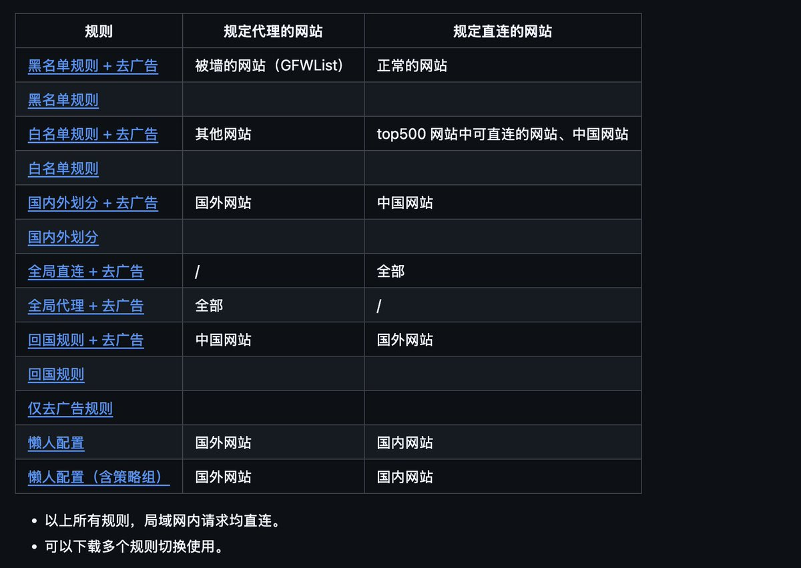
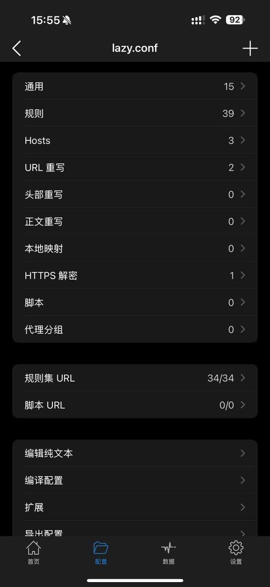

2/7 🎯 我在Github找到了这个开源免费的规则库：
Shadowrocket-ADBlock-Rules-Forever
这个库有很多好处
✅ 完全免费
✅ 每天自动更新
✅ 有专门的"懒人配置"
✅ 还能过滤广告

GitHub 地址：[github.com/Johnshall/Shad…](http://github.com/Johnshall/Shadowrocket-ADBlock-Rules-Forever)gm

## 💬 Replies

### 1 @AI_Jasonyu (鱼总聊AI) (Author)

*Mon Dec 08 07:59:17 +0000 2025*

3/7 🔥 配置很简单，3 步搞定：

1️⃣ 复制规则地址（我用的懒人配置）
2️⃣ 小火箭 → 配置 → 右上角+号 → 粘贴 → 下载
3️⃣ 选中它，断开重连一次
就这么简单！我第一次配置花了不到 2 分钟。

或者直接用 Safari 或 ShadowRocket 扫描二维码即可。q

### 2 @AI_Jasonyu (鱼总聊AI) (Author)

*Mon Dec 08 07:59:18 +0000 2025*

4/7 ⚠️ 重要：记得设置自动更新！

我最开始就是配置完就忘了，几个月后规则过期了还不知道。

现在我设置了每天自动更新，再也不用操心了。

具体怎么设置，可以 关注我 ，下一个分享自动更新规则的教程（完全自动）

### 3 @AI_Jasonyu (鱼总聊AI) (Author)

*Mon Dec 08 07:59:18 +0000 2025*

5/7 🛡️ 避免被封号，记住这 3 点：

1️⃣ 一定要配置规则（最最重要！）
2️⃣ 不要全局代理（浪费流量还容易出事）
3️⃣ 定期更新规则（我设置的自动更新）
我配置后用了大半年，再也没被封过。

### 4 @AI_Jasonyu (鱼总聊AI) (Author)

*Mon Dec 08 07:59:19 +0000 2025*

6/7 💬 我知道很多人跟我一样，看到"配置""规则"这些词就头疼。

但真的，这个比你想象的简单太多了。

就 3 步，2 分钟。

我一个完全不懂技术的人都配置成功了，你也一定可以！

### 5 @AI_Jasonyu (鱼总聊AI) (Author)

*Mon Dec 08 07:59:20 +0000 2025*

7/7 🚀 小火箭应该是iOS上最好用的V工具了吧
虽然是一个付费软件，$2.99美金，但有很多的共享账号，如果大家有需求，可以评论一波，后续给大家分享共享账号的资源。

### 6 @Test7758 (Test8888)

*Tue Dec 09 14:46:49 +0000 2025*

@AI\_Jasonyu 这个必须支持一下

