# 📰 Claude 稳定使用4年 + 不封号终极指南：静态住宅IP + 指纹浏览器 + 优质付款卡

📌 这是目前最系统、最实用的 Claude 防封号方案，三件套组合使用，亲测稳定。文章较长，建议先收藏，对照步骤慢慢操作。

# 先说结论：为什么你的 Claude 老是被封？

用过 Claude 的人，几乎都经历过这个噩梦：

刚充完 Pro 会员，兴冲冲打开用了两天，然后——

> "Your account has been disabled after an automatic review of your recent activities."

💔 钱没了，号没了，心态也有点崩。

这段时间，Anthropic 对部分国家和地区的账号风控明显收紧，很多国内用户都不同程度遇到了 Claude 封号的问题。前阵子它也公开提到，部分 AI 公司存在通过大量账号进行模型蒸馏的情况，这让整个平台的审核和限制变得更敏感了。

我自己踩过这个坑，身边也有不少朋友遇到过类似情况。看了很多一线运营者的真实经验后，我大概摸清了 Claude 封号背后的一些判断逻辑：

> Claude 的风控系统，本质上是在判断你是不是一个“真实的海外用户”。

它会综合评估你的 IP 地址、浏览器指纹、设备信息、付款方式，以及你的使用行为。只要有一个维度露出破绽，系统就会把你标记为“可疑账号”，然后封掉。

所以，防封号的核心思路只有一句话：在 Claude 眼里，你就是一个住在美国的普通用户，用真实的设备、稳定的网络、正规的银行卡在使用它。

今天这篇教程，就是帮你把这三件事做到位：

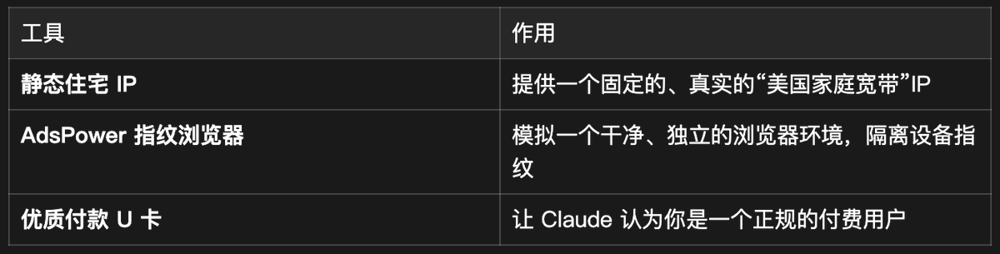

三件套缺一不可。单独用其中一个，效果大打折扣；组合使用，才是真正的稳定之道。

# 一、为什么普通机场 + 普通浏览器不够用？

很多人以为，只要开着 VPN 就万事大吉了。但这恰恰是最大的误区。

## 1、普通机场的问题：

机场的 IP 是成百上千人共用的。今天你用这个节点，明天另外一百个人也在用，其中可能有人已经用它干了各种违规操作。这种 IP 在 Claude 的风控数据库里，早就是“高风险”标签了。

更要命的是，机场 IP 是动态的——你每次连接可能都是不同的 IP，前一分钟显示在美国，后一分钟就跳到日本了。这种 IP 跳动，在风控系统眼里是最高级别的红旗。

## 2、普通浏览器的问题：

你的浏览器会暴露大量信息：操作系统、屏幕分辨率、安装的字体、时区、Canvas 指纹……这些信息组合起来，就是你独一无二的“数字身份证”。

如果你同时用同一个浏览器登录 Claude 和国内网站，Claude 会知道你的时区是中国、语言是中文、访问习惯是中国用户——这就直接暴露了你的真实身份。

所以，我们需要的是：

- 一个只属于 Claude 的、干净的浏览器环境（指纹浏览器）

- 一个固定的、真实的、只有你在用的 IP（静态住宅 IP）

- 一张让 Claude 觉得你是正规用户的付款卡（优质虚拟卡）

下面我们一步一步来。

# 二、第一步：搞定静态住宅 IP

> [⚠️](https://abs-0.twimg.com/emoji/v2/svg/26a0.svg) 为什么要先搞 IP，再装指纹浏览器？
因为指纹浏览器配置时需要填入 IP 代理信息，所以 IP 要先准备好。

## 1、什么是静态住宅 IP？

简单理解：普通机场给你的是“酒店 IP”，很多人共用，容易被识别；而静态住宅 IP 给你的是“私人住宅宽带 IP”，是真实家庭用户的网络，只分配给你一个人使用，固定不变。

对 Claude 来说，这种 IP 就像是一个真实住在美国的普通用户在上网，风险极低。

## 2、如何购买静态住宅 IP？

推荐使用 EqualVPN，这是我目前用下来最稳定的静态住宅 IP 服务商之一，支持美国节点，IP 质量高，支持支付宝付款。

通过 CN2 GIA 专线直连，无需链式配置，导入订阅链接就可以使用。对国内用户非常友好。

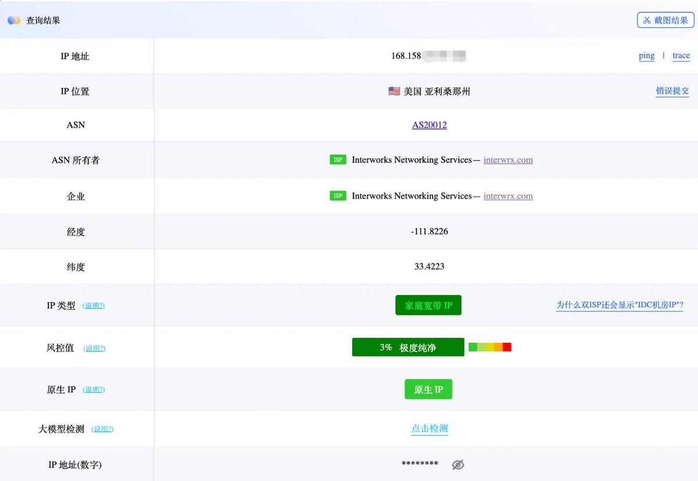

而且目前多个平台测试下来，全都是非常纯净的家庭宽带 IP，我觉得是可以放心使用的。

## 3、注册地址：

👉[ https://www.equaldcdn.com/?ref=8b0ecd560](https://www.equaldcdn.com/?ref=8b0ecd560d)d

通过邀请链接注册，可以享受八折优惠。

## 

## 4、购买步骤：

1、打开注册链接，填写邮箱和、密码、验证码完成注册

2、登录后，在 Dashboard 页面点击「购买套餐」

3、选择套餐，这两个都行，我用的 PRO+版本（建议先买一个月试用，稳定后再续费）

4、用支付宝完成付款

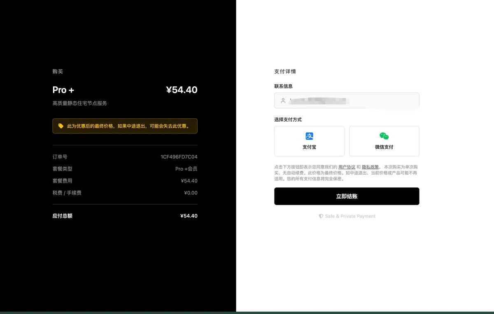

5、购买成功后，进入「开始使用」页面，点击“开始配置”按钮，然后按照页面的提示进行操作

由于给的是一个订阅地址，而不是一个端口信息，所以这里，我先教大家怎么把节点配置到 Clash Verge 里面。

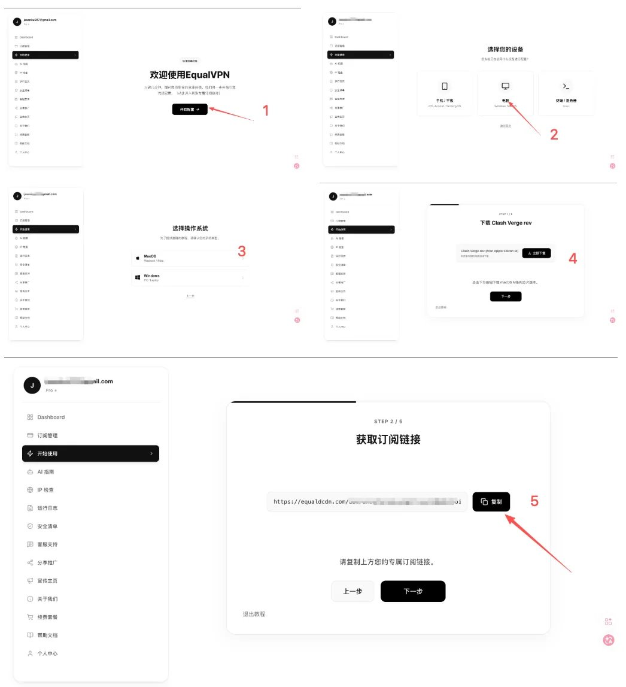

6、在页面获取到订阅地址之后，打开 Clash Verge，切换到「订阅」，粘贴刚才的订阅链接，然后点击“导入”

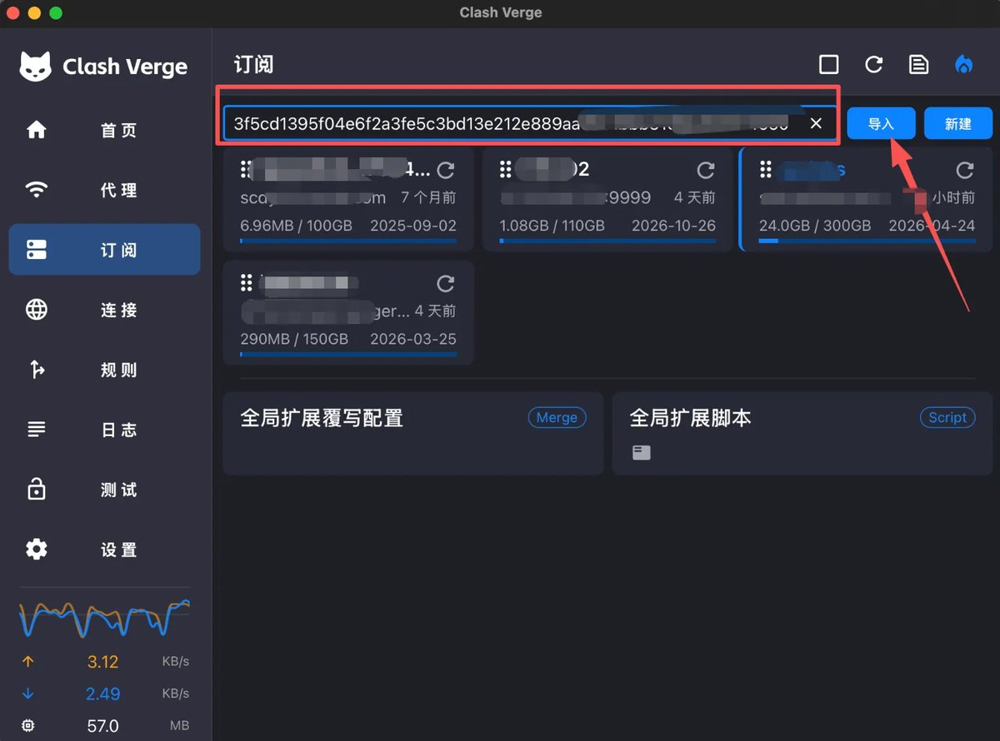

7、双击“EqualVPN”，切换到这个节点

完成这一步之后，其实你的本地浏览器使用的已经是静态住宅 IP 了。如果想要你其他软件也走静态住宅，你可以打开 Clash Verge 的虚拟网卡模式

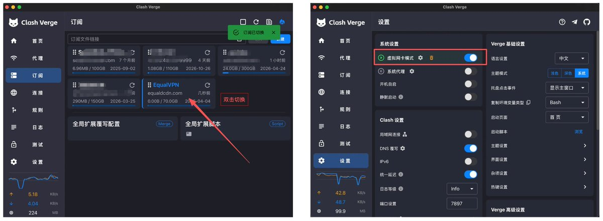

手机配置：和上面的同理，先获取到订阅地址，然后导入到 Shadowrocket。

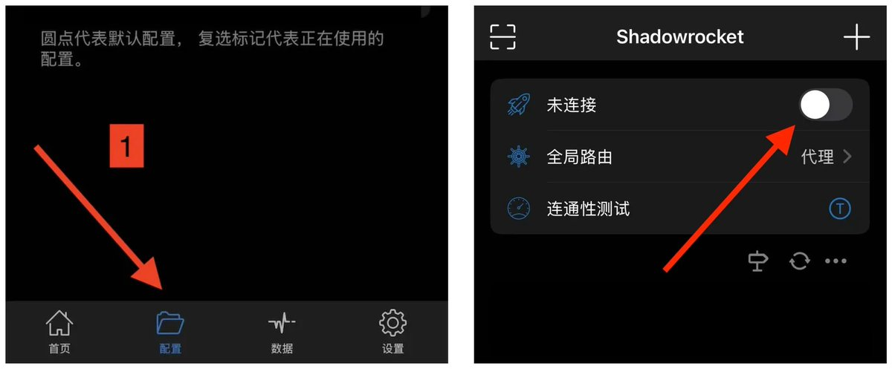

A、打开小火箭，它通常会自动检测剪贴板。如果没有，请点击配置-&gt;配置右上方的加号从 URL 下载配置，点击使用配置。

B、开启顶部的连接开关。首次连接会弹出 VPN 权限确认，请点击 ‘Allow’ 或 ‘允许’。

## 5、接下来验证 IP 质量

拿到 IP 之后，先验证一下质量，确保它足够干净。

打开这三个网站检测：

- IP 类型的检测：[https://ipinfo.io/what-is-my-ip](https://ipinfo.io/what-is-my-ip)，这个可以测试 IP 是否为 ISP 住宅 IP，以下是测试结果：

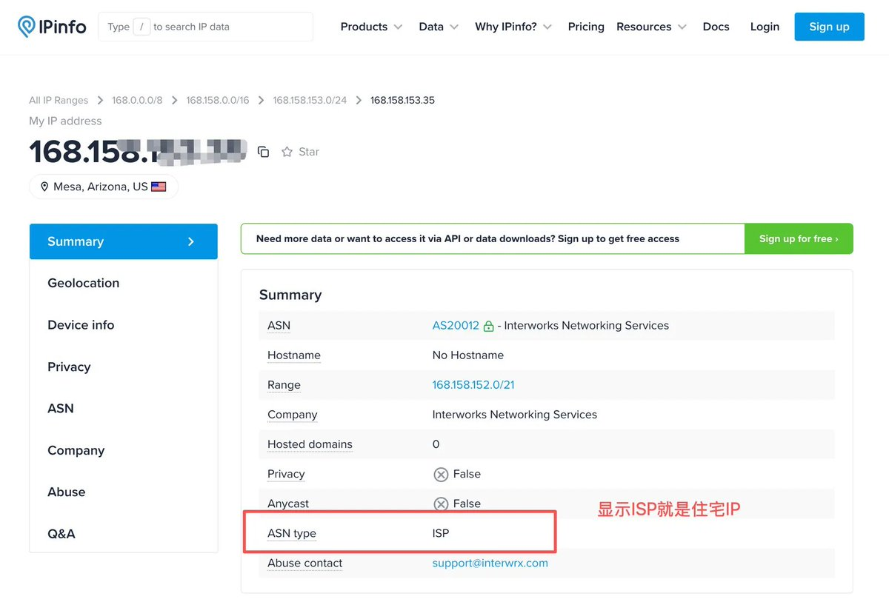

查看 [IPinfo.io](http://ipinfo.io/) 的主页可以看到， OpenAI, Claude, Google 的 IP 信息都由 [IPinfo.io](http://ipinfo.io/) 通过 API 提供，所以我们只要通过了 [IPinfo.io](http://ipinfo.io/) 就相当于...

- IP 风险度检测：https://scamalytics.com/ — 风险分数越低越好，最好在 20 分以下

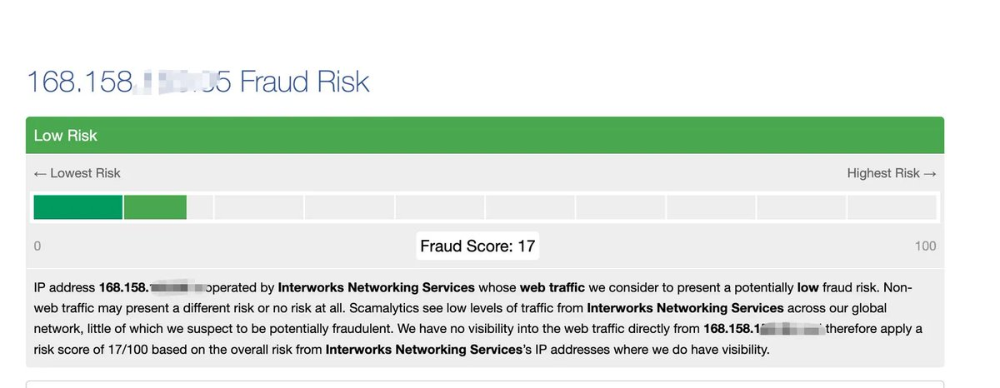

- DNS 泄露检测：[https://browserleaks.com/dns](https://browserleaks.com/dns) — 检测你的 DNS 请求是否泄露给本地运营商

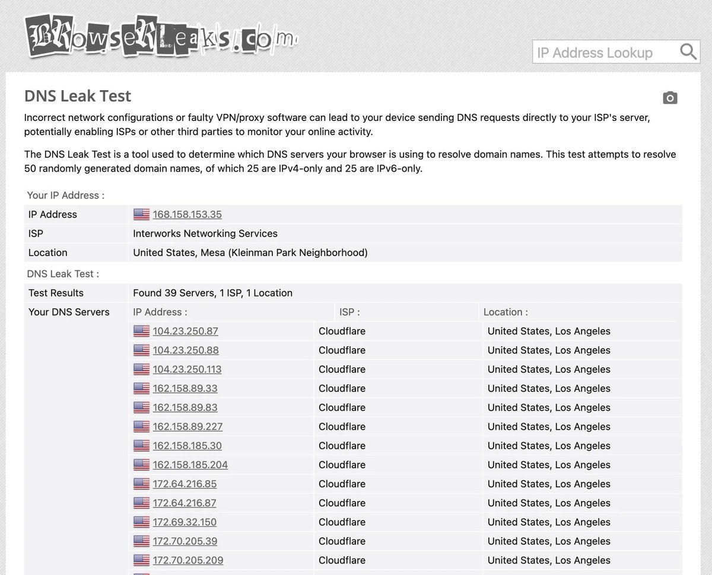

什么是 DNS 泄露？

当你访问 claude.ai 时，浏览器需要先通过 DNS 服务器把域名翻译成 IP 地址。如果你的 DNS 请求没有走代理通道，而是直接发送给了中国电信/联通的 DNS 服务器，那么你访问的所有网站域名都会被运营商记录——即使你开着 VPN，你的浏览记录依然是透明的。

如何判断是否有 DNS 泄露？

打开 [https://browserleaks.com/dns](https://browserleaks.com/dns) ，查看检测结果：

[✅](https://abs-0.twimg.com/emoji/v2/svg/2705.svg) 正常情况：显示的 DNS 服务器归属地应该是美国，ISP 应该是你的代理服务商（比如 EqualVPN 的上游运营商）

[❌](https://abs-0.twimg.com/emoji/v2/svg/274c.svg) DNS 泄露：如果显示中国电信、中国联通、中国移动等国内运营商的 DNS 服务器，说明你的 DNS 请求泄露了如果检测到泄露，需要在 Clash Verge 中开启「虚拟网卡模式（TUN 模式）」，或者手动配置系统 DNS 为代理服务商提供的 DNS 地址。

如果这几个检测出来风险分数偏高，联系服务商更换一个 IP，直到找到干净的为止。

# 

# 三、第二步：安装并配置 AdsPower 指纹浏览器

## 1、什么是指纹浏览器？

你可以把它理解成一个“伪装大师”。

它能为你创建一个完全独立的浏览器环境，模拟成一台位于美国、使用英文系统的电脑。在这个环境里，你的操作系统、屏幕分辨率、时区、字体、Canvas 指纹……全部都是“美国用户”的样子。

最重要的是，这个环境和你本机的浏览器完全隔离——你在国内网站上的所有痕迹，都不会泄露到这个环境里。

## 

## 2、注册 AdsPower

注册地址：
👉[ https://www.adspower.net/share/launc](https://www.adspower.net/share/launch)h

AdsPower 免费版可以创建最多 2 个浏览器环境，对于个人用户来说也够用了。

有大量需求的话，也可以趁着目前买一送一的活动，入手一个，这波活动还是挺牛的，我黑五续费的时候，才送了半年，亏啊\~\~\~

1、打开注册链接，用邮箱或谷歌账号注册

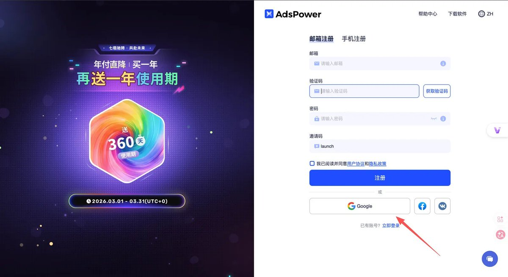

2、注册完成后，点击页面上的「下载客户端」

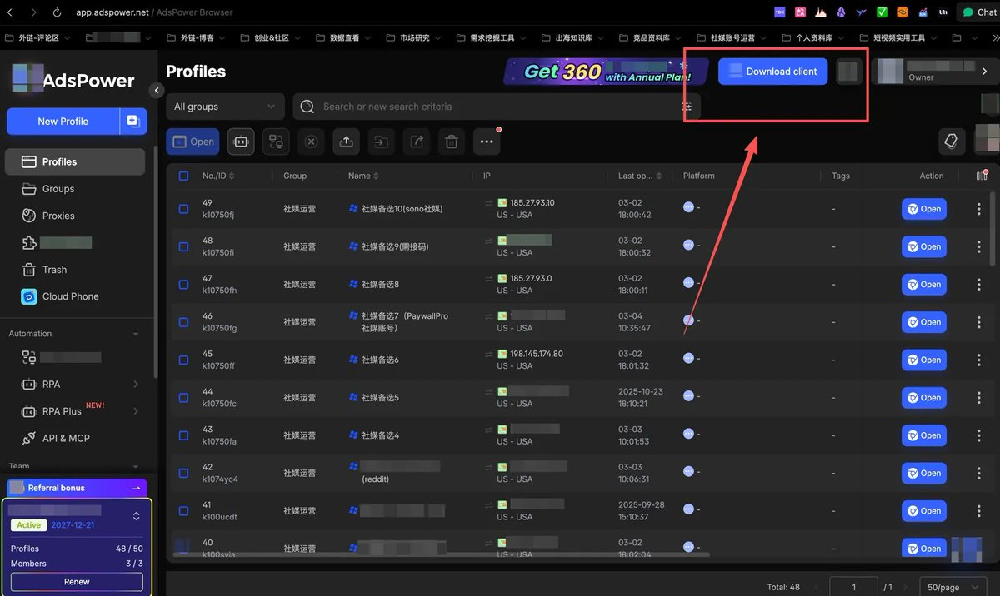

3、根据你的系统选择下载版本（Windows 64 位 / Mac Intel / Mac M 芯片

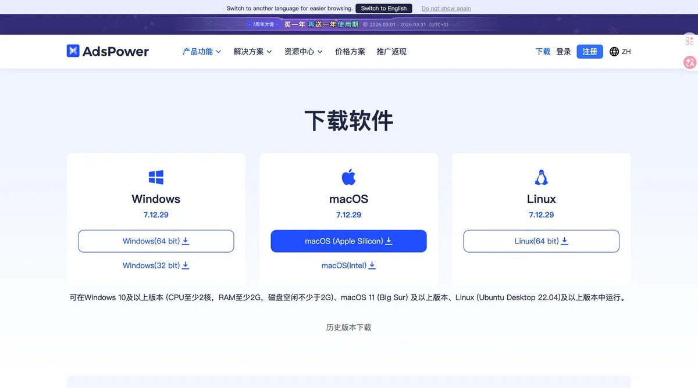

4、下载完成后，双击安装包，按提示完成安装

5、打开 AdsPower 客户端，用刚才注册的账号登录，下面，是登录后的界面

我已经是 Adspower 的 5 年老用户了，我这边创建了 48 个环境。

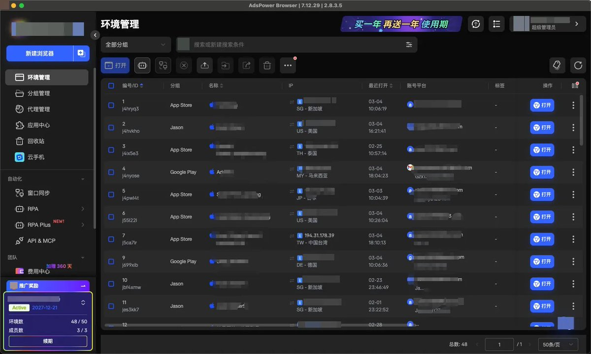

## 

## 3、新建一个专属 Claude 的浏览器环境

3.1 登录后，点击左上角的「新建浏览器」按钮。

3.2 基础信息设置：

- 名称：填写 Claude（方便识别）

- 浏览器版本：点击下拉框，选择最新的 Chrome 版本（比如 Chrome 133）

- 操作系统：选择 Windows 11 或 macOS，随便选一个

- 其余的按我的图中标注来就行

3.3 代理信息设置（关键步骤）：

点击顶部的「代理信息」标签，这里有两种填写方式：

方案 1：使用系统代理（最简单）

代理类型：选择本地直连

IP 查询渠道：这个默认即可

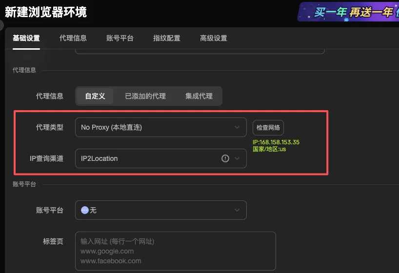

这个方式也就是使用了指纹浏览器的环境，但是节点还是走的本地的节点配置，这个和你本地使用一个新的浏览器是一个道理，只不过指纹浏览器会保持各方面信息的一直，多了一层伪装。

方案 2：手动填写代理

可以手动设置代理端口：

1. 在 Clash 中查看本地代理端口（一般是 127.0.0.1:7890 或 7897）。

1. 在指纹浏览器新建环境时：
代理类型：HTTP 或 SOCKS5
IP:127.0.0.1
端口：Clash 本地端口：7897

1. 保存并启动环境即可。

填写完成后，点击「检查代理」，如果显示「连接测试成功」并且国家显示为「US（美国）」，就说明配置正确了。

> [⚠️](https://abs-0.twimg.com/emoji/v2/svg/26a0.svg) 如果显示连接失败，检查一下代理信息是否填写正确，或者联系客服确认代理是否正常。

其他的信息全部默认就行，最后点击「确定」，保存这个浏览器环境。

## 

## 4、验证指纹浏览器的效果

在 AdsPower 主界面，找到刚才创建的 Claude 浏览器，点击「打开」，用 [https://pixelscan.net/](https://pixelscan.net/)这个工具测试了一下，全绿满分。

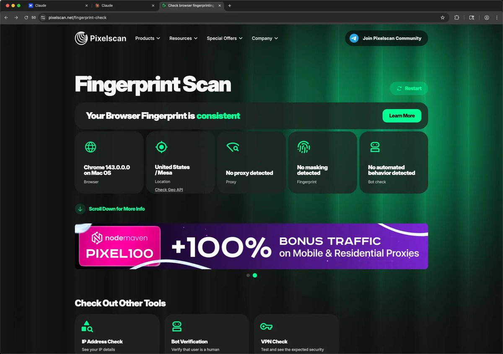

如果一切正常，恭喜你！这个浏览器环境就是你以后专门用来访问 Claude 的地方。

> 🔒 重要原则：以后使用 Claude，永远只在这个指纹浏览器里操作。不要用你本机的 Chrome、Safari 或者 Edge 登录 Claude，哪怕只是看一眼也不行。

# 

# 四、第三步：准备一张优质付款卡

IP 和浏览器都搞定了，最后一关是付款卡。

根据一线运营者的实测经验，付款卡的质量对账号存活时间影响极大：

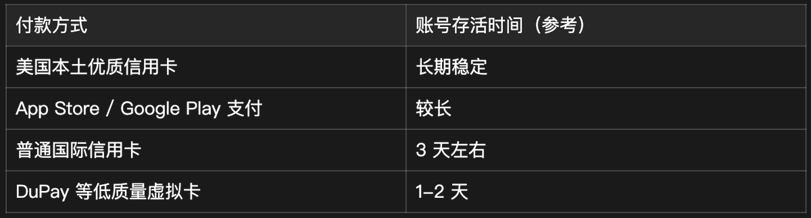

我们的目标是找到一张在 Claude 眼里足够“正规”的付款卡。

## 

## 推荐方案：通过 App Store 订阅

这是目前公认比较稳定的订阅方式之一。通过苹果的 App Store 支付，Claude 会认为你是一个正规的 iOS 用户，账号权重大幅提升。

操作步骤：

1. 在手机上下载 Claude App（需要美区 Apple ID）

1. 打开 Claude App，点击「Upgrade to Pro」

1. 选择订阅方案，用你的美区 Apple ID 绑定的付款方式完成支付

> 💡 如果你没有美区 Apple ID，可以用礼品卡充值的方式购买，不需要绑定信用卡。不会充值的，后期我专门出一期教程。

## 

## 备选方案：使用 Fiat24 联名卡（Bitget Wallet 卡）

如果你没有美区 Apple ID，可以考虑使用 Bitget Wallet 卡，这是目前口碑较好的加密虚拟卡之一，底层是瑞士 Fiat24 银行，卡段质量不错。

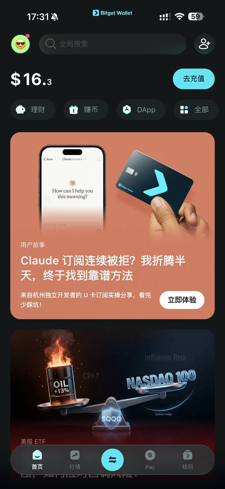

申请入口：Bitget Wallet App → 赚币中心 → 免费开通 Bitget 钱包卡

> [⚠️](https://abs-0.twimg.com/emoji/v2/svg/26a0.svg) 注意：尽量避免使用 DuPay、各种低质量虚拟卡订阅 Claude Pro，这类卡被封号的概率非常高。

可以填写邀请码：yuzong888

有邀请码的用户可获得几个福利

• 首次刷卡消费即返 5U（每周四发放）

• 每月 400U 消费 0 手续费

# 五、第四步：注册并登录 Claude

三件套都准备好了，现在可以正式注册 Claude 了。

全程在指纹浏览器里操作，不要切出去！

## 1、注册账号

1. 在指纹浏览器里，打开 https://claude.ai

1. 点击「Sign up」，用 Gmail 邮箱或者 outlook 邮箱注册（推荐，成功率更高）

1. 输入邮箱，点击「Continue」

1. 去邮箱查收验证邮件，点击邮件里的链接完成验证

1. 填写手机号接收验证码

1. 输入验证码，完成注册

📱 关于手机号：如果你有美国实体手机号（比如 Tello、T-Mobile、PayGo、ENC 等），直接用最好。

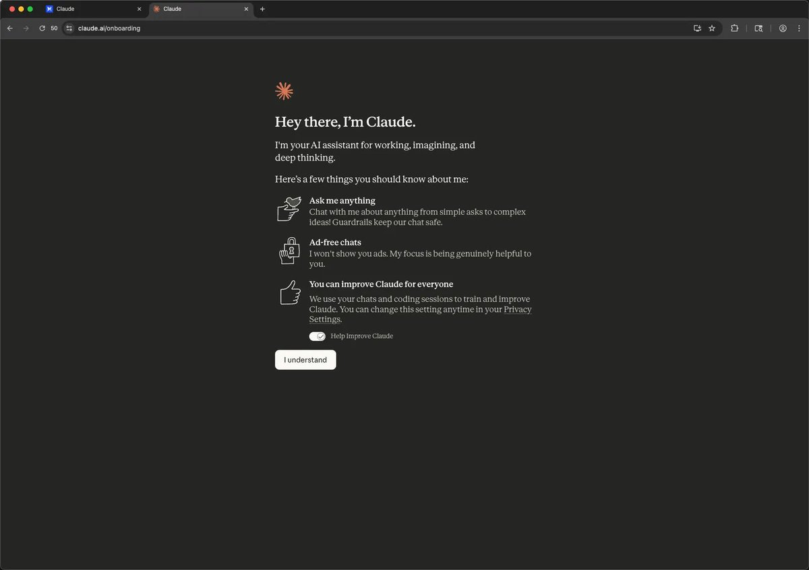

## 

## 2、订阅 Claude Pro

注册完成后，建议立刻订阅 Pro，不要用免费版“试用”几天再订阅——免费版的使用行为可能会影响账号画像。

按照上面第三步的方案，完成 Pro 订阅。

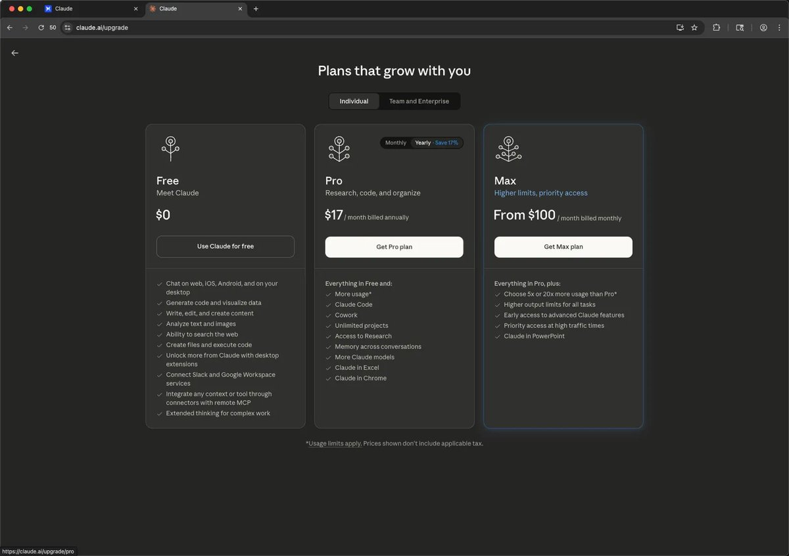

# 六、日常使用的注意事项

账号注册好了，日常使用也要注意几点，才能长期保持稳定：

[✅](https://abs-0.twimg.com/emoji/v2/svg/2705.svg) 应该做的：

- 每次使用 Claude，都在 AdsPower 指纹浏览器里打开

- 保持使用同一个静态 IP，不要随意切换

- 有条件的话，在手机 Claude App 上也保持登录（增加“真实用户”的账号权重），手机端也绑定一个住宅 IP

- 日常像普通用户一样使用，聊天、写作、编程都可以

[❌](https://abs-0.twimg.com/emoji/v2/svg/274c.svg) 不应该做的：

- 不要在本机浏览器登录 Claude

- 不要频繁切换 IP 或节点

- 不要在手机和电脑同时登录，除非确认两边 IP 完全一致

- 不要尝试让 Claude 生成违规内容（这是最直接的封号原因）

- 不要使用低质量虚拟卡订阅

> 💡 一个提升账号权重的小技巧：在手机 Claude App 上保持登录，偶尔日常聊聊天，就像用 ChatGPT 一样。来自一线运营者的经验：有手机 App 长期登录记录的账号，即使遇到高负载使用，被封的概率也极低。

# 

# 七、如果还是被封了，怎么办？

即使做了这么多防护，也不能保证 100% 不被封。如果不幸遇到封号，可以尝试：

1\. 发邮件申诉

向 usersafety@anthropic.com 发送申诉邮件，说明你的账号情况。如果你确实没有违规，有一定概率找回。

参考邮件模板：

Dear Anthropic Team,

I am writing to appeal the recent suspension of my Claude account. 
I have been using Claude for legitimate personal use and have not 
violated any terms of service.

My account email: \[你的邮箱\]
Approximate suspension date: \[封号日期\]

I would appreciate a review of my account and hope to have it reinstated.

Thank you for your time.

2\. 重新注册

如果申诉无果，用新邮箱、新手机号，按照本教程重新走一遍流程。有了指纹浏览器 + 静态 IP 的保护，新账号的存活率会高很多。

# 

# 八、总结：三件套清单

1、静态住宅 IP：EqualdCDN

👉[ https://www.equaldcdn.com/?ref=8b0ecd560](https://www.equaldcdn.com/?ref=8b0ecd560d)d

2、指纹浏览器：AdsPower

👉[ https://www.adspower.net/share/launc](https://www.adspower.net/share/launch)h

3、付款卡：Bitget Wallet 卡

[https://web3.bitget.com/share/1cAw3D?inviteCode=yuzong888](https://web3.bitget.com/share/1cAw3D?inviteCode=yuzong888)

三件套的总成本：

- 静态住宅 IP：约 $5-9/月（视套餐而定）

- AdsPower：免费（2 个环境免费使用）

- 付款卡：Bitget Wallet 卡免费开卡，App Store 礼品卡按需购买

相比 Claude Pro 每月 $20 的订阅费，这点额外成本完全值得——毕竟你买的是长期稳定使用的权利，而不是用几天就被封的一次性体验。

# 

# 写在最后

Claude 真的很好用，编程、写作、分析，很多场景比 GPT 更强。但它的封号机制也确实让人头疼。

这套三件套方案，是我研究了大量一线经验之后整理出来的，目前来看是最系统、最稳定的解法。

按照教程一步一步来，不要偷懒跳过任何一步，你的 Claude 账号就能稳稳地用下去。

相关工具链接汇总：

- 静态住宅 IP：[https://www.equaldcdn.com/?ref=8b0ecd560d](https://www.equaldcdn.com/?ref=8b0ecd560d)

- AdsPower 指纹浏览器：[https://www.adspower.net/share/launch](https://www.adspower.net/share/launch)

- IP类型检测：[https://ipinfo.io/what-is-my-ip](https://ipinfo.io/what-is-my-ip)

- DNS泄露测试：[https://browserleaks.com/dns](https://browserleaks.com/dns)

- IP 一致性检测：https://ip111.cn/

- IP 风险度检测：https://scamalytics.com/

- 指纹浏览器伪装检测：[https://pixelscan.net/](https://pixelscan.net/)

- Claude 官网：https://claude.ai

这一套下来，你的Claude绝对稳稳地。

如果这篇教程对你有帮助，欢迎：

- 点赞收藏 📌 方便以后查阅

- 转发分享 🔄 帮助更多被封号困扰的朋友

我会持续分享更多 AI 工具实用教程和出海经验，关注我，不错过下一篇干货 👀

#Ad 带有AFF链接，按要求标记下AD\~

### 🖼️ Attached Media

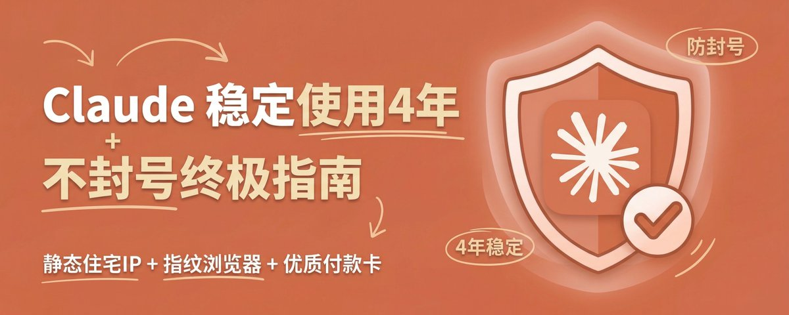

## 💬 Replies

### 1 @AI_Jasonyu (鱼总聊AI) (Author)

*Sat Mar 07 13:46:07 +0000 2026*

声明：文章中虽然带有我的aff广告链接，方法都是通用的，大家根据自己的需求去选购住宅IP，指纹浏览器，U卡即可，并非一定要用我推荐的。但是鱼总都是良心推荐，大家放心使用

### 2 @bozhou_ai (泊舟)

*Sat Mar 07 14:52:51 +0000 2026*

@AI\_Jasonyu 这个我喜欢

### 3 @AI_Jasonyu (鱼总聊AI) (Author)

*Sat Mar 07 14:53:41 +0000 2026*

@bozhou\_ai 泊舟有过这个经历吗？

### 4 @zstmfhy (AI奶爸)

*Sat Mar 07 15:22:32 +0000 2026*

@AI\_Jasonyu 看得出鱼总的用心

### 5 @AI_Jasonyu (鱼总聊AI) (Author)

*Sat Mar 07 15:57:10 +0000 2026*

@zstmfhy 谢谢🙏

### 6 @Nicole_yang88 (泥伏雷闯关记)

*Sun Mar 22 12:09:08 +0000 2026*

@AI\_Jasonyu 非常棒，我试试，下次图片一定加水印🥳防止被搬运

### 7 @AI_Jasonyu (鱼总聊AI) (Author)

*Sun Mar 22 12:10:36 +0000 2026*

@Nicole\_yang88 加水印有什么好的方案吗？

### 8 @hiheimu (赖叔 | LaiShu.ai)

*Sat Mar 07 11:47:55 +0000 2026*

@AI\_Jasonyu 注册claude的时候会要求手机号
这个有点难破

支付卡的话，google play、safepay的卡可以吗

### 9 @AI_Jasonyu (鱼总聊AI) (Author)

*Sat Mar 07 11:58:08 +0000 2026*

@hiheimu ip正常的话，注册时候是不需要手机号的，邮箱就可以了。这两天我也在注册新账号，我全程没要。

google play也是可以的，safepal没试过。

### 10 @ponyodong (波妞PONYO)

*Sat Mar 07 11:43:36 +0000 2026*

@AI\_Jasonyu mark 好好研究🧐

### 11 @AI_Jasonyu (鱼总聊AI) (Author)

*Sat Mar 07 11:46:17 +0000 2026*

@ponyodong 保证绝对有用

### 12 @dngzhngji3 (do)

*Sun Mar 08 03:41:32 +0000 2026*

@AI\_Jasonyu 过来支持一把，小白表示感谢

### 13 @AI_Jasonyu (鱼总聊AI) (Author)

*Sun Mar 08 05:13:49 +0000 2026*

@dngzhngji3 谢谢支持🤟

### 14 @yahaclass (YAHA學堂)

*Sat Mar 07 12:46:46 +0000 2026*

@AI\_Jasonyu 这是模型错了 还是计算错了 

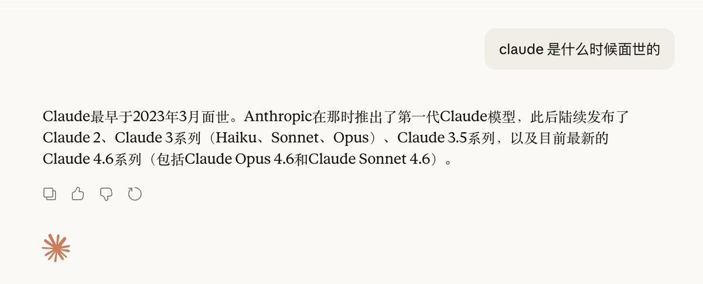

### 15 @AI_Jasonyu (鱼总聊AI) (Author)

*Sat Mar 07 12:47:39 +0000 2026*

@iammattx 是我算错了，3年多\~

### 16 @Web3man1020 (JackL-🌳)

*Sun Mar 08 03:09:33 +0000 2026*

@AI\_Jasonyu 鱼总 指纹浏览器这里检查代理一直失败 

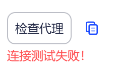

### 17 @AI_Jasonyu (鱼总聊AI) (Author)

*Sun Mar 08 07:39:44 +0000 2026*

@Web3man1020 配置好了吗？

### 18 @YaseWings (自律小嘉同学)

*Sat Mar 07 15:01:18 +0000 2026*

@AI\_Jasonyu 有没有人试过在网页版的 Claude 用 Google Play 进行订阅？这种方式稳定吗？

### 19 @AI_Jasonyu (鱼总聊AI) (Author)

*Sun Mar 08 00:26:33 +0000 2026*

@YaseWings 理论可行的

### 20 @lichunyuan0117 (满少卿)

*Sun Mar 08 07:31:09 +0000 2026*

@AI\_Jasonyu 我明明用的就是这个isp，还是顶级套餐，为什么dns解析还是会被看出来是中国？

### 21 @AI_Jasonyu (鱼总聊AI) (Author)

*Sun Mar 08 07:40:10 +0000 2026*

@lichunyuan0117 tun模式打开

### 22 @Henry_Yangs (Henry Yang)

*Sun Mar 29 15:20:41 +0000 2026*

@AI\_Jasonyu 请问下IP已经是住宅IP了，为啥adspower里检测出来的ip和国家还是cn？ 

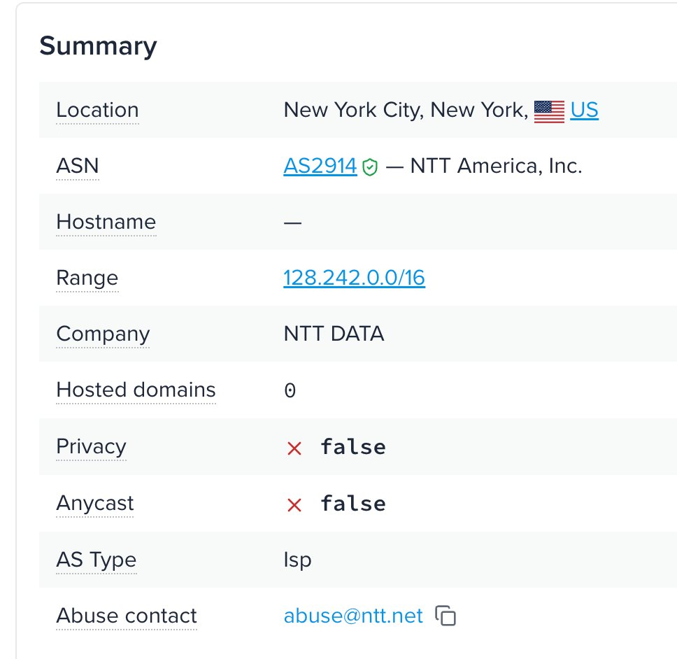

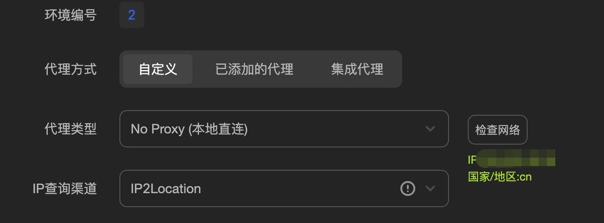

### 23 @AI_Jasonyu (鱼总聊AI) (Author)

*Sun Mar 29 15:22:03 +0000 2026*

@Henry\_Yangs 问下AdsPower的客服，我估计是设置里面，没有设置走代理的原因。

### 24 @Alepha183884 (Alepha)

*Sat Mar 07 15:42:28 +0000 2026*

@AI\_Jasonyu 如果使用桌面版App怎么办博主

### 25 @AI_Jasonyu (鱼总聊AI) (Author)

*Sun Mar 08 00:27:12 +0000 2026*

@Alepha183884 桌面版不影响，虚拟网卡模式就是解决这个问题

### 26 @Luoaloa (Luoaloa)

*Sat Mar 07 15:59:18 +0000 2026*

@AI\_Jasonyu 我提个伪装的要点。时区和语言。

### 27 @AI_Jasonyu (鱼总聊AI) (Author)

*Sun Mar 08 02:55:17 +0000 2026*

@Luoaloa 指纹浏览器就是解决这些的

