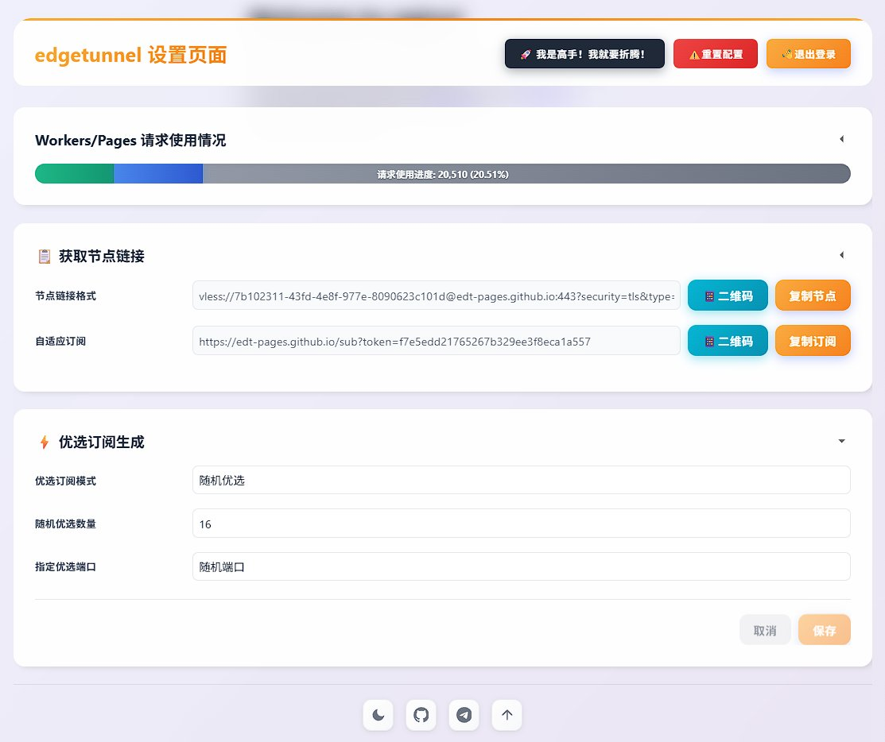

兄弟们炸裂了！白嫖党的春天又来了 一个Cloudflare账号干翻所有付费机场

最近翻到一个神器，给我看傻了 真不是夸张

简单粗暴说就是：你只要手里有一个Cloudflare账号，外加一个域名（域名才几块钱一年是吧），剩下的事情就交给这个工具

啥事？无限节点、永久免费、油管4K随便拉，Netflix刷剧不卡顿，ChatGPT直接丝滑访问 这玩意儿不香吗？

我自己上手试了下，部署难度对小白也算友好，跟着教程一步步走，十分钟搞定。关键是稳定性比某些一个月几十块的机场还强，毕竟人家走的是Cloudflare自家的CDN通道，全球节点你随便挑

来，给你们把链接都整理好了，照着抄作业就完事了：

1️⃣ 工具开源地址（star一下大佬不亏）
🔗[github.com/cmliu/edgetunn…](https://github.com/cmliu/edgetunnel)P

2️⃣ Demo演示站点，先看看长啥样
🔗 [edt-pages.github.io/admin/](https://edt-pages.github.io/admin/)

3️⃣ 保姆级图文教程，看完不会算我输
[cdn.blog.cmliussss.com/p/edt2/](https://cdn.blog.cmliussss.com/p/edt2/)2oA

一句话总结：还在花冤枉钱买机场的兄弟，看完这条推文当场清醒。白嫖才是男人的浪漫，懂？

### 🖼️ Attached Media

## 💬 Replies

### 1 @xupaopaogm (徐跑跑)

*Sun May 24 09:48:09 +0000 2026*

@NFTCPS 昨天就在用Cloudflare自建VP S

### 2 @Btcniumowang (牛魔王 | OP_CAT)

*Mon May 25 05:02:07 +0000 2026*

@NFTCPS 这波白嫖真顶

### 3 @ablenavy (iGarlic)

*Sun May 24 09:57:56 +0000 2026*

@NFTCPS 男人的浪漫是白嫖，但男人的发际线可能败给部署时的各种报错。😂

### 4 @zxc68984008 (mmm666)

*Sun May 24 10:07:24 +0000 2026*

@NFTCPS Cloudflare+域名的组合真敢想，免费方案直接拉满性价比，技术流的浪漫莫过于此。无需复杂配置，轻量化方案却能撬动整套网络服务，细节处见真章。

### 5 @Lzstudio1 (MR.刘)

*Sun May 24 10:03:44 +0000 2026*

@NFTCPS 白嫖太舒服了

### 6 @taozi0929 (桃子🕊️| Gate Card刷遍全球)

*Sun May 24 10:05:53 +0000 2026*

@NFTCPS 这个工具比白嫖机场更有技术含量

### 7 @ohouhou717 (Weilan)

*Sun May 24 11:08:15 +0000 2026*

@NFTCPS 这波操作确实顶

### 8 @maolarou890604 (毛式风味腊肉)

*Sun May 24 11:33:10 +0000 2026*

@NFTCPS 好多年前就有这种，看视频没问题，但ip不固定，并且比较脏，不适合登一些重要账号

### 9 @Xdjg18A9 (Brothers Tavern)

*Sun May 24 11:32:45 +0000 2026*

@NFTCPS 看一下这个教程，完全可以免费用，一分钱不要花，自由上网[x.com/Xdjg18A9/statu…](https://x.com/Xdjg18A9/status/2054837512716394623)

### 10 @ChuzouX (chuzouX)

*Sun May 24 13:43:33 +0000 2026*

@NFTCPS 依旧edgetunnel 想用明白的话可以加一下cm大佬的tg群 这个部署到worker容易被cloudflare盯上然后死掉 得更新然后重新部署 速度也就那样 自用还是找点别的好一点 这个就当应急用吧

### 11 @manofmatch2023 (奇点)

*Sun May 24 12:14:55 +0000 2026*

@NFTCPS 这么搞，早晚要封掉的，虽然我搭了，但我平时都不用，只作为应急使用。

### 12 @FHwan1314 (gang)

*Sun May 24 17:44:54 +0000 2026*

@NFTCPS 聪明反被聪明误，有这个精力不如想办法让自己摆脱墙内

### 13 @0x_wowo (alex.xu)

*Sun May 24 13:05:00 +0000 2026*

@NFTCPS 国人都扑上来就成坟场了，还是花点儿钱自己搞个独立自用的稳

### 14 @kasahlee (李阳)

*Mon May 25 08:50:22 +0000 2026*

@NFTCPS 没啥太大用，说实话。ip 跳，时不时就不稳了。基本用不了 AI 相关的网。弄来弄去纯折腾，浪费时间。免费的才是最贵的。

### 15 @ColorWolf2006 (Arron2006)

*Sun May 24 11:41:00 +0000 2026*

@NFTCPS 其实，我之前看都没看教程 全交给AI，结果它真搞定了

### 16 @Timking2025 (Tim king)

*Mon May 25 04:53:44 +0000 2026*

@NFTCPS 难用的要命

### 17 @FengKenken60272 (Kenken Feng)

*Sun May 24 10:55:58 +0000 2026*

@NFTCPS 别宣传了，这个我已经用了快两年了。用的人一多，就over.

### 18 @Lin1445753 (巫师)

*Sun May 24 17:28:16 +0000 2026*

@NFTCPS 本人小白，半个月前跟着教程自己做的，大概半个小时，教程有一个哥发过

### 19 @ZhiMao99123 (一只小肥猫)

*Sun May 24 14:42:35 +0000 2026*

@NFTCPS 别搞，正在拿这个看

### 20 @Huouo908070 (伟大)

*Sun May 24 12:47:54 +0000 2026*

@NFTCPS @demonyins 删了吧，别分享

### 21 @yeweiyangfou (成教授有话说)

*Sun May 24 13:04:58 +0000 2026*

@NFTCPS 做个备用就行了。
实际使用还得自己的vps。

