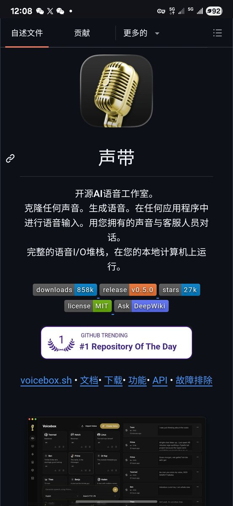

兄弟们，付费语音工具可以卸载了

Voicebox 来了，开源免费，直接把 ElevenLabs 和 WisprFlow 两个付费大佬一锅端。

🔗 链接:[github.com/jamiepine/voic…](https://github.com/jamiepine/voicebox)D

能干啥？

1️⃣ 克隆任何人的声音
2️⃣ 全局语音输入随时用
3️⃣ 让你的 AI Agent 直接开口说话

最关键的是——100% 本地跑，不要 API Key，不限次数，数据压根不出你电脑。

这种东西以前要花钱买，现在白嫖就行。

### 🖼️ Attached Media

## 💬 Replies

### 1 @ChainLog7 (joker)

*Fri May 22 04:22:00 +0000 2026*

@NFTCPS 哇 可以本地跑！好心动🥹

### 2 @MainatJM (Josep M. Mainat)

*Fri May 22 21:22:56 +0000 2026*

@NFTCPS @threadreaderapp unroll

### 3 @ohouhou717 (Weilan)

*Fri May 22 04:22:40 +0000 2026*

@NFTCPS 本地跑确实香

### 4 @ohouhou717 (Weilan)

*Fri May 22 04:22:36 +0000 2026*

@NFTCPS 本地跑是真香，省钱了。

