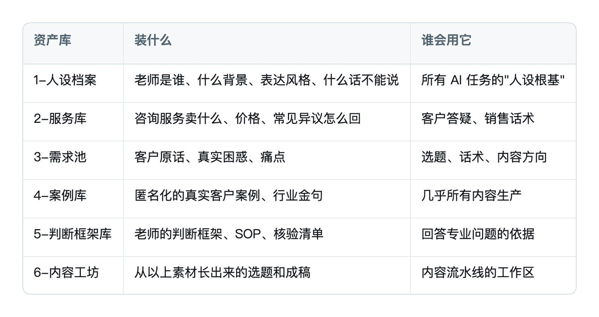
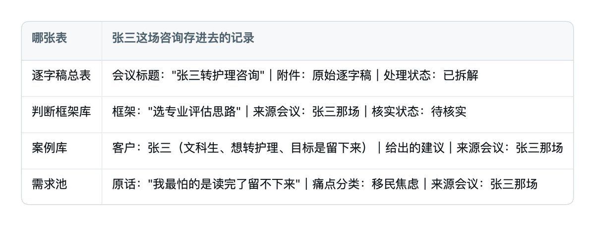
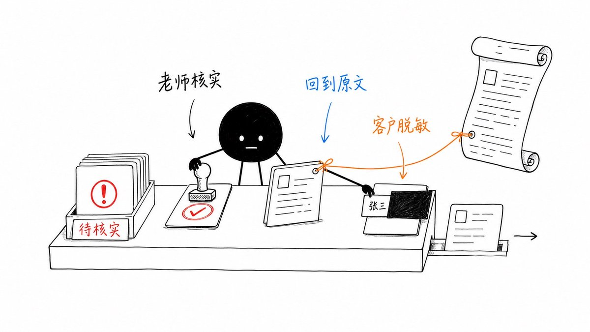
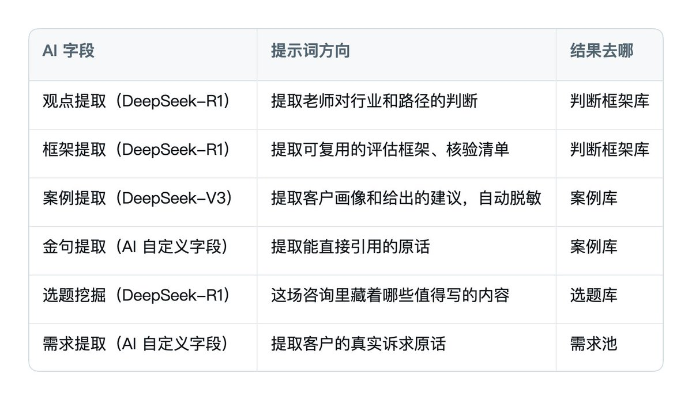
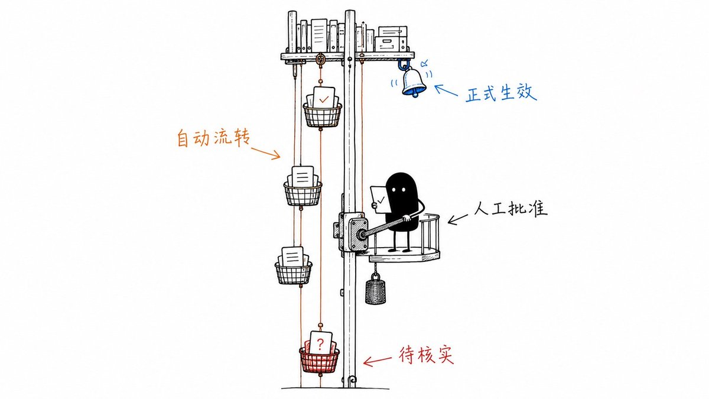

# 📰 用飞书多维表格打造你的数字分身

如何把一个人的知识，变成一个多人可用的知识库，再基于这个知识库做出"数字分身"？

案例主人 @rwayne 是名留学公司老板，专注澳洲留学，此类高客单业务有一个典型痛点： 最值钱的东西，全在老板脑子里。

每次新的咨询，或者招个助手，都得把重复的内容再讲一次。 

那这些内容是否可以沉淀，又如何方便他人复用？

让我们用飞书多维表格，把这些知识完成三级进化：

第一级，把知识存成结构化的数据库；

第二级，让表格自己加工知识；

第三级，让它开口说话，替老师回答问题。

下面一级一级讲。

---

# 第 1 章 第一级进化：把表格当数据库用

## 1.1 先定框架，再装货

知识库不是网盘，别把逐字稿、录音、PDF 一股脑丢进去，存了等于没存，因为没有人（包括 AI）能高效地用它。

需要做的是先定结构。一个咨询业务的知识，本质上就六种形态： 你是谁、你卖什么、客户要什么、你做成过什么、你怎么判断、你怎么对外表达。

按结构划分可以分为六类：

这个结构有一个关键设计：每个库都对应"下游有谁要用它"。 

存进去的每一条资料，都是为了将来被调出来回答某类问题。 

没有双向链接的资料，就不应该存。

## 1.2 六个筐 = 一个多维表格里的六张数据表

一个多维表格就是整个知识库，六类资产库就是里面的六张数据表。

拿一场具体的咨询举例： 一个叫张三的文科生来咨询"要不要转护理专业去澳洲"。

这一小时的咨询结束后，会变成四张表里的四条记录。直接看表里长什么样：

看出关联关系没？ 每条记录的尾巴上，都有"来源会议"和"核实状态"以及"张三"这个 ID。

这就是整套架构的三条地基规则：

规则一：AI 写的作业，老师批了才算数。

"核实状态"这个格子只有两个按钮—"待核实"和"已核实"，不能手动打字。

AI 刚拆出来的资料一律是"待核实"，老师亲手点成"已核实"才能被引用。

为什么这么严？ 

签证政策、学费这种信息，错一条就可能害客户做错决定，AI 不能自己给自己打勾。

规则二：每条资料都带着"我从哪来"的链接。

张三的案例、他的需求原话、那条评估思路，都通过"来源会议"格子挂回逐字稿总表里张三那一行。 

哪条资料被质疑了，点一下就能回到原始逐字稿对质——相当于每件商品都贴了溯源码。

规则三：表里永远没有真名。

客户一律用 ID（比如张三），带真实姓名的原始记录只做档案，不进知识库。 这一条是为了脱敏客户关系，懂的都懂。

三条规则的共同点： 不需要人管理，靠表格关联关系执行，执行到关键节点由人来确认。

这一步，我们将内容存进了货架。

---

# 第 2 章 第二级进化：表格自己会干活

多维表格的四件武器——AI 字段、自动化、视图、仪表盘将我们的整个内容资产盘活。

## 2.1 AI 字段：把逐字稿拆进六个筐

一场一小时的咨询，里面混着：

- 客户的真实困惑（"这种歧视是没办法通过情商化解的？"）

- 老师的专业判断（"从就业角度来讲，护理一定大于计算机——我说的这个结论是对于你"）

- 具体到吓人的行业信息（某学校一周只上两个半天课、OSCE 临床模拟考怎么考、带教制度的风险）

- 大量口语废话、寒暄、跑题

AI 字段能怎么帮你？ 

在多维表格里，你可以给一列绑定一段提示词和一个大模型，这一列就会自动对每行数据执行 AI 处理—不用写代码，配置一次，行行生效。 

在"逐字稿总表"里，我给每行逐字稿配了一组 AI 字段，每个字段负责提取一种要素，同一条记录被多个 AI 字段并行处理：

这样新逐字稿粘进来一行，六个 AI 字段并行开跑，几分钟出结果。

比如张三那场"文科生转护理"的咨询，拆出来是：

- 一条方法论（升学路径评估：学生基线→目标偏好→家庭约束→路径对比→风险核验→备选方案）

- 一个匿名案例（人文社科硕士、雅思待考、目标移民）

- 几条金句

- 两个选题（"文科生留学移民选专业的真实逻辑""中介不会告诉你的护理留学三个坑"）

## 2.2 智能标签：让客户需求自己归类

智能标签这个功能，可以用来解决痛点分类： 

你预设一组标签，AI 读完每条记录的内容后自动从中选择贴上。 

预设标签库："路径选择困惑、移民政策焦虑、费用压力、语言门槛、行业避坑、家庭意见分歧"。

每条客户原话进来，AI 自动贴标签。 

单独看这一步不起眼，但它的输出是结构化的多选字段，这意味着—它可以直接喂给仪表盘。

## 2.3 仪表盘：知识库反过来指导业务

在多维表格里建一个仪表盘，按痛点标签分组画饼图，按月份画趋势线。打开就能看到：

- 这个季度客户最焦虑的三件事是什么

- "保录取避坑"类的咨询是不是在变多

- 哪类需求增长最快，对应的内容和产品要不要跟上

知识库不只是往里存，它会反过来告诉你业务该往哪走。 

选题库里下个月写什么，不用拍脑袋，看仪表盘。

## 2.4 自动化：审批流自己跑

当多人写入知识库时，会有被写乱的风险。 

规矩是：AI 拆解可以自动，入库定稿必须过人。

这条规矩用多维表格的自动化来执行—所谓自动化，就是"当表格发生某件事时，自动执行某个动作"，全部在界面上点选配置，不用写代码：

- 新资料拆解完成时 → 自动发飞书消息给老师："有 6 条新资料待核实，来自张三的咨询"（触发=新增记录，操作=发送消息，接收人取字段值）

- 老师把核实状态改成"已核实"时 → 自动通知提交人，资料正式生效（触发=修改记录，操作=发送消息）

- 每周一早上 → 自动把"待核实"清单汇总发到团队群（触发=定时，操作=发送消息）

老师每天花十分钟处理待核实队列，知识库的质量闸门就守住了。

人只做判断，流转全部自动。

## 2.5 视图：一张表，每个人看到自己的工作台

同一份数据，不同角色建不同视图，谁也不打扰谁：

- 老师：筛选"核实状态=待核实"的表格视图，他的每日审批台

- 运营：选题库的看板视图，按"待写/写作中/已发布"分列，拖卡片改状态

- 新来的咨询师：案例库的画册视图，一屏刷案例，比跟着听三场咨询学得快

- 团队所有人：一个表单视图，随手提交新素材（一段客户聊天记录、一个行业信息），不用懂表结构

这里藏着协同数据库最重要的一句心法：永远不要复制数据，只复制视图。数据只有一份，每个人看到的只是它的不同切面。

到这一级，这张表已经是一个会自己运转的知识系统了。

但还差一步——看得到，不等于用得起来。 让一个咨询老师在接客户的间隙打开多维表格翻筛选器？不现实。

真正的目标是：他在飞书聊天框里问一句，答案自己过来。

---

# 第 3 章 第三级进化：表格长出嘴来

## 3.1 多维表格有 API，这是一切的前提

多维表格和 Excel 的又一个本质区别：它的每张表、每条记录，都能被程序读写。 这意味着你可以在它上面接任何东西——包括一个听得懂人话的机器人。

我用的方案是飞书机器人 + Hermes。 

Hermes 是一个把 IM 和 AI Agent 接在一起的路由器，你可以把它理解成多维表格的语音遥控器：

\`\`\`
你在飞书发一句话
  → 飞书机器人收到
  → Hermes 把消息交给 AI Agent
  → Agent 读/写多维表格知识库
  → 结果回到你的飞书聊天框
\`\`\`

装好之后，整个团队和这张表的交互方式变了：不再是"打开表格、找视图、翻记录"，而是说话。

## 3.2 团队实际怎么用

日常就三种用法，全部自然语言：

查。 

半年后，一个和张三情况相似的新客户来了。 

新来的咨询师问机器人："内向的文科生想转护理，之前是怎么建议的？"——机器人从判断框架库调出评估框架，从案例库调出张三的案例，拼成回答，附上来源会议。 新老师问三次，比跟着听三场学得快。

录。 

咨询完，老师把新逐字稿直接发给机器人。 

机器人把它写进逐字稿总表——然后第二级进化那套流水线自动接管：AI 字段拆解、智能标签归类、自动化通知待核实。

改。 

"签证政策更新了，把 485 签证相关的条目都标记为待核实"——机器人批量更新记录的核实状态字段。

注意一个关键点：机器人的每一个动作，最终都落在多维表格的某条记录上。

表是唯一的事实来源，机器人只是嘴和手。 

这保证了不管多少人同时在用，大家看到的永远是同一份数据——这正是多维表格作为协同数据库的老本行。

## 3.3 放开给全团队用，靠三道闸门

多人可以对着机器人说话写库，安全设计比功能更重要。三道闸门：

白名单。

谁能跟机器人说话，配置里写死，双层校验。不在名单里的人，发什么都没用。

分权审批。

任何人都能提交资料，但写入正式知识库前先生成预览，管理员（老师本人）在飞书里明确批准才入库—和第二级的自动化审批流是同一条规矩，只是入口从表格换成了聊天框。

去重防覆盖。

同一份文件重复提交，系统认出来直接返回上次结果； 发现同名资料，整批阻断，绝不静默覆盖。

人人能喂料，但知识库的最终形态始终由老师把关。

数字分身替他干活，不替他做主。

---

# 第 4 章 进化完成：这张表现在是什么

回头看这张表的三级进化： 

第一级它存住了知识，第二级它自己加工知识，第三级它能对话交付知识。 

到这里，"数字分身"这个词就不玄了—它不是虚拟人，不是模仿语气的聊天机器人，它是这张表的最终形态，分身的是三样东西：

分身了老师的记忆。

咨询里的每个判断、每个案例都在表里，随时可查。

半年前给张三讲过什么，他自己都忘了，表格记得。

分身了老师的判断框架。

判断框架库里存的不是结论，是他做判断的方式——"路径评估六步""留学项目尽调清单"。 

团队拿到的不是抄答案，是照着他的思路想。

分身了老师的时间。

以前团队问他一个问题，占用他一段真人时间。 

现在 80% 的常规问题机器人直接答，他只处理答不了的和批准入库的。

他的时间从"回答重复问题"转移到"生产新判断"。

而新内容又会通过下一场咨询的逐字稿流回表里，形成正向循环。

\`\`\`
咨询（产生新知识）
  → 逐字稿进逐字稿总表
  → AI 字段拆解 → 六张数据表入库 → 老师核实
  → 机器人用它回答团队和客户
  → 老师省下的时间做更多咨询
  → 产生更多新知识 …
\`\`\`

---

# 结语

以上方案，不仅适用于留学案例，也适用于任何场景。

你可以基于多维表格与飞书机器人打造出多个数字分身，装下你这个人：你的记忆、你的判断、你的表达，给你的业务提效。

黄小木｜T11级工程师｜内容为codex创作｜持续分享 AI 信息、副业赚钱、程序员转型OPC心得｜X：[@ai\_xiaomu](https://x.com/@ai_xiaomu)

### 🖼️ Attached Media

## 💬 Replies

### 1 @ai_xiaomu (黄小木) (Author)

*Fri Jul 24 07:28:30 +0000 2026*

做你的数字分身有问题加客服咨询 

### 2 @rwayne (Roland.W)

*Fri Jul 24 06:37:56 +0000 2026*

@ai\_xiaomu 我是甲方，我为我的乙方代言，因为里面的案例是我的😂

### 3 @ai_xiaomu (黄小木) (Author)

*Fri Jul 24 06:42:24 +0000 2026*

@rwayne 留学公司老板来了

### 4 @Stanleysobest (Stanley)

*Fri Jul 24 06:42:00 +0000 2026*

@ai\_xiaomu 把老板脑子里的货直接倒进飞书多维表格，AI拆解、自动化审批、机器人对话，一套下来真正的数字分身就成了。

不是那些只会装腔作势的聊天机器人，这才是能干活、能省钱、能复制的真东西。
干就完了。

### 5 @ai_xiaomu (黄小木) (Author)

*Fri Jul 24 07:29:02 +0000 2026*

@Stanleysobest 干就完了

### 6 @changloria0816 (Gloria)

*Fri Jul 24 06:53:01 +0000 2026*

@ai\_xiaomu 好方便啊 不仅可以让知识库进行自我迭代 还能节约时间 形成业务的正向循环！

### 7 @ai_xiaomu (黄小木) (Author)

*Fri Jul 24 07:27:02 +0000 2026*

@changloria0816 做个数字人gloria

### 8 @cryozerolabs (冰零)

*Fri Jul 24 06:43:12 +0000 2026*

@ai\_xiaomu 强如木哥，飞书多维表格都被你玩出花了！

### 9 @ai_xiaomu (黄小木) (Author)

*Fri Jul 24 07:26:53 +0000 2026*

@cryozerolabs 当数据库用😊

### 10 @AndoRAG (Ando)

*Fri Jul 24 07:15:10 +0000 2026*

@ai\_xiaomu “数字分身替他干活，不替他做主”是全文最关键的一句。

真正可用的知识库，不是把资料一股脑喂给 AI，而是做到结构化、可溯源、人工核验，再让 Agent 调用。这个案例把方法讲透了。

### 11 @ai_xiaomu (黄小木) (Author)

*Fri Jul 24 07:27:17 +0000 2026*

@AndoRAG 数字人ando

### 12 @better_christal (Christal.Z)

*Fri Jul 24 06:35:08 +0000 2026*

@ai\_xiaomu 每条资料都挂“来源会议”链接回原始逐字稿，这相当于给知识贴溯源码。出了问题能立刻对质，比纯向量库那种黑盒检索靠谱多了，尤其适合留学领域。

### 13 @ai_xiaomu (黄小木) (Author)

*Fri Jul 24 06:42:45 +0000 2026*

@better\_christal 任何领域都适用

### 14 @KyrieCheungYep (Kyrie)

*Fri Jul 24 08:06:35 +0000 2026*

@ai\_xiaomu 我真的要被AI替代了...

### 15 @ai_xiaomu (黄小木) (Author)

*Fri Jul 24 08:13:51 +0000 2026*

@KyrieCheungYep 把真的去掉

### 16 @killingbaby1103 (Killbabydevil)

*Fri Jul 24 06:47:37 +0000 2026*

@ai\_xiaomu 还是这种教程看着舒服比普通的强多了

### 17 @ai_xiaomu (黄小木) (Author)

*Fri Jul 24 07:27:37 +0000 2026*

@killingbaby1103 实战案例

### 18 @isnail (蜗牛King 👑)

*Fri Jul 24 13:30:14 +0000 2026*

@ai\_xiaomu 太牛了👍多维表格还能做数字人？

### 19 @davinci_seven (达芬七Seven)

*Fri Jul 24 11:59:20 +0000 2026*

@ai\_xiaomu 牛逼，竟然还能这么玩

### 20 @AomyYing (Aomyying)

*Fri Jul 24 06:54:31 +0000 2026*

@ai\_xiaomu 太强了木哥 这套教程飞书该买断的

### 21 @ai_suxiaole (苏乐)

*Fri Jul 24 06:54:49 +0000 2026*

@ai\_xiaomu 飞书把表格又重新定义了

确实表格在日场使用还是大多数人90%的场景(非技术人员)

得把多维表格学习起来

### 22 @XiaopengKing (晓鹏King)

*Fri Jul 24 07:18:50 +0000 2026*

@ai\_xiaomu 多维表格接入AI助手，完全自动化的项目管理，好用！

### 23 @0xArisUniverse (Aris)

*Sun Jul 26 00:35:36 +0000 2026*

@ai\_xiaomu 就可以拿到闲鱼上卖 99 块钱了

### 24 @ai_Goge (Kelvin)

*Fri Jul 24 08:50:06 +0000 2026*

@ai\_xiaomu 关于多维表格一定要好好学，以后会经常遇到

### 25 @zhishiai6 (安逸爸爸学AI)

*Sat Jul 25 16:03:59 +0000 2026*

@ai\_xiaomu 我发现我发现我耐心看完这种长文了，刷到了最后，发了这样一条评论，还是语音输入的，都懒得打字了。

### 26 @HytidelLegend (Hytidel聊商业（文章更多干货）)

*Fri Jul 24 06:50:41 +0000 2026*

@ai\_xiaomu 留学老板用飞书多维表格，把脑中知识三级进化成结构化库、自动加工、对话数字分身，团队可复用、可溯源，大幅解放重复答疑时间。

### 27 @OMOisomo (O MO)

*Fri Jul 24 11:56:52 +0000 2026*

@ai\_xiaomu 飞书的表格总能一次又一次的震惊到我

### 28 @ma_zhenyuan (小麦搞钱计划)

*Fri Jul 24 14:11:12 +0000 2026*

@ai\_xiaomu 这个是真牛逼啊，玩出花来了

### 29 @WolfMoneyNotes (狼哥搞钱笔记)

*Fri Jul 24 09:39:51 +0000 2026*

@ai\_xiaomu 老板看完连夜搞表，顺手裁了两个助理

### 30 @EWoraStudio (EWora)

*Sun Jul 26 03:16:31 +0000 2026*

@ai\_xiaomu 我就是开移民公司的 我自己研究弄一个试试

### 31 @whiteleopard520 (ethan)

*Sun Jul 26 02:46:59 +0000 2026*

@ai\_xiaomu @save2obsidian

### 32 @ahFei_cl (AFei)

*Fri Jul 24 15:33:38 +0000 2026*

@ai\_xiaomu 非常干货，收获很多，希望后续再多推出些实战✌️

