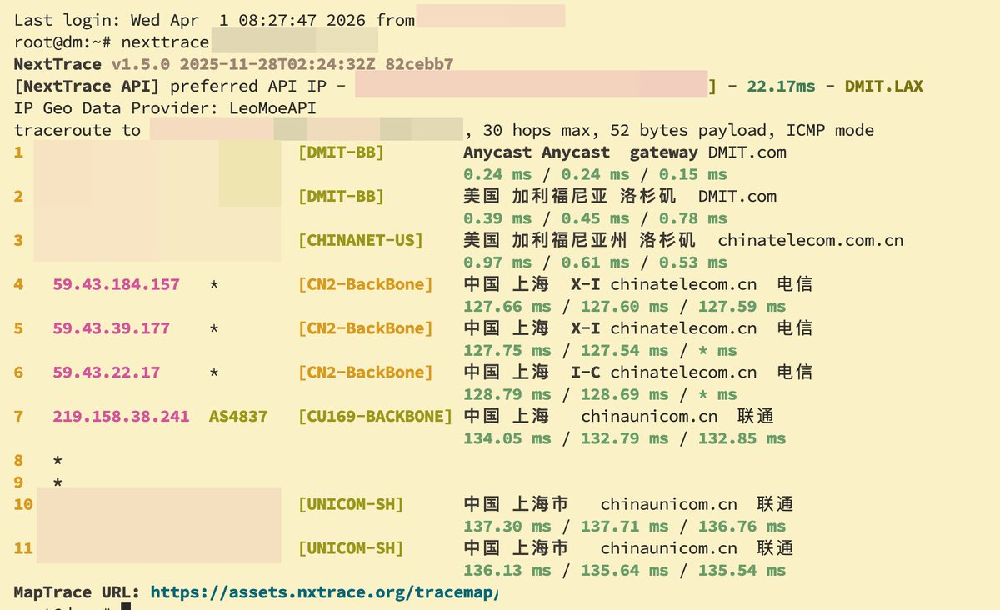
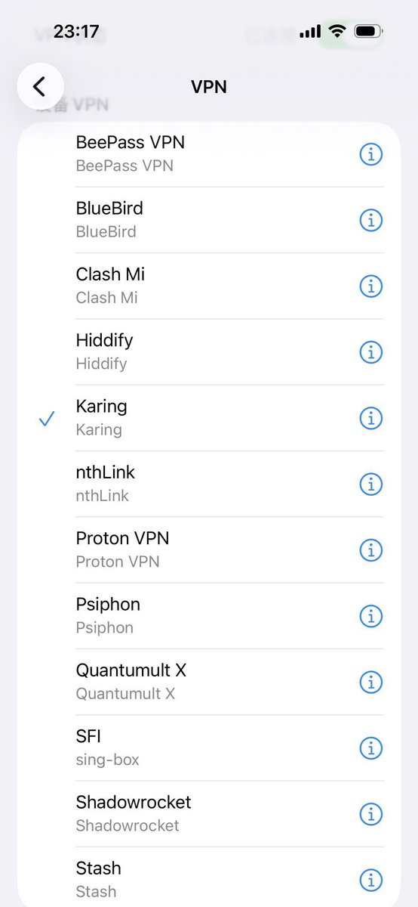

# 📰 我这些年科学上网的姿势

## 第一阶段：纯机场时代

刚开始接触科学上网，完全不懂技术，自然是从最省心的机场入手。那个年代机场圈还算繁荣，竞争激烈。

先后用过这几家：

rixCloud 算是比较早期有品牌意识的机场，界面做得不错，有自己的客户端，当时体验还算可以，算是入门级的"高端机场"。

Amy（按摩院） 奶昔的分厂，主攻亚太地区。

奶昔 算是有口碑积累的老牌机场，稳定性在当时口碑不错。

这个阶段最大的问题是：命运不由自己掌控。机场说跑路就跑路，说被墙就被墙，充了年费结果某天打开订阅就404，这种经历不止一次。加上高峰期晚上 8-11 点那个速度，真是一言难尽。

## 第二阶段：机场 + 自建（初尝试）

慢慢开始觉得纯依赖机场太被动，于是开始折腾自建。但这个阶段属于"主力还是机场，自建图个安心备用"的状态。

先后试过：

搬瓦工（BandwagonHost） 自建的启蒙选择，几乎是那个年代每个折腾VPS的人必经之路。CN2 GIA 线路在当时算是国内访问质量的天花板，延迟低、丢包少。搭 SSR/V2Ray，跑起来那一刻确实有种掌控感。缺点是贵，而且官网买套餐要抢，补货秒没。

搬瓦工（BandwagonHost）主要机房和线路

搬瓦工的核心价值在于线路，机器本身性能一般，选它就是选路由。

DC6 / DC9 — CN2 GIA洛杉矶机房，电信走 CN2 GIA 回国，是搬瓦工最经典的线路。CN2 GIA 属于电信的精品网，全程 59.43.x.x 段，优先级最高，晚高峰抗拥塞能力强。缺点是联通、移动走的是普通路由，非电信用户体验打折。

HKBN — 香港香港节点，回程走 CN2 GIA，延迟极低（广州方向约 10ms），但价格贵，且库存长期紧张，难抢。

JPOS — 日本大阪走软银（SoftBank）线路回国，对移动用户非常友好，移动有直连软银的海缆，延迟低且稳。

总结：搬瓦工适合电信用户重点考虑 DC6/DC9，移动用户可看 JPOS，联通用户其实搬瓦工并不算最优解。

DMIT 相比搬瓦工更小众一些，胜在线路选择更灵活，有 CN2 GIA、CMIN2 等多种接入，价格稍亲民，社区口碑一直不错，属于懂行的人才会去关注的服务商。

DMIT 主要机房和线路

DMIT 比搬瓦工更灵活，同一个机房经常提供多个线路套餐，按需选择空间更大。

LAX — 洛杉矶提供三个档次：

- Lite：普通线路，去程直连，回程走 AS4837（联通骨干），适合预算有限

- Standard（原 Pro）：去程 CN2 GIA，回程 CN2 GIA，三网都走精品网，全面均衡

- Premium（EB）：去程 CN2 GIA + CMIN2，回程针对三网分别优化，移动走 CMIN2，联通走 4837/CN2，电信走 CN2 GIA，是目前 DMIT 洛杉矶最顶配

HKG — 香港

- Premium：回程走 CN2 GIA，延迟极低，是自建党里香港节点的热门选择

- Lite：走普通 BGP，便宜但高峰期表现一般

TYO — 东京

- 提供 Premium 套餐，回程三网优化，移动直连效果尤其好

## 第三阶段：广港专线 / IX / 腾讯 BGP + 落地家宽

这个阶段算是质的飞跃，开始认真研究入口和落地这两个维度，而不只是随便找台 VPS 自建了事。

广港专线 即广州到香港的专用线路，走的是内地到香港之间的物理专线或优化路由，延迟极低（正常 10ms 以内），稳定性远超公网绕路。对于香港节点来说，这条路是体验天花板。

IX（Internet Exchange，互联网交换节点） 通过 IXP 对等互联接入，绕过运营商的公网拥塞点，直接在交换层面走高质量路由。理解这一层之后，选节点和选服务商的逻辑就完全不一样了，开始会看 BGP 路由、AS 号这些东西。

腾讯 BGP 利用腾讯云等大厂 BGP 网络作为中转入口，依托大厂对三网（电信/联通/移动）的优化能力，解决了国内不同运营商访问质量不一致的问题。大厂 BGP 的 IP 段本身不容易被墙，稳定性也比普通 VPS 强得多。

落地家宽 这是整个链路里最有意思的一环。海外落地从机房 IP 换成住宅 IP（家宽），适合一些特殊场景使用。

这个阶段的核心思路已经从"找一台能用的服务器"升级成了：精心设计一条完整的链路——国内优质入口 → 中转层 → 海外优质落地，每一段都要单独优化。

## 专线的路由逻辑——到底过不过防火墙？

这是很多人容易搞混的地方，理解路由层面的差异，才能真正理解为什么"专线"体验不一样。

1. 普通 VPS 自建的路由路径

> 你的设备 → 国内运营商公网 → GFW 检测 → 海外公网 → 目标服务器

流量走的是公共互联网，每一个包都要经过 GFW 的检测节点。协议混淆（XTLS、REALITY 等）的作用就是让流量在这一段看起来像正常 HTTPS，降低被识别和干扰的概率。本质上还是在过防火墙，只是尽量"伪装通过"。

2\.     IEPL 的路由路径

IEPL（International Ethernet Private Line，国际以太网专线） 是运营商之间签订的物理或逻辑专用链路，数据走的是独立于公共互联网的专用通道。

> 你的设备 → 国内接入点（专线入口） → IEPL 专用通道 → 海外落地点 → 目标服务器

关键在于：这条通道不经过 GFW。

GFW 的检测部署在公共互联网出口，而 IEPL 绕过了这些出口节点，走的是运营商间的专用互联链路。所以 IEPL 节点的特点是：

- 不需要协议混淆，用最简单的 SS 也能稳定跑

- 延迟极低且极稳定，几乎没有晚高峰波动

- 被封的风险极低，因为 GFW 根本看不到这条链路

代价是成本极高，IEPL 带宽按 Mbps 向运营商租用，价格远高于普通 VPS，所以机场卖 IEPL 节点的套餐普遍偏贵，且往往限速或限流量。

3\.     IX 的路由路径——与真实 IEPL 的差异

IX（Internet Exchange，互联网交换节点） 在名字和宣传上经常和 IEPL 混用，但路由逻辑有本质区别，需要单独说清楚。

IX 的路径大致是：

> 你的设备 → 国内大厂云网 → IXP 交换节点 → 出口落地

与 IEPL 的核心差异在于：

IX 的国内段只能走国内大厂机器作为入口，通过内网到达IX接入点完成交换，再经过专线落地。

这意味着：

- 国内出境段需要有前置机，前置机与IX入口走云厂内网。

- 不过墙，意味着你的落地机可以直接用ss协议

- 你的带宽上限受限于你的前置机

- 你需要单独购买前置机

几个需要注意的点，你的落地机使用什么协议取决于是否过墙。

## 我目前在使用的

1、机场

仅存eNet一家，不限时的500G流量，完全做备用。

2、线路机

DMIT Malibu ，一年$49，三网去回均走电信CN2，每月流量1T(双向)

DMIT Corona，一年$49，三网各自优化，每月流量2T(双向)

3、专线机

po0 腾讯华东入口，年付1180，200m带宽，每月流量500G(单向)。

你可以理解成是包含了前置机的IX，只不过这是满血版的腾讯锐驰套餐的前置机。正常你在腾讯云买的锐驰只是峰值带宽200m，你如果长时间跑，很快就会被限速，而这个不会。

目前po0为主打方案，入口机直接nftables内核转发到RFC的JPT1和HKT1，相当于同时拥有了沪日专线与沪港专线。

4、落地家宽

- Boil 家里云，现在基本上没有使用了，注意是港机限制还是有点多，AI不能用。从一个月$9起价，同时还有很多绝版套餐，比如季付297、半年付777等。

- vircs，AT&T落地，50m带宽，流量不限，$276/年，主要做AI分流、PayPal分流。用DMIT做中转相当丝滑。

## 如何看你的vps路由

安装nexttrace

\`\`\`bash
curl -sL &lt;https://nxtrace.org/nt&gt; \| bash

nexttrace 你的ip
\`\`\`

下图是DMIT Malibu回程的路由，可以看到直连无绕路，直接从LA走CN2回国。

## 💬 Replies

### 1 @HelloMrYEE (𝗠𝗿𝗬𝗘𝗘) (Author)

*Sat Apr 04 01:53:52 +0000 2026*

x的文章编辑太难用了，动不动输入没响应。

### 2 @funfan9527 (funfan)

*Sat Apr 04 03:25:38 +0000 2026*

@HelloMrYEE 学习了。一看自建价格，还是继续买机场。

### 3 @HelloMrYEE (𝗠𝗿𝗬𝗘𝗘) (Author)

*Sat Apr 04 03:34:39 +0000 2026*

@funfan9527 这个看需求

### 4 @Gin2e (B2epW)

*Sat Apr 04 04:20:41 +0000 2026*

@HelloMrYEE 回忆起在rix还没垮台的年代我也是学习了博大精深的网络知识，后来我肉翻了，功力也是一落千丈🤣

### 5 @HelloMrYEE (𝗠𝗿𝗬𝗘𝗘) (Author)

*Sat Apr 04 04:21:33 +0000 2026*

@Gin2e rix当年可是出名的，一言不合就踢人

### 6 @liuwen211 (2222)

*Sat Apr 04 03:31:04 +0000 2026*

@HelloMrYEE 

### 7 @HelloMrYEE (𝗠𝗿𝗬𝗘𝗘) (Author)

*Sat Apr 04 03:53:37 +0000 2026*

@liuwen211 你这客户端有点多啊

### 8 @Quentin13170 (地中海)

*Sat Apr 04 05:41:00 +0000 2026*

@HelloMrYEE 看完了，感觉好复杂啊，我自己目前做美区的tiktok运营，对于ip和线路有着很高的要求，请问如果我要学习搭建的话，该从哪里开始呢？谢谢

### 9 @HelloMrYEE (𝗠𝗿𝗬𝗘𝗘) (Author)

*Sat Apr 04 06:18:24 +0000 2026*

@Quentin13170 TikTok对网络要求比较严格，一台美国家宽是必不可少了。
然后加一台DMIT做中转服务器就行了，记得做好分流，将TikTok对流量全部分到这台家宽。
搭建有两种方案：
1、DMIT装vless+reality，家宽装ss，客户端用链式代理。
2、DMIT只装reaml，家宽装vless+reality，DMIT只做流量转发

### 10 @l11lll1ll (AAA义乌情趣内衣专卖王姨)

*Sat Apr 04 07:33:18 +0000 2026*

@HelloMrYEE 大佬，落地家宽是什么意思？

### 11 @HelloMrYEE (𝗠𝗿𝗬𝗘𝗘) (Author)

*Sat Apr 04 07:51:14 +0000 2026*

@realsmallSB 就是落地机，只不过是家庭宽带，非IDC机房的

### 12 @bigmiaomiao1 (BigMiaoMiao)

*Sun Apr 05 03:28:11 +0000 2026*

这篇文章看了两遍，理清了不少疑惑，最近看大量拔线，虽然自用的机场暂未波及，但自己也想建一个。
请教几个问题：不想搞复杂，以及节约成本，只用 DMIT一台主机够吗？纯DMIT的一个纠结点在于 ，AI 可能降智，以及一些平台对机房IP的风控。另外就是虽然看着带宽很高，但毕竟不是专线，不知道纯DMIT高峰期的速度怎么样？
我看还有一种方案，一些自带家宽落地的VPS，似乎解决了风控的问题，但这类主机好像带宽都一般就 100/200 M，便宜点的 100 M我感觉是不够用的，而且这类方案也稍贵些。
所以，年付预算控制在 700 以内，有没有好的方案推荐？最好能兼顾速度和纯净度的问题🙏谢谢

### 13 @HelloMrYEE (𝗠𝗿𝗬𝗘𝗘) (Author)

*Sun Apr 05 03:42:35 +0000 2026*

@bigmiaomiao1 1、单dmit不做AI是够用的，优化路线在晚高峰表现也不差，毕竟专线带宽是有限。
2、提供家宽落地的vps是双ISP吧？这种我没有用过，不确定会不会降智。至于带宽方面我倒是没有太大要求，我的美国落地才50m带宽。
年付700配合非nat家宽有点紧张了。

### 14 @spriteray (Ryan Zhang)

*Sun Apr 05 06:01:18 +0000 2026*

@HelloMrYEE 大神，po0屏蔽443,80,做接入是不是有问题啊

### 15 @HelloMrYEE (𝗠𝗿𝗬𝗘𝗘) (Author)

*Sun Apr 05 06:11:20 +0000 2026*

@spriteray 你说的接入是指？不要用80和443啊

### 16 @spriteray (Ryan Zhang)

*Thu Apr 09 15:15:36 +0000 2026*

@HelloMrYEE 大神，我用po0+rfc+家宽nat，搭建完成，如果家宽用ss，总会时不时的dns污染，改成vless后好多了，是我ss搞得有问题吗？

### 17 @HelloMrYEE (𝗠𝗿𝗬𝗘𝗘) (Author)

*Fri Apr 10 00:00:03 +0000 2026*

@spriteray 客户端做DNS分流
DNS泄漏主要是DNS解析，你要是Google或是CF的那肯定是没问题的，但这个访问国内就很慢了，你需要混合使用

### 18 @08Scour (贾岛DAO)

*Sat Apr 04 03:30:28 +0000 2026*

@HelloMrYEE 能说说买了po0之后的路线吗？直接落地家宽还是找其他中转？

### 19 @HelloMrYEE (𝗠𝗿𝗬𝗘𝗘) (Author)

*Sat Apr 04 03:32:32 +0000 2026*

@08Scour po0目前只能走rfc的机器出，没有特别需求rfc落地就行了，如果需要家宽落地，那只能在rfc上再走一层转发
po0-rfc-你的落地

### 20 @quanSAIDYT (chuan)

*Sun Apr 05 05:08:21 +0000 2026*

@HelloMrYEE 这个就叫专业

### 21 @Boss_MissCorgi (Mr.Corgi)

*Sat Apr 04 13:34:01 +0000 2026*

@HelloMrYEE 先收藏 我来研究下 再请教（不白嫖）☺️

### 22 @uutrkk (uu)

*Sun Apr 05 19:14:36 +0000 2026*

@HelloMrYEE 你妈了个bbbbb AI写的还让我看到了浪费我时间

