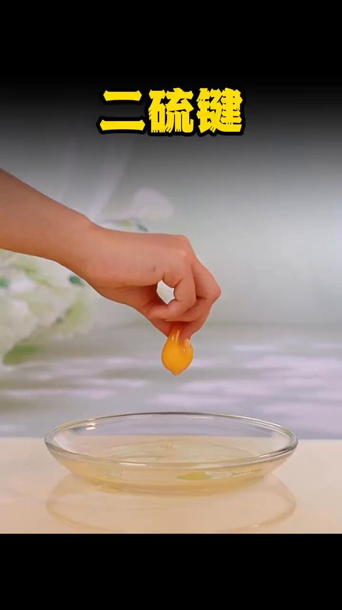
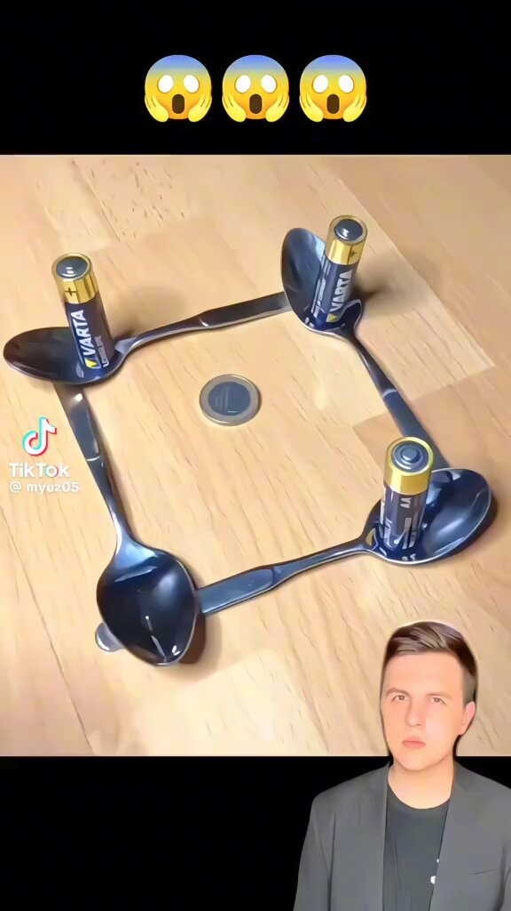

有趣的科学小实验 

## 💬 Replies

### 1 @369Jessica369 (🌹MIDNIGHT🌹ROSE🌹) (Author)

*Fri May 08 07:14:53 +0000 2026*

带你家娃一起玩 

### 2 @WinnieXisDaddy (习仲勋)

*Sat May 09 07:44:29 +0000 2026*

@369Jessica369 你妈的敲啤酒瓶翘出链式反应

### 3 @Snowheartkpdp (梦霖女s北京)

*Sat May 09 12:34:30 +0000 2026*

@369Jessica369 鸡蛋摩擦力亲测有效，友情提醒，下边放个软垫。碎了两个鸡蛋了

### 4 @xenonexy (XenonCat🇦🇺🇺🇸)

*Sat May 09 07:53:15 +0000 2026*

@369Jessica369 乌鸦说你傻b吧，我放的是石子啊 

### 5 @Dafoo_Elvis (Elvis Cat)

*Sat May 09 02:37:24 +0000 2026*

@369Jessica369 @mike95271314 给你儿子找乐子哈

### 6 @dearjasper97 (雾明)

*Sat May 09 01:05:02 +0000 2026*

@369Jessica369 一點原理都不說啊

### 7 @huazhan67110623 (hua zhang)

*Sat May 09 11:17:07 +0000 2026*

@369Jessica369 请问什么叫链式反应

### 8 @muwind666 (The starry sky is not lonely)

*Fri May 08 18:19:46 +0000 2026*

@369Jessica369 🧐🧐🧐

### 9 @4asd165846 (4asd)

*Sat May 09 07:01:21 +0000 2026*

@369Jessica369 有用

### 10 @Drake_413 (Drake)

*Sat May 09 17:31:14 +0000 2026*

@369Jessica369 学习了

