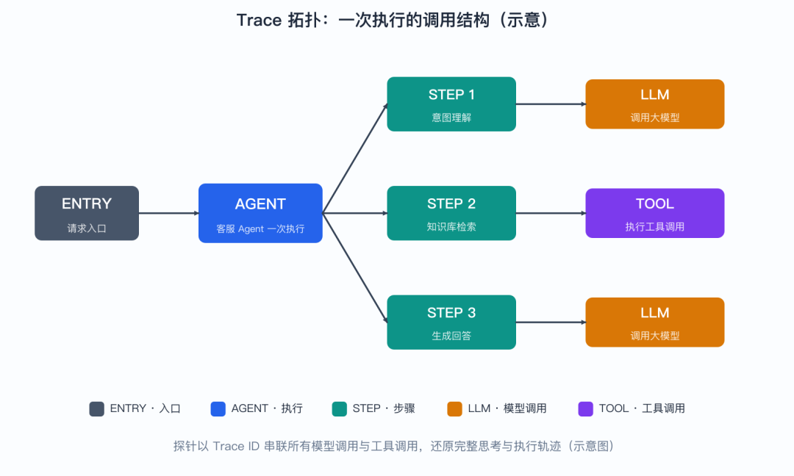
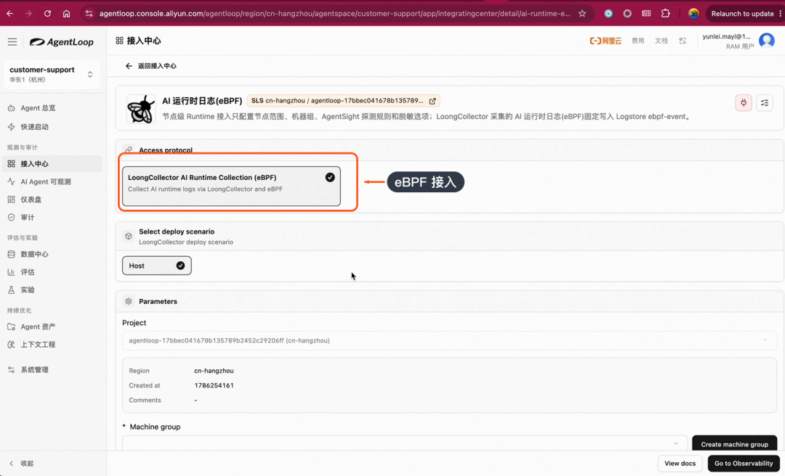
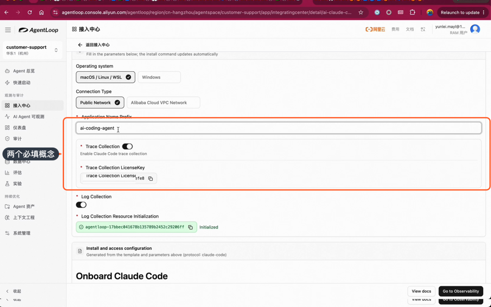
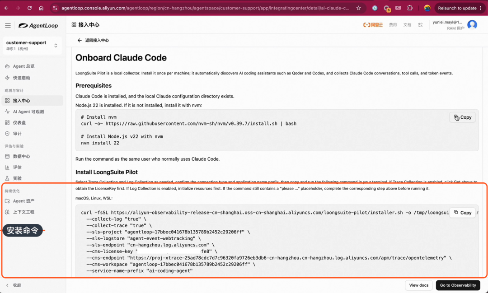
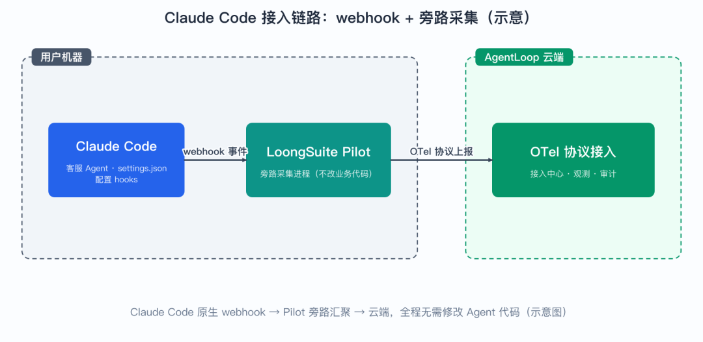
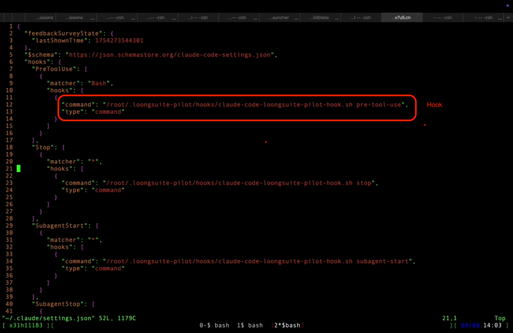
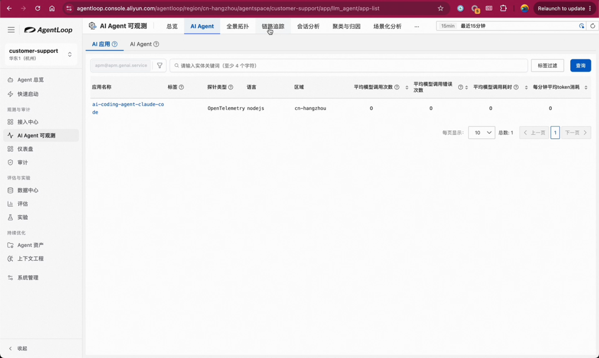

# 📰 数据飞轮的起点：四种方式把 Agent 连进 AgentLoop丨AgentLoop 数据飞轮实践（二）

>
>
> AgentLoop 数据飞轮实践系列 · 第 2 篇 / 共 5 篇：  
>
>
>
>
> 上一篇：[总览 —— 让 Agent 持续调优的闭环](https://mp.weixin.qq.com/s?__biz=MzUzNzYxNjAzMg==&mid=2247586323&idx=1&sn=8f138a1453c038b08c4b5dd796b60e6b&scene=21#wechat_redirect)/ 下一篇：评估 —— 从黄金指标到 Rubric
>
>

数据接入是数据飞轮的起点：没有高质量的运行数据，观测、评估、实验都无从谈起。但“把数据接上来”这件事本身并不简单——Agent 不像传统微服务只有一种调用形态，它可能是开箱即用的通用 Agent，可能是基于框架研发的，可能是高代码自研的，甚至可能完全不想改一行代码。

这一篇讲清楚两件事：智能体观测与优化平台 AgentLoop 的数据接入能力是怎么设计的（为什么四种形态的 Agent 都能接），以及如何亲手把一个基于 Claude Code 的 Agent 接入平台。

### 01

### 技术底座：OTel 协议+探针

*Cloud Native*

AgentLoop 的数据接入构建在 OTel（OpenTelemetry）标准协议之上，以探针的形式工作：

图 1：基于 OTel 标准协议的探针接入

探针会把 Agent 里各个调模型的地方、调工具的地方都以 Trace ID 的形式串联起来，并且把上下文的依赖关系完整串联，形成一张 Trace 拓扑图：

图 2：Trace 拓扑：探针以 Trace ID 串联模型调用与工具调用，

还原完整执行轨迹（示意图，依据演示描述绘制）

在此基础上，再基于拓扑图组装出 Agent 完整的思考和执行轨迹。

选择 OTel + 探针不是偶然：OTel 是可观测性领域的事实标准，意味着接入不锁定、数据可互通；而探针是打磨了十多年的数据采集技术，能在不侵入业务逻辑的前提下把程序里各个角落的数据串联起来——这是整个接入能力的核心竞争力。选标准协议做底座，本质上是在保证：今天接进来的数据，未来任何基于 OTel 的生态都能消费。

### 02

### 四种接入方式

*Cloud Native*

Agent 的形态千差万别，一套接入方式不可能通吃。针对不同形态的 Agent，AgentLoop 提供四种接入方式：

### ▍**1. 通用 Agent：一键对接** ###

针对常见的通用 Agent，AgentLoop 做了专业化的埋点，可以直接一键对接。如果你用的就是这类开箱即用的通用 Agent，不需要任何开发工作，直接采用这种方式即可。

### ▍**2. Agent 框架：SDK 集成** ###

如果 Agent 是基于 AgentScope 这类 Agent 框架研发的，直接通过集成方式就能快速完成数据的对接和上报：

图 3：基于 AgentScope 框架的 Agent 通过集成方式接入

框架集成的好处是埋点跟着框架走：框架知道模型调用、工具调用发生在哪，SDK 在这些关键位置自动完成采集，开发者几乎无感。

### ▍**3. 自定义高代码：注解埋点** ###

高代码场景（包括用 AI-coding 方式自研的 Agent）可以引用 AgentLoop 的依赖包，在程序里需要埋点的地方用注解的方式采集数据，上报到云端：

图 4：自定义高代码接入：依赖包 + 注解方式采集

这种方式把埋点位置的控制权交还给开发者：哪段逻辑需要观测，就在哪里加注解。值得一提的是，现在采用 AI-coding 方式开发的话，加几行埋点代码的成本非常低，高代码接入实际上也很简单。

### ▍**4. eBPF：无侵入** ###

如果完全不想改代码，可以用 eBPF 方案——通过内核级的监控，无需修改任何代码即可对接。它能够观测到 Agent 与模型网关之间的交互、执行工具过程中的指令，同时覆盖模型调用和 Agent 执行的观测：

图 5：eBPF 无侵入接入：内核级监控

eBPF 工作在内核层，采集对应用完全透明——适合存量系统、无法改动的闭源组件，或者就是想先看看数据再决定怎么埋点的场景。

小结：探针方式覆盖通用 Agent、Agent 框架、自定义高代码三类场景；eBPF 作为无侵入兜底。四种方式不是互斥的选择题，而是按你的 Agent 形态和改造意愿选择成本最低的一条路。

### 03

### 两个关键概念：

### Service Name 与 License Key

*Cloud Native*

接入时有两个必填概念。所有数据都在同一个 AgentSpace（workspace）之下，那么怎么区分数据从哪个应用来、是谁上报的？答案就是这两个字段：

图 6：Service Name 区分应用，License Key 用于鉴权

* Service Name：同一个 AgentSpace 下，用 Service Name 区分不同的应用、区分来源是哪一种 Agent。可以为不同的 Agent 取不同的名字。它是数据的“归属标识”——后续观测、评估按 Service Name 圈定范围；

* License Key：用于数据鉴权——上报数据时需要 License Key 做身份标识和鉴权。它是数据的“通行证”，没有它数据报不上来。

### 04

### 实操：接入 Claude Code

### 构建的客服 Agent

*Cloud Native*

概念讲完，动手。演示用的客服 Agent 是 AgentLoop 自身的一个 Agent，基于 Claude Code / Claude Agent SDK 构建。这种 Agent 有两种接入方式：

## 1. 探针方式 接入；

## 2. Claude Code webhook 方式——从 Claude Code 支持的 webhook 把数据发出来。

本次演示采用更原生的 webhook 方案，配合 LoongSuite Pilot 完成接入。

### ▍**步骤 1：获取 License Key，执行安装命令** ###

先在控制台获取 License Key，然后执行安装命令：

图 7：在机器上执行安装命令，部署 LoongSuite Pilot

安装命令会在机器上先装一个依赖，再部署采集组件。整个过程只需要这一条命令。

### ▍**步骤 2：理解采集工作机制** ###

整个采集机制是：安装一个 LoongSuite Pilot——它是一个旁路进程；Claude Code 的配置里加了一些 webhook，会把相关信息发送到 Pilot 进程，再由 Pilot 上报到云端：

图 8：采集链路：Claude Code 经 webhook 发送到

LoongSuite Pilot 旁路进程，再上报云端（示意图）

“旁路”是这个设计的关键词：Pilot 不在 Agent 的执行路径上，采集的开销和故障都不会影响 Agent 本身——数据发不出去时，Agent 照常工作。

### ▍**步骤 3：拷贝配置并重启 Agent** ###

安装完成后，hooks 已经配置在 settings.json 里：

图 9：settings.json 里已安装好 hooks

注意：这是 Claude Code 默认的配置文件，安装时会默认装到默认目录。我们需要把它拷贝到自己 Agent 的安装目录下面，然后重启 Agent，让 hooks 生效。这一步容易踩坑——忘了拷贝或忘了重启，数据就不会上报。

### ▍**步骤 4：测试并到观测页验证** ###

重启后做一次测试，Agent 正常响应。接着到观测页面确认数据是否上报：

图 10：观测页已能看到上报的数据

数据已经上报上来了。点开链路明细，可以看到完整的执行链路，包括大模型的处理步骤：

图 11：链路明细中可见大模型处理步骤

能看到大模型处理这一步，说明探针把模型调用也串进来了——不只是工具调用。至此，数据接入流程全部完成：从执行一条安装命令，到观测页看到完整链路，前后不到十分钟。接入打通之后，飞轮就有了持续的数据供给，下一篇进入“Agent 跑得怎么样”。

### 05

### 小结

*Cloud Native*

----------

|      要点      |                       说明                       |
|:-------------|:-----------------------------------------------|
|     协议底座     |         OTel 标准协议 + 探针，Trace ID 串联全链路          |
|     四种方式     | 通用 Agent 一键对接 / Agent 框架集成 / 高代码注解 / eBPF 无侵入  |
|     两个概念     |       Service Name（区分应用）、License Key（鉴权）       |
|Claude Code 实操|webhook + LoongSuite Pilot 旁路进程，拷贝 settings、重启生效|
|     验证方式     |                 观测页查看上报数据与链路明细                 |

---

下一篇预告：数据进来之后，下一步是回答“Agent 跑得怎么样”。我们将定义客服场景的黄金指标，让 AI 帮忙拆解成 Rubric，创建评估器并跑通第一个评估任务。

